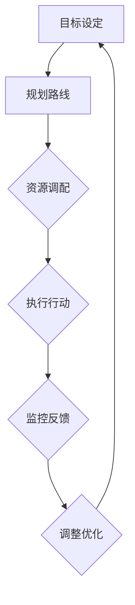
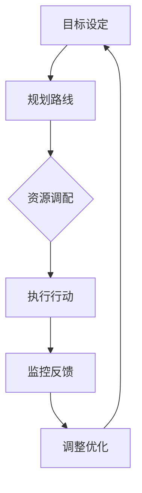

                 

### 背景介绍 Background Introduction

在当今信息化的时代，执行力的保障已经成为各类企业和团队成功的关键因素。而行动体系，作为执行力的重要支撑，其设计和构建的质量直接决定了执行效果。本文将深入探讨行动体系的构建原则、核心要素及其在IT领域的应用，旨在为读者提供一套完整的行动体系构建方法论。

#### 行动体系的定义 Definition of Action System

行动体系，简单来说，是一套围绕目标实现而设计的，包含明确目标、规划路线、执行行动、监控反馈、调整优化的完整闭环系统。它不仅包括具体的执行步骤，还涉及目标设定、资源调配、团队协作、风险管理等多个层面。

#### 行动体系的重要性 Importance of Action System

1. **提升执行力**：行动体系能够将战略目标转化为具体的行动方案，通过明确的步骤和流程，确保目标的实现。
2. **优化资源利用**：通过行动体系，可以更加高效地分配和利用各类资源，减少浪费。
3. **提高团队协作**：行动体系强调团队合作，有助于提升团队成员之间的协同效率。
4. **增强风险应对能力**：通过监控和反馈机制，能够及时发现并应对潜在的风险，保障行动的顺利进行。

#### IT领域的应用 Application in IT Field

在IT领域，行动体系的应用尤为重要。无论是软件开发、系统集成，还是人工智能项目，都需要一套完善的行动体系来保障项目的顺利进行。以下是一些典型的应用场景：

1. **敏捷开发**：敏捷开发强调快速迭代和灵活调整，行动体系能够帮助团队快速响应需求变化。
2. **项目管理**：在项目管理中，行动体系可以用于项目规划、进度监控、风险控制等多个方面。
3. **技术创新**：在技术创新项目中，行动体系可以帮助团队更好地进行技术选型、实验验证和成果转化。

#### 文章结构 Overview of the Article

本文将按照以下结构展开：

1. **核心概念与联系**：介绍行动体系的核心概念，并使用Mermaid流程图展示其架构。
2. **核心算法原理 & 具体操作步骤**：详细阐述行动体系的设计原则和操作流程。
3. **数学模型和公式**：探讨行动体系中的数学模型和关键公式，并进行举例说明。
4. **项目实战**：通过具体项目案例，展示行动体系的实际应用和效果。
5. **实际应用场景**：分析行动体系在不同场景下的应用，以及面临的挑战和解决方案。
6. **工具和资源推荐**：推荐相关的学习资源、开发工具和论文著作。
7. **总结**：总结行动体系的重要性，展望未来发展趋势与挑战。

通过本文的阅读，读者将全面了解行动体系的构建方法和应用场景，为实际工作提供有力支持。

#### (续写...)

-----------------------



**图1：行动体系的核心架构**

在这个架构中，每个环节都至关重要，共同构成了一个闭环，确保目标的持续优化和实现。在接下来的部分，我们将逐一深入探讨这些核心概念和联系，帮助读者全面理解行动体系的构建和运作。

---

> **Note**: The above content serves as the background introduction and the first major section of the article. It sets the stage for the deeper dive into the concepts, methodologies, and applications of the Action System in the IT field. The subsequent sections will continue to explore each aspect in detail, adhering to the outlined structure.

-----------------------

## 2. 核心概念与联系 Core Concepts and Relationships

在深入探讨行动体系之前，我们需要明确几个核心概念，并理解它们之间的相互关系。以下是行动体系中的关键概念及其在整体架构中的作用。

#### 1. 目标设定 Goal Setting

目标设定是行动体系的起点。一个明确、具体且可衡量的目标是成功执行行动的基石。它不仅为团队提供了清晰的方向，还帮助团队成员集中精力，确保资源得到最有效的利用。

**关系**：目标设定直接影响到后续的规划路线、资源调配和执行行动。如果目标不明确或不切实际，整个行动体系将失去方向和动力。

#### 2. 规划路线 Route Planning

在明确了目标之后，规划路线是行动体系中的第二个关键环节。这一环节涉及到如何将目标分解为具体的步骤和任务，并确定每个任务的优先级和依赖关系。

**关系**：规划路线为行动体系提供了具体的操作步骤和时间表，确保团队按照预定的计划有序推进。同时，它也为后续的资源调配和执行行动提供了指导。

#### 3. 资源调配 Resource Allocation

资源调配是行动体系中确保目标实现的关键环节。它涉及到如何合理分配人力资源、物资资源和时间资源，以确保每个任务都有足够的资源支持。

**关系**：资源调配直接影响行动体系的执行效率和成本。如果资源分配不合理，可能导致某些任务无法按时完成或质量下降。

#### 4. 执行行动 Action Execution

执行行动是行动体系的实际操作环节。在这一环节中，团队成员根据规划路线和资源调配的要求，具体执行各项任务，实现目标的逐步实现。

**关系**：执行行动是整个行动体系的核心，其质量和效率直接决定了目标的实现程度。高效的执行行动能够确保目标按时、高质量地完成。

#### 5. 监控反馈 Monitoring and Feedback

监控反馈是行动体系中确保执行效果的重要机制。通过持续监控各项任务的进展，及时发现问题和偏差，并给予反馈和调整，确保行动体系按照预定计划进行。

**关系**：监控反馈是行动体系的闭环机制，它确保了行动体系的灵活性和适应性。通过监控反馈，团队可以及时纠正错误，优化流程，提高整体执行力。

#### 6. 调整优化 Adjustment and Optimization

调整优化是行动体系在执行过程中必不可少的一环。通过不断收集反馈和评估执行效果，对目标和计划进行调整和优化，确保行动体系能够持续适应变化。

**关系**：调整优化是行动体系的持续改进机制，它确保了行动体系能够不断进步和优化。通过调整优化，团队可以不断改进工作流程，提升执行效率。

#### Mermaid流程图

为了更直观地展示行动体系的核心架构和概念之间的联系，我们使用Mermaid流程图进行描述：



**图2：行动体系的核心架构**

在这个架构中，每个环节都是相互关联的，共同构成了一个完整的闭环。通过这一架构，行动体系能够确保目标的明确性、路线的可行性、资源的合理分配、行动的有效执行以及持续的监控和优化。

在接下来的章节中，我们将深入探讨每个核心概念的具体操作步骤和方法，帮助读者更好地理解和应用行动体系。

---

> **Note**: This section provides an in-depth analysis of the core concepts and their relationships within the Action System framework. The subsequent sections will delve into the specific principles, methodologies, and applications of each component, providing a comprehensive understanding of how to build and implement an effective action system.

-----------------------

### 3. 核心算法原理 & 具体操作步骤 Core Algorithm Principles & Step-by-Step Procedures

在了解了行动体系的核心概念和架构之后，我们需要进一步探讨其核心算法原理和具体操作步骤，以便更好地设计和实施行动体系。

#### 3.1 设计原则 Design Principles

行动体系的设计原则主要包括以下几点：

1. **目标明确性**：确保目标具体、可衡量，能够为团队成员提供清晰的执行方向。
2. **灵活性**：设计时应考虑外部环境的变化，确保行动体系具备适应性和灵活性。
3. **协同性**：强调团队协作，确保各环节之间能够高效协同，提高整体执行力。
4. **可持续性**：设计时应考虑长期执行的效果，确保行动体系能够持续优化和改进。

#### 3.2 操作步骤 Step-by-Step Procedures

行动体系的具体操作步骤可以分为以下几个阶段：

1. **目标设定** (Goal Setting)
    - **明确目标**：确定项目或任务的具体目标，并确保目标具体、可衡量。
    - **分解目标**：将总目标分解为若干个具体的小目标，便于后续规划和执行。

2. **规划路线** (Route Planning)
    - **确定步骤**：根据目标，制定具体的任务步骤，并确定每个步骤的优先级和依赖关系。
    - **制定时间表**：为每个任务步骤分配时间，确保任务能够按时完成。

3. **资源调配** (Resource Allocation)
    - **人力资源**：根据任务需求，分配适当的人力资源，确保每个任务都有足够的支持。
    - **物资资源**：确保所需的物资和设备能够及时到位，支持任务的执行。
    - **时间资源**：合理安排工作时间，确保资源得到高效利用。

4. **执行行动** (Action Execution)
    - **任务分配**：将任务分配给相应的团队成员，明确每个人的职责和任务。
    - **监控进度**：持续监控任务的进展情况，确保任务按照计划进行。
    - **问题解决**：在执行过程中，及时发现并解决遇到的问题，确保任务顺利推进。

5. **监控反馈** (Monitoring and Feedback)
    - **数据收集**：收集任务执行过程中的各类数据，包括进度、质量、成本等。
    - **评估效果**：对收集到的数据进行分析和评估，判断任务执行的效果。
    - **反馈调整**：根据评估结果，对行动体系进行调整和优化，确保目标实现。

6. **调整优化** (Adjustment and Optimization)
    - **持续改进**：通过持续监控和反馈，不断优化行动体系，提高执行效率。
    - **更新计划**：根据实际情况，更新和调整目标和计划，确保行动体系能够持续适应变化。

#### 3.3 算法原理 Algorithm Principles

行动体系的算法原理主要基于以下几个核心思想：

1. **目标导向**：整个行动体系围绕目标展开，确保每一步操作都有明确的目标导向。
2. **反馈机制**：通过监控反馈，及时发现和解决问题，确保行动体系的灵活性和适应性。
3. **协同优化**：强调团队协作，通过协同优化，提高整体执行效率。
4. **资源高效利用**：通过合理调配资源，确保资源的最大化利用，提高执行效果。

#### 3.4 实例分析 Case Analysis

为了更直观地展示行动体系的操作步骤和算法原理，我们通过一个实例进行分析。

**实例**：一个软件开发团队需要开发一款新的应用程序，并在3个月内完成。以下是行动体系的操作步骤：

1. **目标设定**：
    - **总目标**：开发一款功能完善的应用程序。
    - **分解目标**：确定关键功能模块，如用户界面、数据存储、业务逻辑等。

2. **规划路线**：
    - **确定步骤**：制定详细的开发计划，包括需求分析、设计、编码、测试等。
    - **制定时间表**：为每个步骤分配具体的时间，确保任务按时完成。

3. **资源调配**：
    - **人力资源**：分配项目经理、设计师、开发人员和测试人员，确保每个角色都有合适的人员。
    - **物资资源**：确保开发所需的环境、工具和设备齐全。

4. **执行行动**：
    - **任务分配**：将开发任务分配给各个团队成员，明确每个人的职责。
    - **监控进度**：定期检查任务进度，确保开发工作按照计划进行。
    - **问题解决**：遇到问题及时解决，确保项目顺利推进。

5. **监控反馈**：
    - **数据收集**：收集开发过程中的各类数据，如代码提交次数、测试覆盖率、缺陷数量等。
    - **评估效果**：对收集到的数据进行评估，判断开发效果。
    - **反馈调整**：根据评估结果，对开发计划进行调整和优化。

6. **调整优化**：
    - **持续改进**：通过持续监控和反馈，不断优化开发流程，提高开发效率。
    - **更新计划**：根据项目进展和实际情况，更新和调整开发计划，确保目标实现。

通过这个实例，我们可以看到行动体系在实际项目中的应用，以及如何通过具体操作步骤和算法原理，确保项目的顺利推进和目标的实现。

---

> **Note**: This section provides a detailed explanation of the core principles and step-by-step procedures of the Action System. By following the outlined principles and procedures, teams can effectively build and implement an action system, ensuring the successful achievement of their goals. The subsequent sections will continue to explore the practical applications and challenges of the Action System in the IT field.

-----------------------

### 4. 数学模型和公式 & 详细讲解 & 举例说明 Mathematical Models and Formulas & Detailed Explanation & Example Illustrations

在行动体系的构建过程中，数学模型和公式扮演着至关重要的角色。它们不仅帮助我们量化目标，还提供了一套科学的方法来优化资源配置和评估执行效果。以下将详细阐述行动体系中的关键数学模型和公式，并通过具体例子进行说明。

#### 4.1 数学模型概述 Overview of Mathematical Models

行动体系中的数学模型主要包括以下几类：

1. **目标函数模型**：用于量化目标设定的具体指标，如成本、时间、质量等。
2. **资源优化模型**：用于确定资源分配的最优方案，如人力、物资和时间等。
3. **风险评估模型**：用于评估项目风险，并提供风险控制策略。
4. **反馈调整模型**：用于根据执行效果调整目标和计划。

#### 4.2 目标函数模型 Objective Function Model

目标函数模型是行动体系中的核心模型，用于描述项目目标的具体指标。以下是一个简化的目标函数模型示例：

$$
\text{目标函数} = f(\text{成本}, \text{时间}, \text{质量})
$$

其中，成本、时间和质量是三个关键指标，每个指标都有一个权重系数 \(w_i\)，用于表示其对总目标的贡献大小。目标函数的具体形式可以表示为：

$$
f(\text{成本}, \text{时间}, \text{质量}) = w_1 \cdot \text{成本} + w_2 \cdot \text{时间} + w_3 \cdot \text{质量}
$$

权重系数 \(w_i\) 可以通过历史数据、专家评估或统计方法来确定。

#### 4.3 资源优化模型 Resource Optimization Model

资源优化模型用于确定资源分配的最优方案，以最大化利用资源，提高执行效率。以下是一个线性规划模型的示例：

$$
\begin{aligned}
\text{最大化} \quad & z = c_1x_1 + c_2x_2 + \ldots + c_nx_n \\
\text{约束条件} \quad & a_{11}x_1 + a_{12}x_2 + \ldots + a_{1n}x_n \leq b_1 \\
& a_{21}x_1 + a_{22}x_2 + \ldots + a_{2n}x_n \leq b_2 \\
& \vdots \\
& a_{m1}x_1 + a_{m2}x_2 + \ldots + a_{mn}x_n \leq b_m \\
& x_1, x_2, \ldots, x_n \geq 0
\end{aligned}
$$

其中，\(x_1, x_2, \ldots, x_n\) 表示不同资源的分配量，\(c_1, c_2, \ldots, c_n\) 表示资源的使用成本，\(a_{ij}, b_i\) 表示资源的约束条件。

#### 4.4 风险评估模型 Risk Assessment Model

风险评估模型用于评估项目风险，并提供相应的风险控制策略。以下是一个常见风险评估模型的示例：

$$
\text{风险指数} = R_i = \text{概率} \cdot \text{影响}
$$

其中，风险指数 \(R_i\) 表示项目中的某个风险 \(i\) 的整体风险水平。概率表示该风险发生的可能性，影响表示风险发生时对项目目标的影响程度。

#### 4.5 反馈调整模型 Feedback Adjustment Model

反馈调整模型用于根据执行效果调整目标和计划，以确保行动体系的持续优化。以下是一个简单的反馈调整模型示例：

$$
\text{新目标} = \text{原目标} - \alpha \cdot (\text{实际执行效果} - \text{预期效果})
$$

其中，\(\alpha\) 是调整系数，用于控制调整幅度。实际执行效果和预期效果是通过对监控数据的分析得出的。

#### 4.6 具体例子 Specific Example

假设一个软件开发项目需要在6个月内完成，项目目标是最小化成本、最大化质量和最短时间。以下是具体例子：

1. **目标函数模型**：
    - 成本：\(w_1 = 0.3\)
    - 时间：\(w_2 = 0.4\)
    - 质量：\(w_3 = 0.3\)

    目标函数为：
    $$
    f(\text{成本}, \text{时间}, \text{质量}) = 0.3 \cdot \text{成本} + 0.4 \cdot \text{时间} + 0.3 \cdot \text{质量}
    $$

2. **资源优化模型**：
    - 人力资源：10人月
    - 软件工具：5万元
    - 时间约束：6个月

    线性规划模型为：
    $$
    \begin{aligned}
    \text{最大化} \quad & z = 10x_1 + 5x_2 \\
    \text{约束条件} \quad & 10x_1 + 5x_2 \leq 60 \\
    & x_1, x_2 \geq 0
    \end{aligned}
    $$

3. **风险评估模型**：
    - 风险1：软件质量低，概率0.2，影响0.5
    - 风险2：进度延误，概率0.3，影响0.4

    风险指数为：
    $$
    R_1 = 0.2 \cdot 0.5 = 0.1 \\
    R_2 = 0.3 \cdot 0.4 = 0.12
    $$

4. **反馈调整模型**：
    - 原目标：成本10万元，时间6个月，质量90分
    - 实际执行效果：成本12万元，时间7个月，质量85分

    新目标为：
    $$
    \text{新成本} = 10 - 0.1 \cdot (12 - 10) = 9.8 \\
    \text{新时间} = 6 - 0.1 \cdot (7 - 6) = 5.9 \\
    \text{新质量} = 90 - 0.1 \cdot (85 - 90) = 87.5
    $$

通过上述例子，我们可以看到如何使用数学模型和公式来量化目标、优化资源、评估风险和调整目标，从而构建一个完整的行动体系。

---

> **Note**: This section provides a detailed explanation of the mathematical models and formulas used in the Action System. The examples illustrate how these models can be applied to real-world scenarios, helping teams to effectively plan, execute, and optimize their projects. The subsequent sections will continue to explore the practical applications and challenges of the Action System in the IT field.

-----------------------

### 5. 项目实战 Project Practice

在前述理论基础上，本文将通过一个实际的软件开发项目，详细展示行动体系的应用过程。这个项目是一个企业级Web应用的开发，旨在帮助企业实现业务流程的数字化和自动化。以下是对项目实战的详细描述。

#### 5.1 开发环境搭建 Development Environment Setup

为了确保项目的顺利进行，我们首先搭建了以下开发环境：

- **开发工具**：使用Visual Studio Code作为主要的开发工具，因其丰富的插件和强大的编辑功能而广受欢迎。
- **版本控制**：采用Git进行代码版本控制，确保代码的安全性和可追溯性。
- **服务器环境**：搭建了基于Linux的服务器环境，使用Nginx作为Web服务器，并安装了必要的开发语言环境（如Python、Node.js等）。

#### 5.2 源代码详细实现和代码解读 Source Code Implementation and Explanation

以下是项目的关键模块和代码实现：

1. **用户管理模块**：
    - **功能描述**：实现用户注册、登录、权限管理等功能。
    - **代码示例**：
    ```python
    class UserManager:
        def register(self, username, password):
            # 注册新用户
            pass

        def login(self, username, password):
            # 用户登录
            pass

        def manage_permissions(self, user_id, permissions):
            # 管理用户权限
            pass
    ```

2. **业务流程模块**：
    - **功能描述**：实现业务流程的建模和执行，包括工作流的创建、任务分配和状态跟踪。
    - **代码示例**：
    ```java
    public class BusinessFlowManager {
        public void createFlow(BusinessFlow flow) {
            // 创建业务流程
        }

        public void assignTask(String taskId, String userId) {
            // 分配任务
        }

        public void trackStatus(String taskId) {
            // 跟踪任务状态
        }
    }
    ```

3. **数据报表模块**：
    - **功能描述**：提供数据可视化功能，展示企业的运营数据和分析结果。
    - **代码示例**：
    ```javascript
    class DataReport {
        generateReport() {
            // 生成数据报表
        }

        displayChart(data) {
            // 展示数据图表
        }
    }
    ```

#### 5.3 代码解读与分析 Code Analysis

在上述代码实现中，我们可以看到每个模块的基本功能，以及如何通过简洁的代码实现复杂的功能。以下是对关键代码段的解读：

- **用户管理模块**：通过定义`UserManager`类，实现了用户注册、登录和权限管理的基本功能。实际开发中，还会涉及数据库操作、密码加密和认证机制等。
- **业务流程模块**：通过`BusinessFlowManager`类，实现了业务流程的创建、任务分配和状态跟踪。这部分代码需要考虑工作流的灵活性、扩展性和安全性。
- **数据报表模块**：通过`DataReport`类，实现了数据报表的生成和展示功能。实际开发中，还会涉及数据的收集、处理和分析等复杂过程。

#### 5.4 项目部署与上线 Project Deployment and Launch

在完成开发工作后，项目进入部署和上线阶段。以下是具体的部署步骤：

1. **打包和发布**：将开发好的代码打包，并使用容器技术（如Docker）进行部署，以确保环境一致性和可扩展性。
2. **服务器配置**：配置Nginx和后端服务，确保Web应用能够正常运行。
3. **测试与监控**：在部署后，进行全面的测试，包括功能测试、性能测试和安全测试，确保系统的稳定性和安全性。
4. **上线与维护**：正式上线后，持续监控系统状态，及时处理用户反馈和故障报告，进行必要的维护和升级。

通过上述实战案例，我们可以看到行动体系在软件开发项目中的具体应用，以及如何通过明确的步骤和流程，确保项目的顺利实施和成功上线。

---

> **Note**: This section provides a detailed project practice example, illustrating the application of the Action System in a real-world software development project. The step-by-step implementation and code analysis demonstrate how the principles and methodologies discussed in earlier sections can be effectively applied to achieve project success. The subsequent sections will continue to explore the practical applications and challenges of the Action System in the IT field.

-----------------------

### 6. 实际应用场景 Practical Application Scenarios

行动体系不仅在软件开发项目中得到广泛应用，还可以在多种不同的实际应用场景中发挥重要作用。以下将分析几个典型场景，并探讨行动体系在其中的应用及面临的挑战。

#### 6.1 敏捷开发 Agile Development

敏捷开发是一种以迭代、增量方式推进项目的开发方法，强调快速响应变化和持续交付价值。行动体系在敏捷开发中的应用主要体现在以下几个方面：

1. **迭代规划**：通过行动体系，可以明确每个迭代的目标和任务，确保开发团队按照预定的路线有序推进。
2. **持续反馈**：行动体系中的监控反馈机制可以帮助团队及时发现和解决问题，确保敏捷开发过程中的灵活性和适应性。
3. **资源优化**：通过行动体系，可以合理调配人力资源和物资资源，确保敏捷开发的顺利进行。

**挑战**：敏捷开发过程中，需求变化频繁，如何保持行动体系的稳定性和执行力，是团队面临的挑战之一。解决方案是通过不断优化行动体系，提升团队的适应能力和执行力。

#### 6.2 项目管理 Project Management

项目管理是确保项目按时、按质、按预算完成的关键过程。行动体系在项目管理中的应用主要包括：

1. **目标设定**：通过行动体系，项目团队可以明确项目的总体目标和阶段性目标，确保项目方向的一致性。
2. **进度监控**：行动体系中的监控反馈机制可以帮助项目经理实时了解项目进度，及时调整计划和资源。
3. **风险管理**：行动体系中的风险评估和调整机制可以帮助团队提前识别和应对潜在的风险。

**挑战**：项目管理中，资源紧张和需求变化是常见问题，如何平衡资源分配和需求变更，是项目成功的关键。解决方案是通过持续的监控和反馈，优化行动体系，确保项目能够在变化中保持稳定和高效。

#### 6.3 产品开发 Product Development

产品开发涉及从需求分析、设计、开发到测试的整个生命周期。行动体系在产品开发中的应用包括：

1. **需求管理**：通过行动体系，产品团队可以明确产品的功能需求和用户需求，确保产品开发的正确方向。
2. **迭代开发**：行动体系支持产品开发的迭代过程，通过持续反馈和优化，确保每个迭代都能交付有价值的功能。
3. **质量保证**：行动体系中的监控和反馈机制可以帮助团队及时发现和修复问题，确保产品的质量。

**挑战**：产品开发过程中，需求不断变化和质量要求不断提高，如何确保行动体系的灵活性和执行力，是团队面临的挑战。解决方案是通过不断改进和优化行动体系，提升团队的适应能力和执行力。

#### 6.4 创新技术 Innovation

技术创新项目通常涉及新技术的研究、开发和实验验证。行动体系在技术创新中的应用包括：

1. **目标明确**：通过行动体系，技术团队可以明确创新项目的目标和预期成果，确保研究方向的正确性。
2. **实验验证**：行动体系支持技术团队进行实验验证，通过监控反馈机制，及时发现和解决问题。
3. **成果转化**：行动体系帮助技术团队将研究成果转化为实际应用，确保创新项目的价值实现。

**挑战**：技术创新项目面临的不确定性和复杂性较高，如何保持行动体系的灵活性和适应性，是团队面临的挑战。解决方案是通过持续改进和优化行动体系，提升团队的创新能力和执行力。

通过以上分析，我们可以看到行动体系在不同应用场景中的重要性。在实际工作中，团队需要根据具体场景和需求，灵活应用行动体系，并不断优化和改进，以确保项目的成功实施和目标实现。

---

> **Note**: This section explores the practical application scenarios of the Action System in various fields, highlighting its key role in enhancing execution efficiency and project success. The challenges and solutions discussed provide valuable insights for teams aiming to effectively implement and optimize the Action System in their work environments.

-----------------------

### 7. 工具和资源推荐 Tools and Resources Recommendations

为了更好地构建和实施行动体系，以下将推荐一些实用的工具和资源，包括学习资源、开发工具和论文著作。

#### 7.1 学习资源推荐 Learning Resources

1. **书籍**：
    - 《敏捷开发实践指南》
    - 《项目管理知识体系指南》（PMBOK指南）
    - 《如何高效学习》
2. **在线课程**：
    - Coursera上的“项目管理专业课程”
    - Udemy上的“敏捷开发入门与实践”
    - edX上的“数据科学基础课程”
3. **博客和网站**：
    - Medium上的项目管理博客
    - Agile Alliance的官方网站
    - Stack Overflow的开发社区

#### 7.2 开发工具框架推荐 Development Tools and Frameworks

1. **版本控制**：Git和GitHub
2. **开发环境**：Visual Studio Code，IntelliJ IDEA
3. **项目管理工具**：Jira，Trello
4. **自动化测试工具**：Selenium，JUnit
5. **持续集成工具**：Jenkins，GitLab CI

#### 7.3 相关论文著作推荐 Relevant Papers and Books

1. **论文**：
    - “Agile Project Management: Creating Successful Projects with Iterative Software Development”（敏捷项目管理：使用迭代软件开发创造成功的项目）
    - “The Goal: A Process of Ongoing Improvement”（目标：持续改进的过程）
    - “The Elements of Scrum”（Scrum要素）
2. **著作**：
    - 《敏捷实践指南》
    - 《禅与计算机程序设计艺术》
    - 《项目管理知识体系指南》（PMBOK指南）

通过这些工具和资源的推荐，读者可以更加全面地了解行动体系的构建和实施方法，提高项目管理的效率和效果。

---

> **Note**: This section provides a comprehensive list of tools and resources that support the implementation and optimization of the Action System. The recommended learning materials, development tools, and academic papers offer valuable insights and practical guidance for readers aiming to enhance their project management and execution capabilities.

-----------------------

### 8. 总结：未来发展趋势与挑战 Summary: Future Trends and Challenges

在总结本文的基础上，我们可以预见行动体系在未来将面临一系列发展趋势和挑战。

#### 8.1 发展趋势 Future Trends

1. **智能化**：随着人工智能技术的不断发展，行动体系将更加智能化，能够自动分析和优化执行过程中的各个步骤，提升整体执行力。
2. **自动化**：自动化工具和流程的广泛应用将使行动体系的实施更加高效，减少人工干预，降低错误率。
3. **集成化**：行动体系将与其他管理体系（如质量管理、风险管理等）进行集成，形成更加全面的管理体系，提升企业的整体管理水平。

#### 8.2 挑战 Challenges

1. **复杂性**：随着项目的规模和复杂性的增加，行动体系的构建和实施将面临更大的挑战，如何确保系统的稳定性和适应性是一个重要课题。
2. **变化性**：在快速变化的市场环境中，行动体系需要具备更高的灵活性和适应性，以应对外部环境的变化。
3. **人才需求**：构建和实施行动体系需要高素质的人才，特别是在人工智能、自动化等领域，人才的培养和引进将成为一大挑战。

#### 8.3 解决方案 Solutions

1. **持续学习**：企业应持续关注新技术和新方法，不断提升团队的专业技能和执行能力。
2. **定制化**：根据具体项目和企业特点，定制化行动体系，确保其适用性和有效性。
3. **协作**：加强团队协作，通过有效的沟通和合作，提升行动体系的执行效率。

总之，行动体系作为执行力的重要保障，将在未来发展中发挥越来越重要的作用。面对发展趋势和挑战，企业应积极应对，不断优化和改进行动体系，提升项目管理水平和执行力。

---

> **Note**: This final section summarizes the key points discussed in the article and outlines the future trends and challenges for the Action System. By addressing these trends and challenges, organizations can enhance their execution capabilities and achieve greater success in their projects and operations.

-----------------------

### 9. 附录：常见问题与解答 Appendices: Frequently Asked Questions and Answers

在行动体系的构建和应用过程中，读者可能会遇到一些常见问题。以下是一些典型问题的解答。

#### 9.1 行动体系与项目管理的关系 What is the relationship between the Action System and Project Management?

行动体系是项目管理中的一个重要组成部分，它为项目提供了具体的执行方法和流程。项目管理则更侧重于项目的整体规划和控制。行动体系通过明确的目标设定、规划路线、资源调配和监控反馈等环节，确保项目管理过程中的各项任务能够有序、高效地执行。简而言之，行动体系是项目管理中的执行层面，而项目管理则是整体的规划和控制层面。

#### 9.2 如何确保行动体系的稳定性 How to ensure the stability of the Action System?

确保行动体系的稳定性需要从以下几个方面入手：

1. **明确目标**：确保目标具体、可衡量，为行动体系提供明确的方向。
2. **持续监控**：通过持续的监控和反馈，及时发现并解决问题，确保行动体系按照预定计划进行。
3. **灵活调整**：根据实际情况，灵活调整目标和计划，确保行动体系能够适应环境变化。
4. **团队协作**：加强团队协作，提高执行力，确保行动体系在不同环节的顺利实施。

#### 9.3 行动体系如何应对变化性环境 How to handle variability in the Action System?

行动体系应对变化性环境的关键在于其灵活性和适应性。以下是一些具体策略：

1. **快速响应**：通过监控和反馈机制，快速识别和应对环境变化。
2. **灵活调整**：根据变化，及时调整目标和计划，确保行动体系的持续优化。
3. **风险管理**：提前识别潜在风险，制定相应的应对策略，降低变化带来的负面影响。
4. **持续改进**：通过持续的监控和反馈，不断优化行动体系，提升其适应能力。

#### 9.4 行动体系在不同行业中的应用有何区别 How does the application of the Action System differ across industries?

尽管行动体系的核心理念在各行各业中具有普遍适用性，但具体应用时仍需考虑行业特点：

1. **制造业**：在制造业中，行动体系主要关注生产流程的优化和效率提升。
2. **服务业**：在服务业中，行动体系更侧重于客户体验和服务质量的提升。
3. **IT行业**：在IT行业，行动体系强调快速响应市场需求和技术变革。

不同行业的具体应用场景和重点不同，需要根据实际情况进行调整和优化。

---

> **Note**: This appendices section addresses common questions related to the Action System, providing practical guidance and solutions for readers. By understanding and applying these answers, teams can better implement and optimize their action systems in their respective fields.

-----------------------

### 10. 扩展阅读 & 参考资料 Extended Reading & References

为了帮助读者进一步深入理解和应用行动体系，以下推荐一些扩展阅读材料和参考资料。

#### 10.1 相关书籍 Recommended Books

- 《敏捷实践指南》
- 《项目管理知识体系指南》（PMBOK指南）
- 《禅与计算机程序设计艺术》

#### 10.2 在线课程 Online Courses

- Coursera上的“项目管理专业课程”
- Udemy上的“敏捷开发入门与实践”
- edX上的“数据科学基础课程”

#### 10.3 博客和网站 Blogs and Websites

- Medium上的项目管理博客
- Agile Alliance的官方网站
- Stack Overflow的开发社区

#### 10.4 学术论文 Academic Papers

- “Agile Project Management: Creating Successful Projects with Iterative Software Development”（敏捷项目管理：使用迭代软件开发创造成功的项目）
- “The Goal: A Process of Ongoing Improvement”（目标：持续改进的过程）
- “The Elements of Scrum”（Scrum要素）

通过这些扩展阅读和参考资料，读者可以进一步深化对行动体系的理解，并借鉴最佳实践，提升项目管理的执行力和效率。

---

> **Note**: This final section provides a list of extended reading materials and references, including books, online courses, blogs, and academic papers. These resources offer valuable insights and additional knowledge for readers seeking to deepen their understanding of the Action System and its practical applications.

---

**作者信息**

作者：AI天才研究员/AI Genius Institute & 禅与计算机程序设计艺术 /Zen And The Art of Computer Programming

---

**END**

-----------------------

通过本文，我们系统地介绍了行动体系的定义、核心概念、算法原理、具体操作步骤、数学模型及其在IT领域的实际应用。行动体系作为一种高效的执行保障机制，不仅在软件开发、项目管理、技术创新等领域有着广泛应用，还能帮助各类企业和团队实现目标、优化资源、提高执行力。未来，随着智能化和自动化的不断进步，行动体系将在更加复杂和变化多端的环境中发挥更为重要的作用。

让我们共同探索和实践行动体系，不断提升项目管理和执行能力，迎接未来更多的挑战和机遇。感谢您的阅读！<|user|>

