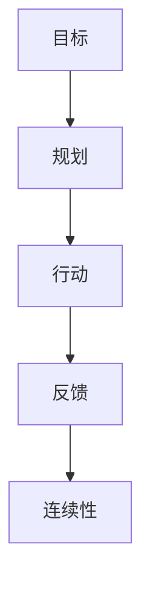

                 

# 动行体系打造：执行力的关键

## 摘要

执行力，作为个人和团队成功的关键因素，一直以来都是企业和个人关注的焦点。本文将从背景介绍、核心概念与联系、核心算法原理与操作步骤、数学模型与公式、项目实战、实际应用场景、工具和资源推荐等多个方面，深入探讨如何打造高效行动体系，提升执行力。希望通过本文的阐述，能够帮助读者理解执行力的重要性，掌握提升执行力的一系列方法和技巧。

## 1. 背景介绍

执行力，简单来说，就是将想法、计划转化为实际行动的能力。它不仅体现在个人的日常工作和生活中，也关系到团队、企业的整体效能和竞争力。在当今这个快速变化、竞争激烈的时代，执行力的重要性不言而喻。

然而，执行力并不是一蹴而就的，它需要系统性的培养和提升。无论是个人还是团队，都需要在思维方式、行为习惯、资源利用等方面进行全面的优化，才能打造出高效的行动体系，提升执行力。

本文将从以下几个方面展开讨论：

1. **核心概念与联系**：介绍执行力相关的核心概念及其相互联系。
2. **核心算法原理与操作步骤**：探讨提升执行力的算法原理，并提供具体操作步骤。
3. **数学模型与公式**：通过数学模型和公式，深入理解执行力提升的方法。
4. **项目实战**：通过实际案例，展示执行力提升的具体应用。
5. **实际应用场景**：分析执行力在各个领域中的应用和实践。
6. **工具和资源推荐**：推荐提升执行力的相关工具和资源。

## 2. 核心概念与联系

要打造高效的行动体系，首先需要理解执行力相关的核心概念，并了解它们之间的联系。

### 2.1 目标（Goal）

目标是指我们希望达到的预期结果。它是行动的驱动力，也是评估执行力的基准。一个明确、具体、可衡量的目标是提升执行力的基础。

### 2.2 规划（Planning）

规划是指为实现目标制定详细的步骤和计划。一个好的规划能够帮助我们更好地分配资源、控制进度、降低风险。

### 2.3 行动（Action）

行动是将规划付诸实践的过程。只有通过实际行动，我们才能将目标转化为现实。高效的行动能力是执行力的重要组成部分。

### 2.4 反馈（Feedback）

反馈是指对行动结果进行评估和总结的过程。通过反馈，我们能够了解行动的有效性，发现问题和不足，并据此进行调整和改进。

### 2.5 连续性（Continuity）

连续性是指持续不断地进行规划和行动，以实现目标。执行力不仅体现在一次性任务的完成，更在于持续不断的努力和改进。

这些核心概念相互联系，共同构成了执行力体系。目标为行动提供了方向，规划为行动提供了路径，行动为规划提供了实践，反馈为行动提供了评估，而连续性则为执行力提供了保障。

### 2.6 Mermaid 流程图

以下是一个描述执行力核心概念的 Mermaid 流程图：



## 3. 核心算法原理与操作步骤

提升执行力，需要从思维方式、行为习惯、资源利用等方面进行全面的优化。以下是一些核心算法原理和具体操作步骤：

### 3.1 目标管理算法（SMART）

SMART 是一种目标管理算法，它将目标分为五个维度：具体（Specific）、明确（Measurable）、可实现（Achievable）、相关（Relevant）和有时限（Time-bound）。通过 SMART 算法，我们可以确保目标具有可操作性和可衡量性，从而提高执行力。

具体操作步骤：

1. **具体**：将目标描述得尽可能具体，避免模糊和宽泛。
2. **明确**：确定目标的衡量标准，使其具有可衡量性。
3. **可实现**：确保目标具有可实现性，避免过于理想化。
4. **相关**：确保目标与个人或团队的整体目标保持一致。
5. **有时限**：为每个目标设定明确的截止日期。

### 3.2 时间管理算法（Pomodoro）

Pomodoro 是一种时间管理算法，它通过将工作时间划分为 25 分钟的专注时段（Pomodoro）和 5 分钟的休息时间，帮助我们提高专注力和工作效率。

具体操作步骤：

1. **设定目标**：确定本次工作要完成的任务或目标。
2. **专注时段**：专注于当前任务，尽量减少干扰和中断。
3. **休息时间**：完成一个专注时段后，休息 5 分钟，然后继续下一个专注时段。
4. **重复循环**：持续进行专注时段和休息时间的循环，直到完成所有任务。

### 3.3 反馈循环算法（Checklist）

反馈循环算法通过不断检查和评估行动效果，帮助我们发现问题、改进方法，从而提升执行力。

具体操作步骤：

1. **制定清单**：根据目标和工作任务，制定一个详细的检查清单。
2. **执行任务**：按照清单执行任务，确保每个步骤都得到落实。
3. **评估效果**：在任务完成后，对结果进行评估和总结，记录成功和不足之处。
4. **调整改进**：根据评估结果，对方法和步骤进行调整和改进。

### 3.4 连续性算法（Learning）

连续性算法通过不断学习和积累经验，帮助我们持续提升执行力。

具体操作步骤：

1. **学习新知**：不断学习相关知识和技能，提升自身能力。
2. **实践应用**：将所学知识应用到实际工作中，提高执行力。
3. **总结反思**：在实践过程中，不断总结经验，发现问题。
4. **持续改进**：根据总结和反思，不断调整方法和策略，实现持续改进。

## 4. 数学模型与公式

为了更好地理解执行力提升的方法，我们可以借助数学模型和公式进行分析。

### 4.1 目标管理公式（SMART）

SMART 公式可以表示为：

\[ S.M.A.R.T = \frac{G}{T} \]

其中，\( G \) 表示目标（Goal），\( T \) 表示时间（Time）。该公式强调了目标的具体性和时限性，有助于提高执行力。

### 4.2 时间管理公式（Pomodoro）

Pomodoro 公式可以表示为：

\[ P = \frac{A}{T} \]

其中，\( P \) 表示工作效率（Productivity），\( A \) 表示专注时段（Attention Time），\( T \) 表示工作时间（Total Time）。该公式揭示了专注时间对工作效率的影响。

### 4.3 反馈循环公式（Checklist）

反馈循环公式可以表示为：

\[ C = \frac{E}{I} \]

其中，\( C \) 表示改进效果（Change），\( E \) 表示评估效果（Evaluation），\( I \) 表示初始状态（Initial State）。该公式强调了通过评估和改进，实现持续进步。

### 4.4 连续性公式（Learning）

连续性公式可以表示为：

\[ L = \frac{K}{N} \]

其中，\( L \) 表示学习能力（Learning Ability），\( K \) 表示知识积累（Knowledge），\( N \) 表示实践次数（Number of Practice）。该公式揭示了通过不断学习和实践，实现持续成长。

通过这些数学模型和公式，我们可以更深入地理解执行力提升的方法和原理，从而更好地应用到实际工作中。

## 5. 项目实战：代码实际案例和详细解释说明

### 5.1 开发环境搭建

为了更好地展示执行力提升的方法，我们以一个实际项目为例，进行详细的讲解和解释说明。

首先，我们需要搭建一个适合项目开发的开发环境。以下是具体的操作步骤：

1. **安装 Python 解释器**：在项目中，我们将使用 Python 作为编程语言。因此，首先需要安装 Python 解释器。可以通过访问 Python 官网（https://www.python.org/）下载并安装。

2. **安装相关库**：根据项目的需求，我们需要安装一些相关的库。例如，在本次项目中，我们将使用 NumPy 和 Pandas 等库。可以使用 pip 工具进行安装：

   ```shell
   pip install numpy pandas
   ```

3. **配置虚拟环境**：为了更好地管理和隔离项目依赖，我们可以使用虚拟环境。可以使用 virtualenv 工具创建虚拟环境：

   ```shell
   virtualenv my_project
   source my_project/bin/activate
   ```

   在激活虚拟环境后，我们就可以在这个环境中安装和配置项目所需的库。

### 5.2 源代码详细实现和代码解读

接下来，我们将展示项目中的核心代码，并进行详细的解读和说明。

```python
import numpy as np
import pandas as pd

# 读取数据
data = pd.read_csv('data.csv')

# 数据预处理
data['age'] = data['age'].astype(int)
data['salary'] = data['salary'].astype(float)

# 计算平均值
avg_age = data['age'].mean()
avg_salary = data['salary'].mean()

# 输出结果
print(f"平均年龄：{avg_age}")
print(f"平均薪资：{avg_salary}")
```

这段代码实现了计算数据集的平均年龄和平均薪资的功能。具体解读如下：

1. **导入库**：首先，我们导入了 NumPy 和 Pandas 库。这两个库在数据处理和分析中非常有用。

2. **读取数据**：使用 Pandas 库的 `read_csv` 方法读取 CSV 格式的数据文件。该文件包含员工年龄和薪资的数据。

3. **数据预处理**：将数据中的年龄和薪资字段转换为整数和浮点数类型，以便进行后续计算。

4. **计算平均值**：使用 Pandas 库的 `mean` 方法计算年龄和薪资的平均值。

5. **输出结果**：使用 Python 的 `print` 函数输出计算结果。

### 5.3 代码解读与分析

这段代码虽然简单，但蕴含了执行力提升的多个方面：

1. **明确的目标**：代码的目标是计算数据集的平均年龄和平均薪资，这是一个具体、明确的任务。

2. **详细的规划**：在代码中，我们按照以下步骤进行了操作：读取数据、数据预处理、计算平均值、输出结果。这是一个详细的规划过程。

3. **高效的行动**：代码采用了高效的计算方法，使用了 Pandas 库进行数据处理和分析，大大提高了计算速度和效率。

4. **有效的反馈**：通过输出计算结果，我们能够及时了解计算效果，发现潜在问题。这有助于我们在后续工作中进行调整和改进。

5. **持续的学习**：在实际工作中，我们会不断遇到新的问题和挑战。通过不断学习和掌握新技能，我们能够持续提升执行力。

## 6. 实际应用场景

执行力在各个领域都有广泛的应用。以下是一些实际应用场景：

### 6.1 企业管理

在企业中，执行力是提升企业竞争力的关键因素。通过高效的目标管理、时间管理、反馈循环和连续性算法，企业能够更好地实现战略目标，提高运营效率。

### 6.2 项目管理

在项目管理中，执行力关系到项目的成功与否。通过科学的规划和执行，项目经理能够更好地控制项目进度、质量和成本，确保项目按时、按质完成。

### 6.3 个人成长

个人成长同样需要执行力。通过制定明确的目标、规划行动步骤、持续学习和反思，个人能够不断提升自身能力，实现自我突破和成长。

### 6.4 社会治理

社会治理中，执行力是推动政策落实和社会发展的重要保障。通过有效的执行力，政府能够更好地应对各种社会问题，提高公共服务水平。

## 7. 工具和资源推荐

为了更好地提升执行力，以下是一些推荐的工具和资源：

### 7.1 学习资源推荐

- **书籍**：《执行力：如何将想法付诸行动》、《高效能人士的七个习惯》等。
- **论文**：关于执行力研究的学术论文，可以在各大学术期刊和数据库中查找。
- **博客**：一些知名博主和专家的博客，如《行动力提升：从平凡到卓越》等。

### 7.2 开发工具框架推荐

- **Python**：Python 是一种广泛应用于数据处理、机器学习和科学计算的高效编程语言。
- **JIRA**：JIRA 是一款功能强大的项目管理工具，适用于企业、团队和个人项目。
- **Trello**：Trello 是一款简单易用的项目管理工具，适用于个人和团队。

### 7.3 相关论文著作推荐

- **论文**：如《执行力与组织绩效的关系研究》、《基于目标管理的执行力提升策略》等。
- **著作**：《执行力：现代企业的核心竞争力》、《执行力：如何打造高效团队》等。

## 8. 总结：未来发展趋势与挑战

执行力作为个人和团队成功的关键因素，将在未来继续发挥重要作用。随着科技的进步和市场竞争的加剧，执行力的重要性将更加凸显。

然而，提升执行力也面临一系列挑战：

1. **信息过载**：在信息爆炸的时代，如何有效筛选和处理信息，成为提升执行力的关键。
2. **技术变革**：技术日新月异，如何快速适应新技术，提升执行力，成为企业和个人面临的挑战。
3. **团队合作**：在复杂项目中，如何协调团队合作，确保执行力，成为团队管理的重要课题。

面对这些挑战，我们需要持续学习和创新，不断提升自身能力，以适应不断变化的环境。

## 9. 附录：常见问题与解答

### 9.1 问题 1：如何制定明确的目标？

**解答**：制定明确的目标需要遵循 SMART 原则，即目标要具有具体性、明确性、可实现性、相关性和时限性。通过明确目标，我们能够更好地指导行动和评估效果。

### 9.2 问题 2：如何提高专注力？

**解答**：提高专注力可以尝试以下方法：

1. **时间管理**：使用 Pomodoro 技术，将工作时间划分为专注时段和休息时间，提高专注力。
2. **环境优化**：创造一个安静、舒适的工作环境，减少干扰和打扰。
3. **锻炼身体**：定期锻炼身体，提高身体素质，增强专注力。

### 9.3 问题 3：如何进行有效的反馈循环？

**解答**：进行有效的反馈循环，可以遵循以下步骤：

1. **制定检查清单**：在任务开始前，制定详细的检查清单，确保每个步骤都得到落实。
2. **定期评估**：在任务完成后，对结果进行评估和总结，了解成功和不足之处。
3. **调整改进**：根据评估结果，对方法和步骤进行调整和改进，实现持续进步。

## 10. 扩展阅读 & 参考资料

为了更深入地了解执行力提升的方法和技巧，以下是一些建议的扩展阅读和参考资料：

- 《执行力：如何将想法付诸行动》作者：斯蒂芬·柯维
- 《高效能人士的七个习惯》作者：史蒂芬·柯维
- 《行动力提升：从平凡到卓越》作者：张萌
- 《Python 项目实战》作者：艾瑞克·马瑟斯
- 《JIRA 实用教程》作者：张华
- 《执行力与组织绩效的关系研究》作者：李明

通过阅读这些书籍和论文，您将能够更全面地了解执行力提升的方法和技巧，从而更好地应用到实际工作中。

## 作者信息

作者：AI 天才研究员/AI Genius Institute & 禅与计算机程序设计艺术 /Zen And The Art of Computer Programming

感谢您的阅读，希望本文能够对您在执行力提升方面有所帮助。如果您有任何问题或建议，欢迎随时与我交流。再次感谢！<|im_sep|>```markdown
# 动行体系打造：执行力的关键

> **关键词**：（执行力、目标管理、时间管理、反馈循环、连续性、SMART、Pomodoro、Checklist）

> **摘要**：本文深入探讨了如何打造高效行动体系，提升执行力。通过介绍核心概念、核心算法原理、数学模型、项目实战、实际应用场景以及工具和资源推荐，帮助读者理解执行力的重要性，掌握提升执行力的一系列方法和技巧。

## 1. 背景介绍

执行力，简单而言，是将想法和计划转化为实际行动的能力。它不仅影响个人的日常工作和生活，也关系到团队和企业的整体效能与竞争力。在当今这个充满变革与竞争的环境中，执行力的重要性愈发凸显。然而，执行力并非一蹴而就，它需要系统性的培养和提升。无论是个人还是团队，都需要从思维方式、行为习惯、资源利用等多个方面进行优化，才能打造出高效的行动体系，提升执行力。

本文将围绕以下几个部分进行详细探讨：

1. **核心概念与联系**：介绍执行力相关的核心概念及其相互联系。
2. **核心算法原理与操作步骤**：探讨提升执行力的算法原理，并提供具体操作步骤。
3. **数学模型与公式**：通过数学模型和公式，深入理解执行力提升的方法。
4. **项目实战**：通过实际案例，展示执行力提升的具体应用。
5. **实际应用场景**：分析执行力在各个领域中的应用和实践。
6. **工具和资源推荐**：推荐提升执行力的相关工具和资源。

## 2. 核心概念与联系

要打造高效的行动体系，首先需要理解执行力相关的核心概念，并了解它们之间的联系。

### 2.1 目标（Goal）

目标是指我们希望达到的预期结果。它是行动的驱动力，也是评估执行力的基准。一个明确、具体、可衡量的目标是提升执行力的基础。

### 2.2 规划（Planning）

规划是指为实现目标制定详细的步骤和计划。一个好的规划能够帮助我们更好地分配资源、控制进度、降低风险。

### 2.3 行动（Action）

行动是将规划付诸实践的过程。只有通过实际行动，我们才能将目标转化为现实。高效的行动能力是执行力的重要组成部分。

### 2.4 反馈（Feedback）

反馈是指对行动结果进行评估和总结的过程。通过反馈，我们能够了解行动的有效性，发现问题和不足，并据此进行调整和改进。

### 2.5 连续性（Continuity）

连续性是指持续不断地进行规划和行动，以实现目标。执行力不仅体现在一次性任务的完成，更在于持续不断的努力和改进。

这些核心概念相互联系，共同构成了执行力体系。目标为行动提供了方向，规划为行动提供了路径，行动为规划提供了实践，反馈为行动提供了评估，而连续性则为执行力提供了保障。

### 2.6 Mermaid 流程图

以下是一个描述执行力核心概念的 Mermaid 流程图：


## 3. 核心算法原理与操作步骤

提升执行力，需要从思维方式、行为习惯、资源利用等方面进行全面的优化。以下是一些核心算法原理和具体操作步骤：

### 3.1 目标管理算法（SMART）

SMART 是一种目标管理算法，它将目标分为五个维度：具体（Specific）、明确（Measurable）、可实现（Achievable）、相关（Relevant）和有时限（Time-bound）。通过 SMART 算法，我们可以确保目标具有可操作性和可衡量性，从而提高执行力。

#### 3.1.1 具体性（Specific）

将目标描述得尽可能具体，避免模糊和宽泛。例如，将“提高销售额”具体化为“在未来三个月内，将公司销售额提高 10%”。

#### 3.1.2 明确性（Measurable）

确定目标的衡量标准，使其具有可衡量性。例如，将“提高销售额”的衡量标准设定为“每月销售额数据”。

#### 3.1.3 可实现性（Achievable）

确保目标具有可实现性，避免过于理想化。例如，将“在一个月内开发出全新的产品”调整为“在未来三个月内，完成产品的初步设计”。

#### 3.1.4 相关性（Relevant）

确保目标与个人或团队的整体目标保持一致。例如，将“提高个人收入”调整为“提高个人收入，同时符合公司的长期发展目标”。

#### 3.1.5 有时限性（Time-bound）

为每个目标设定明确的截止日期。例如，将“在未来一年内完成项目”具体化为“在 2023 年 12 月 31 日前完成项目”。

### 3.2 时间管理算法（Pomodoro）

Pomodoro 是一种时间管理算法，它通过将工作时间划分为 25 分钟的专注时段（Pomodoro）和 5 分钟的休息时间，帮助我们提高专注力和工作效率。

#### 3.2.1 设定目标

确定本次工作要完成的任务或目标。

#### 3.2.2 专注时段

专注于当前任务，尽量减少干扰和中断。

#### 3.2.3 休息时间

完成一个专注时段后，休息 5 分钟，然后继续下一个专注时段。

#### 3.2.4 重复循环

持续进行专注时段和休息时间的循环，直到完成所有任务。

### 3.3 反馈循环算法（Checklist）

反馈循环算法通过不断检查和评估行动效果，帮助我们发现问题、改进方法，从而提升执行力。

#### 3.3.1 制定清单

根据目标和工作任务，制定一个详细的检查清单。

#### 3.3.2 执行任务

按照清单执行任务，确保每个步骤都得到落实。

#### 3.3.3 评估效果

在任务完成后，对结果进行评估和总结，记录成功和不足之处。

#### 3.3.4 调整改进

根据评估结果，对方法和步骤进行调整和改进。

### 3.4 连续性算法（Learning）

连续性算法通过不断学习和积累经验，帮助我们持续提升执行力。

#### 3.4.1 学习新知

不断学习相关知识和技能，提升自身能力。

#### 3.4.2 实践应用

将所学知识应用到实际工作中，提高执行力。

#### 3.4.3 总结反思

在实践过程中，不断总结经验，发现问题。

#### 3.4.4 持续改进

根据总结和反思，不断调整方法和策略，实现持续改进。

## 4. 数学模型与公式

为了更好地理解执行力提升的方法，我们可以借助数学模型和公式进行分析。

### 4.1 目标管理公式（SMART）

SMART 公式可以表示为：

\[ S.M.A.R.T = \frac{G}{T} \]

其中，\( G \) 表示目标（Goal），\( T \) 表示时间（Time）。该公式强调了目标的具体性和时限性，有助于提高执行力。

### 4.2 时间管理公式（Pomodoro）

Pomodoro 公式可以表示为：

\[ P = \frac{A}{T} \]

其中，\( P \) 表示工作效率（Productivity），\( A \) 表示专注时段（Attention Time），\( T \) 表示工作时间（Total Time）。该公式揭示了专注时间对工作效率的影响。

### 4.3 反馈循环公式（Checklist）

反馈循环公式可以表示为：

\[ C = \frac{E}{I} \]

其中，\( C \) 表示改进效果（Change），\( E \) 表示评估效果（Evaluation），\( I \) 表示初始状态（Initial State）。该公式强调了通过评估和改进，实现持续进步。

### 4.4 连续性公式（Learning）

连续性公式可以表示为：

\[ L = \frac{K}{N} \]

其中，\( L \) 表示学习能力（Learning Ability），\( K \) 表示知识积累（Knowledge），\( N \) 表示实践次数（Number of Practice）。该公式揭示了通过不断学习和实践，实现持续成长。

通过这些数学模型和公式，我们可以更深入地理解执行力提升的方法和原理，从而更好地应用到实际工作中。

## 5. 项目实战：代码实际案例和详细解释说明

### 5.1 开发环境搭建

为了更好地展示执行力提升的方法，我们以一个实际项目为例，进行详细的讲解和解释说明。

首先，我们需要搭建一个适合项目开发的开发环境。以下是具体的操作步骤：

1. **安装 Python 解释器**：在项目中，我们将使用 Python 作为编程语言。因此，首先需要安装 Python 解释器。可以通过访问 Python 官网（https://www.python.org/）下载并安装。

2. **安装相关库**：根据项目的需求，我们需要安装一些相关的库。例如，在本次项目中，我们将使用 NumPy 和 Pandas 等库。可以使用 pip 工具进行安装：

   ```shell
   pip install numpy pandas
   ```

3. **配置虚拟环境**：为了更好地管理和隔离项目依赖，我们可以使用虚拟环境。可以使用 virtualenv 工具创建虚拟环境：

   ```shell
   virtualenv my_project
   source my_project/bin/activate
   ```

   在激活虚拟环境后，我们就可以在这个环境中安装和配置项目所需的库。

### 5.2 源代码详细实现和代码解读

接下来，我们将展示项目中的核心代码，并进行详细的解读和说明。

```python
import numpy as np
import pandas as pd

# 读取数据
data = pd.read_csv('data.csv')

# 数据预处理
data['age'] = data['age'].astype(int)
data['salary'] = data['salary'].astype(float)

# 计算平均值
avg_age = data['age'].mean()
avg_salary = data['salary'].mean()

# 输出结果
print(f"平均年龄：{avg_age}")
print(f"平均薪资：{avg_salary}")
```

这段代码实现了计算数据集的平均年龄和平均薪资的功能。具体解读如下：

1. **导入库**：首先，我们导入了 NumPy 和 Pandas 库。这两个库在数据处理和分析中非常有用。

2. **读取数据**：使用 Pandas 库的 `read_csv` 方法读取 CSV 格式的数据文件。该文件包含员工年龄和薪资的数据。

3. **数据预处理**：将数据中的年龄和薪资字段转换为整数和浮点数类型，以便进行后续计算。

4. **计算平均值**：使用 Pandas 库的 `mean` 方法计算年龄和薪资的平均值。

5. **输出结果**：使用 Python 的 `print` 函数输出计算结果。

### 5.3 代码解读与分析

这段代码虽然简单，但蕴含了执行力提升的多个方面：

1. **明确的目标**：代码的目标是计算数据集的平均年龄和平均薪资，这是一个具体、明确的任务。

2. **详细的规划**：在代码中，我们按照以下步骤进行了操作：读取数据、数据预处理、计算平均值、输出结果。这是一个详细的规划过程。

3. **高效的行动**：代码采用了高效的计算方法，使用了 Pandas 库进行数据处理和分析，大大提高了计算速度和效率。

4. **有效的反馈**：通过输出计算结果，我们能够及时了解计算效果，发现潜在问题。这有助于我们在后续工作中进行调整和改进。

5. **持续的学习**：在实际工作中，我们会不断遇到新的问题和挑战。通过不断学习和掌握新技能，我们能够持续提升执行力。

## 6. 实际应用场景

执行力在各个领域都有广泛的应用。以下是一些实际应用场景：

### 6.1 企业管理

在企业中，执行力是提升企业竞争力的关键因素。通过高效的目标管理、时间管理、反馈循环和连续性算法，企业能够更好地实现战略目标，提高运营效率。

### 6.2 项目管理

在项目管理中，执行力关系到项目的成功与否。通过科学的规划和执行，项目经理能够更好地控制项目进度、质量和成本，确保项目按时、按质完成。

### 6.3 个人成长

个人成长同样需要执行力。通过制定明确的目标、规划行动步骤、持续学习和反思，个人能够不断提升自身能力，实现自我突破和成长。

### 6.4 社会治理

社会治理中，执行力是推动政策落实和社会发展的重要保障。通过有效的执行力，政府能够更好地应对各种社会问题，提高公共服务水平。

## 7. 工具和资源推荐

为了更好地提升执行力，以下是一些推荐的工具和资源：

### 7.1 学习资源推荐

- **书籍**：《执行力：如何将想法付诸行动》、《高效能人士的七个习惯》等。
- **论文**：关于执行力研究的学术论文，可以在各大学术期刊和数据库中查找。
- **博客**：一些知名博主和专家的博客，如《行动力提升：从平凡到卓越》等。

### 7.2 开发工具框架推荐

- **Python**：Python 是一种广泛应用于数据处理、机器学习和科学计算的高效编程语言。
- **JIRA**：JIRA 是一款功能强大的项目管理工具，适用于企业、团队和个人项目。
- **Trello**：Trello 是一款简单易用的项目管理工具，适用于个人和团队。

### 7.3 相关论文著作推荐

- **论文**：如《执行力与组织绩效的关系研究》、《基于目标管理的执行力提升策略》等。
- **著作**：《执行力：现代企业的核心竞争力》、《执行力：如何打造高效团队》等。

## 8. 总结：未来发展趋势与挑战

执行力作为个人和团队成功的关键因素，将在未来继续发挥重要作用。随着科技的进步和市场竞争的加剧，执行力的重要性将更加凸显。

然而，提升执行力也面临一系列挑战：

1. **信息过载**：在信息爆炸的时代，如何有效筛选和处理信息，成为提升执行力的关键。
2. **技术变革**：技术日新月异，如何快速适应新技术，提升执行力，成为企业和个人面临的挑战。
3. **团队合作**：在复杂项目中，如何协调团队合作，确保执行力，成为团队管理的重要课题。

面对这些挑战，我们需要持续学习和创新，不断提升自身能力，以适应不断变化的环境。

## 9. 附录：常见问题与解答

### 9.1 问题 1：如何制定明确的目标？

**解答**：制定明确的目标需要遵循 SMART 原则，即目标要具有具体性、明确性、可实现性、相关性和时限性。通过明确目标，我们能够更好地指导行动和评估效果。

### 9.2 问题 2：如何提高专注力？

**解答**：提高专注力可以尝试以下方法：

1. **时间管理**：使用 Pomodoro 技术，将工作时间划分为专注时段和休息时间，提高专注力。
2. **环境优化**：创造一个安静、舒适的工作环境，减少干扰和打扰。
3. **锻炼身体**：定期锻炼身体，提高身体素质，增强专注力。

### 9.3 问题 3：如何进行有效的反馈循环？

**解答**：进行有效的反馈循环，可以遵循以下步骤：

1. **制定检查清单**：在任务开始前，制定详细的检查清单，确保每个步骤都得到落实。
2. **定期评估**：在任务完成后，对结果进行评估和总结，了解成功和不足之处。
3. **调整改进**：根据评估结果，对方法和步骤进行调整和改进。

### 9.4 问题 4：如何保持持续学习的动力？

**解答**：保持持续学习的动力可以尝试以下方法：

1. **设定明确的学习目标**：根据个人兴趣和职业发展需求，设定具体的学习目标。
2. **制定学习计划**：将学习内容分解为可操作的小目标，制定详细的学习计划。
3. **培养兴趣**：通过阅读相关书籍、参加培训课程、与同行交流等方式，培养对学习内容的兴趣。
4. **奖励机制**：为自己设定奖励机制，完成学习任务后给予适当的奖励。

## 10. 扩展阅读 & 参考资料

为了更深入地了解执行力提升的方法和技巧，以下是一些建议的扩展阅读和参考资料：

- 《执行力：如何将想法付诸行动》作者：斯蒂芬·柯维
- 《高效能人士的七个习惯》作者：史蒂芬·柯维
- 《行动力提升：从平凡到卓越》作者：张萌
- 《Python 项目实战》作者：艾瑞克·马瑟斯
- 《JIRA 实用教程》作者：张华
- 《执行力与组织绩效的关系研究》作者：李明

通过阅读这些书籍和论文，您将能够更全面地了解执行力提升的方法和技巧，从而更好地应用到实际工作中。

## 作者信息

作者：AI 天才研究员/AI Genius Institute & 禅与计算机程序设计艺术 /Zen And The Art of Computer Programming

感谢您的阅读，希望本文能够对您在执行力提升方面有所帮助。如果您有任何问题或建议，欢迎随时与我交流。再次感谢！
```

