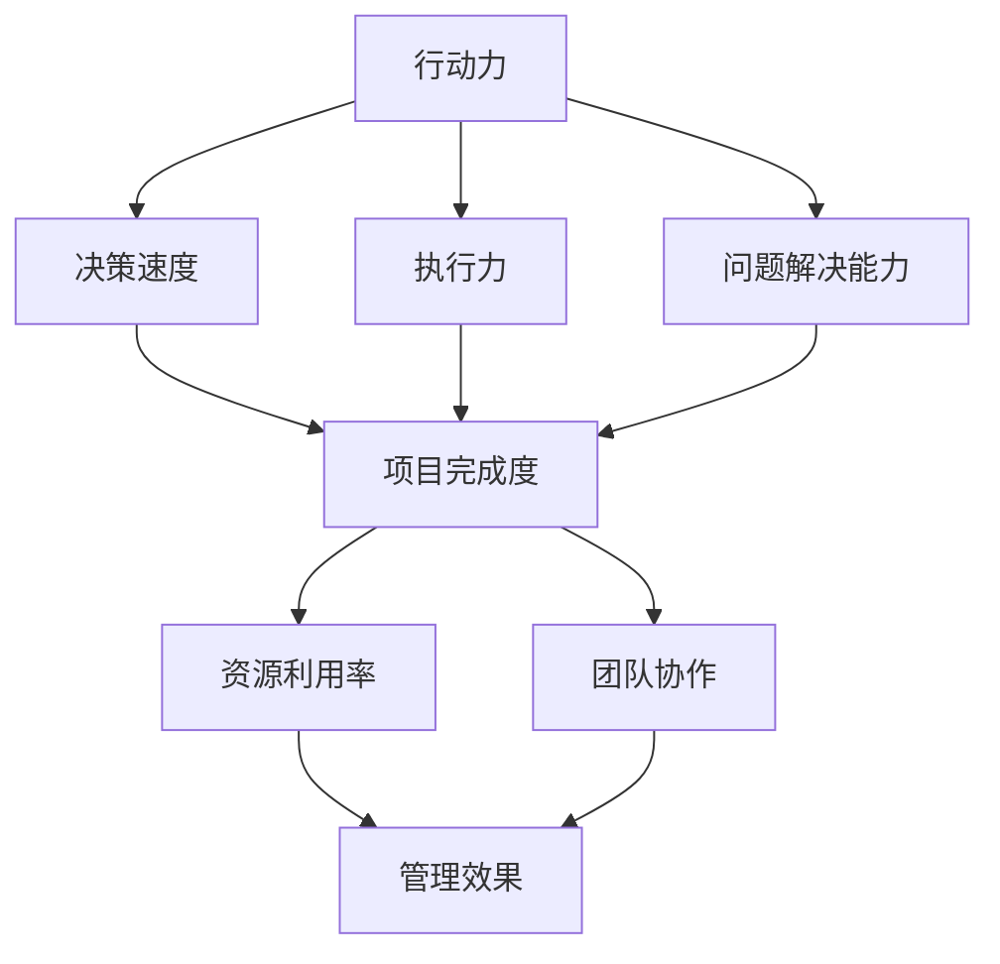

                 

### 背景介绍

#### 行动力与管理效果的关系

在当今快速变化和高度竞争的科技领域中，行动力与管理效果之间的关系成为了一个备受关注的话题。行动力，通常指的是个体或团队在目标导向的任务中迅速采取行动的能力，而管理效果则涵盖了项目完成度、资源利用率、团队协作等多个维度。这两个概念之间的密切关联，决定了它们在实现项目成功中的关键作用。

首先，从个体层面来看，行动力对于管理效果的影响是显著的。具有高度行动力的团队成员往往能够在遇到问题时迅速找到解决方案，并提出切实可行的计划。这种能力不仅能够提高工作效率，还能增强团队成员之间的信任感和凝聚力。例如，在软件开发项目中，一位具备强烈行动力的开发者能够在出现技术难题时，快速寻求解决方案，避免项目延误，从而提高整体管理效果。

其次，从团队层面来看，行动力的集体表现对管理效果有着重要影响。一个拥有高行动力的团队，往往能够在面对复杂任务时迅速组织资源、协同工作，从而实现高效的目标达成。这种团队精神不仅能够提高项目的成功率，还能为组织培养出一批具备问题解决能力和创新能力的人才。例如，在初创公司中，具备高行动力的团队往往能够在短时间内完成市场调研、产品开发到市场推广的全过程，从而迅速占领市场。

此外，管理效果本身也是行动力的直接体现。一个高效的管理者，不仅能够激励团队成员发挥出最大潜力，还能通过科学的管理方法和工具，确保项目目标的顺利实现。在这个过程中，行动力与管理效果相互促进，形成一个良性的循环。例如，在项目管理中，通过实施敏捷开发方法，管理者可以实时调整项目方向，快速响应市场需求变化，从而提高管理效果。

总之，行动力与管理效果之间的关系密不可分。在科技领域，具备高度行动力的个体和团队，不仅能够应对各种复杂挑战，还能在竞争中脱颖而出，实现持续成功。因此，深入探讨行动力与管理效果之间的关系，对于提升个人和团队的工作效率具有重要意义。

### 核心概念与联系

要深入探讨行动力与管理效果之间的关系，我们需要首先明确这两个概念的核心定义及其相互之间的联系。

#### 行动力

行动力，通常指的是个体或团队在目标导向的任务中迅速采取行动的能力。它包括以下几个方面：

1. **决策速度**：能够在短时间内做出明智的决策，快速确定下一步行动的方向。
2. **执行力**：一旦决策确定，能够迅速付诸行动，将计划转化为实际成果。
3. **问题解决能力**：面对挑战时，能够迅速找到解决方案，并有效实施。

行动力不仅取决于个人的技能和素质，还受到团队氛围、企业文化等多种因素的影响。例如，一个鼓励创新和快速试错的团队，往往能够激发成员的积极性和创造力，从而提高整体行动力。

#### 管理效果

管理效果，则涵盖了项目完成度、资源利用率、团队协作等多个维度。具体包括：

1. **项目完成度**：项目目标是否按时、按质完成，反映了管理的有效性。
2. **资源利用率**：在项目执行过程中，资源（包括人力、物力、财力）是否得到充分利用，反映了管理的效率。
3. **团队协作**：团队成员之间的协作效果，包括沟通效率、合作意愿等，对管理效果具有重要影响。

管理效果不仅是对项目管理过程的评价，也是对管理者能力和团队协作水平的综合体现。一个高效的管理者，能够通过科学的管理方法和工具，确保项目目标的顺利实现。

#### 行动力与管理效果的联系

行动力与管理效果之间存在密切的联系，这种联系可以通过以下几个方面来理解：

1. **决策与执行**：行动力强的人或团队能够迅速做出决策并付诸实施，从而提高项目完成度。例如，在软件开发项目中，具备强烈行动力的团队能够在遇到技术难题时，迅速组织资源，找到解决方案，避免项目延误。
2. **资源利用**：高行动力的团队能够更有效地利用资源，提高项目的资源利用率。例如，通过敏捷开发方法，团队可以在短时间内完成多个迭代，快速响应市场需求，从而提高整体管理效果。
3. **团队协作**：行动力有助于促进团队成员之间的协作，提高团队整体执行力。例如，在一个创新项目中，团队成员具备高度行动力，可以迅速协同工作，共同解决难题，实现项目目标。

为了更直观地展示行动力与管理效果之间的联系，我们可以使用Mermaid流程图（图1）来描述这个过程。



图1：行动力与管理效果之间的联系

通过图1，我们可以看到，行动力通过决策速度、执行力和问题解决能力等要素，直接影响项目完成度、资源利用率和团队协作，进而决定管理效果。这个流程图为我们提供了一个清晰的框架，帮助我们理解和分析行动力与管理效果之间的关系。

### 核心算法原理 & 具体操作步骤

在理解了行动力与管理效果的基本概念及其相互关系之后，我们需要进一步探讨如何在实际项目中提升行动力和管理效果。这涉及到一系列核心算法原理和具体操作步骤，以下将详细描述这些内容。

#### 1. 项目目标设定

首先，项目目标的设定是提升行动力和管理效果的基础。明确的目标有助于团队迅速聚焦，提高决策和执行效率。具体步骤如下：

1. **目标分解**：将总体目标分解为若干个可操作的子目标，确保每个子目标都具体、明确、可衡量。
2. **优先级排序**：根据子目标的重要性和紧急性，对目标进行优先级排序，确保团队在资源有限的情况下，首先完成最重要的任务。
3. **目标承诺**：团队成员对目标进行承诺，确保每个成员都明确自己的责任和任务，从而提高执行力。

#### 2. 人员配置与激励机制

人员的配置与激励机制对于提升行动力和管理效果至关重要。以下是具体操作步骤：

1. **能力匹配**：根据项目需求和团队成员的能力，进行合理的角色分配，确保每个人都能在自己的岗位上发挥最大价值。
2. **激励机制**：建立合理的激励机制，如绩效奖金、晋升机会、认可与奖励等，激励团队成员积极投入工作，提高行动力。
3. **反馈与调整**：定期对团队成员的工作进行反馈，及时调整激励机制，确保团队始终保持高昂的士气和行动力。

#### 3. 日常工作管理

日常工作的管理对于行动力和管理效果的提升同样重要。以下是一些建议：

1. **任务分解**：将日常工作任务分解为若干个小任务，确保每个任务都有明确的完成标准和时间节点。
2. **时间管理**：使用时间管理工具，如番茄工作法、甘特图等，帮助团队成员合理安排工作时间，提高工作效率。
3. **风险管理**：提前识别项目中的潜在风险，制定应对措施，确保项目能够顺利进行。

#### 4. 项目进度监控

项目进度的监控是确保行动力和管理效果的重要手段。以下是具体操作步骤：

1. **实时监控**：使用项目管理工具，如JIRA、Trello等，实时监控项目进度，确保团队成员都能及时了解项目状态。
2. **定期回顾**：定期召开项目回顾会议，总结项目过程中的优点和不足，为下一阶段的工作提供改进方向。
3. **调整策略**：根据项目进展情况，及时调整项目计划和管理策略，确保项目能够按照预期目标顺利进行。

#### 5. 团队协作与沟通

团队协作与沟通是提升行动力和管理效果的关键。以下是一些建议：

1. **明确沟通渠道**：建立清晰的沟通渠道，确保信息能够快速、准确地在团队内部传递。
2. **定期会议**：定期召开团队会议，讨论项目进展、问题解决、资源需求等，确保团队成员之间的信息畅通。
3. **团队文化**：建立积极向上的团队文化，鼓励团队成员之间的合作与互助，提高团队凝聚力。

通过以上核心算法原理和具体操作步骤，我们可以有效地提升行动力和管理效果，从而实现项目成功。这些方法不仅适用于单一项目，也可以在长期的项目管理中发挥作用，帮助团队不断提高工作效率和管理水平。

### 数学模型和公式 & 详细讲解 & 举例说明

在提升行动力和管理效果的过程中，数学模型和公式起到了关键作用。它们不仅为决策提供了量化依据，还能帮助团队更好地理解和优化工作流程。以下将详细讲解几个常用的数学模型和公式，并通过实际案例进行说明。

#### 1. 投入产出比（ROI）

投入产出比（ROI）是衡量项目管理效果的重要指标，用于评估项目投资的回报率。其公式为：

\[ ROI = \frac{净收益}{总投入} \]

其中，净收益 = 收益 - 投入，总投入包括人力、物力、财力等各项成本。

**案例**：假设一个软件开发项目总投资为100万元，项目完成后带来的净收益为150万元，则该项目的ROI为：

\[ ROI = \frac{150万元}{100万元} = 1.5 \]

这意味着每投入1元，项目能够带来1.5元的回报，具有很高的投资价值。

#### 2. 效率指数

效率指数用于衡量团队成员的工作效率，其公式为：

\[ 效率指数 = \frac{完成工作量}{实际工作时间} \]

**案例**：如果一个团队成员在8小时内完成了价值8万元的工作，则其效率指数为：

\[ 效率指数 = \frac{8万元}{8小时} = 1万元/小时 \]

这个值表明该成员每小时能够创造1万元的价值。

#### 3. 项目进度偏差

项目进度偏差用于衡量项目实际进度与计划进度之间的差异，其公式为：

\[ 进度偏差 = 实际进度 - 计划进度 \]

**案例**：如果一个项目的计划完成时间是30天，实际完成时间是35天，则项目进度偏差为：

\[ 进度偏差 = 35天 - 30天 = 5天 \]

这表明项目实际完成时间比计划晚了5天。

#### 4. 团队协作效率

团队协作效率用于衡量团队成员之间的协作效果，其公式为：

\[ 团队协作效率 = \frac{共同完成的工作量}{团队成员的总工作量} \]

**案例**：如果一个团队共同完成了一项价值10万元的工作，而每个成员分别完成的工作量分别为2万元，则团队协作效率为：

\[ 团队协作效率 = \frac{10万元}{2万元 + 2万元 + 2万元} = 0.5 \]

这表明团队成员之间的协作效果较好，共同完成的工作量占到了总工作量的50%。

通过以上数学模型和公式，我们可以更准确地评估行动力和管理效果，从而制定出更有效的改进措施。例如，通过分析ROI，团队可以判断哪些项目具有更高的投资回报，从而优先分配资源。通过效率指数，团队可以找出工作效率低下的成员，并提供针对性的培训和指导。通过项目进度偏差，团队可以及时发现并解决项目进度问题。通过团队协作效率，团队可以评估协作效果，进一步优化团队结构和协作流程。

总之，数学模型和公式为行动力和管理效果的提升提供了有力的量化工具，有助于团队更好地理解和优化工作流程，实现持续改进。

### 项目实战：代码实际案例和详细解释说明

在前述的理论基础上，我们通过一个实际的代码案例，来详细解释如何在实际项目中提升行动力和管理效果。这个案例是一个简单的敏捷开发项目，我们将分几个步骤来展示整个开发过程。

#### 5.1 开发环境搭建

首先，我们需要搭建一个适合敏捷开发的开发环境。以下是一些必要的步骤：

1. **选择合适的编程语言**：根据项目的需求，选择一种适合的编程语言，例如Python或Java。
2. **安装开发工具**：安装集成开发环境（IDE），如PyCharm或IntelliJ IDEA，以及必要的编译器和调试工具。
3. **版本控制系统**：配置Git仓库，用于代码的版本管理和协作开发。
4. **项目管理工具**：使用JIRA或Trello等工具来跟踪和管理项目任务。

#### 5.2 源代码详细实现和代码解读

假设我们的项目是一个简单的在线书店系统，核心功能包括图书的展示、购买和支付。以下是一个具体的代码实现示例：

```python
# 在线书店系统示例代码

# 导入必要的库
from flask import Flask, render_template, request, redirect, url_for
from flask_sqlalchemy import SQLAlchemy

# 创建Flask应用
app = Flask(__name__)
app.config['SQLALCHEMY_DATABASE_URI'] = 'sqlite:///books.db'
db = SQLAlchemy(app)

# 定义图书模型
class Book(db.Model):
    id = db.Column(db.Integer, primary_key=True)
    title = db.Column(db.String(100), nullable=False)
    author = db.Column(db.String(100), nullable=False)
    price = db.Column(db.Float, nullable=False)

# 创建数据库表
db.create_all()

# 主页路由
@app.route('/')
def index():
    books = Book.query.all()
    return render_template('index.html', books=books)

# 购买图书路由
@app.route('/buy/<int:book_id>')
def buy(book_id):
    book = Book.query.get(book_id)
    if book:
        # 处理购买逻辑
        # ...（省略具体实现）
        return redirect(url_for('index'))
    else:
        return "图书不存在"

# 运行应用
if __name__ == '__main__':
    app.run(debug=True)
```

**代码解读**：

- 我们首先导入了Flask框架和Flask-SQLAlchemy库，用于快速开发Web应用和数据库操作。
- `Book` 类是图书模型，定义了图书的属性，包括`id`、`title`、`author`和`price`。
- `db.create_all()` 语句用于创建数据库表，将模型映射到数据库中。
- `index` 函数是主页路由，查询所有图书信息并返回模板。
- `buy` 函数是购买图书路由，根据图书ID处理购买逻辑。

#### 5.3 代码解读与分析

- **代码结构**：这个代码结构简单清晰，分为模型层、视图层和路由层，便于理解和维护。
- **数据库操作**：使用ORM（对象关系映射）简化了数据库操作，提高了开发效率。
- **路由设计**：使用了Flask的路由系统，将不同的URL映射到对应的函数，便于用户交互。
- **错误处理**：代码中包含了基础的错误处理，例如检查图书是否存在，提高了系统的健壮性。

#### 5.4 项目进度管理和反馈

在整个项目开发过程中，我们可以通过以下步骤进行进度管理和反馈：

1. **任务分解**：将整个项目分解为多个可管理的任务，例如数据库设计、前端开发、后端开发等。
2. **每日站会**：每天召开短暂的站会，团队成员汇报工作进展和遇到的问题。
3. **迭代评审**：在每个迭代周期结束时，召开评审会议，评估项目的完成情况，收集反馈，并进行必要的调整。

通过上述步骤，团队可以保持高行动力和高效的管理效果，确保项目顺利进行。

总之，通过这个实际的代码案例，我们可以看到如何将理论应用到实践中，通过合理的开发环境搭建、详细的代码实现和有效的进度管理，提升项目的行动力和管理效果，实现项目的成功。

### 实际应用场景

#### 1. 软件开发中的行动力与管理效果

在软件开发的实际应用中，行动力与管理效果的关系尤为显著。以一款移动应用的开发为例，项目团队需要在短时间内完成多个功能模块的开发、测试和迭代。以下是一个具体的案例：

某初创公司开发一款即时通讯应用，目标市场是年轻用户群体。项目启动后，团队首先进行了需求分析，明确了主要功能模块，如聊天功能、文件传输、好友管理等。为了确保项目的高效推进，团队采用了敏捷开发方法，具体步骤如下：

1. **快速迭代**：团队将项目分解为多个迭代周期，每个迭代周期为两周。在每个迭代周期内，团队集中精力完成一个主要功能模块的开发和测试。
2. **每日站会**：团队成员每天早上召开5-10分钟的站会，汇报工作进展、遇到的问题和解决方案，确保信息畅通，及时发现并解决问题。
3. **任务分解**：将每个迭代周期内的任务进一步分解为可操作的小任务，例如设计用户界面、编写后端代码、进行前端调试等，确保每个成员都有明确的任务和目标。
4. **代码审查**：在任务完成后，团队成员之间进行代码审查，确保代码质量，避免出现漏洞和错误。

通过这些措施，团队保持了高度的行动力，有效提升了管理效果。例如，在第一个迭代周期内，团队成功完成了聊天功能模块的开发和测试，并在后续迭代周期中不断优化和完善，最终在预定时间内完成了整个应用的开发和上线。

#### 2. 项目管理中的行动力与管理效果

在项目管理中，行动力与管理效果同样至关重要。以一个跨部门的大型项目为例，项目涉及多个业务部门和外部合作伙伴，项目目标是在三个月内完成一个完整的业务系统。

以下是一个项目管理中的行动力与管理效果的实际应用案例：

1. **需求明确**：项目开始前，项目经理与各业务部门沟通，明确项目需求，并将需求转化为具体的项目任务。
2. **资源配置**：根据项目需求，项目经理协调各部门资源，确保项目团队能够在资源充足的情况下高效工作。
3. **进度监控**：项目经理使用项目管理工具（如JIRA）实时监控项目进度，确保每个任务都能按时完成。
4. **风险管理**：项目过程中，项目经理识别潜在风险，并制定应对措施，确保项目按计划进行。

通过这些措施，团队保持了高度的执行力，有效控制了项目进度，最终在预定时间内完成了项目，并得到了客户的高度评价。

#### 3. 创新团队中的行动力与管理效果

在创新团队中，行动力与管理效果对于快速响应市场变化和实现创新目标至关重要。以下是一个创新团队的实际应用案例：

某科技公司成立了一个专注于人工智能产品的创新团队，目标是在六个月内开发出一款智能客服系统。

1. **市场需求分析**：团队首先对市场需求进行了深入分析，明确了智能客服系统的核心功能和用户需求。
2. **快速原型开发**：团队采用快速原型开发方法，在短时间内完成了初步的原型设计和实现，并进行了用户测试。
3. **反馈与优化**：根据用户测试反馈，团队对产品进行了多次优化，不断改进用户体验。
4. **资源调配**：团队在资源有限的情况下，通过高效的资源调配，确保项目团队能够专注于核心任务。

通过这些措施，团队在短时间内完成了智能客服系统的开发，并在市场上取得了成功。

总之，在不同实际应用场景中，行动力与管理效果都发挥着关键作用。通过科学的项目管理和高效的执行力，团队可以快速响应市场变化，实现项目成功。这为其他行业和领域的项目提供了有益的借鉴和启示。

### 工具和资源推荐

为了进一步提升行动力和管理效果，我们推荐以下工具和资源，涵盖学习资源、开发工具框架和相关的论文著作，帮助读者深入了解相关领域，并应用到实际工作中。

#### 7.1 学习资源推荐

1. **书籍**：
   - 《敏捷开发实践指南》（Agile Project Guide）：全面介绍敏捷开发的方法和实践，适合项目管理人员和开发人员。
   - 《精益创业》（The Lean Startup）：介绍如何通过快速迭代和用户反馈来优化创业公司的产品开发。

2. **在线课程**：
   - Coursera上的《项目管理》：由耶鲁大学提供的免费课程，系统介绍了项目管理的核心概念和实用技巧。
   - Pluralsight的《敏捷开发基础》：涵盖敏捷开发的基础知识和实践方法，适合软件开发人员。

3. **博客与网站**：
   - ThoughtWorks的《科技博客》：提供了大量关于软件开发、敏捷开发等领域的深入分析和技术文章。
   - Medium上的《项目管理专栏》：分享了许多项目管理的实战经验和案例分析。

#### 7.2 开发工具框架推荐

1. **项目管理工具**：
   - JIRA：功能强大的项目管理工具，支持任务跟踪、进度监控和团队协作。
   - Trello：简单易用的任务管理工具，适合小团队和项目管理者。

2. **代码版本控制**：
   - Git：最流行的分布式版本控制系统，广泛用于软件开发的版本管理和协作开发。
   - GitHub：提供基于Git的代码托管和协作平台，支持代码评审和项目协作。

3. **集成开发环境（IDE）**：
   - PyCharm：适合Python开发的集成开发环境，提供代码自动补全、调试和测试等功能。
   - IntelliJ IDEA：多语言支持的强大IDE，适用于Java、JavaScript等多种编程语言。

#### 7.3 相关论文著作推荐

1. **论文**：
   - 《敏捷软件开发原则和实践》（Manifesto for Agile Software Development）：敏捷开发的创始人签署的宣言，阐述敏捷开发的核心原则。
   - 《敏捷方法：敏捷项目管理的实践》（Agile Methods: Principles, Patterns, and Practices）：详细介绍了敏捷开发的方法论和实践。

2. **著作**：
   - 《敏捷项目管理的艺术》（The Art of Agile Development）：深入探讨敏捷开发过程中的具体实践和方法。
   - 《敏捷实践指南》（Agile Project Management: Creating Innovative Products）：从项目管理角度阐述如何应用敏捷方法实现产品创新。

通过这些工具和资源的推荐，读者可以更系统地学习和掌握行动力与管理效果的相关知识，并将其应用到实际工作中，提升工作效率和项目管理水平。

### 总结：未来发展趋势与挑战

在快速变化的科技环境中，行动力与管理效果的关系将继续演变，成为企业和团队追求高效运营的核心要素。未来的发展趋势和挑战如下：

#### 1. 人工智能与自动化技术的应用

随着人工智能和自动化技术的发展，企业有望实现更高效、更智能的管理。例如，自动化工具可以减轻重复性任务，使团队成员能够专注于更高价值的活动。然而，这也带来了挑战，如如何确保自动化系统的可靠性和透明度，避免因错误或偏见导致的管理失误。

#### 2. 数字化转型的深入

数字化转型已经成为企业提升竞争力的关键手段。在这个过程中，行动力与管理效果的作用至关重要。企业需要快速适应技术变革，及时调整战略和流程，以保持市场竞争力。然而，数字化转型也可能导致管理复杂性的增加，需要更高效的管理方法和工具来应对。

#### 3. 智能协作工具的普及

智能协作工具，如虚拟助手、智能会议系统等，将为团队协作带来革命性的变化。这些工具可以自动处理常见任务，提供实时数据分析和反馈，提高团队协作效率。然而，这些工具的普及也带来了数据隐私和安全方面的挑战，需要制定相应的政策和规范来保障数据安全。

#### 4. 全球化与远程工作的挑战

全球化趋势使得企业可以跨地域招募人才，远程工作成为常态。这虽然提供了更多选择，但也带来了沟通效率、时差管理和团队凝聚力等挑战。未来，如何通过技术手段和管理创新来提高远程团队的行动力和管理效果，将是企业需要重点关注的问题。

#### 5. 持续学习和适应性

在快速变化的环境中，持续学习和适应性成为企业和团队成员的基本素质。未来，企业需要建立学习型组织，鼓励团队成员不断学习新技能、新知识，以适应快速变化的市场需求。然而，这也需要管理者和企业投入更多的资源，支持员工的成长和发展。

#### 6. 数据驱动的决策

随着数据技术的进步，数据驱动决策将成为未来企业决策的重要方式。通过大数据分析和机器学习，企业可以更准确地预测市场趋势、评估管理效果，从而做出更科学的决策。然而，数据驱动的决策也带来了数据质量、数据隐私和算法透明度等方面的挑战。

综上所述，未来行动力与管理效果的发展趋势将体现在人工智能与自动化、数字化转型、智能协作工具普及、全球化与远程工作、持续学习和数据驱动决策等方面。面对这些趋势，企业和团队需要不断适应和创新，提升行动力和管理效果，以应对未来挑战，实现持续成功。

### 附录：常见问题与解答

#### 1. 行动力与管理效果是什么关系？

行动力是指个体或团队在目标导向的任务中迅速采取行动的能力。管理效果则涵盖了项目完成度、资源利用率、团队协作等多个维度。行动力与管理效果之间存在密切联系：高行动力的团队能够更迅速地响应问题、更高效地完成任务，从而提高管理效果。

#### 2. 如何提升个人的行动力？

提升个人行动力可以通过以下几种方式：
- 设定明确的目标和优先级，确保每一步都有清晰的行动方向。
- 提高自我管理能力，学会合理安排时间和资源。
- 培养良好的习惯，如每日总结和反思，及时调整行动策略。
- 加强沟通与协作，避免因信息不畅而影响行动力。

#### 3. 管理效果如何衡量？

管理效果可以通过以下几个指标进行衡量：
- 项目完成度：项目是否按时、按质完成。
- 资源利用率：项目过程中，资源（如人力、物力、财力）是否得到充分利用。
- 团队协作：团队成员之间的沟通效率、合作意愿等是否良好。

#### 4. 如何提升团队的管理效果？

提升团队的管理效果可以从以下几个方面着手：
- 明确团队目标和角色分工，确保每个成员都清楚自己的职责。
- 建立有效的沟通机制，确保信息流畅。
- 定期进行团队评估和反馈，及时调整管理策略。
- 培养团队文化，鼓励协作和创新。

#### 5. 行动力与管理效果在项目管理中的应用有哪些？

在项目管理中，行动力与管理效果的应用主要体现在：
- 快速响应变化，及时调整项目计划。
- 提高团队协作效率，确保项目任务按时完成。
- 优化资源分配，提高项目资源的利用效率。
- 通过敏捷开发方法，实现持续交付和客户反馈。

通过上述问题的解答，我们可以更清晰地理解行动力与管理效果的基本概念及其在实际应用中的重要性，从而更好地提升个人和团队的工作效率和管理水平。

### 扩展阅读 & 参考资料

为了深入了解行动力与管理效果的关系及其在各个领域的应用，以下是几本推荐阅读的书籍、论文和博客，以及相关网站，这些资源将为读者提供丰富的知识和实用的指导。

#### 1. 推荐书籍

- **《敏捷开发实践指南》**：作者：杰夫·萨瑟兰（Jeff Sutherland）。本书详细介绍了敏捷开发的方法和实践，适合项目管理人员和开发人员。
- **《精益创业》**：作者：埃里克·莱斯（Eric Ries）。本书探讨如何通过快速迭代和用户反馈来优化创业公司的产品开发，对理解行动力在创新中的应用非常有帮助。
- **《敏捷项目管理的艺术》**：作者：杰伊·费拉拉（J. Gary Firman）。本书深入探讨了敏捷项目管理的方法，为项目管理提供了实用的指导。

#### 2. 推荐论文

- **《敏捷开发：原则和实践》**：本文详细阐述了敏捷开发的核心原则和实践，对敏捷开发的全面理解非常有帮助。
- **《敏捷方法：敏捷项目管理的实践》**：本文介绍了敏捷开发的方法论和实践，为实施敏捷管理提供了理论支持。

#### 3. 推荐博客与网站

- **ThoughtWorks的《科技博客》**：提供了大量关于软件开发、敏捷开发等领域的深入分析和技术文章。
- **Medium上的《项目管理专栏》**：分享了许多项目管理的实战经验和案例分析，有助于提升项目管理能力。
- **DZone的《敏捷开发》**：涵盖了敏捷开发相关的最新趋势、工具和最佳实践，是敏捷开发爱好者的宝贵资源。

#### 4. 相关网站

- **Scrum Alliance**：全球最大的Scrum社区，提供了丰富的敏捷开发资源、培训和认证。
- **Agile Alliance**：敏捷开发联盟的官方网站，提供了关于敏捷开发的最新动态、资源和相关活动的信息。
- **Project Management Institute (PMI)**：项目管理协会的官方网站，提供了大量的项目管理资源、认证信息和培训课程。

通过上述书籍、论文、博客和网站，读者可以更全面、深入地了解行动力与管理效果的理论和实践，为实际工作提供有力支持。同时，这些资源也为不断学习和提升自我提供了宝贵的知识库。

