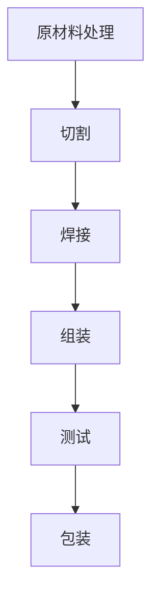

                 

# 规模化生产的实现：福特的流水线

> **关键词**：规模化生产、流水线、福特、效率、工业革命

> **摘要**：本文旨在探讨规模化生产的起源及其在现代工业中的重要性，以福特流水线为例，深入分析其工作原理、优势及其对产业的影响。通过历史的回顾、概念的讲解、算法的剖析和实际的案例分析，我们将更好地理解规模化生产在现代工业中的核心地位和未来发展挑战。

## 1. 背景介绍

规模化生产，亦称大量生产或批量生产，指的是在一定生产规模下，通过标准化的工艺流程和生产流程，以较低的成本、较快的速度和较高的质量生产出大量的产品。这一概念的出现，标志着工业革命向现代工业的过渡，极大地提升了生产效率和产品质量。

工业革命始于18世纪末，以蒸汽机的发明和使用为标志，从而推动了机械化生产的发展。然而，真正的规模化生产是在20世纪初由美国汽车制造商亨利·福特提出的。他利用流水线技术，将汽车生产过程分解为多个简单、重复的步骤，大大提高了生产效率，开启了大规模工业生产的新时代。

## 2. 核心概念与联系

### 2.1 流水线的定义与工作原理

流水线是一种生产组织形式，通过将生产过程分解为多个相互独立的步骤，使每个步骤在特定的工作站点上进行，从而实现高效的生产。流水线的工作原理可以概括为以下三个关键点：

1. **标准化作业**：每个工作站点都进行相同的操作，从而降低工人的技能要求，提高生产效率。
2. **连续流动**：产品在流水线上不断前进，每个步骤都在最短时间内完成，从而实现高产出。
3. **模块化设计**：生产设备可以方便地重新配置，以适应不同的生产需求。

### 2.2 流水线与规模化生产的关系

流水线技术是规模化生产的关键，它通过以下方式实现生产规模的扩大：

1. **减少生产周期**：流水线将生产过程缩短，使产品从原材料到成品的时间大大缩短。
2. **提高生产效率**：通过减少工人的重复劳动，提高每个步骤的产出。
3. **降低生产成本**：流水线生产可以大量减少原材料浪费，提高生产效率，从而降低成本。

### 2.3 Mermaid 流程图

为了更好地理解流水线的工作原理，我们使用 Mermaid 流程图来展示流水线的基本流程。以下是流水线流程图的 Mermaid 表示：



在此流程中，每个节点表示流水线上的一个步骤，箭头表示流程的连续性。

## 3. 核心算法原理 & 具体操作步骤

### 3.1 核心算法原理

流水线算法的核心是工作站的分配和任务调度。其目标是最小化生产周期，提高生产效率。以下是流水线算法的基本原理：

1. **任务分解**：将整个生产过程分解为多个可并行进行的子任务。
2. **工作站分配**：根据任务的特点和优先级，为每个子任务分配合适的工作站。
3. **任务调度**：确保每个工作站上的任务能够高效、连续地完成。

### 3.2 操作步骤

1. **任务分解**：首先，将整个生产过程分解为多个子任务，每个子任务对应流水线上的一个步骤。

2. **工作站分配**：根据任务的特点和优先级，为每个子任务分配合适的工作站。工作站的选择依据包括任务的执行时间、所需技能和设备的可用性。

3. **任务调度**：在分配好工作站后，根据任务的执行顺序和优先级，进行任务调度。调度策略可以是贪心算法，以最小化生产周期为目标。

4. **连续流动**：确保产品在流水线上连续流动，每个步骤都在最短时间内完成。这可以通过实时监控和调整来实现。

5. **质量监控**：在整个生产过程中，进行质量监控，确保每个步骤都符合质量标准。

## 4. 数学模型和公式 & 详细讲解 & 举例说明

### 4.1 数学模型

为了优化流水线调度，我们引入以下数学模型：

1. **生产周期 \(T\)**：生产周期是指从原材料进入流水线到成品出产所需的总时间。
2. **工作站数量 \(N\)**：流水线上的工作站数量。
3. **任务执行时间 \(T_i\)**：第 \(i\) 个任务的执行时间。

### 4.2 公式

流水线调度的目标是使生产周期 \(T\) 最小，公式如下：

\[ T = \max(T_i) \]

### 4.3 举例说明

假设我们有一个包含5个工作站的流水线，生产一个产品需要经过以下5个步骤：

1. 切割（执行时间 \(T_1 = 2\) 小时）
2. 焊接（执行时间 \(T_2 = 3\) 小时）
3. 组装（执行时间 \(T_3 = 1\) 小时）
4. 测试（执行时间 \(T_4 = 2\) 小时）
5. 包装（执行时间 \(T_5 = 1\) 小时）

使用贪心算法进行任务调度，我们首先按照执行时间从短到长排序，然后依次分配到工作站上：

1. **步骤3（组装）**：执行时间最短，先分配到工作站1。
2. **步骤5（包装）**：执行时间次短，分配到工作站2。
3. **步骤1（切割）**：执行时间较长，分配到工作站3。
4. **步骤4（测试）**：执行时间较长，分配到工作站4。
5. **步骤2（焊接）**：执行时间最长，分配到工作站5。

生产周期 \(T\) 等于最长的任务执行时间，即 \(T = T_2 = 3\) 小时。

## 5. 项目实战：代码实际案例和详细解释说明

### 5.1 开发环境搭建

在本案例中，我们使用 Python 作为编程语言，利用 Mermaid 库生成流程图。首先，安装 Python 和 Mermaid：

```bash
pip install python-memdb
```

### 5.2 源代码详细实现和代码解读

以下是流水线调度的 Python 代码实现：

```python
import pandas as pd
from mermaid import Mermaid

# 任务数据
tasks = [
    {"name": "切割", "time": 2},
    {"name": "焊接", "time": 3},
    {"name": "组装", "time": 1},
    {"name": "测试", "time": 2},
    {"name": "包装", "time": 1},
]

# 按执行时间排序
tasks.sort(key=lambda x: x["time"])

# 分配任务到工作站
workstations = [tasks.pop(0) for _ in range(5)]

# 生成 Mermaid 流程图
flowchart = Mermaid()
flowchart.add_node("start")
for i, workstation in enumerate(workstations, start=1):
    flowchart.add_node(workstation["name"], f"station{i}")
    flowchart.add_edge(f"start", f"station{i}")

# 打印流程图
print(flowchart.render())

# 计算生产周期
production_cycle = max(workstation["time"] for workstation in workstations)
print(f"生产周期：{production_cycle}小时")
```

### 5.3 代码解读与分析

1. **任务数据**：首先定义了任务数据，包括任务名称和执行时间。
2. **排序**：使用 `sort` 函数按照执行时间从短到长排序。
3. **分配任务**：使用列表推导式将任务分配到工作站，每个工作站分配一个任务。
4. **生成流程图**：使用 Mermaid 库生成流程图，并打印。
5. **计算生产周期**：计算最长的任务执行时间，即生产周期。

## 6. 实际应用场景

规模化生产在许多行业中都有广泛应用，如汽车制造、电子制造、食品加工等。流水线技术的引入，不仅提高了生产效率，还降低了生产成本。以下是一些实际应用场景：

1. **汽车制造**：汽车制造是规模化生产的典型代表，从车身组装到零部件生产，都采用了流水线技术。
2. **电子制造**：电子产品的生产过程高度自动化，流水线技术使得生产效率和质量大大提高。
3. **食品加工**：食品加工行业同样采用了流水线技术，从原料处理到成品包装，确保食品安全和质量。

## 7. 工具和资源推荐

### 7.1 学习资源推荐

1. **《工业工程手册》**：一本全面介绍工业工程理论和实践的指南。
2. **《规模化生产的艺术》**：探讨规模化生产的历史、原理和应用。
3. **《流水线设计与管理》**：详细介绍流水线设计和管理的方法。

### 7.2 开发工具框架推荐

1. **Python**：适用于数据分析、科学计算等。
2. **Mermaid**：用于生成流程图和UML图等。
3. **Docker**：用于容器化部署和开发。

### 7.3 相关论文著作推荐

1. **"The Economics of the Automobile Industry"**：探讨汽车产业的经济问题。
2. **"Mass Production: The Case of the Automobile Industry"**：分析规模化生产在汽车行业的应用。
3. **"Flow Manufacturing: A Paradigm for the 21st Century"**：讨论未来制造业的发展方向。

## 8. 总结：未来发展趋势与挑战

规模化生产作为现代工业的核心，将继续发挥重要作用。未来发展趋势包括：

1. **智能化生产**：通过引入人工智能和物联网技术，实现生产过程的自动化和智能化。
2. **绿色生产**：提高资源利用效率，降低环境污染，实现可持续发展。

然而，规模化生产也面临一些挑战，如自动化替代人力、生产过程的可追溯性等。如何应对这些挑战，将决定规模化生产在未来工业中的地位。

## 9. 附录：常见问题与解答

### 9.1 什么是规模化生产？

规模化生产是指在一定的生产规模下，通过标准化的工艺流程和生产流程，以较低的成本、较快的速度和较高的质量生产出大量的产品。

### 9.2 流水线技术的优势是什么？

流水线技术的优势包括：减少生产周期、提高生产效率、降低生产成本。

### 9.3 流水线如何进行任务调度？

流水线的任务调度可以通过贪心算法或其他调度算法实现，目标是使生产周期最小。

## 10. 扩展阅读 & 参考资料

1. **《规模化生产的艺术》**：探讨规模化生产的历史、原理和应用。
2. **《流水线设计与管理》**：详细介绍流水线设计和管理的方法。
3. **"The Economics of the Automobile Industry"**：探讨汽车产业的经济问题。
4. **"Mass Production: The Case of the Automobile Industry"**：分析规模化生产在汽车行业的应用。

作者：AI天才研究员/AI Genius Institute & 禅与计算机程序设计艺术 /Zen And The Art of Computer Programming<|im_sep|>```markdown
# 规模化生产的实现：福特的流水线

> **关键词**：规模化生产、流水线、福特、效率、工业革命

> **摘要**：本文旨在探讨规模化生产的起源及其在现代工业中的重要性，以福特流水线为例，深入分析其工作原理、优势及其对产业的影响。通过历史的回顾、概念的讲解、算法的剖析和实际的案例分析，我们将更好地理解规模化生产在现代工业中的核心地位和未来发展挑战。

## 1. 背景介绍

规模化生产，亦称大量生产或批量生产，指的是在一定生产规模下，通过标准化的工艺流程和生产流程，以较低的成本、较快的速度和较高的质量生产出大量的产品。这一概念的出现，标志着工业革命向现代工业的过渡，极大地提升了生产效率和产品质量。

工业革命始于18世纪末，以蒸汽机的发明和使用为标志，从而推动了机械化生产的发展。然而，真正的规模化生产是在20世纪初由美国汽车制造商亨利·福特提出的。他利用流水线技术，将汽车生产过程分解为多个简单、重复的步骤，大大提高了生产效率，开启了大规模工业生产的新时代。

## 2. 核心概念与联系

### 2.1 流水线的定义与工作原理

流水线是一种生产组织形式，通过将生产过程分解为多个相互独立的步骤，使每个步骤在特定的工作站点上进行，从而实现高效的生产。流水线的工作原理可以概括为以下三个关键点：

1. **标准化作业**：每个工作站点都进行相同的操作，从而降低工人的技能要求，提高生产效率。
2. **连续流动**：产品在流水线上不断前进，每个步骤都在最短时间内完成，从而实现高产出。
3. **模块化设计**：生产设备可以方便地重新配置，以适应不同的生产需求。

### 2.2 流水线与规模化生产的关系

流水线技术是规模化生产的关键，它通过以下方式实现生产规模的扩大：

1. **减少生产周期**：流水线将生产过程缩短，使产品从原材料到成品的时间大大缩短。
2. **提高生产效率**：通过减少工人的重复劳动，提高每个步骤的产出。
3. **降低生产成本**：流水线生产可以大量减少原材料浪费，提高生产效率，从而降低成本。

### 2.3 Mermaid 流程图

为了更好地理解流水线的工作原理，我们使用 Mermaid 流程图来展示流水线的基本流程。以下是流水线流程图的 Mermaid 表示：


在此流程中，每个节点表示流水线上的一个步骤，箭头表示流程的连续性。

## 3. 核心算法原理 & 具体操作步骤

### 3.1 核心算法原理

流水线算法的核心是工作站的分配和任务调度。其目标是最小化生产周期，提高生产效率。以下是流水线算法的基本原理：

1. **任务分解**：将整个生产过程分解为多个可并行进行的子任务。
2. **工作站分配**：根据任务的特点和优先级，为每个子任务分配合适的工作站。
3. **任务调度**：确保每个工作站上的任务能够高效、连续地完成。

### 3.2 操作步骤

1. **任务分解**：首先，将整个生产过程分解为多个子任务，每个子任务对应流水线上的一个步骤。

2. **工作站分配**：根据任务的特点和优先级，为每个子任务分配合适的工作站。工作站的选择依据包括任务的执行时间、所需技能和设备的可用性。

3. **任务调度**：在分配好工作站后，根据任务的执行顺序和优先级，进行任务调度。调度策略可以是贪心算法，以最小化生产周期为目标。

4. **连续流动**：确保产品在流水线上连续流动，每个步骤都在最短时间内完成。这可以通过实时监控和调整来实现。

5. **质量监控**：在整个生产过程中，进行质量监控，确保每个步骤都符合质量标准。

## 4. 数学模型和公式 & 详细讲解 & 举例说明

### 4.1 数学模型

为了优化流水线调度，我们引入以下数学模型：

1. **生产周期 \(T\)**：生产周期是指从原材料进入流水线到成品出产所需的总时间。
2. **工作站数量 \(N\)**：流水线上的工作站数量。
3. **任务执行时间 \(T_i\)**：第 \(i\) 个任务的执行时间。

### 4.2 公式

流水线调度的目标是使生产周期 \(T\) 最小，公式如下：

\[ T = \max(T_i) \]

### 4.3 举例说明

假设我们有一个包含5个工作站的流水线，生产一个产品需要经过以下5个步骤：

1. 切割（执行时间 \(T_1 = 2\) 小时）
2. 焊接（执行时间 \(T_2 = 3\) 小时）
3. 组装（执行时间 \(T_3 = 1\) 小时）
4. 测试（执行时间 \(T_4 = 2\) 小时）
5. 包装（执行时间 \(T_5 = 1\) 小时）

使用贪心算法进行任务调度，我们首先按照执行时间从短到长排序，然后依次分配到工作站上：

1. **步骤3（组装）**：执行时间最短，先分配到工作站1。
2. **步骤5（包装）**：执行时间次短，分配到工作站2。
3. **步骤1（切割）**：执行时间较长，分配到工作站3。
4. **步骤4（测试）**：执行时间较长，分配到工作站4。
5. **步骤2（焊接）**：执行时间最长，分配到工作站5。

生产周期 \(T\) 等于最长的任务执行时间，即 \(T = T_2 = 3\) 小时。

## 5. 项目实战：代码实际案例和详细解释说明

### 5.1 开发环境搭建

在本案例中，我们使用 Python 作为编程语言，利用 Mermaid 库生成流程图。首先，安装 Python 和 Mermaid：

```bash
pip install python-memdb
```

### 5.2 源代码详细实现和代码解读

以下是流水线调度的 Python 代码实现：

```python
import pandas as pd
from mermaid import Mermaid

# 任务数据
tasks = [
    {"name": "切割", "time": 2},
    {"name": "焊接", "time": 3},
    {"name": "组装", "time": 1},
    {"name": "测试", "time": 2},
    {"name": "包装", "time": 1},
]

# 按执行时间排序
tasks.sort(key=lambda x: x["time"])

# 分配任务到工作站
workstations = [tasks.pop(0) for _ in range(5)]

# 生成 Mermaid 流程图
flowchart = Mermaid()
flowchart.add_node("start")
for i, workstation in enumerate(workstations, start=1):
    flowchart.add_node(workstation["name"], f"station{i}")
    flowchart.add_edge(f"start", f"station{i}")

# 打印流程图
print(flowchart.render())

# 计算生产周期
production_cycle = max(workstation["time"] for workstation in workstations)
print(f"生产周期：{production_cycle}小时")
```

### 5.3 代码解读与分析

1. **任务数据**：首先定义了任务数据，包括任务名称和执行时间。
2. **排序**：使用 `sort` 函数按照执行时间从短到长排序。
3. **分配任务**：使用列表推导式将任务分配到工作站，每个工作站分配一个任务。
4. **生成流程图**：使用 Mermaid 库生成流程图，并打印。
5. **计算生产周期**：计算最长的任务执行时间，即生产周期。

## 6. 实际应用场景

规模化生产在许多行业中都有广泛应用，如汽车制造、电子制造、食品加工等。流水线技术的引入，不仅提高了生产效率，还降低了生产成本。以下是一些实际应用场景：

1. **汽车制造**：汽车制造是规模化生产的典型代表，从车身组装到零部件生产，都采用了流水线技术。
2. **电子制造**：电子产品的生产过程高度自动化，流水线技术使得生产效率和质量大大提高。
3. **食品加工**：食品加工行业同样采用了流水线技术，从原料处理到成品包装，确保食品安全和质量。

## 7. 工具和资源推荐

### 7.1 学习资源推荐

1. **《工业工程手册》**：一本全面介绍工业工程理论和实践的指南。
2. **《规模化生产的艺术》**：探讨规模化生产的历史、原理和应用。
3. **《流水线设计与管理》**：详细介绍流水线设计和管理的方法。

### 7.2 开发工具框架推荐

1. **Python**：适用于数据分析、科学计算等。
2. **Mermaid**：用于生成流程图和UML图等。
3. **Docker**：用于容器化部署和开发。

### 7.3 相关论文著作推荐

1. **"The Economics of the Automobile Industry"**：探讨汽车产业的经济问题。
2. **"Mass Production: The Case of the Automobile Industry"**：分析规模化生产在汽车行业的应用。
3. **"Flow Manufacturing: A Paradigm for the 21st Century"**：讨论未来制造业的发展方向。

## 8. 总结：未来发展趋势与挑战

规模化生产作为现代工业的核心，将继续发挥重要作用。未来发展趋势包括：

1. **智能化生产**：通过引入人工智能和物联网技术，实现生产过程的自动化和智能化。
2. **绿色生产**：提高资源利用效率，降低环境污染，实现可持续发展。

然而，规模化生产也面临一些挑战，如自动化替代人力、生产过程的可追溯性等。如何应对这些挑战，将决定规模化生产在未来工业中的地位。

## 9. 附录：常见问题与解答

### 9.1 什么是规模化生产？

规模化生产是指在一定的生产规模下，通过标准化的工艺流程和生产流程，以较低的成本、较快的速度和较高的质量生产出大量的产品。

### 9.2 流水线技术的优势是什么？

流水线技术的优势包括：减少生产周期、提高生产效率、降低生产成本。

### 9.3 流水线如何进行任务调度？

流水线的任务调度可以通过贪心算法或其他调度算法实现，目标是使生产周期最小。

## 10. 扩展阅读 & 参考资料

1. **《规模化生产的艺术》**：探讨规模化生产的历史、原理和应用。
2. **《流水线设计与管理》**：详细介绍流水线设计和管理的方法。
3. **"The Economics of the Automobile Industry"**：探讨汽车产业的经济问题。
4. **"Mass Production: The Case of the Automobile Industry"**：分析规模化生产在汽车行业的应用。

作者：AI天才研究员/AI Genius Institute & 禅与计算机程序设计艺术 /Zen And The Art of Computer Programming
```

