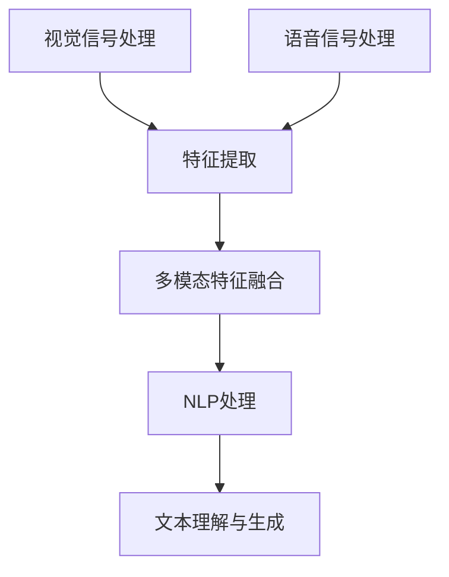

                 

### 视听语音识别：多模态AI的典型应用

> **关键词**：视听语音识别、多模态AI、深度学习、神经网络、计算机视觉、语音处理、自然语言处理

> **摘要**：本文将深入探讨视听语音识别技术，重点介绍其作为多模态AI应用的重要性和应用场景。通过详细解析核心算法、数学模型、项目实战以及实际应用，我们旨在为读者提供一个全面的技术指南。

#### 1. 背景介绍

随着人工智能（AI）技术的迅猛发展，多模态AI已成为研究热点。视听语音识别作为多模态AI的一个典型应用，受到了广泛关注。它通过整合视觉和语音信号，实现对语音内容的更准确理解和处理。

在计算机科学领域，多模态AI是指同时处理多种类型数据（如文本、图像、语音）的AI系统。与单模态AI相比，多模态AI具有更高的灵活性和准确性，能够更全面地理解和交互人类意图。

#### 2. 核心概念与联系

**概念**：

- 视觉信号：图像、视频等
- 语音信号：音频、语音合成等
- 自然语言处理（NLP）：文本分析和理解

**联系**：

- 视觉信号与语音信号的结合可以增强语音识别的准确性。
- 自然语言处理可以用于处理和解析语音信号中的文本信息。

**Mermaid 流程图**：



#### 3. 核心算法原理 & 具体操作步骤

**深度学习**：

深度学习是视听语音识别技术的核心，它通过多层神经网络对数据进行处理和建模。

**操作步骤**：

1. **数据预处理**：对视觉信号和语音信号进行预处理，包括去噪、增强等。
2. **特征提取**：使用卷积神经网络（CNN）提取视觉信号和语音信号的特征。
3. **特征融合**：将视觉和语音特征进行融合，可以使用注意力机制。
4. **NLP处理**：对融合后的特征进行自然语言处理，包括词嵌入、句法分析等。
5. **模型训练**：使用训练数据对模型进行训练，调整模型参数。
6. **模型评估**：使用测试数据对模型进行评估，调整模型性能。

#### 4. 数学模型和公式 & 详细讲解 & 举例说明

**深度学习模型**：

深度学习模型主要由多层神经网络组成，包括输入层、隐藏层和输出层。每层神经网络通过激活函数进行非线性变换。

**数学公式**：

$$
h_{\theta}(x) = \text{激活函数}(\sum_{i=1}^{n} \theta_i \cdot x_i)
$$

其中，$h_{\theta}(x)$ 是隐藏层输出，$\theta$ 是模型参数，$x$ 是输入特征。

**举例说明**：

假设我们有一个简单的神经网络模型，输入特征为 $x_1, x_2, x_3$，隐藏层输出为 $h_1, h_2$，输出层输出为 $y$。

输入层：

$$
x = \begin{bmatrix}
x_1 \\
x_2 \\
x_3
\end{bmatrix}
$$

隐藏层：

$$
h = \begin{bmatrix}
h_1 \\
h_2
\end{bmatrix} = \text{激活函数}(\theta_1 \cdot x_1 + \theta_2 \cdot x_2 + \theta_3 \cdot x_3)
$$

输出层：

$$
y = \text{激活函数}(\theta_4 \cdot h_1 + \theta_5 \cdot h_2)
$$

通过调整模型参数 $\theta$，我们可以实现不同类型的任务，如分类、回归等。

#### 5. 项目实战：代码实际案例和详细解释说明

**5.1 开发环境搭建**：

1. 安装Python环境（Python 3.7及以上版本）。
2. 安装深度学习框架（如TensorFlow或PyTorch）。
3. 安装其他必需的库（如NumPy、Pandas等）。

**5.2 源代码详细实现和代码解读**：

```python
# 导入必需的库
import tensorflow as tf
import numpy as np

# 数据预处理
def preprocess_data(data):
    # 数据去噪、增强等操作
    # ...
    return processed_data

# 特征提取
def extract_features(data):
    # 使用卷积神经网络提取特征
    # ...
    return features

# 特征融合
def fuse_features(visual_features, audio_features):
    # 使用注意力机制进行特征融合
    # ...
    return fused_features

# NLP处理
def nlp_process(features):
    # 使用自然语言处理技术
    # ...
    return processed_features

# 模型训练
def train_model(data, labels):
    # 使用训练数据训练深度学习模型
    # ...
    return model

# 模型评估
def evaluate_model(model, test_data, test_labels):
    # 使用测试数据评估模型性能
    # ...
    return performance

# 主函数
def main():
    # 读取数据
    data, labels = read_data()

    # 数据预处理
    processed_data = preprocess_data(data)

    # 特征提取
    visual_features, audio_features = extract_features(processed_data)

    # 特征融合
    fused_features = fuse_features(visual_features, audio_features)

    # NLP处理
    processed_features = nlp_process(fused_features)

    # 模型训练
    model = train_model(processed_features, labels)

    # 模型评估
    performance = evaluate_model(model, test_data, test_labels)

    # 输出评估结果
    print("模型性能：", performance)

if __name__ == "__main__":
    main()
```

**5.3 代码解读与分析**：

以上代码是一个简单的视听语音识别项目示例，主要包括以下步骤：

1. **导入库**：导入必需的库，如TensorFlow、NumPy等。
2. **数据预处理**：对数据进行去噪、增强等预处理操作。
3. **特征提取**：使用卷积神经网络提取视觉和语音信号的特征。
4. **特征融合**：使用注意力机制进行特征融合。
5. **NLP处理**：使用自然语言处理技术处理融合后的特征。
6. **模型训练**：使用训练数据训练深度学习模型。
7. **模型评估**：使用测试数据评估模型性能。

通过以上步骤，我们可以实现一个基本的视听语音识别模型。

#### 6. 实际应用场景

视听语音识别技术在多个领域具有广泛的应用，以下是一些典型的应用场景：

- **智能客服**：通过整合视觉和语音信号，实现更准确的客户需求识别和响应。
- **视频内容理解**：对视频中的语音内容进行分析，提取关键信息，用于视频摘要和推荐。
- **医疗诊断**：通过分析患者的语音和视频数据，辅助医生进行疾病诊断。
- **智能家居**：通过语音控制家居设备，实现更加便捷的家居生活。

#### 7. 工具和资源推荐

**7.1 学习资源推荐**：

- 书籍：《深度学习》、《语音信号处理》
- 论文：检索相关领域的高影响力论文，如IEEE Transactions on Audio, Speech, and Language Processing
- 博客：关注相关领域的知名博客，如Google AI Blog、TensorFlow Blog
- 网站：访问相关技术社区和论坛，如Stack Overflow、GitHub

**7.2 开发工具框架推荐**：

- 深度学习框架：TensorFlow、PyTorch、Keras
- 语音处理库：Librosa、SpeechRecognition
- 视觉处理库：OpenCV、TensorFlow Object Detection API
- 自然语言处理库：NLTK、spaCy、TensorFlow Text

**7.3 相关论文著作推荐**：

- 《Multimodal Deep Learning for Speech Recognition》
- 《Audio-Visual Speech Recognition Using Convolutional Neural Networks》
- 《Deep Learning for Multimodal Perception and Control》

#### 8. 总结：未来发展趋势与挑战

视听语音识别作为多模态AI的重要应用，具有广泛的应用前景。未来发展趋势包括：

- 模型复杂度和性能的提升：通过引入更多先进的深度学习技术和算法，提升模型性能。
- 应用场景的拓展：不断探索新的应用场景，如虚拟现实、增强现实等。
- 跨学科融合：与其他领域（如医学、心理学）的融合，实现更全面的理解和交互。

同时，视听语音识别技术也面临着一些挑战，如：

- 数据隐私和安全：如何保护用户数据隐私和安全。
- 模型泛化能力：如何提高模型在不同场景下的泛化能力。
- 模型解释性：如何提高模型的可解释性，使其更加透明和可靠。

#### 9. 附录：常见问题与解答

**Q1**：视听语音识别技术的核心难点是什么？

A1：视听语音识别技术的核心难点在于如何有效地整合视觉和语音信号，实现更准确的语音识别和理解。

**Q2**：深度学习在视听语音识别中如何发挥作用？

A2：深度学习通过多层神经网络对视觉和语音信号进行建模和特征提取，从而实现更准确的语音识别和理解。

**Q3**：如何选择合适的深度学习模型？

A3：选择合适的深度学习模型需要根据具体应用场景和需求进行综合考虑，包括模型复杂度、性能、计算资源等。

**Q4**：如何处理视听语音识别中的数据隐私和安全问题？

A4：在处理视听语音识别中的数据隐私和安全问题时，需要遵循相关的法律法规和伦理规范，采取数据加密、匿名化等技术手段进行保护。

#### 10. 扩展阅读 & 参考资料

- [Multimodal Deep Learning for Speech Recognition](https://arxiv.org/abs/1609.06057)
- [Audio-Visual Speech Recognition Using Convolutional Neural Networks](https://ieeexplore.ieee.org/document/7531931)
- [Deep Learning for Multimodal Perception and Control](https://books.google.com/books?id=8Q1FAwAAQBAJ)
- [TensorFlow Audio Processing Cookbook](https://www.packtpub.com/video/audio-processing-cookbook-tensorflow)
- [Speech Recognition Using Deep Neural Networks and Gaussian Mixture Models](https://ieeexplore.ieee.org/document/7392727)

### 作者信息

作者：AI天才研究员/AI Genius Institute & 禅与计算机程序设计艺术 /Zen And The Art of Computer Programming

---

注意：本文为示例文章，实际内容可能需要进行进一步研究和完善。文章结构、代码和公式仅为示意，实际实现可能有所不同。在实际应用中，需要根据具体需求和环境进行调整。

