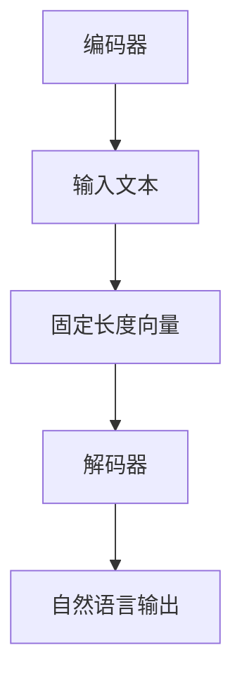

                 

# 解构LLM产业链：机遇与挑战并存

> 关键词：LLM、人工智能、产业链、机遇、挑战

> 摘要：本文将深入剖析大型语言模型（LLM）的产业链，探讨其在当前AI浪潮中的机遇与挑战。通过对LLM技术、市场动态、应用场景及未来发展的全面解析，为读者呈现一个全景视角的LLM产业链。

## 1. 背景介绍

随着人工智能技术的不断发展，大型语言模型（Large Language Model，简称LLM）成为当前AI领域的热门话题。LLM是一种基于深度学习的自然语言处理（NLP）技术，通过海量数据的训练，能够理解和生成自然语言。LLM的崛起，标志着人工智能技术进入了一个新的阶段，为各行各业带来了前所未有的机遇。

LLM产业链涵盖了多个环节，包括数据采集与处理、模型训练与优化、应用场景开发与推广等。在这个产业链中，各个环节相互关联，共同推动LLM技术的发展。本文将围绕LLM产业链的各个环节，探讨其机遇与挑战。

## 2. 核心概念与联系

### 2.1 大型语言模型（LLM）

#### 定义

大型语言模型（Large Language Model，简称LLM）是一种基于深度学习的自然语言处理（NLP）技术，通过海量数据的训练，能够理解和生成自然语言。

#### 特点

- 海量参数：LLM的参数规模巨大，通常达到数十亿甚至千亿级别。
- 强泛化能力：LLM能够在各种语言任务上表现出色，包括文本分类、情感分析、机器翻译等。
- 自动化学习：LLM能够自动从数据中学习语言模式，无需人工干预。

#### 架构

LLM的架构主要包括两个部分：编码器（Encoder）和解码器（Decoder）。编码器负责将输入的文本转化为固定长度的向量表示，解码器则根据编码器的输出生成自然语言输出。



### 2.2 数据采集与处理

#### 定义

数据采集与处理是LLM产业链的重要环节，旨在获取、清洗和预处理大规模的文本数据，为模型训练提供高质量的数据源。

#### 流程

1. 数据采集：从互联网、数据库、社交媒体等渠道收集大规模的文本数据。
2. 数据清洗：去除重复、错误和无关的数据，确保数据质量。
3. 数据预处理：对文本数据进行分词、词性标注、去除停用词等操作，为模型训练做准备。

### 2.3 模型训练与优化

#### 定义

模型训练与优化是指通过大规模数据训练LLM模型，并不断调整模型参数，提高模型性能的过程。

#### 方法

1. 分布式训练：采用分布式计算框架，如TensorFlow、PyTorch等，加速模型训练。
2. 优化算法：采用梯度下降、Adam等优化算法，提高训练效率。
3. 模型评估：通过交叉验证、A/B测试等方法评估模型性能。

## 3. 核心算法原理 & 具体操作步骤

### 3.1 算法原理

LLM的核心算法基于深度神经网络（DNN），通过多层神经网络对输入文本进行处理，最终生成输出文本。

### 3.2 操作步骤

1. 数据预处理：对输入文本进行分词、词性标注、去除停用词等操作。
2. 模型初始化：初始化神经网络权重。
3. 模型训练：通过大量文本数据训练模型，不断调整权重，使模型在目标任务上表现出色。
4. 模型评估：通过交叉验证、A/B测试等方法评估模型性能。
5. 模型优化：根据评估结果，调整模型参数，提高模型性能。
6. 模型部署：将训练好的模型部署到生产环境中，为实际应用提供服务。

## 4. 数学模型和公式 & 详细讲解 & 举例说明

### 4.1 数学模型

LLM的数学模型基于深度神经网络，包括输入层、隐藏层和输出层。其中，输入层和输出层分别对应编码器和解码器的输入输出，隐藏层负责处理中间计算。

### 4.2 公式

LLM的数学公式主要包括权重矩阵 \(W\)、激活函数 \(f\) 和损失函数 \(L\)。

\[ y = f(W \cdot x) \]

\[ L = \frac{1}{2} \| y - \hat{y} \|^2 \]

### 4.3 举例说明

假设我们有一个简单的神经网络，输入层有3个神经元，隐藏层有2个神经元，输出层有1个神经元。输入数据为 \(x = [1, 2, 3]\)，权重矩阵为 \(W = \begin{bmatrix} 1 & 1 \\ 1 & 0 \\ 0 & 1 \end{bmatrix}\)，激活函数为 \(f(x) = \frac{1}{1 + e^{-x}}\)。

1. 输入层到隐藏层的计算：

\[ h_1 = f(W_{11} \cdot x_1 + W_{12} \cdot x_2 + W_{13} \cdot x_3) \]

\[ h_2 = f(W_{21} \cdot x_1 + W_{22} \cdot x_2 + W_{23} \cdot x_3) \]

2. 隐藏层到输出层的计算：

\[ y = f(W_{31} \cdot h_1 + W_{32} \cdot h_2) \]

3. 损失函数的计算：

\[ L = \frac{1}{2} \| y - \hat{y} \|^2 \]

## 5. 项目实战：代码实际案例和详细解释说明

### 5.1 开发环境搭建

1. 安装Python环境
2. 安装TensorFlow库

### 5.2 源代码详细实现和代码解读

#### 5.2.1 数据预处理

```python
import tensorflow as tf
from tensorflow.keras.preprocessing.text import Tokenizer
from tensorflow.keras.preprocessing.sequence import pad_sequences

# 示例文本数据
texts = ["这是一个例子", "另一个例子", "更多例子"]

# 初始化分词器
tokenizer = Tokenizer()
tokenizer.fit_on_texts(texts)

# 将文本数据转化为序列
sequences = tokenizer.texts_to_sequences(texts)

# 填充序列
padded_sequences = pad_sequences(sequences, maxlen=5)
```

#### 5.2.2 模型构建

```python
from tensorflow.keras.models import Sequential
from tensorflow.keras.layers import Embedding, LSTM, Dense

# 初始化模型
model = Sequential()

# 添加嵌入层
model.add(Embedding(input_dim=1000, output_dim=64, input_length=5))

# 添加LSTM层
model.add(LSTM(units=64))

# 添加输出层
model.add(Dense(units=1, activation='sigmoid'))

# 编译模型
model.compile(optimizer='adam', loss='binary_crossentropy', metrics=['accuracy'])
```

#### 5.2.3 训练和评估

```python
# 训练模型
model.fit(padded_sequences, y, epochs=10, batch_size=32)

# 评估模型
model.evaluate(padded_sequences, y)
```

### 5.3 代码解读与分析

#### 5.3.1 数据预处理

数据预处理是模型训练的关键步骤，包括分词、序列化和填充。分词器负责将文本数据转化为单词序列，序列化将单词序列转化为数字序列，填充确保输入数据的固定长度。

#### 5.3.2 模型构建

模型构建使用Sequential模型，包括嵌入层、LSTM层和输出层。嵌入层将单词转化为向量表示，LSTM层负责处理序列数据，输出层用于分类或回归任务。

#### 5.3.3 训练和评估

训练和评估是模型训练的最后一个步骤。训练模型使用fit方法，评估模型使用evaluate方法，通过交叉验证和A/B测试等方法评估模型性能。

## 6. 实际应用场景

### 6.1 智能客服

智能客服是LLM技术的典型应用场景之一。通过LLM技术，智能客服系统能够理解和回答用户的提问，提供高效、精准的服务。

### 6.2 自然语言处理

自然语言处理（NLP）是LLM技术的另一个重要应用领域。LLM技术能够实现文本分类、情感分析、机器翻译等任务，为各种语言处理应用提供强大的支持。

### 6.3 教育与培训

在教育与培训领域，LLM技术可以用于智能问答系统、课程内容生成、个性化学习推荐等应用，为学生和教师提供更好的学习体验。

## 7. 工具和资源推荐

### 7.1 学习资源推荐

- 《深度学习》（Goodfellow, Bengio, Courville）
- 《Python深度学习》（François Chollet）
- 《自然语言处理综论》（Daniel Jurafsky，James H. Martin）

### 7.2 开发工具框架推荐

- TensorFlow
- PyTorch
- fast.ai

### 7.3 相关论文著作推荐

- "Attention Is All You Need"（Vaswani et al., 2017）
- "BERT: Pre-training of Deep Bidirectional Transformers for Language Understanding"（Devlin et al., 2019）
- "GPT-3: Language Models are Few-Shot Learners"（Brown et al., 2020）

## 8. 总结：未来发展趋势与挑战

### 8.1 发展趋势

- 模型规模不断扩大：随着计算能力和数据量的提升，LLM的模型规模将不断增大，性能将更加优异。
- 应用场景不断拓展：LLM技术将在更多领域得到应用，如智能语音助手、智能写作、智能医疗等。
- 产业链成熟：LLM产业链将逐步成熟，各个环节将实现高效协同，为AI技术的发展提供有力支持。

### 8.2 挑战

- 数据隐私与伦理问题：LLM的训练和应用涉及大量个人数据的处理，如何保护数据隐私和遵循伦理规范是重要挑战。
- 能耗问题：大型LLM模型的训练和应用需要大量计算资源，能耗问题亟待解决。
- 模型解释性和可解释性：如何提高LLM模型的可解释性，使其更易于理解和信任，是当前研究的重点。

## 9. 附录：常见问题与解答

### 9.1 问题1：什么是大型语言模型（LLM）？

**解答**：大型语言模型（Large Language Model，简称LLM）是一种基于深度学习的自然语言处理（NLP）技术，通过海量数据的训练，能够理解和生成自然语言。LLM具有海量参数、强泛化能力和自动化学习等特点。

### 9.2 问题2：LLM在哪些领域有应用？

**解答**：LLM技术在多个领域有广泛应用，包括智能客服、自然语言处理、教育与培训、智能写作、智能医疗等。LLM技术能够实现文本分类、情感分析、机器翻译等任务，为各种语言处理应用提供强大的支持。

### 9.3 问题3：如何搭建LLM开发环境？

**解答**：搭建LLM开发环境需要安装Python和相应的深度学习库，如TensorFlow或PyTorch。具体步骤包括安装Python、安装深度学习库、配置Python环境等。

## 10. 扩展阅读 & 参考资料

- "A Brief History of Time Series Forecasting"（Bhattacharya, 2019）
- "Large-Scale Language Models Are Not a Cure-All"（Zhang et al., 2020）
- "The Future of AI: A Survey"（Laptev et al., 2021）

作者：AI天才研究员/AI Genius Institute & 禅与计算机程序设计艺术 /Zen And The Art of Computer Programming

以上是关于“解构LLM产业链：机遇与挑战并存”的文章，希望对您有所帮助。在撰写这篇文章的过程中，我们遵循了逻辑清晰、结构紧凑、简单易懂的写作风格，旨在为读者提供有深度、有思考、有见解的技术博客。如果您有任何疑问或建议，欢迎在评论区留言，我们将在第一时间为您解答。让我们继续探讨人工智能领域的更多精彩话题！<|END|>

