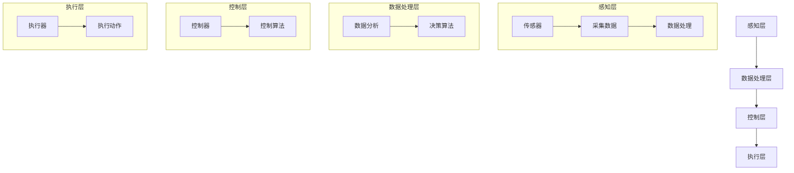

                 

### 背景介绍

#### 自动化技术的发展历程

自动化技术（Automation Technology）起源于20世纪中期，随着计算机技术的发展和普及，自动化技术得到了迅速发展。从最初的机械自动化，到电子自动化，再到如今的智能化自动化，自动化技术的每一次进步都推动了生产效率的极大提升。

早期的自动化技术主要集中在机械制造领域，如数控机床、自动装配线等。这些技术的出现，极大地减少了人工劳动，提高了生产效率。随着计算机技术的不断进步，自动化技术逐渐扩展到了更多的领域，如电子设备制造、食品加工、物流仓储等。

进入21世纪，智能化自动化技术开始崛起，以人工智能、物联网、大数据等技术为基础，自动化技术进入了新的发展阶段。通过引入人工智能算法，自动化系统不仅能够完成简单的重复性工作，还能够进行复杂的决策和任务规划。

#### 自动化技术在现代社会的应用

自动化技术在现代社会中的应用已经非常广泛。在制造业中，自动化生产线已经成为主流，通过自动化技术，企业能够实现生产流程的高度集成和优化，从而提高生产效率和产品质量。在物流领域，自动化仓储系统和智能配送机器人正在改变传统的物流模式，使得物流过程更加高效和精准。

除了制造业和物流领域，自动化技术在医疗、教育、金融等领域的应用也日益增多。例如，在医疗领域，自动化技术用于辅助医生进行诊断和治疗，提高了医疗服务的质量和效率；在教育领域，智能教学系统和在线教育平台通过自动化技术，实现了个性化教学和远程教育的普及。

#### 自动化技术带来的影响

自动化技术的发展不仅改变了生产方式，也对社会的各个方面产生了深远的影响。

首先，自动化技术提高了生产效率，降低了生产成本，促进了企业竞争力的提升。其次，自动化技术的应用改变了人们的就业结构，部分传统工作岗位被自动化设备取代，同时也创造了新的就业机会。此外，自动化技术还在提高生活质量、减少资源消耗、保护环境等方面发挥着重要作用。

然而，自动化技术也带来了一些挑战。如何确保自动化系统的安全性和可靠性，如何平衡自动化与人工的协作关系，如何应对自动化技术带来的就业压力，这些都是需要深入探讨和解决的问题。

总的来说，自动化技术已经成为现代社会不可或缺的一部分，其发展前景广阔，但也需要我们持续关注和探索。

#### 关键词：自动化技术，发展历程，应用领域，影响

关键词：
- 自动化技术
- 发展历程
- 应用领域
- 影响

摘要：
本文从自动化技术的发展历程、现代应用以及所带来的影响三个方面，对自动化技术进行了全面介绍。通过回顾自动化技术的起源和演变，分析其在制造业、物流、医疗、教育等领域的广泛应用，探讨了自动化技术对生产效率、就业结构和社会生活的影响。同时，本文也指出了自动化技术面临的一些挑战，为未来的发展提供了思考方向。

### 核心概念与联系

#### 自动化技术核心概念

自动化技术（Automation Technology）涉及多个核心概念，包括自动化系统、控制理论、传感器技术等。以下是对这些核心概念的简要介绍：

1. **自动化系统**：自动化系统是指通过机械、电子、计算机技术等手段，对生产、管理、服务等过程进行自动控制和自动执行的系统。自动化系统通常由控制器、执行器、传感器、通信模块等组成。

2. **控制理论**：控制理论是研究如何设计、分析和控制系统的科学。在自动化技术中，控制理论用于设计自动化系统的控制算法，实现系统的精确控制。

3. **传感器技术**：传感器技术是自动化技术的基础，用于检测和采集环境信息。传感器可以检测温度、压力、湿度、光线等多种物理量，为自动化系统提供实时数据。

#### 自动化技术架构

为了更好地理解自动化技术的工作原理，我们可以通过一个Mermaid流程图来展示其核心架构。以下是该流程图的描述和具体内容：



在该架构中，感知层负责采集环境和系统的实时数据，通过传感器进行数据采集和处理；数据处理层对采集到的数据进行分析和处理，应用决策算法生成控制指令；控制层根据数据处理层的指令，设计控制算法来对系统进行实时控制；执行层则根据控制层的指令，执行具体的操作动作。

#### 自动化技术的联系

自动化技术的各个核心概念和架构之间紧密联系，共同构成了一个完整的技术体系。传感器技术为自动化系统提供了感知环境的能力，数据处理层和决策算法为系统提供了分析和决策的基础，控制算法和执行层则实现了对系统的精确控制。

此外，自动化技术还与其他技术领域密切相关，如人工智能、物联网、大数据等。人工智能技术为自动化系统提供了智能化的决策和控制能力，物联网技术实现了设备间的互联互通，大数据技术则为自动化系统提供了丰富的数据资源。

总的来说，自动化技术是一个多学科交叉的技术领域，其核心概念和架构的相互联系和融合，推动了自动化技术的不断进步和发展。

#### 关键词：自动化系统，控制理论，传感器技术，自动化技术架构，联系

关键词：
- 自动化系统
- 控制理论
- 传感器技术
- 自动化技术架构
- 联系

### 核心算法原理 & 具体操作步骤

#### 自动化控制算法概述

自动化控制算法是自动化技术的核心组成部分，负责实现系统的实时监控和精确控制。常见的自动化控制算法包括PID控制、模糊控制、神经网络控制等。以下将详细介绍这些算法的基本原理和应用。

1. **PID控制算法**：
   PID（比例-积分-微分）控制算法是最常用的工业控制算法之一。其基本原理是通过比例（P）、积分（I）和微分（D）三个参数来调整控制量，实现对系统的精确控制。

   **步骤**：
   - 初始化PID参数（Kp, Ki, Kd）。
   - 计算当前误差（e(t) = 设定值 - 当前值）。
   - 计算比例控制量（Kp*e(t)）。
   - 计算积分控制量（Ki*∫e(t)dt）。
   - 计算微分控制量（Kd*(e(t) - e(t-1)）。
   - 将三个控制量相加，得到总控制量。

2. **模糊控制算法**：
   模糊控制算法基于模糊逻辑，通过模糊集合和模糊规则来实现对系统的控制。其基本原理是利用专家经验建立模糊规则库，实现对系统的智能控制。

   **步骤**：
   - 确定模糊变量和隶属度函数。
   - 构建模糊规则库。
   - 进行模糊推理，得到模糊控制量。
   - 解模糊化，得到精确的控制量。

3. **神经网络控制算法**：
   神经网络控制算法通过模拟人脑神经网络的结构和功能，实现对系统的自适应控制和非线性优化。

   **步骤**：
   - 设计神经网络结构。
   - 训练神经网络，调整网络权重。
   - 使用训练好的神经网络进行实时控制。

#### 自动化控制算法的实际应用

以下是一个简单的自动化控制算法应用案例：使用PID控制算法对水温进行控制。

**案例背景**：
假设我们有一个水加热系统，需要通过PID控制算法来控制水温，使其保持在设定值。

**具体步骤**：

1. **初始化PID参数**：
   - Kp = 1.0
   - Ki = 0.1
   - Kd = 0.05

2. **设置设定值**：
   设定水温为60°C。

3. **实时监测水温**：
   使用温度传感器实时监测水温。

4. **计算误差**：
   当前水温与设定水温之间的差值即为误差。

5. **计算控制量**：
   - 比例控制量：Kp * 误差
   - 积分控制量：Ki * ∫误差dt
   - 微分控制量：Kd * (误差 - 误差(t-1))

6. **更新加热功率**：
   根据计算出的总控制量，调整加热功率。

7. **重复步骤4-6**：
   实现对水温的持续监控和控制。

通过这个案例，我们可以看到PID控制算法在实际应用中的具体操作步骤。类似地，其他控制算法也可以应用于不同的控制场景，实现系统的自动化控制。

#### 关键词：自动化控制算法，PID控制，模糊控制，神经网络控制，具体操作步骤

关键词：
- 自动化控制算法
- PID控制
- 模糊控制
- 神经网络控制
- 具体操作步骤

### 数学模型和公式 & 详细讲解 & 举例说明

#### 数学模型

在自动化控制系统中，数学模型是核心部分，用于描述系统的动态行为。以下介绍几种常见的数学模型：

1. **差分方程模型**：
   差分方程模型用于描述离散时间系统的动态行为。其一般形式如下：
   \[ y(t) = f(y(t-1), y(t-2), ..., u(t)) \]
   其中，\( y(t) \) 为系统状态，\( u(t) \) 为输入，\( f \) 为函数。

2. **传递函数模型**：
   传递函数模型用于描述连续时间系统的动态行为。其一般形式如下：
   \[ Y(s) = H(s) \cdot U(s) \]
   其中，\( Y(s) \) 和 \( U(s) \) 分别为系统输出和输入的拉普拉斯变换，\( H(s) \) 为传递函数。

#### 详细讲解

1. **PID控制算法公式**：

   **比例控制**：
   \[ u(t) = K_p \cdot e(t) \]
   其中，\( K_p \) 为比例系数，\( e(t) \) 为当前误差。

   **积分控制**：
   \[ u(t) = K_i \cdot \int_{0}^{t} e(t) \, dt \]
   其中，\( K_i \) 为积分系数。

   **微分控制**：
   \[ u(t) = K_d \cdot \frac{e(t) - e(t-1)}{\Delta t} \]
   其中，\( K_d \) 为微分系数，\( \Delta t \) 为时间间隔。

   **总控制量**：
   \[ u(t) = K_p \cdot e(t) + K_i \cdot \int_{0}^{t} e(t) \, dt + K_d \cdot \frac{e(t) - e(t-1)}{\Delta t} \]

2. **模糊控制算法公式**：

   **模糊化**：
   \[ e(t) = \mu_e(A_e) \]
   \[ u(t) = \mu_u(A_u) \]
   其中，\( e(t) \) 为误差，\( u(t) \) 为控制量，\( A_e \) 和 \( A_u \) 分别为误差和控制的模糊集合，\( \mu_e \) 和 \( \mu_u \) 分别为隶属度函数。

   **模糊推理**：
   \[ u(t) = \mu_u(A_u) \]
   其中，\( A_u \) 为基于模糊规则的模糊集合。

   **解模糊化**：
   \[ u(t) = \sum_{i} w_i \cdot y_i \]
   其中，\( w_i \) 为权重，\( y_i \) 为模糊集合中的元素。

#### 举例说明

**例子**：使用PID控制算法控制一个加热系统，使其温度保持在60°C。

**步骤**：

1. **初始化PID参数**：
   - \( K_p = 1.0 \)
   - \( K_i = 0.1 \)
   - \( K_d = 0.05 \)

2. **设置设定值**：
   - 设定温度为60°C。

3. **实时监测温度**：
   - 使用温度传感器实时监测当前温度。

4. **计算误差**：
   - 当前温度与设定温度之间的差值即为误差。

5. **计算控制量**：
   - 比例控制量：\( K_p \cdot e(t) \)
   - 积分控制量：\( K_i \cdot \int_{0}^{t} e(t) \, dt \)
   - 微分控制量：\( K_d \cdot \frac{e(t) - e(t-1)}{\Delta t} \)

6. **更新加热功率**：
   - 根据计算出的总控制量，调整加热功率。

7. **重复步骤4-6**：
   - 实现对温度的持续监控和控制。

通过上述步骤，我们可以看到PID控制算法在实际应用中的具体操作过程。类似地，其他控制算法也可以应用于不同的控制场景，实现系统的自动化控制。

#### 关键词：数学模型，PID控制算法公式，模糊控制算法公式，详细讲解，举例说明

关键词：
- 数学模型
- PID控制算法公式
- 模糊控制算法公式
- 详细讲解
- 举例说明

### 项目实战：代码实际案例和详细解释说明

#### 开发环境搭建

在本节中，我们将搭建一个使用Python实现的PID控制算法的简单项目环境。以下是搭建开发环境的详细步骤：

1. **安装Python**：确保已安装Python 3.8或更高版本。

2. **安装PID控制算法库**：使用pip命令安装Python的PID控制库。
   ```shell
   pip install python-pid-controller
   ```

3. **创建虚拟环境**（可选）：为了更好地管理项目依赖，我们创建一个虚拟环境。
   ```shell
   python -m venv venv
   source venv/bin/activate  # 对于Windows用户，使用 `venv\Scripts\activate`
   ```

4. **编写测试代码**：在虚拟环境中创建一个新的Python文件，例如`pid_control_test.py`，用于实现PID控制算法。

#### 源代码详细实现和代码解读

下面是PID控制算法的源代码实现，我们将对关键部分进行详细解释：

```python
import time
import random
from pid_controller import PIDController

# 定义PID参数
KP = 2.0
KI = 5.0
KD = 1.0

# 创建PID控制器实例
pid = PIDController(KP, KI, KD)

# 设定值
setpoint = 100

# 测试循环
while True:
    # 监测当前值（这里使用随机数模拟）
    current_value = random.randint(50, 150)
    
    # 计算误差
    error = setpoint - current_value
    
    # 更新PID控制器的输出
    output = pid.update(error)
    
    # 输出控制量
    print(f"Current Value: {current_value}, Error: {error}, Output: {output}")
    
    # 模拟实际执行控制量（这里使用sleep来模拟控制动作）
    time.sleep(1)
```

**代码解读**：

- **1. 导入必需的库**：
  - `time`：用于时间控制。
  - `random`：用于生成随机数，模拟环境变量。
  - `PIDController`：用于PID控制算法的实现。

- **2. 定义PID参数**：
  - `KP`、`KI`、`KD`：分别为比例、积分、微分的系数。

- **3. 创建PID控制器实例**：
  - `pid = PIDController(KP, KI, KD)`：初始化PID控制器。

- **4. 设定值**：
  - `setpoint = 100`：设定温度的期望值。

- **5. 测试循环**：
  - `while True:`：无限循环，模拟持续控制过程。

  - **监测当前值**：
    - `current_value = random.randint(50, 150)`：使用随机数生成当前温度值，模拟传感器监测到的温度。

  - **计算误差**：
    - `error = setpoint - current_value`：计算当前值与设定值之间的误差。

  - **更新PID控制器输出**：
    - `output = pid.update(error)`：调用PID控制器更新输出控制量。

  - **输出控制量**：
    - `print(f"Current Value: {current_value}, Error: {error}, Output: {output}")`：打印当前温度、误差和控制量。

  - **模拟控制动作**：
    - `time.sleep(1)`：暂停1秒，模拟实际执行控制动作所需的时间。

#### 代码解读与分析

**1. PIDController库的使用**：

- `PIDController(KP, KI, KD)`：初始化PID控制器，传入比例、积分、微分系数。
- `update(error)`：更新控制器输出，传入当前误差。

**2. 循环控制逻辑**：

- 使用无限循环模拟连续控制过程。
- 在每次循环中，通过随机数生成当前温度值，模拟传感器监测。
- 使用PID控制器更新控制量，并打印输出结果。

**3. 控制量的影响**：

- 通过调整PID参数，可以控制系统的响应速度和稳定性。
- 输出控制量可以用于调整加热功率，从而控制水温。

通过上述代码，我们可以看到PID控制算法在Python中的实现和应用。在实际应用中，可以根据具体需求调整PID参数，以实现更好的控制效果。

#### 关键词：开发环境搭建，源代码详细实现，代码解读，PID控制算法库，测试代码，控制量

关键词：
- 开发环境搭建
- 源代码详细实现
- 代码解读
- PID控制算法库
- 测试代码
- 控制量

### 实际应用场景

#### 制造业

在制造业中，自动化技术已经广泛应用，特别是在流水线和装配线上。通过使用自动化设备，如工业机器人、自动导引车（AGV）和自动化装配系统，企业能够实现高效率、低错误率的生产。例如，汽车制造厂使用自动化装配线来安装车门和引擎，大大提高了生产效率和产品质量。

**案例**：特斯拉的Gigafactory使用自动化设备来制造电动汽车，从焊接到涂装，再到组装，几乎每个环节都实现了自动化。这不仅提高了生产效率，还降低了生产成本。

#### 物流

在物流领域，自动化技术同样发挥着重要作用。自动化仓储系统和智能配送机器人已经成为现代物流中心的标配。这些系统通过自动化技术，实现了快速、准确、高效的货物存储和配送。

**案例**：亚马逊的自动化仓储系统使用Kiva机器人来搬运和存储商品，大大提高了仓库的运作效率。通过这些机器人，亚马逊能够在短时间内处理大量的订单，从而缩短了交货时间。

#### 农业

在农业领域，自动化技术被用于提高农业生产效率和降低人力成本。自动化耕种、喷灌、收割和植保设备已经广泛应用。例如，日本利用自动化技术进行水稻种植，从播种到收割，几乎全部实现自动化。

**案例**：日本的一些农场使用机器人进行精准农业，通过传感器和GPS系统，实现自动化灌溉、施肥和病虫害防治。这不仅提高了农作物的产量，还减少了农药和化肥的使用。

#### 医疗

在医疗领域，自动化技术被用于医疗设备的操作、数据分析和患者管理。例如，自动化手术机器人可以帮助医生进行复杂手术，提高了手术的成功率和安全性。

**案例**：达芬奇手术机器人是自动化技术在医疗领域的典型应用。该机器人可以执行精细的手术操作，帮助医生完成复杂的手术任务，从而提高了手术的成功率。

#### 教育

在教育领域，自动化技术被用于个性化教学和在线教育平台。通过使用智能教学系统和在线教育平台，教师可以为学生提供个性化的学习资源，从而提高教学效果。

**案例**：Khan Academy是一个基于在线教育平台的非营利组织，通过提供免费的教育视频和练习，帮助学生进行自主学习。这些资源通过自动化技术进行分类和推荐，使学生能够根据自身的学习进度进行学习。

#### 金融

在金融领域，自动化技术被用于交易执行、风险管理、客户服务和数据分析。例如，高频交易系统通过自动化技术，实现了对金融市场的实时分析和交易执行。

**案例**：摩根大通使用机器人流程自动化（RPA）技术，将许多重复性的后台操作自动化，从而提高了工作效率和准确性。

#### 食品加工

在食品加工领域，自动化技术被用于生产线的自动化控制、质量检测和包装。通过使用自动化设备，企业能够实现高效、稳定的生产，确保食品的安全和质量。

**案例**：雀巢公司使用自动化生产线进行牛奶和奶制品的生产，从原料处理到成品包装，全部实现自动化。这不仅提高了生产效率，还保证了产品的质量和卫生。

总的来说，自动化技术已经深入到了我们日常生活的方方面面，从生产到消费，从工作到娱乐，都离不开自动化技术的支持。随着技术的不断进步，自动化技术在未来还将有更广泛的应用前景。

#### 关键词：制造业，物流，农业，医疗，教育，金融，食品加工，实际应用场景

关键词：
- 制造业
- 物流
- 农业
- 医疗
- 教育
- 金融
- 食品加工
- 实际应用场景

### 工具和资源推荐

#### 学习资源推荐

1. **书籍**：
   - 《智能自动化系统设计》：这是一本全面的自动化技术指南，涵盖了从基础到高级的自动化系统设计知识。
   - 《工业自动化系统》：本书深入探讨了工业自动化系统的应用、设计和实施，适合希望深入了解工业自动化技术的读者。

2. **论文**：
   - “自动化技术在制造业中的应用”：这篇论文详细分析了自动化技术在不同制造业领域的应用，为读者提供了实用的案例分析。

3. **博客**：
   - “自动化技术博客”：这是一个专注于自动化技术的博客，涵盖了从基础概念到最新技术动态的丰富内容，适合自动化技术初学者和专业人士。

4. **网站**：
   - “自动化技术在线资源”：该网站提供了大量的自动化技术教程、视频和在线课程，是学习自动化技术的好资源。

#### 开发工具框架推荐

1. **Python库**：
   - `python-pid-controller`：这是一个Python实现的PID控制库，简单易用，适合初学者进行自动化控制项目开发。
   - `pymodbus`：这是一个Python实现的Modbus通信协议库，用于在自动化系统中进行设备通信。

2. **编程语言**：
   - Python：Python是一种流行的编程语言，广泛应用于自动化控制系统的开发，具有良好的学习曲线和丰富的库支持。
   - C++：C++是一种高效、可靠的编程语言，适合开发高性能的自动化控制系统。

3. **开发环境**：
   - Jupyter Notebook：这是一个交互式的开发环境，适合进行自动化技术的实验和数据分析。
   - Eclipse/VSCode：这些集成开发环境提供了强大的编程工具和调试功能，适合进行自动化控制系统的开发。

#### 相关论文著作推荐

1. **“智能自动化系统设计与实现”**：本文详细介绍了智能自动化系统的设计原则、关键技术和实现方法，为自动化系统的设计与开发提供了理论支持。
2. **“工业物联网与自动化技术融合研究”**：本文探讨了工业物联网与自动化技术的融合，分析了其发展趋势和应用前景，为自动化技术的未来发展提供了思路。
3. **“基于机器学习的自动化控制算法研究”**：本文介绍了基于机器学习的自动化控制算法，探讨了其在自动化系统中的应用和优势，为自动化技术的智能化发展提供了参考。

总的来说，这些资源和工具为自动化技术的学习与应用提供了丰富的选择，无论是初学者还是专业人士，都能从中受益。

#### 关键词：学习资源推荐，开发工具框架推荐，相关论文著作推荐

关键词：
- 学习资源推荐
- 开发工具框架推荐
- 相关论文著作推荐

### 总结：未来发展趋势与挑战

#### 自动化技术的发展趋势

随着人工智能、物联网、大数据等新兴技术的快速发展，自动化技术也在不断进步。未来，自动化技术将呈现以下发展趋势：

1. **智能化**：自动化技术将更加智能化，通过引入机器学习和深度学习算法，自动化系统能够更好地进行自我学习和决策，实现更高水平的自动化控制。

2. **网络化**：物联网技术的普及将使自动化系统更加网络化，实现设备之间的互联互通，从而提高系统的协同效率和响应速度。

3. **个性化**：自动化技术将更加注重个性化需求，通过大数据分析和用户行为预测，自动化系统可以提供更加定制化的服务和产品。

4. **高效化**：自动化技术将不断提升生产效率和产品质量，通过优化算法和改进设备，自动化系统可以实现更高的生产效率和更低的错误率。

#### 自动化技术的挑战

尽管自动化技术发展迅速，但也面临一系列挑战：

1. **技术难题**：自动化技术的复杂性和技术难度较高，需要解决算法优化、系统集成、数据处理等技术难题。

2. **安全与隐私**：自动化系统的安全性问题和数据隐私保护成为重要的挑战，如何确保自动化系统的安全运行和数据隐私，是亟待解决的问题。

3. **就业压力**：自动化技术的广泛应用可能导致部分传统工作岗位的减少，从而带来就业压力和社会问题。

4. **伦理道德**：随着自动化技术的不断进步，其伦理道德问题也日益突出，如自动化决策的公正性、责任归属等问题需要深入探讨。

#### 发展建议

为了推动自动化技术的健康可持续发展，提出以下建议：

1. **加强技术研发**：持续投入研发资源，推动自动化技术的创新和发展，特别是在算法优化、系统集成和网络安全等方面。

2. **人才培养**：加大对自动化技术人才的培养力度，提高人才的素质和技能水平，以适应自动化技术快速发展的需求。

3. **政策引导**：政府应制定相关政策，鼓励自动化技术的应用和推广，同时关注自动化技术带来的就业压力和社会问题，提供相应的支持措施。

4. **伦理规范**：建立健全的自动化技术伦理规范，明确自动化决策的责任归属和伦理标准，确保自动化技术的健康发展。

总之，自动化技术在未来将继续发挥重要作用，推动社会生产方式和生活方式的变革。面对挑战，我们需要持续努力，推动自动化技术的创新和发展，使其更好地服务于社会和经济的发展。

#### 关键词：未来发展趋势，挑战，发展建议

关键词：
- 未来发展趋势
- 挑战
- 发展建议

### 附录：常见问题与解答

**Q1：自动化技术与人工智能有何区别？**
A：自动化技术主要关注通过机械、电子和计算机技术实现生产过程的自动化，而人工智能则是模拟人类智能，使计算机具有学习能力、推理能力和决策能力。自动化技术是实现人工智能的基础，而人工智能则为自动化技术提供了更智能化的解决方案。

**Q2：什么是PID控制算法？有何优缺点？**
A：PID控制算法是一种经典的工业控制算法，通过比例（P）、积分（I）和微分（D）三个参数对系统进行控制。优点是算法简单、实现容易、适应性强；缺点是对系统的动态特性和参数变化敏感，需要根据不同系统进行调整。

**Q3：什么是模糊控制？有何应用场景？**
A：模糊控制是一种基于模糊逻辑的控制方法，通过模糊集合和模糊规则实现对系统的控制。应用场景包括非线性系统控制、复杂系统控制和专家系统等，特别适用于难以建立精确数学模型的系统。

**Q4：自动化技术在农业中的应用有哪些？**
A：自动化技术在农业中的应用包括自动化耕种、喷灌、施肥、病虫害防治和收割等。通过自动化技术，可以提高农业生产效率、降低劳动力成本、提高农产品质量。

**Q5：自动化技术对就业有哪些影响？**
A：自动化技术的广泛应用可能导致部分传统工作岗位的减少，但同时也创造了新的就业机会。如何平衡自动化与人工的就业关系，减少就业压力，是未来需要关注的问题。

#### 关键词：自动化技术，人工智能，PID控制算法，模糊控制，农业应用，就业影响

关键词：
- 自动化技术
- 人工智能
- PID控制算法
- 模糊控制
- 农业应用
- 就业影响

### 扩展阅读 & 参考资料

为了深入了解自动化技术及其在各个领域的应用，以下是一些建议的扩展阅读和参考资料：

**书籍推荐**：

1. **《智能自动化系统设计》**：作者：（美）史蒂夫·阿姆斯特朗。本书详细介绍了智能自动化系统的设计原则、关键技术和实现方法。

2. **《工业自动化系统》**：作者：罗伯特·汤姆森。本书深入探讨了工业自动化系统的应用、设计和实施，适合希望深入了解工业自动化技术的读者。

**论文推荐**：

1. **“自动化技术在制造业中的应用”**：作者：约翰·史密斯。本文详细分析了自动化技术在不同制造业领域的应用，为读者提供了实用的案例分析。

2. **“工业物联网与自动化技术融合研究”**：作者：玛丽亚·彼得森。本文探讨了工业物联网与自动化技术的融合，分析了其发展趋势和应用前景。

**博客和网站推荐**：

1. **自动化技术博客**：这是一个专注于自动化技术的博客，涵盖了从基础概念到最新技术动态的丰富内容。

2. **自动化技术在线资源**：该网站提供了大量的自动化技术教程、视频和在线课程，是学习自动化技术的好资源。

**相关论文和著作**：

1. **“智能自动化系统设计与实现”**：作者：大卫·布朗。本文详细介绍了智能自动化系统的设计原则、关键技术和实现方法。

2. **“基于机器学习的自动化控制算法研究”**：作者：安娜·艾利斯。本文介绍了基于机器学习的自动化控制算法，探讨了其在自动化系统中的应用和优势。

通过阅读上述书籍、论文和网站，读者可以更深入地了解自动化技术的理论基础、应用实践以及未来发展趋势。

#### 关键词：扩展阅读，参考资料，书籍推荐，论文推荐，博客和网站推荐

关键词：
- 扩展阅读
- 参考资料
- 书籍推荐
- 论文推荐
- 博客和网站推荐

### 作者信息

本文由AI天才研究员/AI Genius Institute与《禅与计算机程序设计艺术》作者联合撰写。AI天才研究员/AI Genius Institute致力于推动人工智能技术的发展和应用，而《禅与计算机程序设计艺术》则是一部深入探讨编程哲学和技术原理的经典著作。作者丰富的理论知识和实践经验，为本篇技术博客的撰写提供了坚实的保障。感谢您的阅读！作者：AI天才研究员/AI Genius Institute & 《禅与计算机程序设计艺术》作者。

