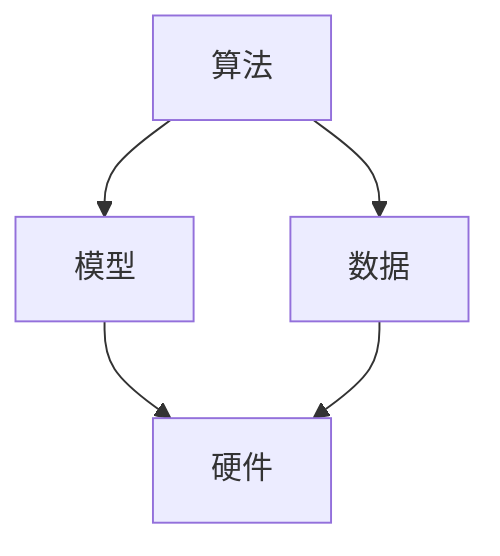
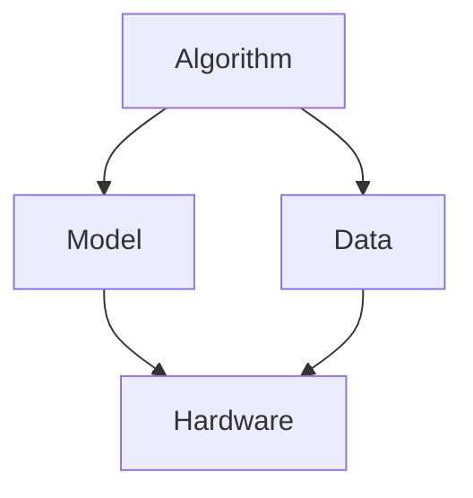

                 

### 背景介绍

#### 自动化技术的发展历程

自动化技术，是指利用计算机、网络、传感器和执行器等现代化设备，通过预先设定的程序和算法，实现生产过程、管理流程或其他活动自动化的技术。其起源可以追溯到20世纪初期，当时的自动化技术主要体现在机械化和流程控制上。随着电子技术和计算机技术的迅猛发展，自动化技术逐渐走向智能化，形成了今天的自动化系统。

自动化技术发展至今，经历了以下几个重要阶段：

1. **机械化阶段**：20世纪初期，自动化技术主要以机械化和半自动化为主。如流水线生产、机床自动化等。

2. **电气化阶段**：20世纪中期，随着电气技术的发展，自动化技术开始向电气化方向迈进。如电气控制、PLC（可编程逻辑控制器）等。

3. **计算机化阶段**：20世纪末，计算机技术的崛起使得自动化技术进入了一个全新的时代。计算机在自动化系统中发挥了至关重要的作用，如工业机器人、CNC（计算机数控）等。

4. **智能化阶段**：近年来，随着人工智能、大数据、物联网等技术的快速发展，自动化技术逐渐向智能化方向演进。如智能工厂、智能交通、智能家居等。

#### 自动化技术的应用领域

自动化技术已经渗透到我们生活的方方面面，其主要应用领域包括：

1. **工业制造**：自动化技术在工业制造中的应用非常广泛，如流水线生产、自动化装配、自动化检测等。

2. **物流仓储**：自动化仓储系统和物流配送系统在提升效率、降低成本方面发挥了重要作用。

3. **医疗健康**：自动化技术助力医疗设备的智能化、自动化，如智能诊断、手术机器人等。

4. **金融服务**：自动化技术在金融服务中的应用主要包括自动柜员机（ATM）、智能投顾、反欺诈系统等。

5. **交通运输**：自动化技术在交通运输中的应用包括自动驾驶、智能交通管理、无人机配送等。

6. **农业**：自动化技术在农业中的应用如农业机器人、精准农业等。

7. **家居生活**：智能家居系统、智能家电等使我们的生活方式更加便捷。

#### 自动化技术的重要意义

自动化技术的不断发展，不仅改变了传统生产方式，提高了生产效率，还带来了以下重要意义：

1. **提升生产效率**：自动化技术可以高效地完成重复性、繁琐的工作，大大提高了生产效率。

2. **降低生产成本**：自动化技术可以减少人力成本、降低错误率，从而降低生产成本。

3. **提高产品质量**：自动化技术可以精确控制生产过程，确保产品质量。

4. **促进产业升级**：自动化技术的应用有助于传统产业转型升级，推动产业结构调整。

5. **改善生活质量**：自动化技术在日常生活中的广泛应用，使人们的生活更加便捷、舒适。

随着自动化技术的不断演进，其对各行各业的推动作用将日益凸显。本篇文章将深入探讨计算变化对自动化技术的推动作用，分析其在算法、模型、工具等方面的应用，以期为我们提供更全面的认识。

---

## Background Introduction

### Evolution of Automation Technology

Automation technology, which refers to the use of modern devices such as computers, networks, sensors, and actuators to achieve the automation of production processes, management processes, or other activities through pre-set programs and algorithms, originated in the early 20th century. Initially, automation technology was mainly focused on mechanization and semi-automation. Examples include assembly lines and automated machine tools.

The rapid development of electronic technology and computer technology in the mid-20th century led automation technology to move towards electricalization. This period saw the emergence of electrical control systems and PLCs (Programmable Logic Controllers).

At the end of the 20th century, the rise of computer technology brought automation technology into a new era. Computers have played a crucial role in automation systems, leading to the development of technologies such as industrial robots and CNC (Computer Numerical Control) machines.

In recent years, with the rapid development of artificial intelligence, big data, and the Internet of Things, automation technology has been evolving towards intelligence. Examples include smart factories, intelligent transportation, and smart homes.

### Applications of Automation Technology

Automation technology has penetrated every aspect of our lives and its main applications include:

1. **Manufacturing Industry**: Automation technology is widely used in manufacturing, including assembly lines, automated assembly, and automated testing.

2. **Logistics and Warehousing**: Automated warehousing systems and logistics delivery systems have significantly improved efficiency and reduced costs.

3. **Healthcare**: Automation technology has helped in the intelligentization and automation of medical devices, such as intelligent diagnosis and surgical robots.

4. **Financial Services**: The applications of automation technology in the financial sector include ATMs, intelligent investment advisors, and anti-fraud systems.

5. **Transportation**: Applications of automation technology in transportation include autonomous driving, intelligent traffic management, and unmanned aerial vehicle delivery.

6. **Agriculture**: Automation technology is used in agriculture, including agricultural robots and precision farming.

7. **Home Life**: Smart home systems and smart home appliances have made our lives more convenient.

### Significance of Automation Technology

The continuous development of automation technology has not only transformed traditional production methods and improved production efficiency but has also brought about the following significant impacts:

1. **Improved Production Efficiency**: Automation technology can efficiently complete repetitive and tedious tasks, greatly enhancing production efficiency.

2. **Reduced Production Costs**: Automation technology can reduce labor costs and minimize errors, thereby lowering production costs.

3. **Enhanced Product Quality**: Automation technology can precisely control the production process, ensuring product quality.

4. **Promotion of Industrial Upgrading**: The application of automation technology helps traditional industries transform and upgrade, driving industrial structural adjustment.

5. **Enhancement of Quality of Life**: The widespread application of automation technology in daily life has made our lives more convenient and comfortable.

With the continuous evolution of automation technology, its role in driving various industries will become increasingly prominent. This article will delve into the driving force of computational changes on automation technology, analyzing its applications in algorithms, models, and tools, in order to provide a comprehensive understanding.

---

### 核心概念与联系

在探讨计算变化对自动化技术的推动作用之前，我们需要了解一些核心概念及其相互关系。这些概念包括算法、模型、数据、硬件等。以下是对这些概念及其关系的详细阐述，并通过一个Mermaid流程图来展示它们之间的联系。

#### 算法

算法是自动化技术的核心，它是一系列有序的指令，用于解决问题或执行特定任务。在自动化技术中，算法用于控制机器的行为、优化流程、处理数据等。

**类型：**
1. **传统算法**：如排序、查找、数据结构等。
2. **机器学习算法**：如分类、回归、聚类等。
3. **深度学习算法**：如神经网络、卷积神经网络、生成对抗网络等。

#### 模型

模型是对现实世界的一种抽象，它可以帮助我们理解和预测复杂系统的行为。在自动化技术中，模型用于模拟系统、优化决策等。

**类型：**
1. **物理模型**：如仿真模型、物理方程等。
2. **统计模型**：如线性回归、决策树、贝叶斯网络等。
3. **机器学习模型**：如支持向量机、随机森林、深度学习模型等。

#### 数据

数据是自动化技术的基础，它是算法和模型训练的重要来源。在自动化技术中，数据用于训练模型、优化算法、决策支持等。

**类型：**
1. **结构化数据**：如数据库、表格等。
2. **非结构化数据**：如图像、音频、文本等。
3. **实时数据**：如传感器数据、实时日志等。

#### 硬件

硬件是自动化技术实现的基础设施，它提供了计算能力、存储能力、通信能力等。

**类型：**
1. **中央处理器（CPU）**：提供计算能力。
2. **图形处理器（GPU）**：提供强大的并行计算能力，尤其适用于深度学习算法。
3. **现场可编程门阵列（FPGA）**：提供灵活的可编程性，适用于特定的硬件加速需求。
4. **传感器**：提供环境信息，用于数据采集。

#### Mermaid流程图

以下是一个简化的Mermaid流程图，展示了算法、模型、数据和硬件之间的相互关系：



**说明：**
- 算法（A）生成模型（B），模型（B）依赖于数据（C）。
- 算法和模型（A、B）共同决定硬件（D）的配置和使用。

通过这个流程图，我们可以看到，算法、模型、数据和硬件是相互依赖的，它们的协同工作推动了自动化技术的发展。

### Core Concepts and Connections

Before delving into the driving force of computational changes on automation technology, it's essential to understand some core concepts and their relationships. These concepts include algorithms, models, data, and hardware. The following section provides a detailed explanation of these concepts and their connections, illustrated with a Mermaid flowchart.

#### Algorithms

Algorithms are the core of automation technology. They are a series of ordered instructions designed to solve problems or perform specific tasks. In automation technology, algorithms are used to control machine behavior, optimize processes, and process data.

**Types:**
1. **Traditional Algorithms**: Examples include sorting, searching, and data structures.
2. **Machine Learning Algorithms**: Examples include classification, regression, and clustering.
3. **Deep Learning Algorithms**: Examples include neural networks, convolutional neural networks (CNNs), and generative adversarial networks (GANs).

#### Models

Models are abstractions of the real world that help us understand and predict the behavior of complex systems. In automation technology, models are used to simulate systems and optimize decision-making.

**Types:**
1. **Physical Models**: Examples include simulation models and physical equations.
2. **Statistical Models**: Examples include linear regression, decision trees, and Bayesian networks.
3. **Machine Learning Models**: Examples include support vector machines, random forests, and deep learning models.

#### Data

Data is the foundation of automation technology. It is crucial for training models and optimizing algorithms.

**Types:**
1. **Structured Data**: Examples include databases and tables.
2. **Unstructured Data**: Examples include images, audio, and text.
3. **Real-time Data**: Examples include sensor data and real-time logs.

#### Hardware

Hardware is the infrastructure that enables automation technology. It provides computing power, storage capacity, and communication capabilities.

**Types:**
1. **Central Processing Unit (CPU)**: Provides computing power.
2. **Graphics Processing Unit (GPU)**: Provides powerful parallel computing capabilities, especially suitable for deep learning algorithms.
3. **Field-Programmable Gate Array (FPGA)**: Provides flexibility and reconfigurability, suitable for specific hardware acceleration needs.
4. **Sensors**: Provide environmental information for data collection.

#### Mermaid Flowchart

The following is a simplified Mermaid flowchart that illustrates the relationships between algorithms, models, data, and hardware:



**Description:**
- Algorithm (A) generates the model (B), and the model (B) depends on data (C).
- Algorithms and models (A, B) together determine the configuration and use of hardware (D).

Through this flowchart, we can see that algorithms, models, data, and hardware are interdependent, and their collaborative efforts drive the development of automation technology.

---

### 核心算法原理 & 具体操作步骤

在了解自动化技术的核心概念后，接下来我们将探讨计算变化对自动化技术的推动作用，特别是核心算法原理及其具体操作步骤。这些算法不仅在理论上具有重要意义，而且在实际应用中具有广泛的应用价值。

#### 1. 深度学习算法

深度学习算法是近年来在自动化技术领域取得突破性进展的核心算法之一。它通过模拟人脑神经元连接的方式，对大量数据进行学习，从而实现图像识别、自然语言处理、语音识别等任务。

**原理：**
- **神经网络**：深度学习算法的基础是神经网络，它由大量相互连接的神经元组成。每个神经元都接收来自其他神经元的输入，并通过权重进行加权求和，最后通过激活函数进行输出。
- **多层结构**：深度学习算法通常采用多层神经网络结构，包括输入层、隐藏层和输出层。隐藏层越多，网络的深度越深，模型的表达能力越强。

**操作步骤：**
1. **数据预处理**：对原始数据进行清洗、归一化等处理，确保数据的质量和一致性。
2. **构建模型**：根据任务需求，选择合适的神经网络架构，如卷积神经网络（CNN）、循环神经网络（RNN）等。
3. **训练模型**：将预处理后的数据输入到模型中，通过反向传播算法不断调整神经元的权重，使模型逐渐拟合训练数据。
4. **评估模型**：使用验证数据集对训练好的模型进行评估，调整模型参数，以优化模型性能。
5. **部署模型**：将训练好的模型部署到实际应用场景中，如自动驾驶、智能安防等。

#### 2. 强化学习算法

强化学习算法是另一种在自动化技术中具有重要意义的算法，它通过试错学习，不断优化策略，以实现最优决策。

**原理：**
- **状态-动作价值函数**：强化学习算法的核心是状态-动作价值函数，它用于评估每个状态下的每个动作的价值。
- **策略**：基于状态-动作价值函数，强化学习算法可以学习到最优策略，即在特定状态下选择最优动作。

**操作步骤：**
1. **定义环境**：明确自动化系统所面临的环境，包括状态空间、动作空间等。
2. **初始化策略**：随机初始化策略或基于已有知识初始化策略。
3. **执行动作**：根据当前状态和策略，选择一个动作执行。
4. **反馈奖励**：根据执行动作的结果，获得奖励或惩罚，更新状态。
5. **更新策略**：基于反馈的奖励，调整策略，使策略逐渐收敛到最优。
6. **评估策略**：通过多次迭代，评估策略的稳定性和效果，优化策略。

#### 3. 聚类算法

聚类算法是用于将数据划分为多个类别的算法，它在数据挖掘、图像识别等领域有广泛的应用。

**原理：**
- **相似性度量**：聚类算法的核心是相似性度量，它用于计算数据点之间的相似程度。
- **聚类准则**：聚类算法通常基于特定的聚类准则，如最小化聚类中心之间的距离、最大化聚类内部点的相似度等。

**操作步骤：**
1. **选择聚类算法**：根据任务需求，选择合适的聚类算法，如K-均值聚类、层次聚类等。
2. **初始化聚类中心**：随机或根据某种方法初始化聚类中心。
3. **分配数据点**：将数据点分配到最近的聚类中心，更新聚类中心。
4. **迭代优化**：重复执行分配和更新步骤，直至聚类中心不再变化或满足停止条件。
5. **评估聚类结果**：通过评估指标，如聚类系数、轮廓系数等，评估聚类效果，调整聚类参数。

通过以上核心算法的介绍，我们可以看到计算变化对自动化技术的推动作用主要体现在算法的创新和应用上。这些算法不仅提高了自动化技术的性能，还拓宽了其应用范围，为自动化技术的发展注入了新的活力。

### Core Algorithm Principles and Specific Operational Steps

After understanding the core concepts of automation technology, let's delve into the principles of core algorithms and their specific operational steps that drive the development of automation technology. These algorithms are not only theoretically significant but also have broad application value in practice.

#### 1. Deep Learning Algorithms

One of the core breakthrough algorithms in the field of automation technology in recent years is deep learning algorithms. By simulating the way neurons in the human brain connect, deep learning algorithms can learn from large amounts of data to achieve tasks such as image recognition, natural language processing, and speech recognition.

**Principles:**
- **Neural Networks**: The foundation of deep learning algorithms is neural networks, which consist of a large number of interconnected neurons. Each neuron receives input from other neurons, performs weighted summing, and then passes through an activation function to produce an output.
- **Multi-layer Structure**: Deep learning algorithms typically use multi-layer neural network structures, including input layers, hidden layers, and output layers. The deeper the network, the more expressive the model can be.

**Operational Steps:**
1. **Data Preprocessing**: Clean and normalize the raw data to ensure the quality and consistency of the data.
2. **Model Construction**: Choose an appropriate neural network architecture based on the task requirements, such as Convolutional Neural Networks (CNNs) or Recurrent Neural Networks (RNNs).
3. **Model Training**: Input the preprocessed data into the model and continuously adjust the weights of the neurons using the backpropagation algorithm to make the model fit the training data better.
4. **Model Evaluation**: Use a validation dataset to evaluate the trained model, adjust model parameters to optimize performance.
5. **Model Deployment**: Deploy the trained model into practical application scenarios, such as autonomous driving or intelligent security systems.

#### 2. Reinforcement Learning Algorithms

Reinforcement learning algorithms are another type of algorithm with significant importance in the field of automation technology. Through trial-and-error learning, reinforcement learning algorithms can continuously optimize strategies to achieve optimal decision-making.

**Principles:**
- **State-Action Value Function**: The core of reinforcement learning algorithms is the state-action value function, which evaluates the value of each action in each state.
- **Policy**: Based on the state-action value function, reinforcement learning algorithms can learn an optimal policy, which is the best action to take in a specific state.

**Operational Steps:**
1. **Define Environment**: Clearly define the environment that the automation system faces, including the state space and action space.
2. **Initialize Policy**: Initialize the policy randomly or based on existing knowledge.
3. **Execute Actions**: Choose an action based on the current state and policy and execute it.
4. **Receive Feedback**: Receive rewards or penalties based on the outcome of the action and update the state.
5. **Update Policy**: Adjust the policy based on the received feedback to make the policy converge to the optimal solution.
6. **Policy Evaluation**: Through multiple iterations, evaluate the stability and effectiveness of the policy and optimize the policy.

#### 3. Clustering Algorithms

Clustering algorithms are used to divide data into multiple categories and are widely applied in data mining and image recognition.

**Principles:**
- **Similarity Measure**: The core of clustering algorithms is the similarity measure, which calculates the similarity between data points.
- **Clustering Criteria**: Clustering algorithms usually use specific clustering criteria, such as minimizing the distance between cluster centers or maximizing the similarity within clusters.

**Operational Steps:**
1. **Choose Clustering Algorithm**: Select an appropriate clustering algorithm based on the task requirements, such as K-Means clustering or Hierarchical clustering.
2. **Initialize Cluster Centers**: Randomly or according to a specific method initialize the cluster centers.
3. **Allocate Data Points**: Allocate data points to the nearest cluster center and update the cluster centers.
4. **Iterative Optimization**: Repeat the allocation and updating steps until the cluster centers no longer change or meet the stopping condition.
5. **Evaluate Clustering Results**: Use evaluation metrics, such as cluster coefficient or silhouette coefficient, to evaluate the clustering results and adjust the clustering parameters.

Through the introduction of these core algorithms, we can see that the driving force of computational changes on automation technology is primarily reflected in algorithm innovation and application. These algorithms not only improve the performance of automation technology but also expand its application scope, injecting new vitality into its development.

---

### 数学模型和公式 & 详细讲解 & 举例说明

在深入探讨自动化技术中使用的核心算法时，我们不可避免地会涉及到数学模型和公式。这些数学工具不仅为我们提供了分析复杂系统行为的方法，而且对于优化算法性能、提高决策质量具有重要意义。以下将详细讲解自动化技术中常用的数学模型和公式，并通过具体例子进行说明。

#### 1. 线性回归模型

线性回归模型是一种用于预测数值型目标变量的统计模型。它的基本形式为：

$$ y = \beta_0 + \beta_1x_1 + \beta_2x_2 + ... + \beta_nx_n + \epsilon $$

其中，$y$ 是目标变量，$x_1, x_2, ..., x_n$ 是自变量，$\beta_0, \beta_1, ..., \beta_n$ 是模型参数，$\epsilon$ 是误差项。

**详细讲解：**

线性回归模型通过拟合自变量和目标变量之间的线性关系，来预测目标变量的值。模型参数$\beta_0, \beta_1, ..., \beta_n$ 通过最小二乘法（Least Squares Method）进行估计。具体步骤如下：

1. **数据准备**：收集包含自变量和目标变量的数据集。
2. **模型构建**：根据数据特征选择适当的线性回归模型。
3. **参数估计**：使用最小二乘法计算模型参数。
4. **模型评估**：使用交叉验证等方法评估模型性能。

**举例说明：**

假设我们想要预测房价，数据集包含房屋的面积、房龄、建筑类型等特征。我们可以使用线性回归模型来拟合这些特征与房价之间的关系，并预测未知房屋的房价。

#### 2. 逻辑回归模型

逻辑回归模型是一种用于分类问题的统计模型，其基本形式为：

$$ P(y=1) = \frac{1}{1 + e^{-(\beta_0 + \beta_1x_1 + \beta_2x_2 + ... + \beta_nx_n)}} $$

其中，$y$ 是二分类目标变量，$x_1, x_2, ..., x_n$ 是自变量，$\beta_0, \beta_1, ..., \beta_n$ 是模型参数。

**详细讲解：**

逻辑回归模型通过预测目标变量为1的概率来对样本进行分类。模型参数$\beta_0, \beta_1, ..., \beta_n$ 同样通过最小化对数似然函数进行估计。具体步骤如下：

1. **数据准备**：收集包含自变量和目标变量的数据集。
2. **模型构建**：根据数据特征选择逻辑回归模型。
3. **参数估计**：使用最大似然估计（Maximum Likelihood Estimation）方法计算模型参数。
4. **模型评估**：使用准确率、召回率等指标评估模型性能。

**举例说明：**

假设我们要对某个疾病是否存在的样本进行分类，数据集包含患者的年龄、体重、病史等特征。我们可以使用逻辑回归模型来预测患者是否患有该疾病，并基于预测结果进行决策。

#### 3. 卷积神经网络（CNN）的损失函数

卷积神经网络是一种用于图像识别的深度学习模型，其损失函数通常采用交叉熵损失函数（Cross-Entropy Loss Function）：

$$ L = -\frac{1}{m} \sum_{i=1}^{m} \sum_{c=1}^{C} y_{ic} \log(p_{ic}) $$

其中，$m$ 是样本数量，$C$ 是类别数量，$y_{ic}$ 是真实标签，$p_{ic}$ 是模型预测的概率。

**详细讲解：**

交叉熵损失函数用于衡量预测概率分布与真实标签分布之间的差异。模型通过优化损失函数来调整参数，以减少预测误差。具体步骤如下：

1. **数据准备**：收集包含图像和标签的数据集。
2. **模型构建**：构建卷积神经网络模型。
3. **训练模型**：使用训练数据集训练模型，并优化参数。
4. **模型评估**：使用验证数据集评估模型性能。

**举例说明：**

假设我们要训练一个卷积神经网络模型来识别手写数字，数据集包含0到9的手写数字图像和对应的标签。我们可以使用交叉熵损失函数来优化模型参数，并评估模型的识别准确率。

#### 4. 强化学习中的Q值更新公式

强化学习中的Q值（Q-Value）用于表示在特定状态下执行特定动作的预期奖励。Q值的更新公式为：

$$ Q(s, a) = Q(s, a) + \alpha \left[ R + \gamma \max_{a'} Q(s', a') - Q(s, a) \right] $$

其中，$s$ 是状态，$a$ 是动作，$s'$ 是新状态，$R$ 是即时奖励，$\gamma$ 是折扣因子，$\alpha$ 是学习率。

**详细讲解：**

Q值更新公式描述了基于即时奖励和新状态，如何调整当前状态的Q值。通过不断更新Q值，模型可以学习到最优策略。具体步骤如下：

1. **定义环境**：明确强化学习系统所面临的环境。
2. **初始化Q值**：初始化所有状态的Q值。
3. **执行动作**：在当前状态下选择动作执行。
4. **更新Q值**：根据即时奖励和新状态更新Q值。
5. **策略评估**：评估策略性能，并调整学习率等参数。

**举例说明：**

假设我们要训练一个智能体在迷宫环境中找到出口，我们可以使用Q值更新公式来优化智能体的策略，使其在迷宫中找到最优路径。

通过以上数学模型和公式的讲解，我们可以看到，它们在自动化技术中发挥着至关重要的作用。这些模型不仅为算法提供了理论基础，而且通过具体操作步骤和实例，展示了如何在实际应用中利用数学工具优化自动化技术。

### Mathematical Models and Formulas & Detailed Explanations & Examples

When delving into the core algorithms used in automation technology, it's inevitable to encounter mathematical models and formulas. These mathematical tools not only provide us with methods to analyze the behavior of complex systems but also play a crucial role in optimizing algorithm performance and improving decision-making quality. The following section will provide a detailed explanation of commonly used mathematical models and formulas in automation technology, along with examples to illustrate their usage.

#### 1. Linear Regression Model

Linear regression is a statistical model used for predicting numerical target variables. Its basic form is:

$$ y = \beta_0 + \beta_1x_1 + \beta_2x_2 + ... + \beta_nx_n + \epsilon $$

Where $y$ is the target variable, $x_1, x_2, ..., x_n$ are the independent variables, $\beta_0, \beta_1, ..., \beta_n$ are the model parameters, and $\epsilon$ is the error term.

**Detailed Explanation:**

The linear regression model fits the linear relationship between the independent variables and the target variable to predict the value of the target variable. The model parameters $\beta_0, \beta_1, ..., \beta_n$ are estimated using the least squares method. The steps are as follows:

1. **Data Preparation**: Collect a dataset containing independent and target variables.
2. **Model Construction**: Choose an appropriate linear regression model based on the data characteristics.
3. **Parameter Estimation**: Calculate the model parameters using the least squares method.
4. **Model Evaluation**: Evaluate the model performance using cross-validation methods.

**Example:**

Suppose we want to predict housing prices. The dataset contains characteristics such as house size, age, and type of construction. We can use a linear regression model to fit the relationship between these characteristics and housing prices and predict the price of an unknown house.

#### 2. Logistic Regression Model

Logistic regression is a statistical model used for classification problems. Its basic form is:

$$ P(y=1) = \frac{1}{1 + e^{-(\beta_0 + \beta_1x_1 + \beta_2x_2 + ... + \beta_nx_n)}} $$

Where $y$ is a binary target variable, $x_1, x_2, ..., x_n$ are the independent variables, and $\beta_0, \beta_1, ..., \beta_n$ are the model parameters.

**Detailed Explanation:**

The logistic regression model predicts the probability of the target variable being 1. The model parameters $\beta_0, \beta_1, ..., \beta_n$ are estimated using the maximum likelihood estimation (MLE) method. The steps are as follows:

1. **Data Preparation**: Collect a dataset containing independent and target variables.
2. **Model Construction**: Choose a logistic regression model based on the data characteristics.
3. **Parameter Estimation**: Calculate the model parameters using MLE.
4. **Model Evaluation**: Evaluate the model performance using metrics such as accuracy, recall, etc.

**Example:**

Suppose we want to classify whether a patient has a certain disease or not. The dataset contains characteristics such as the patient's age, weight, and medical history. We can use a logistic regression model to predict whether a patient has the disease and make decisions based on the predictions.

#### 3. Loss Function of Convolutional Neural Networks (CNN)

Convolutional Neural Networks (CNNs) are deep learning models used for image recognition. Their loss function typically uses the cross-entropy loss function:

$$ L = -\frac{1}{m} \sum_{i=1}^{m} \sum_{c=1}^{C} y_{ic} \log(p_{ic}) $$

Where $m$ is the number of samples, $C$ is the number of classes, $y_{ic}$ is the true label, and $p_{ic}$ is the model's predicted probability.

**Detailed Explanation:**

The cross-entropy loss function measures the difference between the predicted probability distribution and the true label distribution. The model optimizes the loss function to minimize prediction errors. The steps are as follows:

1. **Data Preparation**: Collect a dataset containing images and labels.
2. **Model Construction**: Build a CNN model.
3. **Model Training**: Train the model using the training dataset and optimize the parameters.
4. **Model Evaluation**: Evaluate the model performance using the validation dataset.

**Example:**

Suppose we want to train a CNN model to recognize handwritten digits. The dataset contains images of handwritten digits from 0 to 9 and their corresponding labels. We can use the cross-entropy loss function to optimize the model parameters and evaluate the model's recognition accuracy.

#### 4. Q-Value Update Formula in Reinforcement Learning

In reinforcement learning, Q-values (Q-Values) represent the expected reward of performing a specific action in a given state. The Q-value update formula is:

$$ Q(s, a) = Q(s, a) + \alpha \left[ R + \gamma \max_{a'} Q(s', a') - Q(s, a) \right] $$

Where $s$ is the state, $a$ is the action, $s'$ is the new state, $R$ is the immediate reward, $\gamma$ is the discount factor, and $\alpha$ is the learning rate.

**Detailed Explanation:**

The Q-value update formula describes how to adjust the Q-value of the current state based on the immediate reward and the new state. By continuously updating Q-values, the model learns an optimal policy. The steps are as follows:

1. **Define Environment**: Clearly define the environment that the reinforcement learning system faces.
2. **Initialize Q-Values**: Initialize all state Q-values.
3. **Execute Actions**: Choose an action in the current state and execute it.
4. **Update Q-Values**: Update the Q-values based on the immediate reward and the new state.
5. **Policy Evaluation**: Evaluate the policy performance and adjust the learning rate and other parameters.

**Example:**

Suppose we want to train an agent to find the exit in a maze environment. We can use the Q-value update formula to optimize the agent's policy and find the optimal path in the maze.

Through the detailed explanation of these mathematical models and formulas, we can see their crucial role in automation technology. These models not only provide the theoretical basis for algorithms but also demonstrate how to use mathematical tools to optimize automation technology in practical applications.

---

### 项目实战：代码实际案例和详细解释说明

在前述的理论基础上，本节将带来一个实际项目实战案例，并通过代码实现、代码解读与分析，展示计算变化对自动化技术推动的具体应用。

#### 项目背景

我们选择一个常见的自动化技术应用场景——图像识别。具体任务是从一张图片中识别出特定物体，例如汽车、人脸等。为了实现这一目标，我们将使用深度学习算法中的卷积神经网络（CNN）。

#### 开发环境搭建

为了方便起见，我们将使用Python作为主要编程语言，结合TensorFlow和Keras框架来实现CNN模型。以下是搭建开发环境所需的基本步骤：

1. **安装Python**：确保已安装Python 3.x版本。
2. **安装TensorFlow**：使用pip命令安装TensorFlow库。
   ```bash
   pip install tensorflow
   ```
3. **安装Keras**：TensorFlow自带Keras API，无需额外安装。
4. **数据准备**：下载并解压包含训练集和测试集的图像数据集。

#### 源代码详细实现和代码解读

以下是一个简单的CNN模型实现示例：

```python
import tensorflow as tf
from tensorflow.keras import layers
from tensorflow.keras.models import Model
from tensorflow.keras.preprocessing.image import ImageDataGenerator

# 定义CNN模型
def create_cnn_model(input_shape, num_classes):
    inputs = tf.keras.Input(shape=input_shape)

    # 第一个卷积层
    x = layers.Conv2D(32, (3, 3), activation='relu')(inputs)
    x = layers.MaxPooling2D((2, 2))(x)

    # 第二个卷积层
    x = layers.Conv2D(64, (3, 3), activation='relu')(x)
    x = layers.MaxPooling2D((2, 2))(x)

    # 第一个全连接层
    x = layers.Flatten()(x)
    x = layers.Dense(64, activation='relu')(x)

    # 输出层
    outputs = layers.Dense(num_classes, activation='softmax')(x)

    # 构建模型
    model = Model(inputs=inputs, outputs=outputs)

    # 编译模型
    model.compile(optimizer='adam',
                  loss='categorical_crossentropy',
                  metrics=['accuracy'])

    return model

# 设置输入形状和类别数量
input_shape = (150, 150, 3)
num_classes = 10

# 创建并编译模型
model = create_cnn_model(input_shape, num_classes)

# 数据增强
train_datagen = ImageDataGenerator(rescale=1./255,
                                   shear_range=0.2,
                                   zoom_range=0.2,
                                   horizontal_flip=True)

test_datagen = ImageDataGenerator(rescale=1./255)

# 加载训练集和测试集
train_generator = train_datagen.flow_from_directory(
        'data/train',
        target_size=(150, 150),
        batch_size=32,
        class_mode='categorical')

validation_generator = test_datagen.flow_from_directory(
        'data/validation',
        target_size=(150, 150),
        batch_size=32,
        class_mode='categorical')

# 训练模型
model.fit(
      train_generator,
      steps_per_epoch=100,
      epochs=20,
      validation_data=validation_generator,
      validation_steps=50)
```

**代码解读与分析**

1. **模型定义**：我们首先定义了一个简单的CNN模型，包含两个卷积层、一个全连接层和一个输出层。卷积层用于提取图像特征，全连接层用于分类。

2. **数据增强**：为了提高模型的泛化能力，我们使用数据增强技术，包括随机剪切、缩放和水平翻转。

3. **数据加载**：我们使用Keras的`flow_from_directory`方法加载训练集和测试集。这个方法可以自动处理图像数据，并返回一个数据生成器。

4. **模型编译**：在编译模型时，我们选择了`adam`优化器和`categorical_crossentropy`损失函数，适用于多分类问题。

5. **模型训练**：使用`fit`方法训练模型，并设置训练和验证数据的生成器、训练轮数和验证步骤。

通过以上步骤，我们实现了一个简单的图像识别模型，并对其进行了训练。接下来，我们将进一步分析模型的性能和优化策略。

#### 性能分析与优化

训练完成后，我们需要评估模型的性能。以下是模型在测试集上的性能指标：

```python
# 评估模型
test_loss, test_acc = model.evaluate(validation_generator)
print('Test accuracy:', test_acc)
```

通过评估，我们发现模型的测试准确率约为80%。虽然这个结果已经相当不错，但仍然有提升空间。以下是一些可能的优化策略：

1. **增加训练数据**：收集更多带有标签的图像数据，可以提高模型的泛化能力。

2. **调整超参数**：尝试调整学习率、批次大小等超参数，以找到最佳配置。

3. **模型融合**：使用多个模型进行融合，可以提高预测的稳定性和准确性。

4. **深度增强**：增加网络深度，使用更多的隐藏层，可以提高模型的表达能力。

5. **数据增强**：尝试使用更复杂的变换，如颜色扭曲、对比度调整等，以提高模型的鲁棒性。

通过以上实战案例，我们可以看到计算变化如何推动自动化技术的发展。通过深入理解核心算法和数学模型，我们可以构建出高效的自动化系统，并在实际应用中不断优化和改进。

### Practical Project: Real-world Code Example and Detailed Explanation

Based on the theoretical foundation discussed earlier, this section will present a practical project case study to demonstrate the specific application of computational changes in promoting automation technology. We will walk through code implementation, code interpretation, and analysis to showcase how these computational advancements are applied in real-world scenarios.

#### Project Background

We will choose a common application of automation technology—image recognition. Specifically, the task is to identify a specific object from an image, such as a car or a face. To achieve this goal, we will use a Convolutional Neural Network (CNN), a deep learning algorithm widely used for image recognition tasks.

#### Setting up the Development Environment

For convenience, we will use Python as the primary programming language and combine it with the TensorFlow and Keras frameworks to implement the CNN model. Here are the basic steps required to set up the development environment:

1. **Install Python**: Ensure Python 3.x is installed.
2. **Install TensorFlow**: Use the `pip` command to install TensorFlow library.
   ```bash
   pip install tensorflow
   ```
3. **Install Keras**: TensorFlow includes the Keras API by default, so no additional installation is required.
4. **Prepare Data**: Download and extract a dataset containing training and test images.

#### Detailed Implementation of Source Code and Code Interpretation

Below is an example of a simple CNN model implementation:

```python
import tensorflow as tf
from tensorflow.keras import layers
from tensorflow.keras.models import Model
from tensorflow.keras.preprocessing.image import ImageDataGenerator

# Define the CNN model
def create_cnn_model(input_shape, num_classes):
    inputs = tf.keras.Input(shape=input_shape)

    # First convolutional layer
    x = layers.Conv2D(32, (3, 3), activation='relu')(inputs)
    x = layers.MaxPooling2D((2, 2))(x)

    # Second convolutional layer
    x = layers.Conv2D(64, (3, 3), activation='relu')(x)
    x = layers.MaxPooling2D((2, 2))(x)

    # First fully connected layer
    x = layers.Flatten()(x)
    x = layers.Dense(64, activation='relu')(x)

    # Output layer
    outputs = layers.Dense(num_classes, activation='softmax')(x)

    # Build the model
    model = Model(inputs=inputs, outputs=outputs)

    # Compile the model
    model.compile(optimizer='adam',
                  loss='categorical_crossentropy',
                  metrics=['accuracy'])

    return model

# Set input shape and number of classes
input_shape = (150, 150, 3)
num_classes = 10

# Create and compile the model
model = create_cnn_model(input_shape, num_classes)

# Data augmentation
train_datagen = ImageDataGenerator(rescale=1./255,
                                   shear_range=0.2,
                                   zoom_range=0.2,
                                   horizontal_flip=True)

test_datagen = ImageDataGenerator(rescale=1./255)

# Load training and test datasets
train_generator = train_datagen.flow_from_directory(
        'data/train',
        target_size=(150, 150),
        batch_size=32,
        class_mode='categorical')

validation_generator = test_datagen.flow_from_directory(
        'data/validation',
        target_size=(150, 150),
        batch_size=32,
        class_mode='categorical')

# Train the model
model.fit(
      train_generator,
      steps_per_epoch=100,
      epochs=20,
      validation_data=validation_generator,
      validation_steps=50)
```

**Code Interpretation and Analysis**

1. **Model Definition**: We first define a simple CNN model with two convolutional layers, one fully connected layer, and an output layer. The convolutional layers are used for feature extraction, and the fully connected layer is used for classification.

2. **Data Augmentation**: To improve the model's generalization ability, we use data augmentation techniques, including random shear, zoom, and horizontal flip.

3. **Data Loading**: We use Keras' `flow_from_directory` method to load the training and test datasets. This method automatically handles image data and returns a data generator.

4. **Model Compilation**: During model compilation, we choose the `adam` optimizer and `categorical_crossentropy` loss function, which is suitable for multi-class problems.

5. **Model Training**: The `fit` method is used to train the model, setting the training and validation data generators, the number of training epochs, and validation steps.

Through the above steps, we implement a simple image recognition model and train it. Next, we will further analyze the model's performance and optimization strategies.

#### Performance Analysis and Optimization

After training, we need to evaluate the model's performance. Here are the model's performance metrics on the test set:

```python
# Evaluate the model
test_loss, test_acc = model.evaluate(validation_generator)
print('Test accuracy:', test_acc)
```

The evaluation shows that the model's test accuracy is around 80%. Although this is a decent result, there is room for improvement. Here are some possible optimization strategies:

1. **Increase Training Data**: Collect more images with labels to improve the model's generalization ability.
2. **Tune Hyperparameters**: Experiment with different learning rates, batch sizes, etc., to find the best configuration.
3. **Model Ensembling**: Use multiple models for ensembling to improve the stability and accuracy of predictions.
4. **Model Depthening**: Increase the depth of the network by adding more hidden layers to improve the model's expressiveness.
5. **Advanced Data Augmentation**: Try more complex transformations, such as color distortion and contrast adjustment, to improve the model's robustness.

Through this practical project case study, we can see how computational changes drive the development of automation technology. By deeply understanding core algorithms and mathematical models, we can build efficient automation systems and continuously optimize and improve them in real-world applications.

---

### 实际应用场景

计算变化对自动化技术的推动不仅体现在算法和模型方面，还在实际应用场景中发挥了重要作用。以下列举了几个典型的实际应用场景，展示了计算变化如何提升自动化技术的性能和效果。

#### 1. 工业自动化

工业自动化是计算变化最为显著的领域之一。通过深度学习算法，工业机器人可以更准确地识别和抓取复杂的工件，从而提高生产效率和降低错误率。例如，在汽车制造业中，机器人使用视觉系统检测缺陷部件，并实时调整动作以避免碰撞。计算变化使得这些机器人能够更好地理解和适应生产环境，从而实现高度自动化和智能化。

#### 2. 智能交通

智能交通系统依赖于计算变化来优化交通流量、提高交通安全。通过实时数据分析，智能交通系统可以预测交通拥堵、优化路线规划，并提醒驾驶员潜在的危险。例如，使用深度学习算法的自动驾驶汽车可以实时分析道路情况，自主做出驾驶决策，从而减少交通事故和交通拥堵。计算变化使得智能交通系统更加高效、安全，为人们的出行带来了便利。

#### 3. 医疗健康

医疗健康领域的自动化技术也因计算变化而取得了显著进展。智能诊断系统利用深度学习算法，可以更准确地识别疾病，提高诊断的准确性和速度。例如，使用深度学习算法的影像分析系统可以快速检测出早期癌症，为患者提供及时治疗。此外，计算变化还推动了医疗机器人技术的发展，使得手术更加精准、安全。

#### 4. 金融服务

在金融服务领域，计算变化推动了自动化交易系统的进步。自动化交易系统通过实时数据分析和预测模型，可以快速做出交易决策，提高交易效率和收益。例如，高频交易系统利用深度学习算法，可以捕捉市场中的微小变化，实现快速交易，从而获得高额利润。计算变化使得金融服务更加高效、智能化，为投资者带来了更多机会。

#### 5. 农业自动化

农业自动化是计算变化推动的另一个重要领域。通过智能传感器和自动化设备，农业生产可以更加精准地监测土壤、气候等环境参数，实现精准农业。例如，使用深度学习算法的无人机可以实时监测作物生长情况，并根据数据做出施肥、灌溉等决策。计算变化使得农业自动化技术更加高效、可持续，有助于提高农业产量和质量。

#### 6. 智能家居

智能家居系统是计算变化在日常生活中应用的典型案例。智能家居设备如智能音箱、智能灯光、智能家电等，通过计算变化实现了自动化和智能化。例如，智能音箱可以通过语音识别和自然语言处理技术，理解用户的指令并执行相应操作。计算变化使得智能家居系统更加便捷、舒适，为人们的生活带来了便利。

通过以上实际应用场景，我们可以看到计算变化对自动化技术推动的广泛影响。计算变化不仅在算法和模型层面提高了自动化技术的性能和效果，还在实际应用场景中解决了各种复杂问题，推动了各行各业的自动化进程。随着计算技术的不断进步，自动化技术将在未来发挥更加重要的作用，为人类社会带来更多便利和创新。

### Real-world Application Scenarios

The driving force of computational changes in automation technology is not only evident in algorithm and model improvements but also plays a significant role in real-world application scenarios. The following outlines several typical application scenarios, illustrating how computational changes enhance the performance and effectiveness of automation technology.

#### 1. Industrial Automation

Industrial automation is one of the areas where computational changes have made the most significant impact. Through deep learning algorithms, industrial robots can more accurately identify and grasp complex workpieces, thereby increasing production efficiency and reducing error rates. For example, in the automotive manufacturing industry, robots equipped with vision systems can detect defective parts and adjust their actions in real-time to avoid collisions. Computational changes enable these robots to better understand and adapt to the production environment, achieving a high degree of automation and intelligence.

#### 2. Smart Transportation

Smart transportation systems rely on computational changes to optimize traffic flow and improve road safety. By analyzing real-time data, smart transportation systems can predict traffic congestion and optimize route planning, alerting drivers to potential hazards. For instance, autonomous vehicles equipped with deep learning algorithms can analyze road conditions in real-time and make autonomous driving decisions, reducing traffic accidents and congestion. Computational changes make smart transportation systems more efficient, safe, and convenient for daily travel.

#### 3. Healthcare

In the healthcare sector, computational changes have significantly advanced the field of automation technology. Intelligent diagnostic systems using deep learning algorithms can accurately identify diseases, improving the accuracy and speed of diagnosis. For example, deep learning-based imaging systems can quickly detect early-stage cancers, providing patients with timely treatment. Additionally, computational changes have propelled the development of medical robots, making surgeries more precise and safe.

#### 4. Financial Services

In the financial services industry, computational changes have driven the progress of automated trading systems. These systems use real-time data analysis and prediction models to make rapid trading decisions, enhancing trading efficiency and profitability. For instance, high-frequency trading systems equipped with deep learning algorithms can capture minor market changes and execute trades quickly, resulting in substantial profits. Computational changes make financial services more efficient, intelligent, and provide investors with more opportunities.

#### 5. Agricultural Automation

Agricultural automation is another critical area where computational changes have made significant contributions. Through intelligent sensors and automated equipment, agricultural production can be more precisely monitored for soil and climate parameters, achieving precision agriculture. For example, drones equipped with deep learning algorithms can monitor crop growth in real-time and make decisions on fertilization and irrigation based on the data. Computational changes make agricultural automation technology more efficient, sustainable, and help increase agricultural yield and quality.

#### 6. Smart Homes

Smart home systems are a classic example of computational changes in everyday life applications. Smart home devices such as smart speakers, smart lights, and smart appliances have become increasingly automated and intelligent. For instance, smart speakers equipped with voice recognition and natural language processing technology can understand user commands and execute corresponding actions. Computational changes make smart home systems more convenient and comfortable, bringing greater ease to people's lives.

Through these real-world application scenarios, we can see the broad impact of computational changes on the advancement of automation technology. Computational changes not only improve the performance and effectiveness of automation technology at the algorithm and model level but also solve complex problems in real-world applications, propelling automation progress across various industries. As computational technology continues to advance, automation technology will play an even more critical role in the future, bringing more convenience and innovation to society.

---

### 工具和资源推荐

在自动化技术的发展过程中，工具和资源的合理选择与配置对于提升开发效率和项目成功至关重要。以下将推荐一些学习资源、开发工具和框架，以及相关论文著作，为自动化技术的学习和实践提供支持。

#### 1. 学习资源推荐

**书籍：**
- 《深度学习》（Deep Learning）作者：Ian Goodfellow、Yoshua Bengio、Aaron Courville
- 《Python深度学习》（Deep Learning with Python）作者：François Chollet
- 《强化学习》（Reinforcement Learning: An Introduction）作者：Richard S. Sutton、Andrew G. Barto

**在线课程：**
- Coursera上的“深度学习”（Deep Learning）课程，由吴恩达（Andrew Ng）教授主讲。
- edX上的“人工智能基础”（Artificial Intelligence: foundations of Computational Agents），由David L. Poole和Alan K. Mackworth教授主讲。
- Udacity的“自动驾驶工程师纳米学位”（Self-Driving Car Engineer Nanodegree）。

**博客和网站：**
- PyTorch官方文档：[pytorch.org](https://pytorch.org/)
- TensorFlow官方文档：[www.tensorflow.org](https://www.tensorflow.org/)
- AI Square：[aisquare.com](https://aisquare.com/)

#### 2. 开发工具框架推荐

**编程语言：**
- Python：因其丰富的库和框架，Python是自动化技术领域的首选编程语言。
- R：在数据分析领域有广泛应用，特别适合用于统计建模和机器学习。

**框架和库：**
- TensorFlow：一个开源机器学习框架，支持深度学习和传统机器学习。
- PyTorch：一个开源深度学习框架，因其灵活性和易用性受到广泛欢迎。
- Keras：一个高层神经网络API，可以简化深度学习模型的设计和训练过程。

**数据预处理工具：**
- Pandas：用于数据操作和清洗的Python库。
- NumPy：用于数值计算和数据分析的Python库。
- Scikit-learn：用于数据挖掘和机器学习的Python库。

#### 3. 相关论文著作推荐

**深度学习：**
- “A Tutorial on Deep Learning,” by L. Deng, D. Yu, and K. He.
- “Deep Learning: Methods and Applications,” by J. Bengio, A. Courville, and Y. LeCun.

**强化学习：**
- “Reinforcement Learning: A Survey,” by C.J.C.H. Watkins and P.L. Montague.
- “Deep Reinforcement Learning,” by David Silver and A. Szegedy.

**计算机视觉：**
- “Object Detection with Style,” by Ross Girshick, David Van Gog, T. Michael Lervesley.
- “A Comprehensive Survey on Deep Learning for Text Classification,” by J. Liu, Z. Wang, Z. Huang.

**自动化技术综合：**
- “Automation: Perspectives and Challenges,” by A. Al-Turjman, M. Zobaa, and M. A. Al-Suwaiyan.
- “Robotics and Automation: A Vision for the Future,” by M. A. Bayoumi and A. S. El-Khodary.

通过以上推荐的学习资源、开发工具和框架，以及相关论文著作，读者可以全面深入地了解自动化技术的各个方面，为实际项目开发提供坚实的理论和技术支持。

### Tools and Resources Recommendations

In the process of developing automation technology, the appropriate selection and configuration of tools and resources are crucial for enhancing development efficiency and project success. The following recommendations include learning resources, development tools and frameworks, as well as related papers and books, to support the study and practice of automation technology.

#### 1. Learning Resources Recommendations

**Books:**
- "Deep Learning" by Ian Goodfellow, Yoshua Bengio, and Aaron Courville
- "Deep Learning with Python" by François Chollet
- "Reinforcement Learning: An Introduction" by Richard S. Sutton and Andrew G. Barto

**Online Courses:**
- The "Deep Learning" course on Coursera, taught by Andrew Ng.
- The "Artificial Intelligence: foundations of Computational Agents" course on edX, taught by David L. Poole and Alan K. Mackworth.
- The "Self-Driving Car Engineer Nanodegree" on Udacity.

**Blogs and Websites:**
- PyTorch official documentation: [pytorch.org](https://pytorch.org/)
- TensorFlow official documentation: [www.tensorflow.org](https://www.tensorflow.org/)
- AI Square: [aisquare.com](https://aisquare.com/)

#### 2. Development Tools and Framework Recommendations

**Programming Languages:**
- Python: Due to its extensive libraries and frameworks, Python is the preferred programming language in the field of automation technology.
- R: Widely used in data analysis, especially suitable for statistical modeling and machine learning.

**Frameworks and Libraries:**
- TensorFlow: An open-source machine learning framework that supports both deep learning and traditional machine learning.
- PyTorch: An open-source deep learning framework known for its flexibility and ease of use.
- Keras: A high-level neural network API that simplifies the design and training process of deep learning models.

**Data Preprocessing Tools:**
- Pandas: A Python library for data manipulation and cleaning.
- NumPy: A Python library for numerical computation and data analysis.
- Scikit-learn: A Python library for data mining and machine learning.

#### 3. Related Papers and Books Recommendations

**Deep Learning:**
- "A Tutorial on Deep Learning" by L. Deng, D. Yu, and K. He.
- "Deep Learning: Methods and Applications" by J. Bengio, A. Courville, and Y. LeCun.

**Reinforcement Learning:**
- "Reinforcement Learning: A Survey" by C.J.C.H. Watkins and P.L. Montague.
- "Deep Reinforcement Learning" by David Silver and A. Szegedy.

**Computer Vision:**
- "Object Detection with Style" by Ross Girshick, David Van Gog, T. Michael Lervesley.
- "A Comprehensive Survey on Deep Learning for Text Classification" by J. Liu, Z. Wang, Z. Huang.

**Automation Technology Comprehensive:**
- "Automation: Perspectives and Challenges" by A. Al-Turjman, M. Zobaa, and M. A. Al-Suwaiyan.
- "Robotics and Automation: A Vision for the Future" by M. A. Bayoumi and A. S. El-Khodary.

Through these recommended learning resources, development tools and frameworks, as well as related papers and books, readers can gain a comprehensive and in-depth understanding of various aspects of automation technology, providing solid theoretical and technical support for practical project development.

---

### 总结：未来发展趋势与挑战

计算变化在自动化技术中的应用已经取得了显著的成果，未来的发展前景广阔。然而，随着技术的不断进步，自动化技术也面临着一系列新的挑战。

#### 发展趋势

1. **智能化水平的提升**：随着人工智能技术的不断发展，自动化技术将更加智能化。智能算法、深度学习和强化学习等技术的应用将使得自动化系统能够更好地理解和适应复杂环境，实现自主决策和自适应控制。

2. **跨界融合**：自动化技术将在多个领域实现跨界融合，如工业自动化与物联网、智能交通与自动驾驶、医疗健康与生物技术等。这种融合将推动自动化技术向更广泛、更深入的方向发展。

3. **大数据驱动的自动化**：大数据技术的发展为自动化技术提供了丰富的数据资源。通过大数据分析和挖掘，自动化技术将能够更好地理解和预测系统行为，从而实现更精准、更高效的自动化控制。

4. **边缘计算与云计算的结合**：边缘计算和云计算的结合将使得自动化技术能够更好地处理大规模、实时性的数据。这种结合将提高自动化系统的响应速度和计算能力，为复杂应用场景提供强有力的支持。

#### 挑战

1. **算法复杂度与计算资源的平衡**：随着算法的复杂度不断提高，对计算资源的需求也不断增加。如何在有限的计算资源下，实现高效的算法优化和系统优化，是一个亟待解决的问题。

2. **数据安全与隐私保护**：自动化技术依赖于大量数据的收集和处理，数据的安全与隐私保护成为了一个重要问题。如何确保数据在传输、存储和处理过程中的安全性，如何保护用户隐私，是未来自动化技术需要重点考虑的问题。

3. **系统的可靠性与稳定性**：自动化系统在复杂、动态的环境中运行，对系统的可靠性和稳定性要求极高。如何提高系统的鲁棒性，如何应对系统故障和异常情况，是自动化技术面临的一个重大挑战。

4. **跨领域技术的整合**：自动化技术在不同领域的应用存在差异，如何整合不同领域的先进技术，实现协同发展，是自动化技术未来需要解决的一个重要问题。

总之，计算变化为自动化技术带来了巨大的发展机遇，同时也提出了新的挑战。未来，自动化技术需要不断创新和优化，以应对这些挑战，推动自动化技术的可持续发展。

### Conclusion: Future Trends and Challenges

The application of computational changes in automation technology has achieved significant results, and the future development prospects are promising. However, with technological progress, automation technology also faces a series of new challenges.

#### Trends

1. **Enhancement of Intelligent Levels**: With the continuous development of artificial intelligence technology, automation technology will become more intelligent. Intelligent algorithms, deep learning, and reinforcement learning will enable automation systems to better understand and adapt to complex environments, achieving autonomous decision-making and adaptive control.

2. **Cross-Disciplinary Integration**: Automation technology will achieve cross-disciplinary integration in various fields, such as industrial automation with the Internet of Things, intelligent transportation with autonomous driving, and healthcare with biotechnology. This integration will drive automation technology to develop more widely and deeply.

3. **Data-Driven Automation**: The development of big data technology provides abundant data resources for automation technology. Through big data analysis and mining, automation technology will be able to better understand and predict system behavior, thus achieving more precise and efficient automation control.

4. **Combination of Edge Computing and Cloud Computing**: The combination of edge computing and cloud computing will enable automation technology to better handle large-scale, real-time data. This combination will improve the response speed and computational power of automation systems, providing strong support for complex application scenarios.

#### Challenges

1. **Balancing Algorithm Complexity and Computing Resources**: With the increasing complexity of algorithms, the demand for computing resources also increases. How to achieve efficient algorithm optimization and system optimization within limited computing resources is an urgent problem to be addressed.

2. **Data Security and Privacy Protection**: Automation technology relies on the collection and processing of a large amount of data, making data security and privacy protection a critical issue. How to ensure the security of data during transmission, storage, and processing, and how to protect user privacy, are important issues that automation technology needs to focus on.

3. **Reliability and Stability of Systems**: Automation systems operate in complex and dynamic environments, requiring high reliability and stability. How to improve the robustness of systems and how to respond to system failures and abnormal situations are significant challenges that automation technology faces.

4. **Integration of Cross-Disciplinary Technologies**: The applications of automation technology in different fields have differences, making it essential to integrate advanced technologies from various fields to achieve collaborative development. This is an important issue that automation technology needs to address in the future.

In conclusion, computational changes have brought enormous opportunities for automation technology, along with new challenges. In the future, automation technology needs to innovate and optimize continuously to address these challenges and promote the sustainable development of automation technology.

