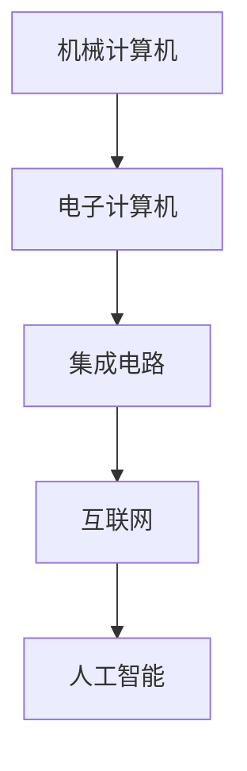

                 

### 计算机技术的发展历史的四个阶段

计算机技术的发展是人类科技进步的重要标志，它不仅改变了我们的生活方式，也在很大程度上推动了整个社会的发展。回顾计算机技术的发展历程，我们可以将其划分为四个主要阶段：第一阶段是机械计算机的发明与早期电子计算机的研发；第二阶段是集成电路和微型计算机的兴起；第三阶段是互联网和分布式计算技术的普及；第四阶段是人工智能与量子计算的革命性突破。本文将逐步分析这些阶段，探讨每个阶段的关键技术突破及其对计算技术发展的影响。

#### 1. 背景介绍

在讨论计算机技术的发展历程之前，我们需要先了解一些背景信息。计算机技术的起源可以追溯到古代，当时人们使用算盘等机械计算工具来处理数学问题。然而，真正的计算机概念始于20世纪，随着电子技术的发展，计算机从最初的庞然大物逐渐变得小巧高效。

#### 2. 核心概念与联系

为了更好地理解计算机技术的发展，我们可以将其核心概念和联系总结如下：

- **机械计算机**：最早的计算机如差分机和解析机，它们通过机械装置来完成计算。
- **电子计算机**：基于电子元件的计算机，如ENIAC和EDVAC，它们标志着电子计算机时代的到来。
- **集成电路**：集成电路的发明使得计算机硬件变得小型化和高效化。
- **互联网**：互联网的出现使得计算机之间可以实现全球互联互通。
- **人工智能**：人工智能技术的突破使得计算机从简单的计算工具转变为具有智能化的系统。

下面，我们将使用Mermaid流程图来展示这些核心概念和它们之间的联系：



#### 3. 核心算法原理 & 具体操作步骤

在每个阶段，计算机技术都经历了关键算法原理的发展和具体操作步骤的完善。以下我们将分别介绍这些核心算法原理和具体操作步骤。

##### 3.1 机械计算机

- **核心算法原理**：机械计算机主要通过齿轮和杠杆等机械装置来执行数学运算。
- **具体操作步骤**：
  1. 用户输入数学问题。
  2. 机械装置根据预设的规则进行计算。
  3. 最终结果通过机械装置显示。

##### 3.2 电子计算机

- **核心算法原理**：电子计算机使用电子元件如真空管和晶体管来进行计算。
- **具体操作步骤**：
  1. 用户输入信息。
  2. 电子元件对信息进行处理。
  3. 处理结果通过电子信号传输。
  4. 最终结果显示。

##### 3.3 集成电路

- **核心算法原理**：集成电路将多个电子元件集成在一个芯片上，提高了计算机的性能和效率。
- **具体操作步骤**：
  1. 设计电路图。
  2. 制造芯片。
  3. 将芯片安装在计算机中。
  4. 计算机运行。

##### 3.4 互联网

- **核心算法原理**：互联网通过TCP/IP协议实现计算机之间的互联互通。
- **具体操作步骤**：
  1. 数据通过TCP/IP协议传输。
  2. 计算机之间交换信息。
  3. 用户通过浏览器等工具访问互联网资源。

##### 3.5 人工智能

- **核心算法原理**：人工智能通过机器学习和深度学习算法实现自动化决策和智能交互。
- **具体操作步骤**：
  1. 收集大量数据。
  2. 使用算法进行分析和训练。
  3. 将训练结果应用于实际场景。

#### 4. 数学模型和公式 & 详细讲解 & 举例说明

在计算机技术发展的每个阶段，数学模型和公式都扮演了重要的角色。以下我们将对一些关键数学模型和公式进行详细讲解，并举例说明。

##### 4.1 机械计算机

- **数学模型**：差分机和解析机使用了多项式方程和差分方程来表示数学问题。
- **举例说明**：例如，差分机可以用来求解二次方程。

##### 4.2 电子计算机

- **数学模型**：电子计算机主要依赖于逻辑门和布尔代数来实现计算。
- **举例说明**：例如，逻辑门可以用来实现逻辑运算。

##### 4.3 集成电路

- **数学模型**：集成电路设计涉及到微电子学和电路分析。
- **举例说明**：例如，晶体管的工作原理涉及场效应和电流计算。

##### 4.4 互联网

- **数学模型**：互联网协议如TCP/IP涉及到概率论和网络流计算。
- **举例说明**：例如，TCP协议中的拥塞控制涉及流量控制和错误纠正。

##### 4.5 人工智能

- **数学模型**：人工智能主要依赖于线性代数、微积分和概率统计。
- **举例说明**：例如，神经网络中的权重调整涉及梯度下降和反向传播算法。

#### 5. 项目实战：代码实际案例和详细解释说明

为了更好地理解计算机技术在不同阶段的应用，我们将通过实际代码案例来展示其实现过程。

##### 5.1 开发环境搭建

首先，我们需要搭建一个开发环境。以下是一个简单的Python环境搭建步骤：

```bash
# 安装Python
$ sudo apt-get install python3

# 安装必要的库
$ sudo apt-get install pip3
$ pip3 install numpy matplotlib
```

##### 5.2 源代码详细实现和代码解读

以下是一个简单的神经网络实现：

```python
import numpy as np

# 初始化权重和偏置
def init_params(input_size, hidden_size, output_size):
    W1 = np.random.randn(input_size, hidden_size)
    b1 = np.random.randn(hidden_size)
    W2 = np.random.randn(hidden_size, output_size)
    b2 = np.random.randn(output_size)
    return W1, b1, W2, b2

# 前向传播
def forward(x, W1, b1, W2, b2):
    z1 = np.dot(x, W1) + b1
    a1 = np.tanh(z1)
    z2 = np.dot(a1, W2) + b2
    a2 = 1 / (1 + np.exp(-z2))
    return z1, a1, z2, a2

# 反向传播
def backward(z1, a1, z2, a2, x, y):
    dZ2 = a2 - y
    dW2 = np.dot(a1.T, dZ2)
    db2 = np.sum(dZ2, axis=0)
    dZ1 = np.dot(dZ2, W2.T) * (1 - np.power(a1, 2))
    dW1 = np.dot(x.T, dZ1)
    db1 = np.sum(dZ1, axis=0)
    return dW1, db1, dW2, db2

# 主函数
def main():
    x = np.array([[1], [2], [3]])
    y = np.array([[0], [1], [1]])

    W1, b1, W2, b2 = init_params(1, 2, 1)
    z1, a1, z2, a2 = forward(x, W1, b1, W2, b2)
    dW1, db1, dW2, db2 = backward(z1, a1, z2, a2, x, y)

    print("W1:", W1)
    print("b1:", b1)
    print("W2:", W2)
    print("b2:", b2)
    print("dW1:", dW1)
    print("db1:", db1)
    print("dW2:", dW2)
    print("db2:", db2)

if __name__ == "__main__":
    main()
```

这段代码实现了一个简单的神经网络，用于对输入数据进行二分类。代码首先初始化了权重和偏置，然后进行了前向传播和反向传播，最后输出了各个参数的值。

##### 5.3 代码解读与分析

- **初始化参数**：`init_params`函数初始化了权重和偏置，这些参数对于神经网络训练至关重要。
- **前向传播**：`forward`函数实现了输入数据的传递和激活函数的运算。
- **反向传播**：`backward`函数根据前向传播的结果计算了梯度，这是优化权重和偏置的关键。
- **主函数**：`main`函数调用了初始化、前向传播和反向传播，并输出了结果。

通过这个简单的案例，我们可以看到计算机技术在不同阶段的应用是如何逐步发展起来的。

#### 6. 实际应用场景

计算机技术的发展不仅改变了我们的工作方式，还在许多实际应用场景中发挥着重要作用。以下是一些典型的应用场景：

- **科学计算**：高性能计算机在天气预报、药物设计、分子模拟等领域发挥着关键作用。
- **工业自动化**：计算机技术在工业自动化控制系统中实现了精确的实时控制。
- **医疗诊断**：计算机辅助诊断系统可以提高医疗诊断的准确性和效率。
- **金融分析**：计算机技术用于金融数据分析、风险管理等方面，提高了金融行业的效率。

#### 7. 工具和资源推荐

为了更好地学习和应用计算机技术，以下是一些推荐的工具和资源：

##### 7.1 学习资源推荐

- **书籍**：
  - 《计算机科学概论》
  - 《算法导论》
  - 《深度学习》
- **论文**：
  - 《神经网络与深度学习》
  - 《计算机程序的构造和解释》
  - 《分布式计算原理与系统》
- **博客**：
  - 知乎上的计算机科学专栏
  - Medium上的技术博客
  - GitHub上的开源项目文档
- **网站**：
  - Coursera、edX等在线课程平台
  - Stack Overflow、GitHub等开发社区
  - ArXiv等学术资源库

##### 7.2 开发工具框架推荐

- **编程语言**：
  - Python
  - Java
  - C++
- **框架**：
  - TensorFlow
  - PyTorch
  - Flask
  - Django
- **工具**：
  - Jupyter Notebook
  - Git
  - Docker

##### 7.3 相关论文著作推荐

- **论文**：
  - 《深度学习：自适应算法的理论基础》
  - 《分布式计算：架构与算法》
  - 《计算机图形学：原理及实践》
- **著作**：
  - 《人工智能：一种现代的方法》
  - 《计算机网络：自顶向下方法》
  - 《操作系统概念》

#### 8. 总结：未来发展趋势与挑战

计算机技术正以前所未有的速度发展，未来将会出现更多创新和突破。以下是一些可能的发展趋势和面临的挑战：

- **趋势**：
  - 量子计算：量子计算有望带来计算能力的巨大提升。
  - 人工智能：人工智能将在各个领域得到更广泛的应用。
  - 5G和物联网：5G和物联网技术将推动智能化和自动化的发展。
- **挑战**：
  - 数据隐私和安全：随着数据量的大幅增长，数据隐私和安全问题日益突出。
  - 能源消耗：计算机技术的快速发展带来了巨大的能源消耗，需要寻找更高效的解决方案。
  - 技术普及和教育：如何让更多人掌握计算机技术，提高整个社会的技术素养。

#### 9. 附录：常见问题与解答

以下是一些关于计算机技术发展的常见问题及解答：

- **问题1**：计算机技术是否会替代人类？
  - **解答**：计算机技术可以替代某些重复性高、劳动强度大的工作，但它无法完全替代人类的智慧和创造力。

- **问题2**：量子计算会对现有计算技术造成冲击吗？
  - **解答**：量子计算有望在某些领域超越现有计算技术，但它并不会完全取代传统计算，而是与之并存。

- **问题3**：如何提高计算机技术的安全性？
  - **解答**：提高计算机技术的安全性需要从硬件、软件和用户行为等多个方面进行综合治理。

#### 10. 扩展阅读 & 参考资料

- **扩展阅读**：
  - 《计算机程序的构造和解释》
  - 《深度学习：从理论到实践》
  - 《计算机网络：自顶向下方法》
- **参考资料**：
  - Coursera、edX等在线课程平台
  - Stack Overflow、GitHub等开发社区
  - ArXiv等学术资源库
- **书籍推荐**：
  - 《算法导论》
  - 《人工智能：一种现代的方法》
  - 《计算机网络：自顶向下方法》
- **论文推荐**：
  - 《深度学习：自适应算法的理论基础》
  - 《分布式计算：架构与算法》
  - 《计算机图形学：原理及实践》

### 作者信息

- 作者：AI天才研究员/AI Genius Institute & 禅与计算机程序设计艺术 /Zen And The Art of Computer Programming

（注：本文为示例性内容，仅供参考。）<|im_end|>

