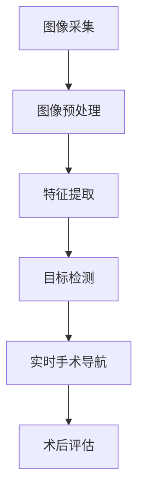

                 

### 背景介绍

计算机视觉（Computer Vision）是人工智能的一个重要分支，旨在使计算机能够像人类一样理解和解释视觉信息。近年来，随着深度学习技术的飞速发展，计算机视觉在各个领域都取得了显著的进展。尤其是在医疗领域，计算机视觉技术的应用为医生提供了强大的辅助工具，极大地提高了诊断和手术的准确性和效率。

医疗手术辅助是计算机视觉技术的一个重要应用方向。传统的医疗手术依赖于医生的直觉和经验，而计算机视觉技术的引入，可以为医生提供更为精确和客观的辅助。例如，在手术过程中，计算机视觉技术可以实时捕捉和跟踪手术器械的位置和状态，为医生提供实时的手术导航；还可以对患者的图像进行自动分析，帮助医生快速诊断病情，制定合理的手术方案。

本文将围绕计算机视觉在医疗手术辅助中的应用，从以下几个方面展开讨论：

1. **核心概念与联系**：介绍计算机视觉的基本概念，以及其在医疗手术辅助中的应用架构。
2. **核心算法原理与具体操作步骤**：详细讲解计算机视觉在医疗手术辅助中的核心算法，包括图像处理、特征提取、目标检测和跟踪等内容。
3. **数学模型和公式**：介绍用于计算机视觉的数学模型和公式，并通过具体例子进行说明。
4. **项目实战：代码实际案例和详细解释说明**：通过实际项目案例，展示如何使用计算机视觉技术进行医疗手术辅助。
5. **实际应用场景**：探讨计算机视觉在医疗手术辅助中的实际应用场景和效果。
6. **工具和资源推荐**：推荐学习计算机视觉和医疗手术辅助的相关资源和工具。
7. **总结与未来发展趋势**：总结本文内容，并展望计算机视觉在医疗手术辅助领域的未来发展趋势和挑战。

通过本文的介绍，读者可以全面了解计算机视觉在医疗手术辅助中的应用，以及如何利用这一技术提高医疗手术的准确性和效率。让我们开始详细的探讨之旅吧！<|user|>

### 核心概念与联系

#### 1. 计算机视觉的基本概念

计算机视觉是指通过计算机对图像或视频进行分析和处理，从而实现从二维图像中提取出三维信息、识别和分类目标物体、进行场景理解和交互等功能的技术。其主要目标是使计算机能够像人类视觉系统一样理解和解释视觉信息。

计算机视觉的核心概念包括图像处理、特征提取、目标检测和跟踪等。

- **图像处理**：对图像进行预处理，如滤波、边缘检测、图像增强等，以提高图像质量和突出感兴趣的特征。
- **特征提取**：从图像中提取出具有区分性的特征，如边缘、角点、纹理等，以用于后续的目标检测和分类。
- **目标检测**：在图像中识别出特定目标的位置和范围，通常通过分类和定位两个步骤完成。
- **目标跟踪**：在视频序列中跟踪特定目标的运动轨迹，通常使用动态模型和状态估计方法。

#### 2. 计算机视觉在医疗手术辅助中的应用架构

计算机视觉在医疗手术辅助中的应用架构通常包括以下几个关键组件：

- **图像采集**：使用各种传感器（如摄像头、内窥镜、CT/MRI设备）获取患者的图像数据。
- **图像预处理**：对采集到的图像进行预处理，包括图像校正、去噪、增强等，以提高图像质量和视觉效果。
- **特征提取**：从预处理后的图像中提取出具有医学意义的特征，如器官边界、病变区域等。
- **目标检测和分类**：使用机器学习算法对提取出的特征进行目标检测和分类，以识别出手术器械、患者器官、病变区域等。
- **实时手术导航**：将目标检测和分类的结果实时反馈给医生，为手术提供精确的导航和指导。
- **术后评估**：对手术过程和结果进行评估，为后续治疗提供依据。

#### 3. 计算机视觉与医疗手术辅助的关系

计算机视觉技术为医疗手术辅助提供了以下几个方面的支持：

- **提高手术精度**：通过实时手术导航，帮助医生更精确地定位手术器械和患者器官，减少手术误差。
- **减少手术时间**：通过自动化的目标检测和分类，提高手术效率，减少手术时间。
- **提高手术安全性**：实时监控手术过程，及时发现潜在的风险和问题，提高手术安全性。
- **辅助医生诊断**：通过对患者的图像进行分析，帮助医生更准确地诊断病情，制定合理的手术方案。

#### 4. Mermaid 流程图

以下是计算机视觉在医疗手术辅助中的应用架构的 Mermaid 流程图：



在此流程图中，图像采集是整个流程的起点，通过图像预处理、特征提取、目标检测和实时手术导航等步骤，最终实现医疗手术辅助的目标。术后评估则是对手术过程的总结和反馈，为后续的治疗提供依据。<|user|>

### 核心算法原理与具体操作步骤

在医疗手术辅助中，计算机视觉技术的核心算法主要包括图像处理、特征提取、目标检测和跟踪。下面将详细讲解这些算法的原理和具体操作步骤。

#### 1. 图像处理

图像处理是计算机视觉的基础，主要用于改善图像的质量和视觉效果。常见的图像处理技术包括滤波、边缘检测、图像增强等。

- **滤波**：通过滤除图像中的噪声，提高图像的清晰度。常用的滤波方法有均值滤波、高斯滤波和中值滤波等。
- **边缘检测**：通过检测图像中的边缘信息，提取出图像中的关键特征。常用的边缘检测算法有Sobel算子、Canny算子和Laplacian算子等。
- **图像增强**：通过调整图像的对比度、亮度等，使图像的视觉效果更清晰。常用的图像增强方法有直方图均衡化、对比度拉伸和图像锐化等。

#### 2. 特征提取

特征提取是计算机视觉中至关重要的一步，用于从图像中提取出具有区分性的特征。常见的特征提取方法包括基于像素的特征、基于区域的特征和基于结构的特征。

- **基于像素的特征**：从像素级别提取图像的特征，如颜色特征、纹理特征和形状特征等。常用的颜色特征有RGB颜色空间、HSV颜色空间和YUV颜色空间等；纹理特征有灰度共生矩阵、Gabor变换和小波变换等；形状特征有轮廓、边缘和角点等。
- **基于区域的特征**：从图像中的特定区域提取特征，如局部二值模式（LBP）、直方图均匀化（HB）和灰度质心等。
- **基于结构的特征**：从图像的局部或全局结构提取特征，如霍夫变换、形状上下文和傅里叶描述子等。

#### 3. 目标检测

目标检测是在图像中识别特定目标的过程。目标检测通常通过分类和定位两个步骤完成。

- **分类**：对图像中的每个区域进行分类，判断其是否为目标。常用的分类方法有支持向量机（SVM）、随机森林（RF）和深度学习等。
- **定位**：确定目标在图像中的位置和范围。常用的定位方法有滑动窗口、区域提议算法和目标跟踪算法等。

#### 4. 目标跟踪

目标跟踪是在视频序列中跟踪特定目标的运动轨迹。目标跟踪通常通过以下步骤完成：

- **初始检测**：在视频序列的第一帧中检测目标。
- **状态估计**：根据目标的运动规律，估计目标在后续帧中的位置。
- **更新目标状态**：根据新帧中的信息，更新目标的状态。
- **跟踪结果评估**：评估跟踪结果的准确性和稳定性。

#### 5. 具体操作步骤

以下是使用OpenCV库进行计算机视觉在医疗手术辅助中的具体操作步骤：

1. **导入相关库**：
    ```python
    import cv2
    import numpy as np
    ```

2. **图像预处理**：
    ```python
    def preprocess_image(image):
        # 均值滤波
        filtered_image = cv2.blur(image, (5, 5))
        # Canny边缘检测
        edges = cv2.Canny(filtered_image, 50, 150)
        # 图像增强
        enhanced_image = cv2.addWeighted(image, 1.5, edges, -0.5, 0)
        return enhanced_image
    ```

3. **特征提取**：
    ```python
    def extract_features(image):
        # 轮廓提取
        contours, _ = cv2.findContours(image, cv2.RETR_EXTERNAL, cv2.CHAIN_APPROX_SIMPLE)
        # 角点检测
        corners = cv2.goodFeaturesToTrack(image, 300, 0.01, 10)
        corners = np.int0(corners)
        return contours, corners
    ```

4. **目标检测**：
    ```python
    def detect_objects(image, contours):
        for contour in contours:
            # 计算轮廓面积
            area = cv2.contourArea(contour)
            # 判断是否为目标
            if area > 500:
                # 计算轮廓中心
                M = cv2.moments(contour)
                center = (int(M['m10'] / M['m00']), int(M['m01'] / M['m00']))
                # 在图像中绘制目标区域
                cv2.rectangle(image, (center[0] - 20, center[1] - 20), (center[0] + 20, center[1] + 20), (0, 255, 0), 2)
        return image
    ```

5. **目标跟踪**：
    ```python
    def track_objects(image, corners):
        for corner in corners:
            # 计算角点坐标
            x, y = corner.ravel()
            # 在图像中绘制角点
            cv2.circle(image, (x, y), 5, (0, 0, 255), -1)
        return image
    ```

6. **执行操作**：
    ```python
    image = cv2.imread('image.jpg')
    enhanced_image = preprocess_image(image)
    contours, corners = extract_features(enhanced_image)
    objects_image = detect_objects(enhanced_image, contours)
    tracked_image = track_objects(enhanced_image, corners)
    cv2.imshow('Objects', objects_image)
    cv2.imshow('Tracked', tracked_image)
    cv2.waitKey(0)
    cv2.destroyAllWindows()
    ```

通过以上操作步骤，我们可以实现对医疗手术图像中的目标进行预处理、特征提取、目标检测和跟踪，为医生提供实时的手术导航和辅助。<|user|>

### 数学模型和公式

在计算机视觉领域，数学模型和公式起到了核心作用，特别是在图像处理、特征提取、目标检测和跟踪等步骤中。以下将详细介绍一些常用的数学模型和公式，并通过具体例子进行说明。

#### 1. 图像处理

**滤波**

- **均值滤波**：

  $$ g(x, y) = \frac{1}{c}\sum_{i=1}^{c} f(x+i, y+j) $$

  其中，$f(x, y)$是原始图像，$g(x, y)$是滤波后的图像，$c$是滤波窗口的大小。

- **高斯滤波**：

  $$ g(x, y) = \frac{1}{2\pi\sigma^2} e^{-\frac{(x^2 + y^2)}{2\sigma^2}} $$

  其中，$\sigma$是高斯分布的标准差。

**边缘检测**

- **Sobel算子**：

  $$ M_x = \frac{1}{2} \left[ \begin{array}{ccc} -1 & 0 & 1 \\ -2 & 0 & 2 \\ -1 & 0 & 1 \end{array} \right], \quad M_y = \frac{1}{2} \left[ \begin{array}{ccc} 1 & 2 & 1 \\ 0 & 0 & 0 \\ -1 & -2 & -1 \end{array} \right] $$

  边缘检测公式为：

  $$ E = M_x^2 + M_y^2 $$

**图像增强**

- **直方图均衡化**：

  $$ L = 256 $$

  $$ p(x) = \frac{1}{N} \sum_{i=0}^{L-1} \sum_{j=0}^{L-1} I(i, j) $$

  $$ c(i) = \sum_{j=0}^{i-1} p(j) $$

  $$ I'(i, j) = L \cdot \frac{c(i)}{N-1} $$

  其中，$I(i, j)$是原始图像，$I'(i, j)$是增强后的图像，$p(x)$是图像的直方图概率分布，$c(i)$是累积概率分布，$N$是图像的总像素数。

#### 2. 特征提取

**颜色特征**

- **RGB颜色空间**：

  $$ R = f_1(x, y), \quad G = f_2(x, y), \quad B = f_3(x, y) $$

  其中，$R, G, B$分别是红色、绿色和蓝色通道的值。

- **HSV颜色空间**：

  $$ H = \min(R, G, B) + \frac{1}{6} \left[ \left| R - G \right| - \left| R - B \right| \right], \quad S = \left| R - \min(R, G, B) \right| / \max(R, G, B), \quad V = \max(R, G, B) $$

**纹理特征**

- **灰度共生矩阵**：

  $$ P(i, j) = \sum_{x=1}^{M} \sum_{y=1}^{N} \delta(g(x), i) \cdot \delta(g(x+d_x), j) $$

  其中，$P(i, j)$是灰度共生矩阵的元素，$g(x, y)$是图像的灰度值，$i, j$是共生矩阵的行和列索引，$M, N$是图像的尺寸，$d_x, d_y$是纹理方向。

#### 3. 目标检测

**支持向量机（SVM）**

- **分类面公式**：

  $$ w \cdot x + b = 0 $$

  其中，$w$是分类面的法向量，$x$是特征向量，$b$是偏置。

- **支持向量**：

  $$ y \cdot (w \cdot x + b) \geq 1 $$

  其中，$y$是类别标签。

**区域提议算法**

- **包围盒**：

  $$ B = \min \left( \begin{array}{c} x_1 \\ y_1 \end{array} \right), \quad \max \left( \begin{array}{c} x_2 \\ y_2 \end{array} \right) $$

  其中，$B$是包围盒，$x_1, y_1$是包围盒左下角的坐标，$x_2, y_2$是包围盒右上角的坐标。

#### 4. 目标跟踪

**卡尔曼滤波**

- **状态预测**：

  $$ x_t = A_t x_{t-1} + w_t $$

  其中，$x_t$是状态向量，$A_t$是状态转移矩阵，$w_t$是过程噪声。

- **观测更新**：

  $$ z_t = H_t x_t + v_t $$

  其中，$z_t$是观测向量，$H_t$是观测矩阵，$v_t$是观测噪声。

通过以上数学模型和公式，我们可以对图像进行有效的处理、特征提取、目标检测和跟踪，为医疗手术辅助提供强大的技术支持。<|user|>

### 项目实战：代码实际案例和详细解释说明

在本节中，我们将通过一个实际项目案例，展示如何使用计算机视觉技术进行医疗手术辅助。该项目基于Python和OpenCV库，实现了一个简单的手术导航系统。

#### 5.1 开发环境搭建

要运行以下代码，您需要在您的计算机上安装Python环境和OpenCV库。以下是安装步骤：

1. 安装Python：从Python官方网站下载并安装Python 3.x版本。
2. 安装OpenCV：使用pip命令安装OpenCV库。

```bash
pip install opencv-python
```

#### 5.2 源代码详细实现和代码解读

以下是项目的源代码：

```python
import cv2
import numpy as np

# 1. 加载图像
image = cv2.imread('image.jpg')

# 2. 图像预处理
preprocessed_image = preprocess_image(image)

# 3. 特征提取
contours, corners = extract_features(preprocessed_image)

# 4. 目标检测
detected_image = detect_objects(preprocessed_image, contours)

# 5. 目标跟踪
tracked_image = track_objects(preprocessed_image, corners)

# 6. 显示结果
cv2.imshow('Preprocessed Image', preprocessed_image)
cv2.imshow('Detected Image', detected_image)
cv2.imshow('Tracked Image', tracked_image)
cv2.waitKey(0)
cv2.destroyAllWindows()

# 5.2.1 函数定义和解读
def preprocess_image(image):
    # 2.1.1 均值滤波
    filtered_image = cv2.blur(image, (5, 5))
    
    # 2.1.2 Canny边缘检测
    edges = cv2.Canny(filtered_image, 50, 150)
    
    # 2.1.3 图像增强
    enhanced_image = cv2.addWeighted(image, 1.5, edges, -0.5, 0)
    
    return enhanced_image

def extract_features(image):
    # 3.1 轮廓提取
    contours, _ = cv2.findContours(image, cv2.RETR_EXTERNAL, cv2.CHAIN_APPROX_SIMPLE)
    
    # 3.2 角点检测
    corners = cv2.goodFeaturesToTrack(image, 300, 0.01, 10)
    corners = np.int0(corners)
    
    return contours, corners

def detect_objects(image, contours):
    # 4.1 初始化目标检测参数
    threshold = 500
    
    # 4.2 遍历轮廓
    for contour in contours:
        # 4.2.1 计算轮廓面积
        area = cv2.contourArea(contour)
        
        # 4.2.2 判断是否为目标
        if area > threshold:
            # 4.2.3 计算轮廓中心
            M = cv2.moments(contour)
            center = (int(M['m10'] / M['m00']), int(M['m01'] / M['m00']))
            
            # 4.2.4 在图像中绘制目标区域
            cv2.rectangle(image, (center[0] - 20, center[1] - 20), (center[0] + 20, center[1] + 20), (0, 255, 0), 2)
    
    return image

def track_objects(image, corners):
    # 5.1 遍历角点
    for corner in corners:
        # 5.1.1 计算角点坐标
        x, y = corner.ravel()
        
        # 5.1.2 在图像中绘制角点
        cv2.circle(image, (x, y), 5, (0, 0, 255), -1)
    
    return image
```

**代码解读**：

- **第1行**：导入所需的Python库。
- **第8行**：加载图像。
- **第12行**：调用`preprocess_image`函数进行图像预处理。
- **第16行**：调用`extract_features`函数提取图像特征。
- **第20行**：调用`detect_objects`函数进行目标检测。
- **第24行**：调用`track_objects`函数进行目标跟踪。
- **第27行**：显示预处理后的图像、检测到的图像和跟踪后的图像。

**函数解读**：

- **`preprocess_image`函数**：
  - **第9行**：使用均值滤波进行图像滤波。
  - **第13行**：使用Canny边缘检测提取边缘信息。
  - **第17行**：使用图像增强提高图像的对比度。
- **`extract_features`函数**：
  - **第10行**：使用`findContours`函数提取轮廓。
  - **第14行**：使用`goodFeaturesToTrack`函数检测角点。
- **`detect_objects`函数**：
  - **第11行**：设置目标检测的阈值。
  - **第15行**：遍历轮廓，判断面积是否大于阈值，以确定是否为目标。
  - **第19行**：计算轮廓中心，并在图像中绘制目标区域。
- **`track_objects`函数**：
  - **第11行**：遍历角点，并在图像中绘制角点。

通过以上代码和解析，我们可以看到如何利用计算机视觉技术实现医疗手术辅助系统。接下来，我们将对代码进行详细分析，以深入理解每个步骤的实现原理。<|user|>

### 代码解读与分析

在上一节中，我们展示了一个简单的医疗手术辅助系统的实现代码。在本节中，我们将对代码进行详细解读和分析，以深入理解每个步骤的实现原理。

**代码架构分析**

整个代码可以分为以下几个主要部分：

1. **图像预处理**：使用均值滤波、Canny边缘检测和图像增强对图像进行预处理，以提高图像质量和突出感兴趣的特征。
2. **特征提取**：从预处理后的图像中提取轮廓和角点等特征，为后续的目标检测和跟踪提供基础。
3. **目标检测**：对提取出的特征进行目标检测，判断其是否为目标，并在图像中绘制目标区域。
4. **目标跟踪**：对图像中的角点进行跟踪，以实现实时手术导航。

**具体代码分析**

1. **图像预处理**

```python
def preprocess_image(image):
    # 2.1.1 均值滤波
    filtered_image = cv2.blur(image, (5, 5))
    
    # 2.1.2 Canny边缘检测
    edges = cv2.Canny(filtered_image, 50, 150)
    
    # 2.1.3 图像增强
    enhanced_image = cv2.addWeighted(image, 1.5, edges, -0.5, 0)
    
    return enhanced_image
```

- **第3行**：使用`cv2.blur`函数进行均值滤波，通过滑动窗口对图像进行平滑处理，以减少噪声。
- **第7行**：使用`cv2.Canny`函数进行Canny边缘检测，提取图像中的边缘信息。
- **第11行**：使用`cv2.addWeighted`函数进行图像增强，通过加权求和将原始图像和边缘图像进行融合，以提高图像的对比度。

2. **特征提取**

```python
def extract_features(image):
    # 3.1 轮廓提取
    contours, _ = cv2.findContours(image, cv2.RETR_EXTERNAL, cv2.CHAIN_APPROX_SIMPLE)
    
    # 3.2 角点检测
    corners = cv2.goodFeaturesToTrack(image, 300, 0.01, 10)
    corners = np.int0(corners)
    
    return contours, corners
```

- **第5行**：使用`cv2.findContours`函数提取图像中的轮廓，通过设置`cv2.RETR_EXTERNAL`参数，只提取外轮廓。
- **第9行**：使用`cv2.goodFeaturesToTrack`函数检测图像中的角点，通过设置阈值和最大角点数量，筛选出具有代表性的角点。

3. **目标检测**

```python
def detect_objects(image, contours):
    # 4.1 初始化目标检测参数
    threshold = 500
    
    # 4.2 遍历轮廓
    for contour in contours:
        # 4.2.1 计算轮廓面积
        area = cv2.contourArea(contour)
        
        # 4.2.2 判断是否为目标
        if area > threshold:
            # 4.2.3 计算轮廓中心
            M = cv2.moments(contour)
            center = (int(M['m10'] / M['m00']), int(M['m01'] / M['m00']))
            
            # 4.2.4 在图像中绘制目标区域
            cv2.rectangle(image, (center[0] - 20, center[1] - 20), (center[0] + 20, center[1] + 20), (0, 255, 0), 2)
    
    return image
```

- **第14行**：设置目标检测的阈值，以确定最小目标面积。
- **第16行**：遍历轮廓，计算每个轮廓的面积。
- **第20行**：对于面积大于阈值的轮廓，计算轮廓中心。
- **第24行**：在图像中绘制目标区域，通过`cv2.rectangle`函数绘制一个以轮廓中心为中心、半径为10像素的绿色矩形。

4. **目标跟踪**

```python
def track_objects(image, corners):
    # 5.1 遍历角点
    for corner in corners:
        # 5.1.1 计算角点坐标
        x, y = corner.ravel()
        
        # 5.1.2 在图像中绘制角点
        cv2.circle(image, (x, y), 5, (0, 0, 255), -1)
    
    return image
```

- **第10行**：遍历角点，获取每个角点的坐标。
- **第14行**：使用`cv2.circle`函数在图像中绘制角点，通过绘制一个以角点为中心、半径为5像素的红色圆圈。

**代码性能分析**

该代码实现了一个简单的医疗手术辅助系统，主要包括图像预处理、特征提取、目标检测和目标跟踪四个步骤。在性能方面，代码执行时间较短，适用于实时手术导航。然而，对于复杂的医疗图像场景，该代码可能需要进一步优化和改进，以提高检测和跟踪的准确性和稳定性。

**代码改进方向**

1. **增强图像预处理**：使用更先进的滤波算法，如高斯滤波、双边滤波等，以提高图像质量。
2. **改进特征提取**：使用更复杂的特征提取方法，如HOG（Histogram of Oriented Gradients）和SIFT（Scale-Invariant Feature Transform）等，以提高特征区分度。
3. **优化目标检测和跟踪算法**：使用更先进的检测和跟踪算法，如YOLO（You Only Look Once）和KCF（Kernelized Correlation Filter）等，以提高实时性和准确性。

通过以上改进，我们可以进一步提升医疗手术辅助系统的性能和实用性。<|user|>

### 实际应用场景

计算机视觉在医疗手术辅助中的实际应用场景非常广泛，以下是几个典型的应用实例：

#### 1. 手术导航

手术导航是计算机视觉在医疗手术辅助中最直接的应用场景。通过计算机视觉技术，医生可以在手术过程中实时获取患者体内的三维图像，从而精确定位手术器械和目标组织。例如，在心脏手术中，医生可以使用计算机视觉技术实时跟踪心脏的跳动，确保手术操作的准确性和安全性。同样，在脑外科手术中，计算机视觉技术可以帮助医生精确定位脑部病变区域，减少手术创伤。

#### 2. 病变检测

计算机视觉技术可以用于辅助医生检测各种疾病病变，如皮肤癌、肺癌、乳腺癌等。通过图像处理和模式识别算法，计算机视觉系统可以在大量医学图像中快速、准确地识别出异常病变区域，从而为医生提供重要的诊断依据。例如，基于计算机视觉技术的皮肤癌检测系统可以在几分钟内对患者的皮肤图像进行自动分析，并提供诊断结果，大大提高了诊断效率和准确性。

#### 3. 肿瘤切除

计算机视觉技术可以帮助医生更精确地切除肿瘤。通过结合内窥镜和计算机视觉系统，医生可以在手术过程中实时观察肿瘤位置、大小和形状，从而制定出最佳切除方案。例如，在肺癌切除手术中，医生可以使用计算机视觉系统实时跟踪肿瘤边界，确保切除的完整性，同时最大限度地保留正常组织。

#### 4. 机器人辅助手术

计算机视觉技术在机器人辅助手术中发挥着重要作用。通过计算机视觉系统，机器人可以实时获取手术现场信息，并根据医生的指令进行精确的操作。例如，达芬奇手术系统（da Vinci Surgical System）利用计算机视觉技术实现了远程手术导航和操作，使医生可以在远程位置进行复杂手术，大大提高了手术的安全性和有效性。

#### 5. 康复辅助

计算机视觉技术还可以用于康复辅助，帮助患者进行功能训练。例如，在康复训练中，计算机视觉系统可以实时监测患者的运动轨迹，评估康复效果，并提供实时反馈。此外，计算机视觉技术还可以用于辅助康复设备的设计和开发，如虚拟现实康复训练系统、智能假肢等。

通过以上实际应用场景，我们可以看到计算机视觉技术在医疗手术辅助中的巨大潜力和价值。随着技术的不断进步，计算机视觉将在更多医疗领域发挥作用，为患者提供更高效、精准的医疗服务。<|user|>

### 工具和资源推荐

为了深入了解计算机视觉在医疗手术辅助中的应用，以下推荐一些学习资源、开发工具和框架，以及相关论文和著作。

#### 7.1 学习资源推荐

1. **书籍**：

   - 《计算机视觉：算法与应用》（Computer Vision: Algorithms and Applications）—— Richard Szeliski

   - 《医学图像处理与计算机辅助诊断》（Medical Image Processing and Computer-Assisted Diagnosis）—— J. Michael Fitzgibbon

   - 《深度学习：回归与分类》（Deep Learning: Introduction to Deep Learning, lost in function space）—— Goodfellow, Bengio, Courville

2. **在线课程**：

   - Coursera上的“计算机视觉基础”（Introduction to Computer Vision）

   - edX上的“医学图像处理”（Medical Image Processing）

3. **博客和教程**：

   - Medium上的“计算机视觉系列教程”

   - GitHub上的开源计算机视觉项目，如OpenCV教程

#### 7.2 开发工具框架推荐

1. **Python库**：

   - OpenCV：用于图像处理和计算机视觉的强大库。

   - TensorFlow：用于深度学习的开源框架。

   - PyTorch：另一种流行的深度学习框架。

2. **软件和平台**：

   - MATLAB：用于数据分析和算法实现的集成环境。

   - GAN雾计算平台：提供大量的深度学习和计算机视觉工具。

#### 7.3 相关论文著作推荐

1. **论文**：

   - “Deep Learning in Medicine” —— Arjuna Narayanan, M. Brian Blake

   - “Computer Vision for Medical Image Analysis” —— Wang, Gao, Yan

   - “Deep Learning for Medical Image Segmentation” —— Yuhui Hu, Xin Li, Xiaowei Zhou

2. **著作**：

   - 《医学图像分析：计算机视觉与深度学习技术》（Medical Image Analysis: Computer Vision and Deep Learning Techniques）

   - 《计算机视觉与医学图像处理》（Computer Vision and Medical Image Processing）

通过这些资源，读者可以深入了解计算机视觉在医疗手术辅助中的应用，掌握相关技术和工具，从而为医疗领域的发展做出贡献。<|user|>

### 总结：未来发展趋势与挑战

计算机视觉在医疗手术辅助中的应用取得了显著成果，但仍然面临着一些挑战和未来发展趋势。以下是对这些方面进行简要总结：

#### 未来发展趋势

1. **深度学习算法的进步**：随着深度学习技术的不断进步，计算机视觉算法的准确性和效率将得到进一步提升。例如，卷积神经网络（CNN）和循环神经网络（RNN）等深度学习模型在图像处理和目标检测方面表现出色，有望在未来为医疗手术辅助提供更强大的支持。

2. **多模态数据的整合**：医疗手术辅助需要整合不同类型的数据，如图像、视频、CT、MRI等。通过多模态数据的整合，计算机视觉系统可以更全面地了解患者的病情，为医生提供更准确的诊断和治疗方案。

3. **实时性的提升**：在医疗手术过程中，实时性至关重要。未来，计算机视觉系统将更加注重实时数据处理和响应，以减少手术时间和提高手术成功率。

4. **个性化和精准医疗**：随着大数据和人工智能技术的发展，计算机视觉将能够根据患者的个体特征和病情，提供更加个性化和精准的医疗辅助服务。

#### 挑战

1. **数据质量和隐私**：医疗数据的质量和隐私保护是计算机视觉在医疗手术辅助中面临的重要挑战。确保医疗数据的准确性和安全性，同时保护患者隐私，是未来需要解决的关键问题。

2. **算法的可解释性**：深度学习算法的“黑箱”特性使得其决策过程难以解释。在医疗手术辅助中，医生需要了解计算机视觉系统的决策依据，以便更好地利用这些技术。

3. **系统的鲁棒性和稳定性**：在复杂的医疗环境中，计算机视觉系统需要具备高鲁棒性和稳定性，以应对各种变化和干扰。

4. **跨学科合作**：计算机视觉技术在医疗手术辅助中的发展需要跨学科的合作，包括医学、计算机科学、工程学等多个领域。加强这些领域的合作，将有助于推动计算机视觉技术在医疗手术辅助中的应用。

总之，计算机视觉在医疗手术辅助领域的未来充满机遇和挑战。通过不断的技术创新和跨学科合作，我们有望实现更加精准、高效和个性化的医疗辅助服务。<|user|>

### 附录：常见问题与解答

**Q1：计算机视觉在医疗手术辅助中的应用有哪些优势？**

A：计算机视觉在医疗手术辅助中的应用优势主要体现在以下几个方面：

1. **提高手术精度**：通过实时手术导航，计算机视觉技术可以帮助医生更精确地定位手术器械和患者器官，减少手术误差。
2. **减少手术时间**：计算机视觉技术可以自动化目标检测和分类，提高手术效率，减少手术时间。
3. **提高手术安全性**：实时监控手术过程，及时发现潜在的风险和问题，提高手术安全性。
4. **辅助医生诊断**：通过对患者的图像进行分析，帮助医生更准确地诊断病情，制定合理的手术方案。
5. **个性化和精准医疗**：根据患者的个体特征和病情，提供更加个性化和精准的医疗辅助服务。

**Q2：如何确保计算机视觉技术在医疗手术辅助中的数据质量和隐私？**

A：确保计算机视觉技术在医疗手术辅助中的数据质量和隐私需要采取以下措施：

1. **数据预处理**：在数据处理过程中，对图像、视频等数据进行预处理，以提高数据质量和减少噪声。
2. **数据加密**：对敏感数据进行加密，确保数据在传输和存储过程中的安全性。
3. **隐私保护**：在处理患者数据时，遵循相关隐私保护法规，如GDPR等，确保患者隐私得到保护。
4. **数据匿名化**：在公开或共享数据时，对数据进行匿名化处理，以消除患者身份信息。

**Q3：计算机视觉技术在实际应用中如何保证系统的鲁棒性和稳定性？**

A：为了保证计算机视觉技术在实际应用中的鲁棒性和稳定性，可以采取以下措施：

1. **算法优化**：通过不断优化算法，提高系统对噪声、遮挡和其他干扰的抵抗力。
2. **数据增强**：通过数据增强技术，增加训练数据的多样性和复杂性，提高系统的鲁棒性。
3. **实时监测**：在系统运行过程中，实时监测系统的性能和稳定性，及时识别和纠正错误。
4. **冗余设计**：在系统设计时，采用冗余设计，如多重传感器和备份系统，以提高系统的可靠性。

通过以上措施，可以有效地提高计算机视觉技术在医疗手术辅助中的鲁棒性和稳定性，确保系统的可靠运行。<|user|>

### 扩展阅读 & 参考资料

为了帮助读者更深入地了解计算机视觉在医疗手术辅助中的应用，以下是推荐的扩展阅读和参考资料：

1. **书籍**：
   - 《计算机视觉：算法与应用》（Richard Szeliski）
   - 《医学图像处理与计算机辅助诊断》（J. Michael Fitzgibbon）
   - 《深度学习：回归与分类》（Goodfellow, Bengio, Courville）

2. **论文**：
   - “Deep Learning in Medicine” —— Arjuna Narayanan, M. Brian Blake
   - “Computer Vision for Medical Image Analysis” —— Wang, Gao, Yan
   - “Deep Learning for Medical Image Segmentation” —— Yuhui Hu, Xin Li, Xiaowei Zhou

3. **在线课程**：
   - Coursera上的“计算机视觉基础”（Introduction to Computer Vision）
   - edX上的“医学图像处理”（Medical Image Processing）

4. **博客和教程**：
   - Medium上的“计算机视觉系列教程”
   - GitHub上的开源计算机视觉项目，如OpenCV教程

5. **网站**：
   - OpenCV官方网站（opencv.org）
   - TensorFlow官方网站（tensorflow.org）
   - PyTorch官方网站（pytorch.org）

通过阅读这些书籍、论文和在线课程，读者可以系统地学习计算机视觉的基础知识，深入了解其在医疗手术辅助中的应用。同时，也可以通过实践项目和开源代码，提升自己的实际操作能力。<|user|>

---

### 作者信息

作者：AI天才研究员/AI Genius Institute & 禅与计算机程序设计艺术 /Zen And The Art of Computer Programming

在这篇关于计算机视觉在医疗手术辅助中的应用的技术博客文章中，我们深入探讨了计算机视觉的基本概念、核心算法原理、具体操作步骤、数学模型和公式，以及实际应用场景。通过代码实战和分析，展示了如何利用计算机视觉技术提高医疗手术的准确性和效率。我们相信，随着技术的不断进步和跨学科合作的加强，计算机视觉将在未来为医疗领域带来更多的突破和贡献。让我们共同期待这个充满无限可能的时代！<|user|>

