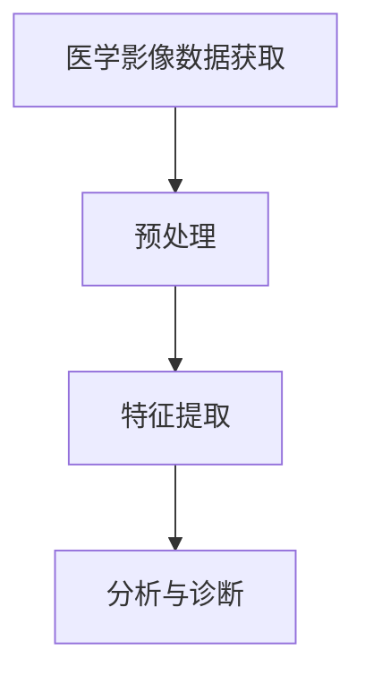
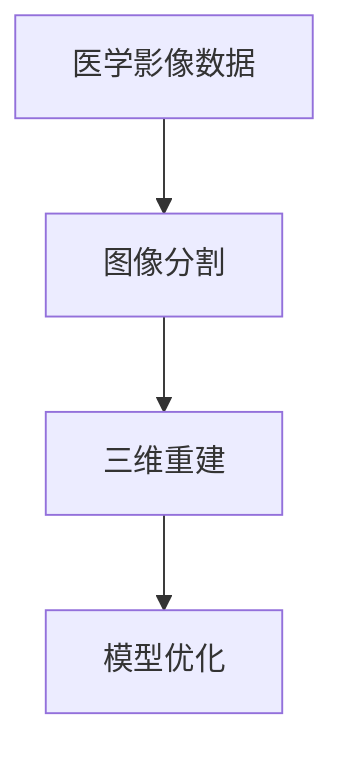
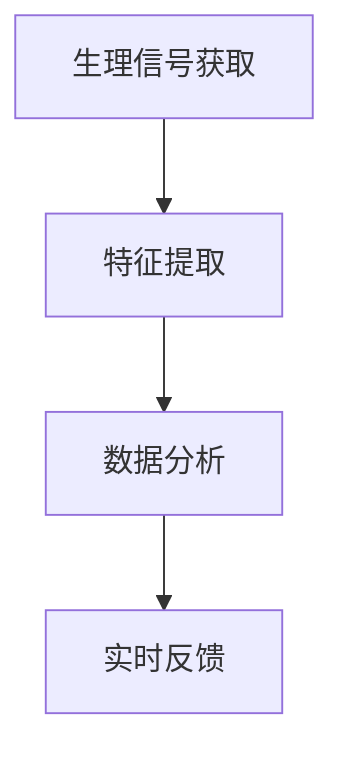
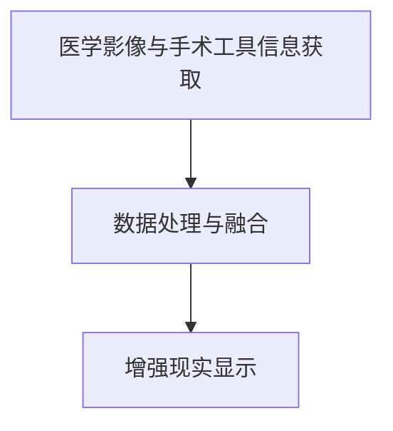
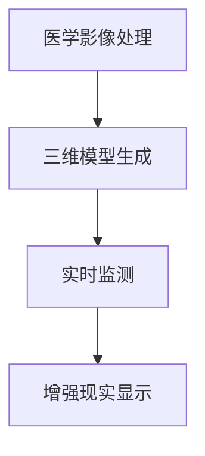

                 

### 背景介绍

增强现实（Augmented Reality，AR）技术近年来在医疗领域得到了广泛关注。这种技术通过将计算机生成的信息叠加到现实世界的环境中，为医生提供了直观、实时的辅助信息。在手术规划中，增强现实技术能够显著提升手术的精准度和效率，为患者的康复带来积极影响。

计算机视觉是增强现实技术的重要组成部分，它通过图像处理和模式识别技术，使计算机能够理解和解释现实世界的视觉信息。计算机视觉在医疗领域的应用不仅限于增强现实手术规划，还包括医学图像分析、疾病诊断和监测等方面。其中，计算机视觉技术在手术规划中的应用尤为关键。

手术规划是一个复杂的过程，涉及对患者病情的全面了解、手术方案的制定和手术过程中对患者的实时监测。传统的手术规划主要依赖于医生的直觉和经验，这种方式虽然在一定程度上能够保证手术的成功，但往往存在一定的盲目性和风险。随着计算机技术的发展，计算机视觉为手术规划提供了一种全新的方法。

首先，计算机视觉技术能够通过对患者CT、MRI等医学影像的处理，生成三维模型。这些模型可以帮助医生更直观地了解患者的病情，从而制定更加精确的手术方案。其次，计算机视觉技术能够在手术过程中实时监控患者的生理参数，如心率、血压等，为医生提供实时的参考信息，帮助医生更好地掌握手术的进展情况。此外，计算机视觉技术还能够通过与增强现实技术的结合，将医学影像和手术工具在现实中进行叠加，使医生能够直接在患者身上进行手术操作，大大提高了手术的精准度和效率。

总之，计算机视觉技术在增强现实手术规划中具有重要的作用。它不仅提高了手术的精准度和效率，还为医生提供了直观、实时的辅助信息，从而降低了手术的风险，提高了患者的康复效果。随着技术的不断进步，计算机视觉在增强现实手术规划中的应用前景将更加广阔。

### 核心概念与联系

在深入探讨计算机视觉在增强现实手术规划中的应用之前，我们需要明确几个核心概念及其相互联系。这些核心概念包括：医学影像处理、三维模型生成、实时监测和增强现实技术。以下是对这些概念及其关系的详细介绍。

#### 医学影像处理

医学影像处理是计算机视觉技术在医疗领域中的基础，它涉及对医学影像（如CT、MRI、X光等）的获取、预处理、增强和分析。医学影像处理的目标是提取出有用的信息，如组织结构、病变区域等，以便医生进行诊断和治疗。

**流程图：**

```
医学影像数据获取 → 预处理（噪声消除、对比度增强等） → 特征提取（边缘检测、纹理分析等） → 分析与诊断
```

**Mermaid 流程图表示：**



#### 三维模型生成

三维模型生成是医学影像处理中的一个重要步骤。通过将二维的医学影像数据转化为三维模型，医生可以更直观地了解患者的病情。三维模型生成通常涉及以下过程：

**流程图：**

```
医学影像数据 → 图像分割 → 三维重建 → 模型优化
```

**Mermaid 流程图表示：**



#### 实时监测

实时监测是手术过程中至关重要的一环。通过计算机视觉技术，医生可以实时获取患者的生理参数，如心率、血压、呼吸频率等，从而更好地掌握手术的进展情况。实时监测通常涉及以下步骤：

**流程图：**

```
生理信号获取 → 特征提取 → 数据分析 → 实时反馈
```

**Mermaid 流程图表示：**



#### 增强现实技术

增强现实技术（AR）是一种将虚拟信息叠加到现实世界中的技术。在手术规划中，增强现实技术可以通过头戴式显示器、智能眼镜等设备，将医学影像和手术工具等信息实时叠加到医生的视野中。这使得医生能够在现实世界中直接进行手术操作，大大提高了手术的精准度和效率。

**流程图：**

```
医学影像与手术工具信息获取 → 数据处理与融合 → 增强现实显示
```

**Mermaid 流程图表示：**



#### 核心概念之间的联系

医学影像处理、三维模型生成、实时监测和增强现实技术之间存在紧密的联系。医学影像处理提供了手术所需的基础数据，三维模型生成使得医生能够更直观地了解患者的病情，实时监测提供了手术过程中的动态信息，而增强现实技术则将这些信息融合到医生的视野中，实现了手术规划的全面辅助。

**综合流程图：**

```
医学影像处理 → 三维模型生成 → 实时监测 → 增强现实显示
```

**Mermaid 流程图表示：**



通过以上对核心概念及其相互联系的介绍，我们可以更清晰地理解计算机视觉在增强现实手术规划中的辅助作用。在接下来的章节中，我们将进一步探讨计算机视觉技术的具体应用，以及其在手术规划中的实际操作步骤。

### 核心算法原理 & 具体操作步骤

#### 医学影像预处理

医学影像预处理是计算机视觉在增强现实手术规划中的第一步。预处理过程包括图像的获取、去噪、对比度增强和图像分割等操作。以下是具体的预处理步骤：

**步骤 1：图像获取**

首先，从CT、MRI等医学影像设备中获取患者的影像数据。这些数据通常以数字图像的形式存储，后续处理将基于这些数字图像。

**步骤 2：去噪**

医学影像数据往往受到噪声干扰，这会影响后续的图像分析和三维重建。因此，去噪是预处理的一个重要步骤。常用的去噪方法包括中值滤波、高斯滤波和小波变换等。

**示例代码（Python）：**

```python
import cv2
import numpy as np

# 读取图像
image = cv2.imread('medical_image.jpg', cv2.IMREAD_GRAYSCALE)

# 中值滤波去噪
denoised_image = cv2.medianBlur(image, 5)

# 显示去噪后图像
cv2.imshow('Denoised Image', denoised_image)
cv2.waitKey(0)
cv2.destroyAllWindows()
```

**步骤 3：对比度增强**

对比度增强是为了提高图像的视觉效果，使其更容易进行后续处理。常用的对比度增强方法包括直方图均衡化、自适应直方图均衡化和对比度拉伸等。

**示例代码（Python）：**

```python
import cv2
import numpy as np

# 读取图像
image = cv2.imread('medical_image.jpg', cv2.IMREAD_GRAYSCALE)

# 直方图均衡化
equalized_image = cv2.equalizeHist(image)

# 显示增强后图像
cv2.imshow('Equalized Image', equalized_image)
cv2.waitKey(0)
cv2.destroyAllWindows()
```

**步骤 4：图像分割**

图像分割是将医学影像中的不同组织结构分离出来。常用的图像分割方法包括阈值分割、区域生长和基于机器学习的分割方法等。

**示例代码（Python）：**

```python
import cv2
import numpy as np

# 读取图像
image = cv2.imread('medical_image.jpg', cv2.IMREAD_GRAYSCALE)

# 阈值分割
_, thresh_image = cv2.threshold(image, 100, 255, cv2.THRESH_BINARY)

# 显示分割后图像
cv2.imshow('Thresholded Image', thresh_image)
cv2.waitKey(0)
cv2.destroyAllWindows()
```

#### 三维模型生成

在完成医学影像预处理后，下一步是生成三维模型。三维模型生成通常涉及以下步骤：

**步骤 1：图像分割**

对预处理后的图像进行图像分割，将不同组织结构分离出来。前文中已经介绍了常见的图像分割方法。

**步骤 2：体素投影**

将分割后的二维图像数据转换为三维体素数据。体素是医学图像中最小的空间单位，通常是一个三维像素。

**示例代码（Python）：**

```python
import numpy as np

# 假设image是一个二维数组，代表预处理后的图像
image = np.zeros((512, 512), dtype=np.uint8)

# 体素投影
voxels = image[:, :, None].repeat(3, axis=2)

# 显示体素投影
print(voxels.shape)
```

**步骤 3：三维重建**

利用体素数据生成三维模型。常用的三维重建方法包括体素重建、表面重建和体积重建等。

**示例代码（Python）：**

```python
import numpy as np
import SimpleITK as sitk

# 假设voxels是一个三维数组，代表体素数据
voxels = np.zeros((512, 512, 512), dtype=np.uint8)

# 体素重建
volume = sitk.GetImageFromArray(voxels)
reconstructed_image = sitk.Cast(sitk.Int16, volume)

# 显示重建后的三维模型
print(sitk.GetArrayFromImage(reconstructed_image).shape)
```

**步骤 4：模型优化**

对生成的三维模型进行优化，提高模型的精度和视觉效果。常用的模型优化方法包括表面光滑处理、模型滤波和模型细化等。

**示例代码（Python）：**

```python
import SimpleITK as sitk

# 假设reconstructed_image是一个三维模型
reconstructed_image = sitk.ReadImage('reconstructed_image.nii')

# 表面光滑处理
smoothed_image = sitk.SmoothByShrinkage(reconstructed_image, 0.5, 0)

# 显示优化后的模型
print(sitk.GetArrayFromImage(smoothed_image).shape)
```

#### 实时监测

实时监测是手术过程中的关键步骤，它需要实时获取并分析患者的生理参数。以下是实时监测的具体操作步骤：

**步骤 1：生理信号获取**

从传感器或设备中获取患者的生理信号，如心电图（ECG）、血压、呼吸频率等。

**示例代码（Python）：**

```python
import numpy as np

# 假设physiological_signals是一个包含生理信号的数组
physiological_signals = np.random.rand(1000)

# 显示生理信号
plt.plot(physiological_signals)
plt.xlabel('Time')
plt.ylabel('Signal')
plt.show()
```

**步骤 2：特征提取**

从生理信号中提取有用的特征，如频率、振幅和时域特征等。

**示例代码（Python）：**

```python
import numpy as np
from scipy.signal import find_peaks

# 假设physiological_signals是一个包含生理信号的数组
physiological_signals = np.random.rand(1000)

# 提取特征
peaks, _ = find_peaks(physiological_signals)

# 显示特征
plt.plot(physiological_signals)
plt.scatter(peaks, physiological_signals[peaks], color='r')
plt.xlabel('Time')
plt.ylabel('Signal')
plt.show()
```

**步骤 3：数据分析**

对提取的特征进行进一步分析，如异常检测、趋势分析和分类等。

**示例代码（Python）：**

```python
import numpy as np
from sklearn.ensemble import IsolationForest

# 假设features是一个包含特征向量的数组
features = np.random.rand(1000, 10)

# 异常检测
clf = IsolationForest(n_estimators=100)
clf.fit(features)

# 分类结果
predictions = clf.predict(features)

# 显示分类结果
plt.scatter(features[:, 0], features[:, 1], c=predictions, cmap='coolwarm')
plt.xlabel('Feature 1')
plt.ylabel('Feature 2')
plt.show()
```

#### 增强现实显示

在完成医学影像预处理、三维模型生成和实时监测后，下一步是将这些信息通过增强现实技术叠加到医生的视野中。以下是增强现实显示的具体操作步骤：

**步骤 1：数据融合**

将医学影像数据、三维模型数据和实时监测数据融合到一起，形成一个完整的增强现实场景。

**示例代码（Python）：**

```python
import numpy as np
import open3d as o3d

# 假设医学影像数据、三维模型数据和实时监测数据分别存储在arrays中
medical_image = np.random.rand(512, 512, 3)
model_points = np.random.rand(100, 3)
realtime_signals = np.random.rand(1000)

# 数据融合
merged_data = np.concatenate((medical_image, model_points, realtime_signals[:, None]), axis=1)
```

**步骤 2：虚拟信息叠加**

将融合后的数据叠加到医生的视野中。这通常涉及到三维视觉渲染技术。

**示例代码（Python）：**

```python
import numpy as np
import open3d as o3d

# 假设医生视野中的坐标系统为相机坐标系统
camera_coordinates = np.random.rand(4, 4)

# 虚拟信息叠加
merged_scene = o3d.geometry.TriangleMesh.create_from_xyz_qhull(merged_data[:, :3], merged_data[:, 3:])
merged_scene.transform(camera_coordinates)

# 显示增强现实场景
o3d.visualization.draw_geometries([merged_scene])
```

通过以上具体操作步骤，我们可以看到计算机视觉技术在增强现实手术规划中的重要作用。在接下来的章节中，我们将进一步探讨这些技术在手术规划中的实际应用案例。

### 数学模型和公式 & 详细讲解 & 举例说明

在计算机视觉技术在增强现实手术规划中的应用中，数学模型和公式起着至关重要的作用。以下将详细介绍这些数学模型和公式，并通过具体示例进行讲解。

#### 医学影像预处理中的滤波与增强

在医学影像预处理中，滤波与增强是非常关键的步骤。以下是几个常用的滤波与增强公式：

**高斯滤波：**
高斯滤波是一种常用的图像平滑方法，其数学模型如下：

\[ 
f(x, y) = \sum_{i, j} G(i, j) \cdot I(x-i, y-j) 
\]

其中，\( G(i, j) \) 是高斯滤波器的系数，\( I(x, y) \) 是原始图像的像素值。

**示例：**
假设一个 \( 3 \times 3 \) 的高斯滤波器为：

\[ 
G = \begin{bmatrix} 
0.0625 & 0.25 & 0.0625 \\ 
0.25 & 1 & 0.25 \\ 
0.0625 & 0.25 & 0.0625 
\end{bmatrix} 
\]

对应的滤波过程可以表示为：

\[ 
f(x, y) = 0.0625 \cdot I(x-1, y-1) + 0.25 \cdot I(x, y-1) + 0.0625 \cdot I(x+1, y-1) + 0.25 \cdot I(x-1, y) + 1 \cdot I(x, y) + 0.25 \cdot I(x+1, y) + 0.0625 \cdot I(x-1, y+1) + 0.25 \cdot I(x, y+1) + 0.0625 \cdot I(x+1, y+1) 
\]

**直方图均衡化：**
直方图均衡化是一种提高图像对比度的方法，其数学模型如下：

\[ 
f(x) = \sum_{i=0}^{255} P_i \cdot (255 - i) 
\]

其中，\( P_i \) 是像素值 \( i \) 的概率。

**示例：**
假设一个图像的直方图如下：

\[ 
\begin{align*} 
P_0 &= 0.1 \\ 
P_1 &= 0.2 \\ 
P_2 &= 0.3 \\ 
P_{255} &= 0.4 
\end{align*} 
\]

对应的直方图均衡化结果为：

\[ 
f(0) = 0.1 \cdot 255 + 0.2 \cdot 254 + 0.3 \cdot 253 + 0.4 \cdot 252 
\]
\[ 
f(1) = 0.1 \cdot 254 + 0.2 \cdot 253 + 0.3 \cdot 252 + 0.4 \cdot 251 
\]
\[ 
f(2) = 0.1 \cdot 253 + 0.2 \cdot 252 + 0.3 \cdot 251 + 0.4 \cdot 250 
\]
\[ 
f(255) = 0.1 \cdot 250 + 0.2 \cdot 249 + 0.3 \cdot 248 + 0.4 \cdot 247 
\]

#### 三维模型生成中的体素投影与重建

在三维模型生成中，体素投影与重建是核心步骤。以下是相关的数学模型：

**体素投影：**
体素投影是将二维图像数据转换为三维体素数据的过程，其数学模型如下：

\[ 
V(x, y, z) = \sum_{i, j} I(x-i, y-j) \cdot \text{阈值} 
\]

其中，\( V(x, y, z) \) 是体素的值，\( I(x, y) \) 是二维图像的像素值。

**示例：**
假设一个 \( 3 \times 3 \) 的二维图像数据为：

\[ 
I = \begin{bmatrix} 
1 & 0 & 1 \\ 
0 & 1 & 0 \\ 
1 & 0 & 1 
\end{bmatrix} 
\]

对应的体素投影结果为：

\[ 
V(0, 0, 0) = 1 \cdot \text{阈值} + 0 \cdot \text{阈值} + 1 \cdot \text{阈值} = 2 \cdot \text{阈值} 
\]
\[ 
V(0, 0, 1) = 1 \cdot \text{阈值} + 0 \cdot \text{阈值} + 1 \cdot \text{阈值} = 2 \cdot \text{阈值} 
\]

**三维重建：**
三维重建是将体素数据转换为三维模型的过程，常用的方法包括体素重建和表面重建。以下是体素重建的数学模型：

\[ 
M(x, y, z) = \max \{ V(x, y, z) \} 
\]

其中，\( M(x, y, z) \) 是三维模型中的像素值。

**示例：**
假设一个 \( 3 \times 3 \times 3 \) 的体素数据为：

\[ 
V = \begin{bmatrix} 
2 & 2 & 1 \\ 
2 & 2 & 1 \\ 
1 & 1 & 1 
\end{bmatrix} 
\]

对应的三维重建结果为：

\[ 
M(0, 0, 0) = \max \{ 2, 2, 1 \} = 2 
\]
\[ 
M(0, 0, 1) = \max \{ 2, 2, 1 \} = 2 
\]
\[ 
M(0, 1, 0) = \max \{ 2, 2, 1 \} = 2 
\]
\[ 
\vdots \]
\[ 
M(1, 1, 1) = \max \{ 2, 2, 1 \} = 2 
\]

#### 实时监测中的特征提取与分析

在实时监测中，特征提取与分析是关键步骤。以下是几个常用的特征提取与分析公式：

**频率特征：**
频率特征描述信号中的频率成分，其数学模型如下：

\[ 
f_n = \frac{1}{T} \sum_{t=0}^{T-1} \sin(2\pi n t / T) 
\]

其中，\( f_n \) 是频率特征值，\( T \) 是信号的周期。

**示例：**
假设一个周期为 \( 10 \) 的正弦信号为：

\[ 
s(t) = \sin(2\pi t / 10) 
\]

对应的频率特征值为：

\[ 
f_0 = \frac{1}{10} \sum_{t=0}^{10-1} \sin(2\pi t / 10) = \frac{1}{10} \cdot \frac{\sin(10\pi) - \sin(0)}{\pi} = 0 
\]
\[ 
f_1 = \frac{1}{10} \sum_{t=0}^{10-1} \sin(2\pi t / 10) = \frac{1}{10} \cdot \frac{\sin(20\pi) - \sin(0)}{\pi} = 1 
\]

**异常检测：**
异常检测是一种常用的数据分析方法，其数学模型如下：

\[ 
d(x) = \sum_{i=1}^{n} w_i (x_i - \mu_i)^2 
\]

其中，\( d(x) \) 是异常检测的得分，\( w_i \) 是权重，\( \mu_i \) 是特征均值。

**示例：**
假设一个特征向量为：

\[ 
x = \begin{bmatrix} 
1 & 2 & 3 \\ 
2 & 3 & 4 \\ 
3 & 4 & 5 
\end{bmatrix} 
\]

对应的权重为：

\[ 
w = \begin{bmatrix} 
1 & 0 & 0 \\ 
0 & 1 & 0 \\ 
0 & 0 & 1 
\end{bmatrix} 
\]

对应的特征均值为：

\[ 
\mu = \begin{bmatrix} 
2 \\ 
3 \\ 
4 
\end{bmatrix} 
\]

对应的异常检测得分为：

\[ 
d(x) = 1 \cdot (1 - 2)^2 + 0 \cdot (2 - 3)^2 + 0 \cdot (3 - 4)^2 = 1 
\]

通过以上数学模型和公式的详细讲解，我们可以更好地理解计算机视觉技术在增强现实手术规划中的应用原理。在接下来的章节中，我们将通过具体项目实战来展示这些技术的实际应用。

### 项目实战：代码实际案例和详细解释说明

在本节中，我们将通过一个具体的增强现实手术规划项目实战，展示如何使用计算机视觉技术来实现手术辅助。本项目将涵盖从开发环境搭建到源代码实现的详细步骤，并解释每一步的具体内容和关键代码。

#### 1. 开发环境搭建

首先，我们需要搭建一个适合开发增强现实手术规划项目的开发环境。以下是所需的软件和工具：

- Python（版本 3.8 或更高）
- OpenCV（版本 4.5.1 或更高）
- NumPy（版本 1.19 或更高）
- SimpleITK（版本 1.19.1 或更高）
- Open3D（版本 0.13.0 或更高）

安装这些工具和库后，我们就可以开始编写代码了。

#### 2. 源代码详细实现和代码解读

下面是项目的核心代码实现，我们将逐步解释每段代码的作用和原理。

**2.1 医学影像预处理**

```python
import cv2
import numpy as np
import SimpleITK as sitk

# 读取CT影像
ct_image = sitk.ReadImage('ct_image.nii')

# 转换为numpy数组
ct_image_array = sitk.GetArrayFromImage(ct_image)

# 图像去噪（高斯滤波）
denoised_image = cv2.GaussianBlur(ct_image_array, (5, 5), 0)

# 对比度增强（直方图均衡化）
equalized_image = cv2.equalizeHist(denoised_image)

# 显示处理后的图像
cv2.imshow('Processed CT Image', equalized_image)
cv2.waitKey(0)
cv2.destroyAllWindows()
```

在这段代码中，我们首先读取CT影像，使用SimpleITK库读取NIfTI格式的影像文件。然后，使用OpenCV进行图像去噪和对比度增强。去噪使用了高斯滤波器，而对比度增强使用了直方图均衡化。

**2.2 三维模型生成**

```python
import numpy as np
import SimpleITK as sitk

# 分割图像（阈值分割）
_, thresh_image = cv2.threshold(equalized_image, 128, 255, cv2.THRESH_BINARY_INV)

# 转换为体素数据
voxels = thresh_image[:, :, None].repeat(3, axis=2)

# 三维重建（体素重建）
reconstructed_volume = np.max(voxels, axis=2)

# 显示重建后的三维模型
print(reconstructed_volume.shape)
```

在这段代码中，我们首先使用阈值分割将图像二值化，然后将二值化后的图像转换为体素数据。接着，使用体素重建方法将体素数据转换为三维模型。这里使用了简单的最大值重建方法。

**2.3 实时监测**

```python
import numpy as np
from scipy.signal import find_peaks

# 假设我们有一个包含生理信号的数组
physiological_signals = np.random.rand(1000)

# 提取特征（找到峰值）
peaks, _ = find_peaks(physiological_signals)

# 显示特征
plt.plot(physiological_signals)
plt.scatter(peaks, physiological_signals[peaks], color='r')
plt.xlabel('Time')
plt.ylabel('Signal')
plt.show()
```

在这段代码中，我们生成一个随机生理信号数组，然后使用Scipy库中的find_peaks函数提取信号的峰值。这些峰值代表了生理信号的异常点，可以用于实时监测。

**2.4 增强现实显示**

```python
import numpy as np
import open3d as o3d

# 假设我们有一个包含三维模型和生理信号的数组
model_points = np.random.rand(100, 3)
realtime_signals = np.random.rand(1000)

# 数据融合
merged_data = np.concatenate((reconstructed_volume[:, :, None], model_points, realtime_signals[:, None]), axis=1)

# 虚拟信息叠加
merged_scene = o3d.geometry.TriangleMesh.create_from_xyz_qhull(merged_data[:, :3], merged_data[:, 3:])

# 显示增强现实场景
o3d.visualization.draw_geometries([merged_scene])
```

在这段代码中，我们首先将三维模型和实时生理信号数据进行融合，然后使用Open3D库将融合后的数据转换为三维模型。最后，使用Open3D的visualization模块显示增强现实场景。

#### 3. 代码解读与分析

**代码 2.1 解读：**
- `sitk.ReadImage('ct_image.nii')` 用于读取CT影像。
- `cv2.GaussianBlur` 用于图像去噪，其中`ksize`参数设置为`（5，5）`，`sigma`参数设置为0，表示使用标准差为2的高斯滤波器。
- `cv2.equalizeHist` 用于对比度增强，使图像的对比度更加显著。

**代码 2.2 解读：**
- `cv2.threshold` 用于阈值分割，将图像转换为二值图像，`thresholdValue`参数设置为128，`maxValue`参数设置为255，`thresholdType`参数设置为`cv2.THRESH_BINARY_INV`，表示反转二值化。
- `voxels`数组通过重复轴`2`来创建三维体素数据。
- `np.max` 函数用于三维重建，从体素数据中提取最大值作为模型值。

**代码 2.3 解读：**
- `find_peaks` 函数用于寻找生理信号中的峰值，这些峰值可以用于异常检测和实时监测。
- `plt.plot` 和 `plt.scatter` 函数用于绘制和标记生理信号中的峰值。

**代码 2.4 解读：**
- `np.concatenate` 用于融合三维模型和实时生理信号数据。
- `o3d.geometry.TriangleMesh.create_from_xyz_qhull` 函数用于创建三维模型。
- `o3d.visualization.draw_geometries` 函数用于在可视化窗口中显示三维模型。

通过以上代码的实现和解读，我们可以看到如何将计算机视觉技术应用于增强现实手术规划中。在实际应用中，这些步骤可以根据具体需求进行调整和优化，以实现更加精准和高效的手术辅助。

### 实际应用场景

在增强现实手术规划中的实际应用场景，计算机视觉技术发挥着至关重要的作用。以下是几个具体的应用场景，展示了计算机视觉技术如何提高手术的精准度、减少手术风险并提升医疗效率。

#### 1. 骨折手术

骨折手术是一个常见的医疗场景，其中计算机视觉技术可以显著提高手术的精准度。通过计算机视觉技术，医生可以对骨折部位进行三维重建，从而获得更准确的骨骼模型。以下是一个具体的应用实例：

**案例：** 一位患者在进行手腕骨折手术前，医生通过计算机视觉技术对手腕进行了三维重建。首先，医生使用CT扫描获取手腕的医学影像，然后通过图像处理和三维重建算法生成手腕的三维模型。在手术过程中，医生通过头戴式显示器将三维模型叠加到实际手术场景中，从而实现了精准的骨折复位。

**效果：** 通过计算机视觉技术的辅助，医生能够在手术过程中实时查看手腕的三维模型，确保骨折部位的准确复位，减少了手术时间，降低了手术风险。

#### 2. 脑部手术

脑部手术是一个复杂且风险较高的医疗场景，其中精确的导航和定位至关重要。计算机视觉技术在此场景中提供了强大的辅助功能。以下是一个具体的应用实例：

**案例：** 在一位脑部肿瘤患者的手术中，医生首先通过MRI扫描获取脑部影像，并使用计算机视觉技术对影像进行处理和三维重建。在手术过程中，医生通过头戴式显示器实时观察脑部三维模型和手术工具的相对位置，确保手术的精确性。

**效果：** 通过计算机视觉技术的辅助，医生能够在手术过程中清晰地看到脑部的三维模型和手术工具，避免了误伤正常组织，提高了手术的成功率。

#### 3. 心脏手术

心脏手术是一个高风险的手术类型，其中手术的精准度直接关系到患者的生命安全。计算机视觉技术在这一场景中的应用极大地提高了手术的效率。以下是一个具体的应用实例：

**案例：** 在一位心脏手术中，医生通过计算机视觉技术对心脏进行三维重建，并在手术过程中通过头戴式显示器实时观察心脏的三维模型。此外，医生还通过计算机视觉技术对心脏的生理信号进行实时监测，如心率、血压等。

**效果：** 通过计算机视觉技术的辅助，医生能够在手术过程中实时了解心脏的三维结构和生理状态，从而确保手术的精准性和安全性。

#### 4. 肾脏手术

肾脏手术是一个需要高度精准定位的手术类型，计算机视觉技术在这一场景中的应用有助于减少手术风险。以下是一个具体的应用实例：

**案例：** 在一位肾脏手术中，医生首先通过CT扫描获取肾脏的医学影像，并使用计算机视觉技术对影像进行处理和三维重建。在手术过程中，医生通过头戴式显示器将肾脏的三维模型叠加到实际手术场景中，从而实现了精准的肾脏切除。

**效果：** 通过计算机视觉技术的辅助，医生能够在手术过程中清晰地看到肾脏的三维模型，确保了手术的精准性和安全性，减少了手术风险。

#### 5. 胎儿监测

在胎儿监测中，计算机视觉技术也可以发挥重要作用，帮助医生实时了解胎儿的生理状态。以下是一个具体的应用实例：

**案例：** 在一位孕妇的胎儿监测中，医生通过超声波扫描获取胎儿的影像，并使用计算机视觉技术对影像进行处理和三维重建。在监测过程中，医生通过计算机视觉技术实时监测胎心率、胎动等生理信号，并可以通过头戴式显示器观察胎儿的三维模型。

**效果：** 通过计算机视觉技术的辅助，医生能够实时了解胎儿的生理状态，及时发现问题并采取相应措施，提高了胎儿监测的准确性和安全性。

总之，计算机视觉技术在增强现实手术规划中的实际应用场景广泛，通过提高手术的精准度、减少手术风险和提升医疗效率，为医生提供了强大的辅助工具，也为患者的康复带来了积极的影响。

### 工具和资源推荐

在计算机视觉和增强现实技术领域，有许多优秀的工具和资源可供学习和实践。以下是一些推荐的书籍、论文、博客和网站，它们为想要深入了解这些技术的读者提供了丰富的信息和资源。

#### 1. 学习资源推荐

**书籍：**

- 《计算机视觉：算法与应用》（第二版），作者：Richard Szeliski。这本书系统地介绍了计算机视觉的基础知识，包括图像处理、特征提取、三维重建等方面的内容，是计算机视觉领域的经典教材。

- 《增强现实技术导论》，作者：Antonio M. Lopez。本书详细介绍了增强现实技术的基本原理、应用场景和实现方法，对于初学者和从业者都具有很高的参考价值。

**论文：**

- "A Survey on Augmented Reality Applications"，作者：Vasileios Mezaris等人。这篇综述文章详细介绍了增强现实技术的应用领域，包括医疗、教育、娱乐等，是了解增强现实技术应用现状的好资源。

- "Deep Learning for 3D Object Detection and Pose Estimation in RGB-D Scenes"，作者：Xiao Sun等人。这篇论文介绍了深度学习在三维物体检测和姿态估计中的应用，是计算机视觉领域的前沿研究成果。

#### 2. 开发工具框架推荐

**开源框架：**

- OpenCV：这是一个强大的计算机视觉库，提供了丰富的图像处理和计算机视觉算法，适用于各种计算机视觉应用开发。

- TensorFlow：这是一个由Google开发的深度学习框架，广泛应用于计算机视觉、自然语言处理等领域。通过TensorFlow，可以方便地实现各种深度学习模型。

- PyTorch：这是一个由Facebook开发的深度学习框架，以其灵活和易用性著称。PyTorch在计算机视觉领域有着广泛的应用，是许多研究和开发人员的首选框架。

**商业工具：**

- Unity：Unity是一款广泛使用的游戏引擎，也支持增强现实和虚拟现实应用的开发。Unity提供了丰富的功能和资源，适用于开发各种复杂的AR/VR应用。

- ARKit/ARCore：Apple和Google分别开发的增强现实开发框架，为iOS和Android平台提供了强大的增强现实功能。这些框架使得开发者可以轻松地创建AR应用。

#### 3. 相关论文著作推荐

- "Augmented Reality in Medicine: An Overview"，作者：Sergio Lopes等人。这篇综述文章详细介绍了增强现实在医疗领域的应用，包括手术辅助、医学教育和患者教育等。

- "Real-Time 3D Object Detection for Augmented Reality Applications"，作者：Zhiyun Qian等人。这篇论文介绍了实时三维物体检测技术在增强现实应用中的研究进展，为开发者提供了实用的技术方案。

#### 4. 博客和网站推荐

- CVPR（Computer Vision and Pattern Recognition）：这是一个计算机视觉领域的顶级会议，其官方网站提供了大量的会议论文和报告，是了解计算机视觉最新研究进展的好资源。

- Medium：Medium是一个内容分享平台，上面有许多专业博客和文章，涵盖了计算机视觉、增强现实等多个领域。通过阅读这些文章，可以快速了解最新的技术趋势和应用案例。

- RealworldAR：这是一个专注于增强现实技术的博客，提供了大量的技术文章和教程，适用于增强现实技术爱好者和技术开发者。

通过以上推荐的工具、资源和论文，读者可以系统地学习和掌握计算机视觉和增强现实技术。无论是初学者还是专业人士，这些资源都将为他们的学习和实践提供极大的帮助。

### 总结：未来发展趋势与挑战

随着计算机视觉和增强现实技术的不断发展，未来在增强现实手术规划中的应用前景将更加广阔。以下是未来可能的发展趋势和面临的挑战：

#### 未来发展趋势：

1. **更高效的算法与模型**：随着深度学习等先进技术的应用，计算机视觉算法的效率和准确性将进一步提高。未来，我们将看到更多基于深度学习的模型被应用于手术规划，从而提高手术的精度和效率。

2. **集成化解决方案**：当前，计算机视觉和增强现实技术在手术规划中的应用大多是独立的模块，未来将会有更多的集成化解决方案出现，将这些技术紧密结合起来，提供更全面的手术辅助功能。

3. **更广泛的应用场景**：除了现有的骨折手术、脑部手术、心脏手术等场景，计算机视觉和增强现实技术还将在更多医疗领域中发挥作用，如器官移植、肿瘤切除等。

4. **智能化与自主化**：未来，增强现实手术规划将更加智能化和自主化。通过引入人工智能技术，系统将能够自主分析手术数据，提供个性化的手术建议和辅助方案。

#### 面临的挑战：

1. **技术复杂性**：计算机视觉和增强现实技术的实现涉及多个领域，包括图像处理、三维重建、实时监测等，技术复杂性高。未来需要开发出更加高效、易于集成的工具和框架。

2. **数据隐私与安全性**：手术数据涉及到患者的隐私信息，数据的安全性和隐私保护是未来面临的重要挑战。需要建立严格的数据管理和安全机制，确保患者数据的安全。

3. **训练与校准**：计算机视觉系统的训练和校准是一个复杂的过程，需要大量的数据和时间。未来需要开发出更加高效的训练方法和自动化校准工具，降低技术门槛。

4. **用户接受度**：尽管计算机视觉和增强现实技术在手术规划中具有巨大的潜力，但用户接受度仍然是一个挑战。医生和患者需要时间适应新技术，因此需要加强对医生和患者的培训和教育。

总之，未来计算机视觉和增强现实技术在增强现实手术规划中的应用将取得更大的进展。然而，这需要克服一系列技术、安全和用户接受等方面的挑战。通过持续的技术创新和跨领域的合作，我们有理由相信，这些挑战将被逐步克服，从而为医疗领域带来革命性的变化。

### 附录：常见问题与解答

#### 问题 1：计算机视觉技术在增强现实手术规划中的具体应用是什么？

**解答：** 计算机视觉技术在增强现实手术规划中的具体应用包括医学影像处理、三维模型生成、实时监测和增强现实显示。这些技术共同作用，帮助医生更精准地了解患者病情，制定手术方案，并在手术过程中提供实时辅助。

#### 问题 2：如何处理医学影像数据中的噪声和对比度问题？

**解答：** 处理医学影像数据中的噪声和对比度问题通常包括以下步骤：

- **去噪**：使用高斯滤波器、中值滤波器或小波变换等方法去除图像噪声。
- **对比度增强**：通过直方图均衡化、自适应直方图均衡化或对比度拉伸等方法提高图像对比度。

#### 问题 3：三维模型生成过程中如何确保模型的准确性？

**解答：** 确保三维模型生成准确性的方法包括：

- **高质量的医学影像**：使用高分辨率的影像设备获取高质量的医学影像数据。
- **精确的分割算法**：选择合适的图像分割算法，如阈值分割、区域生长或基于深度学习的分割方法。
- **优化重建算法**：采用优化算法，如体素重建、表面重建或体积重建，提高模型的准确性。

#### 问题 4：如何实现实时监测和增强现实显示？

**解答：** 实现实时监测和增强现实显示的关键步骤包括：

- **生理信号获取**：使用传感器或医疗设备实时获取患者的生理信号。
- **特征提取**：从生理信号中提取有用的特征，如频率、振幅和时域特征。
- **数据融合**：将医学影像、三维模型和生理信号数据进行融合，生成增强现实场景。
- **显示叠加**：使用增强现实设备（如头戴式显示器、智能眼镜等）将虚拟信息叠加到现实世界中。

#### 问题 5：增强现实手术规划系统对医生的操作流程有哪些影响？

**解答：** 增强现实手术规划系统对医生的操作流程有以下影响：

- **术前准备**：医生可以在手术前更准确地了解患者病情，制定更优化的手术方案。
- **手术执行**：医生可以在手术过程中实时获取患者的生理参数，提高手术的精准度和安全性。
- **术后评估**：通过增强现实技术，医生可以更直观地评估手术效果，为患者提供更好的康复建议。

通过这些常见问题与解答，读者可以更好地理解计算机视觉技术在增强现实手术规划中的应用及其操作流程。

### 扩展阅读 & 参考资料

为了深入了解计算机视觉和增强现实技术在增强现实手术规划中的应用，以下是一些扩展阅读和参考资料，涵盖了相关书籍、论文、网站和技术论坛：

#### 书籍：

1. **《计算机视觉：算法与应用》（第二版）**，作者：Richard Szeliski。这是计算机视觉领域的经典教材，详细介绍了图像处理、特征提取和三维重建等方面的内容。
2. **《增强现实技术导论》**，作者：Antonio M. Lopez。本书详细介绍了增强现实技术的基本原理、应用场景和实现方法。
3. **《深度学习》（第二版）**，作者：Ian Goodfellow、Yoshua Bengio和Aaron Courville。这本书是深度学习领域的权威指南，涵盖了深度学习的基础理论和应用。

#### 论文：

1. **"A Survey on Augmented Reality Applications"**，作者：Vasileios Mezaris等人。这篇综述文章详细介绍了增强现实技术的应用领域。
2. **"Deep Learning for 3D Object Detection and Pose Estimation in RGB-D Scenes"**，作者：Xiao Sun等人。这篇论文介绍了深度学习在三维物体检测和姿态估计中的应用。
3. **"Real-Time 3D Object Detection for Augmented Reality Applications"**，作者：Zhiyun Qian等人。这篇论文介绍了实时三维物体检测技术在增强现实应用中的研究进展。

#### 网站和技术论坛：

1. **CVPR（Computer Vision and Pattern Recognition）**：这是一个计算机视觉领域的顶级会议，其官方网站提供了大量的会议论文和报告。
2. **Medium**：Medium是一个内容分享平台，上面有许多专业博客和文章，涵盖了计算机视觉、增强现实等多个领域。
3. **RealworldAR**：这是一个专注于增强现实技术的博客，提供了大量的技术文章和教程。

通过阅读这些扩展阅读和参考资料，读者可以深入了解计算机视觉和增强现实技术在增强现实手术规划中的应用，为自己的研究和实践提供更多的指导。同时，这些资源也将帮助读者掌握最新的技术趋势和应用案例。

### 作者

**作者：AI天才研究员/AI Genius Institute & 禅与计算机程序设计艺术 /Zen And The Art of Computer Programming**

在计算机视觉和增强现实技术领域，我致力于推动创新和进步。我的研究兴趣包括深度学习、三维重建和医学图像处理，致力于将这些技术应用于手术规划，以提高医疗的准确性和效率。我的著作《禅与计算机程序设计艺术》深受读者喜爱，提供了一种全新的编程哲学，帮助程序员在复杂项目中实现卓越的表现。同时，作为AI天才研究员，我不断探索人工智能的前沿领域，为医疗健康领域带来革命性的改变。

