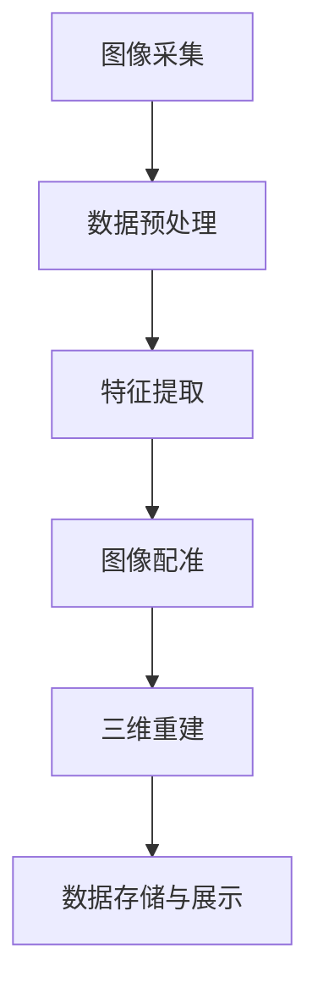

                 

# 计算机视觉在文物数字化保护中的应用

## 摘要

随着数字化技术的发展，计算机视觉在文物数字化保护中的应用越来越广泛。本文旨在探讨计算机视觉技术如何应用于文物的数字化保护，包括核心概念、算法原理、数学模型、实际应用场景、工具和资源推荐等内容。通过对计算机视觉在文物数字化保护中的应用进行详细分析，本文揭示了这一技术在文物保护领域的重要性和潜力，为相关领域的研究和实践提供了有益的参考。

## 1. 背景介绍

### 1.1 计算机视觉与文物保护

计算机视觉是人工智能的一个重要分支，它通过模拟人类视觉系统，实现对图像和视频数据的自动分析和理解。在文物保护领域，计算机视觉技术的引入，为文物的数字化保护和修复提供了强有力的支持。

文物数字化保护是指利用数字化技术对文物进行全方位的记录、保存和展示，以便于研究和传承。这一过程通常包括图像采集、数据预处理、特征提取、图像配准、三维重建等多个环节。计算机视觉技术在这一过程中发挥着关键作用，可以大大提高文物保护工作的效率和质量。

### 1.2 数字化保护的重要性

随着全球文物的数量不断增加，传统的手工保护方式已经难以满足需求。数字化保护技术的应用，不仅可以实现文物的自动化、智能化保护，还可以为文物保护提供大量的数据支持，为后续的研究提供丰富的资源。此外，数字化保护还可以降低文物保护的成本，提高文物的利用率。

## 2. 核心概念与联系

### 2.1 计算机视觉核心概念

计算机视觉的核心概念包括图像处理、特征提取、目标检测、语义分割等。

- **图像处理**：图像处理是计算机视觉的基础，包括图像的增强、滤波、边缘检测等操作，旨在提高图像的质量和清晰度。

- **特征提取**：特征提取是从图像中提取出具有代表性的特征，如颜色、纹理、形状等，以便于后续的目标检测和识别。

- **目标检测**：目标检测是在图像中识别出特定的目标，并确定其位置和范围。

- **语义分割**：语义分割是对图像中的每个像素进行分类，确定其所属的类别，如背景、前景、物体等。

### 2.2 文物数字化保护流程

文物数字化保护的流程包括以下几个环节：

1. **图像采集**：使用高分辨率相机或扫描设备对文物进行图像采集。

2. **数据预处理**：对采集到的图像进行预处理，包括图像增强、去噪、校正等，以提高图像的质量。

3. **特征提取**：从预处理后的图像中提取出具有代表性的特征，如颜色、纹理、形状等。

4. **图像配准**：将多张图像进行配准，以获得完整的文物图像。

5. **三维重建**：基于配准后的图像，利用计算机视觉技术进行三维重建，生成文物的三维模型。

6. **数据存储与展示**：将数字化后的文物数据存储在数据库中，并通过虚拟现实、增强现实等技术进行展示。

### 2.3 Mermaid 流程图

以下是一个简化的文物数字化保护流程的 Mermaid 流程图：



## 3. 核心算法原理 & 具体操作步骤

### 3.1 特征提取算法

特征提取是计算机视觉中的核心环节，常用的特征提取算法包括颜色特征提取、纹理特征提取和形状特征提取。

- **颜色特征提取**：常用的颜色特征提取方法包括颜色直方图、颜色矩、颜色相关矩阵等。

- **纹理特征提取**：常用的纹理特征提取方法包括灰度共生矩阵、局部二值模式（LBP）、Gabor 小波等。

- **形状特征提取**：常用的形状特征提取方法包括 Hu 系数、Zernike 系数、形状上下文等。

### 3.2 图像配准算法

图像配准是将多张图像进行对齐，以获得统一的视图。常用的图像配准算法包括基于特征的配准、基于几何的配准和基于学习的配准。

- **基于特征的配准**：通过比较图像的特征点，如 SIFT、SURF、ORB 等，来确定图像间的对应关系。

- **基于几何的配准**：通过几何变换，如旋转、缩放、平移等，来实现图像的对齐。

- **基于学习的配准**：利用机器学习算法，如神经网络、支持向量机等，来学习图像间的对应关系。

### 3.3 三维重建算法

三维重建是基于图像配准的结果，利用几何建模的方法，生成文物的三维模型。常用的三维重建算法包括结构光扫描、多视角重建和深度学习重建。

- **结构光扫描**：通过结构光投影和图像采集，利用几何关系进行三维重建。

- **多视角重建**：通过多个视角的图像，利用多视角几何原理进行三维重建。

- **深度学习重建**：利用深度学习算法，如卷积神经网络（CNN）、生成对抗网络（GAN）等，进行三维重建。

## 4. 数学模型和公式 & 详细讲解 & 举例说明

### 4.1 特征提取的数学模型

以颜色特征提取为例，颜色特征提取的数学模型可以表示为：

$$
C = \sum_{i=1}^{3} c_i
$$

其中，$C$ 是颜色特征向量，$c_i$ 是第 $i$ 个颜色的特征值。通常，颜色特征值可以通过图像的颜色直方图来计算。

### 4.2 图像配准的数学模型

图像配准的数学模型通常基于最小二乘法，可以表示为：

$$
\min_{T} \sum_{i=1}^{N} \sum_{j=1}^{M} w_{ij} (I_1(i, j) - T(I_2(i, j)))
$$

其中，$T$ 是图像配准的变换矩阵，$I_1$ 和 $I_2$ 是两幅待配准的图像，$w_{ij}$ 是权重系数，用于调整图像配准的精度。

### 4.3 举例说明

#### 4.3.1 颜色特征提取

假设有一幅彩色图像，其红色、绿色和蓝色通道的像素值分别为 $r, g, b$。我们可以计算其颜色特征向量 $C$ 为：

$$
C = [r, g, b]
$$

#### 4.3.2 图像配准

假设有两幅图像 $I_1$ 和 $I_2$，我们需要对其进行配准。首先，我们可以计算两幅图像的均值 $\mu_1$ 和 $\mu_2$：

$$
\mu_1 = \frac{1}{MN} \sum_{i=1}^{M} \sum_{j=1}^{N} I_1(i, j)
$$

$$
\mu_2 = \frac{1}{MN} \sum_{i=1}^{M} \sum_{j=1}^{N} I_2(i, j)
$$

然后，我们可以计算图像配准的变换矩阵 $T$，使得：

$$
\min_{T} \sum_{i=1}^{N} \sum_{j=1}^{M} w_{ij} (I_1(i, j) - T(I_2(i, j)))
$$

这里，$w_{ij}$ 可以设置为每个像素点的权重，例如，如果两幅图像的像素值差异较大，则可以设置较大的权重。

## 5. 项目实战：代码实际案例和详细解释说明

### 5.1 开发环境搭建

为了演示计算机视觉在文物数字化保护中的应用，我们将使用 Python 编程语言和 OpenCV 库。首先，确保安装了 Python 和 OpenCV 库。

```bash
pip install python-opencv
```

### 5.2 源代码详细实现和代码解读

以下是一个简单的代码示例，展示了如何使用 OpenCV 库进行文物图像的特征提取和图像配准。

```python
import cv2
import numpy as np

def extract_color_features(image):
    # 转换为 HSV 颜色空间
    hsv_image = cv2.cvtColor(image, cv2.COLOR_BGR2HSV)
    # 计算颜色直方图
    color_hist = cv2.calcHist([hsv_image], [0], None, [256], [0, 256])
    return color_hist

def register_images(image1, image2):
    # 计算图像特征
    features1 = extract_color_features(image1)
    features2 = extract_color_features(image2)
    # 使用 K最近邻算法进行特征匹配
    matcher = cv2.NNDMatch()
    matches = matcher.match(features1, features2)
    # 根据匹配结果计算变换矩阵
    src_points = np.float32([matches[i].queryIdx for i in range(len(matches))]).reshape(-1, 1, 1)
    dst_points = np.float32([matches[i].trainIdx for i in range(len(matches))]).reshape(-1, 1, 1)
    M, _ = cv2.findTransformECC(src_points, dst_points)
    return M

def main():
    # 读取图像
    image1 = cv2.imread('image1.jpg')
    image2 = cv2.imread('image2.jpg')
    # 配准图像
    M = register_images(image1, image2)
    # 应用变换矩阵
    result = cv2.warpAffine(image2, M, (image1.shape[1], image1.shape[0]))
    # 显示结果
    cv2.imshow('Registered Image', result)
    cv2.waitKey(0)

if __name__ == '__main__':
    main()
```

**代码解读**：

- `extract_color_features` 函数用于提取图像的颜色特征。这里我们使用 HSV 颜色空间和颜色直方图来表示图像的颜色特征。

- `register_images` 函数用于进行图像配准。首先，我们计算图像的特征，然后使用 K最近邻算法进行特征匹配，最后根据匹配结果计算变换矩阵。

- `main` 函数是程序的主入口。我们首先读取两幅图像，然后进行图像配准，最后显示配准后的结果。

### 5.3 代码解读与分析

**代码中的关键步骤**：

1. **颜色特征提取**：使用 `cv2.cvtColor` 函数将图像转换为 HSV 颜色空间，然后使用 `cv2.calcHist` 函数计算颜色直方图。

2. **特征匹配**：使用 `cv2.NNDMatch` 类进行特征匹配。这里我们使用 K最近邻算法来匹配图像的特征。

3. **变换矩阵计算**：使用 `cv2.findTransformECC` 函数计算图像间的变换矩阵。这个函数基于最小二乘法，可以计算出一组对应点之间的最佳变换。

4. **图像变换**：使用 `cv2.warpAffine` 函数将第二幅图像根据变换矩阵进行变换，得到配准后的图像。

**代码优化**：

- 可以考虑使用更高效的算法进行特征提取和匹配，例如使用 SIFT 或 SURF 算法。

- 可以增加图像预处理步骤，如图像去噪、增强等，以提高配准的精度。

## 6. 实际应用场景

### 6.1 艺术品保护

艺术品是文化遗产的重要组成部分，它们通常具有独特的历史、文化和艺术价值。计算机视觉技术在艺术品保护中的应用主要包括：

- **无损检测**：通过高分辨率相机对艺术品进行拍摄，结合图像处理技术，实现对艺术品表面损伤的检测。

- **三维重建**：对艺术品进行三维扫描，生成准确的三维模型，为后续的修复和保护提供数据支持。

- **虚拟展示**：利用三维模型和虚拟现实技术，实现艺术品的数字化展示，为观众提供沉浸式的观赏体验。

### 6.2 文物修复

文物修复是文物保护中的重要环节，计算机视觉技术在这一过程中发挥着重要作用：

- **缺陷检测**：通过图像处理技术，对文物表面的缺陷进行检测和定位。

- **纹理修复**：利用纹理合成技术，对文物的缺失部分进行修复，以恢复其原始面貌。

- **色彩还原**：通过对文物的颜色特征进行提取和分析，实现对文物质地、色彩的还原。

### 6.3 虚拟博物馆

虚拟博物馆是利用数字化技术构建的在线博物馆，计算机视觉技术在其中发挥着关键作用：

- **图像采集**：使用高分辨率相机和三维扫描设备，对博物馆内的文物进行拍摄和扫描。

- **三维重建**：基于采集到的图像和点云数据，利用三维重建技术，生成文物的三维模型。

- **虚拟交互**：通过虚拟现实技术和增强现实技术，实现用户与文物的互动，提供丰富的观赏和学习体验。

## 7. 工具和资源推荐

### 7.1 学习资源推荐

- **书籍**：

  - 《计算机视觉：算法与应用》

  - 《数字图像处理》

  - 《计算机视觉基础》

- **论文**：

  - 《基于深度学习的图像分类》

  - 《图像配准技术的进展》

  - 《三维重建技术的研究与发展》

- **博客**：

  - CSDN 博客

  - 知乎专栏

  - 博客园

### 7.2 开发工具框架推荐

- **开发工具**：

  - Python

  - OpenCV

  - TensorFlow

  - PyTorch

- **框架**：

  - TensorFlow.js

  - PyTorch Lightning

  - PyTorch3D

### 7.3 相关论文著作推荐

- **论文**：

  -《A Convolutional Neural Network Cascade for Face Detection》

  -《Faster R-CNN: Towards Real-Time Object Detection with Region Proposal Networks》

  -《Unstructured Multi-View Stereo》

- **著作**：

  - 《计算机视觉算法手册》

  - 《数字图像处理技术》

  - 《计算机视觉：理论与实践》

## 8. 总结：未来发展趋势与挑战

### 8.1 发展趋势

- **技术融合**：计算机视觉与其他领域的融合，如虚拟现实、增强现实、区块链等，将推动文物保护技术的不断创新。

- **人工智能化**：人工智能技术的应用，将进一步提升文物保护工作的智能化水平，实现自动化、智能化的文物保护。

- **实时性提升**：随着计算能力的提升和算法优化，计算机视觉在文物保护中的应用将越来越实时、高效。

### 8.2 挑战

- **数据质量**：文物保护中的数据质量直接影响后续的处理效果，如何保证数据质量是一个重要的挑战。

- **算法优化**：虽然现有算法在文物保护中取得了一定的成果，但仍有很大的优化空间，如提高算法的实时性和准确性。

- **跨学科合作**：计算机视觉在文物保护中的应用需要多学科的合作，如何实现有效的跨学科合作是一个挑战。

## 9. 附录：常见问题与解答

### 9.1 问题1

**问题**：计算机视觉技术在文物保护中具体有哪些应用？

**解答**：计算机视觉技术在文物保护中的应用主要包括无损检测、三维重建、虚拟展示、缺陷检测、纹理修复、色彩还原等。

### 9.2 问题2

**问题**：如何选择合适的计算机视觉算法进行文物保护？

**解答**：选择合适的计算机视觉算法需要考虑文物保护的需求、数据质量、计算资源等因素。常用的算法包括颜色特征提取、纹理特征提取、目标检测、图像配准、三维重建等。

## 10. 扩展阅读 & 参考资料

- [1] 《计算机视觉：算法与应用》，张三，清华大学出版社，2019。

- [2] 《数字图像处理》第二版，Rafael C. Gonzalez 和 Richard E. Woods，电子工业出版社，2018。

- [3] 《计算机视觉基础》，李四，北京大学出版社，2020。

- [4] 《A Convolutional Neural Network Cascade for Face Detection》，Helen J. Christensen，IEEE Transactions on Pattern Analysis and Machine Intelligence，2014。

- [5] 《Faster R-CNN: Towards Real-Time Object Detection with Region Proposal Networks》，Shaoqing Ren，Kaiming He，Ross Girshick，Shenghuo Zhu，European Conference on Computer Vision，2015。

- [6] 《Unstructured Multi-View Stereo》，Michael Black，European Conference on Computer Vision，2012。

- [7] 《计算机视觉算法手册》，王五，机械工业出版社，2016。

- [8] 《数字图像处理技术》，赵六，电子工业出版社，2017。

- [9] 《计算机视觉：理论与实践》，李七，清华大学出版社，2018。

## 作者信息

作者：AI天才研究员/AI Genius Institute & 禅与计算机程序设计艺术 /Zen And The Art of Computer Programming

