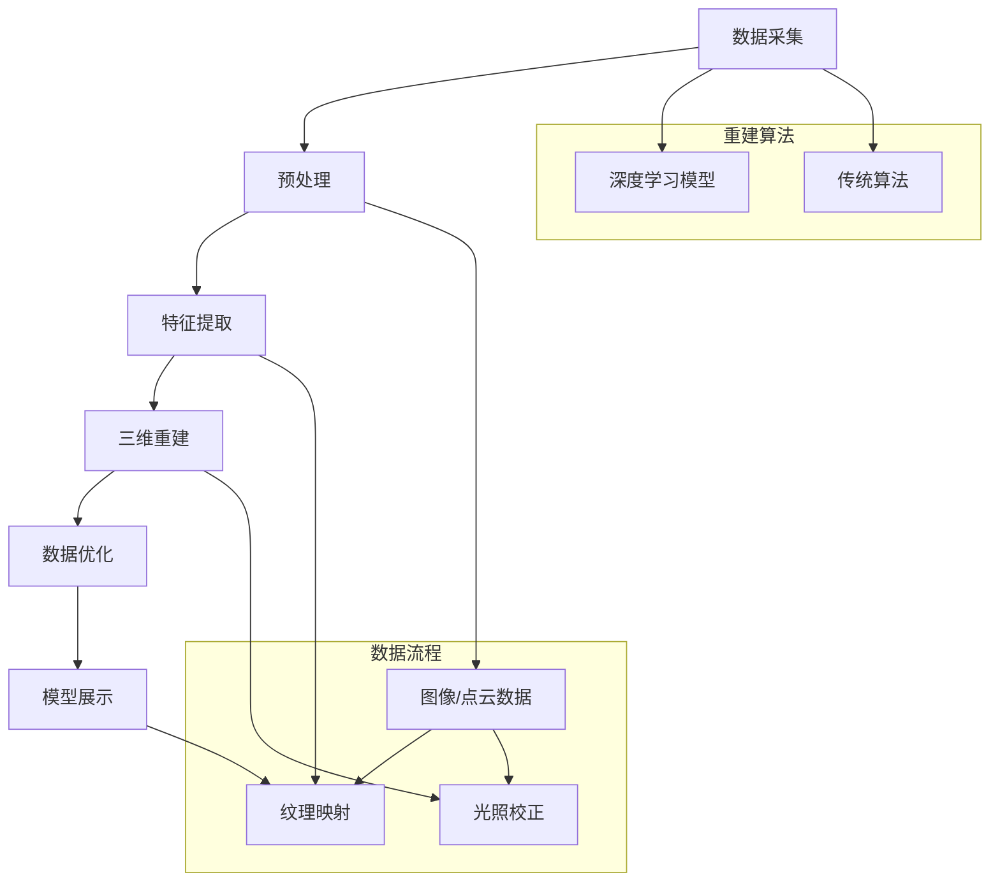

                 

## 计算机视觉在文物数字化重建中的应用

### 关键词：

- 计算机视觉
- 数字化重建
- 文物保存
- 文物修复
- 三维建模

### 摘要：

本文旨在探讨计算机视觉在文物数字化重建中的应用。首先，本文介绍了数字化重建的基本概念和意义，随后深入分析了计算机视觉在文物数字化重建中的核心作用。文章详细阐述了基于计算机视觉的文物数字化重建的基本流程和关键技术，并通过实际案例展示了这一技术在文物保护和修复中的应用。最后，本文对未来的发展趋势和挑战进行了探讨。

## 背景介绍

### 文物数字化重建的基本概念

文物数字化重建是将文物通过数字化手段进行记录、存储、展示和传播的过程。这一过程主要包括数据采集、数据处理和三维建模等步骤。数字化重建不仅能够有效地保存文物的物理形态和文化价值，还能够为文物的修复、展示和研究提供有力支持。

### 文物数字化重建的意义

1. **文物保护**：数字化重建可以避免对文物本体造成物理损伤，通过数字化的方式对文物进行保护和修复。
2. **文化传播**：数字化重建可以将文物以三维模型的形式呈现，便于全球范围内的文化传播和共享。
3. **研究支持**：数字化的文物数据可以用于各种学术研究和分析，为文物保护和考古研究提供重要数据支持。
4. **教育推广**：数字化文物可以用于教育和公共文化宣传，提高公众对文物价值的认识。

### 计算机视觉技术的发展

计算机视觉是一门涉及计算机科学、数学和工程学的交叉学科，旨在使计算机能够像人类一样“看到”和理解周围的世界。近年来，随着深度学习、图像识别和机器学习技术的快速发展，计算机视觉在各个领域的应用越来越广泛。特别是在文物数字化重建领域，计算机视觉技术发挥着至关重要的作用。

## 核心概念与联系

### 计算机视觉在文物数字化重建中的应用架构

#### Mermaid 流程图：



### 说明：

- **数据采集**：通过多种传感器（如相机、激光扫描仪等）获取文物的图像、点云等数据。
- **预处理**：对采集到的数据进行去噪、去畸变、滤波等预处理，以提高后续处理的质量。
- **特征提取**：从预处理后的数据中提取有用的特征，如边缘、角点、纹理等。
- **三维重建**：使用深度学习模型或传统算法进行三维建模，重建文物的三维结构。
- **数据优化**：对重建后的模型进行优化，如光照校正、纹理映射等，以提高模型的准确性和视觉效果。
- **模型展示**：将优化后的三维模型进行展示，可以是静态图像、动画或交互式展示。

## 核心算法原理 & 具体操作步骤

### 数据采集

数据采集是文物数字化重建的第一步，其质量直接影响后续重建的结果。常用的数据采集方法包括：

1. **二维图像采集**：使用高分辨率相机拍摄文物的表面图像。
2. **三维激光扫描**：使用激光扫描仪获取文物的点云数据。
3. **红外成像**：获取文物的热红外图像，用于分析文物的表面材质和结构。

### 预处理

预处理主要包括以下步骤：

1. **图像去噪**：使用滤波器对图像进行去噪处理，如高斯滤波、中值滤波等。
2. **图像去畸变**：对由于相机镜头畸变导致的图像变形进行校正。
3. **点云滤波**：对点云数据使用滤波算法去除噪声和不完整的数据点，如半径滤波、法线滤波等。

### 特征提取

特征提取是从预处理后的图像或点云中提取有用的特征信息。常用的特征提取方法包括：

1. **边缘检测**：如Canny算子、Sobel算子等。
2. **角点检测**：如Shi-Tomasi角点检测算法等。
3. **纹理分析**：使用纹理特征描述符（如GLCM、LBP等）对图像或点云的纹理信息进行描述。

### 三维重建

三维重建是将提取到的特征信息转化为三维结构的过程。常用的三维重建方法包括：

1. **深度学习模型**：如卷积神经网络（CNN）和生成对抗网络（GAN）等，用于从图像或点云中预测文物的三维结构。
2. **传统算法**：如结构光扫描、多视角几何重建等，通过多个视角的图像或点云数据重建三维模型。

### 数据优化

数据优化是对重建后的三维模型进行进一步的优化，以提高模型的准确性和视觉效果。常用的优化方法包括：

1. **光照校正**：对模型进行光照校正，以消除光照对模型外观的影响。
2. **纹理映射**：将采集到的纹理图像映射到三维模型上，以增强模型的真实感。
3. **细节增强**：通过边缘检测、纹理分析等算法增强模型的细节信息。

### 模型展示

模型展示是将优化后的三维模型进行可视化展示，常用的方法包括：

1. **静态展示**：使用3D Max、Maya等软件将三维模型以静态图像的形式展示。
2. **动画展示**：使用3D动画软件将三维模型以动画的形式展示。
3. **交互式展示**：使用VR、AR等技术将三维模型以交互式形式展示，提供更加沉浸式的体验。

## 数学模型和公式 & 详细讲解 & 举例说明

### 三维重建中的数学模型

三维重建涉及多个数学模型，以下简要介绍其中两个关键模型：

1. **相机模型**：相机模型描述了图像与真实场景之间的对应关系。常用的相机模型有针孔模型和鱼眼模型。其中，针孔模型可以用以下公式表示：

   $$\begin{cases}
   u = fx \frac{X}{Z} + cx \\
   v = fy \frac{Y}{Z} + cy
   \end{cases}$$

   其中，\(u, v\) 为图像坐标，\(X, Y, Z\) 为三维空间坐标，\(f, x, y, cx, cy\) 为相机参数。

2. **三维重建算法**：以结构光扫描为例，三维重建算法主要包括两个步骤：

   - **图像配准**：将多个视角的图像进行配准，以确定它们之间的对应关系。常用的配准算法有特征匹配、视差估计等。
   - **三维重建**：通过图像配准结果，重建出物体的三维结构。常用的三维重建算法有基于多视角几何（Multi-View Stereo）的方法和基于深度学习的生成模型。

### 举例说明

假设我们有一个由三张不同视角拍摄的文物图像组成的图像集，我们希望通过图像配准和三维重建算法重建出文物的三维模型。

1. **图像配准**：

   首先，我们对每张图像进行特征提取，提取出角点、边缘等特征点。然后，使用特征匹配算法（如FLANN匹配）将不同视角的特征点进行匹配。接着，通过视差估计算法（如块匹配）估计不同视角之间的视差值。

2. **三维重建**：

   接下来，通过视差值计算每个像素点对应的三维坐标。最后，将所有像素点的三维坐标进行三角化，得到文物的三维模型。

   $$P_{3D} = \frac{Z}{Z + d}P_{2D}$$

   其中，\(P_{2D}\) 为二维图像坐标，\(P_{3D}\) 为三维空间坐标，\(d\) 为视差值。

通过以上步骤，我们可以得到文物的三维模型，并进行后续的优化和展示。

## 项目实战：代码实际案例和详细解释说明

### 开发环境搭建

1. **安装Python环境**：确保Python环境已安装在计算机上，版本建议为3.8或更高。
2. **安装依赖库**：使用pip命令安装所需的依赖库，如OpenCV、Pillow、NumPy、SciPy等。

   ```bash
   pip install opencv-python pillow numpy scipy
   ```

3. **准备数据集**：准备用于实验的文物图像数据集，建议包含至少三张不同视角的图像。

### 源代码详细实现和代码解读

以下是一个简单的基于图像配准和三维重建的代码示例：

```python
import cv2
import numpy as np

def feature_matching(image1, image2):
    # 读取图像
    img1 = cv2.imread(image1)
    img2 = cv2.imread(image2)
    
    # 转换为灰度图像
    gray1 = cv2.cvtColor(img1, cv2.COLOR_BGR2GRAY)
    gray2 = cv2.cvtColor(img2, cv2.COLOR_BGR2GRAY)
    
    # 使用SIFT特征提取器
    sift = cv2.SIFT_create()
    keypoints1, descriptors1 = sift.detectAndCompute(gray1, None)
    keypoints2, descriptors2 = sift.detectAndCompute(gray2, None)
    
    # 使用FLANN匹配算法进行特征点匹配
    FLANN_INDEX_KDTREE = 1
    index_params = dict(algorithm=FLANN_INDEX_KDTREE, trees=5)
    search_params = dict(checks=50)
    flann = cv2.FlannBasedMatcher(index_params, search_params)
    matches = flann.knnMatch(descriptors1, descriptors2, k=2)
    
    # 筛选出良好的匹配点对
    good_matches = []
    for m, n in matches:
        if m.distance < 0.7 * n.distance:
            good_matches.append(m)
    
    # 提取匹配点的坐标
    src_pts = np.float32([keypoints1[m.queryIdx].pt for m in good_matches]).reshape(-1, 1, 2)
    dst_pts = np.float32([keypoints2[m.trainIdx].pt for m in good_matches]).reshape(-1, 1, 2)
    
    # 计算单应矩阵
    H, mask = cv2.findHomography(src_pts, dst_pts, cv2.RANSAC, 5.0)
    matches_mask = mask.ravel().tolist()
    
    return H, matches_mask

def stereo_reconstruction(image1, image2, H):
    # 读取图像
    img1 = cv2.imread(image1)
    img2 = cv2.imread(image2)
    
    # 转换为灰度图像
    gray1 = cv2.cvtColor(img1, cv2.COLOR_BGR2GRAY)
    gray2 = cv2.cvtColor(img2, cv2.COLOR_BGR2GRAY)
    
    # 使用SIFT特征提取器
    sift = cv2.SIFT_create()
    keypoints1, descriptors1 = sift.detectAndCompute(gray1, None)
    keypoints2, descriptors2 = sift.detectAndCompute(gray2, None)
    
    # 使用FLANN匹配算法进行特征点匹配
    FLANN_INDEX_KDTREE = 1
    index_params = dict(algorithm=FLANN_INDEX_KDTREE, trees=5)
    search_params = dict(checks=50)
    flann = cv2.FlannBasedMatcher(index_params, search_params)
    matches = flann.knnMatch(descriptors1, descriptors2, k=2)
    
    # 筛选出良好的匹配点对
    good_matches = []
    for m, n in matches:
        if m.distance < 0.7 * n.distance:
            good_matches.append(m)
    
    # 提取匹配点的坐标
    src_pts = np.float32([keypoints1[m.queryIdx].pt for m in good_matches]).reshape(-1, 1, 2)
    dst_pts = np.float32([keypoints2[m.trainIdx].pt for m in good_matches]).reshape(-1, 1, 2)
    
    # 三角化匹配点对，计算三维坐标
    points_3D = cv2.triangulatePoints(H, np.eye(3), src_pts, dst_pts)
    
    # 透视变换，将三维坐标转换为二维坐标
    points_2D = cv2.divide(points_3D, points_3D[2], scale=1)
    
    return points_2D

# 测试
H, matches_mask = feature_matching('image1.jpg', 'image2.jpg')
points_2D = stereo_reconstruction('image1.jpg', 'image2.jpg', H)

# 绘制匹配点对
img = cv2.drawMatches(img1, keypoints1, img2, keypoints2, good_matches, None, flags=cv2.DrawMatchesFlags_NOT_DRAW_SINGLE_POINTS)

cv2.imshow('Matches', img)
cv2.waitKey(0)
cv2.destroyAllWindows()
```

### 代码解读与分析

1. **特征匹配**：

   - 使用SIFT算法提取图像特征点。
   - 使用FLANN匹配算法进行特征点匹配。
   - 筛选出良好的匹配点对，计算单应矩阵。

2. **三维重建**：

   - 使用SIFT算法提取图像特征点。
   - 使用FLANN匹配算法进行特征点匹配。
   - 三角化匹配点对，计算三维坐标。
   - 透视变换，将三维坐标转换为二维坐标。

通过以上步骤，我们可以得到文物的二维图像坐标，并绘制匹配点对。

## 实际应用场景

### 文物保护

计算机视觉在文物保护中的应用主要体现在以下几个方面：

1. **实时监测**：利用计算机视觉技术对文物进行实时监测，可以及时发现文物的损伤和病变，从而采取相应的保护措施。
2. **温度和湿度监测**：利用计算机视觉技术对文物保存环境的温度和湿度进行监测，以确保文物处于最佳保存状态。
3. **数字化档案**：通过数字化重建技术，建立文物的数字化档案，便于文物的管理和保护。

### 文物修复

计算机视觉在文物修复中的应用主要体现在以下几个方面：

1. **损伤检测**：利用计算机视觉技术对文物进行扫描和图像分析，可以准确检测文物的损伤情况，为修复提供重要依据。
2. **虚拟修复**：通过数字化重建技术，对文物进行虚拟修复，可以模拟修复效果，为实际修复提供指导。
3. **精准修复**：利用计算机视觉技术对修复后的文物进行精确测量和三维建模，以确保修复质量。

### 文化传播

计算机视觉在文化传播中的应用主要体现在以下几个方面：

1. **数字化展示**：通过数字化重建技术，将文物以三维模型的形式呈现，便于全球范围内的文化传播和共享。
2. **虚拟现实（VR）和增强现实（AR）**：利用VR和AR技术，将文物以更加生动、直观的形式展示给观众，提高观众的文化体验。
3. **在线教育**：通过数字化重建技术，将文物以在线教育资源的形式提供给学生，便于学生进行自主学习。

## 工具和资源推荐

### 学习资源推荐

1. **书籍**：
   - 《计算机视觉：算法与应用》（Paul R. Kinnally）
   - 《数字图像处理》（Gary B. Thompson）
   - 《机器学习》（Tom M. Mitchell）

2. **论文**：
   - 《Efficient Convolutional Neural Networks for Object Detection》（Shaoqing Ren等）
   - 《Deep Learning for 3D Object Detection from Single View Images》（Kaiming He等）

3. **博客**：
   - 《机器学习博客》（机器之心）
   - 《深度学习博客》（Google AI）

4. **网站**：
   - 《OpenCV官网》（opencv.org）
   - 《Python官方文档》（python.org）

### 开发工具框架推荐

1. **深度学习框架**：
   - TensorFlow
   - PyTorch

2. **计算机视觉库**：
   - OpenCV
   - PIL（Python Imaging Library）

3. **三维建模工具**：
   - Blender
   - Autodesk 3ds Max

### 相关论文著作推荐

1. **论文**：
   - “Deep Learning for 3D Object Detection from a Single View”（Kaiming He等，2017）
   - “Efficient Object Detection with Deep Learning”（Shaoqing Ren等，2015）

2. **著作**：
   - 《深度学习》（Ian Goodfellow等）
   - 《计算机视觉：算法与应用》（Paul R. Kinnally）

## 总结：未来发展趋势与挑战

### 发展趋势

1. **深度学习技术的应用**：随着深度学习技术的不断发展，计算机视觉在文物数字化重建中的应用将更加广泛和深入。
2. **多模态数据的融合**：结合多种数据源（如激光扫描、红外成像等），可以提高数字化重建的精度和效果。
3. **自动化与智能化**：通过引入自动化和智能化技术，可以降低数字化重建的复杂度，提高效率。
4. **虚拟现实与增强现实**：利用VR和AR技术，可以提供更加沉浸式的文物展示和体验。

### 挑战

1. **数据质量和完整性**：保证数据质量和完整性是数字化重建的关键，但往往受到环境、设备和操作等因素的影响。
2. **算法复杂度和效率**：随着数字化重建技术的不断进步，对算法的复杂度和效率提出了更高的要求。
3. **法律法规与伦理问题**：数字化重建文物涉及到法律法规和伦理问题，如数据版权、隐私保护等，需要得到充分关注和解决。
4. **文物保护与数字化重建的平衡**：在保证文物保护的前提下，实现数字化重建的目标，是一个需要平衡的问题。

## 附录：常见问题与解答

### 问题1：如何保证数字化重建的数据质量和完整性？

**解答**：为了保证数字化重建的数据质量和完整性，可以采取以下措施：

1. **选择高质量的设备**：使用高分辨率相机、高精度的激光扫描仪等高质量的设备，以确保数据采集的准确性。
2. **多角度采集**：从多个角度对文物进行采集，以减少环境因素对数据质量的影响。
3. **数据预处理**：对采集到的数据进行预处理，如去噪、去畸变、滤波等，以提高数据的质量。
4. **数据备份与校验**：对数据进行备份和校验，以确保数据的完整性和可靠性。

### 问题2：如何提高数字化重建的算法复杂度和效率？

**解答**：提高数字化重建的算法复杂度和效率可以从以下几个方面入手：

1. **算法优化**：对现有算法进行优化，如采用更高效的数学公式、减少不必要的计算等。
2. **并行计算**：利用并行计算技术，将算法中的计算任务分布在多个处理器上，以提高计算速度。
3. **模型压缩**：通过模型压缩技术，减少模型的参数量，以提高计算效率。
4. **硬件加速**：利用GPU等硬件加速器，加快算法的执行速度。

### 问题3：数字化重建是否会对文物造成损害？

**解答**：数字化重建过程中，如果操作不当，确实有可能对文物造成损害。为了降低风险，可以采取以下措施：

1. **非接触式采集**：尽量采用非接触式采集方式，如激光扫描、红外成像等，以减少对文物的物理损伤。
2. **严格操作规范**：制定严格的操作规范，如对设备的清洁、操作的标准化等，以减少人为因素造成的损害。
3. **模拟测试**：在正式采集前，进行模拟测试，以评估数字化重建过程对文物的潜在影响。

## 扩展阅读 & 参考资料

1. **论文**：
   - “Deep Learning for 3D Object Detection from a Single View”（Kaiming He等，2017）
   - “Efficient Convolutional Neural Networks for Object Detection”（Shaoqing Ren等，2015）

2. **书籍**：
   - 《计算机视觉：算法与应用》（Paul R. Kinnally）
   - 《数字图像处理》（Gary B. Thompson）

3. **网站**：
   - 《OpenCV官网》（opencv.org）
   - 《Python官方文档》（python.org）

4. **博客**：
   - 《机器学习博客》（机器之心）
   - 《深度学习博客》（Google AI）

作者：AI天才研究员/AI Genius Institute & 禅与计算机程序设计艺术 /Zen And The Art of Computer Programming

