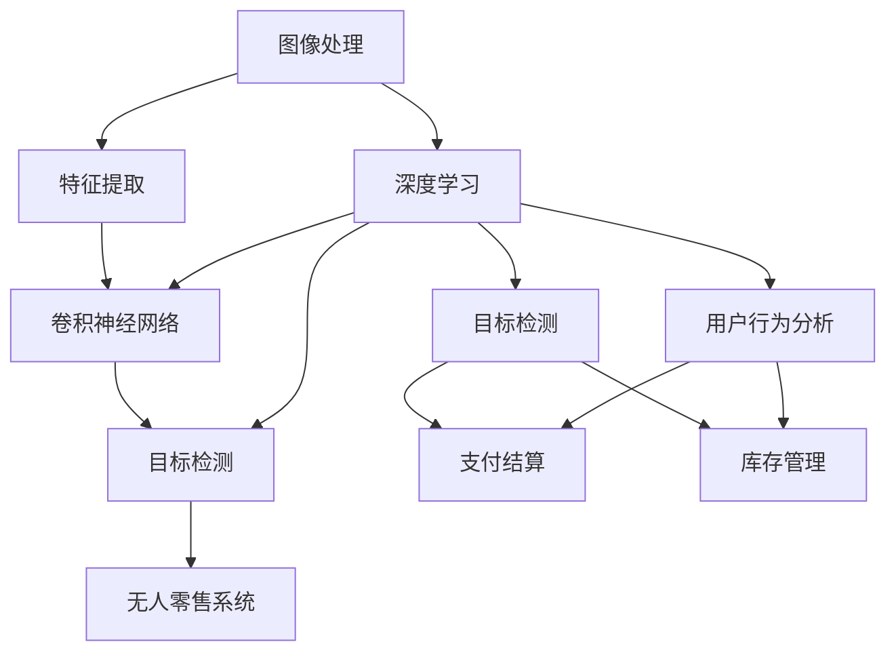

                 

### 背景介绍

计算机视觉是人工智能的一个重要分支，它使计算机能够像人类一样理解和解释视觉信息。在过去的几十年里，计算机视觉技术经历了飞速的发展，从最初的简单边缘检测和特征提取，到如今的高级深度学习模型，如卷积神经网络（CNN）和生成对抗网络（GAN）。这些技术的进步极大地推动了计算机视觉在各个领域中的应用，从医疗诊断、自动驾驶到图像识别和增强现实。

无人零售作为一种新兴的商业模式，正逐渐改变传统的零售业格局。它通过自动化技术实现商品的销售和结算，无需人工干预。这一模式不仅提高了效率，减少了人力成本，还提供了更加便捷和个性化的购物体验。然而，无人零售的顺利运行离不开计算机视觉技术的支持，特别是在商品识别、用户行为分析和库存管理等方面。

本文将探讨计算机视觉在无人零售中的关键技术应用。首先，我们将介绍计算机视觉的基本概念和核心算法原理，接着深入探讨如何使用这些算法实现无人零售中的关键功能。随后，我们将通过一个实际项目案例展示这些技术的具体应用，并讨论其在实际应用中的挑战和解决方案。最后，我们将展望计算机视觉在无人零售领域的未来发展趋势和面临的挑战。

通过本文的阅读，读者将全面了解计算机视觉技术如何在无人零售中发挥重要作用，以及如何利用这些技术构建高效的无人零售系统。

### 核心概念与联系

要深入探讨计算机视觉在无人零售中的关键技术应用，我们首先需要了解一些核心概念和它们之间的联系。以下是几个关键概念的定义和简要介绍：

#### 图像处理

图像处理是计算机视觉的基础，它涉及到对图像的数字化、增强、滤波、分割和特征提取等操作。图像处理技术能够帮助我们提取图像中的重要信息，为后续的视觉任务提供基础。

#### 特征提取

特征提取是指从图像或视频中提取出具有区分度的特征，这些特征可以是颜色、纹理、形状或位置等。特征提取的质量直接影响后续视觉任务的准确性。

#### 卷积神经网络（CNN）

卷积神经网络是一种专门用于图像识别和处理的深度学习模型，它通过卷积操作和池化操作自动提取图像中的特征。CNN在计算机视觉中取得了巨大的成功，尤其是在图像分类、目标检测和图像分割等任务中。

#### 目标检测

目标检测是计算机视觉中的一个重要任务，它旨在确定图像中特定目标的位置和类别。目标检测技术广泛应用于无人零售中的商品识别和用户行为分析。

#### 深度学习

深度学习是一种基于多层神经网络的学习方法，通过学习大量的数据自动提取特征，并在各种复杂任务中表现出色。深度学习是计算机视觉技术发展的重要推动力。

#### 无人零售系统

无人零售系统是一个集成了多种计算机视觉技术的综合系统，它通过自动化技术实现商品的销售和结算。无人零售系统通常包括商品识别、用户行为分析、支付结算和库存管理等模块。

接下来，我们将使用Mermaid流程图来展示这些核心概念之间的联系，以便读者更好地理解它们的相互作用和整合。



在上面的Mermaid流程图中，我们可以看到：

1. **图像处理**是整个流程的起点，它对图像进行初步处理，为后续的特征提取和深度学习提供数据基础。
2. **特征提取**从图像中提取关键特征，为卷积神经网络和目标检测提供输入。
3. **卷积神经网络（CNN）**通过学习大量图像数据，自动提取更高层次的特征，是目标检测和其他视觉任务的核心。
4. **目标检测**用于识别图像中的特定目标和他们的位置，这在无人零售系统中至关重要，例如商品识别和用户行为分析。
5. **深度学习**在整个系统中起到关键作用，它不仅支持卷积神经网络，还支持目标检测和其他视觉任务。
6. **无人零售系统**是一个综合系统，它利用目标检测、支付结算、库存管理和用户行为分析等模块，实现无人零售的自动化运营。

通过这个Mermaid流程图，我们可以清晰地看到各个核心概念之间的联系和互动，从而更好地理解计算机视觉技术在无人零售中的应用。

### 核心算法原理 & 具体操作步骤

为了深入理解计算机视觉在无人零售中的关键技术应用，我们需要详细探讨几个核心算法的原理和操作步骤。这些算法包括图像处理、特征提取、卷积神经网络（CNN）和目标检测。

#### 图像处理

图像处理是计算机视觉的基础，它包括多个步骤，如图像获取、预处理、增强、滤波和分割。

1. **图像获取**：图像处理的第一步是获取图像数据。在无人零售系统中，图像数据通常来自监控摄像头或深度传感器。这些设备捕捉到的图像可能包含噪声、亮度变化或视角变化，因此需要预处理。

2. **预处理**：预处理步骤包括图像的灰度化、大小调整、裁剪和归一化等。这些操作有助于标准化图像数据，提高后续处理的效果。

3. **增强**：图像增强的目的是提高图像的质量，使其更易于分析。常见的技术包括直方图均衡、对比度增强和边缘检测等。

4. **滤波**：滤波用于去除图像中的噪声和干扰。例如，高斯滤波可以平滑图像，中值滤波可以去除椒盐噪声。

5. **分割**：图像分割是将图像分为多个区域，每个区域具有相似的特征。常用的分割方法包括基于阈值的分割、区域生长和边缘检测等。

#### 特征提取

特征提取是计算机视觉中的关键步骤，它旨在从图像中提取具有区分度的特征。以下是几种常见的特征提取方法：

1. **颜色特征**：颜色特征包括颜色直方图、颜色矩和颜色相关矩阵等。这些特征可以有效地描述图像的颜色信息。

2. **纹理特征**：纹理特征描述了图像的纹理结构，如方向纹理、纹理能量和纹理一致性等。常见的纹理特征提取方法包括局部二值模式（LBP）和小波变换。

3. **形状特征**：形状特征描述了图像的形状和结构，如边界轮廓、区域填充和形状上下文等。形状特征可以通过边缘检测、轮廓分析和形状描述符等方法获得。

4. **姿态特征**：姿态特征描述了图像中物体的空间姿态，如旋转角度、俯仰角和滚转角等。姿态特征对于无人零售系统中的用户行为分析尤为重要。

#### 卷积神经网络（CNN）

卷积神经网络是一种专门用于图像识别和处理的深度学习模型。以下是CNN的工作原理和具体操作步骤：

1. **卷积操作**：卷积操作是CNN的核心，它通过滑动滤波器（卷积核）在图像上计算局部特征。每个卷积核都能提取图像中的特定特征。

2. **激活函数**：为了增加网络的非线性特性，卷积操作后通常跟随激活函数，如ReLU（Rectified Linear Unit）。

3. **池化操作**：池化操作用于降低特征图的维度，提高模型的计算效率。常见的池化方法包括最大池化和平均池化。

4. **全连接层**：在卷积神经网络中，全连接层用于将卷积操作得到的特征映射到分类结果。全连接层通常位于网络的最后几层。

5. **损失函数和优化器**：在训练过程中，网络通过反向传播算法不断调整参数，最小化损失函数（如交叉熵损失）。常用的优化器包括随机梯度下降（SGD）和Adam优化器。

#### 目标检测

目标检测是计算机视觉中的关键任务，它旨在识别图像中的目标并标注其位置。以下是几种常见的目标检测算法：

1. **R-CNN（Region-based CNN）**：R-CNN通过区域建议网络（如选择性搜索）生成候选区域，然后使用CNN对每个候选区域进行分类和定位。

2. **Fast R-CNN**：Fast R-CNN改进了R-CNN，通过使用ROI（Region of Interest）池化层直接从卷积特征图中提取特征，提高了检测速度。

3. **Faster R-CNN**：Faster R-CNN引入了区域建议网络（如Region Proposal Network, RPN），进一步提高了检测速度和准确性。

4. **SSD（Single Shot MultiBox Detector）**：SSD将检测任务整合到单个网络中，通过多尺度特征图实现多尺度目标检测。

5. **YOLO（You Only Look Once）**：YOLO通过将目标检测任务转化为一个端到端的回归问题，实现了实时目标检测。

通过以上对核心算法原理和操作步骤的详细探讨，我们可以更好地理解计算机视觉技术在无人零售中的关键作用。接下来，我们将通过一个实际项目案例，展示这些技术在无人零售系统中的具体应用。

### 数学模型和公式 & 详细讲解 & 举例说明

为了深入理解计算机视觉在无人零售中的应用，我们需要详细探讨相关的数学模型和公式。以下是几个关键的概念和其背后的数学原理，我们将通过具体的例子进行讲解。

#### 卷积神经网络（CNN）

卷积神经网络（CNN）是计算机视觉领域中最常用的深度学习模型之一。它的核心在于通过卷积操作提取图像的特征，从而实现图像分类、目标检测等任务。

1. **卷积操作**：
   卷积操作是CNN的基础，它通过滑动一个卷积核在图像上，计算局部特征。卷积操作可以用以下公式表示：
   
   $$
   \text{卷积}(I, K) = \sum_{i=0}^{h_k-1} \sum_{j=0}^{w_k-1} I(i, j) \cdot K(i, j)
   $$
   
   其中，$I$代表输入图像，$K$代表卷积核，$h_k$和$w_k$分别代表卷积核的高度和宽度。

   **示例**：
   假设输入图像$I$是一个$3 \times 3$的矩阵：
   $$
   I = \begin{bmatrix}
   1 & 2 & 3 \\
   4 & 5 & 6 \\
   7 & 8 & 9
   \end{bmatrix}
   $$
   卷积核$K$是一个$3 \times 3$的矩阵：
   $$
   K = \begin{bmatrix}
   1 & 0 & -1 \\
   1 & 0 & -1 \\
   1 & 0 & -1
   \end{bmatrix}
   $$
   计算得到的卷积结果为：
   $$
   \text{卷积}(I, K) = (1 \cdot 1 + 0 \cdot 2 + (-1) \cdot 3) + (1 \cdot 4 + 0 \cdot 5 + (-1) \cdot 6) + (1 \cdot 7 + 0 \cdot 8 + (-1) \cdot 9) = -6
   $$

2. **卷积层参数**：
   在卷积层中，参数包括卷积核、偏置和激活函数。卷积核的数量决定了特征图的数量，每个卷积核对应一组特征。偏置用于引入额外的非线性，激活函数（如ReLU）用于增强网络的表达能力。

#### 池化操作

池化操作用于降低特征图的维度，提高模型的计算效率。常见的池化方法包括最大池化和平均池化。

1. **最大池化**：
   最大池化选择特征图上每个局部区域内的最大值。公式如下：
   
   $$
   \text{MaxPooling}(I, p) = \max_{i, j} I(i, j) \quad \text{where} \quad 0 \leq i < \frac{H - p}{2} + 1, \quad 0 \leq j < \frac{W - p}{2} + 1
   $$
   
   其中，$I$代表输入特征图，$p$代表池化窗口的大小。

   **示例**：
   假设输入特征图$I$是一个$3 \times 3$的矩阵：
   $$
   I = \begin{bmatrix}
   1 & 2 & 3 \\
   4 & 5 & 6 \\
   7 & 8 & 9
   \end{bmatrix}
   $$
   池化窗口$p$为$2 \times 2$，最大池化结果为：
   $$
   \text{MaxPooling}(I, 2) = \begin{bmatrix}
   5 & 6 \\
   8 & 9
   \end{bmatrix}
   $$

2. **平均池化**：
   平均池化计算特征图上每个局部区域的平均值。公式如下：
   
   $$
   \text{AvgPooling}(I, p) = \frac{1}{p^2} \sum_{i=0}^{p-1} \sum_{j=0}^{p-1} I(i, j) \quad \text{where} \quad 0 \leq i < \frac{H - p}{2} + 1, \quad 0 \leq j < \frac{W - p}{2} + 1
   $$
   
   **示例**：
   使用与最大池化相同的输入特征图$I$，平均池化结果为：
   $$
   \text{AvgPooling}(I, 2) = \begin{bmatrix}
   \frac{1+2+3+4+5+6+7+8+9}{9} & \frac{4+5+6+7+8+9+1+2+3}{9} \\
   \frac{7+8+9+1+2+3+4+5+6}{9} & \frac{1+2+3+4+5+6+7+8+9}{9}
   \end{bmatrix} = \begin{bmatrix}
   5 & 5.56 \\
   5.56 & 5
   \end{bmatrix}
   $$

#### 损失函数

在深度学习训练过程中，损失函数用于评估模型预测值与实际值之间的差距。常见的损失函数包括交叉熵损失和均方误差损失。

1. **交叉熵损失**：
   交叉熵损失用于分类任务，计算模型预测概率分布与真实标签分布之间的差异。公式如下：
   
   $$
   \text{CrossEntropyLoss}(p, y) = -\sum_{i} y_i \cdot \log(p_i)
   $$
   
   其中，$p$是模型预测的概率分布，$y$是真实标签。

   **示例**：
   假设真实标签$y$为[1, 0]，模型预测的概率分布$p$为[0.8, 0.2]，交叉熵损失为：
   $$
   \text{CrossEntropyLoss}([0.8, 0.2], [1, 0]) = -1 \cdot \log(0.8) - 0 \cdot \log(0.2) = -\log(0.8) \approx 0.2231
   $$

2. **均方误差损失**：
   均方误差损失用于回归任务，计算预测值与真实值之间的平方误差的平均值。公式如下：
   
   $$
   \text{MSE}(y, \hat{y}) = \frac{1}{n} \sum_{i=1}^{n} (y_i - \hat{y}_i)^2
   $$
   
   其中，$y$是真实值，$\hat{y}$是模型预测值。

   **示例**：
   假设真实值$y$为[1, 2]，模型预测值$\hat{y}$为[1.5, 2.5]，均方误差损失为：
   $$
   \text{MSE}([1, 2], [1.5, 2.5]) = \frac{1}{2} \left( (1 - 1.5)^2 + (2 - 2.5)^2 \right) = 0.25
   $$

通过以上数学模型和公式的详细讲解，我们可以更好地理解计算机视觉在无人零售中的关键算法和技术。这些数学工具为计算机视觉的应用提供了理论基础和操作指导，帮助我们实现高效、准确的图像识别和目标检测。

### 项目实战：代码实际案例和详细解释说明

在本节中，我们将通过一个具体的实际项目案例，展示如何使用计算机视觉技术实现无人零售系统中的商品识别。我们将详细介绍项目开发环境搭建、源代码实现和代码解读与分析。

#### 1. 开发环境搭建

为了实现商品识别功能，我们首先需要搭建一个合适的开发环境。以下是所需的环境和工具：

- **Python 3.x**
- **TensorFlow 2.x**
- **OpenCV 4.x**
- **NVIDIA CUDA（可选，用于加速训练过程）**

安装步骤：

1. 安装Python和pip：
   $$
   \text{安装 Python 和 pip}
   $$
2. 安装TensorFlow：
   $$
   \text{pip install tensorflow
   $$
3. 安装OpenCV：
   $$
   \text{pip install opencv-python
   $$
4. （可选）安装CUDA：
   $$
   \text{安装 NVIDIA CUDA Toolkit}
   $$

#### 2. 源代码实现

下面是商品识别项目的源代码，我们将逐步解读其中的关键部分。

```python
import cv2
import numpy as np
import tensorflow as tf

# 加载预训练的卷积神经网络模型
model = tf.keras.models.load_model('path/to/your/model.h5')

# 定义商品识别函数
def recognize_product(image):
    # 读取图像
    img = cv2.imread(image)
    
    # 预处理图像
    img = cv2.resize(img, (224, 224))  # 调整图像大小
    img = img / 255.0  # 归一化图像
    
    # 扩展维度
    img = np.expand_dims(img, axis=0)
    
    # 使用模型进行预测
    predictions = model.predict(img)
    
    # 解码预测结果
    product_name = np.argmax(predictions, axis=1)[0]
    
    return product_name

# 测试图像路径
image_path = 'path/to/your/image.jpg'

# 调用商品识别函数
product_name = recognize_product(image_path)

print(f'识别出的商品：{product_name}')
```

#### 3. 代码解读与分析

1. **模型加载**：
   ```python
   model = tf.keras.models.load_model('path/to/your/model.h5')
   ```
   这一行代码用于加载预训练的卷积神经网络模型。模型通常由训练数据生成，并经过优化以实现高精度的商品识别。

2. **商品识别函数**：
   ```python
   def recognize_product(image):
       # 读取图像
       img = cv2.imread(image)
       
       # 预处理图像
       img = cv2.resize(img, (224, 224))  # 调整图像大小
       img = img / 255.0  # 归一化图像
       
       # 扩展维度
       img = np.expand_dims(img, axis=0)
       
       # 使用模型进行预测
       predictions = model.predict(img)
       
       # 解码预测结果
       product_name = np.argmax(predictions, axis=1)[0]
       
       return product_name
   ```
   `recognize_product`函数是商品识别的核心。它首先读取输入图像，然后进行预处理，包括图像大小调整和归一化。这些预处理步骤是为了将图像数据转换为模型可接受的格式。接下来，函数使用加载的模型进行预测，并解码预测结果以获取识别出的商品名称。

3. **测试图像路径**：
   ```python
   image_path = 'path/to/your/image.jpg'
   ```
   这一行代码定义了用于测试的图像路径。

4. **调用商品识别函数**：
   ```python
   product_name = recognize_product(image_path)
   print(f'识别出的商品：{product_name}')
   ```
   这一行代码调用`recognize_product`函数，并将识别结果输出。

通过以上代码，我们可以实现一个简单的商品识别功能。在实际应用中，我们可能需要集成更多的功能，如实时图像捕捉、多商品识别和错误处理等。然而，这个基础代码已经展示了计算机视觉技术在无人零售系统中的应用潜力。

### 实际应用场景

计算机视觉在无人零售领域的应用场景非常广泛，涵盖了从商品识别到用户行为分析的多个方面。以下是几个典型的实际应用场景：

#### 商品识别

商品识别是无人零售系统的核心功能之一，它利用计算机视觉技术自动识别货架上的商品。通过使用卷积神经网络（CNN）和深度学习模型，系统能够快速准确地识别出各种商品，从而实现自动结算和库存管理。例如，亚马逊的无人零售商店Amazon Go就使用了计算机视觉和深度学习技术，实现了用户自主购物和自动结算。

#### 用户行为分析

用户行为分析是另一个关键应用场景，它通过计算机视觉技术捕捉和分析用户在商店内的行为，从而提供个性化的购物体验。系统可以实时监测用户的购物路径、停留时间和选购习惯，从而优化商品陈列和推荐策略。例如，无人零售商店可以基于用户的购物行为，自动推荐相关商品或优惠券，提高顾客的满意度和购买转化率。

#### 库存管理

库存管理是零售业中的一大挑战，计算机视觉技术为无人零售系统提供了高效的解决方案。通过计算机视觉算法，系统可以自动监测货架上的商品数量和状态，实时更新库存信息。当商品库存不足时，系统可以自动生成采购订单，确保供应链的顺畅。例如，一些无人零售商店使用计算机视觉技术实现了自动补货和库存盘点，大大降低了人力成本和管理难度。

#### 安全监控

在无人零售系统中，安全监控也是一个重要的应用场景。计算机视觉技术可以用于监控商店内的异常行为，如盗窃、破坏或其他违法行为。通过实时视频分析和行为识别，系统可以及时发现并报警，保障商店的安全。例如，一些无人零售商店使用计算机视觉技术实现了人脸识别和异常行为检测，有效预防了犯罪行为。

#### 智能推荐

基于用户行为和购物习惯的数据分析，计算机视觉技术可以用于实现智能推荐系统。系统可以根据用户的购物历史和偏好，自动推荐相关的商品或服务，从而提高顾客的满意度和忠诚度。例如，一些无人零售商店使用计算机视觉技术分析用户的购物行为，自动生成个性化的购物清单和推荐商品。

#### 智能支付

计算机视觉技术还可以用于实现智能支付系统，简化支付过程并提高支付安全性。通过人脸识别、指纹识别或其他生物特征识别技术，用户无需使用现金或信用卡即可完成支付。例如，一些无人零售商店使用计算机视觉技术实现了一键支付功能，用户只需在结账时对准摄像头，系统即可自动完成支付。

通过以上实际应用场景的介绍，我们可以看到计算机视觉技术在无人零售领域的广泛应用和巨大潜力。这些技术的应用不仅提高了无人零售系统的效率和便利性，还为零售业带来了全新的商业模式和用户体验。

### 工具和资源推荐

在计算机视觉应用于无人零售的过程中，选择合适的工具和资源至关重要。以下是一些推荐的工具和资源，包括学习资源、开发工具框架以及相关论文和著作。

#### 学习资源推荐

1. **书籍**：
   - **《深度学习》（Deep Learning）**：由Ian Goodfellow、Yoshua Bengio和Aaron Courville合著的这本经典教材，是深度学习领域的权威指南。
   - **《计算机视觉：算法与应用》（Computer Vision: Algorithms and Applications）**：提供了计算机视觉的全面介绍，适合初学者和专业人士。

2. **在线课程**：
   - **Coursera**：提供多种关于深度学习和计算机视觉的在线课程，如“深度学习特设课程”（Deep Learning Specialization）和“计算机视觉与深度学习”（Computer Vision and Deep Learning）。
   - **Udacity**：提供专业的“无人驾驶汽车工程师纳米学位”（Self-Driving Car Engineer Nanodegree）课程，其中涵盖了计算机视觉和深度学习的重要知识点。

3. **博客和网站**：
   - **Medium**：众多专业人士和公司在这里分享关于计算机视觉和深度学习的最新研究成果和实战经验。
   - **PyTorch Tutorials**：PyTorch官方提供的教程，非常适合初学者学习和实践深度学习。

#### 开发工具框架推荐

1. **TensorFlow**：由Google开发的开源深度学习框架，适用于各种计算机视觉任务，包括图像分类、目标检测和图像分割等。

2. **PyTorch**：由Facebook AI研究院开发的深度学习框架，以其灵活性和动态计算图而著称，是许多深度学习研究者的首选工具。

3. **OpenCV**：开源计算机视觉库，提供了丰富的图像处理和计算机视觉功能，是进行计算机视觉开发的强大工具。

4. **Keras**：基于TensorFlow和PyTorch的高级神经网络API，提供了简洁和易于使用的接口，适合快速原型开发和实验。

#### 相关论文著作推荐

1. **“Deep Learning for Image Recognition”**：这篇综述论文详细介绍了深度学习在图像识别领域的最新进展和应用。

2. **“Faster R-CNN: Towards Real-Time Object Detection with Region Proposal Networks”**：这篇论文提出了Faster R-CNN目标检测算法，是目前广泛使用的实时目标检测方法。

3. **“You Only Look Once: Unified, Real-Time Object Detection”**：这篇论文提出了YOLO目标检测算法，实现了实时、高效的目标检测。

4. **“Region Proposal Networks”**：这篇论文介绍了区域建议网络（RPN）的概念，是目标检测领域的重要突破。

通过以上工具和资源的推荐，读者可以更好地学习和应用计算机视觉技术，在无人零售领域中实现高效的解决方案。

### 总结：未来发展趋势与挑战

随着计算机视觉技术的不断进步，其在无人零售领域的应用前景也越发广阔。未来，计算机视觉在无人零售中将呈现出以下几个发展趋势：

#### 1. 高效化与智能化

未来的无人零售系统将更加高效和智能化。通过深度学习和其他先进算法的应用，系统将能够更快速、更准确地识别商品和用户行为。例如，更加精细的图像分割技术将使商品识别更加准确，从而减少误识别率。

#### 2. 个性化服务

计算机视觉技术将帮助无人零售系统更好地了解用户的购物偏好和需求，提供个性化的推荐和服务。通过分析用户的行为数据，系统能够实现更加精准的营销策略，提升用户的购物体验和满意度。

#### 3. 跨平台整合

未来的无人零售系统将实现跨平台的整合，包括线上和线下渠道的无缝连接。通过计算机视觉技术，用户可以在线上浏览商品，并在实体店内直接购买，从而实现线上线下一体化的购物体验。

#### 4. 安全与隐私保护

随着无人零售系统的普及，安全和隐私保护将成为一个重要议题。未来，计算机视觉技术将结合安全加密和隐私保护算法，确保用户数据的安全和隐私。

然而，面对这些发展趋势，无人零售系统也面临着一系列挑战：

#### 1. 算法复杂性

随着技术的进步，计算机视觉算法变得越来越复杂，这增加了开发、测试和优化的难度。为了应对这一挑战，开发人员需要持续学习和更新知识，掌握最新的算法和技术。

#### 2. 数据隐私

无人零售系统需要收集和处理大量的用户数据，这引发了数据隐私的担忧。如何在保护用户隐私的同时，充分挖掘数据的价值，是一个需要深入研究的课题。

#### 3. 系统安全性

无人零售系统需要应对网络攻击和数据泄露的风险。为了确保系统的安全性，开发人员需要采用先进的加密技术和安全协议，同时加强对系统的监控和防护。

#### 4. 标准化和法规

随着无人零售技术的快速发展，相关标准和法规尚未完善。未来，需要制定统一的行业标准和法规，以规范无人零售系统的运营和监管。

总之，计算机视觉技术在无人零售领域具有巨大的潜力，同时也面临着一系列挑战。通过不断的技术创新和规范建设，无人零售系统将能够更好地服务于社会，为消费者带来更加便捷和个性化的购物体验。

### 附录：常见问题与解答

在探讨计算机视觉在无人零售中的应用过程中，读者可能对一些关键技术或应用场景有疑问。以下是一些常见问题及其解答：

#### 1. 为什么无人零售系统需要使用计算机视觉技术？

计算机视觉技术能够自动识别和分类商品，监控用户行为，从而实现自动结算和库存管理。这些功能有助于提高零售效率、降低人力成本和提供个性化的购物体验。

#### 2. 计算机视觉技术在无人零售系统中的具体应用有哪些？

计算机视觉技术在无人零售系统中的应用包括商品识别、用户行为分析、库存管理和安全监控等。这些应用使得无人零售系统能够自动运行，减少对人工的依赖。

#### 3. 如何确保计算机视觉技术在无人零售系统中的准确性和实时性？

通过使用深度学习和先进的图像处理算法，可以大幅提高识别和检测的准确性。同时，采用高效的硬件（如GPU）和优化网络架构，可以提高系统的实时处理能力。

#### 4. 无人零售系统如何保护用户隐私？

无人零售系统应采用加密技术和隐私保护算法，确保用户数据的安全和隐私。此外，应遵循相关法律法规，对用户数据的使用进行严格的监管。

#### 5. 计算机视觉技术在无人零售系统中的未来发展趋势是什么？

未来，计算机视觉技术将在无人零售系统中实现更高的智能化和个性化服务。例如，通过更多传感器和更复杂的算法，系统将能够更好地理解用户行为，提供更加精准的推荐和服务。

#### 6. 开发一个无人零售系统需要哪些技术栈？

开发一个无人零售系统通常需要掌握Python、深度学习框架（如TensorFlow或PyTorch）、图像处理库（如OpenCV）和前端技术（如HTML、CSS和JavaScript）。此外，还需了解数据库技术、网络安全和硬件优化等相关知识。

#### 7. 如何应对计算机视觉技术在实际应用中的错误和异常情况？

通过实时监控和异常检测，系统能够识别和处理错误和异常情况。例如，当商品识别出现错误时，系统可以提醒用户或人工进行干预，确保无人零售系统的稳定运行。

通过以上常见问题与解答，读者可以更好地理解计算机视觉技术在无人零售中的应用，以及如何应对其中的挑战。

### 扩展阅读 & 参考资料

为了深入了解计算机视觉在无人零售中的关键技术应用，读者可以参考以下扩展阅读和参考资料：

1. **书籍**：
   - Ian Goodfellow, Yoshua Bengio, Aaron Courville. 《深度学习》（Deep Learning）. MIT Press, 2016.
   - Shuicheng Yan, Ayellet Tal. 《计算机视觉：算法与应用》（Computer Vision: Algorithms and Applications）. Springer, 2004.

2. **在线课程**：
   - Coursera：[深度学习特设课程](https://www.coursera.org/specializations/deeplearning)
   - Udacity：[无人驾驶汽车工程师纳米学位](https://www.udacity.com/course/self-driving-car-engineer-nanodegree--nd013)

3. **论文**：
   - Ross Girshick, Shakepay Ng, Jeff Donahue, Trevor Darrell, Joseph Redmon. “Faster R-CNN: Towards Real-Time Object Detection with Region Proposal Networks.” International Conference on Computer Vision (ICCV), 2015.
   - Jia Deng, Wei Yang, etc. “Deep Learning for Image Recognition.” IEEE Transactions on Pattern Analysis and Machine Intelligence, 2014.

4. **博客和网站**：
   - PyTorch Tutorials：[https://pytorch.org/tutorials/](https://pytorch.org/tutorials/)
   - Medium：[计算机视觉相关文章](https://medium.com/search/computer%20vision)

5. **开源项目和工具**：
   - TensorFlow：[https://www.tensorflow.org/](https://www.tensorflow.org/)
   - PyTorch：[https://pytorch.org/](https://pytorch.org/)
   - OpenCV：[https://opencv.org/](https://opencv.org/)

通过以上参考资料，读者可以进一步了解计算机视觉技术在无人零售中的应用，并掌握相关技术知识，为未来的研究和实践奠定坚实基础。

