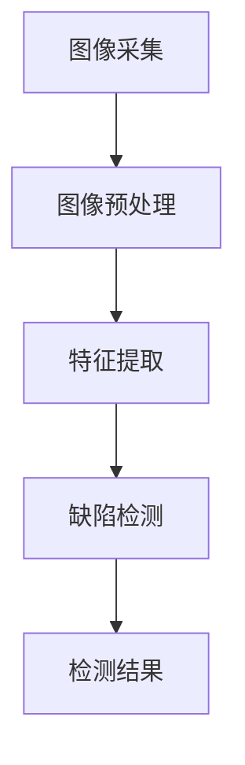

                 

# 计算机视觉在自动化质量检测中的应用

> **关键词：**计算机视觉，自动化质量检测，图像处理，深度学习，质量分析。

> **摘要：**本文将探讨计算机视觉技术在自动化质量检测中的应用，通过深入分析核心算法、数学模型及项目实战，旨在为读者提供对这一领域全面而深刻的理解，并探讨其未来发展前景与挑战。

## 1. 背景介绍

### 1.1 自动化质量检测的需求

随着制造业的不断进步和生产规模的扩大，自动化质量检测已经成为现代制造业不可或缺的一环。传统的质量检测方法主要依赖于人工，耗时费力，且容易出现人为误差。为了提高生产效率、降低成本，自动化质量检测应运而生。自动化质量检测利用计算机技术和传感器设备，对产品进行实时、高效的质量分析，显著提高了生产质量和生产效率。

### 1.2 计算机视觉技术的崛起

计算机视觉技术作为人工智能的重要分支，近年来取得了飞速发展。计算机视觉技术通过模拟人类视觉系统，实现对图像的识别、分析、处理和解释。在自动化质量检测中，计算机视觉技术能够快速、准确地识别产品缺陷，检测产品质量，成为自动化质量检测的核心技术之一。

## 2. 核心概念与联系

### 2.1 计算机视觉的基本概念

计算机视觉主要涉及图像处理、模式识别和机器学习等领域。图像处理是对图像进行预处理，提取有用信息；模式识别是通过训练模型，对图像进行分类和识别；机器学习则是通过大量的数据训练，提高模型的准确性和鲁棒性。

### 2.2 自动化质量检测与计算机视觉的关系

自动化质量检测与计算机视觉技术的结合，实现了对产品质量的智能检测。计算机视觉技术通过图像采集、预处理、特征提取、缺陷检测等步骤，实现对产品质量的全面分析。其流程可以概括为：

1. **图像采集**：通过摄像头、扫描仪等设备，获取产品的图像数据。
2. **图像预处理**：对图像进行去噪、增强、灰度化等处理，提高图像质量。
3. **特征提取**：提取图像中的关键特征，如颜色、纹理、形状等。
4. **缺陷检测**：利用机器学习和模式识别技术，对图像中的缺陷进行检测和分类。

### 2.3 Mermaid 流程图



## 3. 核心算法原理 & 具体操作步骤

### 3.1 图像处理算法

图像处理是计算机视觉中的基础步骤，主要包括去噪、增强、灰度化等操作。

1. **去噪**：利用均值滤波、中值滤波等方法，去除图像中的噪声。
2. **增强**：通过对比度增强、边缘增强等技术，提高图像的清晰度。
3. **灰度化**：将彩色图像转换为灰度图像，简化图像处理过程。

### 3.2 特征提取算法

特征提取是计算机视觉中的关键步骤，常用的特征提取方法包括：

1. **颜色特征**：基于颜色直方图、颜色矩等方法，提取图像的颜色特征。
2. **纹理特征**：利用纹理矩、Gabor 小波变换等方法，提取图像的纹理特征。
3. **形状特征**：通过轮廓、边缘检测等方法，提取图像的形状特征。

### 3.3 缺陷检测算法

缺陷检测是计算机视觉在自动化质量检测中的核心任务，常用的方法包括：

1. **模板匹配**：通过训练模板和待检测图像进行匹配，定位缺陷区域。
2. **深度学习**：利用卷积神经网络（CNN）等深度学习模型，对缺陷进行分类和定位。
3. **支持向量机（SVM）**：通过训练 SVM 模型，对缺陷进行分类和识别。

## 4. 数学模型和公式 & 详细讲解 & 举例说明

### 4.1 深度学习模型

深度学习模型是计算机视觉中的核心工具，其基本公式如下：

$$
y = \sigma(W \cdot x + b)
$$

其中，\( y \) 是预测结果，\( \sigma \) 是激活函数（如 sigmoid、ReLU 等），\( W \) 是权重矩阵，\( x \) 是输入特征，\( b \) 是偏置。

### 4.2 卷积神经网络（CNN）

卷积神经网络是深度学习模型的一种，其基本结构包括：

1. **卷积层**：通过卷积操作提取图像特征。
2. **激活函数**：对卷积结果进行非线性变换。
3. **池化层**：对卷积结果进行下采样，降低模型参数。
4. **全连接层**：将卷积结果映射到输出。

### 4.3 举例说明

假设我们使用卷积神经网络对一张图像进行缺陷检测，其输入图像大小为 \( 128 \times 128 \) 像素，深度为 3（RGB 三通道）。我们使用 3 个卷积层，每个卷积层包含 32 个卷积核，卷积核大小为 3x3。激活函数使用 ReLU，池化层使用 2x2 的最大池化。

1. **第一层卷积**：
   $$ 
   \begin{aligned}
   &x_1 = \text{Conv}_1(x; W_1, b_1) \\
   &z_1 = \text{ReLU}(x_1)
   \end{aligned}
   $$
   
2. **第二层卷积**：
   $$ 
   \begin{aligned}
   &x_2 = \text{Conv}_2(z_1; W_2, b_2) \\
   &z_2 = \text{ReLU}(x_2)
   \end{aligned}
   $$

3. **第三层卷积**：
   $$ 
   \begin{aligned}
   &x_3 = \text{Conv}_3(z_2; W_3, b_3) \\
   &z_3 = \text{ReLU}(x_3)
   \end{aligned}
   $$

4. **池化层**：
   $$ 
   \begin{aligned}
   &p_3 = \text{MaxPooling}(z_3; 2 \times 2) \\
   &p_2 = \text{MaxPooling}(z_2; 2 \times 2) \\
   &p_1 = \text{MaxPooling}(z_1; 2 \times 2)
   \end{aligned}
   $$

5. **全连接层**：
   $$ 
   \begin{aligned}
   &h = \text{FC}(p_3; W_4, b_4) \\
   &y = \text{Sigmoid}(h)
   \end{aligned}
   $$

其中，\( W_1, W_2, W_3, W_4 \) 分别为第一、二、三、四层的权重矩阵，\( b_1, b_2, b_3, b_4 \) 分别为第一、二、三、四层的偏置，\( \text{Conv}_1, \text{ReLU}, \text{MaxPooling}, \text{FC}, \text{Sigmoid} \) 分别为卷积、激活函数、最大池化、全连接层和激活函数。

## 5. 项目实战：代码实际案例和详细解释说明

### 5.1 开发环境搭建

为了进行计算机视觉在自动化质量检测中的应用，我们首先需要搭建一个合适的开发环境。以下是搭建开发环境的具体步骤：

1. 安装 Python（建议使用 Python 3.8 或更高版本）。
2. 安装深度学习框架（如 TensorFlow 或 PyTorch）。
3. 安装 OpenCV 库（用于图像处理）。

### 5.2 源代码详细实现和代码解读

以下是一个简单的计算机视觉自动化质量检测项目，其核心代码如下：

```python
import cv2
import numpy as np

def detect_defect(image):
    # 图像预处理
    gray = cv2.cvtColor(image, cv2.COLOR_BGR2GRAY)
    blur = cv2.GaussianBlur(gray, (5, 5), 0)
    edge = cv2.Canny(blur, 50, 150)

    # 缺陷检测
    contours, _ = cv2.findContours(edge, cv2.RETR_EXTERNAL, cv2.CHAIN_APPROX_SIMPLE)
    for contour in contours:
        if cv2.contourArea(contour) > 100:
            x, y, w, h = cv2.boundingRect(contour)
            cv2.rectangle(image, (x, y), (x + w, y + h), (0, 0, 255), 2)
    
    return image

def main():
    image = cv2.imread('example.jpg')
    defect_image = detect_defect(image)
    cv2.imshow('Defect Detection', defect_image)
    cv2.waitKey(0)
    cv2.destroyAllWindows()

if __name__ == '__main__':
    main()
```

代码解读：

1. **图像预处理**：首先将输入图像转换为灰度图像，然后进行高斯模糊和 Canny 边缘检测。
2. **缺陷检测**：利用 OpenCV 的 `findContours` 方法找到边缘检测后的轮廓，对每个轮廓进行区域面积判断，若面积大于 100，则认为该轮廓为缺陷，并在原图上绘制矩形。
3. **显示检测结果**：使用 `imshow` 方法显示检测结果，并等待用户按键退出。

### 5.3 代码解读与分析

1. **图像预处理**：图像预处理是计算机视觉中的基础步骤，其目的是提高图像质量，为后续的缺陷检测提供更好的数据支持。
2. **缺陷检测**：缺陷检测是计算机视觉在自动化质量检测中的核心任务，通过边缘检测和轮廓分析，实现对缺陷的识别和定位。
3. **代码性能优化**：在实际应用中，为了提高代码性能，可以考虑使用并行计算、GPU 加速等技术。

## 6. 实际应用场景

### 6.1 制造业

在制造业中，计算机视觉技术广泛应用于产品质量检测、生产线监控、设备故障诊断等领域。通过计算机视觉技术，企业可以实现对产品质量的实时、高效检测，提高生产效率，降低生产成本。

### 6.2 食品行业

在食品行业，计算机视觉技术可以用于食品质量检测、食品安全监控等方面。通过对食品的图像进行识别和分析，可以发现食品中的异物、污染等问题，确保食品安全。

### 6.3 医疗领域

在医疗领域，计算机视觉技术可以用于医学影像分析、手术机器人辅助等方面。通过对医学影像的图像分析，医生可以更准确地诊断疾病，提高治疗效果。

## 7. 工具和资源推荐

### 7.1 学习资源推荐

1. **书籍**：《计算机视觉：算法与应用》（David A. Brainson）。
2. **论文**：检索 IEEE Transactions on Image Processing、IEEE Transactions on Pattern Analysis and Machine Intelligence 等顶级期刊，获取最新的研究论文。
3. **博客**：关注知名博客，如 Medium、知乎等，阅读专业博客文章，了解行业动态。

### 7.2 开发工具框架推荐

1. **深度学习框架**：TensorFlow、PyTorch。
2. **图像处理库**：OpenCV、Pillow。
3. **数据可视化库**：Matplotlib、Seaborn。

### 7.3 相关论文著作推荐

1. **论文**：《深度学习：原理及实践》（Goodfellow、Bengio、Courville）。
2. **著作**：《机器学习》（周志华）。

## 8. 总结：未来发展趋势与挑战

### 8.1 发展趋势

1. **深度学习技术的广泛应用**：随着深度学习技术的不断进步，其在自动化质量检测中的应用将越来越广泛。
2. **跨学科研究的深入**：计算机视觉与医学、生物、化学等领域的交叉融合，将推动自动化质量检测技术的创新发展。
3. **实时性要求的提高**：随着工业生产的不断升级，对自动化质量检测的实时性要求越来越高。

### 8.2 挑战

1. **数据质量的提升**：自动化质量检测的准确性依赖于图像数据的质量，如何提高数据质量是一个亟待解决的问题。
2. **算法优化与加速**：为了满足实时性要求，需要不断优化和加速算法，提高检测速度。
3. **隐私保护与伦理问题**：在应用计算机视觉技术时，需要充分考虑隐私保护和伦理问题。

## 9. 附录：常见问题与解答

### 9.1 什么是计算机视觉？

计算机视觉是人工智能的一个分支，旨在使计算机能够像人类一样理解和解释视觉信息，如识别物体、场景理解等。

### 9.2 什么是自动化质量检测？

自动化质量检测是一种利用计算机技术、传感器等设备，对产品质量进行实时、高效检测的方法，以提高生产效率和质量。

### 9.3 深度学习在自动化质量检测中有何优势？

深度学习在自动化质量检测中的优势包括：

1. **高准确性**：通过大量数据训练，深度学习模型可以准确识别产品质量。
2. **自适应性强**：深度学习模型可以根据不同的场景和需求进行调整和优化。
3. **实时性**：深度学习算法具有较高的计算速度，可以满足自动化质量检测的实时性要求。

## 10. 扩展阅读 & 参考资料

1. **扩展阅读**：

   - [《深度学习在工业自动化中的应用》](https://www.deeplearning.net/tutorial/industrial/)

   - [《计算机视觉与图像处理》](https://www.computer-vision-syndication.com/)

2. **参考资料**：

   - [《OpenCV 官方文档》](https://docs.opencv.org/)

   - [《TensorFlow 官方文档》](https://www.tensorflow.org/)

   - [《PyTorch 官方文档》](https://pytorch.org/)

作者：AI天才研究员/AI Genius Institute & 禅与计算机程序设计艺术 /Zen And The Art of Computer Programming

