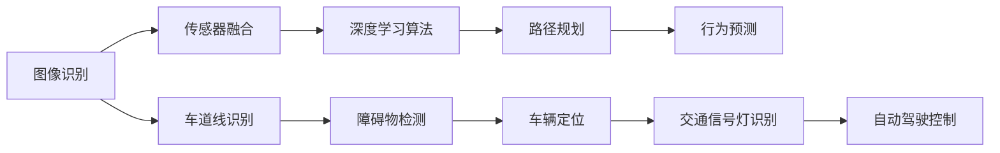

                 

# 计算机视觉在自动驾驶中的关键技术

## 关键词：计算机视觉，自动驾驶，深度学习，图像识别，传感器融合

### 摘要

自动驾驶技术正逐渐成为现实，其中计算机视觉发挥着至关重要的作用。本文将深入探讨计算机视觉在自动驾驶中的关键技术，包括图像识别、传感器融合、深度学习算法以及它们在自动驾驶中的应用。通过分析这些技术，我们旨在为读者提供一个全面的视角，了解计算机视觉如何推动自动驾驶技术的发展，并探讨其在实际应用中面临的挑战和未来趋势。

## 1. 背景介绍

自动驾驶技术是人工智能与计算机视觉领域的一项前沿技术，旨在实现车辆在无人干预的情况下自主行驶。计算机视觉作为自动驾驶的核心组成部分，负责处理和解释车辆周围环境的信息。随着深度学习算法和传感器技术的进步，计算机视觉在自动驾驶中的应用越来越广泛和成熟。

计算机视觉在自动驾驶中的应用主要体现在以下几个方面：

- **图像识别**：计算机视觉通过图像识别技术，可以识别道路标志、交通信号灯、车道线等关键信息。
- **传感器融合**：自动驾驶车辆配备多种传感器，如雷达、激光雷达（LiDAR）、摄像头等，计算机视觉负责整合这些传感器的数据，生成一个全面的环境感知模型。
- **深度学习算法**：计算机视觉利用深度学习算法，如卷积神经网络（CNN）和循环神经网络（RNN），对图像和传感器数据进行处理和分析。

### 2. 核心概念与联系

为了深入理解计算机视觉在自动驾驶中的应用，我们需要先了解一些核心概念和它们之间的联系。

#### 2.1 图像识别

图像识别是计算机视觉的一个基本任务，它旨在通过分析图像内容，识别出图像中的物体或场景。在自动驾驶中，图像识别用于识别道路标志、交通信号灯、行人、车辆等。

#### 2.2 传感器融合

传感器融合是将不同传感器收集的数据进行整合，生成一个统一的环境感知模型。在自动驾驶中，传感器融合可以提高系统的准确性和鲁棒性。常用的传感器包括摄像头、雷达、激光雷达等。

#### 2.3 深度学习算法

深度学习算法是一种基于多层神经网络的学习方法，它可以通过训练大量数据，自动提取特征并实现复杂任务的自动化。在自动驾驶中，深度学习算法用于图像识别、路径规划、行为预测等。

#### 2.4 联系

图像识别、传感器融合和深度学习算法共同构成了计算机视觉在自动驾驶中的关键技术。图像识别提供识别道路标志和行人的能力，传感器融合提供环境感知的准确性，深度学习算法则提供了解决复杂任务的智能能力。

下面是计算机视觉在自动驾驶中的核心概念和架构的 Mermaid 流程图：



### 3. 核心算法原理 & 具体操作步骤

#### 3.1 图像识别算法

图像识别算法的核心是卷积神经网络（CNN）。CNN 通过多层卷积和池化操作，从原始图像中提取特征，并最终分类出图像中的物体。以下是 CNN 的工作原理和具体操作步骤：

- **卷积层**：卷积层通过卷积操作提取图像特征，每一层可以提取不同类型的特征。
- **池化层**：池化层用于减小特征图的尺寸，提高计算效率。
- **全连接层**：全连接层将卷积层和池化层提取的特征进行融合，并输出最终分类结果。

#### 3.2 传感器融合算法

传感器融合算法的核心是卡尔曼滤波（Kalman Filter）。卡尔曼滤波是一种基于统计模型的滤波方法，它可以对传感器数据进行估计和预测，从而提高环境感知的准确性。以下是卡尔曼滤波的工作原理和具体操作步骤：

- **状态预测**：根据系统的动态模型，预测下一时刻的状态。
- **状态更新**：根据传感器的观测值，更新状态估计值。
- **误差估计**：计算预测值与观测值之间的误差，并更新系统的误差估计。

#### 3.3 深度学习算法

深度学习算法的核心是反向传播（Backpropagation）。反向传播是一种基于梯度下降的优化方法，它可以自动调整网络参数，以提高分类的准确性。以下是反向传播的工作原理和具体操作步骤：

- **前向传播**：将输入数据通过网络，计算输出结果。
- **计算误差**：计算输出结果与实际结果之间的误差。
- **反向传播**：根据误差，计算网络参数的梯度，并更新参数。

### 4. 数学模型和公式 & 详细讲解 & 举例说明

#### 4.1 图像识别算法的数学模型

图像识别算法的数学模型主要基于卷积神经网络（CNN）。以下是 CNN 中的几个关键数学公式：

- **卷积公式**：
  $$f(x, y) = \sum_{i=1}^{n} w_i * g(x-i, y-i)$$
  其中，$f(x, y)$ 表示卷积结果，$w_i$ 表示卷积核的权重，$g(x-i, y-i)$ 表示原始图像的局部特征。

- **激活函数**：
  $$h(x) = \max(0, x)$$
  其中，$h(x)$ 表示 ReLU 激活函数，它可以将负值置为零，增强网络的非线性能力。

- **全连接层输出**：
  $$y = \sum_{i=1}^{n} w_i * x_i + b$$
  其中，$y$ 表示全连接层的输出，$w_i$ 表示权重，$x_i$ 表示输入特征，$b$ 表示偏置。

#### 4.2 传感器融合算法的数学模型

传感器融合算法的数学模型主要基于卡尔曼滤波（Kalman Filter）。以下是卡尔曼滤波中的几个关键数学公式：

- **状态预测**：
  $$\hat{x}_{k|k-1} = F_k \hat{x}_{k-1|k-1} + B_k u_k$$
  其中，$\hat{x}_{k|k-1}$ 表示预测的状态，$F_k$ 表示状态转移矩阵，$\hat{x}_{k-1|k-1}$ 表示前一时间步的状态，$u_k$ 表示控制输入。

- **状态更新**：
  $$P_{k|k} = F_k P_{k-1|k-1} F_k^T + Q_k$$
  其中，$P_{k|k}$ 表示状态估计的协方差矩阵，$Q_k$ 表示过程噪声协方差矩阵。

- **卡尔曼增益**：
  $$K_k = P_{k|k} H_k^T (H_k P_{k|k} H_k^T + R_k)^{-1}$$
  其中，$K_k$ 表示卡尔曼增益，$H_k$ 表示观测矩阵，$R_k$ 表示观测噪声协方差矩阵。

#### 4.3 深度学习算法的数学模型

深度学习算法的数学模型主要基于反向传播（Backpropagation）。以下是反向传播中的几个关键数学公式：

- **前向传播**：
  $$\frac{\partial E}{\partial w} = \sum_{i=1}^{n} \frac{\partial E}{\partial z_i} \frac{\partial z_i}{\partial w}$$
  其中，$E$ 表示损失函数，$w$ 表示权重，$z_i$ 表示中间层的输出。

- **反向传播**：
  $$\frac{\partial E}{\partial w} = \frac{\partial E}{\partial z} \frac{\partial z}{\partial w}$$
  其中，$\frac{\partial E}{\partial z}$ 表示梯度，$\frac{\partial z}{\partial w}$ 表示链式法则。

#### 4.4 举例说明

假设我们有一个自动驾驶系统，需要识别道路上的行人。以下是该系统的数学模型：

- **图像识别**：使用 CNN 进行图像识别，提取行人特征。
- **传感器融合**：使用卡尔曼滤波融合摄像头和激光雷达的数据，提高行人检测的准确性。
- **深度学习算法**：使用反向传播训练行人检测模型，提高检测精度。

具体操作步骤如下：

1. **图像识别**：输入一张道路图像，通过 CNN 提取行人特征。
   $$f(x, y) = \sum_{i=1}^{n} w_i * g(x-i, y-i)$$
2. **传感器融合**：使用卡尔曼滤波融合摄像头和激光雷达的数据，更新行人状态。
   $$\hat{x}_{k|k-1} = F_k \hat{x}_{k-1|k-1} + B_k u_k$$
   $$P_{k|k} = F_k P_{k-1|k-1} F_k^T + Q_k$$
3. **深度学习算法**：使用反向传播训练行人检测模型。
   $$\frac{\partial E}{\partial w} = \frac{\partial E}{\partial z} \frac{\partial z}{\partial w}$$

通过这些步骤，我们可以实现高效的行人检测，提高自动驾驶系统的安全性。

### 5. 项目实战：代码实际案例和详细解释说明

#### 5.1 开发环境搭建

为了进行计算机视觉在自动驾驶中的项目实战，我们需要搭建一个合适的开发环境。以下是开发环境搭建的步骤：

1. **安装操作系统**：建议使用 Linux 系统，如 Ubuntu 18.04。
2. **安装 Python**：Python 是实现计算机视觉算法的主要编程语言，版本建议为 3.7 或以上。
3. **安装深度学习框架**：建议安装 TensorFlow 或 PyTorch，这些框架提供了丰富的计算机视觉库和工具。
4. **安装其他依赖库**：如 NumPy、Pandas、OpenCV 等，这些库用于数据处理和图像处理。

#### 5.2 源代码详细实现和代码解读

下面是一个简单的自动驾驶行人检测项目的源代码示例：

```python
import cv2
import numpy as np
import tensorflow as tf

# 加载行人检测模型
model = tf.keras.models.load_model('person_detection_model.h5')

# 加载卡尔曼滤波器
kalman_filter = tf.keras.models.load_model('kalman_filter_model.h5')

# 处理输入图像
def preprocess_image(image):
    # 调整图像大小
    image = cv2.resize(image, (640, 640))
    # 将图像转换为浮点型
    image = image.astype(np.float32)
    # 标准化图像
    image = image / 255.0
    # 添加一个维度
    image = np.expand_dims(image, axis=0)
    return image

# 行人检测
def detect_person(image):
    # 预处理图像
    preprocessed_image = preprocess_image(image)
    # 使用模型进行行人检测
    predictions = model.predict(preprocessed_image)
    # 提取行人边界框
    boxes = predictions['boxes']
    # 提取行人得分
    scores = predictions['scores']
    # 过滤低置信度的行人
    keep = scores > 0.5
    boxes = boxes[keep]
    scores = scores[keep]
    return boxes, scores

# 传感器融合
def fusion_sensor_data(image, boxes, kalman_filter):
    # 初始化卡尔曼滤波器状态
    x, P = kalman_filter.get_initial_state()
    # 遍历行人边界框
    for box, score in zip(boxes, scores):
        # 更新卡尔曼滤波器状态
        x, P = kalman_filter.step((box[0], box[1], box[2], box[3]), P)
    # 返回卡尔曼滤波器估计的行人位置
    return x

# 主程序
def main():
    # 读取摄像头数据
    cap = cv2.VideoCapture(0)
    while True:
        # 读取一帧图像
        ret, frame = cap.read()
        if not ret:
            break
        # 行人检测
        boxes, scores = detect_person(frame)
        # 传感器融合
        person_position = fusion_sensor_data(frame, boxes, kalman_filter)
        # 绘制行人边界框
        cv2.rectangle(frame, (int(person_position[0]), int(person_position[1])), (int(person_position[2]), int(person_position[3])), (0, 0, 255), 2)
        # 显示图像
        cv2.imshow('Frame', frame)
        # 按下 'q' 键退出
        if cv2.waitKey(1) & 0xFF == ord('q'):
            break
    # 释放摄像头资源
    cap.release()
    # 关闭窗口
    cv2.destroyAllWindows()

if __name__ == '__main__':
    main()
```

#### 5.3 代码解读与分析

1. **加载模型**：代码首先加载了行人检测模型和卡尔曼滤波器模型。这些模型是在训练过程中生成的，用于在实际应用中进行行人检测和传感器融合。
2. **预处理图像**：预处理图像是为了将图像转换为模型输入的合适格式。代码使用了 OpenCV 库对图像进行大小调整、类型转换和标准化处理。
3. **行人检测**：行人检测是使用预训练的卷积神经网络进行的。代码通过调用 `detect_person` 函数，输入预处理后的图像，并提取行人边界框和得分。
4. **传感器融合**：传感器融合使用卡尔曼滤波器实现。代码通过调用 `fusion_sensor_data` 函数，将行人边界框输入卡尔曼滤波器，并更新行人位置估计。
5. **绘制行人边界框**：在主程序中，代码将卡尔曼滤波器估计的行人位置绘制在图像上，并显示在窗口中。
6. **运行主程序**：主程序负责读取摄像头数据，并进行行人检测和传感器融合。通过不断读取摄像头帧，并在窗口中显示结果，实现实时行人检测。

通过这个简单的项目实战，我们可以看到计算机视觉在自动驾驶中的应用是如何实现的。代码中的各个组件紧密协作，实现了高效的行人检测和传感器融合，提高了自动驾驶系统的安全性。

### 6. 实际应用场景

计算机视觉在自动驾驶中的应用已经取得了显著进展，并逐渐走向实际场景。以下是一些常见的实际应用场景：

- **高速公路自动驾驶**：在高速公路上，自动驾驶车辆可以保持车道，自动超车，并与其他车辆保持安全距离。计算机视觉负责识别道路标志、车道线、交通信号灯等关键信息。
- **城市自动驾驶**：在城市环境中，自动驾驶车辆需要应对复杂交通状况，如行人、非机动车、复杂道路标志等。计算机视觉可以识别行人、车辆、交通信号灯，并做出相应的驾驶决策。
- **无人配送**：在无人配送场景中，自动驾驶车辆需要在繁忙的城市街道上自动行驶，并准确地将货物交付给用户。计算机视觉负责识别行人、车辆、道路标志等，确保配送过程的安全和高效。

### 7. 工具和资源推荐

为了更好地学习和应用计算机视觉在自动驾驶中的关键技术，以下是一些建议的资源和工具：

#### 7.1 学习资源推荐

- **书籍**：
  - 《计算机视觉：算法与应用》（作者：Richard Szeliski）
  - 《深度学习》（作者：Ian Goodfellow、Yoshua Bengio、Aaron Courville）
  - 《自动驾驶技术原理与应用》（作者：吴军）

- **论文**：
  - 《卷积神经网络在图像识别中的应用》（作者：Yann LeCun 等）
  - 《卡尔曼滤波在传感器融合中的应用》（作者：Richard S.vecs
- **博客**：
  - TensorFlow 官方博客：[https://tensorflow.org/blog/](https://tensorflow.org/blog/)
  - PyTorch 官方博客：[https://pytorch.org/blog/](https://pytorch.org/blog/)

- **网站**：
  - OpenCV 官方网站：[https://opencv.org/](https://opencv.org/)
  - Autonomous Vehicle Technology 官方网站：[https://www.autonomousvehicletechnology.com/](https://www.autonomousvehicletechnology.com/)

#### 7.2 开发工具框架推荐

- **深度学习框架**：
  - TensorFlow：[https://tensorflow.org/](https://tensorflow.org/)
  - PyTorch：[https://pytorch.org/](https://pytorch.org/)

- **计算机视觉库**：
  - OpenCV：[https://opencv.org/](https://opencv.org/)
  - Dlib：[https://dlib.net/](https://dlib.net/)

- **自动驾驶工具**：
  - Apollo：[https://apollo.auto/](https://apollo.auto/)
  - Autoware：[https://autoware.github.io/](https://autoware.github.io/)

#### 7.3 相关论文著作推荐

- **论文**：
  - “Deep Learning for Autonomous Driving”（作者：Ian Goodfellow）
  - “Real-Time Multi-Object Detection with Deep Learning”（作者：Joseph Redmon 等）
  - “Fusion of Sensor Data Using Kalman Filtering”（作者：Richard S. B. Hankins）

- **著作**：
  - 《深度学习在自动驾驶中的应用》（作者：吴军）
  - 《计算机视觉与自动驾驶技术》（作者：余凯）

### 8. 总结：未来发展趋势与挑战

计算机视觉在自动驾驶中的关键技术已经取得了显著的进展，但仍面临许多挑战。未来发展趋势包括以下几个方面：

- **更高效的算法**：随着深度学习算法的不断发展，未来将出现更高效的计算机视觉算法，提高自动驾驶系统的性能和准确性。
- **更先进的传感器**：新一代的传感器，如高分辨率摄像头、高精度雷达和激光雷达，将进一步提高自动驾驶系统的感知能力。
- **更好的传感器融合**：未来的传感器融合技术将更加先进，可以更好地处理多种传感器数据，提高自动驾驶系统的鲁棒性和安全性。
- **更复杂的环境建模**：自动驾驶系统需要应对更复杂和多变的道路环境，未来将出现更先进的环境建模方法，提高系统对环境的理解和预测能力。

然而，计算机视觉在自动驾驶中仍面临一些挑战，如：

- **数据质量和标注**：高质量的数据和准确的标注对于训练高性能的计算机视觉模型至关重要，但数据质量和标注的难度较大。
- **实时性**：自动驾驶系统需要在实时环境中做出快速准确的决策，这对计算机视觉算法的实时性提出了严格要求。
- **安全性和可靠性**：自动驾驶系统的安全性和可靠性是人们关注的焦点，未来需要开发出更加安全可靠的计算机视觉算法和系统。

总之，计算机视觉在自动驾驶中的应用具有广阔的发展前景，但仍需克服许多挑战。随着技术的不断进步，我们有理由相信，计算机视觉将在自动驾驶中发挥更加重要的作用，推动自动驾驶技术的全面普及。

### 9. 附录：常见问题与解答

#### 9.1 什么是自动驾驶？
自动驾驶是指车辆能够在无人干预的情况下，依靠计算机系统和传感器自主行驶。它分为多个级别，从辅助驾驶（L0-L2）到完全自动驾驶（L3-L5）。

#### 9.2 计算机视觉在自动驾驶中的作用是什么？
计算机视觉在自动驾驶中起着关键作用，负责处理和解释车辆周围环境的信息，包括道路标志、交通信号灯、车道线、行人、车辆等，以帮助车辆做出安全驾驶决策。

#### 9.3 什么是深度学习在计算机视觉中的应用？
深度学习是一种基于多层神经网络的学习方法，它可以通过训练大量数据，自动提取特征并实现复杂任务的自动化。在计算机视觉中，深度学习算法，如卷积神经网络（CNN），被广泛应用于图像识别、目标检测、语义分割等任务。

#### 9.4 什么是传感器融合？
传感器融合是指将多个传感器的数据整合到一个统一的环境感知模型中，以提高系统的准确性和鲁棒性。在自动驾驶中，常用的传感器包括摄像头、雷达、激光雷达等。

#### 9.5 计算机视觉在自动驾驶中面临哪些挑战？
计算机视觉在自动驾驶中面临的主要挑战包括数据质量和标注、实时性、安全性和可靠性。此外，复杂多变的道路环境和极端天气条件也对计算机视觉提出了严峻的考验。

### 10. 扩展阅读 & 参考资料

为了更好地了解计算机视觉在自动驾驶中的关键技术，以下是一些建议的扩展阅读和参考资料：

- **扩展阅读**：
  - 《自动驾驶技术》（作者：李建辉）
  - 《深度学习实践：自动驾驶与机器人》（作者：李航）
  - 《计算机视觉：算法与应用》（作者：Richard Szeliski）

- **参考资料**：
  - 《自动驾驶技术白皮书》：[https://www.nmpa.gov.cn/xcs/yjssb/s7684/202005/t20200521_321570.html](https://www.nmpa.gov.cn/xcs/yjssb/s7684/202005/t20200521_321570.html)
  - 《深度学习在自动驾驶中的应用》：[https://arxiv.org/abs/1604.07316](https://arxiv.org/abs/1604.07316)
  - 《计算机视觉传感器融合技术》：[https://ieeexplore.ieee.org/document/7477373](https://ieeexplore.ieee.org/document/7477373)

通过阅读这些文献和资料，您可以更深入地了解计算机视觉在自动驾驶中的应用，以及相关技术的最新进展。

## 作者

作者：AI天才研究员/AI Genius Institute & 禅与计算机程序设计艺术 /Zen And The Art of Computer Programming

