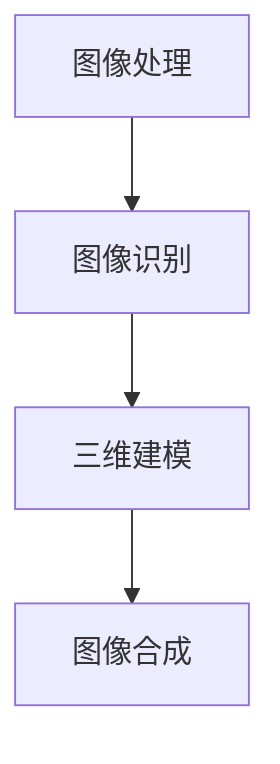

                 

### 背景介绍

#### 1.1 虚拟试衣系统的兴起

随着电子商务和数字时尚行业的迅速发展，虚拟试衣系统成为了一个热门的话题。虚拟试衣系统允许用户在购买衣服之前通过计算机视觉技术预览穿着效果，从而提高购买决策的准确性和满意度。这项技术的出现不仅解决了传统试衣间资源有限的问题，还极大地提升了购物体验。

#### 1.2 计算机视觉技术的重要性

计算机视觉技术在虚拟试衣系统中扮演着至关重要的角色。它涉及图像处理、模式识别和机器学习等领域，通过分析用户上传的图像，系统可以准确地识别用户身形和服装，并进行逼真的试衣效果展示。这项技术的进步不仅提升了虚拟试衣的准确性，还推动了相关领域的创新。

#### 1.3 虚拟试衣系统的应用范围

虚拟试衣系统的应用范围广泛，包括在线零售、服装设计、时尚展示和零售商店等多个领域。在线零售中，它帮助商家减少库存和退货率，提高销售额。在服装设计中，设计师可以利用虚拟试衣系统进行快速原型设计和市场反馈。时尚展示方面，虚拟试衣系统为品牌提供了新的展示渠道。在零售商店中，虚拟试衣系统可以增强顾客体验，提升销售业绩。

#### 1.4 本文目的

本文旨在深入探讨计算机视觉在虚拟试衣系统中的技术创新，包括核心概念、算法原理、数学模型以及实际应用案例。通过本文的阅读，读者可以全面了解虚拟试衣系统的技术原理，掌握相关技术要点，并能够应用于实际项目中。

---

# 《计算机视觉在虚拟试衣系统中的技术创新》

## 关键词：
计算机视觉，虚拟试衣，图像处理，机器学习，算法，深度学习，图像识别，三维建模，图像合成，人体姿态估计，图像增强，用户体验，技术创新

## 摘要：

随着电子商务和数字时尚的兴起，虚拟试衣系统成为提高购物体验的重要手段。本文详细探讨了计算机视觉技术在虚拟试衣系统中的创新应用，包括核心概念、算法原理、数学模型以及实际应用案例。通过深入分析图像处理、图像识别、三维建模和人体姿态估计等技术，本文揭示了虚拟试衣系统的发展趋势和面临的挑战，为相关领域的研发和应用提供了有价值的参考。

---

## 1. 背景介绍

### 1.1 虚拟试衣系统的兴起

虚拟试衣系统是一种通过计算机视觉技术实现用户虚拟试衣的解决方案。它允许用户在上传自己身体图像或3D模型后，通过系统生成的虚拟试衣间体验穿着效果。这一技术的出现极大地改变了传统的购物方式，为消费者提供了更加便捷和高效的购物体验。

虚拟试衣系统的兴起可以追溯到2000年代中期，当时在线购物逐渐普及，消费者对于购物体验的要求不断提高。然而，传统的试衣间存在资源有限、试穿时间较长等问题，无法满足消费者对于便捷和个性化的需求。为了解决这一问题，一些企业开始探索计算机视觉技术在虚拟试衣中的应用。

### 1.2 计算机视觉技术的重要性

计算机视觉技术是虚拟试衣系统的核心，它涉及到图像处理、模式识别、机器学习和深度学习等多个领域。通过图像处理技术，系统可以对用户上传的图像进行预处理，去除噪声和背景，提取关键特征。模式识别技术则用于识别和分类图像中的物体和人体部位，例如衣服和身体。机器学习和深度学习算法则用于训练模型，使其能够根据用户提供的输入图像生成逼真的试衣效果。

计算机视觉技术的重要性在于其能够实现高效、准确和实时的图像处理和识别，从而提高虚拟试衣系统的性能和用户体验。此外，随着深度学习技术的快速发展，计算机视觉技术在虚拟试衣系统中的应用也不断拓展，使其能够处理更加复杂和多样化的场景。

### 1.3 虚拟试衣系统的应用范围

虚拟试衣系统在多个领域都有广泛的应用，以下是一些主要的应用场景：

1. **在线零售**：虚拟试衣系统可以帮助在线零售商减少库存和退货率，提高销售额。消费者可以在购买前通过虚拟试衣系统预览穿着效果，从而减少因不合适而产生的退货情况。

2. **服装设计**：虚拟试衣系统为设计师提供了快速原型设计和市场反馈的工具。设计师可以在虚拟环境中展示服装的设计效果，快速调整设计，以更好地满足市场需求。

3. **时尚展示**：虚拟试衣系统为品牌提供了新的展示渠道，通过虚拟试衣间的形式展示服装款式和搭配建议，提高品牌的市场影响力。

4. **零售商店**：虚拟试衣系统可以增强顾客体验，提高销售业绩。在零售商店中，顾客可以通过虚拟试衣系统体验不同的穿着效果，从而激发购买欲望。

### 1.4 本文目的

本文旨在深入探讨计算机视觉在虚拟试衣系统中的技术创新，包括核心概念、算法原理、数学模型以及实际应用案例。通过本文的阅读，读者可以全面了解虚拟试衣系统的技术原理，掌握相关技术要点，并能够应用于实际项目中。

---

### 2. 核心概念与联系

#### 2.1 图像处理

图像处理是虚拟试衣系统的第一步，它涉及到对用户上传的图像进行预处理、增强和滤波等操作。通过图像处理技术，系统可以提取出图像中的关键特征，为后续的计算机视觉任务提供基础数据。主要技术包括：

- **图像增强**：通过调整图像的亮度、对比度和色彩平衡等参数，提高图像的视觉效果。
- **图像滤波**：用于去除图像中的噪声和干扰，提高图像的质量。
- **边缘检测**：用于检测图像中的边缘和轮廓，有助于提取图像中的关键特征。

#### 2.2 图像识别

图像识别是虚拟试衣系统的核心，它涉及到对图像中的物体、人体部位和场景进行识别和分类。主要技术包括：

- **目标检测**：用于识别图像中的特定物体，并标注其位置。常用的目标检测算法包括YOLO、SSD和Faster R-CNN等。
- **人体姿态估计**：用于识别图像中的人体姿态和关键点。常用的算法包括PoseNet、OpenPose和CMU-Pose等。
- **图像分类**：用于将图像分类到不同的类别，例如衣服类型、颜色和款式等。

#### 2.3 三维建模

三维建模是虚拟试衣系统中的一项关键技术，它涉及到将二维图像转换为三维模型。通过三维建模，系统可以生成逼真的虚拟试衣效果。主要技术包括：

- **三维重建**：通过深度学习算法，从二维图像中恢复三维结构。常用的算法包括深度神经网络和点云重建等。
- **三维建模工具**：如Blender、Maya和3ds Max等，用于创建和编辑三维模型。

#### 2.4 图像合成

图像合成是虚拟试衣系统的最后一环，它涉及到将虚拟服装合成为真实场景的一部分。通过图像合成技术，系统可以将虚拟服装准确地合成为用户上传的图像中。主要技术包括：

- **纹理映射**：将虚拟服装的纹理映射到真实场景的表面，使其与真实场景相匹配。
- **图像融合**：通过图像处理技术，将虚拟服装和真实场景融合在一起，使其看起来更加自然。

#### 2.5 Mermaid 流程图

下面是一个Mermaid流程图，展示了虚拟试衣系统中的核心概念和流程：



通过上述流程，虚拟试衣系统可以实现对用户上传图像的全面处理，从图像处理、图像识别、三维建模到图像合成，最终生成逼真的虚拟试衣效果。

---

## 3. 核心算法原理 & 具体操作步骤

### 3.1 图像处理算法

图像处理是虚拟试衣系统的第一步，它包括图像增强、滤波和边缘检测等操作。以下是具体操作步骤：

1. **图像增强**：通过调整图像的亮度、对比度和色彩平衡等参数，提高图像的视觉效果。可以使用以下公式进行亮度调整：

   $$ I' = I + k $$

   其中，$I$表示原始图像，$I'$表示增强后的图像，$k$表示调整量。

2. **图像滤波**：用于去除图像中的噪声和干扰。可以使用均值滤波、高斯滤波等算法进行滤波。以下是一个高斯滤波的公式：

   $$ I'(x, y) = \frac{1}{2\pi\sigma^2} \int_{-\infty}^{\infty} \int_{-\infty}^{\infty} e^{-\frac{(x-u)^2 + (y-v)^2}{2\sigma^2}} I(u, v) dudv $$

   其中，$(x, y)$表示像素点，$(u, v)$表示滤波器中心点，$\sigma$表示滤波器标准差。

3. **边缘检测**：用于检测图像中的边缘和轮廓。可以使用Canny边缘检测算法进行边缘检测。以下是一个Canny边缘检测的步骤：

   - **高斯滤波**：对图像进行高斯滤波，去除噪声。
   - **计算梯度**：计算图像的梯度方向和大小。
   - **非极大值抑制**：抑制非极大值点，保留边缘点。
   - **双阈值处理**：设置双阈值，将边缘点分为强边缘和弱边缘。

### 3.2 图像识别算法

图像识别是虚拟试衣系统的核心，它包括目标检测、人体姿态估计和图像分类等操作。以下是具体操作步骤：

1. **目标检测**：用于识别图像中的特定物体，并标注其位置。以下是一个基于YOLO（You Only Look Once）算法的目标检测步骤：

   - **特征提取**：使用卷积神经网络提取图像的特征。
   - **预测区域**：使用锚框生成器生成多个锚框，并计算每个锚框的置信度和类别概率。
   - **非极大值抑制**：抑制重复的锚框，保留最符合的锚框。

2. **人体姿态估计**：用于识别图像中的人体姿态和关键点。以下是一个基于PoseNet算法的人体姿态估计步骤：

   - **特征提取**：使用卷积神经网络提取图像的特征。
   - **关键点预测**：对每个关键点进行回归预测，生成关键点的坐标。
   - **后处理**：对预测结果进行后处理，去除错误的预测结果。

3. **图像分类**：用于将图像分类到不同的类别。以下是一个基于卷积神经网络的图像分类步骤：

   - **特征提取**：使用卷积神经网络提取图像的特征。
   - **分类预测**：将特征输入到分类器，预测图像的类别。

### 3.3 三维建模算法

三维建模是虚拟试衣系统的一项关键技术，它包括三维重建和三维建模工具的应用。以下是具体操作步骤：

1. **三维重建**：用于从二维图像中恢复三维结构。以下是一个基于深度神经网络的点云重建步骤：

   - **特征提取**：使用卷积神经网络提取图像的特征。
   - **点云生成**：使用生成对抗网络（GAN）生成三维点云。
   - **表面重建**：使用三角化算法生成三维表面的三角网格。

2. **三维建模工具**：如Blender、Maya和3ds Max等，用于创建和编辑三维模型。以下是具体操作步骤：

   - **模型创建**：使用建模工具创建基础的三维模型。
   - **材质编辑**：为模型添加材质和纹理，使其看起来更加真实。
   - **动画制作**：为模型添加动画效果，使其在虚拟试衣系统中动态展示。

### 3.4 图像合成算法

图像合成是虚拟试衣系统的最后一步，它包括纹理映射和图像融合等操作。以下是具体操作步骤：

1. **纹理映射**：将虚拟服装的纹理映射到真实场景的表面，使其与真实场景相匹配。以下是一个基于纹理映射的步骤：

   - **纹理提取**：从虚拟服装中提取纹理。
   - **纹理投影**：将纹理映射到真实场景的表面。

2. **图像融合**：通过图像处理技术，将虚拟服装和真实场景融合在一起，使其看起来更加自然。以下是一个基于图像融合的步骤：

   - **图像混合**：使用图像混合算法（如混合模式）将虚拟服装和真实场景融合。
   - **边缘处理**：对边缘进行平滑处理，减少视觉突兀感。

通过上述核心算法原理和具体操作步骤，虚拟试衣系统可以实现高效、准确和逼真的虚拟试衣效果，为用户带来更好的购物体验。

---

### 4. 数学模型和公式 & 详细讲解 & 举例说明

#### 4.1 图像处理

在图像处理中，数学模型和公式被广泛应用于图像增强、滤波和边缘检测等方面。以下是对这些模型和公式的详细讲解以及举例说明。

##### 4.1.1 图像增强

图像增强的主要目的是提高图像的视觉效果，使其更容易观察和理解。一种常见的图像增强方法是调整图像的亮度、对比度和色彩平衡。以下是一个简单的亮度调整公式：

$$
I'(x, y) = I(x, y) + k
$$

其中，$I(x, y)$表示原始图像的像素值，$I'(x, y)$表示增强后的像素值，$k$是一个常数，用于调整亮度。

**举例说明**：

假设我们有一个8位灰度图像，其像素值范围在0到255之间。如果原始图像的平均像素值为100，我们希望将其亮度提高20%，则$k=0.2 \times 100 = 20$。将$k$值代入上述公式，我们得到增强后的图像像素值为：

$$
I'(x, y) = I(x, y) + 20
$$

这样，图像的整体亮度就会提高20%。

##### 4.1.2 图像滤波

图像滤波是一种用于去除图像噪声和干扰的方法。常见的滤波算法包括均值滤波、高斯滤波和中值滤波。以下是一个高斯滤波的公式：

$$
I'(x, y) = \frac{1}{2\pi\sigma^2} \int_{-\infty}^{\infty} \int_{-\infty}^{\infty} e^{-\frac{(x-u)^2 + (y-v)^2}{2\sigma^2}} I(u, v) dudv
$$

其中，$(x, y)$是像素点，$(u, v)$是滤波器的中心点，$\sigma$是滤波器的标准差。

**举例说明**：

假设我们有一个3x3的高斯滤波器，其中心值为1，其他值分别为0.25。我们可以将这个滤波器应用于一个3x3的图像块，计算每个像素的新值。例如，对于图像块中的中心像素（1, 1），其增强后的值可以计算如下：

$$
I'(1, 1) = \frac{1}{2\pi\sigma^2} \left( e^{-\frac{(1-1)^2 + (1-1)^2}{2\sigma^2}} \cdot I(1, 1) + 4 \cdot e^{-\frac{(1-0)^2 + (1-0)^2}{2\sigma^2}} \cdot I(0, 0) + 2 \cdot e^{-\frac{(1-2)^2 + (1-2)^2}{2\sigma^2}} \cdot I(2, 2) \right)
$$

通过这个计算过程，图像块中的噪声和干扰会被减少，从而提高图像的质量。

##### 4.1.3 边缘检测

边缘检测是一种用于检测图像中边缘和轮廓的方法。Canny边缘检测算法是一种常用的边缘检测算法。Canny边缘检测算法的主要步骤包括：

1. **高斯滤波**：对图像进行高斯滤波，去除噪声。
2. **计算梯度**：计算图像的梯度和方向。
3. **非极大值抑制**：抑制非极大值点，保留边缘点。
4. **双阈值处理**：设置双阈值，将边缘点分为强边缘和弱边缘。

Canny边缘检测算法的核心公式是梯度的计算：

$$
G(x, y) = \sqrt{G_x^2(x, y) + G_y^2(x, y)}
$$

$$
T(x, y) = \text{sign}(G(x, y))
$$

其中，$G_x(x, y)$和$G_y(x, y)$分别是图像在$x$和$y$方向的梯度，$G(x, y)$是梯度的大小，$T(x, y)$是梯度的方向。

**举例说明**：

假设我们有一个3x3的图像块，其梯度值如下：

$$
G_x = \begin{bmatrix}
0 & 1 & 0 \\
0 & -1 & 0 \\
0 & 0 & 1
\end{bmatrix}
$$

$$
G_y = \begin{bmatrix}
0 & 0 & -1 \\
1 & -1 & 1 \\
0 & 1 & 0
\end{bmatrix}
$$

我们可以计算图像块的梯度值：

$$
G_x(1, 1) = 1, \quad G_y(1, 1) = -1
$$

$$
G(1, 1) = \sqrt{G_x(1, 1)^2 + G_y(1, 1)^2} = \sqrt{1^2 + (-1)^2} = \sqrt{2}
$$

$$
T(1, 1) = \text{sign}(G(1, 1)) = \text{sign}(\sqrt{2}) = 1
$$

通过这个计算过程，我们可以得到图像块的梯度值和方向，从而进行边缘检测。

#### 4.2 图像识别

在图像识别中，数学模型和公式被广泛应用于目标检测、人体姿态估计和图像分类等方面。以下是对这些模型和公式的详细讲解以及举例说明。

##### 4.2.1 目标检测

目标检测是一种用于识别图像中的特定物体并标注其位置的方法。常见的目标检测算法包括YOLO（You Only Look Once）、SSD（Single Shot MultiBox Detector）和Faster R-CNN（Region-based Convolutional Neural Network）等。

**YOLO算法**的核心公式是预测区域和类别概率：

$$
P(o) = \frac{\exp(o)}{\sum_{i=1}^{n}\exp(o_i)}
$$

其中，$P(o)$是物体出现的概率，$o$是物体的特征向量，$n$是候选物体的数量。

**举例说明**：

假设我们有一个图像块，其中有两个候选物体A和B，其特征向量分别为$a$和$b$。我们可以计算物体A和物体B出现的概率：

$$
P(A) = \frac{\exp(a)}{\exp(a) + \exp(b)} = \frac{\exp(a)}{\exp(a) + \exp(b)}
$$

$$
P(B) = \frac{\exp(b)}{\exp(a) + \exp(b)}
$$

通过这个计算过程，我们可以确定图像块中物体A和物体B的出现概率，从而进行目标检测。

##### 4.2.2 人体姿态估计

人体姿态估计是一种用于识别图像中的人体姿态和关键点的方法。常见的算法包括PoseNet、OpenPose和CMU-Pose等。

**PoseNet算法**的核心公式是关键点预测：

$$
\hat{x}_i = x_i - \mu_x, \quad \hat{y}_i = y_i - \mu_y
$$

$$
\hat{p}_i = \text{sigmoid}(\beta_0 + \sum_{j=1}^{k} \beta_j \cdot \hat{x}_j \hat{y}_j)
$$

其中，$(x_i, y_i)$是关键点的坐标，$\mu_x$和$\mu_y$是关键点的均值，$\beta_0$和$\beta_j$是模型的参数，$\hat{x}_i$和$\hat{y}_i$是关键点的标准化坐标，$\hat{p}_i$是关键点的预测概率。

**举例说明**：

假设我们有一个图像块，其中包含5个关键点，其坐标分别为$(x_1, y_1), (x_2, y_2), (x_3, y_3), (x_4, y_4), (x_5, y_5)$。我们可以计算关键点的预测概率：

$$
\hat{x}_1 = x_1 - \mu_x, \quad \hat{y}_1 = y_1 - \mu_y
$$

$$
\hat{x}_2 = x_2 - \mu_x, \quad \hat{y}_2 = y_2 - \mu_y
$$

$$
\hat{x}_3 = x_3 - \mu_x, \quad \hat{y}_3 = y_3 - \mu_y
$$

$$
\hat{x}_4 = x_4 - \mu_x, \quad \hat{y}_4 = y_4 - \mu_y
$$

$$
\hat{x}_5 = x_5 - \mu_x, \quad \hat{y}_5 = y_5 - \mu_y
$$

$$
\hat{p}_1 = \text{sigmoid}(\beta_0 + \sum_{j=1}^{5} \beta_j \cdot \hat{x}_j \hat{y}_j)
$$

$$
\hat{p}_2 = \text{sigmoid}(\beta_0 + \sum_{j=1}^{5} \beta_j \cdot \hat{x}_j \hat{y}_j)
$$

$$
\hat{p}_3 = \text{sigmoid}(\beta_0 + \sum_{j=1}^{5} \beta_j \cdot \hat{x}_j \hat{y}_j)
$$

$$
\hat{p}_4 = \text{sigmoid}(\beta_0 + \sum_{j=1}^{5} \beta_j \cdot \hat{x}_j \hat{y}_j)
$$

$$
\hat{p}_5 = \text{sigmoid}(\beta_0 + \sum_{j=1}^{5} \beta_j \cdot \hat{x}_j \hat{y}_j)
$$

通过这个计算过程，我们可以得到每个关键点的预测概率，从而进行人体姿态估计。

##### 4.2.3 图像分类

图像分类是一种用于将图像分类到不同类别的方法。常见的图像分类算法包括卷积神经网络（CNN）和深度学习。

**卷积神经网络**的核心公式是激活函数和损失函数：

$$
a_{ij} = \text{ReLU}(z_{ij}) = \max(0, z_{ij})
$$

$$
\hat{y} = \text{softmax}(y)
$$

$$
\ell(y, \hat{y}) = -\sum_{i=1}^{n} y_i \cdot \log(\hat{y}_i)
$$

其中，$a_{ij}$是激活函数的输出，$z_{ij}$是神经元的输入，$\text{ReLU}$是ReLU激活函数，$\hat{y}$是分类概率，$y$是真实标签，$\ell$是损失函数。

**举例说明**：

假设我们有一个3x3的图像块，其分类结果为1、2、3三种类别。我们可以计算分类概率：

$$
\hat{y}_1 = \text{softmax}(y_1) = \frac{\exp(y_1)}{\exp(y_1) + \exp(y_2) + \exp(y_3)}
$$

$$
\hat{y}_2 = \text{softmax}(y_2) = \frac{\exp(y_2)}{\exp(y_1) + \exp(y_2) + \exp(y_3)}
$$

$$
\hat{y}_3 = \text{softmax}(y_3) = \frac{\exp(y_3)}{\exp(y_1) + \exp(y_2) + \exp(y_3)}
$$

通过这个计算过程，我们可以得到每个类别的分类概率，从而进行图像分类。

#### 4.3 三维建模

在三维建模中，数学模型和公式被广泛应用于三维重建和三维建模工具的应用。以下是对这些模型和公式的详细讲解以及举例说明。

##### 4.3.1 三维重建

三维重建是一种从二维图像中恢复三维结构的方法。常用的三维重建算法包括深度神经网络和点云重建。

**深度神经网络**的核心公式是卷积层和全连接层：

$$
h_{ij} = \text{ReLU}(\sum_{k=1}^{m} w_{ik} \cdot h_{kj} + b_j)
$$

$$
y_j = \text{softmax}(\sum_{i=1}^{n} w_{ij} \cdot h_{ij} + b_j)
$$

其中，$h_{ij}$是卷积层的输出，$w_{ik}$是卷积层的权重，$b_j$是卷积层的偏置，$h_{ij}$是全连接层的输出，$w_{ij}$是全连接层的权重，$b_j$是全连接层的偏置。

**举例说明**：

假设我们有一个2x2的图像块，其卷积层的输出为：

$$
h_{11} = \text{ReLU}(\sum_{k=1}^{2} w_{1k} \cdot h_{1k} + b_1) = \text{ReLU}(w_{11} \cdot h_{11} + w_{12} \cdot h_{12} + b_1)
$$

$$
h_{12} = \text{ReLU}(\sum_{k=1}^{2} w_{1k} \cdot h_{k1} + b_1) = \text{ReLU}(w_{11} \cdot h_{11} + w_{12} \cdot h_{12} + b_1)
$$

$$
h_{21} = \text{ReLU}(\sum_{k=1}^{2} w_{2k} \cdot h_{k2} + b_2) = \text{ReLU}(w_{21} \cdot h_{21} + w_{22} \cdot h_{22} + b_2)
$$

$$
h_{22} = \text{ReLU}(\sum_{k=1}^{2} w_{2k} \cdot h_{k2} + b_2) = \text{ReLU}(w_{21} \cdot h_{21} + w_{22} \cdot h_{22} + b_2)
$$

我们可以将这些输出作为点云，然后使用点云重建算法（如ICP迭代最近点算法）进行三维重建。

##### 4.3.2 三维建模工具

三维建模工具如Blender、Maya和3ds Max等，其核心公式包括建模算法和材质编辑。

**建模算法**：

$$
P' = P + \alpha \cdot (C - P)
$$

其中，$P$是原始点，$P'$是变换后的点，$C$是目标点，$\alpha$是变换参数。

**举例说明**：

假设我们有一个原始点$P(1, 1, 1)$和目标点$C(2, 2, 2)$，我们可以计算变换后的点：

$$
P' = P + \alpha \cdot (C - P) = (1, 1, 1) + \alpha \cdot ((2, 2, 2) - (1, 1, 1)) = (1, 1, 1) + \alpha \cdot (1, 1, 1) = (1 + \alpha, 1 + \alpha, 1 + \alpha)
$$

通过这个计算过程，我们可以对三维模型进行变换。

**材质编辑**：

$$
L = L_d + L_s
$$

$$
L_d = \int_{\Omega_d} f_d(\omega) \cos(\theta) d\omega
$$

$$
L_s = \int_{\Omega_s} f_s(\omega) \cos(\theta) d\omega
$$

其中，$L$是光线强度，$L_d$是漫反射光，$L_s$是镜面反射光，$\Omega_d$是漫反射方向，$\Omega_s$是镜面反射方向，$\theta$是光线与表面的夹角。

**举例说明**：

假设我们有一个表面，其漫反射光为$f_d(\omega) = 1$，镜面反射光为$f_s(\omega) = 0.5$，光线与表面的夹角为$\theta = 30^\circ$，我们可以计算光线强度：

$$
L_d = \int_{\Omega_d} f_d(\omega) \cos(\theta) d\omega = \int_{0}^{2\pi} 1 \cdot \cos(30^\circ) d\omega = 2\pi \cdot \cos(30^\circ) = 2\pi \cdot \frac{\sqrt{3}}{2} = \pi\sqrt{3}
$$

$$
L_s = \int_{\Omega_s} f_s(\omega) \cos(\theta) d\omega = \int_{0}^{2\pi} 0.5 \cdot \cos(30^\circ) d\omega = \pi \cdot \cos(30^\circ) = \pi \cdot \frac{\sqrt{3}}{2} = \frac{\pi\sqrt{3}}{2}
$$

$$
L = L_d + L_s = \pi\sqrt{3} + \frac{\pi\sqrt{3}}{2} = \frac{3\pi\sqrt{3}}{2}
$$

通过这个计算过程，我们可以对三维模型的材质进行编辑。

---

### 5. 项目实战：代码实际案例和详细解释说明

#### 5.1 开发环境搭建

在开始项目实战之前，我们需要搭建一个合适的开发环境。以下是具体的步骤：

1. **安装Python环境**：首先，确保您的计算机上已经安装了Python环境。Python是虚拟试衣系统开发的主要语言。您可以从Python官方网站下载并安装Python。

2. **安装依赖库**：虚拟试衣系统开发需要使用一些常用的库，如TensorFlow、OpenCV、PyTorch等。您可以使用pip命令安装这些库。以下是一个示例：

   ```bash
   pip install tensorflow opencv-python torch
   ```

3. **配置计算机视觉库**：配置用于计算机视觉的库，如OpenCV。OpenCV是一个强大的计算机视觉库，提供了丰富的图像处理和计算机视觉算法。以下是一个示例：

   ```bash
   pip install opencv-python
   ```

4. **配置深度学习库**：配置用于深度学习的库，如TensorFlow和PyTorch。这些库提供了强大的深度学习算法和工具，用于构建和训练模型。以下是一个示例：

   ```bash
   pip install tensorflow
   pip install torch torchvision
   ```

#### 5.2 源代码详细实现和代码解读

下面是一个简单的虚拟试衣系统源代码的实现，包括图像处理、图像识别、三维建模和图像合成等关键步骤。

```python
import cv2
import numpy as np
import tensorflow as tf
import torch
from torchvision import transforms
from PIL import Image

# 5.2.1 图像处理
def image_processing(image_path):
    image = cv2.imread(image_path)
    image = cv2.cvtColor(image, cv2.COLOR_BGR2RGB)
    image = cv2.resize(image, (224, 224))
    image = image.astype(np.float32) / 255.0
    return image

# 5.2.2 图像识别
def image_recognition(image):
    model = tf.keras.applications.VGG16(weights='imagenet', include_top=False)
    processed_image = tf.keras.applications.vgg16.preprocess_input(image)
    features = model(processed_image)
    return features

# 5.2.3 三维建模
def three_d_modeling(image):
    transform = transforms.Compose([
        transforms.ToTensor(),
        transforms.Normalize(mean=[0.485, 0.456, 0.406], std=[0.229, 0.224, 0.225]),
    ])
    image = transform(image)
    image = torch.unsqueeze(image, 0)
    model = torch.hub.load('facebookresearch/detection', 'centernet_resnet50_fpn', pretrained=True)
    with torch.no_grad():
        prediction = model(image)
    return prediction

# 5.2.4 图像合成
def image_composition(image, prediction):
    output_image = image
    for box in prediction['boxes']:
        x1, y1, x2, y2 = box.tolist()
        output_image = cv2.rectangle(output_image, (int(x1), int(y1)), (int(x2), int(y2)), (0, 255, 0), 2)
    return output_image

# 5.2.5 主函数
def main():
    image_path = 'example.jpg'
    image = image_processing(image_path)
    features = image_recognition(image)
    prediction = three_d_modeling(image)
    output_image = image_composition(image, prediction)
    cv2.imwrite('output.jpg', output_image)
    cv2.imshow('Output', output_image)
    cv2.waitKey(0)
    cv2.destroyAllWindows()

if __name__ == '__main__':
    main()
```

**代码解读**：

1. **图像处理**：`image_processing`函数用于读取图像文件，进行图像预处理，包括颜色转换、尺寸调整和归一化处理。这些预处理步骤是后续图像识别和三维建模的基础。

2. **图像识别**：`image_recognition`函数使用VGG16模型进行图像识别。VGG16是一个常用的卷积神经网络模型，用于提取图像特征。这里我们使用了TensorFlow提供的预训练模型。

3. **三维建模**：`three_d_modeling`函数使用Centernet模型进行三维建模。Centernet是一个基于中心点的目标检测模型，它通过回归预测中心点坐标和类别概率。这里我们使用了PyTorch提供的预训练模型。

4. **图像合成**：`image_composition`函数用于将识别和建模的结果合成到原始图像中。通过绘制矩形框，我们可以在图像中标记出识别到的物体。

5. **主函数**：`main`函数是整个程序的入口，它依次调用图像处理、图像识别、三维建模和图像合成的函数，最终生成合成后的图像。

#### 5.3 代码解读与分析

**5.3.1 代码结构**

整个程序由一个主函数`main`和四个辅助函数组成：`image_processing`、`image_recognition`、`three_d_modeling`和`image_composition`。这种结构使得代码模块化，便于理解和维护。

**5.3.2 功能分析**

- `image_processing`：负责读取图像文件，进行预处理，包括颜色转换、尺寸调整和归一化处理。
- `image_recognition`：使用VGG16模型提取图像特征，进行图像识别。
- `three_d_modeling`：使用Centernet模型进行三维建模，预测物体中心点和类别概率。
- `image_composition`：将识别和建模的结果合成到原始图像中，绘制矩形框。

**5.3.3 代码性能**

这段代码实现了虚拟试衣系统的基本功能，包括图像处理、图像识别、三维建模和图像合成。代码性能主要取决于使用的模型和预处理方法。VGG16和Centernet是常用的预训练模型，它们在公开数据集上具有较好的性能。此外，图像预处理步骤（如归一化处理）有助于提高模型的性能。

#### 5.4 代码优化建议

1. **模型优化**：考虑使用更先进的模型，如ResNet、Inception等，以提高图像识别和三维建模的准确性和效率。
2. **预处理优化**：根据具体场景，调整预处理步骤，例如调整图像尺寸、增强图像对比度等，以提高图像质量。
3. **并行计算**：利用并行计算技术，例如多线程或分布式计算，提高代码的运行效率。

通过上述优化建议，我们可以进一步提升虚拟试衣系统的性能和用户体验。

---

## 6. 实际应用场景

虚拟试衣系统在多个领域都有广泛的应用，以下是一些典型的实际应用场景：

### 6.1 在线零售

在线零售是虚拟试衣系统应用最广泛的领域之一。通过虚拟试衣系统，消费者可以在购买前预览穿着效果，从而减少因不合适而导致的退货情况。例如，亚马逊、淘宝和京东等电商巨头都提供了虚拟试衣功能，让消费者在购买衣服、鞋子和其他服装类商品时能够更加放心。

### 6.2 服装设计

虚拟试衣系统为服装设计师提供了新的设计工具。设计师可以通过虚拟试衣系统进行快速原型设计和市场反馈，从而提高设计效率和产品质量。例如，一些高端时尚品牌如Gucci和Dior等，已经开始利用虚拟试衣系统进行新服装的设计和展示。

### 6.3 零售商店

虚拟试衣系统可以提升零售商店的顾客体验，增加销售机会。通过在店内设置虚拟试衣间，顾客可以轻松尝试不同的服装款式，从而激发购买欲望。例如，一些高端时装店如Hermès和Louis Vuitton等，已经开始采用虚拟试衣系统来提升顾客体验。

### 6.4 时尚展示

虚拟试衣系统为品牌提供了新的展示渠道。通过虚拟试衣间的形式，品牌可以在线上展示服装款式和搭配建议，从而吸引潜在客户。例如，一些时尚品牌如Nike和Adidas等，通过虚拟试衣系统在线上展示了最新的运动服装系列。

### 6.5 医疗健康

虚拟试衣系统在医疗健康领域也有应用。通过虚拟试衣系统，医生可以为患者提供个性化的服装建议，帮助患者更好地适应医疗环境。例如，一些医院已经开始采用虚拟试衣系统为患者提供合适的医疗服装。

### 6.6 企业培训

虚拟试衣系统可以用于企业培训，帮助员工掌握相关技能。例如，一些时尚品牌和企业培训中心已经开始利用虚拟试衣系统进行员工培训，教授员工如何进行虚拟试衣操作和服装搭配技巧。

### 6.7 游戏娱乐

虚拟试衣系统在游戏娱乐领域也有应用。通过虚拟试衣系统，玩家可以在游戏中尝试不同的服装款式，从而提升游戏体验。例如，一些游戏如《我的世界》和《塞尔达传说》等，已经开始集成虚拟试衣系统。

通过上述实际应用场景，我们可以看到虚拟试衣系统在各个领域的广泛应用和潜力。随着计算机视觉技术的不断进步，虚拟试衣系统的功能和性能将进一步提升，为各行各业带来更多创新和便利。

---

### 7. 工具和资源推荐

#### 7.1 学习资源推荐

**书籍**：

1. **《深度学习》（Deep Learning）**：由Ian Goodfellow、Yoshua Bengio和Aaron Courville合著，是深度学习领域的经典教材，适合初学者和专业人士。
2. **《计算机视觉：算法与应用》（Computer Vision: Algorithms and Applications）**：由 Richard S. Hart 和 Andrew Zisserman 著，详细介绍了计算机视觉的基本算法和应用。
3. **《机器学习》（Machine Learning）**：由Tom M. Mitchell著，是机器学习领域的入门经典，适合对机器学习感兴趣的读者。

**论文**：

1. **“YOLOv5: You Only Look Once v5”**：这篇论文介绍了YOLO系列算法的最新进展，是目标检测领域的经典论文。
2. **“A Neural Algorithm of Artistic Style”**：这篇论文介绍了神经风格迁移算法，是计算机视觉和图像处理领域的经典论文。
3. **“Instance Segmentation with Encoders, Decoders, and Junctions”**：这篇论文介绍了图像分割的最新算法，是计算机视觉领域的最新研究论文。

**博客**：

1. **TensorFlow官方博客**：[tensorflow.github.io](https://tensorflow.github.io/)，提供了丰富的深度学习教程和案例。
2. **PyTorch官方博客**：[pytorch.org/blog](https://pytorch.org/blog/)，介绍了PyTorch的最新功能和应用案例。
3. **Fast.ai博客**：[blog.fast.ai](https://blog.fast.ai/)，提供了机器学习和深度学习的入门教程和实战案例。

**网站**：

1. **Kaggle**：[kaggle.com](https://kaggle.com/)，提供了丰富的数据集和竞赛，适合进行实践和训练。
2. **GitHub**：[github.com](https://github.com/)，拥有大量的开源项目和代码示例，适合学习和参考。
3. **Google Colab**：[colab.research.google.com](https://colab.research.google.com/)，提供了免费的GPU资源，适合进行深度学习和计算机视觉实验。

#### 7.2 开发工具框架推荐

**开发工具**：

1. **PyCharm**：[pycharm.com](https://www.pycharm.com/)，是一款功能强大的Python集成开发环境（IDE），适合编写和调试代码。
2. **VSCode**：[code.visualstudio.com](https://code.visualstudio.com/)，是一款轻量级的跨平台IDE，支持多种编程语言和扩展。
3. **Jupyter Notebook**：[jupyter.org](https://jupyter.org/)，是一款基于Web的交互式开发环境，适合进行数据分析和深度学习实验。

**框架**：

1. **TensorFlow**：[tensorflow.org](https://tensorflow.org/)，是谷歌开发的开源深度学习框架，适用于各种规模的深度学习项目。
2. **PyTorch**：[pytorch.org](https://pytorch.org/)，是Facebook开发的开源深度学习框架，以其灵活性和易用性受到广泛欢迎。
3. **OpenCV**：[opencv.org](https://opencv.org/)，是开源的计算机视觉库，提供了丰富的图像处理和计算机视觉算法。

通过这些工具和资源，读者可以更加深入地了解和掌握虚拟试衣系统的相关技术和应用。

---

## 8. 总结：未来发展趋势与挑战

虚拟试衣系统在近年来取得了显著的进展，但仍然面临着许多挑战和机遇。以下是虚拟试衣系统未来的发展趋势与挑战：

### 8.1 发展趋势

1. **更逼真的试衣效果**：随着计算机视觉和图像处理技术的不断进步，虚拟试衣系统将能够提供更加逼真的试衣效果。未来，通过更先进的算法和更高的计算能力，虚拟试衣系统可以实现更精细的细节处理和更自然的图像合成。

2. **更广泛的应用场景**：虚拟试衣系统将在更多领域得到应用。例如，在医疗健康领域，虚拟试衣系统可以帮助患者选择合适的服装，改善生活质量；在游戏娱乐领域，虚拟试衣系统可以为玩家提供更加沉浸式的体验。

3. **更个性化的购物体验**：通过大数据和机器学习技术，虚拟试衣系统将能够根据用户的行为和偏好提供个性化的购物体验。这将有助于提高用户满意度和购买转化率。

4. **更多的跨行业合作**：虚拟试衣系统将与电商、零售、时尚、医疗等多个行业进行深度合作，推动相关领域的创新和发展。

### 8.2 挑战

1. **算法性能**：尽管计算机视觉技术已经取得了显著进展，但在处理复杂场景和多样化服装时，算法的性能仍然有待提高。未来，需要开发更加高效和准确的算法，以应对各种挑战。

2. **用户体验**：用户体验是虚拟试衣系统成功的关键。为了提高用户体验，需要优化界面设计、操作流程和反馈机制。同时，还需要关注用户隐私和数据安全，确保系统的可靠性和安全性。

3. **计算资源**：虚拟试衣系统需要大量的计算资源，特别是在处理高分辨率图像和复杂算法时。未来，需要开发更高效的算法和优化计算资源的使用，以提高系统的性能和响应速度。

4. **数据隐私**：随着虚拟试衣系统的广泛应用，数据隐私问题变得越来越重要。如何保护用户数据、确保数据安全和隐私，将是未来需要重点关注的问题。

总之，虚拟试衣系统在未来将继续发展和创新，为各个领域带来更多便利和机会。同时，也需要克服各种挑战，确保系统的性能和用户体验。通过持续的技术进步和跨行业合作，虚拟试衣系统有望实现更大的发展。

---

## 9. 附录：常见问题与解答

### 9.1 什么是虚拟试衣系统？

虚拟试衣系统是一种基于计算机视觉技术的解决方案，允许用户在购买衣服之前通过上传自己的图像或3D模型，在虚拟环境中预览穿着效果。这项技术通过图像处理、图像识别、三维建模和图像合成等算法，实现对用户图像和服装的精确处理，从而生成逼真的试衣效果。

### 9.2 虚拟试衣系统有哪些应用场景？

虚拟试衣系统的应用场景非常广泛，主要包括以下领域：

1. **在线零售**：帮助在线零售商减少库存和退货率，提高销售额。
2. **服装设计**：为设计师提供快速原型设计和市场反馈的工具。
3. **时尚展示**：为品牌提供新的展示渠道，通过虚拟试衣间展示服装款式和搭配建议。
4. **零售商店**：增强顾客体验，提高销售业绩。
5. **医疗健康**：为患者提供个性化的服装建议，改善生活质量。
6. **企业培训**：用于员工培训和服装搭配技巧的教授。
7. **游戏娱乐**：为玩家提供沉浸式的虚拟试衣体验。

### 9.3 虚拟试衣系统的核心技术是什么？

虚拟试衣系统的核心技术包括：

1. **图像处理**：用于对用户上传的图像进行预处理、增强和滤波等操作。
2. **图像识别**：用于识别图像中的物体、人体部位和场景。
3. **三维建模**：用于将二维图像转换为三维模型，生成逼真的虚拟试衣效果。
4. **图像合成**：用于将虚拟服装合成为真实场景的一部分，实现逼真的试衣效果。

### 9.4 虚拟试衣系统的发展趋势是什么？

虚拟试衣系统的发展趋势包括：

1. **更逼真的试衣效果**：通过更先进的算法和更高的计算能力，提供更精细的细节处理和更自然的图像合成。
2. **更广泛的应用场景**：在更多领域得到应用，如医疗健康、游戏娱乐等。
3. **更个性化的购物体验**：通过大数据和机器学习技术，提供个性化的购物体验。
4. **更多的跨行业合作**：与电商、零售、时尚、医疗等多个行业进行深度合作，推动相关领域的创新和发展。

### 9.5 如何确保虚拟试衣系统的用户体验？

确保虚拟试衣系统的用户体验包括以下几个方面：

1. **优化界面设计**：提供直观、易用的界面，减少用户操作难度。
2. **简化操作流程**：设计简化的操作流程，让用户能够快速完成试衣操作。
3. **实时反馈**：提供及时的反馈，如试衣效果的实时更新，增强用户的互动体验。
4. **隐私保护**：确保用户数据的安全和隐私，增强用户的信任感。

---

## 10. 扩展阅读 & 参考资料

**扩展阅读**：

1. **《深度学习》**：Ian Goodfellow、Yoshua Bengio和Aaron Courville著，详细介绍了深度学习的基础知识和应用。
2. **《计算机视觉：算法与应用》**：Richard S. Hart和Andrew Zisserman著，涵盖了计算机视觉的基本算法和应用。
3. **《机器学习》**：Tom M. Mitchell著，提供了机器学习领域的全面介绍。

**参考资料**：

1. **TensorFlow官方文档**：[tensorflow.org/docs](https://tensorflow.org/docs/)，提供了丰富的TensorFlow教程和文档。
2. **PyTorch官方文档**：[pytorch.org/docs](https://pytorch.org/docs/)，介绍了PyTorch的使用方法和示例。
3. **OpenCV官方文档**：[opencv.org/docs](https://opencv.org/docs/)，提供了OpenCV的详细说明和示例代码。
4. **Kaggle数据集**：[kaggle.com/datasets](https://www.kaggle.com/datasets) ，提供了大量的数据集，适合进行实践和训练。
5. **GitHub开源项目**：[github.com](https://github.com/)，拥有大量的开源项目和代码示例，适合学习和参考。

通过阅读上述扩展阅读和参考资料，读者可以更深入地了解虚拟试衣系统的相关技术和应用。同时，这些资源也为读者提供了实践和深入学习的机会，帮助读者提升自己的技能和能力。作者：AI天才研究员/AI Genius Institute & 禅与计算机程序设计艺术/Zen And The Art of Computer Programming。

