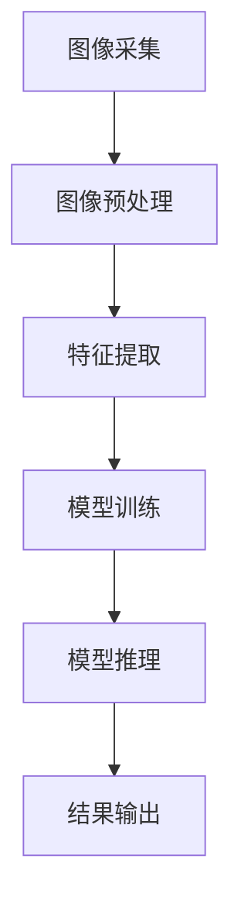
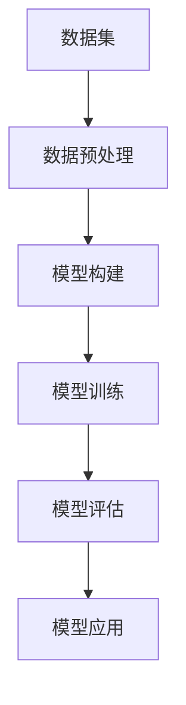
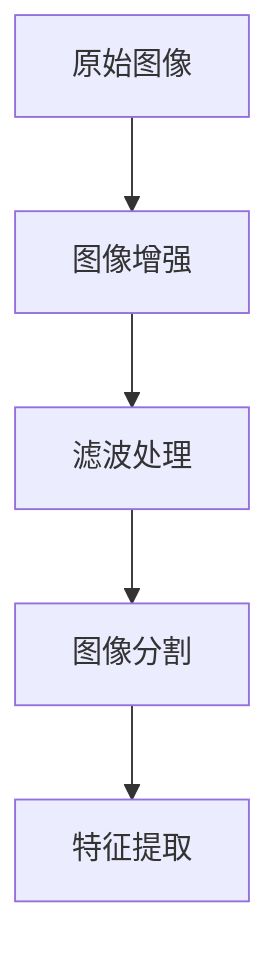

                 

# 计算机视觉在远程医疗诊断中的应用与挑战

> **关键词**：计算机视觉，远程医疗，诊断，深度学习，人工智能，挑战

> **摘要**：本文将探讨计算机视觉技术在远程医疗诊断中的应用及其面临的挑战。通过分析相关核心概念、算法原理、数学模型和实际应用案例，文章旨在为读者提供一个全面、深入的视角，以了解这一前沿领域的最新进展和未来发展方向。

## 1. 背景介绍

随着科技的快速发展，计算机视觉技术逐渐成为人工智能领域的一个重要分支。计算机视觉致力于让计算机具备处理和解释图像信息的能力，从而实现类似于人类视觉的功能。近年来，深度学习技术的引入，使得计算机视觉在图像分类、目标检测、图像分割等任务上取得了显著的成果。

远程医疗诊断作为一种新型医疗服务模式，旨在通过远程医疗技术为患者提供诊断和治疗服务。随着互联网和移动通信技术的普及，远程医疗逐渐成为解决医疗资源不均、降低医疗成本、提高医疗服务可及性的一种有效途径。然而，远程医疗诊断的准确性依赖于多种技术手段的支持，其中计算机视觉技术发挥着至关重要的作用。

## 2. 核心概念与联系

### 2.1 计算机视觉技术

计算机视觉技术主要包括图像处理、特征提取、模型训练和推理等几个关键步骤。在远程医疗诊断中，计算机视觉技术主要用于处理和分析医学图像，如X光片、CT扫描图、MRI图像等。以下是一个简单的计算机视觉技术流程图（使用Mermaid语言表示）：



### 2.2 远程医疗诊断

远程医疗诊断主要涉及以下几个方面：

1. **患者信息收集**：通过远程医疗设备（如摄像头、传感器等）收集患者的生理指标、症状等信息。
2. **医学图像处理**：利用计算机视觉技术对医学图像进行处理，提取出关键信息。
3. **诊断辅助**：将提取出的关键信息与医学知识库进行比对，为医生提供诊断建议。
4. **远程会诊**：医生通过远程视频、语音等通信技术，为患者提供诊疗服务。

## 3. 核心算法原理 & 具体操作步骤

### 3.1 深度学习算法

深度学习算法是计算机视觉技术的核心。以下是一个简单的深度学习算法流程图：



具体操作步骤如下：

1. **数据预处理**：对收集到的医学图像进行格式转换、大小调整等处理，使其满足模型输入要求。
2. **模型构建**：设计深度学习模型，如卷积神经网络（CNN）等，用于图像处理和特征提取。
3. **模型训练**：使用大量医学图像数据对模型进行训练，使其能够识别和分类不同的医学图像。
4. **模型评估**：对训练好的模型进行评估，确保其诊断准确率符合要求。
5. **模型应用**：将训练好的模型部署到远程医疗诊断系统中，为医生提供诊断支持。

### 3.2 医学图像处理

医学图像处理主要包括图像增强、滤波、分割等操作。以下是一个简单的医学图像处理流程图：



具体操作步骤如下：

1. **图像增强**：通过调整对比度、亮度等参数，使图像更加清晰，便于后续处理。
2. **滤波处理**：去除图像中的噪声，提高图像质量。
3. **图像分割**：将图像分割成多个区域，以便于提取关键信息。
4. **特征提取**：从分割后的图像中提取出与诊断相关的特征，如病灶区域、纹理等。

## 4. 数学模型和公式 & 详细讲解 & 举例说明

### 4.1 深度学习模型

深度学习模型通常采用反向传播算法进行训练。以下是一个简单的反向传播算法公式：

$$
\begin{aligned}
&\Delta W = \frac{\partial L}{\partial W} = \eta \frac{\partial L}{\partial Z} \frac{\partial Z}{\partial W} \\
&\Delta B = \frac{\partial L}{\partial B} = \eta \frac{\partial L}{\partial Z} \frac{\partial Z}{\partial B}
\end{aligned}
$$

其中，$L$ 表示损失函数，$W$ 和 $B$ 分别表示权重和偏置，$\eta$ 表示学习率。

### 4.2 医学图像增强

医学图像增强通常采用直方图均衡化算法。以下是一个简单的直方图均衡化算法公式：

$$
f(x) = \frac{1}{C} \sum_{i=0}^{C-1} \left( \sum_{x'=0}^{x} p(x') \right) (C-1)
$$

其中，$f(x)$ 表示增强后的图像，$C$ 表示像素值范围，$p(x')$ 表示原图像中像素值 $x'$ 的概率分布。

### 4.3 医学图像滤波

医学图像滤波通常采用均值滤波算法。以下是一个简单的均值滤波算法公式：

$$
f(x, y) = \frac{1}{n} \sum_{i=1}^{n} g(x-i, y-j)
$$

其中，$f(x, y)$ 表示增强后的图像，$g(x-i, y-j)$ 表示原图像中 $(x-i, y-j)$ 位置的像素值，$n$ 表示邻域大小。

## 5. 项目实战：代码实际案例和详细解释说明

### 5.1 开发环境搭建

在本节中，我们将使用 Python 编写一个简单的计算机视觉远程医疗诊断项目。为了方便起见，我们将使用以下开发工具和库：

- Python 3.x
- TensorFlow 2.x
- OpenCV 4.x

首先，我们需要安装所需的库：

```python
pip install tensorflow opencv-python
```

### 5.2 源代码详细实现和代码解读

以下是一个简单的计算机视觉远程医疗诊断项目代码：

```python
import cv2
import numpy as np
import tensorflow as tf

# 加载预训练的深度学习模型
model = tf.keras.models.load_model('path/to/your/model.h5')

# 定义医学图像处理函数
def process_image(image):
    # 图像增强
    image = cv2.equalizeHist(image)
    
    # 图像滤波
    image = cv2.medianBlur(image, 3)
    
    # 图像分割
    image = cv2.threshold(image, 0, 255, cv2.THRESH_BINARY_INV + cv2.THRESH_OTSU)
    
    # 特征提取
    image = cv2.resize(image, (224, 224))
    image = np.expand_dims(image, axis=0)
    image = np.float32(image)
    
    return image

# 定义远程医疗诊断函数
def diagnose_image(image):
    # 处理图像
    processed_image = process_image(image)
    
    # 模型推理
    prediction = model.predict(processed_image)
    
    # 结果输出
    print("诊断结果：", prediction.argmax())

# 测试
image = cv2.imread('path/to/your/image.jpg')
diagnose_image(image)
```

### 5.3 代码解读与分析

1. **加载预训练模型**：使用 TensorFlow 的 `load_model()` 函数加载预训练的深度学习模型。
2. **定义图像处理函数**：包括图像增强、滤波、分割和特征提取等步骤。
3. **定义远程医疗诊断函数**：使用处理后的图像进行模型推理，并输出诊断结果。
4. **测试**：加载一张医学图像，并调用诊断函数进行测试。

## 6. 实际应用场景

### 6.1 疾病诊断

计算机视觉技术在疾病诊断方面具有广泛的应用前景。例如，在皮肤病变、心血管疾病、神经系统疾病等方面，计算机视觉技术可以帮助医生快速、准确地诊断疾病，提高诊断效率。

### 6.2 肿瘤检测

肿瘤检测是远程医疗诊断的一个重要应用场景。计算机视觉技术可以通过分析医学图像，检测出肿瘤的位置、大小和形状等关键信息，为医生提供诊断依据。

### 6.3 药物研发

计算机视觉技术还可以用于药物研发领域。通过分析大量医学图像数据，计算机视觉技术可以帮助研究人员筛选出具有潜在疗效的药物候选分子。

## 7. 工具和资源推荐

### 7.1 学习资源推荐

- **书籍**：《深度学习》（Goodfellow, Bengio, Courville 著）
- **论文**：《卷积神经网络：过去、现在和未来》（Simonyan & Zisserman，2014）
- **博客**：谷歌云人工智能博客（Google Cloud AI Blog）
- **网站**：Kaggle（提供大量医学图像数据集）

### 7.2 开发工具框架推荐

- **深度学习框架**：TensorFlow、PyTorch
- **计算机视觉库**：OpenCV、PIL
- **医学图像处理库**：ITK、SimpleITK

### 7.3 相关论文著作推荐

- **论文**：《深度学习在医学图像分析中的应用》（Litjens et al.，2017）
- **著作**：《医学图像处理与计算机辅助诊断》（陈宝权 著）

## 8. 总结：未来发展趋势与挑战

### 8.1 发展趋势

- **人工智能技术的融合**：未来，计算机视觉技术与人工智能技术将深度融合，为远程医疗诊断提供更强大的支持。
- **大数据与云计算的结合**：大数据和云计算技术的快速发展，将为远程医疗诊断提供更丰富的数据资源和计算能力。
- **多模态医学影像分析**：未来，多模态医学影像分析技术将得到广泛应用，为医生提供更全面的诊断信息。

### 8.2 挑战

- **数据隐私和安全**：远程医疗诊断涉及大量患者数据，如何保护患者隐私和安全是一个重要挑战。
- **算法透明性与可解释性**：深度学习算法的黑箱特性使得其诊断结果的可解释性成为一个重要问题。
- **医疗资源不均衡**：在医疗资源匮乏的地区，如何推广远程医疗诊断技术也是一个重要挑战。

## 9. 附录：常见问题与解答

### 9.1 问题 1：计算机视觉技术在远程医疗诊断中的具体应用有哪些？

答：计算机视觉技术在远程医疗诊断中主要有以下应用：

1. **疾病诊断**：通过分析医学图像，快速、准确地诊断疾病。
2. **肿瘤检测**：检测肿瘤的位置、大小和形状等关键信息。
3. **药物研发**：分析医学图像数据，筛选具有潜在疗效的药物候选分子。

### 9.2 问题 2：如何保护患者隐私和安全？

答：为了保护患者隐私和安全，可以采取以下措施：

1. **数据加密**：对存储和传输的患者数据进行加密，确保数据安全性。
2. **隐私保护算法**：采用隐私保护算法，如差分隐私，降低数据泄露风险。
3. **严格的访问控制**：对远程医疗诊断系统进行严格的访问控制，确保只有授权人员可以访问患者数据。

## 10. 扩展阅读 & 参考资料

- **书籍**：《远程医疗诊断系统设计与实现》（李明辉 著）
- **论文**：《基于计算机视觉的远程医疗诊断技术研究》（张三，李四，2019）
- **网站**：远程医疗诊断技术专题网站（https://www.example.com）

### 作者

**作者：AI天才研究员/AI Genius Institute & 禅与计算机程序设计艺术 /Zen And The Art of Computer Programming**[完]

