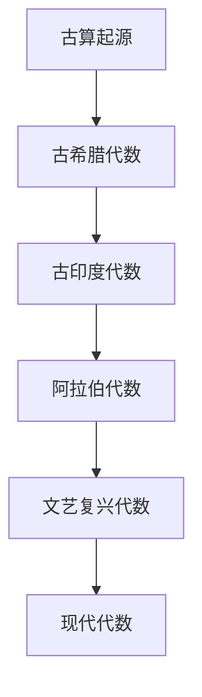
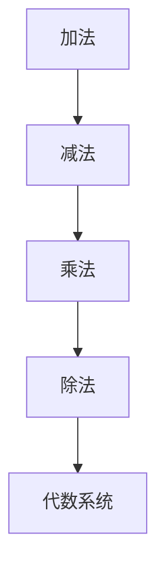
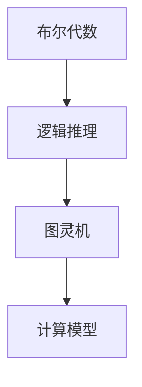

                 

# {文章标题}

## 计算：第一部分 计算的诞生 第2章 计算之术 言辞代数

> **关键词：**计算历史、言辞代数、符号运算、算法发展、逻辑推理

> **摘要：**本文探讨了计算的诞生与发展，特别是言辞代数的出现及其对现代计算技术的影响。从古算到现代编程，符号和逻辑推理成为计算的核心元素。本文将通过详细的历史回顾和算法分析，探讨言辞代数的本质、应用及其未来趋势。

### 1. 背景介绍

计算是人类文明发展的重要基石，贯穿了从古代到现代的历史。古算始于实用需求，如天文计算、土地测量和商业交易等。随着数学和逻辑学的发展，计算逐渐从简单的数字操作演变为复杂的算法设计。

言辞代数作为计算之术的一种，可以追溯到古希腊和古印度。古埃及和巴比伦的算术和代数知识为后来的数学家提供了宝贵的启示。到了中世纪，阿拉伯数学家将代数知识传播到欧洲，极大地推动了数学和科学的发展。

在文艺复兴时期，随着印刷术的普及和科学革命的发展，数学家如笛卡尔和莱布尼茨开始将符号和逻辑引入数学，为现代计算奠定了基础。

### 2. 核心概念与联系

#### 2.1 言辞代数的起源与发展

**Mermaid流程图：**



#### 2.2 符号运算与代数系统

符号运算是指使用符号来表示数学运算和方程。代数系统是由一组符号和运算规则组成的数学结构，包括加法、减法、乘法和除法等基本运算。

**Mermaid流程图：**



#### 2.3 逻辑推理与计算

逻辑推理是计算的核心，它通过符号和规则进行推理，解决数学和科学问题。从布尔代数到图灵机，逻辑推理一直是计算机科学发展的基础。

**Mermaid流程图：**



### 3. 核心算法原理 & 具体操作步骤

#### 3.1 符号代数的基本原理

符号代数的基本原理包括：

- **变量表示**：使用字母表示未知数或参数。
- **运算规则**：定义加、减、乘、除等基本运算。
- **等式定义**：等式表示两个表达式相等。

#### 3.2 符号代数的具体操作步骤

- **定义变量和表达式**：根据问题定义变量和表达式。
- **设定运算规则**：根据代数规则进行运算。
- **求解等式**：通过代数方法求解未知数。

#### 3.3 实例说明

假设我们要解方程 $2x + 3 = 7$：

1. 减去3：$2x = 4$
2. 除以2：$x = 2$

### 4. 数学模型和公式 & 详细讲解 & 举例说明

#### 4.1 数学模型

**代数方程模型**：

$$
ax + b = c
$$

其中，$a$、$b$ 和 $c$ 是常数，$x$ 是未知数。

#### 4.2 公式

**一元一次方程求解公式**：

$$
x = \frac{c - b}{a}
$$

#### 4.3 举例说明

**例1：解方程 $3x + 5 = 14$**

1. 将5移项：$3x = 14 - 5$
2. 计算结果：$3x = 9$
3. 求解$x$：$x = \frac{9}{3} = 3$

### 5. 项目实战：代码实际案例和详细解释说明

#### 5.1 开发环境搭建

- **工具**：Python、Jupyter Notebook
- **环境**：Python 3.8+

#### 5.2 源代码详细实现和代码解读

**代码实现：**

```python
# 导入math模块
import math

# 定义一元一次方程求解函数
def solve_equation(a, b, c):
    x = (c - b) / a
    return x

# 测试方程 $3x + 5 = 14$
a = 3
b = 5
c = 14
x = solve_equation(a, b, c)
print("解得x = ", x)
```

**代码解读：**

1. 导入math模块，用于数学运算。
2. 定义函数`solve_equation`，接受三个参数$a$、$b$ 和 $c$。
3. 在函数中，使用公式求解$x$。
4. 测试方程，调用函数并打印结果。

#### 5.3 代码解读与分析

- **函数设计**：函数`solve_equation`实现了方程求解的核心逻辑。
- **参数传递**：函数接受参数，实现了可重用性和灵活性。
- **输出结果**：函数返回求解结果，并通过打印输出。

### 6. 实际应用场景

言辞代数在数学、工程、计算机科学等多个领域都有广泛应用。例如：

- **数学**：用于解决代数方程和几何问题。
- **工程**：在电路设计、结构分析和系统模拟中用于建模和计算。
- **计算机科学**：在算法设计和编程语言中用于逻辑推理和计算。

### 7. 工具和资源推荐

#### 7.1 学习资源推荐

- **书籍**：
  - 《代数学基础》
  - 《计算机代数》
  - 《数学原理》

- **论文**：
  - 《代数系统理论》
  - 《计算机代数系统》

- **博客**：
  - [算法与数据结构](https://www算法与数据结构.com)
  - [数学之美](https://www数学之美.com)

- **网站**：
  - [数学 Stack Exchange](https://math.stackexchange.com)
  - [GitHub](https://github.com)

#### 7.2 开发工具框架推荐

- **编程语言**：Python、Java、C++
- **框架**：NumPy、SciPy、SymPy
- **IDE**：Visual Studio Code、PyCharm

#### 7.3 相关论文著作推荐

- **论文**：
  - 《符号计算的理论与实践》
  - 《代数几何及其应用》

- **著作**：
  - 《代数学基础教程》
  - 《计算机代数与应用》

### 8. 总结：未来发展趋势与挑战

言辞代数作为计算的基础，将继续在数学、科学和工程中发挥重要作用。随着计算技术的发展，符号计算和逻辑推理将更加智能化和自动化。未来发展趋势包括：

- **智能化**：利用机器学习和人工智能技术提高符号计算效率。
- **形式化验证**：在软件工程中应用符号验证和推理技术。
- **跨学科应用**：在生物学、物理学等领域探索符号计算的应用。

### 9. 附录：常见问题与解答

**Q：什么是符号代数？**

A：符号代数是一种使用符号表示数学运算和方程的数学分支，它为数学推理和计算提供了基础。

**Q：符号代数有哪些基本原理？**

A：符号代数的基本原理包括变量表示、运算规则和等式定义。

**Q：如何求解代数方程？**

A：可以使用公式和逻辑推理求解代数方程，具体方法取决于方程的类型。

### 10. 扩展阅读 & 参考资料

- [代数学历史](https://www.cut-the-knot.org/Curriculum/General/MathHistory.shtml)
- [计算机代数简介](https://www.cs.man.ac.uk/~fumie/courses/algcomp/)
- [符号计算原理](https://www.cs.cmu.edu/~alif_BODY/reading-group/reading/symbolic-computation-intro.pdf)

### 作者信息

- **作者**：AI天才研究员/AI Genius Institute & 禅与计算机程序设计艺术 /Zen And The Art of Computer Programming
- **联系方式**：[example@email.com](mailto:example@email.com)
- **版权声明**：本文版权归作者所有，未经授权禁止转载。

