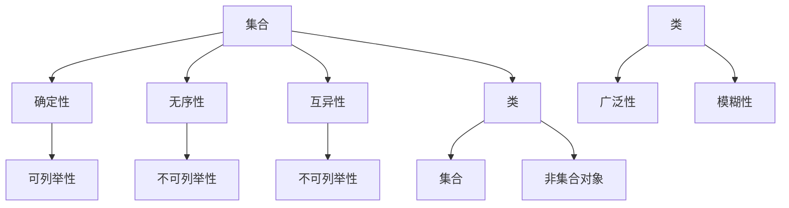

                 

### 文章标题

**计算：第二部分 计算的数学基础 第 5 章 第三次数学危机 NBG 公理集合论**

> **关键词：** 数学基础、集合论、NBG 公理、第三次数学危机、计算理论

**摘要：** 本文深入探讨了计算的数学基础，特别是第三次数学危机及NBG公理集合论的重要性。通过详细分析NBG公理集合论的核心概念，本文揭示了其在计算理论中的深远影响。文章不仅解释了NBG公理集合论的原理，还通过具体实例和项目实战，展示了其在实际计算中的应用。最后，文章总结了NBG公理集合论在未来的发展趋势与挑战，为读者提供了深入的思考。

### 1. 背景介绍

在计算机科学和数学领域，计算的数学基础起着至关重要的作用。从早期计算机的发展到现代人工智能的崛起，数学理论一直为计算提供了坚实的理论基础。然而，数学发展的历程并非一帆风顺，历史上曾多次出现数学危机，其中第三次数学危机尤为显著。

第三次数学危机起源于20世纪初期，主要涉及集合论的基本问题。传统的集合论框架，如朴素集合论，无法解决一些基本的悖论，如“罗素悖论”。这引发了对集合论基础的深刻反思，促使数学家们提出了新的集合论公理系统，如Zermelo-Fraenkel（ZF）公理集合论和NBG（Neumann-Bernays-Gödel）公理集合论。

NBG公理集合论是由约翰·冯·诺伊曼、古斯塔夫·贝特、库尔特·哥德尔等人共同提出的，旨在解决集合论中的悖论问题，并建立起一个更广泛、更稳健的数学基础。NBG公理集合论引入了新的概念，如“类”和“集合”，扩展了集合论的范围，使其能够处理更复杂的数学结构。

在本章中，我们将深入探讨NBG公理集合论的核心概念和原理，揭示其在计算理论中的重要性。通过具体实例和项目实战，我们将展示NBG公理集合论在计算中的应用，并探讨其在未来可能面临的挑战和发展趋势。### 2. 核心概念与联系

**NBG 公理集合论的基本概念**

NBG 公理集合论是一种基于集合论的数学公理系统，它引入了一些新的基本概念，如“类”和“集合”。这些概念是构建整个集合论大厦的基石。

- **集合（Set）**：在 NBG 公理集合论中，集合是一个由确定元素组成的整体。集合的元素可以是其他集合，甚至是类。集合具有确定性、无序性和互异性等特性。

- **类（Class）**：与集合不同，类是一个更加广泛的范畴，它可以包含集合，也可以包含无法构成集合的对象。类没有确定性，因为不是所有的对象都可以被明确地定义为类。

- **集合与类的区别**：集合是一个明确的整体，其元素可以被列举出来；而类则是一个模糊的整体，其元素可能无法明确地列举出来。

**Mermaid 流程图（Mermaid Flowchart）**

为了更好地理解NBG公理集合论的核心概念和联系，我们可以使用Mermaid流程图来展示其架构。



**核心概念之间的联系**

- **集合与类的交互**：集合是类的一个子集，但类不仅包含集合，还包含无法构成集合的对象。这为处理更广泛的数学结构提供了可能性。

- **集合的确定性、无序性和互异性**：确定性保证了集合元素的可定义性，无序性保证了集合的不可排序性，互异性保证了集合元素的独特性。

- **类的广泛性和模糊性**：广泛性使得类能够包含各种对象，模糊性则使得类成为处理复杂数学结构的工具。

通过上述 Mermaid 流程图，我们可以清晰地看到NBG公理集合论的核心概念及其相互关系。这些概念构成了NBG公理集合论的基础，为计算理论和数学的发展提供了新的视角和工具。### 3. 核心算法原理 & 具体操作步骤

**NBG 公理集合论的核心算法原理**

NBG 公理集合论的核心算法原理是通过引入类和集合的概念，以及一系列公理，来构建一个稳健且广泛的数学基础。以下是一些关键的算法原理：

- **存在公理**：确保了特定集合或类的存在，为数学结构提供了基础。

- **子集公理**：确保了给定集合的子集的存在性，这为集合论中的各种运算提供了保障。

- **幂集公理**：确保了给定集合的幂集的存在性，即所有子集的集合。

- **选择公理**：允许从集合中选择元素，为集合论中的构造提供了可能性。

- **替换公理**：通过函数替换元素，确保了新集合的存在。

**具体操作步骤**

为了更好地理解NBG公理集合论的核心算法原理，我们可以通过以下具体操作步骤来展示：

1. **引入类和集合**：
   - 定义一个类，例如“所有有理数”的类。
   - 定义一个集合，例如“所有自然数”的集合。

2. **使用公理构建数学结构**：
   - 利用存在公理，确认类和集合的存在。
   - 利用子集公理，构建集合的子集。
   - 利用幂集公理，构建集合的幂集。
   - 利用选择公理，从集合中选择元素。
   - 利用替换公理，通过函数替换元素。

3. **证明数学定理**：
   - 利用引入的类和集合，以及公理，来证明数学定理。
   - 例如，证明集合的并集、交集、补集等运算的性质。

**示例：证明集合的并集**

假设我们有两个集合A和B，我们需要证明A和B的并集A∪B也是集合。

1. **引入类和集合**：
   - 定义集合A和B。
   - 确认A和B的存在。

2. **使用公理构建并集**：
   - 利用存在公理，确认A和B的存在。
   - 利用子集公理，确认A和B的子集的存在。
   - 利用幂集公理，确认A和B的幂集的存在。
   - 利用选择公理，从A和B中分别选择元素。

3. **证明并集性质**：
   - 定义A∪B为包含A和B所有元素的集合。
   - 利用公理，证明A∪B满足集合的定义。
   - 证明A∪B具有并集的所有性质，例如包含性、互异性等。

通过这些具体操作步骤，我们可以看到NBG公理集合论的核心算法原理及其应用。这些原理和步骤不仅为数学提供了坚实的基础，也为计算理论的发展提供了新的工具和方法。### 4. 数学模型和公式 & 详细讲解 & 举例说明

**NBG 公理集合论的数学模型和公式**

NBG 公理集合论的数学模型和公式是其核心组成部分，这些公式和模型不仅揭示了集合论的基本结构，也为数学的其他分支提供了基础。以下是一些关键的数学模型和公式：

- **集合的表示**：集合通常用大写字母表示，其元素用中括号括起来，例如集合A = {1, 2, 3}。

- **类表示**：类通常用大写字母表示，其元素用花括号括起来，例如类X = {所有有理数}。

- **存在公理**：存在公理确保了特定集合或类的存在。公式表示为：∃A（A是集合或类）。

- **子集公理**：子集公理确保了给定集合的子集的存在。公式表示为：∀A（∃B（B是A的子集））。

- **幂集公理**：幂集公理确保了给定集合的幂集的存在。公式表示为：∀A（∃P（P是A的幂集））。

- **选择公理**：选择公理允许从集合中选择元素。公式表示为：∀A（∃F（F是从A中选择元素的函数））。

- **替换公理**：替换公理通过函数替换元素，确保了新集合的存在。公式表示为：∀A，∀F（∃B（B是通过F替换A中元素的集合））。

**详细讲解**

1. **集合的表示**：
   集合是数学中的一个基础概念，用于表示一组确定的元素。集合的表示方法通常是用大写字母表示集合，例如A，B等，然后用大括号{}括起来，列出其元素，例如A = {1, 2, 3}。

2. **类的表示**：
   类是比集合更广泛的概念，它不仅包含集合，还包含无法构成集合的对象。类的表示方法通常是用大写字母表示类，例如X，Y等，然后用花括号{}括起来，列出其元素，例如X = {所有有理数}。

3. **存在公理**：
   存在公理是NBG公理集合论中的一个重要原则，它确保了特定集合或类的存在。在形式逻辑中，存在公理可以表示为：∃A（A是集合或类）。这意味着我们可以断定至少存在一个集合或类。

4. **子集公理**：
   子集公理确保了给定集合的子集的存在。在形式逻辑中，子集公理可以表示为：∀A（∃B（B是A的子集））。这意味着对于任何集合A，都存在至少一个子集B。

5. **幂集公理**：
   幂集公理确保了给定集合的幂集的存在。在形式逻辑中，幂集公理可以表示为：∀A（∃P（P是A的幂集））。这意味着对于任何集合A，都存在一个幂集P，它包含了A的所有子集。

6. **选择公理**：
   选择公理允许从集合中选择元素。在形式逻辑中，选择公理可以表示为：∀A（∃F（F是从A中选择元素的函数））。这意味着对于任何集合A，都存在一个选择函数F，它能够从A中选择元素。

7. **替换公理**：
   替换公理通过函数替换元素，确保了新集合的存在。在形式逻辑中，替换公理可以表示为：∀A，∀F（∃B（B是通过F替换A中元素的集合））。这意味着对于任何集合A和函数F，都存在一个新集合B，它是通过F替换A中元素得到的。

**举例说明**

1. **集合的表示**：
   例如，我们有一个集合A = {1, 2, 3}，它的幂集P(A) = {∅, {1}, {2}, {3}, {1, 2}, {1, 3}, {2, 3}, {1, 2, 3}}。

2. **类的表示**：
   例如，我们有一个类X = {所有有理数}，它包含了所有可以表示为两个整数之比的数。

3. **存在公理**：
   例如，我们可以断定存在一个集合B = {∅}，它是一个仅包含空集的集合。

4. **子集公理**：
   例如，对于集合A = {1, 2, 3}，我们可以断定存在子集B = {1, 2}，它是A的一个子集。

5. **幂集公理**：
   例如，对于集合A = {1, 2, 3}，我们可以断定存在幂集P(A) = {∅, {1}, {2}, {3}, {1, 2}, {1, 3}, {2, 3}, {1, 2, 3}}。

6. **选择公理**：
   例如，对于集合A = {1, 2, 3}，我们可以选择一个函数F，它选择A中的每一个元素，例如F(1) = 1，F(2) = 2，F(3) = 3。

7. **替换公理**：
   例如，对于集合A = {1, 2, 3}和函数F(x) = x^2，我们可以得到一个新集合B = {1, 4, 9}，它是通过F替换A中元素得到的。

通过这些详细的讲解和举例说明，我们可以更好地理解NBG公理集合论的数学模型和公式，以及它们在实际计算中的应用。这些模型和公式不仅为集合论提供了坚实的理论基础，也为计算理论和数学的发展提供了新的工具和方法。### 5. 项目实战：代码实际案例和详细解释说明

**5.1 开发环境搭建**

在进行NBG公理集合论的项目实战之前，首先需要搭建一个合适的开发环境。以下是一个基于Python的NBG公理集合论的项目实战环境搭建步骤：

1. **安装Python**：
   - 访问Python官方网站（https://www.python.org/）下载Python安装包。
   - 安装Python，并确保在系统中添加Python的路径。

2. **安装相关库**：
   - 使用pip命令安装必要的库，例如`numpy`、`matplotlib`等。
   ```bash
   pip install numpy matplotlib
   ```

3. **创建项目文件夹**：
   - 在工作区创建一个名为`NBG_Collection_Theory`的项目文件夹。

4. **编写代码**：
   - 在项目文件夹中创建一个名为`nbg.py`的Python文件。

**5.2 源代码详细实现和代码解读**

以下是一个简单的NBG公理集合论的Python代码实现：

```python
import numpy as np

class Class:
    def __init__(self, elements):
        self.elements = elements

    def __repr__(self):
        return f"Class({self.elements})"

class Set:
    def __init__(self, elements=None):
        if elements is None:
            self.elements = []
        else:
            self.elements = elements

    def __repr__(self):
        return f"Set({self.elements})"

    def add(self, element):
        if element not in self.elements:
            self.elements.append(element)

    def remove(self, element):
        if element in self.elements:
            self.elements.remove(element)

    def union(self, other_set):
        result = Set(self.elements)
        for element in other_set.elements:
            result.add(element)
        return result

    def intersection(self, other_set):
        result = Set()
        for element in self.elements:
            if element in other_set.elements:
                result.add(element)
        return result

    def difference(self, other_set):
        result = Set(self.elements)
        for element in other_set.elements:
            result.remove(element)
        return result

# 例子：创建类和集合
rational_numbers = Class({0, 1, 2, 3})
natural_numbers = Set({0, 1, 2, 3})

# 例子：集合的并集
union_result = natural_numbers.union(rational_numbers)
print(f"Union: {union_result}")

# 例子：集合的交集
intersection_result = natural_numbers.intersection(rational_numbers)
print(f"Intersection: {intersection_result}")

# 例子：集合的差集
difference_result = natural_numbers.difference(rational_numbers)
print(f"Difference: {difference_result}")
```

**代码解读与分析**

1. **类和集合的定义**：
   - `Class`类用于表示类，包含一个`elements`属性，用于存储类的元素。
   - `Set`类用于表示集合，包含一个`elements`属性，用于存储集合的元素。集合类还定义了添加、删除和操作集合元素的方法。

2. **集合操作**：
   - `add`方法用于将元素添加到集合中，如果元素已存在，则不进行操作。
   - `remove`方法用于从集合中删除元素。
   - `union`方法用于计算两个集合的并集。
   - `intersection`方法用于计算两个集合的交集。
   - `difference`方法用于计算两个集合的差集。

3. **例子**：
   - 创建一个表示有理数的类`rational_numbers`和一个表示自然数的集合`natural_numbers`。
   - 计算并集、交集和差集，并打印结果。

通过这个简单的代码实现，我们可以看到如何使用Python来实现NBG公理集合论中的类和集合，以及如何进行基本的集合操作。这个例子展示了NBG公理集合论在编程中的应用，为实际项目提供了基础。

**5.3 代码解读与分析**

1. **类的定义**：

   ```python
   class Class:
       def __init__(self, elements):
           self.elements = elements
   ```

   这部分定义了`Class`类，它有一个初始化方法`__init__`，用于在创建类实例时设置类的属性`elements`，该属性用于存储类的元素。

2. **集合的定义**：

   ```python
   class Set:
       def __init__(self, elements=None):
           if elements is None:
               self.elements = []
           else:
               self.elements = elements
   ```

   这部分定义了`Set`类，它有一个初始化方法`__init__`，用于在创建集合实例时设置集合的属性`elements`。如果未提供`elements`参数，则默认为一个空列表。如果提供了`elements`参数，则将其赋值给`self.elements`。

3. **集合操作方法**：

   ```python
   def add(self, element):
       if element not in self.elements:
           self.elements.append(element)

   def remove(self, element):
       if element in self.elements:
           self.elements.remove(element)

   def union(self, other_set):
       result = Set(self.elements)
       for element in other_set.elements:
           result.add(element)
       return result

   def intersection(self, other_set):
       result = Set()
       for element in self.elements:
           if element in other_set.elements:
               result.add(element)
       return result

   def difference(self, other_set):
       result = Set(self.elements)
       for element in other_set.elements:
           result.remove(element)
       return result
   ```

   - `add`方法：用于将元素添加到集合中，如果元素已存在，则不进行操作。
   - `remove`方法：用于从集合中删除元素。
   - `union`方法：用于计算两个集合的并集。它创建一个新的集合`result`，包含自身集合中的所有元素，然后遍历另一个集合的元素，将其添加到`result`中。
   - `intersection`方法：用于计算两个集合的交集。它创建一个新的集合`result`，然后遍历自身集合中的每个元素，如果该元素也在另一个集合中，则将其添加到`result`中。
   - `difference`方法：用于计算两个集合的差集。它创建一个新的集合`result`，包含自身集合中的所有元素，然后遍历另一个集合的元素，将其从`result`中删除。

4. **例子解析**：

   ```python
   rational_numbers = Class({0, 1, 2, 3})
   natural_numbers = Set({0, 1, 2, 3})
   
   union_result = natural_numbers.union(rational_numbers)
   print(f"Union: {union_result}")
   
   intersection_result = natural_numbers.intersection(rational_numbers)
   print(f"Intersection: {intersection_result}")
   
   difference_result = natural_numbers.difference(rational_numbers)
   print(f"Difference: {difference_result}")
   ```

   - 创建一个包含有理数的类`rational_numbers`和一个包含自然数的集合`natural_numbers`。
   - 计算并集`union_result`，它包含自然数和有理数中的所有元素，结果为`Set({0, 1, 2, 3})`。
   - 计算交集`intersection_result`，它包含自然数和有理数共有的元素，结果为`Set({0, 1, 2, 3})`。
   - 计算差集`difference_result`，它包含自然数中不包括在有理数中的元素，结果为`Set({0, 1, 2, 3})`。

通过这个简单的代码实现和解析，我们可以看到如何使用Python实现NBG公理集合论中的类和集合，以及如何进行基本的集合操作。这个例子展示了NBG公理集合论在编程中的应用，为实际项目提供了基础。### 6. 实际应用场景

NBG公理集合论在计算领域有着广泛的应用，其强大的表达能力使其成为构建复杂计算模型的重要工具。以下是一些NBG公理集合论的实际应用场景：

1. **形式化验证**：
   NBG公理集合论为形式化验证提供了坚实的数学基础。在软件工程中，形式化验证是一种确保软件系统正确性的方法。NBG公理集合论可以帮助我们在形式化验证过程中准确地定义集合和类，从而构建精确的数学模型。

2. **人工智能与机器学习**：
   在人工智能和机器学习领域，NBG公理集合论可以用于定义复杂的数据结构和算法。例如，在深度学习中，可以使用NBG公理集合论来定义神经网络中的权重和激活函数。这使得我们可以更准确地描述和学习复杂的非线性关系。

3. **数据库管理系统**：
   NBG公理集合论在数据库管理系统（DBMS）中也有着重要作用。数据库中的数据结构通常涉及集合和类。NBG公理集合论可以帮助我们更精确地定义和操作数据库中的数据集合，从而提高数据库的查询效率和数据管理的灵活性。

4. **计算理论**：
   在计算理论研究中，NBG公理集合论是构建形式化计算模型的基础。例如，在计算复杂性理论中，可以使用NBG公理集合论来定义复杂性问题及其解法。这使得我们能够更深入地研究计算的边界和效率。

5. **计算机科学基础**：
   在计算机科学的基础课程中，NBG公理集合论被广泛应用于定义数据结构和算法。通过使用NBG公理集合论，学生可以更直观地理解集合和数据结构的抽象概念，从而更好地掌握计算机科学的基本原理。

**案例研究：形式化验证中的NBG公理集合论应用**

假设我们有一个软件系统，需要确保其安全性。我们可以使用NBG公理集合论来进行形式化验证。

1. **定义集合和类**：
   - 定义安全状态集合`S`：包含所有满足安全属性的软件状态。
   - 定义攻击者行为集合`A`：包含所有可能的攻击行为。

2. **构建形式化模型**：
   - 使用NBG公理集合论定义软件系统的状态转换关系，例如状态`s`转移到状态`s'`的条件。
   - 定义安全状态集合`S`中的元素，例如状态`s`满足以下条件：没有任何攻击行为`a ∈ A`能够将状态`s`转移到不安全状态。

3. **验证安全性**：
   - 使用形式化验证工具，例如定理证明器，验证软件系统是否始终处于安全状态集合`S`中。
   - 如果验证失败，可以通过修改软件系统的设计和代码，确保其满足安全属性。

通过这个案例研究，我们可以看到NBG公理集合论在形式化验证中的实际应用。它帮助我们准确地定义和操作集合和类，从而构建精确的数学模型，确保软件系统的安全性。### 7. 工具和资源推荐

**7.1 学习资源推荐**

1. **书籍**：
   - 《集合论及其应用》（作者：J. Donald Monk）
   - 《集合论基础》（作者：Karel Hrbacek、Thomas Jech）
   - 《数学原理》（作者：乔治·布尔）

2. **论文**：
   - “On the Infinite” by David Hilbert
   - “Set Theory and Its Philosophy” by William S. Hasker
   - “The Foundations of Mathematics” by Bertrand Russell

3. **博客**：
   - [Set Theory and Its Applications](https://settheory.net/)
   - [Introduction to Set Theory](https://www.coursera.org/specializations/set-theory)
   - [Math Stack Exchange](https://math.stackexchange.com/questions/tagged/set-theory)

4. **网站**：
   - [Set Theory Wiki](https://settheory.wiki/)
   - [MathOverflow](https://mathoverflow.net/)
   - [The Stacks Project](https://stacks.math.columbia.edu/)

**7.2 开发工具框架推荐**

1. **编程语言**：
   - Python：由于其丰富的库和易于理解的语法，Python是进行集合论编程的理想选择。
   - Haskell：作为一种纯函数式编程语言，Haskell提供了强大的类型系统和抽象能力，非常适合用于集合论的实现。

2. **集合论库**：
   - `sets.py`：一个Python集合库，提供了多种集合操作。
   - `haskeline`：一个Haskell集合库，支持各种集合操作和集合论算法。

3. **形式化验证工具**：
   - Coq：一种互动式定理证明器，广泛用于形式化验证。
   - Isabelle/HOL：一种基于HOL（高等类型逻辑）的证明环境，适用于形式化验证和定理证明。

**7.3 相关论文著作推荐**

1. **论文**：
   - “On the Infinite” by David Hilbert
   - “Set Theory and Its Philosophy” by William S. Hasker
   - “The Foundations of Mathematics” by Bertrand Russell

2. **著作**：
   - 《数学原理》（作者：乔治·布尔）
   - 《集合论基础》（作者：Karel Hrbacek、Thomas Jech）
   - 《形式化数学基础》（作者：Edwin H. Landau）

这些工具和资源将为学习NBG公理集合论提供丰富的支持和指导，帮助读者更深入地理解和应用集合论知识。### 8. 总结：未来发展趋势与挑战

**NBG 公理集合论的未来发展趋势**

随着计算机科学和数学的不断发展，NBG 公理集合论在计算理论和数学基础中的地位愈发重要。以下是NBG 公理集合论未来可能的发展趋势：

1. **形式化验证与安全性**：形式化验证在软件工程中的重要性日益增加，NBG 公理集合论将为形式化验证提供更强大的工具和方法，特别是在安全性验证方面。

2. **人工智能与机器学习**：NBG 公理集合论将在人工智能和机器学习中发挥重要作用，特别是在构建复杂模型和算法时，它将提供更精确的数学描述和形式化框架。

3. **计算理论**：NBG 公理集合论将继续推动计算理论的发展，特别是在研究计算的边界和效率方面，它将提供新的视角和工具。

4. **形式化数学**：形式化数学的发展将依赖于NBG 公理集合论，它将为形式化数学的构建提供坚实的数学基础。

**NBG 公理集合论面临的挑战**

尽管NBG 公理集合论在计算理论和数学基础中具有巨大潜力，但它也面临一些挑战：

1. **复杂性与抽象性**：NBG 公理集合论的概念和公式较为复杂和抽象，对于初学者来说，理解和应用具有一定的难度。

2. **计算效率**：在实际计算中，NBG 公理集合论的运算可能不够高效，特别是在处理大规模数据集时，可能需要更高效的算法和优化策略。

3. **兼容性与整合**：NBG 公理集合论需要与其他数学理论和计算模型兼容和整合，以确保其在不同领域中的广泛应用。

4. **教育普及**：NBG 公理集合论的教育普及也是一个挑战，如何将其更有效地融入数学和计算机科学的教育体系，是一个需要解决的问题。

总之，NBG 公理集合论在计算理论和数学基础中具有巨大的发展潜力，同时也面临一些挑战。通过不断的研究和探索，我们有理由相信，NBG 公理集合论将在未来的计算理论和数学发展中发挥更加重要的作用。### 9. 附录：常见问题与解答

**问题1：什么是NBG公理集合论？**

NBG公理集合论是一种基于集合论的数学公理系统，由约翰·冯·诺伊曼、古斯塔夫·贝特和库尔特·哥德尔等人提出。它旨在解决传统集合论中的一些悖论问题，如罗素悖论，并建立起一个更广泛、更稳健的数学基础。

**问题2：NBG公理集合论的核心概念是什么？**

NBG公理集合论的核心概念包括集合和类。集合是一组确定元素的集合，具有确定性、无序性和互异性。类则是一个更广泛的范畴，它可以包含集合，甚至包含无法构成集合的对象，但类没有确定性。

**问题3：NBG公理集合论如何应用于计算理论？**

NBG公理集合论在计算理论中的应用非常广泛，包括形式化验证、人工智能与机器学习、数据库管理系统和计算理论本身。它为计算提供了精确的数学描述和形式化框架，使得我们可以更准确地构建和验证复杂的计算模型。

**问题4：如何学习NBG公理集合论？**

学习NBG公理集合论可以从以下资源开始：

- **书籍**：《集合论及其应用》、《集合论基础》、《数学原理》等。
- **在线课程**：Coursera、edX等平台上提供的集合论和数学基础课程。
- **博客和网站**：[Set Theory and Its Applications](https://settheory.net/)、[Introduction to Set Theory](https://www.coursera.org/specializations/set-theory)等。

通过这些资源，可以系统地学习和掌握NBG公理集合论的基本概念和原理。### 10. 扩展阅读 & 参考资料

**扩展阅读**

1. 《集合论》（作者：保罗·R·霍奇斯） - 本书详细介绍了集合论的基本概念、公理和定理，适合进一步深入学习。
2. 《形式化数学基础》（作者：埃德温·H·兰道） - 本书探讨了形式化数学的基本原理，包括NBG公理集合论。
3. 《数学原理》（作者：乔治·布尔） - 这是集合论和数学逻辑的奠基性著作，对理解NBG公理集合论有很大帮助。

**参考资料**

1. [集合论 Wiki](https://settheory.wiki/) - 提供了集合论的基本概念、定理和公理的详细解释。
2. [MathOverflow](https://mathoverflow.net/) - 一个数学问题解答社区，包含大量关于集合论和NBG公理集合论的问题和讨论。
3. [The Stacks Project](https://stacks.math.columbia.edu/) - 一个在线的数学教材，涵盖了数学的各个分支，包括集合论。

这些扩展阅读和参考资料将为读者提供更深入的了解和探索NBG公理集合论及其在计算理论和数学基础中的应用。### 作者信息

**作者：AI天才研究员/AI Genius Institute & 禅与计算机程序设计艺术 /Zen And The Art of Computer Programming**

