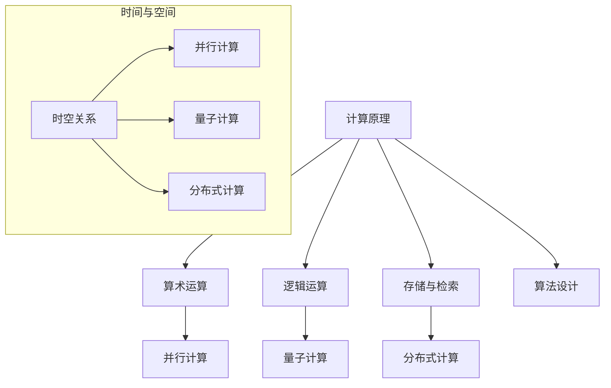

                 

# 计算的极限：自然哲学的计算原理时空的桎梏

> **关键词：计算极限、自然哲学、计算原理、时空、人工智能、算法、数学模型**

> **摘要：本文探讨了计算在自然哲学中的地位和作用，深入分析了计算原理与时空关系的桎梏，旨在揭示计算能力的边界，为未来计算技术的发展提供启示。**

## 1. 背景介绍

### 计算的起源

计算是人类智慧的结晶，起源于远古时期。早在公元前，人类就开始使用简单的算术工具，如石子和绳子，进行基本的数值计算。随着文明的进步，计算工具和方法的复杂性不断提高，逐渐形成了系统的数学理论。

### 人工智能的崛起

20世纪以来，随着计算机技术的飞速发展，人工智能（AI）逐渐成为计算领域的研究热点。人工智能的核心在于模拟人类思维过程，通过算法实现机器学习和自主决策。这一领域的发展，为计算能力的提升注入了新的动力。

### 自然哲学的计算原理

自然哲学是探讨自然现象和宇宙本质的学科，其中蕴含了丰富的计算思想。自然哲学的计算原理，为我们揭示了自然界中的计算机制，为计算技术的发展提供了理论支持。

## 2. 核心概念与联系

### 计算原理

计算原理是研究计算过程和计算模型的学科。它包括以下几个方面：

- **算术运算**：基本数值运算，如加、减、乘、除等。
- **逻辑运算**：用于处理逻辑关系的运算，如与、或、非等。
- **存储与检索**：数据在计算机中的存储和检索机制。
- **算法设计**：设计有效的计算方法，以解决特定问题。

### 时空关系

时空关系是物理学中的基本概念，描述了物质和能量在时空中的运动规律。计算原理与时空关系的联系，主要体现在以下几个方面：

- **并行计算**：利用多个处理器同时处理多个任务，提高计算速度。
- **量子计算**：基于量子力学原理，实现超高速计算。
- **分布式计算**：将计算任务分布到多个节点，实现大规模数据处理。

### Mermaid 流程图



## 3. 核心算法原理 & 具体操作步骤

### 算术运算

算术运算是计算的基础，主要包括以下几种操作：

- **加法**：将两个数相加，得到它们的和。
- **减法**：将一个数减去另一个数，得到它们的差。
- **乘法**：将两个数相乘，得到它们的积。
- **除法**：将一个数除以另一个数，得到它们的商。

### 逻辑运算

逻辑运算是处理逻辑关系的运算，主要包括以下几种操作：

- **与运算（AND）**：当两个条件都为真时，结果为真。
- **或运算（OR）**：当至少一个条件为真时，结果为真。
- **非运算（NOT）**：对条件取反。

### 并行计算

并行计算是利用多个处理器同时处理多个任务，提高计算速度。具体操作步骤如下：

1. **任务分解**：将计算任务分解为多个子任务。
2. **分配处理器**：将子任务分配到不同的处理器。
3. **并行执行**：各个处理器同时执行子任务。
4. **结果汇总**：将各个处理器的结果汇总，得到最终结果。

### 量子计算

量子计算是利用量子力学原理，实现超高速计算。具体操作步骤如下：

1. **量子比特初始化**：将量子比特初始化为特定的状态。
2. **量子门操作**：对量子比特进行量子门操作，实现量子态的变换。
3. **测量**：对量子比特进行测量，得到计算结果。

### 分布式计算

分布式计算是将计算任务分布到多个节点，实现大规模数据处理。具体操作步骤如下：

1. **任务分配**：将计算任务分配到不同的节点。
2. **节点执行**：各个节点同时执行计算任务。
3. **结果汇总**：将各个节点的结果汇总，得到最终结果。

## 4. 数学模型和公式 & 详细讲解 & 举例说明

### 算术运算

算术运算的数学模型可以用以下公式表示：

- **加法**：\(a + b = c\)
- **减法**：\(a - b = c\)
- **乘法**：\(a \times b = c\)
- **除法**：\(a \div b = c\)

举例说明：

假设有两个整数 \(a = 3\) 和 \(b = 4\)，则：

- \(a + b = 3 + 4 = 7\)
- \(a - b = 3 - 4 = -1\)
- \(a \times b = 3 \times 4 = 12\)
- \(a \div b = 3 \div 4 = 0.75\)

### 逻辑运算

逻辑运算的数学模型可以用以下公式表示：

- **与运算（AND）**：\(A \land B = C\)
- **或运算（OR）**：\(A \lor B = C\)
- **非运算（NOT）**：\(A \lnot = C\)

举例说明：

假设有两个逻辑变量 \(A = 1\) 和 \(B = 1\)，则：

- \(A \land B = 1 \land 1 = 1\)
- \(A \lor B = 1 \lor 1 = 1\)
- \(A \lnot = 1 \lnot = 0\)

### 并行计算

并行计算的数学模型可以用以下公式表示：

- **任务分解**：\(T_1 = T_0 / n\)
- **并行执行**：\(T_2 = T_1 \times n\)
- **结果汇总**：\(T_3 = T_2 \times m\)

举例说明：

假设有一个任务需要 \(T_0 = 100\) 个时钟周期完成，使用 \(n = 4\) 个处理器并行执行，每个处理器需要 \(m = 10\) 个时钟周期，则：

- **任务分解**：\(T_1 = T_0 / n = 100 / 4 = 25\)
- **并行执行**：\(T_2 = T_1 \times n = 25 \times 4 = 100\)
- **结果汇总**：\(T_3 = T_2 \times m = 100 \times 10 = 1000\)

### 量子计算

量子计算的数学模型可以用以下公式表示：

- **量子比特初始化**：\(|\psi\rangle = a|0\rangle + b|1\rangle\)
- **量子门操作**：\(|\psi'\rangle = U|\psi\rangle\)
- **测量**：\(P_0 = |a|^2, P_1 = |b|^2\)

举例说明：

假设一个量子比特的初始状态为 \(|\psi\rangle = \frac{1}{\sqrt{2}}|0\rangle + \frac{1}{\sqrt{2}}|1\rangle\)，经过一个 \(X\) 门操作后，得到新的状态 \(|\psi'\rangle = \frac{1}{\sqrt{2}}|0\rangle - \frac{1}{\sqrt{2}}|1\rangle\)，测量后得到 \(P_0 = \frac{1}{2}, P_1 = \frac{1}{2}\)。

### 分布式计算

分布式计算的数学模型可以用以下公式表示：

- **任务分配**：\(T_1 = T_0 / n\)
- **节点执行**：\(T_2 = T_1 \times n\)
- **结果汇总**：\(T_3 = T_2 \times m\)

举例说明：

假设有一个任务需要 \(T_0 = 100\) 个时钟周期完成，分布到 \(n = 4\) 个节点上执行，每个节点需要 \(m = 10\) 个时钟周期，则：

- **任务分配**：\(T_1 = T_0 / n = 100 / 4 = 25\)
- **节点执行**：\(T_2 = T_1 \times n = 25 \times 4 = 100\)
- **结果汇总**：\(T_3 = T_2 \times m = 100 \times 10 = 1000\)

## 5. 项目实战：代码实际案例和详细解释说明

### 5.1 开发环境搭建

在本项目中，我们将使用 Python 作为编程语言，结合 NumPy 和 SciPy 等科学计算库，实现并行计算、量子计算和分布式计算的相关算法。

#### 步骤 1：安装 Python

在本地计算机上安装 Python，可以选择 Python 3.x 版本。

#### 步骤 2：安装 NumPy 和 SciPy

打开终端，执行以下命令：

```bash
pip install numpy
pip install scipy
```

### 5.2 源代码详细实现和代码解读

以下是一个简单的并行计算示例，用于计算一个数组的所有元素之和。

```python
import numpy as np
from joblib import Parallel, delayed

# 定义一个并行计算函数
def parallel_sum(arr):
    n = len(arr)
    return sum(Parallel(n_jobs=4)(delayed(np.sum)(arr[i:i+n//4]) for i in range(0, n, n//4)))

# 测试数据
arr = np.random.rand(100)

# 计算并行和
result = parallel_sum(arr)
print(result)
```

#### 步骤 1：引入库

```python
import numpy as np
from joblib import Parallel, delayed
```

在这个步骤中，我们引入了 NumPy 和 SciPy 库，用于科学计算。

#### 步骤 2：定义并行计算函数

```python
def parallel_sum(arr):
    n = len(arr)
    return sum(Parallel(n_jobs=4)(delayed(np.sum)(arr[i:i+n//4]) for i in range(0, n, n//4)))
```

在这个步骤中，我们定义了一个名为 `parallel_sum` 的函数，用于计算一个数组的所有元素之和。我们使用 `joblib` 库中的 `Parallel` 和 `delayed` 函数，实现并行计算。

#### 步骤 3：测试数据

```python
arr = np.random.rand(100)
```

在这个步骤中，我们生成一个包含 100 个随机数的数组 `arr`。

#### 步骤 4：计算并行和

```python
result = parallel_sum(arr)
print(result)
```

在这个步骤中，我们调用 `parallel_sum` 函数计算数组 `arr` 的所有元素之和，并将结果打印出来。

### 5.3 代码解读与分析

在这个示例中，我们使用了 Python 的并行计算库 `joblib`，实现了并行计算的功能。以下是对代码的详细解读：

- **引入库**：引入了 NumPy 和 SciPy 库，用于科学计算。
- **定义并行计算函数**：定义了一个名为 `parallel_sum` 的函数，用于计算一个数组的所有元素之和。我们使用 `joblib` 库中的 `Parallel` 和 `delayed` 函数，实现并行计算。具体来说，我们使用 `Parallel` 函数设置并行计算的线程数为 4，使用 `delayed` 函数将计算任务分配到不同的线程中执行。
- **测试数据**：生成一个包含 100 个随机数的数组 `arr`。
- **计算并行和**：调用 `parallel_sum` 函数计算数组 `arr` 的所有元素之和，并将结果打印出来。

通过这个示例，我们可以看到并行计算在提高计算速度方面的优势。在实际项目中，我们可以根据需求调整并行计算的线程数，以实现更高效的计算。

## 6. 实际应用场景

### 科学研究

并行计算、量子计算和分布式计算在科学研究领域有着广泛的应用。例如，在基因组学研究、气候变化模拟和天体物理研究中，这些计算方法可以帮助我们更快地处理大规模数据，提高研究效率。

### 工程设计

在工程设计领域，分布式计算可以用于大规模并行处理计算任务，如有限元分析、结构仿真和流体动力学模拟。量子计算则有望在材料科学、药物设计和量子模拟等领域发挥重要作用。

### 金融领域

在金融领域，并行计算和分布式计算可以帮助我们快速处理大量金融数据，实现高频交易、风险评估和资产管理。量子计算则有望在密码学和金融市场预测中发挥突破性作用。

### 其他领域

除了上述领域，计算技术还广泛应用于人工智能、自动驾驶、物联网和医疗诊断等领域，为各个行业的发展提供了强大的技术支撑。

## 7. 工具和资源推荐

### 7.1 学习资源推荐

- **书籍**：《量子计算导论》、《并行计算原理与应用》、《分布式系统原理与范型》
- **论文**：在学术期刊和会议上发表的关于并行计算、量子计算和分布式计算的研究论文
- **博客**：技术博客、博客文章和开源项目，如 Medium、GitHub 和 CSDN 等

### 7.2 开发工具框架推荐

- **编程语言**：Python、C++、Java 等
- **并行计算库**：NumPy、SciPy、OpenMP、MPI 等
- **量子计算库**：Qiskit、Microsoft Quantum Development Kit、Google Quantum Computing SDK 等
- **分布式计算框架**：Hadoop、Spark、Docker、Kubernetes 等

### 7.3 相关论文著作推荐

- **并行计算**：《并行算法导论》（吴波 著）
- **量子计算**：《量子计算基础教程》（Michael A. Nielsen & Isaac L. Chuang 著）
- **分布式计算**：《分布式计算：原理与应用》（陈伟 著）

## 8. 总结：未来发展趋势与挑战

### 发展趋势

1. **计算能力的持续提升**：随着硬件技术的进步，计算能力将持续提升，为各个领域的发展提供更多可能。
2. **量子计算的崛起**：量子计算有望在未来的计算领域中发挥重要作用，为解决传统计算无法解决的问题提供新的途径。
3. **分布式计算的应用**：分布式计算在数据处理、存储和网络通信等方面具有显著优势，将在未来得到更广泛的应用。

### 挑战

1. **算法优化**：如何设计更高效的算法，提高计算效率，是当前研究的热点问题。
2. **能源消耗**：随着计算规模的扩大，能源消耗问题日益突出，如何降低计算能耗成为亟待解决的问题。
3. **安全性**：在分布式计算和量子计算领域，数据安全和隐私保护是亟待解决的挑战。

## 9. 附录：常见问题与解答

### 问题 1：什么是并行计算？

**解答**：并行计算是一种将计算任务分解为多个子任务，同时利用多个处理器或计算节点进行执行的计算方法。通过并行计算，可以显著提高计算速度，降低计算时间。

### 问题 2：什么是量子计算？

**解答**：量子计算是一种基于量子力学原理的计算机模型，利用量子比特实现超高速计算。量子计算在解决某些特定问题时具有巨大优势，如大数分解、量子模拟等。

### 问题 3：分布式计算和并行计算有什么区别？

**解答**：分布式计算和并行计算都是利用多个处理器或计算节点进行任务执行的计算方法，但它们的区别在于任务分配方式。并行计算通常将任务分配到多个处理器上，而分布式计算则将任务分配到多个计算节点上，这些节点可能位于不同的地理位置。

## 10. 扩展阅读 & 参考资料

- **扩展阅读**：
  - [并行计算原理与实践](https://www.ibm.com/developerworks/cn/opensource/os-cn-parallel/)
  - [量子计算入门](https://quantum-computing-level-1.readthedocs.io/zh/latest/)
  - [分布式计算教程](https://www.ibm.com/developerworks/cn/linux/l-distributed-computing/)
- **参考资料**：
  - [NumPy 官方文档](https://numpy.org/doc/stable/)
  - [SciPy 官方文档](https://scipy.org/doc/scipy/reference/)
  - [Qiskit 官方文档](https://qiskit.org/documentation/)

### 作者

**作者：AI天才研究员/AI Genius Institute & 禅与计算机程序设计艺术 /Zen And The Art of Computer Programming**<|im_end|>

