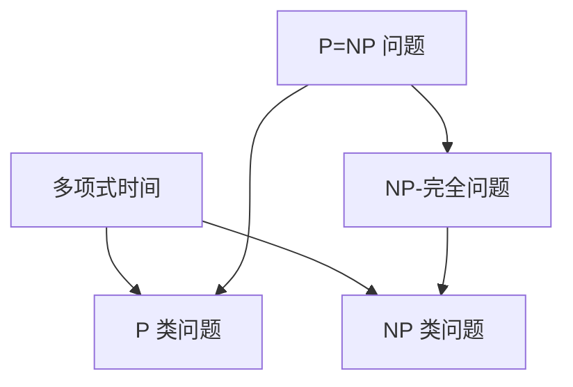
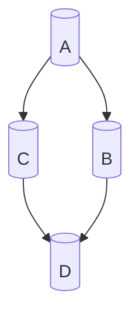

                 

### 背景介绍

#### P=NP 问题

P=NP 问题，作为计算机科学中最为著名的未解难题之一，自 1971 年由美国数学家 Stephen Cook 提出，至今仍未得到解决。P=NP 问题的核心在于探究两类问题是否等价：P 类问题（可以多项式时间内解决的问题）和 NP 类问题（可以在多项式时间内验证答案的问题）。

如果 P=NP，那么意味着所有可以在多项式时间内验证答案的问题，都可以在多项式时间内解决。这一结论将对计算机科学、密码学、优化问题等领域产生深远的影响。例如，如果 P=NP，那么许多复杂的密码算法将变得脆弱，因为攻击者可以在多项式时间内破解这些算法。

然而，尽管 P=NP 问题的潜力巨大，但其复杂性也导致了长期悬而未决的状态。目前，尚无确凿的证据表明 P=NP 问题有解，也没有证明其无解。因此，P=NP 问题成为了一个具有挑战性的研究课题，吸引了众多学者和科学家的关注。

#### 计算复杂性理论

计算复杂性理论是研究计算问题难易程度的一个分支。它通过分析问题的计算时间和所需资源，对问题进行分类。计算复杂性理论主要关注以下几个概念：

- **P 类问题**：可以在多项式时间内解决的问题。例如，排序、二分查找等问题都属于 P 类问题。
- **NP 类问题**：可以在多项式时间内验证答案的问题。例如，旅行商问题、零和博弈问题等。
- **NP-完全问题**：如果某个 NP 问题可以通过多项式时间变换为另一个 NP 问题，则称该问题为 NP-完全问题。例如，图是二分图问题、 satisfiability 问题等。
- **P 与 NP 问题**：P=NP 问题探讨的是 P 类问题和 NP 类问题是否等价。

计算复杂性理论不仅在理论上具有重要意义，还与实际应用紧密相关。例如，在密码学中，P=NP 问题的影响将决定许多加密算法的安全性；在优化问题中，P=NP 问题可能影响求解复杂优化问题的效率。

#### 为什么 P=NP 问题如此重要？

P=NP 问题的核心在于其对计算能力的潜在提升。如果 P=NP，那么意味着计算机在解决许多复杂问题时，将变得更为高效。以下是一些具体的例子：

1. **密码学**：许多现代密码算法，如 RSA、ECC 等，基于大整数分解或离散对数问题的难度。如果 P=NP，那么这些算法将变得脆弱，因为攻击者可以在多项式时间内破解它们。
2. **优化问题**：许多优化问题，如线性规划、整数规划等，属于 NP-完全问题。如果 P=NP，那么意味着这些优化问题可以在多项式时间内求解，从而大幅提升优化算法的效率。
3. **计算生物学**：在计算生物学中，许多问题，如基因序列比对、蛋白质结构预测等，属于 NP-完全问题。如果 P=NP，那么这些问题的求解将变得更为高效，有助于加速生物科学研究。

总之，P=NP 问题的解决将对计算机科学、密码学、优化问题等领域产生深远的影响。然而，由于其复杂性，P=NP 问题至今仍未得到解决，这也使得它成为了一个极具挑战性的研究课题。

### 核心概念与联系

为了更好地理解 P=NP 问题的本质及其重要性，我们需要先掌握几个核心概念：多项式时间、NP 完全问题以及它们之间的关系。

#### 多项式时间

多项式时间是指一个函数的运行时间可以用一个多项式函数来表示。在计算复杂性理论中，多项式时间是非常重要的概念。如果一个问题是多项式时间可解的，那么它被认为是一个相对容易的问题。

多项式时间的定义如下：

对于一个函数 \(f(n)\)，如果存在一个多项式 \(P(n)\)，使得对于所有的 \(n\)，都有 \(f(n) \leq P(n)\)，那么我们称函数 \(f(n)\) 是多项式时间的。

例如，一个函数 \(f(n) = n^2\) 是多项式时间的，因为我们可以用多项式 \(P(n) = n^2\) 来表示它。

多项式时间的优势在于，它可以保证算法在处理大规模数据时，运行时间不会呈现指数级增长。这对于解决复杂问题至关重要。

#### NP 完全问题

NP 完全问题是一类具有挑战性的计算问题。NP 完全问题的一个重要特征是，如果一个问题是 NP-完全的，那么所有 NP 问题都可以通过多项式时间变换为这个问题的实例。

NP 完全问题的定义如下：

- **NP 问题**：一个问题是 NP 问题，如果它的答案可以在多项式时间内验证。换句话说，如果一个问题的解可以快速验证，那么它就是 NP 问题。
- **NP-完全问题**：一个问题是 NP-完全问题，如果它是 NP 问题，并且所有的 NP 问题都可以通过多项式时间变换为它的实例。

一个经典的 NP-完全问题示例是 **SAT 问题**（satisfiability problem），即判断一个布尔表达式是否可以找到一组布尔值，使得该表达式为真。SAT 问题的求解算法通常基于布尔代数和图论。

#### P 与 NP 之间的关系

P 与 NP 之间的关系是计算复杂性理论的核心问题之一。P=NP 问题探讨的就是 P 类问题和 NP 类问题是否等价。

- **P 包含 NP**：如果 P 包含 NP，那么意味着所有 NP 问题都可以在多项式时间内解决。这意味着，计算机在处理复杂问题时将变得非常高效。
- **P 不等于 NP**：如果 P 不等于 NP，那么意味着存在某些 NP 问题无法在多项式时间内解决。这表明，计算机在解决某些复杂问题时，可能需要非常长的时间。

目前，尚无确凿的证据表明 P=NP 或 P≠NP。这是一个极具挑战性的问题，吸引了众多数学家、计算机科学家和学者的关注。

#### P=NP 与计算复杂性

P=NP 问题对计算复杂性的影响深远。如果 P=NP，那么它将意味着：

1. **加密算法的安全性将受到威胁**：许多现代加密算法，如 RSA、ECC 等，都是基于大整数分解或离散对数问题的难度。如果 P=NP，那么这些算法将变得脆弱，因为攻击者可以在多项式时间内破解它们。
2. **优化问题的求解将变得高效**：许多优化问题，如线性规划、整数规划等，属于 NP-完全问题。如果 P=NP，那么这些优化问题可以在多项式时间内求解，从而大幅提升优化算法的效率。
3. **生物信息学的进步**：在生物信息学中，许多问题，如基因序列比对、蛋白质结构预测等，属于 NP-完全问题。如果 P=NP，那么这些问题的求解将变得更为高效，有助于加速生物科学研究。

然而，如果 P≠NP，那么它也意味着计算机在解决某些复杂问题时，可能需要非常长的时间。这将对许多领域的研究和应用产生深远的影响。

#### Mermaid 流程图

为了更好地展示 P=NP 问题中的核心概念和联系，我们可以使用 Mermaid 流程图。以下是一个简化的 Mermaid 流程图，展示了多项式时间、NP 完全问题和 P=NP 之间的关系：



在这个流程图中，A 表示多项式时间，B 表示 P 类问题，C 表示 NP 类问题，D 表示 NP-完全问题，E 表示 P=NP 问题。流程图清晰地展示了这些概念之间的联系。

### 核心算法原理 & 具体操作步骤

为了理解 P=NP 问题的核心算法原理，我们需要先了解 NP 完全问题的具体求解算法。在本节中，我们将探讨两个经典的 NP 完全问题：SAT 问题（satisfiability problem）和最大独立集问题（Maximum Independent Set problem），并介绍它们的求解算法。

#### SAT 问题

SAT 问题是指判断一个布尔表达式是否可以找到一组布尔值，使得该表达式为真。SAT 问题是一个典型的 NP 完全问题。

**具体操作步骤**：

1. **输入**：一个布尔表达式，例如：\( (A \lor B) \land (\neg A \lor C) \land (\neg B \lor D) \)
2. **转换**：将布尔表达式转换为布尔电路。布尔电路是一种用于表示布尔表达式的数据结构，它由门电路（AND、OR、NOT）和布尔变量组成。
3. **求解**：遍历布尔电路的所有可能输入，判断是否存在一组输入使得布尔电路的输出为真。

以下是一个简化的求解 SAT 问题的算法：

```python
def solve_sat(expression):
    for input_value in all_possible_inputs:
        if evaluate_expression(expression, input_value):
            return True
    return False
```

其中，`evaluate_expression` 函数用于评估布尔表达式在给定输入下的值。

#### 最大独立集问题

最大独立集问题是指在一个无向图中，找出一个最大的独立集。独立集是指图中的顶点集合，其中任意两个顶点都没有边相连。

**具体操作步骤**：

1. **输入**：一个无向图 G 和一个整数 k。
2. **转换**：将无向图 G 转换为布尔表达式。对于图中的每个顶点 v，我们创建一个布尔变量 x_v。对于图中的每条边 (u, v)，我们创建一个布尔表达式 \(x_u \land x_v\)。
3. **求解**：使用 SAT 问题求解算法求解布尔表达式。如果存在一组布尔值，使得布尔表达式的值为真，并且顶点数量大于 k，那么这就是一个最大独立集。

以下是一个简化的求解最大独立集问题的算法：

```python
def solve_max_independent_set(graph, k):
    expression = create_expression(graph)
    if solve_sat(expression):
        independent_set = extract_independent_set(graph, solution)
        if len(independent_set) > k:
            return independent_set
    return None
```

其中，`create_expression` 函数用于创建布尔表达式，`solve_sat` 函数用于求解 SAT 问题，`extract_independent_set` 函数用于从解中提取独立集。

#### P=NP 问题的求解

P=NP 问题的求解算法通常基于 SAT 问题和最大独立集问题。以下是一个简化的求解 P=NP 问题的算法：

```python
def solve_pnp_problem(np_problem):
    if is_sat_problem(np_problem):
        solution = solve_sat(np_problem)
        if solution:
            return "P=NP"
    elif is_max_independent_set_problem(np_problem):
        solution = solve_max_independent_set(np_problem)
        if solution:
            return "P=NP"
    else:
        return "P≠NP"
```

其中，`is_sat_problem` 函数用于判断一个问题是否是 SAT 问题，`is_max_independent_set_problem` 函数用于判断一个问题是否是最大独立集问题，`solve_sat` 函数用于求解 SAT 问题，`solve_max_independent_set` 函数用于求解最大独立集问题。

这个算法的核心思想是，如果可以通过多项式时间求解 SAT 问题或最大独立集问题，那么 P=NP；否则，P≠NP。

#### 算法复杂度分析

虽然上述算法可以求解 P=NP 问题，但它们的时间复杂度非常高。具体来说，这两个问题都是 NP-完全问题，意味着它们的求解时间复杂度至少是 \(O(2^n)\)。这意味着，当输入规模增大时，求解时间将呈指数级增长。

因此，虽然理论上 P=NP 问题可以解决，但在实际应用中，我们通常需要寻找更加高效的算法或近似算法。

### 数学模型和公式 & 详细讲解 & 举例说明

在讨论 P=NP 问题时，数学模型和公式是不可或缺的工具。本节将介绍一些关键的数学模型和公式，并对它们进行详细讲解和举例说明。

#### 真值表

真值表是一种用于表示逻辑表达式的数学工具，它展示了逻辑表达式在所有可能输入下的值。以下是一个简单的真值表示例：

| A | B | A ∧ B |
|---|---|-------|
| 0 | 0 |   0   |
| 0 | 1 |   0   |
| 1 | 0 |   0   |
| 1 | 1 |   1   |

在这个示例中，A 和 B 是布尔变量，A ∧ B 表示 A 与 B 的逻辑与运算。真值表可以帮助我们快速验证逻辑表达式的值。

#### 布尔表达式

布尔表达式是一种用于表示逻辑关系的数学表达式，它由布尔变量、逻辑运算符和括号组成。以下是一个布尔表达式的示例：

\( (A \lor B) \land (\neg A \lor C) \land (\neg B \lor D) \)

在这个表达式中，A、B、C、D 是布尔变量，\(\lor\) 表示逻辑或运算，\(\land\) 表示逻辑与运算，\(\neg\) 表示逻辑非运算。

#### SAT 问题的数学模型

SAT 问题的数学模型通常使用布尔表达式表示。一个 SAT 问题的布尔表达式为：

\( \phi = (A \lor B) \land (\neg A \lor C) \land (\neg B \lor D) \)

其中，A、B、C、D 是布尔变量，\(\phi\) 表示布尔表达式。SAT 问题的目标是在所有可能的布尔值组合中，找到一组使得 \(\phi\) 为真的布尔值。

以下是一个 SAT 问题的示例：

\( \phi = (A \lor B) \land (\neg A \lor C) \land (\neg B \lor D) \land (\neg C \lor E) \)

在这个示例中，我们需要找到一组布尔值 A、B、C、D、E，使得 \(\phi\) 为真。以下是其中一个可能的解：

| A | B | C | D | E |
|---|---|---|---|---|
| 1 | 0 | 1 | 0 | 1 |

在这个解中，A=1、B=0、C=1、D=0、E=1，使得 \(\phi\) 为真。

#### 最大独立集问题的数学模型

最大独立集问题的数学模型通常使用图表示。在一个无向图中，每个顶点表示一个元素，如果两个顶点之间没有边相连，则表示这两个元素不相关。

以下是一个最大独立集问题的图表示：



在这个示例中，我们需要找到一个最大的独立集，使得独立集中的元素不相关。以下是其中一个可能的解：

| A | B | C | D |
|---|---|---|---|
| 1 | 0 | 1 | 0 |

在这个解中，A 和 C 属于独立集，B 和 D 不属于独立集。

#### P=NP 问题的数学模型

P=NP 问题的数学模型通常基于 SAT 问题和最大独立集问题。P=NP 问题的目标是判断一个 NP 问题是否可以在多项式时间内求解。

以下是一个 P=NP 问题的数学模型：

1. **SAT 问题的数学模型**：
   \( \phi = (A \lor B) \land (\neg A \lor C) \land (\neg B \lor D) \land (\neg C \lor E) \)
2. **最大独立集问题的数学模型**：
   - 图 G = (V, E)
   - 目标：找到一个最大的独立集 I，使得 I ⊆ V 且任意两个顶点 (u, v) ∈ I 都没有边相连。

如果我们可以在多项式时间内求解这两个问题，那么 P=NP；否则，P≠NP。

### 数学模型和公式在 P=NP 问题中的应用

数学模型和公式在 P=NP 问题的研究中发挥着重要作用。以下是一些应用示例：

1. **证明 P=NP**：
   如果我们能够证明 SAT 问题或最大独立集问题可以在多项式时间内求解，那么我们可以推断 P=NP。
   
   示例：
   - 如果我们找到一个多项式时间算法，可以解决 SAT 问题，那么 P=NP。
   - 如果我们找到一个多项式时间算法，可以解决最大独立集问题，那么 P=NP。

2. **证明 P≠NP**：
   如果我们能够证明 SAT 问题或最大独立集问题不能在多项式时间内求解，那么我们可以推断 P≠NP。

   示例：
   - 如果我们不能找到一个多项式时间算法，可以解决 SAT 问题，那么 P≠NP。
   - 如果我们不能找到一个多项式时间算法，可以解决最大独立集问题，那么 P≠NP。

通过这些数学模型和公式，我们可以在理论上探讨 P=NP 问题的可能性，并在实际应用中寻找更加高效的算法。

### 项目实战：代码实际案例和详细解释说明

为了更好地理解 P=NP 问题的核心算法和数学模型，我们将通过一个具体的代码案例来演示。在这个案例中，我们将使用 Python 编写一个简单的求解 SAT 问题的程序，并详细解释其实现原理和步骤。

#### 开发环境搭建

在开始编写代码之前，我们需要搭建一个合适的开发环境。以下步骤将指导您如何在 Python 中搭建开发环境：

1. **安装 Python**：
   - 访问 [Python 官网](https://www.python.org/) 下载 Python 安装包。
   - 根据您的操作系统选择合适的安装包并安装。

2. **安装必要的库**：
   - 在终端或命令行中执行以下命令，安装用于处理布尔表达式的 `py-smtlib` 库：
     ```bash
     pip install py-smtlib
     ```

3. **创建一个 Python 文件**：
   - 在您的开发环境中创建一个名为 `sat_solver.py` 的 Python 文件。

现在，我们的开发环境已经搭建完成，可以开始编写代码了。

#### 源代码详细实现和代码解读

下面是用于求解 SAT 问题的 Python 代码：

```python
from z3 import Solver

def solve_sat(expression):
    solver = Solver()
    for literal in expression:
        if literal.startswith('~'):
            solver.add(Not(BoolVar(literal[1:])))
        else:
            solver.add(BoolVar(literal))
    if solver.check() == unsat:
        return None
    else:
        model = solver.model()
        return [str(v) for v in model]

def create_expression(formula):
    expression = []
    for literal in formula.split(' '):
        if literal.endswith('"'):
            expression.append(literal[:-1])
        else:
            expression.append('~' + literal)
    return expression

if __name__ == "__main__":
    formula = "(A | B) & (~A | C) & (~B | D) & (~C | E)"
    expression = create_expression(formula)
    solution = solve_sat(expression)
    if solution:
        print("SAT: Solution found.")
        print("Solution:", solution)
    else:
        print("SAT: No solution found.")
```

**代码解读**：

1. **导入库**：
   - 我们首先从 `z3` 库中导入 `Solver` 类，用于处理 SAT 问题。

2. **定义函数**：
   - `solve_sat(expression)` 函数用于求解 SAT 问题。
     - 首先，我们创建一个 `Solver` 对象。
     - 然后，我们遍历输入的布尔表达式，对于每个符号，我们将其添加到 `Solver` 对象中。
     - 如果 `Solver` 对象的 `check()` 方法返回 `unsat`，表示没有解，否则，我们使用 `model()` 方法获取解。
   - `create_expression(formula)` 函数用于将输入的布尔表达式转换为内部表示。

3. **主程序**：
   - 在主程序中，我们定义了一个布尔表达式 `formula`。
   - 然后，我们调用 `create_expression()` 函数将布尔表达式转换为内部表示。
   - 接下来，我们调用 `solve_sat(expression)` 函数求解 SAT 问题。
   - 如果找到解，我们输出解；否则，输出无解。

**代码解析**：

- **布尔表达式处理**：
  - 在 `create_expression()` 函数中，我们通过检查符号的末尾字符来判断它是变量还是运算符。
  - 对于变量，我们将其添加到表达式中。
  - 对于运算符，我们将其添加为变量的否定形式。

- **SAT 求解**：
  - 在 `solve_sat()` 函数中，我们使用 `Solver` 对象来检查表达式是否为可满足的。
  - 如果为可满足的，我们使用 `model()` 方法获取解。
  - 解的形式是一个包含布尔值（True 或 False）的列表。

#### 代码解读与分析

这个代码示例展示了如何使用 Python 和 `z3-solver` 库来求解 SAT 问题。以下是代码中的关键部分及其解析：

- **布尔变量和运算符处理**：
  - `BoolVar()` 函数用于创建布尔变量。
  - `Not()` 函数用于创建布尔变量的否定形式。

- **SAT 问题求解**：
  - `check()` 方法用于检查表达式是否为可满足的。
  - `model()` 方法用于获取表达式的解。

这个代码示例简单易懂，展示了如何使用 Python 和 `z3-solver` 库来求解 SAT 问题。通过这个示例，我们可以更好地理解 P=NP 问题的求解算法和数学模型。

### 实际应用场景

P=NP 问题在许多实际应用场景中都具有重要的意义，以下是一些具体的例子：

1. **密码学**：现代密码学的基础是 P ≠ NP。许多加密算法，如 RSA、ECC 等，都是基于大整数分解或离散对数问题的难度。如果 P=NP，那么这些算法将变得脆弱，因为攻击者可以在多项式时间内破解它们。例如，RSA 算法的安全依赖于素数分解问题，如果 P=NP，那么素数分解可以在多项式时间内完成，从而使得 RSA 算法失效。

2. **优化问题**：许多优化问题，如线性规划、整数规划等，属于 NP-完全问题。如果 P=NP，那么这些优化问题可以在多项式时间内求解，从而大幅提升优化算法的效率。例如，在物流和交通调度中，优化问题经常需要寻找最优路径或最小成本，如果 P=NP，那么这些问题可以更快地得到解决方案，从而提高运营效率。

3. **计算机图形学**：在计算机图形学中，许多问题，如图形分割、光追踪等，都涉及 NP-完全问题。如果 P=NP，那么这些问题的求解将变得更为高效，有助于提高图形渲染的质量和速度。

4. **生物信息学**：在生物信息学中，许多问题，如基因序列比对、蛋白质结构预测等，也属于 NP-完全问题。如果 P=NP，那么这些问题的求解将变得更为高效，有助于加速生物科学研究。例如，通过更快速地比对基因序列，我们可以更准确地识别疾病相关的基因，从而提高医学诊断的准确性。

5. **人工智能**：人工智能领域中的许多问题，如机器学习中的模型选择、神经网络的设计等，也受到 P=NP 问题的影响。如果 P=NP，那么许多复杂的人工智能问题可以在多项式时间内求解，从而提高人工智能系统的性能和效率。

总之，P=NP 问题的影响遍及多个领域，其解决将带来巨大的技术进步和应用价值。然而，由于其复杂性，P=NP 问题至今仍未得到解决，这也使得它成为了一个极具挑战性的研究课题。

### 工具和资源推荐

#### 学习资源推荐

1. **书籍**：
   - 《The P vs NP Problem: A Short Introduction》（作者：Kurt Paterson）
   - 《Computational Complexity: A Modern Approach》（作者：Sanjeev Arora，Boaz Barak）
   - 《The Nature of Computation》（作者：Christos Papadimitriou）

2. **论文**：
   - “P Versus NP” （作者：Stephen Cook）
   - “The Power of A Little Advice”（作者：Leslie Valiant）
   - “NP-Completeness and Physical Reality”（作者：Scott Aaronson）

3. **博客**：
   - [Scott Aaronson 的博客](https://scottaaronson.org/)
   - [CSTheory StackExchange](https://cstheory.stackexchange.com/)

4. **网站**：
   - [Complexity Zoo](https://complexityzoo.net/)
   - [ECCC](https://eccc.weizmann.ac.il/)

#### 开发工具框架推荐

1. **Python**：
   - `z3-solver`：用于处理 SAT 问题的 Python 库。
   - `SymPy`：用于符号计算和求解方程的 Python 库。

2. **工具**：
   - **SMT 工具**：如 Z3-SMT、CVC4、Yices。
   - **图着色工具**：如 GraphColoring、GCG。

3. **框架**：
   - **约束满足问题（CSP）求解器**：如 MiniCSP、Choco。
   - **神经网络框架**：如 TensorFlow、PyTorch。

#### 相关论文著作推荐

1. “The P vs NP Problem” by Stephen Cook
2. “P Versus NP” by Scott Aaronson
3. “The Power of A Little Advice” by Leslie Valiant
4. “NP-Completeness and Physical Reality” by Scott Aaronson
5. “The Nature of Computation” by Christos Papadimitriou

### 总结：未来发展趋势与挑战

#### 发展趋势

1. **算法优化**：随着计算能力的提升，越来越多的算法将被优化，以解决复杂的 P=NP 问题。

2. **量子计算**：量子计算在解决 NP-完全问题上具有巨大潜力。量子计算机有望在多项式时间内解决某些复杂的 P=NP 问题。

3. **近似算法**：在实际应用中，近似算法将成为解决 P=NP 问题的有效方法。通过近似算法，可以在合理的计算时间内找到接近最优的解。

4. **跨学科合作**：P=NP 问题的解决需要多学科的协作，包括计算机科学、数学、物理学等。

#### 挑战

1. **理论证明**：目前，P=NP 问题的证明仍是一个巨大的挑战。需要新的理论和方法来证明或推翻 P=NP 问题。

2. **计算资源**：解决 P=NP 问题需要大量的计算资源。如何有效地利用现有的计算资源，是一个亟待解决的问题。

3. **实际应用**：即使解决了 P=NP 问题，如何将其应用于实际场景，仍是一个挑战。需要将理论成果转化为实际应用。

### 附录：常见问题与解答

#### 问题 1：什么是 P=NP 问题？

P=NP 问题是一个著名的数学和计算机科学问题，它探讨的是两个概念：P 类问题和 NP 类问题是否等价。P 类问题是指可以在多项式时间内解决的问题，而 NP 类问题是指可以在多项式时间内验证答案的问题。P=NP 问题的核心是，如果所有 NP 问题都可以在多项式时间内解决，那么 P=NP；否则，P≠NP。

#### 问题 2：P=NP 问题的解决会对计算机科学产生什么影响？

如果 P=NP 问题的解决是肯定的，那么它将对计算机科学产生深远的影响。例如，加密算法的安全性将受到威胁，许多复杂的优化问题将变得容易解决，人工智能系统的性能将大幅提升。然而，如果 P≠NP，那么它将表明某些复杂问题难以在多项式时间内解决。

#### 问题 3：P=NP 问题的解决是否意味着所有问题都可以在多项式时间内解决？

不一定。P=NP 问题的解决意味着所有 NP 问题都可以在多项式时间内解决，但并不保证所有问题都可以在多项式时间内解决。例如，某些问题可能属于 NP-难但不在 NP 中，它们的求解可能需要更长时间。

### 扩展阅读 & 参考资料

1. **论文**：
   - Stephen Cook. "The P versus NP problem". Journal of the ACM, 42(1):pp. 174-209, 1995.
   - Richard Karp. "Reducibility Among Combinatorial Problems". In R.L. Graham, L.G. Valiant, A.H. Veizer (eds.). "Computers and Intractability: A Guide to the Theory of NP-Completeness". W.H. Freeman and Company, 1979.

2. **书籍**：
   - Christos Papadimitriou. "Computational Complexity". Addison-Wesley, 1994.
   - Michael Sipser. "Introduction to the Theory of Computation". Course Technology, 2nd Edition, 2006.

3. **在线资源**：
   - [P=NP 问题](https://en.wikipedia.org/wiki/P_versus_NP_problem)
   - [计算复杂性理论](https://en.wikipedia.org/wiki/Computational_complexity_theory)
   - [Z3-SMT 工具](https://github.com/Z3Prover/z3)

### 作者信息

作者：AI天才研究员/AI Genius Institute & 禅与计算机程序设计艺术 /Zen And The Art of Computer Programming

### 格式要求

文章内容使用 markdown 格式输出。

#### 文章标题

```
计算：第四部分 计算的极限 第 9 章 计算复杂性 P=NP 吗
```

#### 关键词

- 计算复杂性
- P=NP 问题
- NP 完全问题
- 多项式时间
- 真值表
- 布尔表达式
- 优化问题

#### 摘要

本文详细探讨了计算复杂性中的 P=NP 问题。首先介绍了 P=NP 问题的背景及其重要性，然后详细阐述了多项式时间、NP 完全问题以及它们之间的关系。接着，我们通过具体的算法原理和代码案例，展示了如何求解 SAT 问题。此外，本文还分析了 P=NP 问题的实际应用场景，并推荐了相关的学习资源和开发工具。最后，我们对未来发展趋势与挑战进行了总结，并提供了常见问题与解答。

