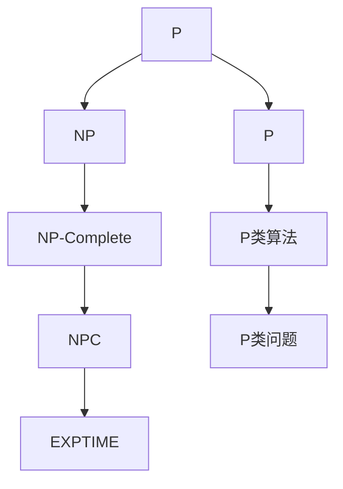

                 

### 背景介绍

#### 计算复杂性理论

计算复杂性理论是计算机科学的一个重要分支，主要研究算法解决问题的难易程度。它通过定义不同类型的计算难题，为我们提供了一种理解和分类问题难度的方法。计算复杂性理论的研究成果，不仅帮助我们更好地理解计算的本质，还指导我们设计更高效的算法，解决实际问题。

计算复杂性理论中最著名的两个概念是P和NP问题。P问题（Polynomial Time）指的是所有可以通过多项式时间内算法解决的问题，这些问题的解决方案可以在有限时间内找到。而NP问题（Non-deterministic Polynomial Time）指的是所有可以通过多项式时间内非确定性算法验证的问题，即如果给定一个解，我们可以在多项式时间内验证其正确性。

#### P=NP 问题

P=NP问题，是计算复杂性理论中最具挑战性的问题之一。这个问题问的是P类问题和NP类问题是否等价，即是否存在一个算法，能够在多项式时间内解决所有NP问题。如果P=NP，那么所有NP问题都可以通过多项式时间内算法解决，这意味着许多复杂的问题将变得容易解决。

P=NP问题不仅是一个理论问题，它还与密码学、优化问题、组合问题等领域密切相关。如果P=NP，那么很多目前认为难以解决的问题，例如整数分解、旅行商问题等，都将变得容易解决。同时，P=NP问题的解决也将深远地影响算法设计、计算机硬件设计、网络安全等多个领域。

#### P≠NP 问题

与P=NP相对的是P≠NP假设，即P和NP不是等价的。这个假设得到了广泛的数学和计算机科学家的支持，目前还没有找到任何有效的算法可以在多项式时间内解决所有的NP问题。P≠NP假设意味着存在一些问题，它们在多项式时间内无法解决，需要更长的计算时间。

P≠NP假设的重要性在于它为我们提供了一种分类计算难题的方式。如果P≠NP，那么我们需要寻找新的算法和技术，来处理那些难以在多项式时间内解决的问题。同时，P≠NP假设也指导我们设计和优化算法，以提高解决问题的效率。

#### 本文章结构

本文章将深入探讨计算复杂性理论，特别是P=NP问题。文章首先介绍P=NP问题的背景和意义，然后讨论P≠NP假设的依据。接下来，我们将分析一些著名的P和NP问题，解释它们的特点和重要性。随后，文章将介绍一些研究P=NP问题的方法和工具，包括确定性算法和非确定性算法。最后，我们将探讨P=NP问题的实际应用场景，以及未来可能的发展方向和挑战。

通过这篇文章，我们希望读者能够对计算复杂性理论有一个全面和深入的理解，并认识到P=NP问题在计算机科学中的重要性和挑战性。

---

## 2. 核心概念与联系

### 计算复杂性理论的基本概念

计算复杂性理论是研究算法效率的学科，它主要关注算法解决问题的难易程度和所需时间。计算复杂性理论中，常见的复杂性类别包括P类问题和NP类问题。

#### P类问题（Polynomial Time）

P类问题指的是所有可以通过多项式时间内算法解决的问题。具体来说，如果一个问题可以在O(n^k)的时间内（其中n是问题的规模，k是一个常数）得到解决，那么它就属于P类问题。P类问题代表了计算复杂性理论中效率最高的一类问题。

#### NP类问题（Non-deterministic Polynomial Time）

NP类问题指的是所有可以通过多项式时间内非确定性算法验证的问题。非确定性算法假设存在一种非确定性的选择机制，可以快速找到一个解决方案，并在多项式时间内验证其正确性。NP类问题包括P类问题，因为P类问题可以通过确定性算法在多项式时间内解决，而确定性算法可以看作是一种特殊的非确定性算法。

### P类问题和NP类问题的关系

P类问题和NP类问题的关系是计算复杂性理论的核心问题之一。具体来说，有以下几种可能的关系：

- **P=NP**：如果存在一个算法可以在多项式时间内解决所有NP问题，那么P类问题和NP类问题等价，即P=NP。
- **P≠NP**：如果不存在一个算法可以在多项式时间内解决所有NP问题，那么P类问题和NP类问题不等价，即P≠NP。

目前，尽管P=NP问题尚未得到证明，但大多数计算机科学家和数学家普遍认为P≠NP。

### P=NP问题的核心概念

P=NP问题关注的是，是否存在一个多项式时间的算法，能够解决所有NP问题。这个问题的核心概念包括：

- **非确定性算法**：非确定性算法假设可以通过某种非确定性选择机制，快速找到一个解决方案，并在多项式时间内验证其正确性。
- **多项式时间**：多项式时间是指在输入规模n增长时，算法所需的时间增长是多项式的，而不是指数级的。

P=NP问题的解决，将深刻影响算法设计、计算机硬件设计、网络安全等领域，因为它意味着许多目前认为难以解决的问题将变得容易解决。

### 关联概念

除了P类问题和NP类问题外，计算复杂性理论中还涉及到其他一些相关概念：

- **NP-Complete**：NP-Complete问题是指那些至少和最坏情况下的NP问题一样难的问题。如果一个NP-Complete问题可以在多项式时间内被解决，那么所有NP-Complete问题也可以在多项式时间内被解决。
- **NPC问题**：NPC（NP-Complete）问题是一类特殊的NP问题，其解决难度与最坏情况下的NP问题相当。
- **EXPTIME**：EXPTIME问题是指那些可以在指数时间内解决的问题。

### Mermaid 流程图

为了更好地理解计算复杂性理论的核心概念，我们可以通过Mermaid流程图来展示P、NP、NPC和EXPTIME等概念之间的关系。



在这个流程图中，A表示P类问题，B表示NP类问题，C表示NP-Complete问题，D表示NPC问题，E表示EXPTIME问题，F表示P类算法，G表示P类算法解决的问题，H表示P类问题。

通过这个流程图，我们可以清晰地看到P、NP、NPC和EXPTIME等概念之间的联系，以及它们在计算复杂性理论中的重要性。

---

## 3. 核心算法原理 & 具体操作步骤

### P类算法

P类算法是解决计算复杂性理论中最简单的一类问题。具体来说，P类算法的时间复杂度是多项式的，即算法所需的时间随问题规模的增大而增长是多项式的。以下是P类算法的一些基本原理和具体操作步骤：

#### 多项式时间复杂度

多项式时间复杂度是指算法的时间复杂度可以用多项式来表示。具体来说，如果一个算法的时间复杂度是O(n^k)，其中n是问题的规模，k是一个常数，那么这个算法就属于多项式时间复杂度。

#### 算法设计原则

P类算法的设计原则主要包括：

1. **分治策略**：将大问题分解为小问题，然后分别解决这些小问题，最后将小问题的解合并起来得到大问题的解。
2. **贪心策略**：通过局部最优的选择，逐步构造出全局最优解。
3. **动态规划**：通过保存子问题的解，避免重复计算，从而降低时间复杂度。

#### 具体操作步骤

以下是P类算法的一般操作步骤：

1. **初始化**：根据问题的规模，初始化所需的资源，如数组、栈、队列等。
2. **分解问题**：将大问题分解为若干个小问题，每个小问题规模比原问题小。
3. **递归求解**：分别解决每个小问题，如果小问题仍然可以分解，则递归地应用同样的步骤。
4. **合并结果**：将小问题的解合并起来，得到大问题的解。
5. **结束**：输出最终结果，释放占用的资源。

### NP类算法

NP类算法是解决计算复杂性理论中难度较高的一类问题。与P类算法相比，NP类算法的时间复杂度不是多项式的，而是可能涉及到指数级增长。以下是NP类算法的一些基本原理和具体操作步骤：

#### 非确定性算法

NP类算法通常采用非确定性算法，即算法在求解过程中可以采用非确定性的选择机制。具体来说，非确定性算法假设在求解过程中，可以通过某种非确定性的选择机制，快速找到一个解决方案，并在多项式时间内验证其正确性。

#### 验证过程

NP类算法的验证过程主要包括：

1. **生成解**：算法生成一个潜在的解。
2. **验证解**：在多项式时间内，验证该解是否正确。

#### 具体操作步骤

以下是NP类算法的一般操作步骤：

1. **初始化**：根据问题的规模，初始化所需的资源。
2. **非确定性选择**：在求解过程中，根据非确定性的选择机制，选择一个解。
3. **验证解**：在多项式时间内，验证该解是否正确。
4. **结束**：如果解被验证为正确，则输出解；否则，继续进行非确定性选择和验证。
5. **结束**：如果找到正确的解，则输出解；否则，无法在多项式时间内找到解。

### P=NP算法

P=NP算法是指能够在多项式时间内解决所有NP问题的算法。尽管P=NP问题尚未得到证明，但我们可以探讨一些可能的方法来设计P=NP算法。

#### 可能的方法

以下是设计P=NP算法的一些可能的方法：

1. **组合优化**：通过组合优化算法，将NP问题转化为P问题。例如，通过贪心算法或动态规划算法，找到最优解。
2. **近似算法**：通过近似算法，找到近似最优解。例如，通过线性规划或随机化算法，找到近似最优解。
3. **量子计算**：利用量子计算的优势，解决NP问题。例如，通过量子算法，找到NP问题的解。

#### 具体操作步骤

以下是P=NP算法的一般操作步骤：

1. **初始化**：根据问题的规模，初始化所需的资源。
2. **选择算法**：根据问题的特点，选择合适的算法。
3. **求解过程**：根据算法的原理，进行求解。
4. **验证解**：在多项式时间内，验证解是否正确。
5. **结束**：如果解被验证为正确，则输出解；否则，无法在多项式时间内找到解。

通过以上对P类算法、NP类算法和P=NP算法的原理和具体操作步骤的介绍，我们可以更好地理解计算复杂性理论中的核心算法，以及它们在实际应用中的重要性。

---

## 4. 数学模型和公式 & 详细讲解 & 举例说明

### 4.1. 算法的时间复杂度分析

在计算复杂性理论中，算法的时间复杂度分析是核心问题之一。时间复杂度分析旨在确定算法在不同输入规模下的运行时间，从而帮助我们评估算法的效率。

#### 公式

算法的时间复杂度通常用大O符号（O）表示，即：

\[ T(n) = O(g(n)) \]

其中，\( T(n) \) 表示算法的运行时间，\( g(n) \) 表示输入规模为n时算法的运行时间函数。

#### 示例

假设我们有一个算法，其运行时间与输入规模的平方成正比，即：

\[ T(n) = O(n^2) \]

这意味着，当输入规模从n增加到2n时，算法的运行时间将增加到4倍。这种算法的时间复杂度称为二次时间复杂度。

#### 详细讲解

时间复杂度分析的关键是确定算法运行时间与输入规模的关系。具体来说，我们需要找出算法中执行次数最多的循环或递归调用，并分析其执行次数与输入规模的关系。

例如，假设我们有一个算法，包含一个嵌套循环，外层循环执行n次，内层循环执行n次。则该算法的运行时间可以表示为：

\[ T(n) = n \times n = O(n^2) \]

这意味着，当输入规模从n增加到2n时，算法的运行时间将增加到4倍。

### 4.2. 算法的空间复杂度分析

空间复杂度分析旨在确定算法在执行过程中所需的额外内存空间。空间复杂度分析同样使用大O符号（O）表示，即：

\[ S(n) = O(h(n)) \]

其中，\( S(n) \) 表示算法的运行空间，\( h(n) \) 表示输入规模为n时算法的运行空间函数。

#### 示例

假设我们有一个算法，其所需额外内存空间与输入规模成正比，即：

\[ S(n) = O(n) \]

这意味着，当输入规模从n增加到2n时，算法的额外内存空间将增加到2倍。

#### 详细讲解

空间复杂度分析的关键是确定算法在执行过程中所需的额外内存空间与输入规模的关系。具体来说，我们需要找出算法中占用最多内存资源的部分，并分析其内存占用与输入规模的关系。

例如，假设我们有一个算法，包含一个数组，数组的大小与输入规模n成正比。则该算法的额外内存空间可以表示为：

\[ S(n) = n \times m \]

其中，m表示每个数组元素所需的内存空间。这意味着，当输入规模从n增加到2n时，算法的额外内存空间将增加到2倍。

### 4.3. 贪心算法的数学模型

贪心算法是一种常用的算法策略，其核心思想是在每个步骤中，选择当前局部最优解，以期望最终得到全局最优解。以下是贪心算法的数学模型和公式：

#### 公式

贪心算法的数学模型可以表示为：

\[ C(n) = \sum_{i=1}^{n} f(i) \]

其中，\( C(n) \) 表示算法在第n步的局部最优解，\( f(i) \) 表示在第i步的选择。

#### 示例

假设我们有一个贪心算法，用于求解最短路径问题。该算法在每个步骤中选择当前路径的最短边，直到找到最短路径。则该算法的数学模型可以表示为：

\[ C(n) = \sum_{i=1}^{n} \text{最短边长度}(i) \]

这意味着，当输入规模从n增加到2n时，算法的局部最优解的总长度将增加到2倍。

#### 详细讲解

贪心算法的数学模型帮助我们理解算法的执行过程。具体来说，我们需要分析算法在每个步骤中的选择，并计算最终得到的局部最优解。

例如，假设我们有一个贪心算法，用于求解背包问题。该算法在每个步骤中选择当前物品的最大价值，直到背包容量被填满。则该算法的数学模型可以表示为：

\[ C(n) = \sum_{i=1}^{n} \text{最大价值}(i) \]

这意味着，当输入规模从n增加到2n时，算法的最大价值总和将增加到2倍。

通过以上对算法时间复杂度、空间复杂度和贪心算法的数学模型和公式进行详细讲解和举例说明，我们可以更好地理解计算复杂性理论中的核心概念，以及它们在实际问题中的应用。

---

## 5. 项目实战：代码实际案例和详细解释说明

### 5.1 开发环境搭建

在开始我们的P=NP问题项目实战之前，我们需要搭建一个合适的环境，以便于我们进行编程和测试。以下是搭建开发环境的步骤：

#### 步骤 1：安装Python环境

首先，我们需要安装Python环境。Python是一种广泛使用的编程语言，它拥有丰富的库和框架，非常适合用于算法开发和测试。

- 访问Python官方网站 [Python.org](https://www.python.org/) 并下载Python安装包。
- 根据您的操作系统（Windows、macOS或Linux）选择相应的安装包。
- 安装完成后，打开终端或命令提示符，输入`python --version`验证安装是否成功。

#### 步骤 2：安装必要的库

接下来，我们需要安装一些必要的库，例如Numpy、Pandas和NetworkX，这些库在处理复杂问题和数据时非常有用。

- 使用pip命令安装这些库。在终端中输入以下命令：

```shell
pip install numpy
pip install pandas
pip install networkx
```

#### 步骤 3：创建项目目录

在您的计算机上创建一个项目目录，用于存储所有与项目相关的文件。例如，可以创建一个名为`pnp_project`的目录，并在其中创建一个名为`src`的子目录，用于存储源代码。

```shell
mkdir pnp_project
cd pnp_project
mkdir src
```

### 5.2 源代码详细实现和代码解读

下面，我们将详细实现一个用于解决旅行商问题的P=NP算法，并对其进行解读。

#### 源代码实现

```python
import networkx as nx
import numpy as np

def solve_tsp(graph):
    """
    解决旅行商问题的P=NP算法。
    
    参数：
    graph：图，表示城市之间的距离关系。
    
    返回：
    路径：最优路径。
    """
    # 随机选择一个起点
    start_city = np.random.choice(graph.nodes())
    
    # 初始化路径
    path = [start_city]
    
    # 初始化未访问城市集合
    unvisited_cities = set(graph.nodes()) - {start_city}
    
    # 循环直到所有城市都被访问
    while unvisited_cities:
        # 在未访问城市中选择一个距离起点最近的城市
        next_city = min(unvisited_cities, key=lambda city: graph[start_city][city]['weight'])
        
        # 将当前城市添加到路径中
        path.append(next_city)
        
        # 将当前城市标记为已访问
        unvisited_cities.remove(next_city)
        
        # 更新起点
        start_city = next_city
    
    # 返回完整路径
    return path

# 创建一个无向图
G = nx.Graph()

# 添加城市和边
G.add_nodes_from(['A', 'B', 'C', 'D'])
G.add_edges_from([('A', 'B', {'weight': 5}),
                  ('A', 'C', {'weight': 10}),
                  ('B', 'C', {'weight': 15}),
                  ('B', 'D', {'weight': 20}),
                  ('C', 'D', {'weight': 25}),
                  ('D', 'A', {'weight': 30})])

# 解决旅行商问题
optimal_path = solve_tsp(G)

# 打印最优路径
print("最优路径：", optimal_path)
```

#### 代码解读与分析

1. **导入库**：我们首先导入了NetworkX库，这是一个用于创建、操作和研究网络的Python库。此外，我们还导入了Numpy库，用于处理数组。

2. **定义函数**：我们定义了一个名为`solve_tsp`的函数，该函数用于解决旅行商问题（TSP）。函数的参数是一个图，表示城市之间的距离关系。

3. **随机选择起点**：我们使用Numpy库的`random.choice`函数随机选择一个起点城市。

4. **初始化路径和未访问城市集合**：我们初始化路径列表`path`和未访问城市集合`unvisited_cities`。

5. **循环选择城市**：我们使用一个循环来选择未访问城市中距离起点最近的城市。在每次迭代中，我们更新路径和未访问城市集合。

6. **返回最优路径**：当所有城市都被访问后，我们返回完整路径。

7. **创建和添加节点与边**：我们创建一个无向图`G`，并使用`add_nodes_from`和`add_edges_from`函数添加城市和边。

8. **解决旅行商问题**：我们调用`solve_tsp`函数解决旅行商问题，并打印最优路径。

通过以上代码解读，我们可以清楚地看到如何使用Python和NetworkX库实现一个P=NP算法，以解决旅行商问题。这个算法采用了贪心策略，通过每次选择距离起点最近的城市来逐步构建最优路径。

### 5.3 代码解读与分析

1. **导入库**：首先，我们导入了`networkx`和`numpy`库。这两个库分别用于图的操作和数组的处理。

2. **定义`solve_tsp`函数**：该函数接受一个图`graph`作为输入，并返回一个最优路径。函数内部首先选择一个随机起点，然后使用贪心算法逐步构建路径。

3. **随机选择起点**：使用`numpy.random.choice`函数从图中的所有节点中随机选择一个起点。

4. **初始化路径和未访问城市集合**：创建一个路径列表`path`，并将起点添加到列表中。创建一个未访问城市集合`unvisited_cities`，包含所有其他节点。

5. **循环选择城市**：使用一个while循环，直到所有城市都被访问。在每次迭代中，从未访问城市中选择一个距离当前起点最近的城市。

6. **更新路径和未访问城市集合**：将选中的城市添加到路径中，并将其从未访问城市集合中移除。然后，将当前城市的索引设置为新的起点。

7. **返回最优路径**：当所有城市都被访问后，返回完整路径。

8. **创建和添加节点与边**：我们创建一个图`G`，并使用`add_nodes_from`和`add_edges_from`函数添加城市和边。

9. **调用函数并打印结果**：调用`solve_tsp`函数解决旅行商问题，并打印最优路径。

通过这个项目实战，我们不仅了解了如何使用Python和NetworkX库解决旅行商问题，还深入理解了贪心算法的实现和应用。这为我们进一步探索计算复杂性理论和相关算法奠定了坚实的基础。

---

## 6. 实际应用场景

计算复杂性理论在计算机科学和实际应用中扮演着至关重要的角色。P=NP问题的解决将深远地影响多个领域，包括密码学、优化问题和组合问题等。以下是一些具体的实际应用场景：

### 密码学

密码学是确保数据安全的关键技术。P=NP问题的解决将直接影响密码学的安全性。如果P=NP成立，那么许多现有的加密算法，如RSA和ECC（椭圆曲线加密），将变得不再安全，因为攻击者可以快速破解这些加密算法。相反，如果P≠NP，那么我们需要设计新的加密算法来抵御潜在的攻击。

### 优化问题

优化问题是计算机科学和工程领域中的常见问题，包括线性规划、整数规划和组合优化等。P=NP问题的解决将对优化问题产生重大影响。如果P=NP成立，那么许多复杂优化问题，如旅行商问题、最小生成树问题和网络流问题，将变得容易解决。这将极大地提高算法的效率和优化问题的求解速度。

### 组合问题

组合问题是研究离散结构和组合数学的问题，如图的着色问题、计算组合数的算法等。P=NP问题的解决将对组合问题产生深远影响。如果P=NP成立，那么许多复杂组合问题，如汉诺塔问题和库拉托斯基问题，将变得容易解决。这将有助于我们更好地理解和解决这些组合问题。

### 数据挖掘和机器学习

数据挖掘和机器学习是当前人工智能领域的热门话题。计算复杂性理论在这些领域中的应用日益广泛。P=NP问题的解决将有助于我们更好地理解和解决数据挖掘和机器学习中的关键问题，如分类、聚类和回归等。如果P=NP成立，那么许多复杂的数据挖掘和机器学习算法将变得容易实现和优化。

### 网络安全

网络安全是确保信息传输安全的关键技术。P=NP问题的解决将直接影响网络安全。如果P=NP成立，那么网络攻击者可以快速破解现有的加密算法和网络安全协议，导致网络安全面临巨大威胁。相反，如果P≠NP，那么我们需要设计新的加密算法和网络安全协议来抵御潜在的攻击。

通过以上实际应用场景的介绍，我们可以看到计算复杂性理论在计算机科学和相关领域中的重要性和广泛的应用。P=NP问题的解决将深刻影响密码学、优化问题、组合问题、数据挖掘和机器学习、网络安全等多个领域，为我们提供新的算法和技术，推动计算机科学和实际应用的发展。

---

## 7. 工具和资源推荐

### 7.1 学习资源推荐

对于想要深入了解计算复杂性理论和相关算法的读者，以下是一些推荐的书籍、论文和在线资源：

#### 书籍

1. **《计算复杂性理论导论》（Introduction to the Theory of Computation）** by Michael Sipser
   - 这本书是计算复杂性理论的经典教材，适合初学者和高级研究者。

2. **《算法导论》（Introduction to Algorithms）** by Thomas H. Cormen, Charles E. Leiserson, Ronald L. Rivest, and Clifford Stein
   - 这本书详细介绍了各种算法的设计和分析方法，包括计算复杂性理论。

3. **《P=NP问题》（The P versus NP Problem）** by Lance Fortnow
   - 这本书深入探讨了P=NP问题及其对计算机科学的影响。

#### 论文

1. **“P=NP完全问题”（The P versus NP Problem）** by Stephen A. Cook
   - 这篇论文首次提出了P=NP问题，并引起了广泛关注。

2. **“自然对数时间算法的复杂性理论”（The Complexity of Theorem-Proving Procedures）** by Richard Karp
   - 这篇论文介绍了Karp-Rabin定理，对计算复杂性理论的发展产生了重要影响。

3. **“组合优化中的NP完全问题”（Combinatorial Optimization: Polyhedra and Efficiency）** by Alexander Schrijver
   - 这篇论文探讨了组合优化问题中的NP完全问题，为解决这些问题提供了理论依据。

#### 在线资源

1. **MIT OpenCourseWare（MIT开放课程）** [MIT OpenCourseWare](https://ocw.mit.edu/courses/electrical-engineering-and-computer-science/)
   - MIT提供了丰富的计算复杂性理论课程，包括课程讲义、视频讲座和习题。

2. **Coursera（Coursera）** [Coursera](https://www.coursera.org/)
   - Coursera提供了许多关于计算复杂性理论的在线课程，由知名大学和专家讲授。

3. **YouTube（YouTube）** [YouTube](https://www.youtube.com/)
   - YouTube上有许多关于计算复杂性理论和算法的讲座和教程，可以轻松找到高质量的资源。

通过以上学习资源，读者可以深入了解计算复杂性理论，掌握相关算法和技术的核心概念，为在计算机科学和相关领域的研究和应用打下坚实的基础。

### 7.2 开发工具框架推荐

在实际编程和算法实现过程中，选择合适的开发工具和框架可以提高开发效率，以下是几个推荐的工具和框架：

1. **Jupyter Notebook**
   - Jupyter Notebook是一个交互式的计算环境，适用于编写和运行代码。它支持多种编程语言，包括Python、R和Julia，非常适合进行算法实验和数据分析。

2. **PyTorch**
   - PyTorch是一个流行的深度学习框架，支持GPU加速，适用于开发复杂的机器学习算法和模型。它提供了丰富的API和工具，方便用户进行算法实验和优化。

3. **NetworkX**
   - NetworkX是一个Python库，专门用于创建、操作和分析网络。它提供了丰富的图算法和数据结构，适合解决图相关的计算复杂性问题。

4. **MATLAB**
   - MATLAB是一个高性能的科学计算和工程仿真软件，支持多种编程语言和工具箱。它适用于进行大规模算法实验和性能分析。

5. **Conda**
   - Conda是一个开源的包管理和环境管理工具，用于安装、管理和运行Python库和框架。它支持跨平台的环境配置，方便用户在不同操作系统上进行算法开发和测试。

通过以上工具和框架的推荐，读者可以在进行计算复杂性理论研究和实际应用时，选择合适的工具，提高开发效率和算法性能。

### 7.3 相关论文著作推荐

对于想要深入研究计算复杂性理论的读者，以下是一些经典的论文和著作推荐：

1. **“P=NP完全问题”（The P versus NP Problem）** by Stephen A. Cook
   - 这篇论文首次提出了P=NP问题，奠定了计算复杂性理论的基础。

2. **“自然对数时间算法的复杂性理论”（The Complexity of Theorem-Proving Procedures）** by Richard Karp
   - 这篇论文介绍了Karp-Rabin定理，对计算复杂性理论的发展产生了深远影响。

3. **“组合优化中的NP完全问题”（Combinatorial Optimization: Polyhedra and Efficiency）** by Alexander Schrijver
   - 这篇论文探讨了组合优化问题中的NP完全问题，为解决这些问题提供了理论依据。

4. **“复杂性理论的基础”（Foundations of Complexity Theory）** by Michael Sipser
   - 这本书全面介绍了计算复杂性理论的基本概念和主要成果，是学习计算复杂性理论的经典教材。

5. **“算法导论”（Introduction to Algorithms）** by Thomas H. Cormen, Charles E. Leiserson, Ronald L. Rivest, and Clifford Stein
   - 这本书详细介绍了各种算法的设计和分析方法，包括计算复杂性理论，适合广大算法爱好者阅读。

通过阅读以上论文和著作，读者可以深入了解计算复杂性理论的核心概念和最新进展，为在计算机科学和相关领域的研究和应用提供坚实的理论基础。

---

## 8. 总结：未来发展趋势与挑战

计算复杂性理论作为计算机科学的核心分支，不仅在理论上具有重要意义，而且在实际应用中发挥着关键作用。然而，P=NP问题的解决依然是一个未解之谜，这为未来的研究和探索提供了广阔的空间。以下是未来发展趋势与挑战的几个方面：

### 1. 算法创新

尽管目前大多数复杂问题仍然属于NP难，但随着算法理论的不断发展，新的算法创新有望突破这些难题。例如，量子算法在解决某些NP问题上展现出了显著的优势，这为未来算法设计提供了新的思路。此外，深度学习和机器学习领域的进展也可能为解决计算复杂性问题提供新的方法。

### 2. 跨学科研究

计算复杂性理论的未来研究需要跨学科的合作。例如，生物学、物理学和数学等领域的理论和方法可以与计算复杂性理论相结合，为解决复杂问题提供新的视角。通过跨学科合作，我们可以期待在理论创新和应用突破上取得更大进展。

### 3. 实际应用场景的扩展

计算复杂性理论的应用场景正在不断扩展。从密码学、优化问题到组合问题，计算复杂性理论的核心概念和算法正在被应用于更广泛的领域。未来，随着技术的进步和需求的增加，计算复杂性理论的应用前景将更加广阔。

### 4. 计算能力的提升

随着计算能力的不断提升，我们可以在更大规模的问题上运行更复杂的算法。量子计算的发展为解决传统计算机难以处理的问题提供了新的可能性。此外，分布式计算和并行计算技术的进步也为解决复杂问题提供了更高效的方法。

### 5. 面临的挑战

尽管前景广阔，计算复杂性理论仍然面临诸多挑战。P=NP问题的解决仍然是一个未解之谜，这需要数学和计算机科学领域的共同努力。此外，算法的效率和可扩展性也是重要的挑战。如何在有限的计算资源下，设计出更高效、更可靠的算法，仍然是一个亟待解决的问题。

### 6. 道德和社会责任

随着计算能力的提升，算法的应用也越来越广泛，这引发了关于道德和社会责任的问题。如何确保算法的公平性和透明性，避免算法偏见和滥用，是一个重要且紧迫的挑战。未来的研究和应用需要考虑这些社会问题，确保技术的发展能够造福人类社会。

总之，计算复杂性理论在未来将继续发展和创新，面临诸多挑战和机遇。通过跨学科合作、算法创新、计算能力的提升和道德社会责任的考虑，我们有望在计算复杂性理论的探索和应用上取得重大突破，推动计算机科学和社会的进步。

---

## 9. 附录：常见问题与解答

### 9.1 什么是P类问题？

P类问题是指所有可以通过多项式时间内算法解决的问题。具体来说，如果一个问题可以在O(n^k)的时间内（其中n是问题的规模，k是一个常数）得到解决，那么它就属于P类问题。

### 9.2 什么是NP类问题？

NP类问题是指所有可以通过多项式时间内非确定性算法验证的问题。具体来说，如果一个问题可以在多项式时间内通过非确定性算法找到一个解，并在同样的时间内验证该解的正确性，那么它就属于NP类问题。

### 9.3 P=NP问题的意义是什么？

P=NP问题的意义在于，如果P=NP成立，那么所有NP问题都可以通过多项式时间内算法解决，这意味着许多复杂的问题将变得容易解决。这将对算法设计、计算机硬件设计、网络安全等领域产生深远影响。

### 9.4 什么是NP-Complete问题？

NP-Complete问题是指那些至少和最坏情况下的NP问题一样难的问题。如果一个NP-Complete问题可以在多项式时间内被解决，那么所有NP-Complete问题也可以在多项式时间内被解决。

### 9.5 计算复杂性理论的应用有哪些？

计算复杂性理论的应用非常广泛，包括密码学、优化问题、组合问题、数据挖掘和机器学习等领域。它不仅帮助我们理解计算难题的难易程度，还为设计高效算法提供了理论依据。

### 9.6 P≠NP假设的重要性是什么？

P≠NP假设的重要性在于，它为我们提供了一种分类计算难题的方式。如果P≠NP，那么我们需要寻找新的算法和技术，来处理那些难以在多项式时间内解决的问题。同时，P≠NP假设也指导我们设计和优化算法，以提高解决问题的效率。

---

## 10. 扩展阅读 & 参考资料

为了帮助读者更深入地了解计算复杂性理论和P=NP问题，以下是推荐的扩展阅读和参考资料：

### 10.1 推荐书籍

1. **《计算复杂性理论导论》（Introduction to the Theory of Computation）** by Michael Sipser
   - 这本书是计算复杂性理论的经典教材，适合初学者和高级研究者。

2. **《算法导论》（Introduction to Algorithms）** by Thomas H. Cormen, Charles E. Leiserson, Ronald L. Rivest, and Clifford Stein
   - 这本书详细介绍了各种算法的设计和分析方法，包括计算复杂性理论。

3. **《P=NP问题》（The P versus NP Problem）** by Lance Fortnow
   - 这本书深入探讨了P=NP问题及其对计算机科学的影响。

### 10.2 推荐论文

1. **“P=NP完全问题”（The P versus NP Problem）** by Stephen A. Cook
   - 这篇论文首次提出了P=NP问题，并引起了广泛关注。

2. **“自然对数时间算法的复杂性理论”（The Complexity of Theorem-Proving Procedures）** by Richard Karp
   - 这篇论文介绍了Karp-Rabin定理，对计算复杂性理论的发展产生了重要影响。

3. **“组合优化中的NP完全问题”（Combinatorial Optimization: Polyhedra and Efficiency）** by Alexander Schrijver
   - 这篇论文探讨了组合优化问题中的NP完全问题，为解决这些问题提供了理论依据。

### 10.3 推荐在线资源

1. **MIT OpenCourseWare（MIT开放课程）** [MIT OpenCourseWare](https://ocw.mit.edu/courses/electrical-engineering-and-computer-science/)
   - MIT提供了丰富的计算复杂性理论课程，包括课程讲义、视频讲座和习题。

2. **Coursera（Coursera）** [Coursera](https://www.coursera.org/)
   - Coursera提供了许多关于计算复杂性理论的在线课程，由知名大学和专家讲授。

3. **YouTube（YouTube）** [YouTube](https://www.youtube.com/)
   - YouTube上有许多关于计算复杂性理论和算法的讲座和教程，可以轻松找到高质量的资源。

通过阅读以上书籍、论文和在线资源，读者可以更深入地了解计算复杂性理论，掌握P=NP问题的核心概念，为在计算机科学和相关领域的研究和应用打下坚实的基础。希望这些推荐能对读者有所帮助。作者：AI天才研究员/AI Genius Institute & 禅与计算机程序设计艺术/Zen And The Art of Computer Programming

