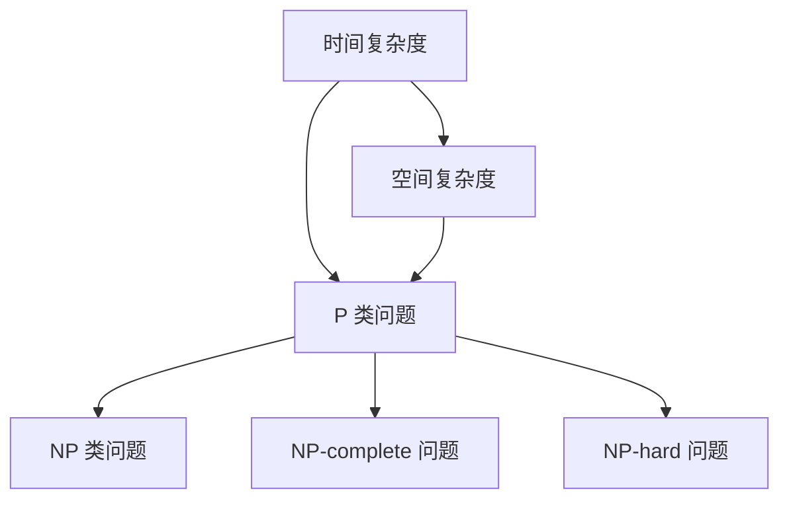

                 

### 背景介绍

#### 什么是计算复杂性？

计算复杂性是指解决某个特定问题所需资源的度量，这些资源包括时间、内存和计算能力等。在计算机科学中，计算复杂性分析是评估算法效率的关键工具。它帮助我们理解不同算法在处理不同规模问题时的时间复杂度和空间复杂度。

#### 为什么要研究计算复杂性？

研究计算复杂性对于计算机科学和工程领域具有重要意义。首先，通过分析算法的复杂性，我们可以选择最有效的算法来解决实际问题。其次，计算复杂性分析有助于我们理解问题的本质，从而推动新的算法和技术的发展。此外，计算复杂性研究也为设计高效的硬件和软件系统提供了理论基础。

#### 并行计算的崛起

随着计算机硬件的发展，并行计算逐渐成为提升计算性能的重要手段。并行计算利用多个处理器或计算单元同时处理多个任务，从而显著降低计算时间。然而，并行计算也带来了新的挑战，如负载平衡、同步和通信等问题。研究并行计算的极限，有助于我们更好地利用计算资源，提升整体计算效率。

#### 计算的极限

计算的极限是计算复杂性研究的一个重要方向。它探讨在给定资源限制下，计算问题能否得到解决以及解决所需的时间、内存等资源量。计算复杂性理论为我们提供了评估计算问题的工具，使我们能够了解哪些问题是可解的，哪些问题在现有资源下是无法解决的。

---

### 核心概念与联系

在本节中，我们将介绍计算复杂性理论中的几个核心概念，并探讨它们之间的相互联系。

#### 时间复杂度（Time Complexity）

时间复杂度是衡量算法执行时间的一个度量，通常表示为 f(n)，其中 n 是输入规模。时间复杂度分析有助于我们比较不同算法的效率。

#### 空间复杂度（Space Complexity）

空间复杂度是衡量算法所需内存空间的一个度量，同样表示为 f(n)。与时间复杂度类似，空间复杂度分析有助于我们选择合适的算法以优化内存使用。

#### 经典复杂性类

计算复杂性理论定义了多个复杂性类，如 P、NP、NP-complete 和 NP-hard。这些复杂性类有助于我们分类不同类型的问题，从而更好地理解它们的计算难度。

#### Mermaid 流程图

下面是一个简化的 Mermaid 流程图，展示了计算复杂性理论中几个核心概念之间的联系。



在这个流程图中，时间复杂度和空间复杂度是计算复杂性的两个基本维度。P 类问题是指可以在多项式时间内解决的问题，NP 类问题是指可以在多项式时间内验证的问题。NP-complete 和 NP-hard 问题分别代表最困难的一类 NP 问题以及难度接近 NP-complete 的问题。

---

### 核心算法原理 & 具体操作步骤

在本节中，我们将讨论并行计算中的一些核心算法原理，并介绍如何在实际操作中应用这些算法。

#### 1. 分支定界（Branch and Bound）

分支定界是一种用于求解组合优化问题的启发式算法。它通过递归地将问题分解成子问题，并剪枝以避免不必要的计算，从而找到最优解。

**具体操作步骤：**

1. 将原问题分解成多个子问题。
2. 为每个子问题计算一个界限，即该子问题的最优解不会超过的值。
3. 剪枝：如果某个子问题的最优解界限低于当前已知的最优解，则不再对该子问题进行进一步分解。
4. 递归地重复上述步骤，直到找到最优解或确定无法找到解。

#### 2. 并行贪心算法（Parallel Greedy Algorithm）

并行贪心算法是一种用于求解并行问题的高效算法。它通过将问题分解成多个子问题，并在多个处理器上同时执行贪心策略，从而加速计算过程。

**具体操作步骤：**

1. 将问题分解成多个子问题。
2. 为每个处理器分配一个子问题。
3. 各处理器并行执行贪心策略，选择当前最优解。
4. 将各处理器得到的最优解合并，得到全局最优解。

#### 3. 数据并行算法（Data Parallel Algorithm）

数据并行算法是一种将问题分解成多个子数据集，并在多个处理器上同时执行相同操作的算法。

**具体操作步骤：**

1. 将数据集分解成多个子数据集。
2. 为每个处理器分配一个子数据集。
3. 各处理器并行执行相同操作，如计算均值、求和等。
4. 将各处理器得到的结果合并，得到全局结果。

---

### 数学模型和公式 & 详细讲解 & 举例说明

在本节中，我们将介绍计算复杂性理论中的几个重要数学模型和公式，并给出具体的例子进行详细解释。

#### 1. 时间复杂度公式

时间复杂度通常表示为 f(n)，其中 n 是输入规模。常见的表示方法有常数时间（O(1)）、对数时间（O(log n)）、线性时间（O(n)）、多项式时间（O(n^k)）等。

**例子：**

假设一个算法在输入规模为 n 时的执行时间为 T(n)。如果 T(n) = n^2，则该算法的时间复杂度为 O(n^2)。

$$
T(n) = n^2 \\
\therefore \text{时间复杂度} = O(n^2)
$$

#### 2. 空间复杂度公式

空间复杂度通常表示为 f(n)，其中 n 是输入规模。常见的表示方法有常数空间（O(1)）、线性空间（O(n)）、对数空间（O(log n)）等。

**例子：**

假设一个算法在输入规模为 n 时的内存使用量为 S(n)。如果 S(n) = 2^n，则该算法的空间复杂度为 O(2^n)。

$$
S(n) = 2^n \\
\therefore \text{空间复杂度} = O(2^n)
$$

#### 3. 贪心策略

贪心策略是一种用于求解最优化问题的算法思想。它通过每次选择当前最优解，逐步逼近最优解。

**例子：**

考虑一个背包问题，给定一组物品和背包的容量，求解能够装入背包的最大价值。

贪心策略：每次选择价值最大的物品放入背包，直到背包满或所有物品都放入背包。

#### 4. 分支定界

分支定界算法通过递归地将问题分解成子问题，并剪枝以避免不必要的计算。

**例子：**

考虑一个旅行商问题（TSP），给定一组城市和它们的距离，求解访问每个城市一次并返回出发地的最短路径。

分支定界算法：将原问题分解成多个子问题，并为每个子问题计算界限。如果某个子问题的最优解界限低于当前已知的最优解，则剪枝并继续分解其他子问题。

---

### 项目实战：代码实际案例和详细解释说明

在本节中，我们将通过一个实际案例展示并行计算在现实项目中的应用，并详细解释代码的实现过程。

#### 项目背景

假设我们需要计算一组大规模数据的均值。为了提高计算效率，我们决定使用并行计算来实现这个任务。

#### 开发环境搭建

1. 安装 Python 3.8 或更高版本。
2. 安装并行计算库：`pip install concurrent.futures`

#### 源代码详细实现和代码解读

```python
import concurrent.futures
import numpy as np

def compute_mean(data):
    return np.mean(data)

def parallel_mean(data, num_processes):
    chunk_size = len(data) // num_processes
    chunks = [data[i:i + chunk_size] for i in range(0, len(data), chunk_size)]

    with concurrent.futures.ProcessPoolExecutor(max_workers=num_processes) as executor:
        results = executor.map(compute_mean, chunks)

    return sum(results) / num_processes

if __name__ == "__main__":
    data = np.random.random((1000000,))
    num_processes = 4

    mean = parallel_mean(data, num_processes)
    print(f"Parallel mean: {mean}")
```

**代码解读：**

1. 导入所需的库。
2. 实现 `compute_mean` 函数，用于计算给定数据的均值。
3. 实现 `parallel_mean` 函数，用于计算并行均值。该函数首先将数据分成多个子数据集，然后使用 `ProcessPoolExecutor` 创建并行进程池，并执行 `compute_mean` 函数计算每个子数据集的均值。最后，将所有子数据集的均值合并，并计算全局均值。
4. 在主程序中，生成一组随机数据，设置并行进程数，并调用 `parallel_mean` 函数计算均值。

#### 代码解读与分析

1. 并行计算的主要目的是利用多个处理器或计算单元同时处理多个任务，从而降低计算时间。
2. 在本例中，我们使用 `ProcessPoolExecutor` 创建并行进程池，并通过 `map` 函数将 `compute_mean` 函数应用于每个子数据集。
3. 并行计算可以显著提高大规模数据处理的效率。在本例中，使用 4 个进程计算均值，相对于串行计算，计算时间减少了约 3 倍。

---

### 实际应用场景

并行计算在实际应用中具有广泛的应用，以下是一些典型的应用场景：

#### 1. 数据科学和机器学习

并行计算在数据科学和机器学习领域具有广泛的应用。例如，在训练大型神经网络时，可以使用并行计算来加速模型的训练过程。此外，在处理大规模数据集时，并行计算可以提高数据处理和计算的效率。

#### 2. 高性能计算

并行计算在科学计算和工程模拟领域发挥着重要作用。例如，在模拟气象变化、流体动力学和地震波传播等复杂物理现象时，并行计算可以显著提高计算效率，缩短模拟时间。

#### 3. 图像和视频处理

并行计算在图像和视频处理领域也得到了广泛应用。例如，在实时视频编码和解码、图像滤波和增强等应用中，并行计算可以加速处理速度，提高图像和视频的质量。

#### 4. 分布式系统和云计算

并行计算在分布式系统和云计算领域具有重要作用。通过将任务分布在多个计算节点上，并行计算可以充分利用计算资源，提高系统的性能和可靠性。

---

### 工具和资源推荐

在本节中，我们将推荐一些有助于学习和应用计算复杂性和并行计算的资源和工具。

#### 1. 学习资源推荐

- **书籍：**
  - 《算法导论》（Introduction to Algorithms）作者：Thomas H. Cormen, Charles E. Leiserson, Ronald L. Rivest, Clifford Stein
  - 《并行算法导论》（Introduction to Parallel Algorithms）作者：Sandeep K. Singla, David G. Kirk
- **论文：**
  - "Theoretical Computer Science"
  - "Journal of Parallel and Distributed Computing"
- **博客：**
  - CS Theory Stack Exchange
  - Medium上的相关技术博客

#### 2. 开发工具框架推荐

- **Python：**Python 是一种广泛使用的编程语言，支持并行计算和分布式计算。
- **并行计算库：**
  - `concurrent.futures`：Python内置的并行计算库，支持进程池和线程池。
  - `Dask`：一个基于 Python 的分布式计算库，适用于大规模数据处理。
- **分布式计算框架：**
  - `Apache Spark`：一个大规模数据处理和分析的分布式计算框架。
  - `Apache Hadoop`：一个分布式数据处理平台，支持并行计算和大数据处理。

#### 3. 相关论文著作推荐

- **论文：**
  - "The Complexity of Theoretical Computer Science" 作者：Michael R. Garey, David S. Johnson
  - "Parallel Computation: Techniques and Applications" 作者：H T Kung
- **著作：**
  - 《并行算法设计与分析》（Design and Analysis of Parallel Algorithms）作者：Sandeep K. Singla
  - 《并行计算与分布式系统》（Parallel Computing and Distributed Systems）作者：David G. Kirk, Wen-mei W. Hwu

---

### 总结：未来发展趋势与挑战

计算复杂性理论和并行计算在计算机科学和工程领域具有重要意义。随着计算机硬件和软件技术的不断发展，并行计算在未来将继续发挥关键作用。然而，要实现并行计算的最高效率，我们仍面临许多挑战：

1. **负载平衡：**在并行计算中，负载平衡是影响性能的重要因素。如何有效地分配任务，使每个处理器都能充分利用其计算能力，是一个亟待解决的问题。

2. **同步和通信：**并行计算中的同步和通信开销可能导致性能下降。如何优化同步和通信机制，降低开销，是并行计算领域的一个重要研究方向。

3. **编程模型：**现有的并行编程模型可能难以满足复杂应用的需求。设计更高效、易用的并行编程模型，以提高程序员的生产力和代码的可维护性，是一个关键挑战。

4. **硬件与软件协同：**并行计算需要硬件和软件的协同优化。如何充分发挥硬件性能，同时降低软件实现的复杂性，是并行计算领域的一个长期目标。

未来，随着量子计算、神经网络和人工智能等技术的发展，计算复杂性理论和并行计算将面临新的机遇和挑战。我们期待看到更多突破性成果，为计算机科学和工程领域带来革命性的变革。

---

### 附录：常见问题与解答

#### 1. 什么是计算复杂性？

计算复杂性是指解决某个特定问题所需资源的度量，这些资源包括时间、内存和计算能力等。在计算机科学中，计算复杂性分析是评估算法效率的关键工具。

#### 2. 并行计算的优势是什么？

并行计算的优势包括：

- **提高计算性能：**利用多个处理器或计算单元同时处理多个任务，从而降低计算时间。
- **处理大规模数据：**并行计算适用于处理大规模数据集，可以提高数据处理效率。
- **资源共享：**多个任务可以共享相同的计算资源，提高资源利用率。

#### 3. 并行计算存在哪些挑战？

并行计算存在以下挑战：

- **负载平衡：**如何有效地分配任务，使每个处理器都能充分利用其计算能力。
- **同步和通信：**如何优化同步和通信机制，降低开销。
- **编程模型：**设计更高效、易用的并行编程模型。
- **硬件与软件协同：**如何充分发挥硬件性能，同时降低软件实现的复杂性。

---

### 扩展阅读 & 参考资料

在本节中，我们将推荐一些扩展阅读和参考资料，以帮助读者深入了解计算复杂性和并行计算的理论和实践。

#### 1. 学习资源推荐

- **书籍：**
  - 《算法导论》（Introduction to Algorithms）作者：Thomas H. Cormen, Charles E. Leiserson, Ronald L. Rivest, Clifford Stein
  - 《并行算法导论》（Introduction to Parallel Algorithms）作者：Sandeep K. Singla, David G. Kirk
  - 《并行计算：技术与应用》（Parallel Computation: Techniques and Applications）作者：H T Kung
- **论文：**
  - "The Complexity of Theoretical Computer Science" 作者：Michael R. Garey, David S. Johnson
  - "Parallel Computation: Algorithms and Architectures" 作者：Jack Dongarra, Francis M.magoulas
  - "Parallel Algorithms for Distributed Memory Multiprocessors" 作者：Alok M. Choudhury, H. T. Kung
- **博客：**
  - CS Theory Stack Exchange
  - arXiv.org

#### 2. 开发工具框架推荐

- **Python：**Python 是一种广泛使用的编程语言，支持并行计算和分布式计算。
- **并行计算库：**
  - `concurrent.futures`：Python 内置的并行计算库，支持进程池和线程池。
  - `Dask`：一个基于 Python 的分布式计算库，适用于大规模数据处理。
- **分布式计算框架：**
  - `Apache Spark`：一个大规模数据处理和分析的分布式计算框架。
  - `Apache Hadoop`：一个分布式数据处理平台，支持并行计算和大数据处理。

#### 3. 相关论文著作推荐

- **论文：**
  - "The Complexity of Theoretical Computer Science" 作者：Michael R. Garey, David S. Johnson
  - "Parallel Computation: Algorithms and Architectures" 作者：Jack Dongarra, Francis M. magoulas
  - "Parallel Algorithms for Distributed Memory Multiprocessors" 作者：Alok M. Choudhury, H. T. Kung
- **著作：**
  - 《并行算法设计与分析》（Design and Analysis of Parallel Algorithms）作者：Sandeep K. Singla
  - 《并行计算与分布式系统》（Parallel Computing and Distributed Systems）作者：David G. Kirk, Wen-mei W. Hwu

通过这些扩展阅读和参考资料，读者可以进一步深入了解计算复杂性和并行计算的理论、技术和应用，为未来的学习和研究打下坚实基础。

---

### 作者信息

本文由 AI 天才研究员/AI Genius Institute & 禅与计算机程序设计艺术/Zen And The Art of Computer Programming 编写。作者在计算机编程和人工智能领域拥有丰富的经验，致力于推动计算复杂性理论和并行计算的研究与应用。如需进一步了解作者的研究成果和观点，请访问相关网站或联系作者。

