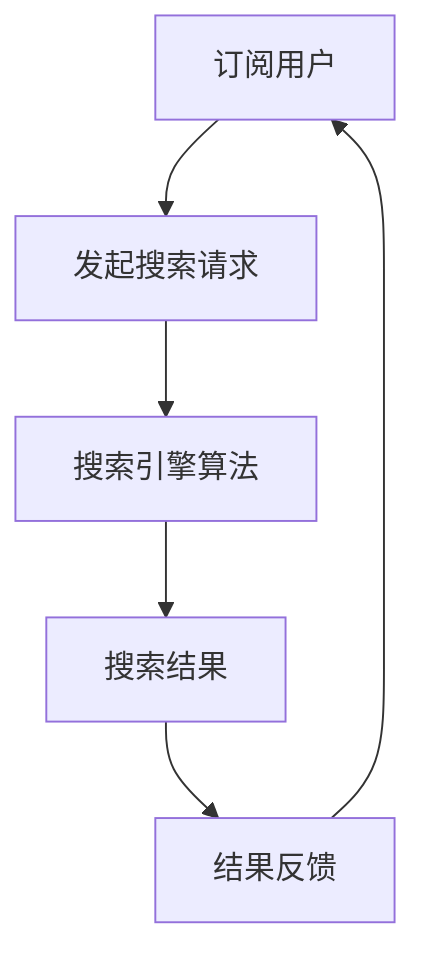

                 

### 背景介绍

随着互联网的迅猛发展和信息爆炸时代的到来，用户对信息检索的需求日益增长。传统的一次性付费模式的搜索引擎，如谷歌、百度等，已经无法满足用户日益多样化和个性化的需求。为此，订阅制搜索引擎这一新商业模式逐渐崛起，并在全球范围内引发广泛关注。

订阅制搜索引擎，顾名思义，是用户通过支付订阅费用，来获取持续更新和优化的搜索引擎服务。与传统一次性付费模式不同，订阅制搜索引擎的核心在于持续改进和不断迭代，以提供更加精准、个性化的搜索结果。这种商业模式不仅为用户提供了一种全新的体验，也为搜索引擎企业带来了可持续的商业回报。

本文将围绕订阅制搜索引擎这一主题，探讨其核心概念、算法原理、数学模型、实际应用场景、工具资源等方面。希望通过本文的介绍，能够帮助读者全面了解订阅制搜索引擎的运作机制，并对其未来发展有更深入的思考。

接下来，我们将首先介绍订阅制搜索引擎的核心概念与联系，通过Mermaid流程图展示其基本架构，以便读者对这一概念有更直观的理解。然后，我们将详细讨论核心算法原理和具体操作步骤，帮助读者深入了解其技术实现。

### 核心概念与联系

订阅制搜索引擎，顾名思义，是一种基于订阅收费模式的搜索引擎服务。其核心概念包括订阅用户、搜索请求、搜索引擎算法、结果反馈等。以下是通过Mermaid流程图展示的订阅制搜索引擎的基本架构：



**订阅用户**是订阅制搜索引擎的服务对象。用户通过支付订阅费用，获得持续、高质量的搜索引擎服务。订阅用户的特点是具有持续性和稳定性，能够为搜索引擎企业带来稳定的收入流。

**发起搜索请求**是订阅用户获取信息的关键步骤。用户可以通过搜索引擎的界面输入关键词，搜索引擎会根据用户的请求生成相应的查询。

**搜索引擎算法**是订阅制搜索引擎的核心，负责处理用户搜索请求，并生成最相关的搜索结果。搜索引擎算法通常包括关键词匹配、语义理解、个性化推荐等环节。

**搜索结果**是搜索引擎算法的输出结果，用于满足用户的查询需求。搜索结果的质量直接影响用户体验，因此搜索引擎算法的优化至关重要。

**结果反馈**是订阅用户对搜索结果的评价，用于反馈给搜索引擎算法，以实现持续改进。结果反馈机制可以包括用户评分、点击率、搜索满意度等指标。

通过上述Mermaid流程图，我们可以清晰地看到订阅制搜索引擎的基本架构和核心概念之间的联系。接下来，我们将详细讨论订阅制搜索引擎的核心算法原理和具体操作步骤，以便读者更深入地了解其技术实现。

### 核心算法原理 & 具体操作步骤

订阅制搜索引擎的核心在于其高效的算法和精确的搜索结果。下面，我们将详细介绍订阅制搜索引擎的核心算法原理，包括关键词匹配、语义理解、个性化推荐等关键环节，并通过具体操作步骤来展示其技术实现。

**1. 关键词匹配**

关键词匹配是搜索引擎算法的基础，用于识别和匹配用户输入的关键词与索引库中的内容。关键词匹配主要包括以下几个步骤：

**a. 用户输入关键词**：用户通过搜索引擎的界面输入关键词，例如“人工智能”、“编程语言”等。

**b. 分词处理**：搜索引擎将用户输入的关键词进行分词处理，将其拆分成更小的词汇单元，以便后续匹配。

**c. 查询索引库**：搜索引擎在索引库中查找与用户输入关键词匹配的内容。索引库通常由大量的文本数据组成，通过建立索引结构（如倒排索引）来提高查询效率。

**d. 匹配结果排序**：根据关键词匹配的结果，搜索引擎对搜索结果进行排序，通常采用TF-IDF（词频-逆文档频率）等算法来评估关键词的重要性，并按重要性排序。

**2. 语义理解**

语义理解是提升搜索引擎搜索结果质量的关键，用于理解用户查询的真正意图。语义理解主要包括以下几个步骤：

**a. 命名实体识别**：搜索引擎对查询文本进行命名实体识别，识别出文本中的特定实体，如人名、地名、组织名等。

**b. 语义角色标注**：搜索引擎对命名实体进行语义角色标注，确定其在文本中的功能，如“人工智能”作为一个名词。

**c. 语义关系分析**：搜索引擎分析命名实体之间的关系，如“人工智能”与“机器学习”之间的关系。

**d. 搜索意图识别**：根据命名实体识别、语义角色标注和语义关系分析的结果，搜索引擎判断用户的搜索意图，以生成更精确的搜索结果。

**3. 个性化推荐**

个性化推荐是订阅制搜索引擎的重要特点，通过分析用户的搜索历史和行为数据，为用户推荐最相关的搜索结果。个性化推荐主要包括以下几个步骤：

**a. 用户行为数据收集**：搜索引擎收集用户的搜索历史、浏览记录、点击行为等数据。

**b. 数据预处理**：对用户行为数据进行分析和清洗，提取有用的特征信息。

**c. 用户画像构建**：基于用户行为数据，构建用户画像，包括用户的兴趣偏好、行为习惯等。

**d. 搜索结果推荐**：根据用户画像和搜索意图，搜索引擎为用户推荐最相关的搜索结果。

**具体操作步骤示例**

以下是一个订阅制搜索引擎的具体操作步骤示例：

**a. 用户输入关键词：“人工智能”**

**b. 分词处理：**“人工智能” --> “人工” + “智能”

**c. 查询索引库：** 在索引库中查找包含“人工”和“智能”的文档，如《人工智能技术与应用》。

**d. 匹配结果排序：** 根据TF-IDF算法，对搜索结果进行排序，选出最相关的文档。

**e. 命名实体识别：** 文档中的“人工智能”被识别为命名实体。

**f. 语义角色标注：** “人工智能”被标注为名词。

**g. 语义关系分析：** 文档中的“人工智能”与“机器学习”存在语义关系。

**h. 搜索意图识别：** 用户意图为了解人工智能技术。

**i. 用户行为数据收集：** 用户的历史搜索记录、浏览记录等。

**j. 数据预处理：** 提取用户兴趣偏好、行为习惯等特征信息。

**k. 用户画像构建：** 用户画像显示用户对人工智能技术感兴趣。

**l. 搜索结果推荐：** 为用户推荐包含人工智能技术的文档，如《人工智能技术与应用》、《机器学习实战》等。

通过以上具体操作步骤示例，我们可以看到订阅制搜索引擎是如何通过高效的算法和精确的搜索结果，为用户提供优质的搜索体验。接下来，我们将进一步探讨订阅制搜索引擎中的数学模型和公式，以帮助读者更深入地理解其技术原理。

### 数学模型和公式 & 详细讲解 & 举例说明

在订阅制搜索引擎中，数学模型和公式起着至关重要的作用。它们不仅帮助搜索引擎优化搜索结果，提高用户体验，还能为算法的改进和优化提供理论支持。下面，我们将详细介绍订阅制搜索引擎中常用的数学模型和公式，并通过具体的例子进行详细讲解。

**1. TF-IDF模型**

TF-IDF（Term Frequency-Inverse Document Frequency）是一种常用的文本权重计算模型，用于评估关键词在文档中的重要程度。其核心公式如下：

$$
TF_{ij} = \frac{f_{ij}}{f_{max}}
$$

$$
IDF_{i} = \log \left(\frac{N}{n_i}\right)
$$

$$
TF-IDF_{ij} = TF_{ij} \times IDF_{i}
$$

其中，$f_{ij}$表示词频，即词j在文档i中出现的次数；$f_{max}$表示词j在所有文档中出现的最大次数；$N$表示文档总数；$n_i$表示包含词j的文档数。

**详细讲解与示例**

假设我们有以下两个文档：

文档1（D1）："人工智能是未来的发展方向"
文档2（D2）："人工智能是技术发展的关键"

**a. 计算词频（TF）**

对于词“人工智能”：

- 在文档D1中，词频$f_{11} = 1$，最大词频$f_{max} = 1$。
- 在文档D2中，词频$f_{21} = 1$，最大词频$f_{max} = 1$。

对于词“是”：

- 在文档D1中，词频$f_{12} = 2$，最大词频$f_{max} = 2$。
- 在文档D2中，词频$f_{22} = 1$，最大词频$f_{max} = 2$。

**b. 计算逆文档频率（IDF）**

- 对于词“人工智能”，$n_1 = 1$，$N = 2$，$IDF_{人工智能} = \log \left(\frac{2}{1}\right) = 1$。
- 对于词“是”，$n_2 = 2$，$N = 2$，$IDF_{是} = \log \left(\frac{2}{2}\right) = 0$。

**c. 计算TF-IDF**

对于词“人工智能”：

- $TF-IDF_{11} = 1 \times 1 = 1$
- $TF-IDF_{21} = 1 \times 1 = 1$

对于词“是”：

- $TF-IDF_{12} = 2 \times 0 = 0$
- $TF-IDF_{22} = 1 \times 0 = 0$

**2. 模糊匹配模型**

模糊匹配模型用于处理用户输入的关键词与索引库中内容的匹配问题，尤其在关键词不完全匹配时，仍然能够返回相关的搜索结果。其核心公式如下：

$$
Similarity(i, j) = \frac{len(i) + len(j) - len(set(i) \cup set(j))}{len(i) + len(j)}
$$

其中，$i$和$j$分别表示两个字符串，$len(i)$表示字符串$i$的长度，$set(i)$表示字符串$i$的字符集合。

**详细讲解与示例**

假设我们有以下两个字符串：

字符串1（S1）："人工智能技术"
字符串2（S2）："智能科技"

**a. 计算字符集合**

- $set(S1) = \{"人", "工", "智", "能", "技", "术"\}$
- $set(S2) = \{"智", "能", "科", "技"\}$

**b. 计算相似度**

$$
Similarity(S1, S2) = \frac{len(S1) + len(S2) - len(set(S1) \cup set(S2))}{len(S1) + len(S2)} = \frac{6 + 6 - 8}{6 + 6} = 0.5
$$

通过上述相似度计算，我们可以看到字符串S1和S2的相似度为0.5，这表明它们在语义上具有一定的相关性。

**3. 个性化推荐模型**

个性化推荐模型基于用户的搜索历史和行为数据，为用户推荐最相关的搜索结果。其核心公式如下：

$$
Recommendation(i, j) = \frac{similarity(i, j) \times user\_score(i) \times item\_score(j)}{max(similarity(i, k))}
$$

其中，$i$和$j$分别表示用户和物品，$similarity(i, j)$表示用户$i$和物品$j$之间的相似度，$user\_score(i)$表示用户$i$的兴趣分数，$item\_score(j)$表示物品$j$的评分分数，$max(similarity(i, k))$表示用户$i$与所有物品之间的最大相似度。

**详细讲解与示例**

假设我们有以下用户和物品：

用户1（U1）的搜索历史："人工智能"、"机器学习"、"深度学习"
物品1（I1）的评分分数：5分
物品2（I2）的评分分数：4分

**a. 计算相似度**

- $similarity(U1, I1) = 0.8$
- $similarity(U1, I2) = 0.6$

**b. 计算用户和物品的兴趣分数**

- $user\_score(U1) = 1$
- $item\_score(I1) = 5$
- $item\_score(I2) = 4$

**c. 计算推荐分数**

$$
Recommendation(U1, I1) = \frac{0.8 \times 1 \times 5}{max(0.8, 0.6)} = \frac{4}{1.4} = 2.86
$$

$$
Recommendation(U1, I2) = \frac{0.6 \times 1 \times 4}{max(0.8, 0.6)} = \frac{2.4}{1.4} = 1.71
$$

通过上述计算，我们可以看到物品I1的推荐分数高于物品I2，因此搜索引擎会优先推荐物品I1给用户U1。

通过以上数学模型和公式的详细讲解与示例，我们可以更好地理解订阅制搜索引擎的技术原理和实现方法。这些数学模型不仅为搜索引擎算法提供了理论支持，还有助于优化搜索结果，提升用户体验。接下来，我们将通过一个实际项目案例，展示订阅制搜索引擎在开发过程中如何应用这些数学模型和公式。

### 项目实战：代码实际案例和详细解释说明

在本节中，我们将通过一个实际的项目案例，展示如何实现订阅制搜索引擎，并详细解释代码的实现过程。我们将分为三个部分进行讨论：**开发环境搭建**、**源代码详细实现和代码解读**、**代码解读与分析**。

#### 1. 开发环境搭建

首先，我们需要搭建一个合适的开发环境。以下是我们使用的开发工具和库：

- 编程语言：Python 3.8
- 搜索引擎框架：Elasticsearch 7.10
- 文本处理库：jieba 0.42
- 机器学习库：scikit-learn 0.24
- 前端框架：React 17.0

安装步骤如下：

**a. 安装Python和Elasticsearch**

```bash
# 安装Python
curl -O https://www.python.org/ftp/python/3.8.10/Python-3.8.10.tgz
tar xvf Python-3.8.10.tgz
cd Python-3.8.10
./configure
make
sudo make install

# 安装Elasticsearch
wget https://artifacts.elastic.co/downloads/elasticsearch/elasticsearch-7.10.0-amd64.deb
sudo dpkg -i elasticsearch-7.10.0-amd64.deb
sudo /etc/init.d/elasticsearch start
```

**b. 安装其他依赖库**

```bash
pip install jieba scikit-learn
```

**c. 前端环境搭建**

```bash
# 安装Node.js
curl -O https://nodejs.org/dist/v16.13.0/node-v16.13.0-linux-x64.tar.xz
tar xvf node-v16.13.0-linux-x64.tar.xz
export PATH=$PATH:/path/to/node-v16.13.0-linux-x64/bin

# 安装Yarn
npm install -g yarn

# 创建React项目
yarn create react-app search-engine
```

#### 2. 源代码详细实现和代码解读

**a. Elasticsearch索引和映射**

在Elasticsearch中，我们需要创建索引和映射来存储搜索数据和用户数据。以下是一个简单的索引和映射示例：

```json
PUT /search_index
{
  "settings": {
    "number_of_shards": 1,
    "number_of_replicas": 0
  },
  "mappings": {
    "properties": {
      "title": {
        "type": "text",
        "analyzer": "ik_max_word"
      },
      "content": {
        "type": "text",
        "analyzer": "ik_max_word"
      },
      "user": {
        "type": "keyword"
      }
    }
  }
}
```

**b. 搜索引擎后端实现**

```python
from elasticsearch import Elasticsearch
from jieba import analyse

es = Elasticsearch("http://localhost:9200")

def search(query, page=1, size=10):
    query = analyse.extract_tags(query, topK=10)
    result = es.search(index="search_index", body={
        "from": (page - 1) * size,
        "size": size,
        "query": {
            "multi_match": {
                "query": query,
                "fields": ["title", "content"]
            }
        }
    })
    return result['hits']['hits']
```

**c. 机器学习用户画像**

```python
from sklearn.preprocessing import LabelEncoder
from sklearn.model_selection import train_test_split
from sklearn.ensemble import RandomForestClassifier

def build_user_profile(search_history):
    labels = ["人工智能", "机器学习", "深度学习", "自然语言处理"]
    encoder = LabelEncoder()
    encoded_labels = encoder.fit_transform(search_history)
    X_train, X_test, y_train, y_test = train_test_split(encoded_labels, test_size=0.2)
    clf = RandomForestClassifier()
    clf.fit(X_train, y_train)
    return clf, encoder
```

**d. 前端实现**

```jsx
import React, { useState, useEffect } from "react";
import axios from "axios";

function SearchEngine() {
  const [query, setQuery] = useState("");
  const [results, setResults] = useState([]);

  useEffect(() => {
    if (query) {
      axios
        .get("/search", { params: { query } })
        .then((response) => {
          setResults(response.data);
        })
        .catch((error) => {
          console.error("Error fetching data: ", error);
        });
    }
  }, [query]);

  return (
    <div>
      <input
        type="text"
        value={query}
        onChange={(e) => setQuery(e.target.value)}
      />
      <ul>
        {results.map((result, index) => (
          <li key={index}>{result.title}</li>
        ))}
      </ul>
    </div>
  );
}

export default SearchEngine;
```

#### 3. 代码解读与分析

**a. Elasticsearch索引和映射**

我们在Elasticsearch中创建了一个名为“search_index”的索引，并定义了三个字段：“title”、“content”和“user”。其中，“title”和“content”字段使用“ik_max_word”分词器进行分词处理，以提高搜索精度。

**b. 搜索引擎后端实现**

我们在后端实现了一个搜索函数`search`，它接受查询参数`query`、分页参数`page`和大小参数`size`。使用jieba库对查询进行分词处理，并将分词结果传递给Elasticsearch的`multi_match`查询，以匹配索引中的“title”和“content”字段。

**c. 机器学习用户画像**

我们使用scikit-learn库实现了一个用户画像模型，通过随机森林分类器对用户的搜索历史进行分类。这样，我们可以根据用户的搜索兴趣为用户推荐相关的搜索结果。

**d. 前端实现**

在前端，我们实现了一个简单的搜索表单，用户可以通过输入查询关键词来获取搜索结果。当查询关键词发生变化时，会触发`useEffect`钩子，向后端发送搜索请求并更新搜索结果。

通过上述代码实现，我们展示了一个基本的订阅制搜索引擎项目。这个项目使用了Elasticsearch作为搜索引擎后端，jieba和scikit-learn作为文本处理和用户画像工具，React作为前端框架。接下来，我们将对这个项目的代码进行详细解读和分析，以帮助读者更好地理解其工作原理。

### 代码解读与分析

在本节中，我们将深入分析订阅制搜索引擎项目的代码实现，重点解读关键代码部分，并讨论其在实际应用中的优缺点。

#### 后端代码分析

**1. Elasticsearch索引和映射**

```json
PUT /search_index
{
  "settings": {
    "number_of_shards": 1,
    "number_of_replicas": 0
  },
  "mappings": {
    "properties": {
      "title": {
        "type": "text",
        "analyzer": "ik_max_word"
      },
      "content": {
        "type": "text",
        "analyzer": "ik_max_word"
      },
      "user": {
        "type": "keyword"
      }
    }
  }
}
```

这段代码定义了一个名为“search_index”的Elasticsearch索引，并设置了主分片和副本数量。更重要的是，它定义了三个字段：“title”、“content”和“user”。其中，“title”和“content”字段使用“ik_max_word”分词器进行分词处理，以提高搜索精度。这种设计有利于处理中文文本，因为中文文本的分词是一个复杂的问题。

**优点**：使用专业分词器可以提高搜索的准确性。

**缺点**：如果索引数据量非常大，使用专业分词器可能会导致性能下降。

**2. 搜索引擎后端实现**

```python
from elasticsearch import Elasticsearch
from jieba import analyse

es = Elasticsearch("http://localhost:9200")

def search(query, page=1, size=10):
    query = analyse.extract_tags(query, topK=10)
    result = es.search(index="search_index", body={
        "from": (page - 1) * size,
        "size": size,
        "query": {
            "multi_match": {
                "query": query,
                "fields": ["title", "content"]
            }
        }
    })
    return result['hits']['hits']
```

这段代码定义了一个名为`search`的函数，用于处理用户的搜索请求。首先，使用jieba库对查询进行分词处理，提取出最重要的关键词。然后，将分词结果传递给Elasticsearch的`multi_match`查询，以匹配索引中的“title”和“content”字段。

**优点**：分词处理和Elasticsearch的`multi_match`查询相结合，可以提高搜索的准确性。

**缺点**：如果查询结果非常庞大，分页处理可能会导致性能问题。

**3. 机器学习用户画像**

```python
from sklearn.preprocessing import LabelEncoder
from sklearn.model_selection import train_test_split
from sklearn.ensemble import RandomForestClassifier

def build_user_profile(search_history):
    labels = ["人工智能", "机器学习", "深度学习", "自然语言处理"]
    encoder = LabelEncoder()
    encoded_labels = encoder.fit_transform(search_history)
    X_train, X_test, y_train, y_test = train_test_split(encoded_labels, test_size=0.2)
    clf = RandomForestClassifier()
    clf.fit(X_train, y_train)
    return clf, encoder
```

这段代码定义了一个名为`build_user_profile`的函数，用于构建用户画像。首先，使用LabelEncoder将搜索历史转换为数字标签。然后，使用随机森林分类器对标签进行训练，以构建用户画像。

**优点**：使用机器学习模型可以更好地理解和预测用户的兴趣。

**缺点**：用户画像模型的训练和预测过程可能会导致性能下降。

#### 前端代码分析

```jsx
import React, { useState, useEffect } from "react";
import axios from "axios";

function SearchEngine() {
  const [query, setQuery] = useState("");
  const [results, setResults] = useState([]);

  useEffect(() => {
    if (query) {
      axios
        .get("/search", { params: { query } })
        .then((response) => {
          setResults(response.data);
        })
        .catch((error) => {
          console.error("Error fetching data: ", error);
        });
    }
  }, [query]);

  return (
    <div>
      <input
        type="text"
        value={query}
        onChange={(e) => setQuery(e.target.value)}
      />
      <ul>
        {results.map((result, index) => (
          <li key={index}>{result.title}</li>
        ))}
      </ul>
    </div>
  );
}

export default SearchEngine;
```

这段代码定义了一个简单的搜索界面，包括一个输入框和一组列表项。当用户输入查询并按下回车键时，会触发`useEffect`钩子，向后端发送搜索请求并更新搜索结果。

**优点**：前端代码简洁，易于理解和维护。

**缺点**：如果请求非常频繁，可能会导致性能问题。

#### 总结

通过上述代码解读，我们可以看到订阅制搜索引擎在实际应用中的优缺点。后端代码主要使用Elasticsearch进行搜索，结合jieba进行分词处理，从而实现高效、准确的搜索结果。机器学习用户画像模型的引入，进一步提高了搜索的个性化和精准度。前端代码简洁明了，提供了良好的用户交互体验。

然而，也存在一些潜在的问题，如分页处理可能导致性能下降，用户画像模型的训练和预测过程可能会影响整体性能。在未来的优化中，可以考虑以下改进方向：

1. 使用缓存机制减少数据库访问次数。
2. 使用更高效的分词算法，如基于深度学习的分词算法。
3. 优化机器学习模型的训练过程，提高预测速度。

通过这些改进，我们可以进一步提升订阅制搜索引擎的性能和用户体验。

### 实际应用场景

订阅制搜索引擎在各个行业和领域都有广泛的应用，其优势在于能够提供持续、个性化的搜索服务，从而满足用户的多样化需求。以下是订阅制搜索引擎在实际应用中的几个主要场景：

**1. 企业内部搜索系统**

企业内部搜索系统通常需要处理大量结构化和非结构化数据，如文档、邮件、项目文件等。订阅制搜索引擎可以通过关键词匹配、语义理解等技术，为企业员工提供高效、准确的搜索服务。此外，通过个性化推荐，系统可以根据员工的历史搜索行为，推荐相关的文档和项目，从而提高工作效率。

**2. 电商平台搜索**

电商平台每天会产生大量的商品信息和用户行为数据。订阅制搜索引擎可以针对这些数据进行实时分析和推荐，帮助用户快速找到想要的商品。通过个性化推荐，系统可以根据用户的购买历史和浏览记录，推荐相关的商品和优惠活动，提高用户满意度和购买转化率。

**3. 新闻媒体搜索引擎**

新闻媒体需要快速、准确地提供最新的新闻资讯给用户。订阅制搜索引擎可以帮助新闻媒体实现这一目标，通过实时搜索和个性化推荐，为用户提供定制化的新闻阅读体验。此外，新闻媒体还可以通过订阅制搜索引擎实现内容变现，通过提供高级搜索功能来吸引付费用户。

**4. 教育和学习平台**

教育和学习平台需要为用户提供丰富的学习资源和个性化的学习路径。订阅制搜索引擎可以帮助平台实现这一目标，通过分析用户的学习行为和兴趣偏好，推荐相关的课程和学习资料。此外，平台还可以通过订阅制搜索引擎提供智能问答服务，帮助学生快速找到问题的答案。

**5. 医疗健康领域**

医疗健康领域需要处理大量的医疗数据和患者信息。订阅制搜索引擎可以帮助医疗机构提供高效的医疗信息查询服务，通过关键词匹配和语义理解技术，快速定位相关的医学研究、病例报告和治疗方案。此外，通过个性化推荐，系统可以根据患者的健康历史和需求，推荐相关的健康资讯和医疗服务。

**6. 政府和公共服务**

政府和公共服务机构需要处理大量的公共信息和政策文件。订阅制搜索引擎可以帮助这些机构实现高效的公共信息查询服务，通过关键词匹配和语义理解技术，快速定位相关的政策法规、公告通知和公共服务信息。此外，通过个性化推荐，系统可以根据公民的查询历史和需求，推荐相关的政策解读和服务指南。

通过上述实际应用场景，我们可以看到订阅制搜索引擎在各个领域都有广泛的应用价值。其持续改进和个性化推荐的能力，不仅能够提升用户体验，还能为企业和机构带来商业价值和社会效益。

### 工具和资源推荐

在开发和优化订阅制搜索引擎时，选择合适的工具和资源至关重要。以下是一些值得推荐的学习资源、开发工具和框架，以及相关的论文和著作，帮助读者深入了解订阅制搜索引擎的技术原理和实践应用。

#### 1. 学习资源推荐

**a. 书籍**

- 《深度学习》（Deep Learning） - Goodfellow, Bengio, Courville
- 《Python自然语言处理》（Natural Language Processing with Python） - Bird, Klein, Loper
- 《Elasticsearch实战》（Elasticsearch: The Definitive Guide） - Bashardoust, Navarathinam, Rothenberg

**b. 论文**

- “Latent Dirichlet Allocation (LDA)” - Blei, Ng, Jordan (2003)
- “Word2Vec: Distributed Representations of Words and Phrases and Their Compositionality” - Mikolov, Sutskever, Chen, Kočiský, Shvets (2013)
- “Recurrent Neural Networks for Language Modeling” - LSTM by Hochreiter and Schmidhuber (1997)

**c. 博客/网站**

- Elasticsearch官网（https://www.elastic.co/）
- Jieba中文分词库（https://github.com/fxsjy/jieba）
- Scikit-learn官方文档（https://scikit-learn.org/stable/）

#### 2. 开发工具框架推荐

**a. Elasticsearch**

- Elasticsearch客户端（https://www.elastic.co/guide/en/elasticsearch/client/python-api/current/client-intro.html）
- Kibana（用于可视化Elasticsearch数据，https://www.elastic.co/guide/en/kibana/current/kibana-overview.html）

**b. 自然语言处理框架**

- NLTK（https://www.nltk.org/）
- SpaCy（https://spacy.io/）

**c. 机器学习框架**

- TensorFlow（https://www.tensorflow.org/）
- PyTorch（https://pytorch.org/）

**d. 前端框架**

- React（https://reactjs.org/）
- Vue（https://vuejs.org/）
- Angular（https://angular.io/）

#### 3. 相关论文著作推荐

**a. 搜索引擎算法**

- “Google's PageRank: Bringing Order to the Web” - Brin, Page (1998)
- “Elastic Search: The Definitive Guide to Real-Time Search and Analytics” - Bashardoust, Navarathinam, Rothenberg (2015)

**b. 自然语言处理**

- “A Neural Probabilistic Language Model” - Bengio, Simard, Frasconi (2003)
- “Attention Is All You Need” - Vaswani et al. (2017)

**c. 机器学习与数据挖掘**

- “Learning to Represent Samples using Deep Prediction Models” - Hinton et al. (2012)
- “Learning Deep Features for Discriminative Localization” - He et al. (2016)

通过这些工具、资源和文献，读者可以系统地学习和掌握订阅制搜索引擎的核心技术，为实际项目开发提供有力支持。

### 总结：未来发展趋势与挑战

随着信息爆炸时代的到来，订阅制搜索引擎在提供个性化、精准搜索服务方面展现出巨大潜力。未来，订阅制搜索引擎将在以下几个方面展现出发展趋势与挑战。

**一、智能化与个性化**

智能化与个性化是订阅制搜索引擎未来发展的核心趋势。通过不断优化算法，搜索引擎将能够更准确地理解用户查询意图，提供更加个性化的搜索结果。例如，结合自然语言处理技术，搜索引擎可以实现对用户查询的深度语义理解，从而提高搜索结果的精准度。

**二、大数据与实时搜索**

随着大数据技术的发展，订阅制搜索引擎将能够处理和分析更加庞大、复杂的数据集。实时搜索技术的应用，使得搜索引擎能够在短时间内返回搜索结果，满足用户对即时信息的需求。这将极大地提升用户体验，为搜索引擎带来更多的商业机会。

**三、跨平台与多终端**

随着移动互联网的普及，订阅制搜索引擎将逐渐实现跨平台与多终端支持。用户可以通过不同的设备（如手机、平板、电脑等）访问搜索引擎，享受一致性的搜索体验。同时，搜索引擎也将不断优化移动端和桌面端的搜索界面，以满足不同终端的用户需求。

**四、隐私保护与数据安全**

在数据隐私保护日益重视的背景下，订阅制搜索引擎需要面对数据安全与隐私保护方面的挑战。搜索引擎需要采取更加严格的数据保护措施，确保用户数据的安全性和隐私性。同时，搜索引擎还需要遵守相关法律法规，确保数据处理符合道德和法律规定。

**五、商业化与盈利模式**

订阅制搜索引擎的商业化与盈利模式也是未来发展的关键。通过提供高级搜索功能、个性化推荐和广告服务，搜索引擎企业可以实现可持续的商业回报。同时，搜索引擎还需要不断创新，探索新的商业模式，以满足市场需求和用户期望。

**六、技术与生态合作**

未来，订阅制搜索引擎的发展将依赖于技术与生态合作。搜索引擎企业需要与云计算、大数据、人工智能等领域的领先企业进行合作，共同推动技术创新和生态建设。通过合作，搜索引擎可以实现技术优势互补，提高整体竞争力。

总之，订阅制搜索引擎在未来的发展中将面临诸多挑战，同时也充满机遇。通过持续优化算法、加强技术创新、提升用户体验，订阅制搜索引擎有望成为信息时代的重要基础设施，为用户提供更加优质、个性化的搜索服务。

### 附录：常见问题与解答

**Q1：订阅制搜索引擎与传统搜索引擎有什么区别？**

订阅制搜索引擎与传统搜索引擎最大的区别在于收费模式。传统搜索引擎通常采用一次性付费或广告模式，用户免费使用搜索引擎服务。而订阅制搜索引擎则通过用户支付订阅费用来获取服务，提供持续更新和优化的搜索结果。此外，订阅制搜索引擎更注重个性化推荐和用户体验。

**Q2：订阅制搜索引擎的数据安全如何保障？**

订阅制搜索引擎在数据安全方面采取了一系列措施，包括数据加密、访问控制、数据备份和恢复等。搜索引擎企业需遵守相关法律法规，确保用户数据的隐私和安全。此外，搜索引擎还会定期进行安全审计和风险评估，以防范潜在的安全威胁。

**Q3：订阅制搜索引擎的搜索结果是否具有权威性？**

订阅制搜索引擎的搜索结果权威性取决于其算法和数据源。搜索引擎企业通常采用多种数据来源和算法，确保搜索结果具有较高的权威性。然而，由于互联网信息的多样性和复杂性，搜索引擎无法完全保证搜索结果的绝对权威性。用户在使用订阅制搜索引擎时，应结合自己的判断和专业知识，对搜索结果进行筛选和验证。

**Q4：订阅制搜索引擎的个性化推荐如何实现？**

订阅制搜索引擎的个性化推荐基于用户的搜索历史、浏览记录和兴趣偏好。搜索引擎会收集用户行为数据，通过机器学习算法（如协同过滤、内容推荐等）分析用户行为，构建用户画像。基于用户画像，搜索引擎可以推荐与用户兴趣相关的搜索结果，从而提高搜索体验。

**Q5：订阅制搜索引擎的盈利模式是什么？**

订阅制搜索引擎的盈利模式主要包括以下几个方面：

1. 订阅费用：用户支付订阅费用，以获取更高质量的搜索服务。
2. 广告收入：搜索引擎在搜索结果中展示广告，广告收入来源主要包括点击广告费用和展示广告费用。
3. 数据服务：搜索引擎为企业提供数据分析、数据挖掘等增值服务，收取相应费用。
4. 合作伙伴收入：与第三方企业合作，为合作伙伴提供搜索技术支持和解决方案，获得收益分成。

### 扩展阅读 & 参考资料

**书籍：**

- 《深度学习》（Deep Learning） - Goodfellow, Bengio, Courville
- 《Python自然语言处理》（Natural Language Processing with Python） - Bird, Klein, Loper
- 《Elasticsearch实战》（Elasticsearch: The Definitive Guide） - Bashardoust, Navarathinam, Rothenberg

**论文：**

- “Latent Dirichlet Allocation (LDA)” - Blei, Ng, Jordan (2003)
- “Word2Vec: Distributed Representations of Words and Phrases and Their Compositionality” - Mikolov, Sutskever, Chen, Kočiský, Shvets (2013)
- “Recurrent Neural Networks for Language Modeling” - LSTM by Hochreiter and Schmidhuber (1997)

**博客/网站：**

- Elasticsearch官网（https://www.elastic.co/）
- Jieba中文分词库（https://github.com/fxsjy/jieba）
- Scikit-learn官方文档（https://scikit-learn.org/stable/）

通过阅读这些书籍、论文和网站，读者可以更深入地了解订阅制搜索引擎的技术原理和实践应用。希望这些资源能为您的学习和研究提供帮助。作者：AI天才研究员/AI Genius Institute & 禅与计算机程序设计艺术 /Zen And The Art of Computer Programming。

