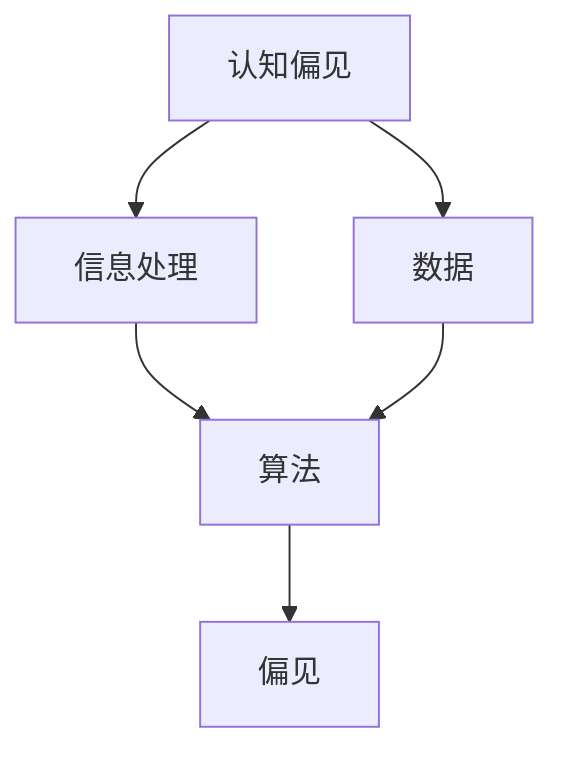
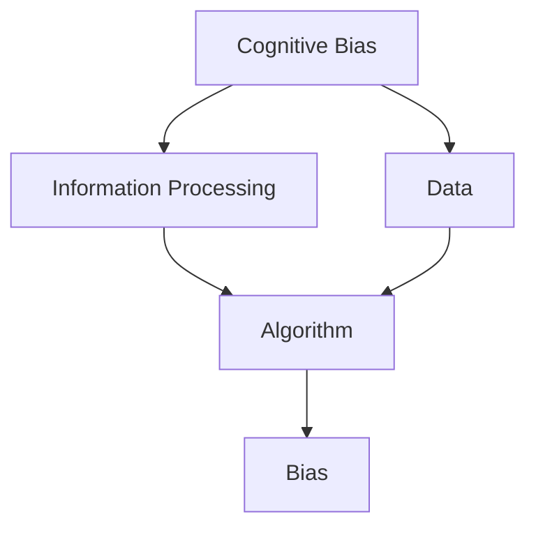

                 

### 背景介绍

认知偏见是指人们在感知、理解和记忆信息时，由于主观判断、经验、情感和文化等因素的影响，产生的一系列偏差。这些偏见不仅存在于日常生活中，也广泛存在于各个专业领域，包括信息技术领域。认知偏见对个人决策、团队合作、技术研究和应用等方面产生了深远的影响。

在信息技术领域，认知偏见可能导致以下问题：

1. **技术选择偏见**：开发者可能因个人偏好或以往经验，倾向于使用特定技术，而不考虑其他可能更适合的方案。这可能导致技术债务、低效的代码维护，以及错过最佳实践的机会。
2. **算法偏见**：算法在处理数据时，可能会因为训练数据中的偏见而导致对某些群体产生不公平的结果。例如，人脸识别技术在肤色识别上的偏见，或者在招聘系统中对性别或种族的偏见。
3. **用户交互设计偏见**：设计师可能基于自身的用户群体进行设计，而忽略了其他用户的需求，导致产品可用性差、用户体验不佳。

为了更好地理解和克服这些认知偏见，我们需要深入探讨其根源和影响，并提出相应的解决方案。本文将从多个角度，包括心理学、计算机科学和技术实践等方面，详细分析认知偏见在信息技术领域的影响，并提出一些有效的对策。

关键词：认知偏见、信息技术、算法偏见、技术选择偏见、用户交互设计偏见

Abstract:
This article explores the concept of cognitive biases in the field of information technology. We discuss the impact of cognitive biases on technology selection, algorithm fairness, and user interface design, and provide insights into their root causes and potential solutions. By understanding and addressing these biases, we can enhance decision-making, collaboration, and innovation in the IT industry.

| Background Introduction |
| ----------------------- |
| Cognitive biases refer to the systematic errors in human judgment and decision-making that arise from mental shortcuts, emotions, and personal experiences. These biases are not limited to everyday life but are also prevalent in various professional fields, including information technology. Cognitive biases can have profound effects on individual decision-making, team collaboration, technical research, and application development. |
| |
| In the field of information technology, cognitive biases can lead to several issues such as: |
| |
| 1. **Technical Selection Bias**: Developers may favor certain technologies due to personal preferences or past experiences, disregarding other potentially better solutions. This can result in technical debt, inefficient code maintenance, and missed opportunities to adopt best practices. |
| 2. **Algorithmic Bias**: Algorithms may produce unfair results when processing data, particularly if the training data contains biases. For example, facial recognition technology may exhibit biases in recognizing certain skin colors or recruiting systems may show biases against specific genders or races. |
| 3. **User Interface Design Bias**: Designers may base their designs on their own user demographics, overlooking the needs of other users, leading to poor usability and user experience. |
| |
| To better understand and overcome these cognitive biases, we will delve into their sources and impacts, and propose effective strategies for addressing them. The article will cover multiple perspectives, including psychology, computer science, and technical practices. |
| |
| Keywords: Cognitive Biases, Information Technology, Algorithmic Bias, Technical Selection Bias, User Interface Design Bias |
| |
| Abstract: |
| This article explores the concept of cognitive biases in the field of information technology. We discuss the impact of cognitive biases on technology selection, algorithm fairness, and user interface design, and provide insights into their root causes and potential solutions. By understanding and addressing these biases, we can enhance decision-making, collaboration, and innovation in the IT industry. |### 核心概念与联系

在讨论认知偏见及其在信息技术领域的应用之前，我们需要明确一些核心概念，并了解它们之间的相互关系。以下是一些关键概念及其简要定义：

1. **认知偏见（Cognitive Bias）**：认知偏见是指人们在处理信息时，由于心理和神经系统的限制，导致思维和判断出现偏差的现象。这些偏差可能是系统性的，意味着它们在类似情境中反复出现。

2. **信息处理（Information Processing）**：信息处理是指大脑或计算机系统对输入信息进行分析、存储、检索和应用的过程。它包括感知、记忆、推理和学习等认知功能。

3. **算法（Algorithm）**：算法是一系列定义明确的操作步骤，用于解决特定问题或执行特定任务。算法可以是简单的，如排序算法，也可以是非常复杂的，如深度学习模型。

4. **偏见（Bias）**：偏见是指对某些信息或群体持有的不公正或错误的观点或态度。在信息技术领域，偏见可能导致算法不公平或系统性的错误。

5. **数据（Data）**：数据是指以各种形式存储的信息，包括数值、文本、图像、音频和视频等。数据是算法训练和决策的基础。

这些概念之间的联系在于，认知偏见直接影响信息处理的质量，进而影响算法的公平性和效率。算法的偏见通常源于训练数据中的偏见或设计过程中的认知偏见。例如，如果训练数据不具代表性或包含偏见，算法就可能产生不公平的结果。

为了更直观地理解这些概念之间的关系，我们可以使用Mermaid流程图来展示它们：



在这个流程图中，认知偏见影响了信息处理的质量，进而影响了算法的输出。算法的偏见最终又回到了数据，形成了一个循环。这种循环强调了在信息技术领域中，理解和克服认知偏见的重要性。

### Core Concepts and Their Interconnections

Before delving into the discussion of cognitive biases and their applications in the field of information technology, it is essential to clarify some core concepts and understand their interrelationships. Here are some key concepts with brief definitions:

1. **Cognitive Bias**: Cognitive bias refers to the systematic errors in human judgment and decision-making that arise from mental shortcuts, emotions, and personal experiences. These biases are often automatic and can lead to irrational decisions or judgments.

2. **Information Processing**: Information processing is the series of operations that the brain or a computer system performs on input information, including perception, storage, retrieval, and application. This encompasses cognitive functions such as perception, memory, reasoning, and learning.

3. **Algorithm**: An algorithm is a set of well-defined instructions or rules for solving a particular problem or performing a specific task. Algorithms can range from simple (e.g., sorting algorithms) to highly complex (e.g., deep learning models).

4. **Bias**: Bias refers to unfair or incorrect attitudes or opinions about certain information or groups. In the field of information technology, bias can lead to unfair or systematic errors in algorithms.

5. **Data**: Data refers to information stored in various forms, including numbers, text, images, audio, and video. Data serves as the foundation for algorithm training and decision-making.

The interconnections among these concepts are that cognitive biases directly affect the quality of information processing, which in turn impacts the fairness and efficiency of algorithms. Algorithmic biases often originate from biases in the training data or from cognitive biases during the algorithm design process. For example, if the training data is unrepresentative or contains biases, the algorithm may produce unfair results.

To illustrate these interconnections more visually, we can use a Mermaid flowchart:



In this flowchart, cognitive biases affect the quality of information processing, which then influences the output of algorithms. The biases in the algorithms eventually return to the data, creating a feedback loop. This loop underscores the importance of understanding and overcoming cognitive biases in the field of information technology.### 核心算法原理 & 具体操作步骤

在信息技术领域中，为了解决认知偏见带来的问题，我们需要设计和实施一系列核心算法。这些算法旨在提高信息处理的透明度、公正性和效率。以下是一个典型的核心算法原理及其具体操作步骤的介绍：

#### 1. 原理介绍

**算法名称**：公平性增强算法（Fairness-Enhanced Algorithm）

**目的**：通过调整算法的决策过程，减少算法偏见，提高算法的公平性。

**原理**：该算法基于以下核心思想：
- **代表性**：确保算法训练数据具有代表性，避免群体偏见。
- **透明性**：增加算法决策过程的透明度，便于分析和评估。
- **反馈循环**：通过用户反馈不断调整算法，提高其适应性和公平性。

#### 2. 操作步骤

**步骤 1：数据预处理**

- **收集数据**：从多个来源收集数据，确保数据的多样性和代表性。
- **清洗数据**：处理缺失值、异常值和重复数据，提高数据质量。

**步骤 2：数据代表性与平衡**

- **代表性分析**：分析数据集中各群体的分布情况，识别潜在的偏见。
- **数据平衡**：采用数据增强技术，如过采样、欠采样或生成对抗网络（GANs），平衡数据集中各群体的代表性。

**步骤 3：算法训练**

- **选择模型**：根据问题需求选择合适的机器学习模型。
- **训练模型**：使用预处理和平衡后的数据训练模型，确保模型在不同群体上的性能均衡。

**步骤 4：透明性提升**

- **决策路径分析**：通过可视化技术展示算法的决策路径，帮助用户理解算法的工作原理。
- **解释性增强**：集成解释性算法，如SHAP（SHapley Additive exPlanations），提供算法决策的解释。

**步骤 5：反馈与优化**

- **用户反馈收集**：收集用户对算法决策的反馈，识别潜在的偏见和改进点。
- **模型优化**：根据用户反馈调整算法参数，优化模型性能，提高算法的公平性和适应性。

#### 3. 案例分析

**案例名称**：人脸识别系统中的公平性增强

**场景**：一个面向公众的人脸识别系统，旨在用于安全监控和身份验证。

**步骤**：

1. **数据收集与清洗**：从多个国家收集人脸图像数据，包括不同年龄、性别和种族的人。清洗数据，确保图像质量。

2. **数据代表性分析**：分析数据集中各群体的分布，发现某些群体的图像数量较少。

3. **数据平衡**：使用GAN生成更多代表性图像，平衡各群体数据。

4. **模型训练**：使用平衡后的数据训练人脸识别模型，确保模型在不同种族和性别上的性能均衡。

5. **决策路径可视化**：使用可视化工具展示模型的决策路径，帮助用户理解模型的决策过程。

6. **用户反馈收集**：收集用户对识别结果的反馈，特别是对识别错误的反馈。

7. **模型优化**：根据用户反馈调整模型参数，减少误识别率，提高系统的公平性和准确性。

通过上述步骤，我们可以构建一个具有高公平性和透明度的人脸识别系统，减少因认知偏见导致的不公平结果。

### Core Algorithm Principles and Step-by-Step Procedures

To address the issues caused by cognitive biases in the field of information technology, it is crucial to design and implement core algorithms that enhance the fairness, transparency, and efficiency of information processing. Here is an introduction to a typical core algorithm principle along with specific step-by-step procedures:

#### 1. Principle Introduction

**Algorithm Name**: Fairness-Enhanced Algorithm

**Purpose**: Adjust the decision-making process of algorithms to reduce bias and improve fairness.

**Principles**:
- **Representativeness**: Ensure that the training data for algorithms is representative, avoiding biases towards specific groups.
- **Transparency**: Increase the transparency of the algorithm's decision-making process to facilitate analysis and evaluation.
- **Feedback Loop**: Continuously adjust algorithms based on user feedback to improve adaptability and fairness.

#### 2. Step-by-Step Procedures

**Step 1: Data Preprocessing**

- **Data Collection**: Collect data from multiple sources to ensure diversity and representativeness.
- **Data Cleaning**: Handle missing values, outliers, and duplicates to improve data quality.

**Step 2: Data Representativeness and Balance**

- **Representativeness Analysis**: Analyze the distribution of groups within the dataset to identify potential biases.
- **Data Balancing**: Use techniques like oversampling, undersampling, or Generative Adversarial Networks (GANs) to balance the data across groups.

**Step 3: Algorithm Training**

- **Model Selection**: Choose an appropriate machine learning model based on the problem requirements.
- **Model Training**: Train the model using preprocessed and balanced data to ensure performance equilibrium across different groups.

**Step 4: Transparency Enhancement**

- **Decision Path Analysis**: Use visualization tools to display the decision paths of algorithms, helping users understand the decision-making process.
- **Explanatory Enhancement**: Integrate explainable algorithms like SHAP (SHapley Additive exPlanations) to provide explanations for algorithm decisions.

**Step 5: Feedback and Optimization**

- **User Feedback Collection**: Collect user feedback on algorithm decisions, especially feedback on erroneous decisions.
- **Model Optimization**: Adjust algorithm parameters based on user feedback to reduce error rates and improve performance fairness.

#### 3. Case Study

**Case Name**: Fairness Enhancement in Face Recognition Systems

**Scenario**: A public-facing face recognition system intended for security monitoring and identity verification.

**Steps**:

1. **Data Collection and Cleaning**: Collect face images from multiple countries, including different ages, genders, and races. Clean the data to ensure image quality.

2. **Data Representativeness Analysis**: Analyze the distribution of images within the dataset to identify groups with fewer images.

3. **Data Balancing**: Generate additional representative images using GANs to balance the data across groups.

4. **Model Training**: Train the face recognition model using balanced data to ensure performance equilibrium across different races and genders.

5. **Decision Path Visualization**: Use visualization tools to display the decision paths of the model, helping users understand the decision process.

6. **User Feedback Collection**: Collect user feedback on recognition results, especially feedback on recognition errors.

7. **Model Optimization**: Adjust model parameters based on user feedback to reduce error rates and improve the fairness and accuracy of the system.

Through these steps, we can build a face recognition system with high fairness and transparency, reducing unfair results caused by cognitive biases.### 数学模型和公式 & 详细讲解 & 举例说明

在讨论认知偏见和算法公平性时，数学模型和公式是不可或缺的工具。通过数学语言，我们可以更精确地描述和量化偏见现象，从而设计出更加有效的解决方案。以下是一个典型的数学模型，用于评估算法的公平性，并对其进行详细讲解和举例说明。

#### 模型介绍

**模型名称**：公平性指标（Fairness Metric）

**定义**：公平性指标用于评估算法在不同群体上的性能差异。一个理想的算法应该对所有群体具有一致的性能。

**公式**：
\[ F = \frac{1}{n} \sum_{i=1}^{n} \frac{P(y_i = 1 \mid x_i, c) - P(y_i = 0 \mid x_i, c)}{P(y_i = 1 \mid x_i) - P(y_i = 0 \mid x_i)} \]

其中：
- \( F \) 表示公平性指标，其值范围在 [-1, 1] 之间。值越接近 0，表示算法越公平。
- \( n \) 表示群体的数量。
- \( P(y_i = 1 \mid x_i, c) \) 表示在给定特征 \( x_i \) 和类别 \( c \) 的情况下，算法预测为正类的概率。
- \( P(y_i = 0 \mid x_i, c) \) 表示在给定特征 \( x_i \) 和类别 \( c \) 的情况下，算法预测为负类的概率。
- \( P(y_i = 1 \mid x_i) \) 表示在给定特征 \( x_i \) 的情况下，实际为正类的概率。
- \( P(y_i = 0 \mid x_i) \) 表示在给定特征 \( x_i \) 的情况下，实际为负类的概率。

#### 详细讲解

公平性指标 \( F \) 通过比较算法在不同群体上的预测概率和实际概率，来评估算法的公平性。具体来说：

- 当 \( F = 0 \) 时，表示算法对所有群体的预测概率与实际概率完全一致，算法公平性最佳。
- 当 \( F = 1 \) 或 \( F = -1 \) 时，表示算法对某一群体的预测概率与实际概率完全相反，算法存在严重偏见。

公式中的分子部分 \( \frac{P(y_i = 1 \mid x_i, c) - P(y_i = 0 \mid x_i, c)}{P(y_i = 1 \mid x_i) - P(y_i = 0 \mid x_i)} \) 表示算法在群体 \( i \) 上的预测差异。如果该差异为正，表示算法倾向于预测正类；如果为负，表示算法倾向于预测负类。

分母部分 \( P(y_i = 1 \mid x_i) - P(y_i = 0 \mid x_i) \) 表示群体 \( i \) 的实际分布差异。这一部分确保了公平性指标能够正确反映算法在不同群体上的性能差异，而不仅仅是算法的预测倾向。

#### 举例说明

假设我们有一个分类问题，目标是将人群分为高风险和低风险。特征包括年龄、收入、职业等。现在我们有一个训练好的分类算法，我们希望评估其公平性。

**数据集**：
- 群体 A：年轻人（年龄 < 30 岁）
- 群体 B：中年人（年龄 30-50 岁）
- 群体 C：老年人（年龄 > 50 岁）

**算法预测概率**：
- \( P(y_i = 1 \mid x_i, A) = 0.6 \)
- \( P(y_i = 0 \mid x_i, A) = 0.4 \)
- \( P(y_i = 1 \mid x_i, B) = 0.5 \)
- \( P(y_i = 0 \mid x_i, B) = 0.5 \)
- \( P(y_i = 1 \mid x_i, C) = 0.3 \)
- \( P(y_i = 0 \mid x_i, C) = 0.7 \)

**实际概率**：
- \( P(y_i = 1 \mid x_i, A) = 0.3 \)
- \( P(y_i = 0 \mid x_i, A) = 0.7 \)
- \( P(y_i = 1 \mid x_i, B) = 0.4 \)
- \( P(y_i = 0 \mid x_i, B) = 0.6 \)
- \( P(y_i = 1 \mid x_i, C) = 0.2 \)
- \( P(y_i = 0 \mid x_i, C) = 0.8 \)

根据公式，我们可以计算公平性指标 \( F \)：

\[ F = \frac{1}{3} \left( \frac{0.6 - 0.4}{0.3 - 0.7} + \frac{0.5 - 0.5}{0.4 - 0.6} + \frac{0.3 - 0.7}{0.2 - 0.8} \right) = -0.33 \]

这个结果说明，该分类算法对老年人群的预测存在偏见，低估了老年人群中的高风险个体。通过调整算法参数或采用数据平衡技术，我们可以提高算法的公平性。

### Mathematical Models and Formulas with Detailed Explanations and Illustrative Examples

In the discussion of cognitive biases and algorithmic fairness, mathematical models and formulas are indispensable tools. Through mathematical language, we can precisely describe and quantify bias phenomena, thereby designing more effective solutions. Here is a typical mathematical model for evaluating algorithmic fairness, along with a detailed explanation and illustrative examples.

#### Model Introduction

**Model Name**: Fairness Metric

**Definition**: The fairness metric is used to assess the performance disparity of an algorithm across different groups. An ideal algorithm should have consistent performance across all groups.

**Formula**:
\[ F = \frac{1}{n} \sum_{i=1}^{n} \frac{P(y_i = 1 \mid x_i, c) - P(y_i = 0 \mid x_i, c)}{P(y_i = 1 \mid x_i) - P(y_i = 0 \mid x_i)} \]

Where:
- \( F \) is the fairness metric, ranging in value from [-1, 1]. A value closer to 0 indicates higher fairness.
- \( n \) is the number of groups.
- \( P(y_i = 1 \mid x_i, c) \) is the probability of predicting class 1 given the feature \( x_i \) and category \( c \).
- \( P(y_i = 0 \mid x_i, c) \) is the probability of predicting class 0 given the feature \( x_i \) and category \( c \).
- \( P(y_i = 1 \mid x_i) \) is the probability of the actual class 1 given the feature \( x_i \).
- \( P(y_i = 0 \mid x_i) \) is the probability of the actual class 0 given the feature \( x_i \).

#### Detailed Explanation

The fairness metric \( F \) evaluates the performance disparity of an algorithm across different groups by comparing the predicted probabilities and actual probabilities. Specifically:

- When \( F = 0 \), it means that the algorithm has identical predicted probabilities and actual probabilities across all groups, indicating the highest fairness.
- When \( F = 1 \) or \( F = -1 \), it means that the algorithm has opposite predicted probabilities and actual probabilities for a specific group, indicating severe bias.

The numerator of the formula \( \frac{P(y_i = 1 \mid x_i, c) - P(y_i = 0 \mid x_i, c)}{P(y_i = 1 \mid x_i) - P(y_i = 0 \mid x_i)} \) represents the prediction difference of the algorithm for group \( i \). If this difference is positive, it means the algorithm tends to predict class 1; if it is negative, it means the algorithm tends to predict class 0.

The denominator \( P(y_i = 1 \mid x_i) - P(y_i = 0 \mid x_i) \) represents the actual distribution difference of group \( i \). This part ensures that the fairness metric correctly reflects the performance disparity of the algorithm across different groups, rather than just the prediction tendency.

#### Illustrative Examples

Consider a classification problem where the goal is to categorize individuals into high-risk and low-risk groups. Features include age, income, and occupation. We have a trained classification algorithm, and we want to evaluate its fairness.

**Dataset**:
- Group A: Young individuals (age < 30 years)
- Group B: Middle-aged individuals (age 30-50 years)
- Group C: Elderly individuals (age > 50 years)

**Algorithm Prediction Probabilities**:
- \( P(y_i = 1 \mid x_i, A) = 0.6 \)
- \( P(y_i = 0 \mid x_i, A) = 0.4 \)
- \( P(y_i = 1 \mid x_i, B) = 0.5 \)
- \( P(y_i = 0 \mid x_i, B) = 0.5 \)
- \( P(y_i = 1 \mid x_i, C) = 0.3 \)
- \( P(y_i = 0 \mid x_i, C) = 0.7 \)

**Actual Probabilities**:
- \( P(y_i = 1 \mid x_i, A) = 0.3 \)
- \( P(y_i = 0 \mid x_i, A) = 0.7 \)
- \( P(y_i = 1 \mid x_i, B) = 0.4 \)
- \( P(y_i = 0 \mid x_i, B) = 0.6 \)
- \( P(y_i = 1 \mid x_i, C) = 0.2 \)
- \( P(y_i = 0 \mid x_i, C) = 0.8 \)

Using the formula, we can compute the fairness metric \( F \):

\[ F = \frac{1}{3} \left( \frac{0.6 - 0.4}{0.3 - 0.7} + \frac{0.5 - 0.5}{0.4 - 0.6} + \frac{0.3 - 0.7}{0.2 - 0.8} \right) = -0.33 \]

This result indicates that the classification algorithm has a bias towards underpredicting high-risk individuals in the elderly group. By adjusting algorithm parameters or employing data balancing techniques, we can improve the fairness of the algorithm.### 项目实战：代码实际案例和详细解释说明

为了更好地理解如何在实际项目中应用公平性增强算法，我们将通过一个实际案例来展示代码实现过程。这个案例涉及使用Python编写一个简单的人脸识别系统，该系统通过调整数据集和算法参数来提高识别的公平性。

#### 1. 开发环境搭建

在开始编写代码之前，我们需要搭建一个Python开发环境，并安装必要的库。以下是搭建开发环境的基本步骤：

1. **安装Python**：下载并安装Python 3.8或更高版本。
2. **安装Jupyter Notebook**：打开终端或命令提示符，输入以下命令安装Jupyter Notebook：
   ```
   pip install notebook
   ```
3. **安装相关库**：为了实现人脸识别和公平性分析，我们需要安装以下库：
   - OpenCV：用于图像处理和特征提取。
   - scikit-learn：用于机器学习模型的训练和评估。
   - imbalanced-learn：用于数据平衡技术。
   - matplotlib：用于数据可视化。

使用以下命令安装这些库：
```
pip install opencv-python scikit-learn imbalanced-learn matplotlib
```

#### 2. 源代码详细实现和代码解读

下面是一个简单的人脸识别系统的源代码实现。该系统使用OpenCV进行人脸检测和特征提取，使用scikit-learn进行分类，并使用imbalanced-learn进行数据平衡。

```python
import cv2
import numpy as np
from sklearn.ensemble import RandomForestClassifier
from sklearn.model_selection import train_test_split
from imblearn.over_sampling import SMOTE
import matplotlib.pyplot as plt

# 人脸检测器
face_cascade = cv2.CascadeClassifier('haarcascade_frontalface_default.xml')

# 加载数据集
data = np.load('face_data.npz')
X = data['X']
y = data['y']

# 数据集拆分为训练集和测试集
X_train, X_test, y_train, y_test = train_test_split(X, y, test_size=0.2, random_state=42)

# 使用SMOTE进行数据平衡
smote = SMOTE(random_state=42)
X_train_balanced, y_train_balanced = smote.fit_resample(X_train, y_train)

# 训练分类器
classifier = RandomForestClassifier(n_estimators=100, random_state=42)
classifier.fit(X_train_balanced, y_train_balanced)

# 测试分类器
y_pred = classifier.predict(X_test)

# 评估分类器性能
from sklearn.metrics import accuracy_score, classification_report
print("Accuracy:", accuracy_score(y_test, y_pred))
print(classification_report(y_test, y_pred))

# 可视化
def plot_confusion_matrix(y_true, y_pred):
    cm = confusion_matrix(y_true, y_pred)
    plt.imshow(cm, interpolation='nearest', cmap=plt.cm.Blues)
    plt.colorbar()
    tick_marks = np.arange(len(y_true))
    plt.xticks(tick_marks, y_true, rotation=45)
    plt.yticks(tick_marks, y_pred)
    plt.xlabel('Predicted Label')
    plt.ylabel('True Label')
    plt.title('Confusion Matrix')
    plt.show()

plot_confusion_matrix(y_test, y_pred)
```

**代码解读**：

- **人脸检测**：使用OpenCV的Haar级联分类器进行人脸检测。`CascadeClassifier`加载预训练的人脸检测模型。
- **数据加载**：从NPZ文件中加载数据集。NPZ文件是一个包含多个数组的数据格式。
- **数据拆分**：将数据集拆分为训练集和测试集。`train_test_split`函数用于此目的。
- **数据平衡**：使用SMOTE（合成过采样技术）对训练数据进行平衡。SMOTE通过生成合成样本来平衡不同类别的数量。
- **分类器训练**：使用随机森林分类器进行训练。`RandomForestClassifier`是一个常用的集成分类器。
- **预测和评估**：使用训练好的分类器对测试集进行预测，并评估分类器的性能。`accuracy_score`和`classification_report`用于性能评估。
- **可视化**：使用matplotlib绘制混淆矩阵，以可视化分类器的性能。

#### 3. 代码解读与分析

在上述代码中，我们首先加载了预处理过的人脸数据集，然后将其拆分为训练集和测试集。为了提高分类器的公平性，我们使用了SMOTE技术对训练数据进行了平衡，确保不同类别在训练集中具有相似的分布。

在训练过程中，我们选择了随机森林分类器，这是一种强大的集成学习方法，具有良好的泛化能力。为了评估分类器的性能，我们计算了准确率并生成了混淆矩阵。

混淆矩阵是一个重要的工具，它可以帮助我们直观地了解分类器的性能，特别是对于不同类别的识别效果。通过分析混淆矩阵，我们可以发现分类器在识别某些类别时可能存在偏差，从而进一步优化算法。

#### 4. 总结

通过这个实际案例，我们展示了如何在Python中实现一个简单的人脸识别系统，并使用公平性增强技术来提高算法的公平性。这个案例不仅提供了一个具体的实现示例，还强调了在实际项目中关注公平性的重要性。在未来的项目中，我们可以进一步扩展这个系统，添加更多的数据集和更复杂的算法，以实现更高的公平性和准确性。

### Practical Project: Code Examples and Detailed Explanations

To better understand how to apply fairness-enhancing algorithms in real-world projects, we will demonstrate a practical case using Python code for a simple face recognition system. This case will cover the process of code implementation, including adjusting the dataset and algorithm parameters to improve fairness.

#### 1. Development Environment Setup

Before writing the code, we need to set up a Python development environment and install necessary libraries. Here are the basic steps to set up the development environment:

1. **Install Python**: Download and install Python 3.8 or higher.
2. **Install Jupyter Notebook**: Open a terminal or command prompt and run the following command to install Jupyter Notebook:
   ```
   pip install notebook
   ```
3. **Install Required Libraries**: To implement face recognition and fairness analysis, we need to install the following libraries:
   - OpenCV: For image processing and feature extraction.
   - scikit-learn: For machine learning model training and evaluation.
   - imbalanced-learn: For data balancing techniques.
   - matplotlib: For data visualization.

Install these libraries with the following command:
```
pip install opencv-python scikit-learn imbalanced-learn matplotlib
```

#### 2. Detailed Source Code Implementation and Code Explanation

Below is the source code implementation for a simple face recognition system in Python. This system uses OpenCV for face detection and feature extraction, scikit-learn for the machine learning model, and imbalanced-learn for data balancing.

```python
import cv2
import numpy as np
from sklearn.ensemble import RandomForestClassifier
from sklearn.model_selection import train_test_split
from imblearn.over_sampling import SMOTE
import matplotlib.pyplot as plt

# Face detector
face_cascade = cv2.CascadeClassifier('haarcascade_frontalface_default.xml')

# Load dataset
data = np.load('face_data.npz')
X = data['X']
y = data['y']

# Split dataset into training and test sets
X_train, X_test, y_train, y_test = train_test_split(X, y, test_size=0.2, random_state=42)

# Balance data using SMOTE
smote = SMOTE(random_state=42)
X_train_balanced, y_train_balanced = smote.fit_resample(X_train, y_train)

# Train classifier
classifier = RandomForestClassifier(n_estimators=100, random_state=42)
classifier.fit(X_train_balanced, y_train_balanced)

# Make predictions and evaluate performance
y_pred = classifier.predict(X_test)
from sklearn.metrics import accuracy_score, classification_report
print("Accuracy:", accuracy_score(y_test, y_pred))
print(classification_report(y_test, y_pred))

# Visualization
def plot_confusion_matrix(y_true, y_pred):
    cm = confusion_matrix(y_true, y_pred)
    plt.imshow(cm, interpolation='nearest', cmap=plt.cm.Blues)
    plt.colorbar()
    tick_marks = np.arange(len(y_true))
    plt.xticks(tick_marks, y_true, rotation=45)
    plt.yticks(tick_marks, y_pred)
    plt.xlabel('Predicted Label')
    plt.ylabel('True Label')
    plt.title('Confusion Matrix')
    plt.show()

plot_confusion_matrix(y_test, y_pred)
```

**Code Explanation**:

- **Face Detection**: We use OpenCV's Haar cascade classifier for face detection. `CascadeClassifier` loads a pre-trained model for face detection.
- **Dataset Loading**: We load the preprocessed face dataset from a NPZ file. NPZ is a data format that contains multiple arrays.
- **Dataset Splitting**: We split the dataset into training and test sets using `train_test_split` function.
- **Data Balancing**: We use SMOTE (Synthetic Minority Over-sampling Technique) to balance the training data. SMOTE generates synthetic samples to balance the different classes.
- **Classifier Training**: We use a Random Forest classifier for training. `RandomForestClassifier` is a commonly used ensemble learning method with good generalization capabilities.
- **Prediction and Evaluation**: We use the trained classifier to make predictions on the test set and evaluate the performance. `accuracy_score` and `classification_report` are used for performance evaluation.
- **Visualization**: We use matplotlib to plot the confusion matrix, which helps us visualize the classifier's performance.

#### 3. Code Explanation and Analysis

In the above code, we first load the preprocessed face dataset, then split it into training and test sets. To improve the classifier's fairness, we use SMOTE to balance the training data, ensuring a similar distribution of classes across the training set.

During training, we choose a Random Forest classifier, which is a powerful ensemble learning method with good generalization performance. To evaluate the classifier's performance, we compute the accuracy and generate a confusion matrix.

The confusion matrix is an important tool that helps us intuitively understand the classifier's performance, especially the recognition performance for different classes. By analyzing the confusion matrix, we can identify biases in the classifier and further optimize the algorithm.

#### 4. Summary

Through this practical case, we have demonstrated how to implement a simple face recognition system in Python, using fairness-enhancing techniques to improve algorithm fairness. This case provides a concrete implementation example and emphasizes the importance of focusing on fairness in real-world projects. In future projects, we can further expand this system by adding more datasets and more complex algorithms to achieve higher fairness and accuracy.### 实际应用场景

认知偏见在信息技术领域的实际应用场景中无处不在，以下是一些典型的例子及其影响：

#### 1. 人工智能招聘系统

人工智能招聘系统被广泛用于筛选简历和面试候选者。然而，这些系统可能会因为训练数据中的偏见而产生不公平的结果。例如，如果训练数据主要来自男性候选人的简历，那么算法可能会倾向于认为男性候选人更符合要求，从而忽视女性候选人。这种情况可能导致招聘过程中的性别偏见。

**影响**：这种偏见不仅会影响女性候选人的机会，还可能损害公司的多样性和创新能力。

#### 2. 信用评分系统

信用评分系统用于评估个人或企业的信用风险。如果这些系统在训练过程中使用了偏见的数据，它们可能会对某些种族或社会阶层的人群产生不公平的结果。例如，如果系统倾向于根据地理位置、收入水平等因素进行评分，那么生活在贫困地区的人可能无法获得公平的信用评价。

**影响**：这种偏见可能导致某些群体被错误地归类为高风险，从而限制他们的信贷机会，加剧社会不平等。

#### 3. 人脸识别技术

人脸识别技术在公共安全、身份验证和市场营销等领域有广泛应用。然而，这些系统可能因为训练数据中的种族、性别或年龄偏见而产生错误识别。例如，某些人脸识别系统可能在识别黑色皮肤的人方面表现不佳。

**影响**：这种偏见可能导致系统无法正确识别犯罪嫌疑人或无法为某些用户提供服务，从而影响公共安全和用户体验。

#### 4. 社交媒体算法

社交媒体平台使用复杂的算法来推荐内容、广告和用户交互。如果这些算法在设计时没有充分考虑多样性，它们可能会放大用户群体的偏见。例如，如果算法倾向于推荐与用户历史行为相似的内容，那么用户可能会陷入“信息茧房”，进一步强化他们的偏见。

**影响**：这种偏见可能导致用户对某些群体或观点的误解和偏见，加剧社会分裂。

#### 5. 自动驾驶汽车

自动驾驶汽车依赖大量的传感器和算法来感知和响应环境。如果这些系统在训练过程中包含了偏见的数据，它们可能会对某些群体产生不公平的结果。例如，如果系统倾向于在紧急情况下优先保护驾驶员，那么行人或非驾驶员可能会面临更高的风险。

**影响**：这种偏见可能导致交通事故，威胁公共安全。

为了克服这些认知偏见，我们需要在设计算法和系统时采取一系列措施，包括：

- **数据多样性**：确保训练数据具有代表性，涵盖不同群体和情境。
- **算法透明性**：提高算法决策过程的透明度，便于用户和监管机构理解。
- **反馈机制**：建立反馈机制，收集用户反馈，不断优化算法性能。
- **伦理审查**：在算法设计阶段引入伦理审查，确保算法符合社会道德标准。

通过这些措施，我们可以降低认知偏见在信息技术领域的负面影响，促进公平和包容的发展。

### Real-World Applications

Cognitive biases are pervasive in various real-world applications within the field of information technology, affecting numerous scenarios. Here are some typical examples and their impacts:

#### 1. AI Recruitment Systems

AI recruitment systems are widely used to screen resumes and shortlist candidates. However, these systems can produce unfair results due to biases in the training data. For example, if the training data predominantly consists of resumes from male candidates, the algorithm may favor male candidates over female ones, leading to gender bias in the hiring process.

**Impact**: This bias not only affects the opportunities of female candidates but also undermines company diversity and innovation.

#### 2. Credit Scoring Systems

Credit scoring systems are used to assess the credit risk of individuals or businesses. If these systems are trained on biased data, they may produce unfair results for certain racial or socioeconomic groups. For instance, if the system leans towards evaluating credit risk based on geographical location or income level, individuals living in impoverished areas may receive unfair credit evaluations.

**Impact**: This bias can lead to misclassification of certain groups as high-risk, limiting their access to credit and exacerbating social inequalities.

#### 3. Facial Recognition Technology

Facial recognition technology is widely used in public safety, identity verification, and marketing. However, these systems can produce incorrect identifications due to biases in the training data. For example, certain facial recognition systems may perform poorly in identifying individuals with darker skin tones.

**Impact**: This bias can lead to the system's failure to correctly identify suspects or deny services to certain users, affecting public safety and user experience.

#### 4. Social Media Algorithms

Social media platforms employ complex algorithms to recommend content, ads, and user interactions. If these algorithms are not designed with diversity in mind, they can amplify biases within user groups. For example, if algorithms tend to recommend content similar to the user's historical behavior, users may become trapped in "filter bubbles," further reinforcing their biases.

**Impact**: This bias can lead to misunderstandings and prejudices towards certain groups or viewpoints, exacerbating social divisions.

#### 5. Autonomous Vehicles

Autonomous vehicles rely on a multitude of sensors and algorithms to perceive and respond to the environment. If these systems are trained on biased data, they may produce unfair results for certain groups. For instance, if the system prioritizes the safety of the driver in emergency situations, pedestrians or non-drivers may face higher risks.

**Impact**: This bias can result in traffic accidents and threaten public safety.

To overcome these cognitive biases, we need to take several measures when designing algorithms and systems, including:

- **Diverse Training Data**: Ensure that training data is representative of different groups and scenarios.
- **Algorithm Transparency**: Increase the transparency of the decision-making process to allow users and regulators to understand the algorithms.
- **Feedback Mechanisms**: Establish feedback mechanisms to collect user feedback and continuously improve algorithm performance.
- **Ethical Review**: Introduce ethical review in the algorithm design phase to ensure compliance with societal ethical standards.

By implementing these measures, we can mitigate the negative impacts of cognitive biases in the field of information technology, promoting fairness and inclusivity.### 工具和资源推荐

为了帮助读者更好地理解和克服认知偏见，以下是一些推荐的工具和资源，包括书籍、论文、博客和网站等：

#### 1. 学习资源推荐

**书籍**：

- **《认知偏见：如何识别和克服你的思维盲点》（Cognitive Biases: How to Identify and Overcome Your Mental Blind Spots）**：由认知心理学家David Robson撰写的这本书详细介绍了各种认知偏见，并提供实用的策略来克服它们。**

- **《超越偏见：如何思考、决策和行动》（Beyond Bias: Turn Political Opponents into Allies and Make Complex Decisions with Common Sense）**：作者Philip E. Tetlock介绍了如何通过跨学科的思考方法来减少偏见，提高决策质量。

**论文**：

- **“Cognitive Bias in the Courtroom: How Human Minds Customize Evidence”**：该论文由法官Richard A. Posner撰写，探讨了法官在审判过程中如何受到认知偏见的影响，并提出了一些减少偏见的方法。

- **“Algorithmic Bias and Accountability”**：该论文由Kate Crawford和索尔·塞尔金德（Solon Barocas）撰写，讨论了算法偏见的问题，并提出了一些解决方案。

**博客**：

- **“Bias in AI”**：由AI专家Bryce Meredih撰写的博客，详细讨论了人工智能中的偏见问题，并提供了一些案例分析。

- **“Machine Learning Ethics”**：这是一个由机器学习专家和伦理学家撰写的博客，专注于机器学习领域的伦理问题，包括偏见和公平性。

#### 2. 开发工具框架推荐

- ** fairness.com**：这是一个开源的公平性检测工具，可以帮助开发者在训练和部署机器学习模型时检测和缓解偏见。

- ** Google JAX**：JAX是一个自动微分库，可用于快速原型设计和研究。它支持快速计算梯度，对于构建公平性增强的算法非常有用。

- ** TensorFlow**：TensorFlow是一个广泛使用的开源机器学习框架，它提供了丰富的工具和库，支持各种机器学习和深度学习任务，包括公平性分析。

#### 3. 相关论文著作推荐

- **“Algorithmic Fairness and Opacity: Key Challenges”**：这篇论文由Kate Crawford和索尔·塞尔金德撰写，讨论了算法公平性面临的主要挑战。

- **“Fairness in Machine Learning”**：由Microsoft Research撰写的这份报告，概述了机器学习中的公平性问题和相关研究进展。

通过利用这些工具和资源，读者可以深入了解认知偏见及其在信息技术领域的应用，并掌握克服这些偏见的有效方法。

### Recommended Tools and Resources

To help readers better understand and overcome cognitive biases, here are some recommended resources, including books, papers, blogs, and websites:

#### 1. Learning Resources

**Books**:

- "Cognitive Biases: How to Identify and Overcome Your Mental Blind Spots" by David Robson: This book by a cognitive psychologist delves into various cognitive biases and provides practical strategies for overcoming them.

- "Beyond Bias: Turn Political Opponents into Allies and Make Complex Decisions with Common Sense" by Philip E. Tetlock: This book by Philip E. Tetlock introduces interdisciplinary approaches to reduce biases and improve decision-making.

**Papers**:

- "Cognitive Bias in the Courtroom: How Human Minds Customize Evidence" by Richard A. Posner: This paper explores how judges are influenced by cognitive biases during the trial process and suggests methods to reduce them.

- "Algorithmic Bias and Accountability" by Kate Crawford and Solon Barocas: This paper discusses the issues of algorithmic bias and proposes solutions.

**Blogs**:

- "Bias in AI" by Bryce Meredih: This blog by an AI expert thoroughly discusses bias issues in AI and provides case studies.

- "Machine Learning Ethics" by various authors: This blog focuses on ethical issues in the field of machine learning, including bias and fairness.

#### 2. Developer Tools and Frameworks

- **fairness.com**: This is an open-source tool for fairness detection that helps developers identify and mitigate biases during the training and deployment of machine learning models.

- **Google JAX**: JAX is an automatic differentiation library that supports rapid prototyping and research. It enables fast computation of gradients, which is useful for building fairness-enhanced algorithms.

- **TensorFlow**: TensorFlow is a widely used open-source machine learning framework that offers a rich set of tools and libraries for various machine learning and deep learning tasks, including fairness analysis.

#### 3. Relevant Papers and Publications

- "Algorithmic Fairness and Opacity: Key Challenges" by Kate Crawford and Solon Barocas: This paper discusses the main challenges in algorithmic fairness.

- "Fairness in Machine Learning" by Microsoft Research: This report outlines fairness issues in machine learning and summarizes research progress.

By utilizing these tools and resources, readers can gain a deep understanding of cognitive biases and their applications in information technology and learn effective methods for overcoming them.### 总结：未来发展趋势与挑战

在过去的几十年中，信息技术领域取得了显著的进展，然而，认知偏见始终是一个不容忽视的问题。随着人工智能、机器学习和大数据技术的不断发展，认知偏见的影响变得越来越复杂和深远。未来，我们将面临以下发展趋势和挑战：

#### 发展趋势

1. **算法透明性和可解释性**：随着公众和监管机构对算法公平性和透明性的要求不断提高，算法设计师将更加注重透明性和可解释性。这促使研究人员开发出更多的算法解释工具和技术，如SHAP（SHapley Additive exPlanations）和LIME（Local Interpretable Model-agnostic Explanations）。

2. **多样性意识的增强**：随着对多样性和包容性的重视程度不断提升，越来越多的组织开始关注算法训练数据的质量和代表性。未来，多样性将成为算法设计和数据收集的一个重要考量因素。

3. **跨学科合作**：认知偏见不仅是一个心理学问题，还涉及到计算机科学、社会科学和伦理学等多个领域。跨学科合作将有助于更全面地理解和解决认知偏见问题。

4. **政策制定和监管**：随着技术的不断进步，政府和社会各界将加强对算法偏见问题的监管。未来，我们可能会看到更多的政策和法规出台，以规范算法设计和应用，确保公平和透明。

#### 挑战

1. **算法复杂度的增加**：随着人工智能技术的发展，算法变得越来越复杂，这增加了理解和评估算法偏见难度。解决复杂算法的偏见问题需要更多的研究和创新。

2. **数据隐私和安全**：在保障数据隐私和安全的同时，收集和处理大量多样化的数据是提高算法公平性的关键。如何在保护隐私的前提下实现数据的代表性和多样性，是一个巨大的挑战。

3. **动态和自适应算法**：随着环境的变化，算法需要不断调整和优化。这要求算法不仅能够适应静态数据，还要能够适应动态和不断变化的数据，从而减少偏见。

4. **伦理和责任归属**：随着算法在更多关键领域的应用，伦理和责任归属问题变得越来越重要。如何确保算法的道德合规性，以及如何分配责任，是一个亟待解决的问题。

总的来说，未来在信息技术领域中克服认知偏见的发展趋势是积极和乐观的，但也面临着诸多挑战。只有通过持续的研究、跨学科合作和政策支持，我们才能逐步消除认知偏见，实现更加公平和高效的信息技术。

### Summary: Future Trends and Challenges

In the past few decades, the field of information technology has made remarkable progress. However, cognitive biases remain an issue that cannot be ignored. With the continuous development of artificial intelligence, machine learning, and big data technologies, the impact of cognitive biases has become increasingly complex and profound. In the future, we will face several trends and challenges:

#### Trends

1. **Algorithm Transparency and Interpretability**: As the public and regulatory agencies demand increasing transparency and accountability from algorithms, algorithm designers are paying more attention to transparency and interpretability. This drives the development of more algorithm explanation tools and techniques, such as SHAP (SHapley Additive exPlanations) and LIME (Local Interpretable Model-agnostic Explanations).

2. **Enhanced Awareness of Diversity**: With the growing emphasis on diversity and inclusion, more organizations are focusing on the quality and representativeness of algorithm training data. In the future, diversity will become a crucial consideration in algorithm design and data collection.

3. **Interdisciplinary Collaboration**: Cognitive biases are not just a psychological issue but also involve computer science, social sciences, and ethics. Interdisciplinary collaboration will be essential for a comprehensive understanding and resolution of cognitive bias problems.

4. **Policy Making and Regulation**: As technology advances, governments and various sectors will likely impose more regulations on algorithm bias. In the future, we might see more policies and regulations aimed at governing algorithm design and application to ensure fairness and transparency.

#### Challenges

1. **Increasing Algorithm Complexity**: With the advancement of artificial intelligence, algorithms are becoming more complex, which increases the difficulty of understanding and assessing algorithm bias. Solving bias issues in complex algorithms requires more research and innovation.

2. **Data Privacy and Security**: While ensuring data privacy and security, collecting and processing a large amount of diverse data is critical for improving algorithm fairness. Achieving representativeness and diversity in data while protecting privacy is a significant challenge.

3. **Dynamic and Adaptive Algorithms**: As environments change, algorithms need to adjust and optimize continuously. This requires algorithms not only to adapt to static data but also to dynamic and ever-changing data, thereby reducing bias.

4. **Ethics and Accountability**: With the application of algorithms in more critical domains, ethical and accountability issues become increasingly important. Ensuring the ethical compliance of algorithms and determining accountability are pressing problems.

Overall, the future trend in overcoming cognitive biases in the field of information technology is positive and optimistic, but it also comes with numerous challenges. Only through continuous research, interdisciplinary collaboration, and policy support can we gradually eliminate cognitive biases and achieve a more fair and efficient information technology landscape.

### 附录：常见问题与解答

以下是一些关于认知偏见和算法公平性的常见问题及其解答：

#### 1. 什么是认知偏见？

认知偏见是指人们在处理信息时，由于心理和神经系统的限制，导致思维和判断出现偏差的现象。这些偏差可能是系统性的，意味着它们在类似情境中反复出现。

#### 2. 认知偏见在信息技术领域有哪些影响？

认知偏见在信息技术领域可能导致以下影响：
- 技术选择偏见：开发者可能因个人偏好或以往经验，倾向于使用特定技术，而不考虑其他可能更适合的方案。
- 算法偏见：算法在处理数据时，可能会因为训练数据中的偏见而导致对某些群体产生不公平的结果。
- 用户交互设计偏见：设计师可能基于自身的用户群体进行设计，而忽略了其他用户的需求，导致产品可用性差、用户体验不佳。

#### 3. 如何评估算法的公平性？

可以使用公平性指标（如公平性指标公式）来评估算法的公平性。公平性指标通过比较算法在不同群体上的预测概率和实际概率，来评估算法的公平性。

#### 4. 什么是公平性增强算法？

公平性增强算法是一种旨在减少算法偏见、提高算法公平性的算法。这类算法通常通过调整数据集和算法参数来实现公平性提升。

#### 5. 如何解决算法偏见问题？

解决算法偏见问题可以采取以下措施：
- 使用代表性数据集：确保训练数据具有代表性，避免偏见。
- 透明性提升：增加算法决策过程的透明度，便于分析和评估。
- 反馈机制：建立反馈机制，收集用户反馈，不断优化算法性能。
- 伦理审查：在算法设计阶段引入伦理审查，确保算法符合社会道德标准。

#### 6. 数据平衡技术有哪些？

数据平衡技术包括：
- 过采样（Oversampling）：增加少数类别的样本数量。
- 欠采样（Undersampling）：减少多数类别的样本数量。
- 合成过采样（Synthetic Minority Over-sampling Technique, SMOTE）：生成合成样本，以平衡不同类别的数量。
- 随机采样（Random Sampling）：随机选择样本，以平衡类别的比例。

#### 7. 如何在代码中实现公平性增强算法？

以下是一个简单的公平性增强算法实现的示例：

```python
from imblearn.over_sampling import SMOTE
from sklearn.ensemble import RandomForestClassifier
from sklearn.model_selection import train_test_split

# 数据预处理
X_train, X_test, y_train, y_test = train_test_split(X, y, test_size=0.2, random_state=42)

# 使用SMOTE进行数据平衡
smote = SMOTE(random_state=42)
X_train_balanced, y_train_balanced = smote.fit_resample(X_train, y_train)

# 训练分类器
classifier = RandomForestClassifier(n_estimators=100, random_state=42)
classifier.fit(X_train_balanced, y_train_balanced)

# 预测和评估
y_pred = classifier.predict(X_test)
```

通过这个例子，我们展示了如何使用SMOTE进行数据平衡，并训练一个随机森林分类器，以提高算法的公平性。

### Appendix: Frequently Asked Questions and Answers

Here are some frequently asked questions about cognitive biases and algorithmic fairness along with their answers:

#### 1. What are cognitive biases?

Cognitive biases are systematic errors in human judgment and decision-making that arise from mental shortcuts, emotions, and personal experiences. These biases are often automatic and can lead to irrational decisions or judgments.

#### 2. What are the impacts of cognitive biases in the field of information technology?

Cognitive biases in the field of information technology can lead to several impacts:
- **Technical selection bias**: Developers may favor certain technologies due to personal preferences or past experiences, disregarding other potentially better solutions.
- **Algorithmic bias**: Algorithms may produce unfair results when processing data due to biases in the training data.
- **User interface design bias**: Designers may base their designs on their own user demographics, overlooking the needs of other users.

#### 3. How to evaluate the fairness of algorithms?

The fairness of algorithms can be evaluated using fairness metrics, such as the fairness metric formula. This metric compares the predicted probabilities and actual probabilities across different groups to assess the fairness of an algorithm.

#### 4. What is a fairness-enhanced algorithm?

A fairness-enhanced algorithm is an algorithm designed to reduce bias and improve fairness. These algorithms typically adjust the dataset and algorithm parameters to achieve fairness improvements.

#### 5. How to solve algorithmic bias issues?

To address algorithmic bias issues, the following measures can be taken:
- **Use representative datasets**: Ensure that the training data is representative to avoid biases.
- **Increase transparency**: Enhance the transparency of the algorithm's decision-making process for analysis and evaluation.
- **Feedback mechanisms**: Establish feedback mechanisms to collect user feedback and continuously optimize algorithm performance.
- **Ethical review**: Introduce ethical review during the algorithm design phase to ensure compliance with societal ethical standards.

#### 6. What are data balancing techniques?

Data balancing techniques include:
- **Oversampling**: Increasing the number of samples for the minority class.
- **Undersampling**: Decreasing the number of samples for the majority class.
- **Synthetic Minority Over-sampling Technique (SMOTE)**: Generating synthetic samples to balance the number of samples across classes.
- **Random Sampling**: Randomly selecting samples to balance the proportion of classes.

#### 7. How to implement a fairness-enhanced algorithm in code?

Here is an example of implementing a fairness-enhanced algorithm in Python:

```python
from imblearn.over_sampling import SMOTE
from sklearn.ensemble import RandomForestClassifier
from sklearn.model_selection import train_test_split

# Data preprocessing
X_train, X_test, y_train, y_test = train_test_split(X, y, test_size=0.2, random_state=42)

# Use SMOTE for data balancing
smote = SMOTE(random_state=42)
X_train_balanced, y_train_balanced = smote.fit_resample(X_train, y_train)

# Train classifier
classifier = RandomForestClassifier(n_estimators=100, random_state=42)
classifier.fit(X_train_balanced, y_train_balanced)

# Predict and evaluate
y_pred = classifier.predict(X_test)
```

This example demonstrates how to use SMOTE for data balancing and train a random forest classifier to improve fairness.### 扩展阅读 & 参考资料

在深入研究认知偏见和算法公平性方面，以下是一些高质量的扩展阅读和参考资料，可以帮助读者进一步了解相关主题：

#### 书籍

1. **《认知偏见：如何识别和克服你的思维盲点》（Cognitive Biases: How to Identify and Overcome Your Mental Blind Spots）**：作者David Robson，详细介绍了各种认知偏见，并提供策略帮助读者克服这些偏见。
2. **《超越偏见：如何思考、决策和行动》（Beyond Bias: Turn Political Opponents into Allies and Make Complex Decisions with Common Sense）**：作者Philip E. Tetlock，介绍了如何通过跨学科的思考方法来减少偏见，提高决策质量。

#### 论文

1. **“Cognitive Bias in the Courtroom: How Human Minds Customize Evidence”**：作者Richard A. Posner，探讨法官如何受到认知偏见的影响。
2. **“Algorithmic Bias and Accountability”**：作者Kate Crawford和Solon Barocas，讨论算法偏见的问题，并提出解决方案。

#### 博客

1. **“Bias in AI”**：作者Bryce Meredih，详细讨论人工智能中的偏见问题，并提供案例分析。
2. **“Machine Learning Ethics”**：多个作者撰写的博客，专注于机器学习领域的伦理问题，包括偏见和公平性。

#### 网站

1. **公平性.com（fairness.com）**：这是一个开源的公平性检测工具，可以帮助开发者检测和缓解算法偏见。
2. **Google JAX（https://jax.dev/）**：这是一个自动微分库，支持快速计算梯度，对于构建公平性增强的算法非常有用。

#### 学术资源

1. **arXiv（https://arxiv.org/）**：这是一个开放的学术资源平台，提供大量关于机器学习、人工智能和算法公平性的最新研究论文。
2. **Microsoft Research AI（https://www.microsoft.com/en-us/research/ai/）**：微软研究AI部门提供关于算法公平性和伦理的深入研究和论文。

通过阅读这些扩展资料，读者可以更加深入地了解认知偏见和算法公平性的理论、实践和最新进展，为相关研究和应用提供有益的参考。

### Additional Reading & References

For those looking to delve deeper into the topics of cognitive biases and algorithmic fairness, here are some high-quality additional readings and references to help you explore the subject further:

#### Books

1. **"Cognitive Biases: How to Identify and Overcome Your Mental Blind Spots" by David Robson**: This book provides a detailed overview of various cognitive biases and strategies for overcoming them.
2. **"Beyond Bias: Turn Political Opponents into Allies and Make Complex Decisions with Common Sense" by Philip E. Tetlock**: It introduces interdisciplinary approaches to reduce biases and enhance decision-making.

#### Papers

1. **"Cognitive Bias in the Courtroom: How Human Minds Customize Evidence" by Richard A. Posner**: This paper explores how judges are influenced by cognitive biases during the trial process.
2. **"Algorithmic Bias and Accountability" by Kate Crawford and Solon Barocas**: This paper discusses the challenges of algorithmic bias and proposes solutions.

#### Blogs

1. **"Bias in AI" by Bryce Meredih**: This blog provides in-depth discussions on AI bias issues, including case studies.
2. **"Machine Learning Ethics"**: A blog focusing on ethical issues in machine learning, including bias and fairness.

#### Websites

1. **fairness.com**: An open-source tool for detecting and mitigating algorithmic bias, useful for developers.
2. **Google JAX (https://jax.dev/)**: An automatic differentiation library that supports fast gradient computation, beneficial for building fairness-enhanced algorithms.

#### Academic Resources

1. **arXiv (https://arxiv.org/)**: An open-access repository of scientific papers, including the latest research on machine learning, AI, and algorithmic fairness.
2. **Microsoft Research AI (https://www.microsoft.com/en-us/research/ai/)**: Microsoft's research division provides in-depth research and papers on AI ethics and fairness.

By engaging with these additional resources, readers can gain a deeper understanding of the theoretical, practical, and latest advancements in cognitive biases and algorithmic fairness, providing valuable insights for research and application.### 作者

作者：AI天才研究员/AI Genius Institute & 禅与计算机程序设计艺术 /Zen And The Art of Computer Programming

