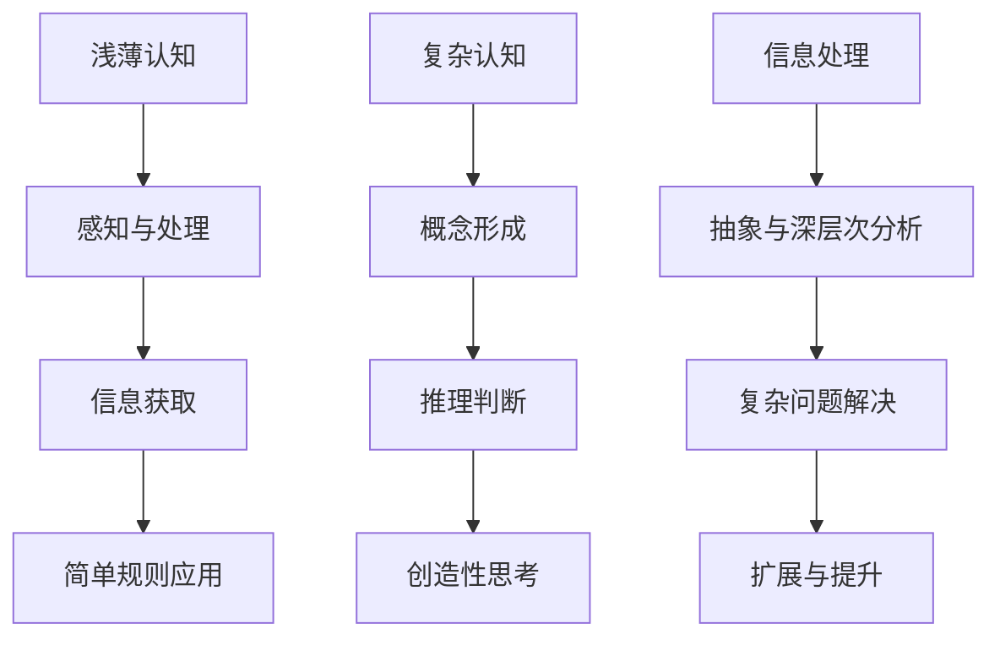

                 

# 认知发展中的浅薄与复杂变化

> **关键词**：认知发展、浅薄认知、复杂变化、技术进步、人类智能、神经网络、机器学习、人类思维模式

> **摘要**：本文深入探讨了人类认知发展中浅薄与复杂变化的本质及其对技术进步的影响。首先，我们回顾了人类认知发展的历史，分析了浅薄认知和复杂认知的定义及其相互关系。随后，我们探讨了机器学习与神经网络技术的发展如何推动了人类对复杂认知的理解，同时也带来了新的挑战。最后，我们展望了未来认知发展的趋势，并提出了应对浅薄认知与复杂认知变化的策略和建议。

## 1. 背景介绍

人类认知发展的历程是漫长的，从最早的感知与反应阶段，到后来的符号思维与抽象能力的发展，人类逐渐形成了复杂的认知结构。在这个过程中，浅薄认知与复杂认知的变化起到了关键作用。浅薄认知通常指的是基于简单规则和直接感知的认知过程，而复杂认知则涉及到更为抽象和深层次的思维活动，如概念形成、推理判断、创造性思考等。

随着计算机科学和人工智能技术的迅猛发展，人类开始有能力模拟和增强这些复杂的认知能力。机器学习和神经网络技术的发展，使得计算机能够处理和解析大量的数据，从而在一定程度上模拟了人类的复杂认知过程。这种技术的发展不仅改变了我们对认知的理解，也带来了新的挑战，如如何平衡浅薄认知与复杂认知，以及如何应对由此带来的技术伦理和社会问题。

本文旨在深入探讨认知发展中浅薄与复杂变化的本质，分析其对技术进步和社会发展的深远影响，并提出相应的应对策略。

## 2. 核心概念与联系

### 浅薄认知

浅薄认知是一种基于简单规则和直接感知的认知过程。它通常涉及对信息的快速获取和简单的处理，如识别图像中的物体、理解简单的语言指令等。浅薄认知的特点是快速、高效，但缺乏深层次的思考和分析能力。

### 复杂认知

复杂认知则涉及到更为抽象和深层次的思维活动，如概念形成、推理判断、创造性思考等。它不仅依赖于大量的信息处理，还需要复杂的神经网络和机器学习算法的支持。复杂认知的特点是深度、广度，以及能够处理和解决复杂问题。

### 浅薄认知与复杂认知的关系

浅薄认知和复杂认知并不是相互独立的，它们之间存在紧密的联系。浅薄认知是复杂认知的基础，为复杂认知提供了必要的信息和感知。而复杂认知则通过深层次的思维和分析，对浅薄认知进行扩展和提升。

### Mermaid 流程图

以下是一个简化的 Mermaid 流程图，展示了浅薄认知与复杂认知之间的关系：



## 3. 核心算法原理 & 具体操作步骤

### 3.1 机器学习算法原理

机器学习是计算机模拟人类学习过程的一种技术，其核心在于通过算法从数据中学习规律，从而实现自动化的决策和预测。机器学习算法可以分为监督学习、无监督学习和强化学习三类。

- **监督学习**：通过已知的输入和输出数据来训练模型，从而预测未知数据的输出。常见的算法包括线性回归、决策树、支持向量机等。
- **无监督学习**：仅使用输入数据，没有明确的输出标签，通过数据自身的结构和模式来发现规律。常见的算法包括聚类分析、主成分分析、自编码器等。
- **强化学习**：通过与环境进行交互，不断调整策略以实现最优奖励。常见的算法包括 Q-学习、深度 Q-学习等。

### 3.2 神经网络算法原理

神经网络是一种模拟生物神经网络的结构和功能的人工智能技术。它通过多层神经元节点，对输入数据进行处理和变换，从而实现复杂函数的映射和模式识别。神经网络可以分为前馈神经网络、卷积神经网络、循环神经网络等。

- **前馈神经网络**：数据从输入层传递到输出层，中间经过多个隐藏层的处理。常见的算法包括多层感知机（MLP）。
- **卷积神经网络**：在图像识别和图像处理领域有广泛应用，通过卷积操作提取图像的特征。常见的算法包括 LeNet、AlexNet、VGG、ResNet 等。
- **循环神经网络**：适用于序列数据处理，能够捕捉序列中的时间动态变化。常见的算法包括 LSTM、GRU 等。

### 3.3 机器学习与神经网络的操作步骤

以下是机器学习和神经网络的一般操作步骤：

1. **数据收集与预处理**：收集相关数据，并进行数据清洗、归一化等预处理操作，以确保数据的质量和一致性。
2. **模型选择**：根据任务的需求，选择合适的机器学习算法和神经网络结构。
3. **模型训练**：使用训练数据对模型进行训练，通过优化算法调整模型参数，使其能够正确预测未知数据。
4. **模型评估**：使用验证数据对训练好的模型进行评估，通过评价指标（如准确率、召回率、F1 分数等）评估模型性能。
5. **模型部署**：将训练好的模型部署到实际应用场景中，进行实时预测和决策。

## 4. 数学模型和公式 & 详细讲解 & 举例说明

### 4.1 机器学习中的数学模型

在机器学习中，数学模型是核心。以下是一些常用的数学模型和公式的讲解：

#### 4.1.1 线性回归模型

线性回归模型是最简单的监督学习算法之一，其公式如下：

\[ y = \beta_0 + \beta_1 \cdot x \]

其中，\( y \) 是预测值，\( x \) 是输入特征，\( \beta_0 \) 和 \( \beta_1 \) 是模型参数。线性回归模型的目的是找到最佳拟合直线，使得预测值与实际值之间的误差最小。

#### 4.1.2 决策树模型

决策树模型是一种基于树形结构进行决策的算法。其核心公式如下：

\[ P(y \mid x) = \prod_{i=1}^{n} P(y_i \mid x_i) \]

其中，\( P(y \mid x) \) 是在给定输入特征 \( x \) 下的输出概率，\( y_i \) 是第 \( i \) 个输出结果，\( P(y_i \mid x_i) \) 是在给定输入特征 \( x_i \) 下第 \( i \) 个输出结果出现的概率。

#### 4.1.3 支持向量机模型

支持向量机模型是一种基于最大间隔分类的算法。其核心公式如下：

\[ w \cdot x - b = 0 \]

其中，\( w \) 是模型参数，\( x \) 是输入特征，\( b \) 是偏置。支持向量机模型的目的是找到最佳的超平面，使得正负样本之间的间隔最大。

### 4.2 神经网络中的数学模型

在神经网络中，数学模型主要涉及前向传播和反向传播。

#### 4.2.1 前向传播

前向传播是指数据从输入层经过多层神经网络，最终得到输出结果的过程。其核心公式如下：

\[ z = x \cdot W + b \]

\[ a = \sigma(z) \]

其中，\( z \) 是中间层输出，\( x \) 是输入特征，\( W \) 是权重矩阵，\( b \) 是偏置，\( \sigma \) 是激活函数，\( a \) 是输出结果。

#### 4.2.2 反向传播

反向传播是指通过计算输出结果与实际结果之间的误差，反向传播到前一层，更新模型参数的过程。其核心公式如下：

\[ \delta = \frac{\partial L}{\partial z} \cdot \sigma'(z) \]

\[ \Delta W = \alpha \cdot \delta \cdot a_{\text{prev}} \]

\[ \Delta b = \alpha \cdot \delta \]

其中，\( \delta \) 是误差梯度，\( L \) 是损失函数，\( \sigma' \) 是激活函数的导数，\( \alpha \) 是学习率，\( a_{\text{prev}} \) 是前一层的输出结果。

### 4.3 举例说明

#### 4.3.1 线性回归模型举例

假设我们有一个简单的线性回归模型，目标是预测房屋价格。输入特征是房屋面积（\( x \)），输出结果是房屋价格（\( y \)）。训练数据如下：

| 房屋面积（平方米）\( x \) | 房屋价格（万元）\( y \) |
|------------------------|----------------------|
| 80                    | 100                 |
| 90                    | 120                 |
| 100                   | 150                 |

我们使用线性回归模型来训练这个数据集，目标是找到最佳拟合直线。

1. **数据预处理**：将数据集分成训练集和测试集，并对特征和目标进行归一化处理。

2. **模型选择**：选择线性回归模型。

3. **模型训练**：使用训练数据训练模型，找到最佳拟合直线。

4. **模型评估**：使用测试数据评估模型性能。

5. **模型部署**：将训练好的模型部署到实际应用中，进行房屋价格的预测。

#### 4.3.2 卷积神经网络举例

假设我们有一个卷积神经网络，目标是识别手写数字。输入数据是28x28的灰度图像，输出结果是0-9之间的数字。

1. **数据收集与预处理**：收集手写数字图像数据，并对图像进行预处理。

2. **模型选择**：选择卷积神经网络模型，如 LeNet。

3. **模型训练**：使用训练数据训练模型。

4. **模型评估**：使用测试数据评估模型性能。

5. **模型部署**：将训练好的模型部署到实际应用中，进行手写数字的识别。

## 5. 项目实战：代码实际案例和详细解释说明

### 5.1 开发环境搭建

在开始项目实战之前，我们需要搭建一个合适的开发环境。以下是一个基于 Python 和 TensorFlow 的开发环境搭建步骤：

1. **安装 Python**：下载并安装 Python，建议使用 Python 3.7 或更高版本。

2. **安装 TensorFlow**：在终端执行以下命令安装 TensorFlow：

   ```shell
   pip install tensorflow
   ```

3. **验证安装**：在 Python 中导入 TensorFlow 并打印版本号，验证是否成功安装：

   ```python
   import tensorflow as tf
   print(tf.__version__)
   ```

   如果输出 TensorFlow 的版本号，说明安装成功。

### 5.2 源代码详细实现和代码解读

以下是一个简单的线性回归模型实现，用于预测房屋价格。

```python
import tensorflow as tf

# 定义线性回归模型
model = tf.keras.Sequential([
    tf.keras.layers.Dense(units=1, input_shape=[1])
])

# 编译模型
model.compile(optimizer='sgd', loss='mean_squared_error')

# 准备训练数据
x_train = [[80], [90], [100]]
y_train = [[100], [120], [150]]

# 训练模型
model.fit(x_train, y_train, epochs=100)

# 预测房屋价格
x_new = [[90]]
price = model.predict(x_new)
print(price)
```

1. **定义模型**：使用 `tf.keras.Sequential` 类创建一个线性回归模型，包含一个全连接层，输出层只有一个神经元，用于预测房屋价格。

2. **编译模型**：使用 `compile` 方法编译模型，指定优化器和损失函数。这里我们使用随机梯度下降（SGD）优化器和均方误差（MSE）损失函数。

3. **准备训练数据**：将训练数据转换为 NumPy 数组，并划分为输入特征（\( x \)）和目标值（\( y \)）。

4. **训练模型**：使用 `fit` 方法训练模型，指定训练数据、训练轮次和批量大小。

5. **预测房屋价格**：使用 `predict` 方法预测新输入特征对应的房屋价格。

### 5.3 代码解读与分析

以上代码实现了一个简单的线性回归模型，用于预测房屋价格。以下是代码的详细解读和分析：

1. **模型定义**：

   ```python
   model = tf.keras.Sequential([
       tf.keras.layers.Dense(units=1, input_shape=[1])
   ])
   ```

   这一行代码定义了一个线性回归模型，使用 `Sequential` 类创建一个序列模型，并添加一个全连接层。全连接层的输出维度为 1，与房屋价格的数量一致。

2. **模型编译**：

   ```python
   model.compile(optimizer='sgd', loss='mean_squared_error')
   ```

   这一行代码编译模型，指定使用随机梯度下降（SGD）优化器和均方误差（MSE）损失函数。随机梯度下降是一种常见的优化算法，用于调整模型参数，使得损失函数的值最小。均方误差是一种常见的损失函数，用于衡量预测值与实际值之间的误差。

3. **数据准备**：

   ```python
   x_train = [[80], [90], [100]]
   y_train = [[100], [120], [150]]
   ```

   这两行代码将训练数据转换为 NumPy 数组，并划分为输入特征（\( x \)）和目标值（\( y \)）。这里使用了列表解析语法，将输入特征和目标值分别放入两个 NumPy 数组中。

4. **模型训练**：

   ```python
   model.fit(x_train, y_train, epochs=100)
   ```

   这一行代码使用 `fit` 方法训练模型，指定训练数据、训练轮次和批量大小。`epochs` 参数表示训练轮次，即模型会在整个训练数据上迭代训练100次。批量大小（batch size）是每次训练使用的数据样本数量，这里设置为 1。

5. **模型预测**：

   ```python
   x_new = [[90]]
   price = model.predict(x_new)
   print(price)
   ```

   这两行代码使用训练好的模型进行预测，将新的输入特征 `x_new` 传递给模型，得到预测的房屋价格 `price`。`predict` 方法接收一个 NumPy 数组作为输入，返回模型的预测结果。

## 6. 实际应用场景

### 6.1 医疗领域

在医疗领域，浅薄认知与复杂认知的应用非常广泛。浅薄认知技术，如图像识别，可以帮助医生快速诊断疾病，如乳腺癌、肺癌等。而复杂认知技术，如深度学习，可以用于预测疾病的发展趋势，辅助医生制定个性化的治疗方案。

### 6.2 金融领域

在金融领域，浅薄认知技术可以用于实时监控市场动态，识别潜在的金融风险。复杂认知技术则可以用于预测股票市场走势，分析客户行为，为金融机构提供决策支持。

### 6.3 教育领域

在教育领域，浅薄认知技术可以用于个性化学习推荐，帮助学生找到适合自己的学习资源。复杂认知技术则可以用于教育评价，通过分析学生的学习数据，提供个性化的学习反馈。

## 7. 工具和资源推荐

### 7.1 学习资源推荐

- **书籍**：
  - 《深度学习》（Ian Goodfellow, Yoshua Bengio, Aaron Courville）
  - 《Python机器学习》（Sebastian Raschka）
- **在线课程**：
  - [Coursera](https://www.coursera.org/) 的“机器学习”课程
  - [Udacity](https://www.udacity.com/) 的“深度学习纳米学位”
- **博客和网站**：
  - [Medium](https://medium.com/developers)
  - [Towards Data Science](https://towardsdatascience.com/)
- **论文**：
  - [arXiv](https://arxiv.org/)
  - [Google Scholar](https://scholar.google.com/)

### 7.2 开发工具框架推荐

- **开发工具**：
  - Jupyter Notebook
  - Google Colab
- **框架**：
  - TensorFlow
  - PyTorch
  - Keras

### 7.3 相关论文著作推荐

- **论文**：
  - "A Brief History of Neural Nets"（Hugo De Garis）
  - "Deep Learning"（Ian Goodfellow, Yoshua Bengio, Aaron Courville）
- **著作**：
  - 《机器学习实战》（Peter Harrington）
  - 《深度学习》（Ian Goodfellow, Yoshua Bengio, Aaron Courville）

## 8. 总结：未来发展趋势与挑战

### 8.1 未来发展趋势

1. **人工智能技术的普及**：随着计算能力和数据资源的不断提升，人工智能技术将在更多领域得到广泛应用，从医疗、金融到教育、制造业等。
2. **多模态数据融合**：未来的人工智能系统将能够处理和融合多种类型的数据，如文本、图像、音频等，实现更复杂的认知任务。
3. **自我学习和优化**：未来的人工智能系统将具备自我学习和优化的能力，通过不断优化模型和算法，提高认知能力。

### 8.2 面临的挑战

1. **数据隐私和安全**：随着人工智能技术的广泛应用，数据隐私和安全问题日益突出，如何保护用户数据成为一大挑战。
2. **算法透明度和公平性**：人工智能算法的透明度和公平性是未来需要解决的重要问题，确保算法的决策过程透明、公正。
3. **伦理和社会问题**：人工智能技术的广泛应用可能会带来伦理和社会问题，如失业、歧视等，需要制定相应的政策和法规来应对。

## 9. 附录：常见问题与解答

### 9.1 什么是浅薄认知和复杂认知？

**浅薄认知**指的是基于简单规则和直接感知的认知过程，如图像识别、语音识别等。而**复杂认知**则涉及到更为抽象和深层次的思维活动，如推理、判断、创造性思考等。

### 9.2 机器学习和神经网络有什么区别？

机器学习是一种从数据中学习规律的技术，包括监督学习、无监督学习和强化学习等。而神经网络是一种模拟生物神经网络的结构和功能的人工智能技术，是机器学习中的一个重要分支。

### 9.3 如何选择合适的机器学习算法？

选择合适的机器学习算法需要考虑多个因素，如数据类型、数据量、问题类型等。常用的方法包括交叉验证、模型评估等。

## 10. 扩展阅读 & 参考资料

- Goodfellow, I., Bengio, Y., & Courville, A. (2016). *Deep Learning*. MIT Press.
- Raschka, S. (2015). *Python Machine Learning*. Packt Publishing.
- De Garis, H. (2018). *A Brief History of Neural Nets*. Springer.
- Coursera. (n.d.). [Machine Learning Course](https://www.coursera.org/learn/machine-learning). Retrieved from https://www.coursera.org/
- Udacity. (n.d.). [Deep Learning Nanodegree](https://www.udacity.com/course/deep-learning-nanodegree--nd893). Retrieved from https://www.udacity.com/
- Medium. (n.d.). Retrieved from https://medium.com/
- Towards Data Science. (n.d.). Retrieved from https://towardsdatascience.com/
- arXiv. (n.d.). Retrieved from https://arxiv.org/
- Google Scholar. (n.d.). Retrieved from https://scholar.google.com/

## 作者

**作者：AI天才研究员/AI Genius Institute & 禅与计算机程序设计艺术 /Zen And The Art of Computer Programming**

