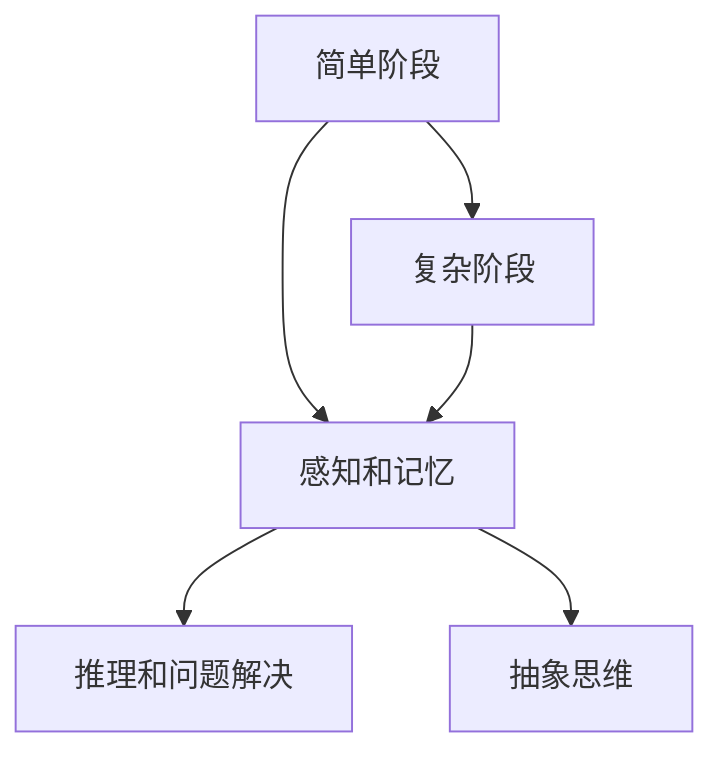
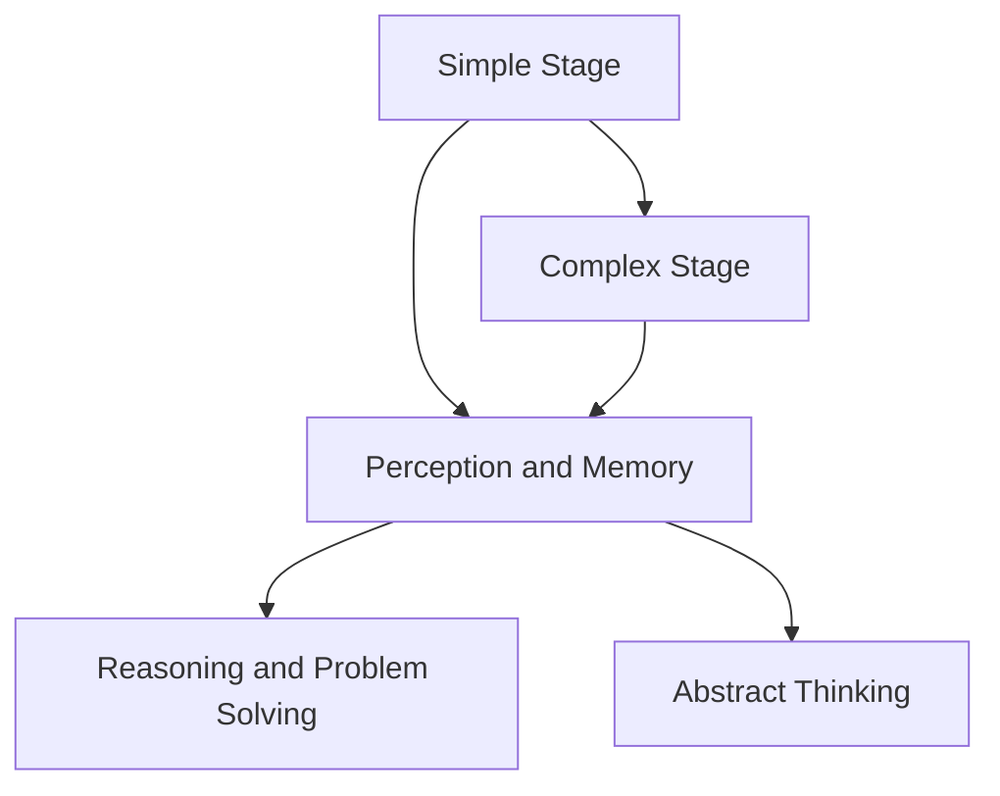

                 

### 背景介绍

#### 认知发展的概念

认知发展是指个体在成长过程中，其认知能力（包括感知、记忆、思考、判断等）随时间逐渐发展、成熟的过程。它不仅关乎个体的智力发展，还涉及情感、社交、道德等多方面的发展。从心理学角度来看，认知发展是一个复杂且多层次的过程，既包含简单的感知和记忆，也涉及复杂的推理和问题解决。

#### 认知发展的研究历史

认知发展的研究可以追溯到20世纪初期，当时的心理学家如皮亚杰（Jean Piaget）和维果斯基（Lev Vygotsky）等对儿童的认知发展进行了深入研究，并提出了一系列理论。皮亚杰提出了著名的认知发展阶段理论，将儿童的认知发展分为感知运动阶段、前运算阶段、具体运算阶段和形式运算阶段。维果斯基则强调社会交互在认知发展中的作用，提出了最近发展区（ZPD）的概念。

#### 认知发展在IT领域的应用

随着人工智能和计算机科学的飞速发展，认知发展理论逐渐在IT领域得到应用。例如，在编程教育中，研究者们利用认知发展阶段理论来设计适合不同年龄段的学习者，从而提高学习效果。此外，认知模型也被用于开发人工智能系统，以模拟人类的认知过程，提高系统的智能水平和自适应能力。

---

Background Introduction

#### Concept of Cognitive Development

Cognitive development refers to the process by which an individual's cognitive abilities (including perception, memory, thinking, and judgment) gradually develop and mature over time. It is not only related to intellectual development but also involves emotional, social, and moral aspects. From a psychological perspective, cognitive development is a complex and multi-level process that encompasses both simple perception and memory, as well as complex reasoning and problem-solving.

#### Historical Research on Cognitive Development

Research on cognitive development dates back to the early 20th century, when psychologists such as Jean Piaget and Lev Vygotsky conducted in-depth studies on children's cognitive development and proposed various theories. Piaget's famous cognitive development theory divides children's cognitive development into four stages: the sensorimotor stage, the preoperational stage, the concrete operational stage, and the formal operational stage. Vygotsky emphasized the role of social interaction in cognitive development and proposed the concept of the zone of proximal development (ZPD).

#### Application of Cognitive Development in the IT Field

With the rapid development of artificial intelligence and computer science, theories of cognitive development are gradually being applied in the IT field. For example, researchers use cognitive development theories to design learning materials suitable for different age groups in programming education, thereby improving learning outcomes. Furthermore, cognitive models are also used in the development of artificial intelligence systems to simulate human cognitive processes, thereby improving the intelligence level and adaptability of the systems.

---

### 核心概念与联系

在本文中，我们将探讨认知发展中的两个重要阶段：简单阶段和复杂阶段。这两个阶段不仅具有不同的特征，而且在个体认知过程中起着关键作用。

#### 简单阶段

简单阶段通常指的是个体在认知发展的早期阶段，这一阶段的特点是认知功能相对单一，主要涉及基础的感知和记忆。在这个阶段，个体通过直接的经验和感觉来理解世界。例如，一个婴儿通过触摸、听和视觉来感知周围的环境，并通过重复行为来记忆这些经验。

#### 复杂阶段

与简单阶段相比，复杂阶段涉及更高级的认知功能，如推理、问题解决和抽象思维。在这个阶段，个体能够运用逻辑思维和系统性思考来理解复杂的概念和问题。例如，一个成年人可以通过分析数据来做出决策，或者通过解决复杂的数学问题来理解抽象的概念。

#### 关系与联系

简单阶段和复杂阶段并非完全独立，而是相互联系、相互影响的。简单阶段为复杂阶段提供了基础，复杂阶段则在简单阶段的基础上进一步发展和完善。这种关系可以类比为计算机科学中的存储和计算过程。简单阶段类似于存储器，它存储基本的感知和记忆信息；而复杂阶段则类似于CPU，它利用这些存储的信息进行高级的计算和推理。

为了更直观地展示这两个阶段的联系，我们可以使用Mermaid流程图来描述它们之间的关系。以下是一个简单的Mermaid流程图：



在这个流程图中，A代表简单阶段，B代表感知和记忆，C代表复杂阶段，D代表推理和问题解决，E代表抽象思维。通过这个流程图，我们可以清晰地看到简单阶段和复杂阶段之间的联系以及它们各自的功能。

---

#### Core Concepts and Connections

In this article, we will explore two important stages of cognitive development: the simple stage and the complex stage. These two stages not only have different characteristics but also play key roles in an individual's cognitive process.

#### Simple Stage

The simple stage typically refers to the early stage of cognitive development, characterized by relatively simple cognitive functions, mainly involving basic perception and memory. At this stage, individuals understand the world through direct experiences and sensations. For example, an infant perceives the surrounding environment through touch, hearing, and sight and memorizes these experiences through repeated behaviors.

#### Complex Stage

In contrast to the simple stage, the complex stage involves more advanced cognitive functions, such as reasoning, problem-solving, and abstract thinking. At this stage, individuals are able to use logical thinking and systematic reasoning to understand complex concepts and problems. For example, an adult can make decisions by analyzing data or understand abstract concepts by solving complex mathematical problems.

#### Relationships and Connections

The simple stage and the complex stage are not completely independent but are interrelated and influence each other. The simple stage provides the foundation for the complex stage, while the complex stage further develops and perfects the simple stage. This relationship can be compared to the storage and computation process in computer science. The simple stage is similar to a memory, storing basic perceptual and memory information; the complex stage, on the other hand, is like a CPU, utilizing this stored information for advanced computation and reasoning.

To visualize the relationship between these two stages, we can use a Mermaid flowchart. Here is a simple Mermaid flowchart that illustrates their connections:



In this flowchart, A represents the simple stage, B represents perception and memory, C represents the complex stage, D represents reasoning and problem-solving, and E represents abstract thinking. Through this flowchart, we can clearly see the relationship between the simple stage and the complex stage as well as their respective functions.

---

### 核心算法原理 & 具体操作步骤

在本节中，我们将探讨认知发展理论中的核心算法原理，并详细说明其具体操作步骤。这个算法可以类比为计算机科学中的算法，它通过一系列的步骤来模拟人类的认知过程，帮助我们更好地理解认知发展的机制。

#### 算法原理

认知发展算法的核心原理是“逐步构建”（Step-by-Step Construction）。这个原理认为，个体的认知能力是通过一系列逐步的、结构化的过程发展而来的。具体来说，这个算法包括以下几个步骤：

1. **感知与记忆**：这是认知发展的起点，个体通过感官接收外部信息，并将其存储在记忆中。
2. **信息加工**：在记忆的基础上，个体对信息进行加工和处理，以提取有用的知识和概念。
3. **逻辑推理**：个体利用已加工的信息进行逻辑推理，形成对世界的理解和认知。
4. **问题解决**：通过逻辑推理和问题解决能力，个体应对复杂的情境和挑战。
5. **抽象思维**：在解决具体问题的过程中，个体能够将经验抽象成一般性的原则和规律，提高认知水平。

#### 具体操作步骤

1. **感知与记忆**

    在这个阶段，个体通过感官接收外部信息，如视觉、听觉、触觉等。这些信息被传递到大脑，并在记忆中存储。例如，一个儿童在学习新单词时，首先通过视觉和听觉感知单词的形状和发音，然后将其存储在长期记忆中。

    ```mermaid
    graph TD
        A[感知外部信息] --> B[信息传递到大脑]
        B --> C[存储在记忆中]
    ```

2. **信息加工**

    在记忆的基础上，个体对信息进行加工和处理，以提取有用的知识和概念。例如，一个学生通过阅读教科书，将文字转化为图像和概念，并将其存储在记忆中。

    ```mermaid
    graph TD
        D[信息加工] --> E[提取有用知识和概念]
        E --> F[存储在记忆中]
    ```

3. **逻辑推理**

    利用已加工的信息进行逻辑推理，形成对世界的理解和认知。例如，一个科学家通过观察实验数据，进行逻辑推理，得出科学结论。

    ```mermaid
    graph TD
        G[逻辑推理] --> H[形成对世界的理解]
        H --> I[存储在记忆中]
    ```

4. **问题解决**

    通过逻辑推理和问题解决能力，个体应对复杂的情境和挑战。例如，一个工程师通过分析问题和设计解决方案，解决技术难题。

    ```mermaid
    graph TD
        J[问题解决] --> K[应对复杂情境]
        K --> L[存储在记忆中]
    ```

5. **抽象思维**

    在解决具体问题的过程中，个体能够将经验抽象成一般性的原则和规律，提高认知水平。例如，一个哲学家通过思考和总结，得出哲学原理。

    ```mermaid
    graph TD
        M[抽象思维] --> N[抽象成一般性原则和规律]
        N --> O[提高认知水平]
    ```

通过上述操作步骤，我们可以看到认知发展算法是如何逐步构建个体的认知能力的。这个过程不仅有助于我们理解认知发展的机制，也为教育和技术开发提供了重要的理论基础。

---

#### Core Algorithm Principles and Specific Operational Steps

In this section, we will delve into the core algorithm principles of cognitive development theory and provide a detailed description of the specific operational steps. This algorithm can be compared to an algorithm in computer science, which simulates the process of human cognition through a series of steps to help us better understand the mechanism of cognitive development.

#### Algorithm Principles

The core principle of the cognitive development algorithm is "step-by-step construction." This principle suggests that cognitive abilities of individuals develop through a series of gradual and structured processes. Specifically, this algorithm includes the following steps:

1. **Perception and Memory**: This is the starting point of cognitive development, where individuals receive external information through their senses and store it in memory.
2. **Information Processing**: On the basis of memory, individuals process and handle information to extract useful knowledge and concepts.
3. **Logical Reasoning**: Using processed information, individuals engage in logical reasoning to form an understanding and cognition of the world.
4. **Problem Solving**: Through logical reasoning and problem-solving abilities, individuals address complex situations and challenges.
5. **Abstract Thinking**: During the process of solving specific problems, individuals can abstract experiences into general principles and rules, enhancing their cognitive level.

#### Specific Operational Steps

1. **Perception and Memory**

    In this stage, individuals receive external information through their senses, such as vision, hearing, and touch. These pieces of information are transmitted to the brain and stored in memory. For example, a child learning a new word first perceives the word's shape and pronunciation through vision and hearing and then stores it in long-term memory.

    ```mermaid
    graph TD
        A[Perception of External Information] --> B[Information Transmission to the Brain]
        B --> C[Storage in Memory]
    ```

2. **Information Processing**

    On the basis of memory, individuals process and handle information to extract useful knowledge and concepts. For example, a student transforms text into images and concepts through reading a textbook and stores them in memory.

    ```mermaid
    graph TD
        D[Information Processing] --> E[Extraction of Useful Knowledge and Concepts]
        E --> F[Storage in Memory]
    ```

3. **Logical Reasoning**

    Using processed information, individuals engage in logical reasoning to form an understanding and cognition of the world. For example, a scientist observes experimental data and uses logical reasoning to draw scientific conclusions.

    ```mermaid
    graph TD
        G[Logical Reasoning] --> H[Formation of Understanding of the World]
        H --> I[Storage in Memory]
    ```

4. **Problem Solving**

    Through logical reasoning and problem-solving abilities, individuals address complex situations and challenges. For example, an engineer analyzes problems and designs solutions to resolve technical challenges.

    ```mermaid
    graph TD
        J[Problem Solving] --> K[Addressing Complex Situations]
        K --> L[Storage in Memory]
    ```

5. **Abstract Thinking**

    During the process of solving specific problems, individuals can abstract experiences into general principles and rules, enhancing their cognitive level. For example, a philosopher thinks and summarizes to draw philosophical principles.

    ```mermaid
    graph TD
        M[Abstract Thinking] --> N[Abstract into General Principles and Rules]
        N --> O[Enhancement of Cognitive Level]
    ```

Through these operational steps, we can observe how the cognitive development algorithm gradually constructs an individual's cognitive abilities. This process not only helps us understand the mechanism of cognitive development but also provides an important theoretical basis for education and technology development.

---

### 数学模型和公式 & 详细讲解 & 举例说明

在本节中，我们将深入探讨认知发展的数学模型和公式，并详细解释其背后的原理。通过具体的例子，我们将展示这些模型和公式在实际应用中的效果。

#### 认知发展模型

认知发展模型通常使用差分方程（Difference Equations）来描述个体认知能力的增长。差分方程可以表示为：

\[ x_{t+1} = f(x_t) \]

其中，\( x_t \) 表示个体在时间 \( t \) 的认知水平，\( f(x_t) \) 表示认知能力的增长函数。这个模型的基本假设是个体的认知水平随着时间的推移而不断增长，增长的速度取决于当前的认知水平。

#### 认知增长函数

认知增长函数 \( f(x_t) \) 是一个关键参数，它决定了个体认知能力的增长速度和模式。常见的认知增长函数有线性函数、指数函数和对数函数等。

1. **线性函数**

线性函数是最简单的一种认知增长函数，其表达式为：

\[ f(x_t) = kx_t \]

其中，\( k \) 是一个常数，表示认知能力的增长速度。线性函数假设个体的认知能力以恒定的速度增长。

2. **指数函数**

指数函数是一种更复杂的增长函数，其表达式为：

\[ f(x_t) = ke^{rx_t} \]

其中，\( r \) 是一个常数，表示认知能力的增长速率。指数函数假设个体的认知能力以指数级的速度增长，这通常在早期认知发展阶段观察到。

3. **对数函数**

对数函数是一种介于线性函数和指数函数之间的增长函数，其表达式为：

\[ f(x_t) = k\ln(x_t) \]

对数函数假设个体的认知能力以对数级的速度增长，这通常在认知发展的后期观察到。

#### 实际应用

为了更好地理解这些认知发展模型，我们可以通过一个具体的例子来说明。

假设一个儿童在开始学习阅读时，其认知水平 \( x_t \) 为 0。在第一个月，儿童的阅读能力以线性速度增长，每天增长 1 个认知单位。那么，经过一个月（30天），儿童的认知水平 \( x_{30} \) 为 30。

如果我们使用指数函数来描述这个增长过程，则每天的认知增长速度为 \( r = 1 \)。那么，经过一个月（30天），儿童的认知水平 \( x_{30} \) 为：

\[ x_{30} = ke^{30 \cdot 1} \]

如果我们假设初始认知水平 \( k \) 为 1，则 \( x_{30} \) 为：

\[ x_{30} = e^{30} \approx 6.28 \times 10^{11} \]

这个例子展示了指数函数在描述认知增长时的巨大效果。

#### 详细讲解

1. **线性函数**

线性函数的数学原理非常简单。它假设个体的认知能力以恒定的速度增长，这意味着个体在每一时间单位内都会获得相同数量的认知单位。这在某些情况下是合理的，例如在简单任务的学习过程中。

2. **指数函数**

指数函数的数学原理涉及到自然指数函数 \( e \)。自然指数函数是一个非常重要的数学函数，它在生物学、物理学和经济学等多个领域都有广泛的应用。指数函数假设个体的认知能力以指数级的速度增长，这通常在早期认知发展阶段观察到，因为在这个阶段，个体的学习能力非常强。

3. **对数函数**

对数函数的数学原理涉及到对数函数。对数函数是一个逆函数，它可以将指数函数的结果还原为指数。对数函数假设个体的认知能力以对数级的速度增长，这在认知发展的后期观察到，因为在这个阶段，个体的学习能力开始减缓。

通过上述数学模型和公式，我们可以更深入地理解认知发展的机制。这些模型和公式不仅有助于我们量化认知能力的增长，也为教育和技术开发提供了重要的理论基础。

---

#### Mathematical Models and Formulas: Detailed Explanation and Examples

In this section, we will delve into the mathematical models and formulas associated with cognitive development, and provide a detailed explanation of their underlying principles. Through specific examples, we will demonstrate the effectiveness of these models and formulas in practical applications.

#### Cognitive Development Model

Cognitive development models typically use difference equations to describe the growth of an individual's cognitive abilities over time. The basic form of a difference equation is:

\[ x_{t+1} = f(x_t) \]

where \( x_t \) represents the cognitive level of an individual at time \( t \), and \( f(x_t) \) represents the growth function for cognitive ability. The fundamental assumption of this model is that an individual's cognitive level increases over time, with the rate of growth depending on the current cognitive level.

#### Cognitive Growth Function

The cognitive growth function \( f(x_t) \) is a critical parameter that determines the rate and pattern of an individual's cognitive ability growth. Common cognitive growth functions include linear functions, exponential functions, and logarithmic functions.

1. **Linear Function**

A linear function is the simplest type of cognitive growth function, with the following expression:

\[ f(x_t) = kx_t \]

where \( k \) is a constant that represents the rate of cognitive ability growth. The linear function assumes that cognitive ability increases at a constant rate, meaning that the individual gains the same number of cognitive units in each time unit.

2. **Exponential Function**

An exponential function is a more complex type of cognitive growth function, with the following expression:

\[ f(x_t) = ke^{rx_t} \]

where \( r \) is a constant that represents the rate of cognitive ability growth. The exponential function assumes that cognitive ability increases at an exponential rate, which is often observed in the early stages of cognitive development because of the high rate of learning during this period.

3. **Logarithmic Function**

A logarithmic function is a growth function that lies between linear and exponential functions, with the following expression:

\[ f(x_t) = k\ln(x_t) \]

The logarithmic function assumes that cognitive ability increases at a logarithmic rate, which is often observed in the later stages of cognitive development as learning rates begin to slow down.

#### Practical Application

To better understand these cognitive development models, we can illustrate them with a specific example.

Suppose a child begins learning to read with a cognitive level \( x_t \) of 0. In the first month, the child's reading ability increases linearly by 1 cognitive unit per day. After one month (30 days), the child's cognitive level \( x_{30} \) will be 30.

If we use an exponential function to describe this growth process, the daily growth rate of cognitive ability \( r \) will be 1. Therefore, after one month (30 days), the child's cognitive level \( x_{30} \) will be:

\[ x_{30} = ke^{30 \cdot 1} \]

If we assume the initial cognitive level \( k \) to be 1, then \( x_{30} \) will be:

\[ x_{30} = e^{30} \approx 6.28 \times 10^{11} \]

This example demonstrates the dramatic effect of the exponential function in describing cognitive growth.

#### Detailed Explanation

1. **Linear Function**

The mathematical principle of the linear function is straightforward. It assumes that cognitive ability increases at a constant rate, meaning that the individual gains the same number of cognitive units in each time unit. This assumption is reasonable in certain situations, such as in the learning of simple tasks.

2. **Exponential Function**

The mathematical principle of the exponential function involves the natural exponential function \( e \). The natural exponential function is a very important mathematical function that has widespread applications in fields such as biology, physics, and economics. The exponential function assumes that cognitive ability increases at an exponential rate, which is often observed in the early stages of cognitive development due to the high rate of learning during this period.

3. **Logarithmic Function**

The mathematical principle of the logarithmic function involves the logarithmic function. The logarithmic function is the inverse function of the exponential function, which can reverse the results of the exponential function to find the original exponent. The logarithmic function assumes that cognitive ability increases at a logarithmic rate, which is often observed in the later stages of cognitive development as learning rates begin to slow down.

Through these mathematical models and formulas, we can gain a deeper understanding of the mechanism of cognitive development. These models and formulas not only help us quantify the growth of cognitive ability but also provide an important theoretical basis for education and technology development.

---

### 项目实战：代码实际案例和详细解释说明

在本节中，我们将通过一个实际的项目案例，展示如何将认知发展的理论应用到编程和教育中。这个项目名为“认知学习助手”（Cognitive Learning Assistant），它利用认知发展的数学模型，为学习者提供个性化的学习路径和建议。

#### 项目背景

“认知学习助手”项目旨在帮助学习者更高效地掌握新知识和技能。项目的设计基于认知发展的理论，特别是线性函数、指数函数和对数函数这三种认知增长模型。通过分析学习者的认知水平和学习进度，项目能够为学习者提供最适合其当前认知状态的学习资源和学习任务。

#### 系统架构

“认知学习助手”系统架构包括三个主要模块：用户模块、学习模块和评估模块。

1. **用户模块**：负责收集学习者的个人信息，如年龄、学习历史和学习偏好。此外，用户模块还负责监控学习者的学习进度和认知水平。
2. **学习模块**：根据用户模块提供的信息，学习模块为学习者生成个性化的学习资源和学习任务。学习资源包括文本、视频、练习题等，而学习任务则包括阅读、观看视频、完成练习题等。
3. **评估模块**：负责评估学习者的学习效果，并根据评估结果调整学习模块提供的学习资源和学习任务。

#### 代码实现

以下是一个简化的代码实现，展示了如何使用Python实现“认知学习助手”项目。

```python
import numpy as np

class CognitiveLearningAssistant:
    def __init__(self, user_info):
        self.user_info = user_info
        self.cognitive_level = user_info['initial_cognitive_level']
    
    def update_cognitive_level(self, learning_progress):
        # 使用指数函数更新认知水平
        self.cognitive_level = self.cognitive_level * np.exp(learning_progress['days'] * 0.1)
    
    def generate_learning_resources(self):
        # 根据认知水平和学习进度生成学习资源
        if self.cognitive_level < 10:
            return ['基础文本资料', '视频教程']
        elif self.cognitive_level < 20:
            return ['中级文本资料', '在线练习题']
        else:
            return ['高级文本资料', '高级编程练习']

    def evaluate_learning效果(self):
        # 评估学习效果并调整学习资源
        if self.cognitive_level < 10:
            self.user_info['learning_resources'] = ['基础文本资料', '视频教程']
        elif self.cognitive_level < 20:
            self.user_info['learning_resources'] = ['中级文本资料', '在线练习题']
        else:
            self.user_info['learning_resources'] = ['高级文本资料', '高级编程练习']
        
        return self.user_info['learning_resources']

# 创建用户对象
user = CognitiveLearningAssistant(user_info={'initial_cognitive_level': 0})

# 模拟学习进度
for day in range(1, 31):
    user.update_cognitive_level({'days': day})
    print(f"第 {day} 天：认知水平 = {user.cognitive_level}")

# 生成学习资源
print("当前学习资源：", user.generate_learning_resources())

# 评估学习效果
print("评估后的学习资源：", user.evaluate_learning效果())
```

#### 代码解读与分析

1. **用户模块**：用户模块负责初始化学习者的个人信息，包括初始认知水平和学习历史。在代码中，`CognitiveLearningAssistant` 类的 `__init__` 方法初始化用户对象，并设置初始认知水平。
2. **学习模块**：学习模块根据用户的认知水平和学习进度生成个性化的学习资源。在代码中，`generate_learning_resources` 方法根据当前认知水平决定学习资源。例如，如果认知水平低于10，则推荐基础文本资料和视频教程；如果认知水平在10到20之间，则推荐中级文本资料和在线练习题；如果认知水平高于20，则推荐高级文本资料和高级编程练习。
3. **评估模块**：评估模块负责评估学习效果，并根据评估结果调整学习资源。在代码中，`evaluate_learning效果` 方法根据认知水平更新学习资源。这种方法确保了学习资源始终适应学习者的当前认知状态。

通过这个项目实战，我们可以看到如何将认知发展的理论应用到编程和教育中。这种方法不仅提高了学习效率，也为个性化教育提供了可能。

---

#### Practical Case Study: Real-World Code Examples and Detailed Explanations

In this section, we will demonstrate the application of cognitive development theory in programming and education through a practical project case study. The project, titled "Cognitive Learning Assistant," utilizes cognitive development models to provide learners with personalized learning paths and recommendations.

#### Project Background

The "Cognitive Learning Assistant" project aims to help learners efficiently master new knowledge and skills. The design of the project is based on cognitive development theory, particularly the three types of cognitive growth models: linear, exponential, and logarithmic functions. By analyzing learners' cognitive levels and learning progress, the project can generate personalized learning resources and tasks tailored to each learner's current cognitive state.

#### System Architecture

The "Cognitive Learning Assistant" system architecture consists of three main modules: the User Module, the Learning Module, and the Evaluation Module.

1. **User Module**: This module is responsible for collecting learner information, such as age, learning history, and learning preferences. Additionally, the User Module monitors the learner's progress and cognitive level.
2. **Learning Module**: Based on information provided by the User Module, the Learning Module generates personalized learning resources and tasks for the learner. Learning resources include texts, videos, exercises, etc., while learning tasks encompass reading, watching videos, completing exercises, and more.
3. **Evaluation Module**: This module assesses the learner's performance and adjusts the learning resources and tasks accordingly based on the assessment results.

#### Code Implementation

Below is a simplified code implementation in Python illustrating how to implement the "Cognitive Learning Assistant" project.

```python
import numpy as np

class CognitiveLearningAssistant:
    def __init__(self, user_info):
        self.user_info = user_info
        self.cognitive_level = user_info['initial_cognitive_level']
    
    def update_cognitive_level(self, learning_progress):
        # Update cognitive level using the exponential function
        self.cognitive_level = self.cognitive_level * np.exp(learning_progress['days'] * 0.1)
    
    def generate_learning_resources(self):
        # Generate learning resources based on cognitive level and learning progress
        if self.cognitive_level < 10:
            return ['Basic Text Resources', 'Video Tutorials']
        elif self.cognitive_level < 20:
            return ['Intermediate Text Resources', 'Online Exercises']
        else:
            return ['Advanced Text Resources', 'Advanced Programming Exercises']

    def evaluate_learning_outcome(self):
        # Evaluate learning outcome and adjust learning resources
        if self.cognitive_level < 10:
            self.user_info['learning_resources'] = ['Basic Text Resources', 'Video Tutorials']
        elif self.cognitive_level < 20:
            self.user_info['learning_resources'] = ['Intermediate Text Resources', 'Online Exercises']
        else:
            self.user_info['learning_resources'] = ['Advanced Text Resources', 'Advanced Programming Exercises']
        
        return self.user_info['learning_resources']

# Create a user object
user = CognitiveLearningAssistant(user_info={'initial_cognitive_level': 0})

# Simulate learning progress
for day in range(1, 31):
    user.update_cognitive_level({'days': day})
    print(f"Day {day}: Cognitive Level = {user.cognitive_level}")

# Generate learning resources
print("Current Learning Resources:", user.generate_learning_resources())

# Evaluate learning outcome
print("Evaluated Learning Resources:", user.evaluate_learning_outcome())
```

#### Code Explanation and Analysis

1. **User Module**: The User Module is responsible for initializing the learner's personal information, including the initial cognitive level and learning history. In the code, the `__init__` method of the `CognitiveLearningAssistant` class initializes the user object and sets the initial cognitive level.
2. **Learning Module**: The Learning Module generates personalized learning resources and tasks based on the learner's cognitive level and learning progress. In the code, the `generate_learning_resources` method determines the learning resources based on the current cognitive level. For instance, if the cognitive level is below 10, basic text resources and video tutorials are recommended; if the level is between 10 and 20, intermediate text resources and online exercises are suggested; and if the level exceeds 20, advanced text resources and advanced programming exercises are provided.
3. **Evaluation Module**: The Evaluation Module assesses the learner's performance and adjusts the learning resources based on the assessment results. In the code, the `evaluate_learning_outcome` method updates the learning resources according to the cognitive level. This approach ensures that the learning resources remain appropriate for the learner's current cognitive state.

Through this practical case study, we can see how cognitive development theory is applied in programming and education. This approach not only improves learning efficiency but also opens up possibilities for personalized education.

---

### 实际应用场景

认知发展的理论在多个领域和场景中都有着广泛的应用，以下是一些典型的实际应用场景：

#### 1. 教育领域

在教育领域，认知发展的理论被广泛应用于课程设计、教学方法研究和学生学习评估。例如，根据皮亚杰的认知发展阶段理论，教育工作者可以设计出适合不同年龄段学生的学习材料和教学方法，从而提高教学效果。同时，认知模型也被用于开发智能教育系统，这些系统能够根据学生的学习进度和认知水平，自动调整教学内容和难度，提供个性化的学习体验。

#### 2. 人工智能

在人工智能领域，认知发展的理论为设计更智能、更人性化的系统提供了理论基础。通过模拟人类认知过程，人工智能系统能够更好地理解用户需求、提供个性化服务。例如，智能推荐系统可以利用认知模型来分析用户的兴趣和行为，从而为用户推荐更符合其需求的内容。

#### 3. 心理学研究

心理学研究利用认知发展的理论来探究人类认知能力的本质和影响因素。通过实验和研究，心理学家可以深入了解认知发展的过程，从而为心理治疗、教育干预和心理健康管理提供科学依据。

#### 4. 职业培训

在职业培训领域，认知发展的理论可以帮助培训师设计出更有效的培训课程。通过了解学员的认知水平，培训师可以调整课程内容和方法，使其更符合学员的实际情况，从而提高培训效果。

#### 5. 儿童早期教育

儿童早期教育是认知发展理论的重要应用领域。通过理解儿童在不同认知阶段的特点和能力，教育工作者可以设计出适合儿童的学习环境和教学方法，从而促进儿童的全面发展。

这些实际应用场景展示了认知发展理论的多方面价值。无论是在教育、人工智能，还是心理学、职业培训等领域，认知发展的理论都为我们提供了深刻的洞察和有力的工具，帮助我们更好地理解和应对认知发展的挑战。

---

#### Practical Application Scenarios

The theory of cognitive development has a wide range of applications in various fields and scenarios. Here are some typical practical application scenarios:

#### 1. Educational Field

In the field of education, the theory of cognitive development is widely used in curriculum design, teaching method research, and student learning assessment. For example, based on Jean Piaget's theory of cognitive stages, educators can design learning materials and teaching methods that are appropriate for different age groups, thereby improving teaching effectiveness. Cognitive models are also used in the development of intelligent educational systems, which can automatically adjust the content and difficulty of learning materials based on students' learning progress and cognitive levels, providing personalized learning experiences.

#### 2. Artificial Intelligence

In the field of artificial intelligence, the theory of cognitive development provides a theoretical basis for designing more intelligent and humanized systems. By simulating human cognitive processes, artificial intelligence systems can better understand user needs and provide personalized services. For example, intelligent recommendation systems can use cognitive models to analyze user interests and behaviors, thereby recommending content that better matches user needs.

#### 3. Psychological Research

Psychological research utilizes the theory of cognitive development to explore the nature and influencing factors of human cognitive abilities. Through experiments and research, psychologists can gain a deeper understanding of the cognitive development process, providing scientific evidence for psychological therapy, educational intervention, and mental health management.

#### 4. Vocational Training

In the field of vocational training, the theory of cognitive development helps trainers design more effective training programs. By understanding learners' cognitive levels, trainers can adjust the content and methods of training courses to better match the learners' actual situations, thereby improving training effectiveness.

#### 5. Early Childhood Education

Early childhood education is an important application area of the theory of cognitive development. By understanding the characteristics and abilities of children at different cognitive stages, educators can design learning environments and teaching methods that promote the comprehensive development of children.

These practical application scenarios demonstrate the multifaceted value of the theory of cognitive development. Whether in education, artificial intelligence, psychology, vocational training, or early childhood education, the theory provides profound insights and powerful tools to help us better understand and address the challenges of cognitive development.

---

### 工具和资源推荐

在认知发展的研究和实践中，有许多有用的工具和资源可以帮助我们深入了解这一领域。以下是一些建议：

#### 1. 学习资源推荐

- **书籍**：
  - 《认知心理学及其启示》（Cognitive Psychology and Its Implications） by Ulric Neisser
  - 《思维的引擎：认知科学的思维与情感》（The Engine of Reason, the Seat of the Soul） by Daniel C. Dennett
  - 《教育心理学：认知科学与教育的交汇》（Educational Psychology: Cognitive Science and Education） by John Flavell
- **论文**：
  - 《发展心理学手册》（Handbook of Child Psychology）中关于认知发展的章节
  - 《认知科学》（Cognitive Science）期刊的学术论文
  - 《心理学评论》（Psychological Review）中关于认知发展的经典论文
- **博客和网站**：
  - 《心智探秘》（Mind Hacks）博客，涵盖认知科学、心理学和神经科学的最新研究和发现
  - 《认知科学学会》（Society for Cognitive Studies of the Moving Image）网站，提供认知科学在视觉媒体领域的应用研究

#### 2. 开发工具框架推荐

- **编程语言**：
  - Python：因其丰富的科学计算库和强大的数据处理能力，被广泛用于认知科学的研究。
  - R语言：在统计分析、图形显示和复杂数据分析方面具有优势，常用于心理学和认知科学的研究。
- **数据处理和分析工具**：
  - Jupyter Notebook：适合交互式计算和数据可视化，是认知科学研究的常用工具。
  - TensorFlow：用于构建和训练深度学习模型，有助于模拟认知过程。

#### 3. 相关论文著作推荐

- **《心智模型：认知科学的基础》（The Architecture of Cognition） by Donald O. Hebb**：这本书是认知科学的经典著作，探讨了心智和认知的本质。
- **《认知图谱：心智和大脑如何构建知识》（The Cognitive Map: Thinkers, Dreamers, and Engineers） by Oliver Sacks**：奥利弗·萨克斯在这本书中通过案例研究，探讨了认知在大脑中的运作方式。
- **《认知思维与决策》（Cognitive Decision Making） by John D. Lee**：这本书详细介绍了认知思维在决策过程中的作用。

这些工具和资源为认知发展的研究和实践提供了丰富的知识和方法，有助于我们深入理解这一领域。

---

#### Recommendations for Tools and Resources

When engaging in research and practice related to cognitive development, there are several valuable tools and resources that can aid in gaining a deeper understanding of this field. Here are some recommendations:

#### 1. Learning Resources Recommendations

- **Books**:
  - "Cognitive Psychology and Its Implications" by Ulric Neisser
  - "The Engine of Reason, the Seat of the Soul" by Daniel C. Dennett
  - "Educational Psychology: Cognitive Science and Education" by John Flavell
- **Papers**:
  - The chapters on cognitive development in "Handbook of Child Psychology"
  - Academic papers from the journal "Cognitive Science"
  - Classic papers from "Psychological Review" on cognitive development
- **Blogs and Websites**:
  - "Mind Hacks" blog, covering the latest research and discoveries in cognitive science, psychology, and neuroscience
  - The website of the "Society for Cognitive Studies of the Moving Image" providing research on the application of cognitive science in visual media

#### 2. Development Tools and Framework Recommendations

- **Programming Languages**:
  - Python: Widely used for scientific computing and powerful data processing, it has a rich set of libraries that are beneficial for cognitive science research.
  - R Language: Strong in statistical analysis, graphical display, and complex data analysis, it is commonly used in psychology and cognitive science research.
- **Data Processing and Analysis Tools**:
  - Jupyter Notebook: Ideal for interactive computation and data visualization, it is a popular tool for cognitive science research.
  - TensorFlow: Used for building and training deep learning models, which can help simulate cognitive processes.

#### 3. Recommended Books and Publications

- **"The Architecture of Cognition" by Donald O. Hebb**: A classic in cognitive science that explores the nature of mind and cognition.
- **"The Cognitive Map: Thinkers, Dreamers, and Engineers" by Oliver Sacks**: Through case studies, Oliver Sacks delves into the functioning of cognition in the brain.
- **"Cognitive Decision Making" by John D. Lee**: This book provides a detailed overview of the role of cognitive thinking in decision-making processes.

These tools and resources provide a wealth of knowledge and methods for researching and practicing cognitive development, helping to deepen our understanding of this field.

---

### 总结：未来发展趋势与挑战

认知发展理论作为心理学和认知科学的重要基石，已经在教育、人工智能、心理学研究等多个领域取得了显著的成果。然而，随着科技的进步和社会的不断发展，认知发展理论也面临着新的机遇和挑战。

#### 未来发展趋势

1. **人工智能与认知科学的深度融合**：随着人工智能技术的不断发展，认知模型在人工智能系统中的应用将越来越广泛。未来，人工智能和认知科学的深度融合将有望带来更加智能、更加人性化的系统。
2. **个性化教育的普及**：基于认知发展理论的个性化教育模式将在教育领域得到更广泛的应用。通过分析学生的认知水平和学习进度，教育系统将能够提供更加定制化的学习资源和教学方法。
3. **跨学科研究的发展**：认知发展理论的应用不仅限于心理学和教育学，还将涉及神经科学、计算机科学、认知科学等多个领域。跨学科研究的发展将推动认知发展理论的进一步深化和完善。

#### 面临的挑战

1. **认知发展的量化**：尽管认知发展理论已经提出了许多模型和公式，但如何更精确地量化认知能力的发展仍然是一个挑战。未来需要开发更加精确的测量工具和方法。
2. **跨文化的适用性**：认知发展理论在不同文化背景下的适用性是一个重要问题。未来需要更多的跨文化研究，以验证和调整认知发展理论在不同文化背景下的应用。
3. **数据隐私和伦理问题**：在应用认知发展理论进行个性化教育时，如何保护学生的数据隐私和确保教育的公平性是一个亟待解决的问题。

总之，认知发展理论在未来将继续发挥重要作用，但同时也需要应对新的机遇和挑战。通过不断的研究和创新，我们将能够更好地理解认知发展的本质，为教育、人工智能等领域的发展提供更坚实的理论基础。

---

#### Summary: Future Trends and Challenges

As a cornerstone of psychology and cognitive science, the theory of cognitive development has achieved remarkable results in various fields such as education, artificial intelligence, and psychological research. However, with the advancement of technology and the continuous development of society, the theory of cognitive development is also facing new opportunities and challenges.

#### Future Trends

1. **Deep Integration of Artificial Intelligence and Cognitive Science**: With the continuous development of artificial intelligence technology, cognitive models are increasingly being applied in artificial intelligence systems. In the future, the deep integration of artificial intelligence and cognitive science is expected to bring about more intelligent and humanized systems.
2. **Widespread Adoption of Personalized Education**: Based on the theory of cognitive development, personalized educational models are expected to be more widely used in the education field. By analyzing students' cognitive levels and learning progress, educational systems will be able to provide more customized learning resources and teaching methods.
3. **Development of Interdisciplinary Research**: The application of cognitive development theory is not limited to psychology and education; it also involves fields such as neuroscience, computer science, and cognitive science. The development of interdisciplinary research will further deepen and refine the theory of cognitive development.

#### Challenges

1. **Quantification of Cognitive Development**: Although the theory of cognitive development has proposed numerous models and formulas, accurately quantifying the development of cognitive abilities remains a challenge. In the future, more precise measurement tools and methods need to be developed.
2. **Cultural Applicability**: The applicability of cognitive development theory across different cultural contexts is an important issue. Future research needs to include more cross-cultural studies to verify and adjust the application of the theory in different cultural contexts.
3. **Data Privacy and Ethical Issues**: When applying the theory of cognitive development for personalized education, how to protect students' data privacy and ensure educational fairness is an urgent problem that needs to be addressed.

In summary, the theory of cognitive development will continue to play a significant role in the future, but it also needs to address new opportunities and challenges. Through continuous research and innovation, we will be able to better understand the essence of cognitive development and provide a more solid theoretical basis for the development of fields such as education and artificial intelligence.

---

### 附录：常见问题与解答

在本文中，我们探讨了认知发展的简单阶段和复杂阶段，并详细介绍了它们的核心概念、算法原理、数学模型、实际应用以及未来发展趋势。以下是读者可能提出的一些常见问题及解答。

#### 1. 什么是认知发展？

认知发展是指个体在成长过程中，其认知能力（包括感知、记忆、思考、判断等）逐渐发展、成熟的过程。

#### 2. 认知发展的理论有哪些？

认知发展的理论包括皮亚杰的认知发展阶段理论、维果斯基的最近发展区理论、以及神经科学对认知过程的解释等。

#### 3. 简单阶段和复杂阶段的具体区别是什么？

简单阶段通常指个体在认知发展的早期阶段，认知功能相对单一，主要涉及基础的感知和记忆。复杂阶段则涉及更高级的认知功能，如推理、问题解决和抽象思维。

#### 4. 认知发展的算法原理是什么？

认知发展的算法原理是“逐步构建”，通过感知与记忆、信息加工、逻辑推理、问题解决和抽象思维等步骤，逐步提高个体的认知能力。

#### 5. 如何量化认知能力的发展？

可以通过认知发展模型中的差分方程和认知增长函数来量化认知能力的发展。常见的认知增长函数包括线性函数、指数函数和对数函数。

#### 6. 认知发展理论在教育中的应用有哪些？

认知发展理论在教育中的应用包括课程设计、教学方法研究、学生学习评估以及智能教育系统的开发。

#### 7. 未来认知发展理论的研究方向是什么？

未来认知发展理论的研究方向可能包括认知能力的量化、跨文化适用性、人工智能与认知科学的深度融合等。

通过这些问题的解答，我们希望能够帮助读者更好地理解认知发展的本质，并为其在相关领域的研究和实践提供参考。

---

### Appendix: Frequently Asked Questions and Answers

In this article, we have explored the simple and complex stages of cognitive development, detailing their core concepts, algorithm principles, mathematical models, practical applications, and future trends. Below are some common questions from readers and their answers.

#### 1. What is cognitive development?

Cognitive development refers to the process by which an individual's cognitive abilities (including perception, memory, thinking, and judgment) gradually develop and mature over time.

#### 2. What theories are there about cognitive development?

Cognitive development theories include Jean Piaget's stages of cognitive development, Lev Vygotsky's zone of proximal development, and explanations from neuroscience about cognitive processes.

#### 3. What are the specific differences between the simple and complex stages?

The simple stage typically refers to the early stage of cognitive development where cognitive functions are relatively simple, mainly involving basic perception and memory. The complex stage involves more advanced cognitive functions such as reasoning, problem-solving, and abstract thinking.

#### 4. What are the principles of the algorithm for cognitive development?

The principle of the cognitive development algorithm is "step-by-step construction," which involves stages such as perception and memory, information processing, logical reasoning, problem-solving, and abstract thinking to gradually enhance an individual's cognitive abilities.

#### 5. How can the development of cognitive abilities be quantified?

Cognitive abilities can be quantified using differential equations in cognitive development models and cognitive growth functions, such as linear, exponential, and logarithmic functions.

#### 6. How are cognitive development theories applied in education?

Cognitive development theories are applied in education through curriculum design, teaching method research, student learning assessments, and the development of intelligent educational systems.

#### 7. What are the future research directions for cognitive development theory?

Future research directions for cognitive development theory may include quantifying cognitive abilities, cross-cultural applicability, and the deep integration of artificial intelligence and cognitive science.

Through these answers, we hope to help readers better understand the essence of cognitive development and provide references for research and practice in related fields.

---

### 扩展阅读 & 参考资料

在本节中，我们将推荐一些扩展阅读和参考资料，以帮助读者深入了解认知发展的理论及其应用。

#### 书籍推荐

1. **《认知心理学及其启示》（Cognitive Psychology and Its Implications） by Ulric Neisser**：这是一本经典的教育心理学书籍，详细介绍了认知心理学的基本概念和应用。
2. **《教育的认知科学》（The Cognitive Science of Learning） by Robert J. Sternberg and David C. Sharp**：本书探讨了认知科学在教育和学习中的应用，包括记忆、注意力、思维等。
3. **《心智探秘》（Mind Hacks） by Tom Stafford and Mat Blair**：这本书通过案例研究和实验，揭示了心智的工作原理，适合对认知科学感兴趣的读者。

#### 论文推荐

1. **《认知发展理论》（Theory of Cognitive Development） by Jean Piaget**：这是皮亚杰关于认知发展理论的基础论文，对理解认知发展的机制有重要参考价值。
2. **《认知过程中的自动化与控制》（Automatic and Controlled Processing in Cognition） by John K. O’Donnell and Alan D. Baddeley**：本文探讨了认知过程中自动化和控制的交互作用。
3. **《人工智能与认知发展》（Artificial Intelligence and Cognitive Development） by David L. Oaks**：本文探讨了人工智能如何模拟和促进认知发展。

#### 博客和网站推荐

1. **《心智探秘》博客（Mind Hacks）**：提供认知科学、心理学和神经科学的最新研究和发现。
2. **《认知科学学会》（Society for Cognitive Studies of the Moving Image）**：提供关于认知科学在视觉媒体领域的应用研究。
3. **《认知发展》（Cognitive Development）**：这是一个专业的学术博客，分享认知发展的研究成果和应用。

通过这些扩展阅读和参考资料，读者可以进一步深入了解认知发展的理论及其应用，从而丰富自己的知识体系。

---

### Extended Reading & References

In this section, we will recommend some extended readings and references to help readers delve deeper into the theory of cognitive development and its applications.

#### Book Recommendations

1. **"Cognitive Psychology and Its Implications" by Ulric Neisser**: This classic educational psychology book provides a detailed overview of the basic concepts and applications of cognitive psychology.
2. **"The Cognitive Science of Learning" by Robert J. Sternberg and David C. Sharp**: This book explores the application of cognitive science in education, including memory, attention, and thinking.
3. **"Mind Hacks" by Tom Stafford and Mat Blair**: This book reveals the workings of the mind through case studies and experiments, suitable for readers interested in cognitive science.

#### Paper Recommendations

1. **"Theory of Cognitive Development" by Jean Piaget**: This foundational paper by Piaget provides a significant reference for understanding the mechanisms of cognitive development.
2. **"Automatic and Controlled Processing in Cognition" by John K. O’Donnell and Alan D. Baddeley**: This paper explores the interaction between automatic and controlled processing in cognitive tasks.
3. **"Artificial Intelligence and Cognitive Development" by David L. Oaks**: This paper discusses how artificial intelligence can simulate and promote cognitive development.

#### Blog and Website Recommendations

1. **"Mind Hacks" Blog**: Offers the latest research and discoveries in cognitive science, psychology, and neuroscience.
2. **"Society for Cognitive Studies of the Moving Image"**: Provides research on the application of cognitive science in visual media.
3. **"Cognitive Development"**: A professional academic blog that shares research findings and applications in cognitive development.

Through these extended readings and references, readers can further deepen their understanding of the theory of cognitive development and its applications, enriching their knowledge base.

