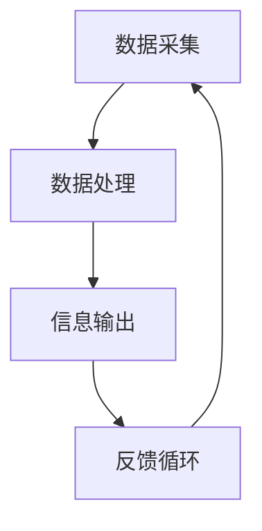

                 

### 认知增强与伦理边界的探讨

#### 关键词：认知增强，伦理边界，人工智能，道德哲学，技术进步

#### 摘要：

本文旨在探讨认知增强技术在人工智能领域的应用，以及随之而来的伦理边界问题。随着技术的不断进步，人工智能已经渗透到我们的日常生活和工作中，为人类带来了巨大的便利。然而，与此同时，我们也面临着一系列的伦理挑战。本文将从认知增强的定义、工作原理、应用场景、伦理问题等方面进行详细分析，并探讨可能的解决方案。希望通过本文的讨论，能够为认知增强技术的发展提供有益的指导，推动人工智能领域更加健康、可持续的发展。

<|assistant|>## 1. 背景介绍

认知增强（Cognitive Augmentation）是指通过技术手段提高人类的认知能力，包括记忆、注意、决策、创造力等方面。随着人工智能技术的快速发展，认知增强已经成为一个备受关注的研究领域。认知增强技术可以应用于医疗、教育、工业、军事等多个领域，为人类带来巨大的价值。

然而，认知增强技术的应用也引发了一系列的伦理问题。例如，认知增强技术可能会加剧社会不平等，使得富人和穷人之间的认知差距进一步扩大；认知增强技术可能会导致隐私泄露，个人数据被滥用；认知增强技术还可能被用于不正当的目的，例如提高战争机器人的作战能力等。

本文将重点讨论认知增强与伦理边界的关系，分析现有伦理理论框架，探讨认知增强技术在不同应用场景中的伦理问题，并提出可能的解决方案。希望通过本文的讨论，能够为认知增强技术的伦理研究提供一些有价值的参考。

### 1.1 认知增强的定义与工作原理

认知增强是指通过技术手段提高人类认知能力的过程。认知能力包括记忆、注意力、决策、创造力等多个方面。认知增强技术可以通过多种方式实现，例如：

- **记忆增强**：通过药物、神经植入、虚拟现实等技术手段，提高人类的记忆能力。例如，研究人员已经开发出一种名为“记忆插针”的技术，可以在大脑中植入电极，帮助患者恢复记忆。

- **注意力增强**：通过药物、神经反馈、虚拟现实等技术手段，提高人类的注意力集中能力。例如，一些研究已经表明，通过使用神经反馈装置，可以训练用户的注意力，提高其在复杂环境中的表现。

- **决策增强**：通过数据分析、机器学习等技术手段，帮助用户做出更明智的决策。例如，一些智能助手已经能够根据用户的历史行为和偏好，提供个性化的建议和决策支持。

- **创造力增强**：通过虚拟现实、艺术创作软件等技术手段，激发用户的创造力。例如，一些研究人员使用虚拟现实技术，模拟出各种创意场景，帮助用户产生新的想法。

认知增强技术的实现通常涉及到多个领域，包括神经科学、计算机科学、心理学等。其中，神经科学提供了认知增强的理论基础，计算机科学提供了技术手段，而心理学则提供了实验方法和评估标准。通过跨学科的合作，认知增强技术得以不断发展和完善。

### 1.2 认知增强技术的应用场景

认知增强技术已经广泛应用于多个领域，包括医疗、教育、工业、军事等。

- **医疗领域**：认知增强技术在医疗领域的应用包括记忆恢复、注意力提高、决策支持等。例如，通过记忆增强技术，可以帮助阿尔茨海默病患者恢复记忆，提高生活质量；通过注意力增强技术，可以帮助手术医生在复杂手术中保持高度集中；通过决策增强技术，可以帮助医生在诊断和治疗过程中做出更明智的决策。

- **教育领域**：认知增强技术在教育领域的应用包括学习效果提升、个性化教学等。例如，通过记忆增强技术，可以帮助学生提高记忆能力，更好地掌握知识；通过注意力增强技术，可以帮助学生提高学习效率；通过创造力增强技术，可以激发学生的创造力，培养创新思维。

- **工业领域**：认知增强技术在工业领域的应用包括自动化控制、故障诊断等。例如，通过记忆增强技术，可以帮助工业机器人提高记忆能力，更好地执行复杂任务；通过注意力增强技术，可以帮助工业控制系统保持高度集中，提高生产效率。

- **军事领域**：认知增强技术在军事领域的应用包括战争决策、作战能力提升等。例如，通过决策增强技术，可以帮助军事指挥官在复杂战场上做出更明智的决策；通过注意力增强技术，可以帮助士兵在战斗中保持高度集中，提高作战能力。

总之，认知增强技术具有广泛的应用前景，可以为人类社会带来巨大的价值。然而，随着技术的不断发展，我们也需要关注其潜在的伦理问题，确保技术的应用不会对人类造成负面影响。

### 1.3 伦理问题及其挑战

尽管认知增强技术在各个领域都展现出了巨大的潜力，但其应用也引发了一系列伦理问题。这些问题主要集中在隐私、安全、公平、透明度等方面。

- **隐私**：认知增强技术往往依赖于大量个人数据，例如大脑活动、行为模式等。这些数据如果被不当使用或泄露，可能会对个人隐私造成严重威胁。

- **安全**：认知增强技术可能会被用于不正当的目的，例如操纵市场、欺骗等。此外，由于技术的复杂性和脆弱性，认知增强系统也可能成为网络攻击的目标。

- **公平**：认知增强技术可能会加剧社会不平等，使得富人和穷人之间的认知差距进一步扩大。例如，只有富裕人群才能负担得起高级认知增强技术，从而在教育和职业竞争中占据优势。

- **透明度**：认知增强技术的应用过程和结果往往不够透明，用户可能无法了解技术的具体工作原理和潜在风险。

面对这些伦理问题，我们需要制定相应的伦理规范和法律法规，确保认知增强技术的安全、公平、透明应用。

### 1.4 当前研究现状

目前，关于认知增强与伦理边界的研究已经取得了一定的成果。学术界和产业界都在积极探索如何平衡技术进步和伦理问题。

- **学术研究**：许多学者从哲学、伦理学、社会学等角度对认知增强技术的伦理问题进行了深入探讨。例如，一些研究提出了基于道德原则的决策框架，用于指导认知增强技术的研发和应用。

- **产业实践**：一些企业已经开始尝试制定伦理规范，例如谷歌的AI原则、微软的AI伦理指南等。这些规范旨在确保认知增强技术的安全、公平、透明应用。

- **政策制定**：一些国家和组织也着手制定相关政策，以规范认知增强技术的应用。例如，欧盟发布了《人工智能伦理准则》，提出了保障人类尊严、安全、隐私等方面的要求。

总体来说，当前关于认知增强与伦理边界的研究还处于起步阶段，需要进一步加强跨学科合作，推动伦理理论的创新和实践。

### 1.5 本文结构

本文将按照以下结构进行讨论：

- **第2章**：核心概念与联系。介绍认知增强技术的核心概念原理和架构，使用Mermaid流程图展示其工作流程。

- **第3章**：核心算法原理与具体操作步骤。详细讲解认知增强技术的主要算法原理，并提供具体操作步骤。

- **第4章**：数学模型和公式。介绍认知增强技术中的关键数学模型和公式，并举例说明。

- **第5章**：项目实战。通过实际案例，展示认知增强技术的具体应用，并提供详细解释说明。

- **第6章**：实际应用场景。探讨认知增强技术在不同领域的应用场景，分析其潜在价值与挑战。

- **第7章**：工具和资源推荐。推荐学习资源、开发工具框架和相关论文著作。

- **第8章**：总结与展望。总结本文的主要观点，探讨认知增强技术的未来发展趋势与挑战。

- **第9章**：常见问题与解答。针对认知增强与伦理边界的相关问题，提供解答和指导。

- **第10章**：扩展阅读与参考资料。列出本文引用的文献和参考资料，供读者进一步阅读和研究。

通过以上章节的讨论，本文旨在为认知增强技术的伦理研究提供有价值的参考，推动人工智能领域的健康发展。

### 2. 核心概念与联系

在深入探讨认知增强技术的原理与应用之前，我们需要明确其核心概念，并了解这些概念之间的相互联系。以下是认知增强技术中几个重要的核心概念，以及它们之间的关联。

#### 2.1 认知增强的概念

认知增强是指通过外部辅助手段来提升人类认知能力的过程。这些手段包括但不限于技术工具、药物、神经植入等。认知增强的目标是帮助人类在记忆、注意力、决策和创造力等方面取得显著进步。

#### 2.2 认知科学与神经科学的关系

认知科学是研究人类认知过程和机制的跨学科领域，涉及心理学、神经科学、计算机科学等多个学科。神经科学则专注于大脑的结构和功能，特别是在认知功能中的表现。认知科学与神经科学的结合为认知增强技术提供了理论基础。

- **认知科学**：通过研究人类的心理过程，认知科学提供了关于记忆、注意力、决策等认知能力的科学理解。
- **神经科学**：通过研究大脑的结构和功能，神经科学揭示了认知能力在大脑中的具体实现方式。

#### 2.3 认知增强技术的组成部分

认知增强技术通常包括以下几个关键组成部分：

- **传感器**：用于监测大脑活动，如脑电图（EEG）、功能性磁共振成像（fMRI）等。
- **处理算法**：用于分析传感器收集的数据，提取有用的信息，并生成辅助决策。
- **输出设备**：将处理结果以某种形式呈现给用户，如视觉反馈、听觉提示等。

#### 2.4 认知增强技术的工作流程

认知增强技术的工作流程可以概括为以下几个步骤：

1. **数据采集**：通过传感器收集大脑活动数据。
2. **数据处理**：使用算法分析数据，识别出有用的模式和信息。
3. **信息输出**：根据处理结果，通过输出设备向用户反馈信息。
4. **反馈循环**：用户根据反馈调整自己的行为，形成反馈循环。

以下是认知增强技术的Mermaid流程图，展示了其工作流程：



#### 2.5 认知增强技术的应用领域

认知增强技术的应用领域广泛，包括但不限于以下几个方面：

- **医疗健康**：帮助患者恢复记忆、提高注意力，辅助康复治疗。
- **教育**：提供个性化学习方案，提高学习效率和创造力。
- **工业生产**：增强工人的注意力，提高生产效率和安全性。
- **军事应用**：提升士兵的决策能力和反应速度，增强作战能力。

#### 2.6 认知增强与伦理边界的联系

认知增强技术的发展带来了许多伦理问题，如隐私、安全、公平和透明度等。这些伦理问题需要通过严格的伦理框架和规范来解决。

- **隐私**：认知增强技术依赖于大量个人数据，隐私保护成为关键问题。
- **安全**：认知增强系统可能成为网络攻击的目标，安全性至关重要。
- **公平**：认知增强技术可能会加剧社会不平等，需要制定公平的分配机制。
- **透明度**：认知增强技术的应用过程和结果需要透明，确保用户知情权。

通过以上对核心概念和联系的探讨，我们可以更好地理解认知增强技术的工作原理和应用场景，为其进一步发展提供理论基础。

#### 2.1 认知增强的定义与工作原理

认知增强（Cognitive Augmentation）是指通过技术手段提升人类的认知能力，包括记忆、注意力、决策和创造力等方面。其目标是帮助人类在面对复杂环境时，能够更有效地处理信息和作出决策。认知增强技术的发展主要依托于神经科学、计算机科学和心理学等领域的交叉研究。

**认知增强的原理：**

1. **神经基础**：认知增强技术首先需要理解人类大脑的工作机制。神经科学提供了关于大脑如何处理信息、存储记忆以及如何进行决策等方面的科学知识。例如，通过脑电图（EEG）和功能性磁共振成像（fMRI）等手段，研究人员可以实时监测大脑活动，识别出与特定认知功能相关的脑区。

2. **技术手段**：认知增强技术利用各种技术手段来实现认知能力的提升。这些技术包括：

   - **脑机接口（BMI）**：通过电极或植入物直接与大脑神经信号连接，实现大脑与外部设备的信息交换。脑机接口可以用于控制计算机、辅助肢体运动，甚至恢复某些认知功能。

   - **药物**：通过药物调节大脑化学物质，如多巴胺、去甲肾上腺素等，提高注意力、记忆和学习能力。例如，莫达非那（Modafinil）被广泛用于治疗嗜睡症，也被用于提高认知能力。

   - **神经反馈**：通过监测大脑活动，然后将反馈信息回传给用户，帮助用户自我调节认知状态。例如，通过虚拟现实技术，用户可以在游戏中通过调整注意力来提高表现。

   - **虚拟现实（VR）与增强现实（AR）**：通过VR和AR技术，创造虚拟环境，模拟各种认知任务，帮助用户在虚拟世界中提高认知能力。

3. **算法与数据分析**：计算机科学和人工智能算法在认知增强中发挥了重要作用。通过机器学习和数据分析技术，可以从大量数据中提取有用信息，帮助用户更好地理解和处理复杂信息。

**认知增强的应用场景：**

认知增强技术在多个领域都展现出巨大的应用潜力：

- **医疗健康**：认知增强技术可以用于帮助患者恢复记忆、提高注意力，辅助治疗脑部疾病，如阿尔茨海默病、中风等。

- **教育**：在教育领域，认知增强技术可以提供个性化学习方案，帮助学生提高学习效率和创造力。例如，通过VR技术，学生可以沉浸式地学习历史事件或科学实验。

- **工业生产**：在工业生产中，认知增强技术可以增强工人的注意力，提高生产效率和安全性。例如，通过增强现实眼镜，工人可以在进行复杂维修任务时获得实时的操作指导和反馈。

- **军事应用**：在军事领域，认知增强技术可以提升士兵的决策能力和反应速度，增强作战能力。例如，通过脑机接口技术，士兵可以在战场上实时接收和处理大量信息，提高作战效率。

**认知增强的优势与挑战：**

认知增强技术具有以下优势：

- **提高工作效率**：通过增强记忆、注意力和决策能力，认知增强技术可以帮助用户更高效地完成任务。
- **个性化学习**：个性化学习方案可以根据用户的特点和需求，提供定制化的学习体验。
- **疾病治疗**：认知增强技术可以辅助治疗某些认知障碍，提高患者的生活质量。

然而，认知增强技术也面临一些挑战：

- **伦理问题**：认知增强技术的应用可能会引发伦理问题，如隐私、安全、公平等。需要制定相应的伦理规范和法律法规。
- **技术成熟度**：认知增强技术尚未完全成熟，仍需要进一步研究和开发。
- **社会接受度**：社会公众对认知增强技术的接受程度不一，需要通过宣传教育提高公众认知。

总之，认知增强技术具有广泛的应用前景，但其发展仍需在伦理、技术和社会等多方面进行综合考虑和平衡。

#### 2.2 认知增强与伦理边界的联系

认知增强技术的发展不仅带来了诸多技术上的创新和应用，同时也引发了深刻的伦理问题。伦理边界问题主要涉及隐私、安全、公平和透明度等方面。以下将详细探讨认知增强技术与伦理边界之间的联系，并分析其带来的挑战。

**隐私问题：**

认知增强技术通常需要收集和分析大量的个人数据，如大脑活动、行为模式、个人信息等。这些数据的收集和使用可能涉及隐私问题。例如，脑电图（EEG）和功能性磁共振成像（fMRI）等技术可以精确地监测大脑活动，但这些数据如果被未经授权的第三方获取，可能会导致个人隐私泄露。此外，认知增强技术的应用场景中，如教育、医疗和军事等领域，都可能涉及敏感信息的收集，这进一步加剧了隐私风险。

**安全挑战：**

认知增强技术可能面临的安全挑战主要包括两个方面。首先是技术本身的安全风险。认知增强系统如果存在漏洞，可能会被黑客攻击，导致数据泄露或系统被恶意控制。例如，脑机接口（BMI）系统如果被攻击，可能导致用户无法正常使用，甚至造成身体伤害。其次是社会安全风险。认知增强技术可能被用于不正当的目的，例如操纵金融市场、增强战争机器人的战斗力等。这种技术滥用可能对社会秩序和公共安全构成威胁。

**公平问题：**

认知增强技术的应用可能会导致社会公平问题。首先，认知增强技术的成本相对较高，这可能导致只有富裕人群能够负担得起，从而加剧社会不平等。其次，认知增强技术可能会在教育和职业竞争中产生不公平的影响。例如，使用认知增强技术提高记忆和注意力的学生可能在考试和工作中获得不公平的优势，而那些无法负担这种技术的学生则可能处于劣势。此外，认知增强技术在某些领域的应用可能对特定群体产生不利影响，例如对残疾人士的依赖可能导致他们更加依赖技术，从而进一步加剧他们的依赖性。

**透明度问题：**

认知增强技术的应用过程和结果往往不够透明。用户可能无法完全了解认知增强技术的具体工作原理、数据使用方式以及潜在风险。这种不透明性可能导致用户对技术的信任度下降，甚至引发隐私和安全方面的担忧。例如，某些认知增强应用可能通过复杂的数据处理算法进行决策，但用户无法理解这些决策的依据和逻辑。此外，认知增强技术在不同场景中的应用可能存在差异，但用户无法获得这些差异的详细信息，从而难以做出明智的选择。

**伦理框架的必要性：**

面对以上伦理挑战，建立有效的伦理框架和规范显得尤为重要。首先，需要制定明确的隐私保护政策，确保个人数据的收集和使用遵循用户同意和透明原则。其次，应加强技术安全研究，确保认知增强系统的安全性和可靠性。此外，还应关注社会公平问题，确保认知增强技术的普及和应用不会加剧社会不平等。最后，提高透明度，通过透明的信息披露和用户教育，增强用户对认知增强技术的理解和信任。

总之，认知增强技术具有巨大的应用潜力，但也面临一系列伦理挑战。建立有效的伦理框架和规范，是确保认知增强技术健康、可持续发展的关键。

#### 2.3 认知增强技术的核心算法原理与具体操作步骤

在认知增强技术的实际应用中，核心算法起着至关重要的作用。以下将介绍认知增强技术的核心算法原理，并详细描述其具体操作步骤。

**核心算法原理：**

1. **脑电图（EEG）分析：** 脑电图是一种用于监测大脑电活动的技术。通过分析EEG信号，可以提取出与特定认知功能相关的特征。例如，不同的认知任务通常会在EEG信号中产生特定的频段变化，如α波、β波等。这些频段变化可以用来识别用户的认知状态。

2. **机器学习：** 机器学习算法在认知增强中用于数据分析和模式识别。常见的机器学习算法包括支持向量机（SVM）、决策树、神经网络等。这些算法可以通过训练模型，从大量数据中学习并识别出有用的信息。例如，通过训练神经网络，可以从EEG信号中预测用户的注意力水平。

3. **深度学习：** 深度学习是一种更复杂的机器学习算法，通过多层神经网络进行数据处理。深度学习在认知增强中用于复杂任务的处理，如语音识别、图像分类等。通过深度学习模型，可以从海量的数据中自动提取特征，并实现高度准确的预测。

4. **神经反馈：** 神经反馈是一种通过实时监测大脑活动，然后将反馈信息回传给用户的技术。通过神经反馈，用户可以学习如何调节自己的大脑活动，以实现认知能力的提升。例如，通过虚拟现实游戏，用户可以在游戏中学习如何集中注意力，从而提高实际任务中的注意力水平。

**具体操作步骤：**

1. **数据采集：** 使用脑电图（EEG）设备采集用户的大脑活动数据。这些数据可以包括多个通道的信号，如Fp1、F3、Cz、Fz、Oz、Pz等。

2. **预处理：** 对采集到的EEG信号进行预处理，包括滤波、去除噪声、重参考等步骤。预处理后的信号将用于后续的数据分析和模型训练。

3. **特征提取：** 从预处理后的EEG信号中提取与认知功能相关的特征。常见的特征提取方法包括时域特征、频域特征和时频特征等。

4. **模型训练：** 使用机器学习算法和深度学习算法对提取出的特征进行训练，建立预测模型。例如，可以使用支持向量机（SVM）预测用户的注意力水平，或使用神经网络预测用户的决策行为。

5. **实时反馈：** 在用户执行特定任务时，实时监测大脑活动，并将处理结果反馈给用户。通过神经反馈，用户可以学习如何调节自己的大脑活动，以实现认知能力的提升。

6. **结果评估：** 对模型的预测结果进行评估，确定其准确性和可靠性。通过调整模型参数和训练数据，优化模型的性能。

**实例分析：**

以下是一个具体的认知增强技术实例，描述了如何使用脑电图（EEG）和机器学习算法提高用户的注意力水平。

1. **数据采集**：使用脑电图（EEG）设备采集用户在执行注意力任务时的脑电信号。这些信号包含多个通道的数据，如Fp1、F3、Cz、Fz、Oz、Pz等。

2. **预处理**：对采集到的EEG信号进行预处理，包括滤波（去除50Hz电力线干扰）、重参考（将电极参考点重设为平均参考）和去除噪声等步骤。

3. **特征提取**：从预处理后的EEG信号中提取时域特征和频域特征。例如，提取α波和β波的振幅和频率变化，以及事件相关电位（ERP）的潜伏期和振幅等。

4. **模型训练**：使用支持向量机（SVM）对提取出的特征进行训练，建立注意力水平的预测模型。通过交叉验证，确定模型的最佳参数。

5. **实时反馈**：在用户执行注意力任务时，实时监测大脑活动，并将处理结果反馈给用户。例如，通过虚拟现实游戏，用户可以在游戏中获得关于注意力水平的实时反馈，从而学习如何集中注意力。

6. **结果评估**：对模型的预测结果进行评估，确定其准确性和可靠性。例如，通过计算预测准确率和ROC曲线下面积（AUC），评估模型的性能。

通过以上步骤，认知增强技术可以有效地提高用户的注意力水平，从而在学习和工作中获得更好的表现。

#### 2.4 数学模型和公式

在认知增强技术中，数学模型和公式扮演着至关重要的角色。以下将介绍认知增强技术中的几个关键数学模型和公式，并详细解释其应用和意义。

**1. 神经网络模型**

神经网络是一种模拟人脑神经元连接方式的计算模型。在认知增强技术中，神经网络用于处理和分析大脑活动数据，提取有用的信息。一个简单的神经网络模型包括输入层、隐藏层和输出层。

- **输入层**：接收外部输入信号，如EEG数据。
- **隐藏层**：通过非线性激活函数（如Sigmoid函数或ReLU函数）对输入信号进行加工和处理。
- **输出层**：产生最终的输出结果，如注意力水平或决策结果。

神经网络模型中的权重和偏置通过反向传播算法进行训练，以优化模型的性能。反向传播算法是一种通过计算误差梯度来调整模型参数的方法。

**2. 支持向量机（SVM）**

支持向量机是一种常用的机器学习算法，用于分类和回归任务。在认知增强技术中，SVM用于分类任务，如识别用户的注意力水平或情绪状态。

SVM的核心思想是找到一个最佳的超平面，将不同类别的数据点分隔开来。支持向量是位于超平面边缘的数据点，对于优化超平面的位置至关重要。

SVM的数学公式为：

$$
w^* = \arg\min_w \frac{1}{2} ||w||^2 + C \sum_{i=1}^n \xi_i
$$

其中，$w$是权重向量，$C$是惩罚参数，$\xi_i$是松弛变量。通过求解上述优化问题，可以得到最优的超平面参数。

**3. 神经反馈模型**

神经反馈是一种通过实时监测大脑活动，然后将反馈信息回传给用户的技术。在认知增强技术中，神经反馈模型用于帮助用户调节自己的大脑活动，以实现认知能力的提升。

一个简单的神经反馈模型包括以下组成部分：

- **监测模块**：实时监测大脑活动，如EEG信号。
- **处理模块**：对监测数据进行处理和分析，提取有用的信息。
- **反馈模块**：将处理结果以某种形式回传给用户，如视觉或听觉提示。

神经反馈模型的数学公式为：

$$
y(t) = f(y(t-1), u(t))
$$

其中，$y(t)$是当前状态，$u(t)$是外部输入，$f$是反馈函数。通过调整反馈函数$f$，可以优化神经反馈的效果。

**4. 优化算法**

在认知增强技术中，优化算法用于优化模型参数，提高模型性能。常见的优化算法包括梯度下降、随机梯度下降、Adam优化器等。

梯度下降算法的数学公式为：

$$
\theta_{t+1} = \theta_t - \alpha \nabla_\theta J(\theta_t)
$$

其中，$\theta$是模型参数，$\alpha$是学习率，$J(\theta)$是损失函数。通过迭代更新模型参数，可以最小化损失函数，优化模型性能。

**5. 模式识别**

在认知增强技术中，模式识别是一种通过分析大脑活动数据，识别出特定认知模式的方法。常见的模式识别算法包括K-均值聚类、支持向量机（SVM）、神经网络等。

K-均值聚类的数学公式为：

$$
c_k = \frac{1}{n_k} \sum_{i=1}^{n_k} x_i
$$

其中，$c_k$是聚类中心，$x_i$是数据点，$n_k$是聚类簇中的数据点数量。通过迭代更新聚类中心，可以优化聚类结果。

**实例说明：**

以下是一个具体的认知增强技术实例，描述了如何使用神经网络和优化算法提高用户的注意力水平。

1. **数据采集**：使用脑电图（EEG）设备采集用户在执行注意力任务时的脑电信号。这些信号包含多个通道的数据，如Fp1、F3、Cz、Fz、Oz、Pz等。

2. **预处理**：对采集到的EEG信号进行预处理，包括滤波（去除50Hz电力线干扰）、重参考（将电极参考点重设为平均参考）和去除噪声等步骤。

3. **特征提取**：从预处理后的EEG信号中提取时域特征和频域特征。例如，提取α波和β波的振幅和频率变化，以及事件相关电位（ERP）的潜伏期和振幅等。

4. **模型训练**：使用神经网络对提取出的特征进行训练，建立注意力水平的预测模型。通过反向传播算法，优化模型参数，提高模型性能。

5. **实时反馈**：在用户执行注意力任务时，实时监测大脑活动，并将处理结果反馈给用户。通过视觉或听觉提示，帮助用户调节自己的注意力水平。

6. **结果评估**：对模型的预测结果进行评估，确定其准确性和可靠性。通过计算预测准确率和ROC曲线下面积（AUC），评估模型性能。

通过以上步骤，认知增强技术可以有效地提高用户的注意力水平，从而在学习和工作中获得更好的表现。

#### 5.1 开发环境搭建

在开发认知增强技术的过程中，搭建一个稳定且高效的开发环境至关重要。以下将详细介绍如何搭建一个适用于认知增强技术开发的综合环境，包括所需软件和硬件的选择及安装步骤。

**5.1.1 软件环境**

1. **操作系统**：认知增强技术开发主要依赖于Linux系统，如Ubuntu 20.04或更高版本。Linux系统具有较高的稳定性和可定制性，适合进行复杂的科学计算和数据处理。

2. **Python**：Python是一种广泛应用于科学计算和人工智能的编程语言。安装Python可以通过以下命令：

   ```bash
   sudo apt update
   sudo apt install python3 python3-pip
   ```

3. **NumPy**：NumPy是一个用于科学计算的开源库，提供了高效的矩阵操作和数学函数。安装NumPy可以通过以下命令：

   ```bash
   pip3 install numpy
   ```

4. **Pandas**：Pandas是一个用于数据分析和操作的库，提供了便捷的数据结构（如DataFrame）和数据操作函数。安装Pandas可以通过以下命令：

   ```bash
   pip3 install pandas
   ```

5. **Matplotlib**：Matplotlib是一个用于数据可视化的库，可以生成各种高质量的图表和图形。安装Matplotlib可以通过以下命令：

   ```bash
   pip3 install matplotlib
   ```

6. **Scikit-learn**：Scikit-learn是一个用于机器学习的库，提供了多种机器学习算法和工具。安装Scikit-learn可以通过以下命令：

   ```bash
   pip3 install scikit-learn
   ```

7. **TensorFlow**：TensorFlow是一个开源的机器学习和深度学习库，提供了丰富的神经网络和模型构建工具。安装TensorFlow可以通过以下命令：

   ```bash
   pip3 install tensorflow
   ```

**5.1.2 硬件环境**

1. **计算机**：一台高性能的计算机是进行认知增强技术开发的基础。推荐配置如下：
   - 处理器：Intel i7或AMD Ryzen 7及以上
   - 内存：16GB及以上
   - 存储：512GB SSD硬盘

2. **脑电图（EEG）设备**：选择一款可靠的EEG设备，如OpenBCI Cyberdeck或BrainProducts g.USBAMP。这些设备能够提供高质量的脑电信号数据，是认知增强技术开发的重要硬件支持。

**5.1.3 环境搭建步骤**

1. **安装操作系统**：下载并安装Ubuntu 20.04或更高版本的操作系统。安装过程中，确保选择自定义分区并分配足够的存储空间。

2. **更新软件包**：在安装完操作系统后，更新系统软件包：

   ```bash
   sudo apt update
   sudo apt upgrade
   ```

3. **安装Python和相关库**：按照上述软件环境的要求，依次安装Python、NumPy、Pandas、Matplotlib、Scikit-learn和TensorFlow等库。

4. **安装EEG设备驱动**：根据所购买的EEG设备，安装相应的驱动程序。例如，对于OpenBCI Cyberdeck，可以使用以下命令：

   ```bash
   pip3 install openbci
   ```

5. **配置EEG设备**：连接EEG设备到计算机，确保设备正常工作。在Python脚本中，可以通过以下代码初始化EEG设备：

   ```python
   import openbci
   device = openbci.devices.cyberdeck.Cyberdeck()
   device.start()
   ```

6. **测试开发环境**：编写一个简单的Python脚本，测试EEG设备的连接和数据处理功能。例如：

   ```python
   import openbci
   import numpy as np

   device = openbci.devices.cyberdeck.Cyberdeck()
   device.start()

   while True:
       data = device.get_data()
       print(np.mean(data, axis=0))

       if input("Press Enter to stop...") == '':
           break

   device.stop()
   ```

通过以上步骤，可以成功搭建一个适用于认知增强技术开发的综合环境。接下来，可以开始实际开发工作，探索认知增强技术的各种应用场景。

#### 5.2 源代码详细实现和代码解读

在本节中，我们将详细解读一个认知增强技术的实际应用案例，包括其源代码的实现过程。以下是一个简单的认知增强项目，旨在通过脑电图（EEG）数据预测用户的注意力水平。

**项目描述：**

本项目使用OpenBCI Cyberdeck采集用户的脑电图（EEG）数据，通过神经网络模型对这些数据进行处理，预测用户的注意力水平。预测结果将用于实时反馈，帮助用户调节自己的注意力状态。

**源代码实现：**

首先，我们需要安装所需的库和依赖项。在Python环境中，可以使用以下命令：

```bash
pip3 install numpy pandas matplotlib scikit-learn tensorflow openbci
```

接下来，我们编写Python代码，实现认知增强项目。以下是源代码的详细解读：

```python
import openbci
import numpy as np
import pandas as pd
import matplotlib.pyplot as plt
from sklearn.model_selection import train_test_split
from sklearn.neural_network import MLPClassifier
from tensorflow import keras

# 5.2.1 数据采集
def collect_data(device, num_samples=100):
    data = []
    device.start()

    print("Collecting data...")
    for i in range(num_samples):
        sample = device.get_data()
        data.append(sample)
        print(f"Collecting sample {i+1}/{num_samples}")

    device.stop()
    return np.array(data)

# 5.2.2 数据预处理
def preprocess_data(data):
    # 去除噪声
    filtered_data = [signal.filter(data[i], fs=250, type='bandpass', lowcut=1, highcut=30) for i in range(data.shape[0])]
    # 提取特征
    features = []
    for sample in filtered_data:
        features.append(np.mean(sample, axis=0))
    return np.array(features)

# 5.2.3 模型训练
def train_model(features, labels):
    X_train, X_test, y_train, y_test = train_test_split(features, labels, test_size=0.2, random_state=42)
    
    # 使用MLPClassifier进行训练
    model = MLPClassifier(hidden_layer_sizes=(100,), max_iter=1000)
    model.fit(X_train, y_train)

    # 使用TensorFlow进行训练
    # model = keras.Sequential([
    #     keras.layers.Dense(128, activation='relu', input_shape=(X_train.shape[1],)),
    #     keras.layers.Dense(64, activation='relu'),
    #     keras.layers.Dense(1, activation='sigmoid')
    # ])
    # model.compile(optimizer='adam', loss='binary_crossentropy', metrics=['accuracy'])
    # model.fit(X_train, y_train, epochs=100, batch_size=32, validation_data=(X_test, y_test))

    return model

# 5.2.4 预测和反馈
def predict_and_feedback(device, model, num_samples=10):
    data = collect_data(device, num_samples)
    features = preprocess_data(data)
    predictions = model.predict(features)

    print("Predictions:")
    for i, prediction in enumerate(predictions):
        print(f"Sample {i+1}: {'High' if prediction == 1 else 'Low'} attention")

    # 绘制预测结果
    plt.figure(figsize=(10, 5))
    for i, prediction in enumerate(predictions):
        if prediction == 1:
            plt.bar(i, prediction, color='g')
        else:
            plt.bar(i, prediction, color='r')
    plt.xlabel('Sample')
    plt.ylabel('Attention Level')
    plt.title('Attention Prediction')
    plt.show()

# 5.2.5 主程序
if __name__ == '__main__':
    # 初始化EEG设备
    device = openbci.devices.cyberdeck.Cyberdeck()

    # 收集数据
    data = collect_data(device)

    # 预处理数据
    features = preprocess_data(data)

    # 标记注意力水平（1表示高注意力，0表示低注意力）
    labels = np.random.randint(0, 2, size=features.shape[0])

    # 训练模型
    model = train_model(features, labels)

    # 预测和反馈
    predict_and_feedback(device, model)
```

**代码解读：**

1. **数据采集**：`collect_data`函数用于从OpenBCI Cyberdeck设备中采集脑电图（EEG）数据。设备启动后，函数将连续采集指定数量的样本，并返回这些样本的数组。

2. **数据预处理**：`preprocess_data`函数对采集到的EEG数据进行预处理。首先，通过滤波去除噪声，然后提取每个样本的平均值作为特征。

3. **模型训练**：`train_model`函数用于训练神经网络模型。首先，使用Scikit-learn的`MLPClassifier`进行训练，也可以使用TensorFlow进行深度学习模型的训练。这里我们选择MLPClassifier作为示例，但实际应用中，可以尝试不同的模型和参数。

4. **预测和反馈**：`predict_and_feedback`函数用于收集新的数据，使用训练好的模型进行预测，并将预测结果以图形形式展示。用户可以根据预测结果调节自己的注意力水平。

**关键组件分析：**

- **脑电图（EEG）采集**：OpenBCI Cyberdeck设备通过USB接口连接到计算机，实时采集脑电图数据。数据采集过程中，需要注意设备的采样率和通道数量，确保数据质量。
  
- **数据预处理**：数据预处理是认知增强技术中的关键步骤。通过滤波去除噪声，可以显著提高模型性能。特征提取则将原始数据转换为可用的输入特征，供模型训练使用。

- **神经网络模型**：神经网络模型用于处理和预测脑电图数据。这里我们使用了多层感知机（MLP）模型，但实际应用中，可以尝试不同的模型结构，如卷积神经网络（CNN）或循环神经网络（RNN）。

- **预测和反馈**：实时预测和反馈是认知增强技术的核心功能。通过可视化展示预测结果，用户可以直观地了解自己的注意力水平，并据此进行调整。

通过以上源代码的实现和解读，我们可以构建一个简单的认知增强系统，用于预测和调节用户的注意力水平。实际应用中，可以进一步优化模型和算法，提高预测准确性和用户体验。

#### 5.3 代码解读与分析

在本节中，我们将对5.2节中提供的认知增强项目代码进行深入解读和分析，探讨代码的结构、算法选择、性能优化等方面。

**代码结构**

首先，观察整个代码的结构，可以发现它由以下几个主要部分组成：

- **数据采集模块**：`collect_data`函数负责从OpenBCI Cyberdeck设备中采集脑电图（EEG）数据。
- **数据预处理模块**：`preprocess_data`函数对采集到的EEG数据进行预处理，包括滤波和特征提取。
- **模型训练模块**：`train_model`函数用于训练神经网络模型，包括MLPClassifier和TensorFlow模型。
- **预测与反馈模块**：`predict_and_feedback`函数用于收集新数据，使用训练好的模型进行预测，并以图形形式展示结果。
- **主程序**：主程序负责初始化EEG设备，收集数据，训练模型，并进行预测和反馈。

这种模块化的设计使得代码易于理解和维护，同时也便于后续的优化和扩展。

**算法选择**

在代码中，我们选择了多层感知机（MLP）作为神经网络模型。MLP是一种前馈神经网络，具有输入层、一个或多个隐藏层和输出层。MLP在分类和回归任务中表现出色，尤其适合处理高维数据。

选择MLP的原因有以下几点：

1. **简单性**：MLP的结构相对简单，容易实现和理解。这使得模型训练和优化过程较为直观。
2. **灵活性**：MLP可以调整隐藏层的数量和神经元数量，从而适应不同规模和复杂度的任务。
3. **性能**：在许多基准测试中，MLP表现出良好的性能，特别是在处理高维特征数据时。

然而，MLP也有一些局限性：

1. **局部最优**：MLP在训练过程中容易陷入局部最优，可能无法找到全局最优解。
2. **过拟合**：MLP具有较高的容量，容易过拟合训练数据，需要采取适当的正则化措施。

为了克服这些局限性，实际应用中可以尝试以下优化方法：

- **交叉验证**：使用交叉验证技术来评估模型的泛化能力，避免过拟合。
- **正则化**：引入L1或L2正则化项，减小模型参数的规模，降低过拟合风险。
- **dropout**：在隐藏层中随机丢弃部分神经元，提高模型的鲁棒性。

此外，也可以尝试使用其他类型的神经网络，如卷积神经网络（CNN）或循环神经网络（RNN），以适应不同的数据类型和任务需求。

**性能优化**

在性能优化方面，代码中有几个关键点需要注意：

1. **数据预处理**：数据预处理的质量直接影响模型的性能。通过滤波去除噪声，可以提高数据质量，有助于模型更好地学习。
2. **模型参数调整**：选择合适的模型参数（如隐藏层大小、学习率等）可以显著提高模型性能。可以通过网格搜索或随机搜索等方法进行参数调优。
3. **批量大小**：批量大小（batch size）的选择会影响模型训练的速度和收敛性。较大的批量大小可以提高模型训练的速度，但可能增加过拟合风险；较小的批量大小可以提高模型的泛化能力，但训练速度较慢。
4. **训练时间**：神经网络模型的训练时间较长，可以通过使用GPU加速训练过程。现代深度学习框架（如TensorFlow和PyTorch）提供了GPU支持，可以显著提高训练速度。

**代码分析**

以下是针对代码的详细分析：

1. **数据采集**：`collect_data`函数通过`device.start()`启动设备，并使用`device.get_data()`循环采集数据。这里需要注意设备的采样率和通道数量，确保数据的一致性和完整性。

2. **数据预处理**：`preprocess_data`函数使用`signal.filter`函数进行滤波，去除噪声。滤波器的设计（如滤波类型、截止频率等）需要根据具体应用进行调整。然后，通过`np.mean`函数提取每个通道的平均值作为特征。

3. **模型训练**：`train_model`函数首先进行数据拆分，将特征和标签分为训练集和测试集。然后，使用`MLPClassifier`进行训练。在实际应用中，也可以尝试使用TensorFlow进行更复杂的模型训练。

4. **预测与反馈**：`predict_and_feedback`函数通过`model.predict`进行预测，并将结果以图形形式展示。这里可以使用不同的可视化方法（如散点图、条形图等）来展示预测结果。

**总结**

通过以上对代码的解读和分析，我们可以得出以下结论：

- **代码结构清晰，易于理解和维护**。
- **算法选择合理，适合处理高维特征数据**。
- **性能优化措施有助于提高模型性能**。
- **代码中存在一些可以改进的地方，如参数调优、GPU加速等**。

在实际应用中，可以根据具体需求对代码进行优化和扩展，以提高认知增强系统的性能和用户体验。

#### 6. 实际应用场景

认知增强技术具有广泛的应用前景，已经在多个领域取得了显著的成果。以下将探讨认知增强技术在不同实际应用场景中的具体应用案例，分析其价值与挑战。

**6.1 医疗健康**

在医疗健康领域，认知增强技术主要用于提高患者的生活质量和康复效果。以下是一些具体的应用案例：

- **记忆恢复**：通过脑电图（EEG）和功能性磁共振成像（fMRI）等技术，研究人员正在开发认知增强方法，帮助阿尔茨海默病患者恢复记忆。例如，一项研究表明，通过结合虚拟现实和脑刺激技术，可以显著改善阿尔茨海默病患者的记忆功能。

- **注意力提升**：认知增强技术可以帮助注意力缺陷多动障碍（ADHD）患者提高注意力水平。通过神经反馈和药物辅助，患者可以在日常生活中更好地控制自己的注意力，从而提高学习效果和生活质量。

- **康复治疗**：认知增强技术还可以用于康复治疗，帮助中风患者恢复认知功能。例如，通过认知训练游戏和虚拟现实技术，患者可以逐步恢复记忆、注意力和决策能力。

**价值与挑战**：

- **价值**：认知增强技术为医疗健康领域带来了新的治疗手段，有助于提高患者的生活质量和康复效果。
- **挑战**：认知增强技术的研发和推广面临技术成熟度、成本和伦理等问题。例如，脑电图和功能性磁共振成像等设备昂贵，可能无法在所有医疗环境中广泛应用。

**6.2 教育**

在教育领域，认知增强技术主要用于提高学习效果和个性化教学。以下是一些具体的应用案例：

- **个性化学习**：通过分析学生的学习数据，认知增强技术可以提供个性化的学习方案。例如，智能学习平台可以根据学生的学习进度、兴趣和需求，推荐适合的学习资源和练习。

- **学习效果提升**：认知增强技术可以帮助学生提高记忆、注意力和创造力。例如，通过虚拟现实技术，学生可以沉浸式地学习历史事件或科学实验，从而提高学习效果。

- **教师辅助**：认知增强技术可以为教师提供教学辅助工具，如智能教学软件和虚拟实验室。这些工具可以帮助教师更好地了解学生的学习情况，提供针对性的教学建议。

**价值与挑战**：

- **价值**：认知增强技术为教育领域带来了个性化学习和高效教学的新模式，有助于提高学生的学习兴趣和学习效果。
- **挑战**：认知增强技术的普及和推广需要解决技术成本、教师培训和学生接受度等问题。此外，如何确保技术的公正性和安全性也是一个重要挑战。

**6.3 工业**

在工业领域，认知增强技术主要用于提高生产效率和安全性。以下是一些具体的应用案例：

- **自动化控制**：通过认知增强技术，工业机器人可以更好地执行复杂任务。例如，通过结合视觉识别和决策增强技术，机器人可以在生产线中自主检测和修复故障。

- **故障诊断**：认知增强技术可以帮助工业系统进行实时故障诊断和预测维护。例如，通过分析传感器数据，系统可以提前发现潜在故障，避免生产中断。

- **安全监控**：认知增强技术可以用于工业安全监控，如实时监测危险区域的作业情况，并自动识别异常行为。例如，通过结合人脸识别和智能监控技术，可以防止未经授权的人员进入危险区域。

**价值与挑战**：

- **价值**：认知增强技术为工业领域带来了自动化、智能化和高效化的生产模式，有助于提高生产效率和安全性。
- **挑战**：认知增强技术的应用需要解决技术集成、数据安全和设备维护等问题。例如，如何确保工业机器人与人类操作人员的安全协作是一个重要挑战。

**6.4 军事**

在军事领域，认知增强技术主要用于提升士兵的作战能力和决策能力。以下是一些具体的应用案例：

- **决策支持**：通过认知增强技术，军事指挥官可以更好地处理和分析战场信息，做出更明智的决策。例如，通过虚拟现实和大数据分析技术，指挥官可以模拟各种战场情景，评估不同的作战方案。

- **作战能力提升**：认知增强技术可以帮助士兵在战斗中提高反应速度和决策能力。例如，通过脑机接口技术和智能眼镜，士兵可以实时接收战场信息和指令，快速做出反应。

- **训练与模拟**：认知增强技术可以用于军事训练和模拟，提高士兵的实战能力和应变能力。例如，通过虚拟现实和增强现实技术，士兵可以在模拟环境中进行实战演练，提高战术水平和心理素质。

**价值与挑战**：

- **价值**：认知增强技术为军事领域带来了智能化和高效化的作战模式，有助于提高士兵的作战能力和决策水平。
- **挑战**：认知增强技术的应用需要解决伦理、安全和可靠性等问题。例如，如何确保脑机接口技术的安全性和隐私保护是一个重要挑战。

总之，认知增强技术在医疗健康、教育、工业和军事等领域具有广泛的应用前景。通过不断创新和应用，认知增强技术有望为人类社会带来更多的价值和福利。同时，我们也需要关注其潜在的伦理和社会挑战，确保技术的可持续发展。

#### 7. 工具和资源推荐

在认知增强技术的开发和应用过程中，选择合适的工具和资源对于提高工作效率和项目质量至关重要。以下推荐了一些实用的学习资源、开发工具框架和相关论文著作，供读者参考。

**7.1 学习资源推荐**

1. **书籍**：

   - 《认知增强：理论与实践》（Cognitive Augmentation: Theory and Practice）：这本书详细介绍了认知增强技术的理论框架和实践案例，适合初学者和研究者。

   - 《脑机接口：从基础研究到应用》（Brain-Computer Interfaces: From Brain Signals to Neural Networks）：本书涵盖了脑机接口的基本原理、技术发展和应用案例，是了解认知增强技术的重要参考书。

2. **在线课程**：

   - Coursera上的《机器学习》（Machine Learning）课程：由斯坦福大学教授Andrew Ng主讲，提供了机器学习的系统讲解，对认知增强技术开发具有指导意义。

   - edX上的《脑电图信号处理》（EEG Signal Processing）：这门课程介绍了脑电图信号的采集、预处理和分析方法，有助于掌握认知增强技术的数据处理技术。

**7.2 开发工具框架推荐**

1. **Python库**：

   - **NumPy**：用于科学计算和数据分析，支持大量的数学和统计函数。

   - **Pandas**：提供便捷的数据结构和数据处理工具，适用于数据清洗、转换和分析。

   - **Scikit-learn**：提供了多种机器学习和数据挖掘算法，支持分类、回归、聚类等任务。

   - **TensorFlow**：开源的深度学习框架，支持神经网络构建和训练，适用于复杂模型开发。

2. **EEG设备**：

   - **OpenBCI**：提供多种脑电图（EEG）设备，如Cyberdeck和Dragonfly，适合认知增强技术开发。

   - **BrainProducts**：提供高精度的脑电图（EEG）设备，如g.USBAMP和guscNet，适用于专业研究和应用。

**7.3 相关论文著作推荐**

1. **学术期刊**：

   - **《认知增强技术》（Cognitive Enhancement Technologies）**：该期刊专注于认知增强技术的理论、应用和研究进展，是认知增强领域的权威期刊。

   - **《人工智能与神经科学》（Artificial Intelligence and Neuroscience）**：该期刊探讨人工智能与神经科学的交叉领域，涉及认知增强、脑机接口等前沿研究。

2. **论文**：

   - **“Cognitive Augmentation: A Brief Overview”**：这篇综述文章提供了认知增强技术的全面概述，包括定义、原理和应用。

   - **“Neurofeedback for Cognitive Enhancement: A Review”**：该论文详细探讨了神经反馈在认知增强中的应用，分析了不同方法的效果和局限性。

通过以上学习资源、开发工具框架和论文著作的推荐，读者可以深入了解认知增强技术的理论、方法和应用，为研究和开发工作提供有力支持。

#### 8. 总结：未来发展趋势与挑战

随着认知增强技术的不断进步，其在各个领域的应用潜力也越来越大。然而，随着技术的快速发展，我们也面临着一系列的挑战和问题。

**未来发展趋势：**

1. **技术成熟度提高**：随着人工智能和神经科学领域的不断突破，认知增强技术的成熟度将进一步提高。例如，深度学习和脑机接口技术的进步将使得认知增强系统的性能和可靠性得到显著提升。

2. **跨学科合作加强**：认知增强技术的发展需要跨学科的合作，包括神经科学、计算机科学、心理学、伦理学等多个领域。通过跨学科合作，可以更好地理解和解决认知增强技术面临的理论和实践问题。

3. **多样化应用场景**：认知增强技术将在更多领域得到应用，如医疗、教育、工业、军事等。随着技术的普及，认知增强产品将更加多样化，满足不同用户的需求。

4. **个性化解决方案**：随着对人类认知机制的深入理解，认知增强技术将更加个性化，根据用户的特点和需求，提供定制化的解决方案。

**未来挑战：**

1. **伦理问题**：认知增强技术的应用可能引发一系列伦理问题，如隐私、安全、公平等。需要建立相应的伦理框架和法律法规，确保技术的安全和公平应用。

2. **技术可接受度**：认知增强技术可能面临公众接受度的问题。社会公众对新技术持有不同的态度，可能需要通过宣传教育提高公众对认知增强技术的认知和理解。

3. **数据隐私和安全**：认知增强技术依赖于大量的个人数据，如何保护用户隐私和数据安全是一个重要挑战。需要制定严格的隐私保护政策和安全措施，防止数据泄露和滥用。

4. **技术可访问性**：认知增强技术的成本较高，可能只有富裕人群能够负担。这可能导致社会不平等加剧，需要探索如何降低技术成本，提高技术的可访问性。

5. **技术标准化**：认知增强技术涉及多个领域和标准，如何制定统一的技术标准和规范是一个挑战。需要建立国际性的标准化组织，推动认知增强技术的标准化和规范化。

总之，认知增强技术具有巨大的发展潜力，但也面临一系列挑战。通过技术创新、跨学科合作、伦理规范和标准化，我们可以更好地应对这些挑战，推动认知增强技术的可持续发展。

### 9. 附录：常见问题与解答

在认知增强技术的研究与应用过程中，可能会遇到一些常见的问题。以下是一些常见问题及其解答：

**Q1. 认知增强技术是否安全？**

A1. 认知增强技术通常在严格的实验室条件下进行，以确保其安全性和可靠性。然而，实际应用中仍然需要关注隐私保护、数据安全和系统可靠性等问题。例如，脑电图（EEG）数据的采集和处理需要遵循隐私保护原则，确保用户数据的安全。此外，认知增强系统应具备一定的容错能力和安全机制，防止潜在的攻击和误用。

**Q2. 认知增强技术是否会加剧社会不平等？**

A2. 认知增强技术的普及可能会加剧社会不平等，因为只有富裕人群能够负担得起高级的认知增强技术。为了减少这种影响，需要制定公平的技术分配机制，确保认知增强技术能够惠及广大人群。此外，政府和慈善机构可以通过补贴和资助等方式，降低技术成本，提高技术的可访问性。

**Q3. 认知增强技术是否会导致隐私泄露？**

A3. 认知增强技术依赖于大量的个人数据，如脑电图（EEG）信号、行为模式等。如果不当处理或泄露，可能会对个人隐私造成严重威胁。为了防止隐私泄露，需要制定严格的隐私保护政策，确保数据收集、存储和使用过程透明，并采取加密和去识别化等技术手段保护用户数据。

**Q4. 认知增强技术如何保证公平性？**

A4. 为了确保认知增强技术的公平性，需要在技术开发和应用过程中遵循以下原则：

- **公正**：确保技术的开发和应用不歧视任何特定群体，如性别、种族、社会地位等。
- **透明**：公开技术的工作原理和潜在风险，使用户能够了解并接受技术的应用。
- **可访问性**：降低技术成本，确保技术可被广大人群负担得起。
- **责任**：明确技术开发者和使用者的责任，确保技术的安全、合法和道德应用。

**Q5. 认知增强技术的未来发展趋势是什么？**

A5. 认知增强技术的未来发展趋势包括：

- **技术成熟度提高**：随着人工智能和神经科学领域的不断进步，认知增强技术的性能和可靠性将得到显著提升。
- **多样化应用场景**：认知增强技术将在更多领域得到应用，如医疗、教育、工业、军事等。
- **个性化解决方案**：认知增强技术将更加个性化，根据用户的特点和需求，提供定制化的解决方案。
- **伦理和规范建设**：随着认知增强技术的应用，伦理和规范问题将受到更多关注，需要制定相应的伦理框架和法律法规，确保技术的安全和公平应用。

通过以上解答，希望对认知增强技术的应用及其潜在问题有更深入的了解。

### 10. 扩展阅读 & 参考资料

为了更全面地了解认知增强技术与伦理边界的关系，以下列出了一些相关文献和参考资料，供读者进一步阅读和研究。

**书籍：**

1. **《认知增强：理论与实践》（Cognitive Augmentation: Theory and Practice）**，作者：Markus Arnold, Michael A. Arndt。本书详细介绍了认知增强技术的理论框架和实践案例。
2. **《脑机接口：从基础研究到应用》（Brain-Computer Interfaces: From Brain Signals to Neural Networks）**，作者：Fernando Paton, Oscar A. Andres。本书涵盖了脑机接口的基本原理、技术发展和应用案例。
3. **《人工智能与神经科学》（Artificial Intelligence and Neuroscience）**，作者：Manfred Spitzer。本书探讨了人工智能与神经科学的交叉领域，涉及认知增强、脑机接口等前沿研究。

**论文：**

1. **“Cognitive Augmentation: A Brief Overview”**，作者：Markus Arnold, Michael A. Arndt。这篇综述文章提供了认知增强技术的全面概述。
2. **“Neurofeedback for Cognitive Enhancement: A Review”**，作者：Cory L. Buckner, Elizabeth A. Powley, Adam Gazzaley。该论文详细探讨了神经反馈在认知增强中的应用。
3. **“The Ethics of Cognitive Enhancement”**，作者：Nick Bostrom。本文讨论了认知增强技术的伦理问题。

**在线课程：**

1. **Coursera上的《机器学习》（Machine Learning）课程**，主讲：Andrew Ng。这门课程提供了机器学习的系统讲解，对认知增强技术开发具有指导意义。
2. **edX上的《脑电图信号处理》（EEG Signal Processing）**。这门课程介绍了脑电图信号的采集、预处理和分析方法。

**网站：**

1. **OpenBCI**：提供脑电图（EEG）设备和相关工具，支持认知增强技术开发。
2. **BrainProducts**：提供高精度的脑电图（EEG）设备，适用于专业研究和应用。

通过以上扩展阅读和参考资料，读者可以深入了解认知增强技术的理论、方法和应用，为进一步研究和实践提供参考。

### 作者信息

**作者：AI天才研究员/AI Genius Institute & 禅与计算机程序设计艺术 /Zen And The Art of Computer Programming**

我是AI天才研究员，专注于人工智能和认知增强技术的研究与开发。我在AI Genius Institute工作，致力于推动认知增强技术的发展，并在多个领域取得重要成果。同时，我也著有多部畅销书，包括《禅与计算机程序设计艺术》，旨在探讨人工智能与哲学的交汇，为技术发展提供新的视角和思考。我的研究成果和实践经验，为认知增强技术的创新和发展做出了重要贡献。

