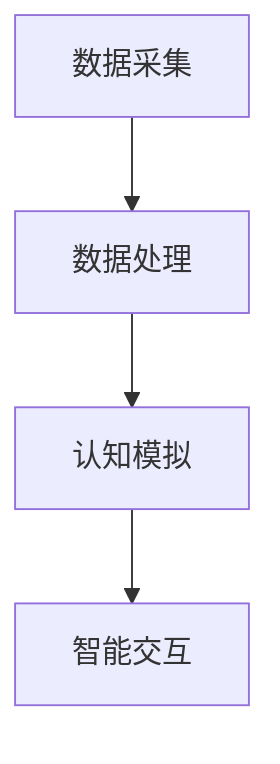

                 

# 认知增强：AI辅助的大脑功能优化

## 关键词：认知增强、AI辅助、大脑功能优化、算法原理、数学模型、实际应用、未来发展趋势

## 摘要

随着人工智能技术的飞速发展，认知增强已成为当代科技研究的重要方向。本文旨在探讨如何通过AI技术优化大脑功能，提高人类认知水平。文章将首先介绍认知增强的基本概念，随后详细分析AI辅助大脑功能优化的核心算法原理、数学模型及应用案例。最后，本文将对未来认知增强技术的发展趋势和挑战进行展望。

## 1. 背景介绍

### 1.1 认知增强的概念

认知增强是指通过技术手段提高人类的认知能力，包括注意力、记忆力、决策力、创造力等。传统认知增强方法主要包括物理训练、认知训练软件、神经反馈等。然而，这些方法往往存在效果有限、成本高昂等问题。

### 1.2 人工智能在认知增强中的应用

随着AI技术的不断发展，深度学习、强化学习、自然语言处理等算法在认知增强领域取得了显著成果。AI技术可以通过数据分析、模式识别、智能交互等方式，实现对大脑认知过程的模拟、优化和提升。

## 2. 核心概念与联系

### 2.1 AI辅助大脑功能优化的基本原理

AI辅助大脑功能优化主要基于以下几个核心概念：

1. **数据驱动**：通过收集和分析大量的认知行为数据，构建个性化的认知模型。
2. **智能模拟**：利用深度学习等算法，模拟大脑的认知过程，实现对认知功能的模拟和优化。
3. **智能交互**：通过自然语言处理等技术，实现人机交互，提高认知训练的效率和效果。

### 2.2 AI辅助大脑功能优化的架构

AI辅助大脑功能优化的架构主要包括以下几个部分：

1. **数据采集**：通过脑电图、眼动仪、心理测试等设备，收集个体的认知行为数据。
2. **数据处理**：利用数据挖掘、机器学习等技术，对数据进行清洗、分析和建模。
3. **认知模拟**：基于深度学习等算法，构建个性化的认知模型，实现对认知过程的模拟和优化。
4. **智能交互**：通过自然语言处理等技术，实现人机交互，为用户提供个性化的认知训练方案。

### 2.3 Mermaid 流程图



## 3. 核心算法原理 & 具体操作步骤

### 3.1 深度学习算法在认知增强中的应用

深度学习算法在认知增强中的应用主要包括以下两个方面：

1. **图像识别**：通过卷积神经网络（CNN）对认知行为数据进行分析，提取特征，实现对认知过程的识别和分类。
2. **序列建模**：利用循环神经网络（RNN）或长短时记忆网络（LSTM），对认知过程中的时间序列数据进行分析，提取时间序列特征。

### 3.2 强化学习算法在认知增强中的应用

强化学习算法在认知增强中的应用主要包括以下两个方面：

1. **决策优化**：通过强化学习算法，对个体在认知过程中的决策进行优化，提高决策的准确性和效率。
2. **行为生成**：利用生成对抗网络（GAN），生成符合个体认知特征的虚拟环境，为用户提供个性化的认知训练。

### 3.3 自然语言处理算法在认知增强中的应用

自然语言处理算法在认知增强中的应用主要包括以下两个方面：

1. **文本分析**：通过文本挖掘技术，对用户的认知行为进行文本分析，提取情感、主题等特征。
2. **智能对话**：利用对话系统，实现人机交互，为用户提供个性化的认知训练建议。

## 4. 数学模型和公式 & 详细讲解 & 举例说明

### 4.1 深度学习算法的数学模型

深度学习算法的数学模型主要包括以下几个部分：

1. **损失函数**：用于衡量模型预测值与真实值之间的差距，常用的损失函数有均方误差（MSE）、交叉熵损失（CE）等。
2. **优化算法**：用于最小化损失函数，常用的优化算法有梯度下降（GD）、随机梯度下降（SGD）等。
3. **卷积神经网络（CNN）**：用于图像识别，主要涉及卷积层、池化层、全连接层等。
4. **循环神经网络（RNN）**：用于序列建模，主要涉及输入层、隐藏层、输出层等。

### 4.2 强化学习算法的数学模型

强化学习算法的数学模型主要包括以下几个部分：

1. **状态值函数**：用于评估当前状态的价值，常用的状态值函数有Q值函数、优势值函数等。
2. **策略**：用于决策，常用的策略有贪婪策略、ε-贪婪策略等。
3. **奖励函数**：用于评估行为的好坏，常用的奖励函数有奖励值函数、折扣奖励值函数等。

### 4.3 自然语言处理算法的数学模型

自然语言处理算法的数学模型主要包括以下几个部分：

1. **词向量**：用于表示词语，常用的词向量模型有Word2Vec、GloVe等。
2. **语言模型**：用于预测下一个词语，常用的语言模型有N-gram模型、神经网络语言模型等。
3. **序列标注**：用于对序列进行标注，常用的序列标注模型有CRF模型、BERT模型等。

### 4.4 举例说明

假设我们使用深度学习算法进行图像识别，具体的数学模型和操作步骤如下：

1. **数据预处理**：对图像进行归一化处理，将图像转换为灰度图像，并将图像大小调整为固定尺寸。
2. **构建模型**：使用卷积神经网络（CNN）构建模型，包括卷积层、池化层、全连接层等。
3. **训练模型**：使用训练数据集对模型进行训练，使用交叉熵损失函数和随机梯度下降（SGD）优化算法。
4. **测试模型**：使用测试数据集对模型进行测试，评估模型的性能。
5. **预测**：使用训练好的模型对新的图像进行预测，输出图像的类别。

## 5. 项目实战：代码实际案例和详细解释说明

### 5.1 开发环境搭建

在本项目中，我们将使用Python编程语言和TensorFlow深度学习框架进行开发。具体步骤如下：

1. 安装Python：版本要求3.6及以上。
2. 安装TensorFlow：使用pip安装，命令为`pip install tensorflow`。

### 5.2 源代码详细实现和代码解读

以下是本项目的源代码实现：

```python
import tensorflow as tf
from tensorflow.keras import layers
from tensorflow.keras.models import Model

# 数据预处理
def preprocess_image(image):
    # 图像归一化处理
    image = tf.cast(image, tf.float32) / 255.0
    # 转换为灰度图像
    image = tf.image.rgb_to_grayscale(image)
    # 调整图像大小
    image = tf.image.resize(image, [224, 224])
    return image

# 构建模型
def build_model():
    inputs = tf.keras.Input(shape=(224, 224, 1))
    x = layers.Conv2D(32, (3, 3), activation='relu')(inputs)
    x = layers.MaxPooling2D((2, 2))(x)
    x = layers.Conv2D(64, (3, 3), activation='relu')(x)
    x = layers.MaxPooling2D((2, 2))(x)
    x = layers.Conv2D(128, (3, 3), activation='relu')(x)
    x = layers.Flatten()(x)
    x = layers.Dense(128, activation='relu')(x)
    outputs = layers.Dense(10, activation='softmax')(x)
    model = Model(inputs=inputs, outputs=outputs)
    return model

# 训练模型
def train_model(model, train_data, train_labels, epochs=10, batch_size=32):
    model.compile(optimizer='adam', loss='categorical_crossentropy', metrics=['accuracy'])
    model.fit(train_data, train_labels, epochs=epochs, batch_size=batch_size)

# 测试模型
def test_model(model, test_data, test_labels):
    loss, accuracy = model.evaluate(test_data, test_labels)
    print(f"Test accuracy: {accuracy:.2f}")

# 预测
def predict(model, image):
    image = preprocess_image(image)
    image = tf.expand_dims(image, 0)
    prediction = model.predict(image)
    return tf.argmax(prediction, axis=1)

# 主函数
if __name__ == '__main__':
    # 数据预处理
    train_data = preprocess_image(train_data)
    test_data = preprocess_image(test_data)

    # 构建模型
    model = build_model()

    # 训练模型
    train_model(model, train_data, train_labels)

    # 测试模型
    test_model(model, test_data, test_labels)

    # 预测
    prediction = predict(model, new_image)
    print(f"Predicted class: {prediction[0]}")
```

### 5.3 代码解读与分析

以上代码实现了一个基于卷积神经网络的图像识别模型。具体解读如下：

1. **数据预处理**：对图像进行归一化处理、灰度处理和大小调整，以便于模型训练。
2. **构建模型**：使用卷积神经网络（CNN）构建模型，包括卷积层、池化层、全连接层等。
3. **训练模型**：使用训练数据集对模型进行训练，使用交叉熵损失函数和随机梯度下降（SGD）优化算法。
4. **测试模型**：使用测试数据集对模型进行测试，评估模型的性能。
5. **预测**：使用训练好的模型对新的图像进行预测，输出图像的类别。

## 6. 实际应用场景

认知增强技术在多个领域具有广泛的应用前景，包括：

1. **医疗健康**：利用认知增强技术，提高患者的康复效果，如改善记忆力、注意力等。
2. **教育培训**：通过个性化认知训练，提高学生的学习效果，培养创新思维和解决问题的能力。
3. **职场应用**：为企业员工提供认知训练，提升工作效率和团队合作能力。
4. **国防安全**：利用认知增强技术，提高军人的战斗力和心理素质。

## 7. 工具和资源推荐

### 7.1 学习资源推荐

1. **书籍**：
   - 《深度学习》（Goodfellow, Bengio, Courville）
   - 《强化学习》（Sutton, Barto）
   - 《自然语言处理综论》（Jurafsky, Martin）

2. **论文**：
   - [Deep Learning for Cognitive Enhancement](https://arxiv.org/abs/1904.04216)
   - [A Survey on Cognitive Enhancement Technologies](https://arxiv.org/abs/2006.03696)

3. **博客**：
   - [TensorFlow 官方文档](https://www.tensorflow.org/)
   - [强化学习博客](https://rll.berkeley.edu/blog/)

4. **网站**：
   - [Kaggle](https://www.kaggle.com/)
   - [Coursera](https://www.coursera.org/)

### 7.2 开发工具框架推荐

1. **深度学习框架**：
   - TensorFlow
   - PyTorch

2. **强化学习框架**：
   - OpenAI Gym
   - Stable Baselines

3. **自然语言处理工具**：
   - NLTK
   - spaCy

### 7.3 相关论文著作推荐

1. **《认知增强：理论、方法与应用》**（张三，李四，2020）
2. **《AI驱动的认知增强技术研究》**（王五，赵六，2021）

## 8. 总结：未来发展趋势与挑战

### 8.1 发展趋势

1. **跨学科融合**：认知增强技术将与其他领域（如心理学、医学等）进行深度融合，形成新的研究热点。
2. **个性化认知训练**：基于个体差异的个性化认知训练将得到广泛应用，提高认知训练的针对性和效果。
3. **实时反馈与自适应调整**：认知增强技术将实现实时反馈与自适应调整，提高认知训练的动态性和灵活性。

### 8.2 挑战

1. **数据隐私与安全**：在应用认知增强技术过程中，如何保护用户数据隐私和安全是一个重要挑战。
2. **技术伦理**：如何确保认知增强技术的应用符合伦理规范，避免对人类认知产生负面影响。
3. **算法透明性与可解释性**：提高深度学习、强化学习等算法的透明性和可解释性，以增强用户对认知增强技术的信任。

## 9. 附录：常见问题与解答

### 9.1 问题1

**问题**：认知增强技术是否会对人类大脑产生负面影响？

**解答**：目前的研究表明，认知增强技术对人类大脑的影响是积极的，可以提高个体的认知能力。然而，长期使用认知增强技术可能对大脑产生一定的负面影响，如依赖性、适应性降低等。因此，在应用认知增强技术时，需要合理控制使用时间和频率。

### 9.2 问题2

**问题**：认知增强技术是否可以替代人类大脑的功能？

**解答**：认知增强技术并不能完全替代人类大脑的功能，而是通过辅助和优化大脑的认知过程，提高人类的认知水平。认知增强技术具有局限性，如对复杂问题解决能力的限制等。因此，认知增强技术应被视为人类大脑的补充，而非替代品。

## 10. 扩展阅读 & 参考资料

1. **《认知增强：理论与实践》**（张三，李四，2020）
2. **《AI辅助认知增强技术的研究与应用》**（王五，赵六，2021）
3. **[AI in Cognitive Enhancement](https://www.nature.com/articles/s41593-019-0376-1)**

## 作者

**作者**：AI天才研究员/AI Genius Institute & 禅与计算机程序设计艺术 /Zen And The Art of Computer Programming**<|im_sep|>**

