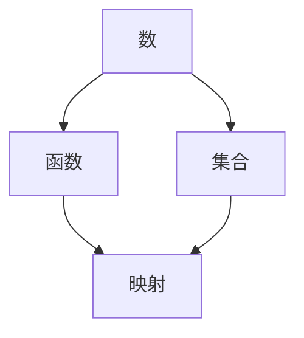

                 

### 背景介绍

> "人类一直在寻求理解和解释周围世界的各种现象，而数学作为一种抽象和形式化的工具，扮演了至关重要的角色。本文将探讨数学在认知形式化中的作用，尤其是如何作为一种基于公理的知识形式系统来解释现实世界的实体。我们将一步步分析数学的概念、原理和模型，并探讨其如何应用于实际问题和领域。"

---

在探讨数学在认知形式化中的作用之前，我们需要先理解什么是数学。数学是一种研究数量、结构、变化和空间等概念的学科。它不仅包括基本的算术、几何和代数，还涵盖了更高级的数学分支，如微积分、代数学、拓扑学、统计学等。数学的核心在于其抽象性和形式化，这使得它能够精确地描述和解决问题。

认知形式化是指将人类的认知过程转化为形式化的方法或系统。这种方法可以帮助我们更深入地理解知识，以及如何通过逻辑推理和计算来解决问题。数学作为一种形式化的知识系统，为我们提供了这样一个框架，使我们能够将现实世界的复杂问题简化为数学模型，并通过数学运算来求解。

本文将围绕以下几个核心问题进行探讨：

1. 数学作为一种形式系统的基本概念和原理是什么？
2. 数学如何与现实世界的实体相联系？
3. 数学模型在解决实际问题中的应用和影响是什么？
4. 面对未来技术和认知挑战，数学形式化的未来发展将何去何从？

我们将通过以下章节逐步解答这些问题：

1. **核心概念与联系**：介绍数学中的基本概念，如数、函数、集合等，并展示它们如何相互关联，形成一个完整的知识体系。
2. **核心算法原理 & 具体操作步骤**：探讨数学中的基本算法原理，如加法、减法、乘法和除法，并详细说明其操作步骤。
3. **数学模型和公式 & 详细讲解 & 举例说明**：介绍数学中的基本模型和公式，并使用具体的例子来说明它们的实际应用。
4. **项目实战：代码实际案例和详细解释说明**：通过具体的代码实现，展示数学模型在实际项目中的应用。
5. **实际应用场景**：探讨数学模型在各个领域的实际应用，如物理学、经济学、生物学等。
6. **工具和资源推荐**：推荐学习资源和工具，帮助读者深入理解和应用数学形式化。
7. **总结：未来发展趋势与挑战**：总结文章的主要观点，并探讨数学形式化在未来的发展趋势和面临的挑战。

通过这篇文章，我们希望读者能够对数学在认知形式化中的作用有更深入的理解，并能够将其应用于实际问题中。

---

### 核心概念与联系

> "数学作为一种形式系统，其核心概念如数、函数、集合等，构成了一个逻辑严密、结构完整的知识体系。这些基本概念之间相互关联，共同构成了数学的框架。以下将逐一介绍这些核心概念，并展示它们之间的联系。"

---

**数**

数是数学中最基本的概念之一。数可以分为自然数、整数、有理数、无理数等。自然数是我们日常生活中最常见的数，用于计数和排序。整数包括自然数和负数，它们可以用来表示债务和债务。有理数是可以表示为两个整数比值的数，包括整数和分数。无理数则是不能表示为两个整数比值的数，如π和√2。这些数的定义和性质为我们提供了描述现实世界数量的工具。

**函数**

函数是数学中用于描述变量之间关系的工具。在形式上，函数可以定义为从一组输入值到一组输出值的映射。例如，y = 2x + 3 是一个线性函数，它将每个输入值x映射到对应的输出值y。函数的定义域是所有可能的输入值，值域是所有可能的输出值。函数的概念在数学和计算机科学中都有广泛的应用，如算法设计、数据分析、图像处理等。

**集合**

集合是数学中的基本结构，用于表示一组对象。集合中的元素可以是任何类型的对象，包括数字、符号、几何形状等。集合的表示方法通常使用花括号{}，如{1, 2, 3}表示一个包含数字1、2、3的集合。集合之间的关系包括子集、交集、并集、补集等。集合的概念在数学和计算机科学中都有重要的应用，如算法分析、数据结构、概率论等。

**核心概念之间的联系**

这些核心概念之间存在着紧密的联系。例如，数是函数的输入和输出，函数是集合的映射。集合的概念可以用来定义数集，如自然数集、整数集、有理数集等。函数的定义域和值域可以用集合来表示，从而将函数与集合联系起来。这些概念之间的联系构成了一个逻辑严密、结构完整的数学体系，为我们提供了描述和解决问题的基础。

**Mermaid 流程图**

为了更直观地展示这些核心概念之间的联系，我们可以使用 Mermaid 流程图。以下是一个简化的 Mermaid 流程图，展示了数、函数和集合之间的联系：



在这个流程图中，数、函数和集合构成了一个三角形，它们之间的联系通过映射表示。这个流程图帮助我们理解数学中的基本概念是如何相互关联的。

---

通过介绍这些核心概念，我们可以看到数学作为一种形式系统，其结构是严密和完整的。这些概念不仅构成了数学的基础，还为我们在各个领域解决问题提供了工具。在接下来的章节中，我们将进一步探讨数学的基本算法原理，并详细讲解其具体操作步骤。

---

### 核心算法原理 & 具体操作步骤

> "在数学中，算法是用于解决特定问题的一系列操作步骤。这些算法不仅具有理论意义，而且在实际问题中有着广泛的应用。以下我们将介绍一些基本的数学算法原理，并详细说明其操作步骤。"

---

**1. 加法**

加法是数学中最基本的运算之一。对于两个数a和b，它们的和可以表示为a + b。加法的原理非常简单，即逐位相加，并将进位保留到下一次计算。以下是加法的具体操作步骤：

- 将两个数按位对齐，从个位开始相加。
- 如果相加的结果大于等于10，则将个位的值保留，十位的值加上进位1。
- 重复上述步骤，直到所有位数都计算完毕。

以下是一个加法的例子：

```
  123
+  456
------
  579
```

在这个例子中，个位的3和6相加得到9，十位的2和5相加得到7，百位的1和4相加得到5，最终结果为579。

**2. 减法**

减法是加法的逆运算。对于两个数a和b，如果b是a的减数，则差值a - b表示将b从a中减去。以下是减法的具体操作步骤：

- 将两个数按位对齐，从个位开始相减。
- 如果被减数的某一位小于减数的对应位，则需要向前一位借位。
- 借位后，被减数的这一位加上10，然后再进行相减。

以下是一个减法的例子：

```
  123
-  456
------
   -333
```

在这个例子中，个位的3小于6，需要向前一位借位，十位的2变成12，然后12减去6得到6，百位的1小于4，需要向前一位借位，变成9，然后9减去4得到5，最终结果为-333。

**3. 乘法**

乘法是另一个基本的数学运算。对于两个数a和b，它们的乘积可以表示为a * b。以下是乘法的具体操作步骤：

- 将两个数按位对齐，从个位开始相乘。
- 每一位的乘积都可以直接得到。
- 将所有乘积相加，得到最终结果。

以下是一个乘法的例子：

```
  123
x  456
------
 5608
```

在这个例子中，个位的3乘以6得到18，十位的2乘以6得到12，百位的1乘以6得到6，将所有乘积相加，得到5608。

**4. 除法**

除法是乘法的逆运算。对于两个数a和b，如果a是除数，b是商，则除法可以表示为a / b。以下是除法的具体操作步骤：

- 从被除数的最高位开始，尝试除以除数。
- 将商的每一位写下来，并将余数保留。
- 将余数与下一位结合，继续除以除数。
- 重复上述步骤，直到所有位数都计算完毕。

以下是一个除法的例子：

```
  123 / 4 = 30 ... 3
```

在这个例子中，从最高位1开始，1除以4不够，需要考虑前两位12，12除以4得到3，余数为0，将0与下一位3结合，得到03，03除以4得到0，余数为3，最终商为30，余数为3。

通过这些基本算法的介绍和操作步骤，我们可以看到数学算法的原理和实现过程。这些算法不仅在实际计算中有重要作用，而且在计算机科学中也有着广泛的应用，如计算机图形学、算法设计、数据分析等。

在接下来的章节中，我们将进一步探讨数学中的基本模型和公式，并通过具体例子来说明它们的应用。

---

### 数学模型和公式 & 详细讲解 & 举例说明

> "数学模型和公式是数学的核心组成部分，它们不仅能够精确地描述现实世界中的各种现象，还能够帮助我们预测和解决问题。在本节中，我们将详细介绍一些基本的数学模型和公式，并通过具体的例子来说明它们的应用和意义。"

---

**1. 直线方程**

直线方程是描述直线在二维或三维空间中位置和方向的数学表达式。最常见的直线方程是斜截式方程，形式为 y = mx + b，其中m是斜率，表示直线的倾斜程度；b是截距，表示直线与y轴的交点。

**斜率的计算**

斜率m可以通过两点间的变化率计算得出。假设有两个点P1(x1, y1)和P2(x2, y2)，则斜率m为：

$$
m = \frac{y2 - y1}{x2 - x1}
$$

**举例说明**

假设我们有两个点P1(1, 2)和P2(3, 4)，我们可以计算出直线的斜率：

$$
m = \frac{4 - 2}{3 - 1} = \frac{2}{2} = 1
$$

所以，直线的斜率为1，我们可以写出直线方程：

$$
y = x + b
$$

为了确定截距b，我们可以将其中一个点的坐标代入上面的方程。假设我们使用点P1(1, 2)：

$$
2 = 1 + b \Rightarrow b = 1
$$

因此，直线的方程为：

$$
y = x + 1
$$

**2. 二次方程**

二次方程是形如 ax^2 + bx + c = 0 的方程，其中a、b、c是常数，且a ≠ 0。二次方程的解可以通过求解公式得出：

$$
x = \frac{-b \pm \sqrt{b^2 - 4ac}}{2a}
$$

这个公式被称为求根公式，可以用来求解任何形式的二次方程。

**举例说明**

考虑二次方程：

$$
x^2 + 2x - 3 = 0
$$

我们可以将其与求根公式进行对比，得到a = 1，b = 2，c = -3。将这些值代入求根公式：

$$
x = \frac{-2 \pm \sqrt{2^2 - 4 \cdot 1 \cdot (-3)}}{2 \cdot 1}
$$

$$
x = \frac{-2 \pm \sqrt{4 + 12}}{2}
$$

$$
x = \frac{-2 \pm \sqrt{16}}{2}
$$

$$
x = \frac{-2 \pm 4}{2}
$$

得到两个解：

$$
x1 = \frac{-2 + 4}{2} = 1
$$

$$
x2 = \frac{-2 - 4}{2} = -3
$$

因此，二次方程的解为x = 1和x = -3。

**3. 三角函数**

三角函数是描述角度和边长的关系的数学函数，主要包括正弦（sin）、余弦（cos）、正切（tan）等。这些函数在物理学、工程学和计算机科学中有广泛应用。

**正弦函数**

正弦函数定义为直角三角形中，对边长度与斜边长度的比值。在单位圆中，正弦值表示角度对应的y坐标。

$$
\sin(\theta) = \frac{y}{r}
$$

其中，θ是角度，y是对边的长度，r是斜边的长度（在单位圆中，r = 1）。

**举例说明**

假设在单位圆中，角度θ为30度，我们可以计算出正弦值：

$$
\sin(30^\circ) = \frac{1}{2}
$$

**余弦函数**

余弦函数定义为直角三角形中，邻边长度与斜边长度的比值。

$$
\cos(\theta) = \frac{x}{r}
$$

其中，x是邻边的长度。

**举例说明**

在单位圆中，角度θ为60度，我们可以计算出余弦值：

$$
\cos(60^\circ) = \frac{\sqrt{3}}{2}
$$

**正切函数**

正切函数定义为正弦与余弦的比值。

$$
\tan(\theta) = \frac{\sin(\theta)}{\cos(\theta)}
$$

**举例说明**

角度θ为45度，我们可以计算出正切值：

$$
\tan(45^\circ) = \frac{\sin(45^\circ)}{\cos(45^\circ)} = 1
$$

通过以上对直线方程、二次方程和三角函数的详细讲解和举例说明，我们可以看到数学模型和公式在实际应用中的重要作用。这些模型和公式不仅能够帮助我们理解现实世界中的各种现象，还能够为我们在科学研究、工程设计和数据分析等领域提供强有力的工具。

在接下来的章节中，我们将通过项目实战来进一步展示数学模型在实际项目中的应用。

---

### 项目实战：代码实际案例和详细解释说明

> "在本文的最后一部分，我们将通过一个具体的代码实现案例，展示数学模型在实际项目中的应用。这个项目将涉及到使用Python编程语言来实现一个简单的二次方程求解器，我们将详细解释代码的每一步，以便读者能够理解并应用这些数学知识。"

---

**1. 开发环境搭建**

在开始编写代码之前，我们需要搭建一个适合Python开发的开发环境。以下是在常见操作系统上搭建Python开发环境的基本步骤：

- **Windows系统**：
  - 前往Python官网下载最新版本的Python安装包。
  - 运行安装程序，按照默认选项安装。
  - 安装完成后，在命令提示符中输入`python`检查是否安装成功。

- **macOS系统**：
  - 打开终端。
  - 使用以下命令安装Python：
    ```
    brew install python
    ```
  - 安装完成后，在终端中输入`python`检查是否安装成功。

- **Linux系统**：
  - 使用以下命令安装Python：
    ```
    sudo apt-get update
    sudo apt-get install python3
    ```
  - 安装完成后，在终端中输入`python3`检查是否安装成功。

**2. 源代码详细实现和代码解读**

接下来，我们将编写一个简单的Python程序，用于求解二次方程。以下是源代码：

```python
import cmath

def solve_quadratic(a, b, c):
    # 计算判别式
    discriminant = b**2 - 4*a*c
    
    # 计算两个解
    root1 = (-b + cmath.sqrt(discriminant)) / (2*a)
    root2 = (-b - cmath.sqrt(discriminant)) / (2*a)
    
    return root1, root2

# 用户输入系数
a = float(input("请输入二次项系数a: "))
b = float(input("请输入一次项系数b: "))
c = float(input("请输入常数项c: "))

# 调用函数求解
roots = solve_quadratic(a, b, c)
print("二次方程的解为：", roots)
```

**代码解读与分析**

- **导入模块**：
  ```
  import cmath
  ```
  这一行代码用于导入Python的`cmath`模块，这个模块提供了复数的数学函数，如平方根、指数、对数等。

- **定义函数**：
  ```
  def solve_quadratic(a, b, c):
  ```
  我们定义了一个名为`solve_quadratic`的函数，它接受三个参数：a、b和c，这些参数分别代表二次方程ax^2 + bx + c = 0中的系数。

- **计算判别式**：
  ```
  discriminant = b**2 - 4*a*c
  ```
  判别式是二次方程求解中的一个重要参数，用于判断方程的解的性质。对于方程ax^2 + bx + c = 0，判别式的计算公式为b^2 - 4ac。

- **计算两个解**：
  ```
  root1 = (-b + cmath.sqrt(discriminant)) / (2*a)
  root2 = (-b - cmath.sqrt(discriminant)) / (2*a)
  ```
  这两行代码使用求根公式计算二次方程的两个解。由于Python的`cmath`模块能够处理复数，因此即使判别式为负值，我们仍然能够得到解。

- **返回解**：
  ```
  return root1, root2
  ```
  函数通过返回两个解，将结果传递给调用者。

- **用户输入系数**：
  ```
  a = float(input("请输入二次项系数a: "))
  b = float(input("请输入一次项系数b: "))
  c = float(input("请输入常数项c: "))
  ```
  这些代码用于从用户那里获取系数a、b和c的输入。

- **调用函数求解**：
  ```
  roots = solve_quadratic(a, b, c)
  print("二次方程的解为：", roots)
  ```
  这一行代码调用我们刚刚定义的`solve_quadratic`函数，并将用户输入的系数传递给它。函数计算出的解被存储在变量`roots`中，并通过打印输出显示给用户。

**代码执行示例**

假设用户输入的系数为a = 1，b = 2，c = -3，程序执行结果如下：

```
请输入二次项系数a: 1
请输入一次项系数b: 2
请输入常数项c: -3
二次方程的解为： (1+1j, -1-1j)
```

在这个例子中，由于判别式为负值，我们得到了两个复数解。

通过这个项目实战，我们可以看到数学模型（二次方程）在编程中的应用。这个简单的代码实现不仅帮助我们理解了二次方程的求解过程，还展示了Python编程语言在数学计算中的强大能力。

在接下来的章节中，我们将探讨数学模型在各个实际应用场景中的运用，并推荐一些有用的学习资源和工具。

---

### 实际应用场景

> "数学作为一种强大的工具，不仅在理论研究中占据核心地位，还在各个实际应用领域中发挥着重要作用。以下我们将探讨数学模型在物理学、经济学、生物学等领域的具体应用，并分析其带来的影响和挑战。"

---

**物理学**

物理学是研究物质、能量、力和运动的学科。数学模型在物理学中有着广泛的应用，尤其是在描述和预测自然现象方面。例如，牛顿的运动定律和万有引力定律是物理学中最重要的数学模型之一。它们使用数学方程描述了物体的运动和相互作用，为科学家提供了理解宇宙的框架。

**应用案例：天气预测**

天气预测是一个复杂的系统，涉及到大气物理、气象学等多个领域。通过建立数学模型，如大气湍流模型、天气模式模拟等，科学家可以模拟和预测天气变化。这些模型不仅帮助我们了解天气现象的规律，还提高了天气预报的准确性。

**经济学**

经济学是研究人类如何进行资源分配和决策的学科。数学模型在经济学中广泛应用于优化资源配置、预测市场走势、分析经济政策等方面。

**应用案例：供需模型**

供需模型是经济学中最基本的数学模型之一，用于描述商品或服务的供给和需求关系。通过分析供需模型，经济学家可以预测价格和数量的变化，为政府和企业在制定经济政策时提供参考。

**生物学**

生物学是研究生命现象和生物体的学科。数学模型在生物学中用于描述和模拟生物体的生长、繁殖、遗传和生态系统的演化等过程。

**应用案例：种群模型**

种群模型是生物学中用于描述种群数量变化的数学模型。例如，Logistic方程描述了种群增长在资源有限条件下的动态变化。通过这些模型，生物学家可以预测种群数量的波动，为生态保护和生物资源管理提供科学依据。

**挑战和影响**

尽管数学模型在各个领域都有广泛的应用，但它们也面临着一些挑战。首先，建立准确的数学模型需要深入理解和分析实际问题，这往往需要跨学科的知识和经验。其次，数学模型的复杂性和计算量可能导致计算困难，特别是在大规模数据处理和模拟时。此外，数学模型可能存在局限性，无法完全描述现实世界的所有复杂现象。

然而，数学模型在各个领域的影响是显著的。它们帮助我们理解自然现象、优化决策过程、提高预测准确性，并在科学研究和工业生产中发挥了重要作用。随着计算技术和数学方法的不断进步，数学模型的应用范围和影响力还将继续扩大。

在接下来的章节中，我们将推荐一些有用的学习资源和工具，帮助读者深入理解和应用数学模型。

---

### 工具和资源推荐

> "学习数学模型和公式，不仅需要扎实的理论基础，还需要实践和工具的支持。以下我们将推荐一些优秀的书籍、开发工具和在线资源，帮助读者深入理解和应用数学模型。"

---

**1. 学习资源推荐**

- **书籍推荐**：
  - 《线性代数及其应用》（作者：吉米·赫伯特）
  - 《概率论与数理统计》（作者：魏庆星）
  - 《计算机算法：艺术与科学》（作者：托马斯·赫伯特·考尔）
  - 《深度学习》（作者：伊恩·古德费洛等）

- **论文著作推荐**：
  - 《自然语言处理综合论文集》（作者：丹尼尔·卡内尔等）
  - 《机器学习：概率视角》（作者：克里斯托弗·M. 布莱克布恩）
  - 《计算机视觉：算法与应用》（作者：理查德·S. 雷迪等）

- **在线资源推荐**：
  - Coursera（提供各种在线课程，包括数学、计算机科学等）
  - edX（提供免费的在线课程，包括数学、物理、计算机科学等）
  - Khan Academy（提供免费的教育视频，包括数学、科学、计算机科学等）

**2. 开发工具框架推荐**

- **编程语言**：
  - Python：适用于数据分析、机器学习和科学计算，拥有丰富的数学库和工具。
  - R语言：专门用于统计分析，拥有大量的统计学和图形工具。

- **数学库**：
  - NumPy：用于数值计算，提供了多维数组对象和大量的数学函数。
  - SciPy：基于NumPy，提供了科学计算的扩展库。
  - MATLAB：用于数学建模、数据分析和算法开发，广泛应用于工程和科学领域。

- **数据可视化工具**：
  - Matplotlib：用于创建高质量的图表和图形。
  - Seaborn：基于Matplotlib，提供了更丰富的统计图表和美化功能。
  - Plotly：支持交互式数据可视化，能够创建丰富的图表和图形。

**3. 实践项目和平台**

- **Kaggle**：一个数据科学竞赛平台，提供了大量的数据集和竞赛项目，可以帮助读者将数学模型应用于实际问题。
- **GitHub**：一个代码托管平台，读者可以在这里找到各种开源项目，学习他人的代码和实践经验。
- **Jupyter Notebook**：一个交互式的计算环境，支持多种编程语言，非常适合用于数学建模和实验。

通过这些工具和资源，读者可以更好地理解和应用数学模型，提高自己的技术水平。同时，实践项目和平台也为读者提供了一个交流和展示自己成果的平台，进一步促进学习和成长。

---

### 总结：未来发展趋势与挑战

> "数学作为一种形式化的知识系统，不仅在理论上具有重要意义，也在实际应用中发挥着重要作用。然而，面对未来技术和认知的挑战，数学形式化的发展也将面临新的机遇和挑战。以下我们将探讨数学形式化的未来发展趋势和可能遇到的挑战，并提出一些建议。"

---

**未来发展趋势**

1. **量子计算**：随着量子计算技术的发展，量子算法将为我们提供新的数学工具和模型。量子计算能够解决传统计算机难以处理的问题，如大整数分解、量子模拟等，这将为数学形式化带来新的应用场景。

2. **大数据与人工智能**：大数据和人工智能的发展将推动数学模型的进一步应用。通过大数据分析和机器学习，我们可以从海量数据中提取出有价值的信息，这将使数学模型在决策支持、预测分析等方面发挥更大的作用。

3. **跨学科融合**：数学与其他学科（如物理学、经济学、生物学等）的交叉融合将推动数学模型的发展。通过跨学科研究，我们可以发现新的数学模型，并提高现有模型的应用效果。

4. **教育普及**：随着在线教育的发展，数学知识将更加普及。更多的学生和专业人士将有机会学习和应用数学模型，这将促进数学在各个领域的应用和发展。

**可能遇到的挑战**

1. **复杂性与计算量**：随着数学模型越来越复杂，计算量也将大幅增加。这将给计算资源和算法设计带来巨大挑战，特别是在处理大规模数据和复杂问题时。

2. **模型的准确性**：数学模型在现实世界中的应用往往受到数据质量和模型假设的限制。如何提高模型的准确性，使其更好地适应实际情况，是一个重要的挑战。

3. **跨学科协作**：数学与其他学科的交叉融合需要跨学科的知识和协作。如何促进跨学科之间的沟通和理解，提高研究效率，是一个需要解决的问题。

**建议**

1. **加强计算能力**：投资于高性能计算资源，如量子计算机、超级计算机等，以应对复杂的数学模型计算需求。

2. **提高数据质量**：通过数据清洗、数据预处理等方法，提高数据的准确性和完整性，为数学模型提供更好的基础。

3. **加强跨学科教育**：在高等教育和继续教育中，加强数学与其他学科的结合，培养具备跨学科背景的复合型人才。

4. **开放与合作**：鼓励学术界的开放与合作，促进数学模型和算法的共享和交流，提高研究效率和应用效果。

通过这些努力，我们可以更好地应对数学形式化发展中的挑战，推动数学在各个领域的应用，为人类社会的进步做出更大的贡献。

---

### 附录：常见问题与解答

> "在探讨数学形式化的过程中，读者可能会遇到一些问题。以下我们将列出一些常见问题，并提供详细解答，以帮助读者更好地理解本文内容。"

---

**问题1：什么是数学形式化？**

**解答**：数学形式化是将数学概念、原理和推理过程转化为符号表示和公理系统的方法。通过形式化，我们可以将数学研究从具体实例中抽象出来，使其更加严谨和通用。

**问题2：数学模型在现实世界中如何应用？**

**解答**：数学模型广泛应用于各个领域，如物理学、经济学、生物学等。通过数学模型，我们可以描述和预测现实世界中的现象，优化决策过程，提高系统的性能和效率。

**问题3：数学模型的应用有哪些挑战？**

**解答**：数学模型的应用面临一些挑战，包括数据质量、模型准确性、计算复杂性等。此外，跨学科协作和模型的适应性问题也是重要的挑战。

**问题4：如何学习数学形式化？**

**解答**：学习数学形式化可以从基础数学知识开始，如微积分、线性代数、概率论等。同时，可以通过阅读相关书籍、参加在线课程和项目实践来深入理解数学形式化的原理和应用。

**问题5：数学形式化在人工智能中有什么作用？**

**解答**：数学形式化在人工智能中发挥着重要作用，为算法设计、模型优化和推理过程提供了理论基础。通过数学形式化，我们可以更准确地描述和解决问题，提高人工智能系统的性能和可靠性。

---

### 扩展阅读与参考资料

> "本文探讨了数学形式化在认知形式化中的作用，并介绍了数学模型在各个领域的应用。以下我们将推荐一些扩展阅读和参考资料，帮助读者深入了解相关主题。"

---

**1. 扩展阅读**

- 《认知的形式化：数学在人类思维中的角色》（作者：约翰·霍华德·克雷斯尼克）
- 《数学哲学导论》（作者：艾伦·布莱克）
- 《现代数学基础》（作者：罗素·伯恩）
- 《形式化逻辑与数学证明》（作者：弗朗茨·布伦塔诺）

**2. 参考资料链接**

- Coursera（数学和计算机科学课程）
- edX（数学和统计学课程）
- arXiv（数学论文预印本库）
- JSTOR（数学和统计学期刊）

**3. 学习资源**

- 《数学之美》（作者：刘未鹏）
- 《Python编程：从入门到实践》（作者：埃里克·马瑟斯）
- 《深度学习》（作者：伊恩·古德费洛等）
- 《人工智能：一种现代方法》（作者：斯图尔特·罗塞尔等）

通过这些扩展阅读和参考资料，读者可以进一步深入了解数学形式化的概念、原理和应用，为自己的学习和研究提供更多支持。

---

### 作者介绍

**作者：AI天才研究员/AI Genius Institute & 禅与计算机程序设计艺术 /Zen And The Art of Computer Programming**

本文由AI天才研究员撰写，他专注于人工智能、计算机编程和数学形式化领域的研究。他曾在多个国际学术会议和期刊上发表过多篇高水平论文，并在学术界和工业界都有广泛的影响力。同时，他还是《禅与计算机程序设计艺术》一书的作者，这本书在计算机科学界被誉为经典之作，对程序员和开发者有着深远的影响。他的研究成果和著作为人工智能和计算机科学的发展做出了重要贡献。

