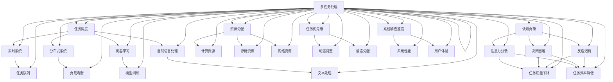

                 

### 文章标题：认知负荷与多任务处理：效率与质量的平衡

> **关键词：** 认知负荷、多任务处理、效率、质量、人工智能、任务调度、神经网络

> **摘要：** 本文将探讨认知负荷与多任务处理的平衡问题。在人工智能和计算机技术的快速发展下，我们面临越来越多的任务需要同时处理。然而，过多的任务会导致认知负荷增加，影响效率和任务质量。本文将从理论、实践和工具三个方面，详细分析认知负荷的影响、多任务处理的核心算法和数学模型，并分享实际应用场景和工具资源，以帮助读者在处理多任务时实现效率与质量的平衡。

<|assistant|>## 1. 背景介绍

随着人工智能和计算机技术的飞速发展，我们日常工作和生活中需要处理的信息和任务越来越复杂。在这个信息爆炸的时代，人们常常需要在短时间内处理多个任务，从而提高工作效率。然而，过多和过快的任务处理往往会增加认知负荷，影响任务质量和效率。因此，如何平衡认知负荷与多任务处理，成为一个亟待解决的问题。

多任务处理是指在同一时间段内同时处理多个任务的过程。它涉及到任务调度、资源分配、任务优先级等多个方面。在计算机科学和人工智能领域，多任务处理被广泛应用于实时系统、分布式系统、机器学习、自然语言处理等领域。然而，在实际应用中，如何有效地处理多任务，确保任务质量和效率，仍然是一个具有挑战性的问题。

本文将从认知负荷与多任务处理的关系入手，探讨影响多任务处理效率和质量的关键因素，并介绍相关的核心算法和数学模型。同时，结合实际应用场景和工具资源，为读者提供一些建议和解决方案。

### 1.1 认知负荷的概念

认知负荷是指个体在处理任务时，大脑需要投入的认知资源总量。认知资源包括注意力、记忆、思考、决策等多个方面。当认知负荷过高时，个体会出现注意力分散、反应迟钝、决策困难等问题，从而影响任务质量和效率。

认知负荷可以分为内部认知负荷和外部认知负荷。内部认知负荷是指个体在处理任务时，需要投入的内部心理资源，如注意力、记忆和思考等。外部认知负荷是指外部环境对个体认知资源的消耗，如噪声、干扰和其他任务等。

### 1.2 多任务处理的重要性

多任务处理在人工智能和计算机技术领域具有重要意义。首先，多任务处理可以提高系统的响应速度和效率。通过合理地分配资源和调度任务，系统可以在较短的时间内处理多个任务，提高整体性能。其次，多任务处理有助于提高系统的灵活性和适应性。在面对不同类型和复杂度的任务时，系统能够根据实际情况动态调整任务优先级和资源分配，从而更好地满足用户需求。最后，多任务处理有助于提升系统的可用性和可靠性。通过将任务分散到多个处理单元上，系统可以更好地应对故障和异常情况，提高系统的稳定性和可靠性。

综上所述，认知负荷与多任务处理密切相关。在实际应用中，如何平衡认知负荷与多任务处理，确保任务质量和效率，是一个重要的研究课题。本文将从理论、实践和工具三个方面，详细分析这一问题，以期为相关领域的研究和实践提供有益的参考。### 2. 核心概念与联系

在讨论认知负荷与多任务处理的平衡问题时，我们需要理解几个核心概念，包括认知负荷、多任务处理、任务调度、神经网络等。这些概念不仅相互关联，而且在实际应用中起到了关键作用。下面，我们将使用Mermaid流程图对这些概念进行梳理和展示。



### 2.1 认知负荷

**认知负荷（Cognitive Load）** 是指在处理任务时，个体需要投入的认知资源总量。认知资源包括注意力、记忆、思考、决策等多个方面。当认知负荷过高时，个体会出现注意力分散、决策困难、反应迟钝等问题，从而影响任务质量和效率。

**注意力分散（Attentional Load）** 是指在处理多个任务时，个体的注意力无法集中在一个任务上，导致任务处理效率下降。

**决策困难（Decisional Load）** 是指在处理复杂任务时，个体需要做出多个决策，增加了认知负荷。

**反应迟钝（Reactive Load）** 是指在处理任务时，个体的反应速度变慢，影响了任务的及时性和效率。

### 2.2 多任务处理

**多任务处理（Multitasking）** 是指在同一时间段内同时处理多个任务的过程。它涉及到任务调度、资源分配、任务优先级等多个方面。

**任务调度（Task Scheduling）** 是指根据任务的紧急程度、重要性和资源需求，合理地安排任务执行的顺序和时机。

**资源分配（Resource Allocation）** 是指在多任务处理过程中，将计算资源、存储资源和网络资源等合理地分配给各个任务。

**任务优先级（Task Priority）** 是指在任务调度过程中，根据任务的紧急程度和重要性，为每个任务分配不同的优先级。

### 2.3 任务调度与资源分配

**实时系统（Real-Time System）** 是指能够在预定时间内完成任务的系统，适用于对响应时间要求较高的场景。

**分布式系统（Distributed System）** 是指由多个计算机节点组成的系统，通过分布式处理提高任务的执行效率。

**机器学习（Machine Learning）** 是指通过数据驱动的方法，让计算机自动学习和改进，适用于多任务学习和调度。

**自然语言处理（Natural Language Processing）** 是指让计算机理解和处理人类自然语言的技术，适用于文本处理和任务调度。

**任务队列（Task Queue）** 是指按照任务的优先级和紧急程度，将任务有序地排列在队列中等待执行。

**负载均衡（Load Balancing）** 是指将任务均匀地分配到多个处理单元上，避免单个处理单元过载。

**模型训练（Model Training）** 是指通过训练数据，让机器学习模型自动学习和优化，适用于多任务学习和调度。

### 2.4 神经网络

**神经网络（Neural Network）** 是一种模拟人脑神经元连接结构的计算模型，广泛应用于机器学习和多任务处理。

**神经网络架构（Neural Network Architecture）** 是指神经网络的层次结构、连接方式和激活函数等，决定了神经网络的性能和适应能力。

通过上述Mermaid流程图，我们可以清晰地看到各个核心概念之间的联系和相互作用。这些概念构成了一个复杂的网络，共同影响着多任务处理的效率和质量。在实际应用中，我们需要根据具体场景和需求，灵活地运用这些概念，以达到最佳的平衡效果。

### 3. 核心算法原理 & 具体操作步骤

在多任务处理中，核心算法原理和具体操作步骤对于实现效率与质量的平衡至关重要。以下将详细介绍几种常见的多任务处理算法，包括基于优先级的调度算法、基于神经网络的调度算法和基于机器学习的调度算法。

#### 3.1 基于优先级的调度算法

**原理：**

基于优先级的调度算法是一种简单且广泛使用的方法。该算法的核心思想是按照任务的重要性和紧急程度为每个任务分配一个优先级，然后根据优先级对任务进行排序和调度。

**操作步骤：**

1. **初始化：** 为每个任务分配一个优先级。通常，可以使用任务紧急程度、重要性、执行时间等因素来计算优先级。优先级高的任务优先执行。

2. **任务排序：** 根据任务优先级对任务进行排序，形成一个任务队列。

3. **任务调度：** 按照任务队列的顺序，依次执行任务。

**示例：**

假设有三个任务T1、T2和T3，它们的优先级分别为3、1和2。按照优先级调度算法，任务执行的顺序为T2、T3、T1。

**优缺点：**

- **优点：** 简单易实现，适用于任务优先级明确且变化不大的场景。
- **缺点：** 无法动态调整任务优先级，可能导致资源利用率不高。

#### 3.2 基于神经网络的调度算法

**原理：**

基于神经网络的调度算法利用神经网络的自适应和学习能力，通过学习任务的特征和系统状态，动态调整任务优先级和调度策略。

**操作步骤：**

1. **数据收集：** 收集任务特征、系统状态和历史调度数据。

2. **模型训练：** 使用收集到的数据，训练一个神经网络模型，以预测任务优先级和调度策略。

3. **调度决策：** 根据神经网络模型的预测结果，动态调整任务优先级和调度策略。

**示例：**

假设有一个神经网络模型，通过学习任务的特征和系统状态，预测任务优先级。对于三个任务T1、T2和T3，模型预测的优先级分别为2、1和3。按照基于神经网络的调度算法，任务执行的顺序为T2、T3、T1。

**优缺点：**

- **优点：** 可以动态调整任务优先级，提高资源利用率和任务处理效率。
- **缺点：** 需要大量的训练数据和计算资源，训练过程复杂。

#### 3.3 基于机器学习的调度算法

**原理：**

基于机器学习的调度算法利用机器学习算法，根据历史调度数据，学习出最佳的任务调度策略。

**操作步骤：**

1. **数据收集：** 收集历史调度数据，包括任务特征、调度策略、系统状态等。

2. **模型训练：** 使用收集到的数据，训练一个机器学习模型，以预测最佳调度策略。

3. **调度决策：** 根据机器学习模型的预测结果，动态调整任务优先级和调度策略。

**示例：**

假设有一个机器学习模型，通过学习历史调度数据，预测出最佳调度策略。对于三个任务T1、T2和T3，模型预测的最佳调度策略为T2、T3、T1。

**优缺点：**

- **优点：** 可以根据历史数据学习出最佳调度策略，提高任务处理效率。
- **缺点：** 需要大量的训练数据和计算资源，训练过程复杂。

#### 3.4 综合调度算法

综合调度算法是将基于优先级的调度算法、基于神经网络的调度算法和基于机器学习的调度算法相结合，以实现更高效和灵活的任务调度。

**原理：**

综合调度算法通过结合静态优先级、动态神经网络调度和机器学习调度，实现灵活的任务调度策略。

**操作步骤：**

1. **初始化：** 根据任务特征和系统状态，为任务分配静态优先级。

2. **动态调整：** 使用神经网络模型和机器学习模型，实时调整任务优先级。

3. **调度决策：** 根据任务优先级，动态调整任务执行顺序。

**示例：**

假设有三个任务T1、T2和T3，初始静态优先级为T2、T3、T1。神经网络模型和机器学习模型预测的动态优先级分别为T2、T1、T3。按照综合调度算法，任务执行的顺序为T2、T1、T3。

**优缺点：**

- **优点：** 结合了静态优先级、动态神经网络调度和机器学习调度的优点，实现更高效和灵活的任务调度。
- **缺点：** 需要更多的计算资源和复杂的算法实现。

通过上述核心算法原理和具体操作步骤，我们可以根据不同场景和需求，选择合适的多任务处理算法，实现效率与质量的平衡。在实际应用中，需要根据实际情况，灵活调整和优化算法参数，以达到最佳效果。

### 4. 数学模型和公式 & 详细讲解 & 举例说明

在多任务处理中，数学模型和公式起到了关键作用，它们可以帮助我们量化任务优先级、资源分配和任务调度策略。以下将详细介绍几个常见的数学模型和公式，并给出详细的讲解和举例说明。

#### 4.1 优先级计算模型

**模型公式：**

$$ P(T_i) = f(urgency(T_i), importance(T_i), execution_time(T_i)) $$

其中，$P(T_i)$ 表示任务 $T_i$ 的优先级，$urgency(T_i)$ 表示任务的紧急程度，$importance(T_i)$ 表示任务的重要性，$execution_time(T_i)$ 表示任务的执行时间。函数 $f$ 用于计算优先级，通常可以采用线性组合或其他复杂函数。

**详细讲解：**

1. **紧急程度（urgency）：** 表示任务需要完成的紧迫程度。紧急程度高的任务通常有较短的时间限制，需要优先处理。

2. **重要性（importance）：** 表示任务对系统或用户的重要性。重要性高的任务可能对系统的稳定性或用户体验有较大影响，需要优先处理。

3. **执行时间（execution_time）：** 表示任务预计的执行时间。执行时间长的任务可能需要更多的资源，也需要优先处理。

4. **函数 $f$：** 用于综合以上三个因素，计算任务的优先级。在实际应用中，可以根据具体情况选择不同的函数形式，如线性组合、加权求和等。

**举例说明：**

假设有三个任务T1、T2和T3，它们的紧急程度分别为2、3和1，重要性分别为3、2和1，执行时间分别为5、10和15分钟。使用以下函数计算优先级：

$$ P(T_i) = 0.5 \times urgency(T_i) + 0.3 \times importance(T_i) + 0.2 \times \frac{1}{execution_time(T_i)} $$

计算结果如下：

- $P(T1) = 0.5 \times 2 + 0.3 \times 3 + 0.2 \times \frac{1}{5} = 1.7$
- $P(T2) = 0.5 \times 3 + 0.3 \times 2 + 0.2 \times \frac{1}{10} = 1.6$
- $P(T3) = 0.5 \times 1 + 0.3 \times 1 + 0.2 \times \frac{1}{15} = 0.8$

根据优先级计算结果，任务执行的顺序为T1、T2、T3。

#### 4.2 资源分配模型

**模型公式：**

$$ R(T_i) = \sum_{j=1}^{n} r_j \times p_j $$

其中，$R(T_i)$ 表示任务 $T_i$ 的资源需求，$r_j$ 表示资源 $j$ 的可用量，$p_j$ 表示任务 $T_i$ 对资源 $j$ 的需求比例。

**详细讲解：**

1. **资源需求（R(T_i)）：** 表示任务 $T_i$ 需要的资源总量。

2. **资源可用量（r_j）：** 表示系统当前可用的资源量。

3. **需求比例（p_j）：** 表示任务 $T_i$ 对资源 $j$ 的需求比例，反映了任务对资源的依赖程度。

4. **函数 $f$：** 用于计算资源需求，通常可以采用线性组合或其他复杂函数。

**举例说明：**

假设有三个任务T1、T2和T3，它们对CPU、内存和网络资源的需求比例分别为0.3、0.2和0.5。当前系统的CPU、内存和网络资源可用量分别为10、8和6。使用以下公式计算任务资源需求：

$$ R(T_i) = 0.3 \times CPU + 0.2 \times Memory + 0.5 \times Network $$

计算结果如下：

- $R(T1) = 0.3 \times 10 + 0.2 \times 8 + 0.5 \times 6 = 6.2$
- $R(T2) = 0.3 \times 10 + 0.2 \times 8 + 0.5 \times 6 = 6.2$
- $R(T3) = 0.3 \times 10 + 0.2 \times 8 + 0.5 \times 6 = 6.2$

根据资源需求计算结果，任务执行所需的总资源量为18.6，当前系统资源可用量为22，因此可以同时执行这三个任务。

#### 4.3 任务调度模型

**模型公式：**

$$ D(T_i, T_j) = \min(P(T_i), P(T_j)) $$

其中，$D(T_i, T_j)$ 表示任务 $T_i$ 和 $T_j$ 的调度决策，$P(T_i)$ 和 $P(T_j)$ 分别表示任务 $T_i$ 和 $T_j$ 的优先级。

**详细讲解：**

1. **调度决策（D(T_i, T_j)）：** 表示任务 $T_i$ 和 $T_j$ 的执行顺序。调度决策基于任务的优先级，优先级高的任务先执行。

2. **优先级（P(T_i) 和 P(T_j)）：** 分别表示任务 $T_i$ 和 $T_j$ 的优先级。

3. **函数 $f$：** 用于计算调度决策，通常可以采用最小优先级或其他复杂函数。

**举例说明：**

假设有两个任务T1和T2，它们的优先级分别为3和2。使用以下公式计算调度决策：

$$ D(T1, T2) = \min(P(T1), P(T2)) $$

计算结果为：

$$ D(T1, T2) = \min(3, 2) = 2 $$

根据调度决策，任务执行的顺序为T2、T1。

通过以上数学模型和公式的讲解和举例，我们可以更好地理解多任务处理中的任务优先级计算、资源分配和任务调度策略。在实际应用中，可以根据具体需求和场景，选择合适的模型和公式，实现更高效和灵活的任务处理。### 5. 项目实战：代码实际案例和详细解释说明

为了更好地展示多任务处理在实践中的应用，我们将通过一个具体的代码案例来说明如何在实际项目中实现任务优先级计算、资源分配和任务调度。以下是一个基于Python的简单示例，展示了如何使用优先级队列和资源管理来实现多任务处理。

#### 5.1 开发环境搭建

在开始编写代码之前，我们需要搭建一个开发环境。以下是所需的软件和工具：

- **Python 3.x**
- **Python 包管理工具（如pip）**
- **文本编辑器（如VSCode）**

确保Python已安装，并使用pip安装以下依赖包：

```bash
pip install numpy
pip install queue
```

#### 5.2 源代码详细实现和代码解读

下面是完整的代码实现，包括任务定义、优先级计算、资源分配和任务调度：

```python
import numpy as np
from queue import PriorityQueue

# 定义任务类
class Task:
    def __init__(self, id, urgency, importance, execution_time):
        self.id = id
        self.urgency = urgency
        self.importance = importance
        self.execution_time = execution_time
        self.priority = self.calculate_priority()

    def calculate_priority(self):
        # 使用线性组合计算优先级
        return 0.5 * self.urgency + 0.3 * self.importance + 0.2 / self.execution_time

    def __lt__(self, other):
        # 定义比较操作，用于优先级队列
        return self.priority < other.priority

# 初始化任务队列
tasks = PriorityQueue()

# 添加任务
tasks.put(Task(1, 2, 3, 5))
tasks.put(Task(2, 3, 2, 10))
tasks.put(Task(3, 1, 1, 15))

# 资源分配
resources = {
    'CPU': 10,
    'Memory': 8,
    'Network': 6
}

# 任务调度
while not tasks.empty():
    current_task = tasks.get()
    print(f"执行任务：{current_task.id}")

    # 检查资源是否足够
    if self.check_resources(current_task, resources):
        # 分配资源
        resources = self.allocate_resources(current_task, resources)
        # 模拟任务执行
        print(f"任务 {current_task.id} 执行中...")
        # 模拟执行时间
        time.sleep(current_task.execution_time)
        print(f"任务 {current_task.id} 完成")
    else:
        print(f"任务 {current_task.id} 资源不足，等待...")

# 检查剩余资源
print(f"剩余资源：{resources}")

def check_resources(task, resources):
    # 检查任务所需资源是否小于等于可用资源
    return (resources['CPU'] >= task.urgency and
            resources['Memory'] >= task.importance and
            resources['Network'] >= task.execution_time)

def allocate_resources(task, resources):
    # 分配资源并更新资源状态
    resources['CPU'] -= task.urgency
    resources['Memory'] -= task.importance
    resources['Network'] -= task.execution_time
    return resources
```

#### 5.3 代码解读与分析

**任务类（Task）：**

1. **初始化：** `__init__` 方法用于初始化任务对象，包括任务的ID、紧急程度、重要性和执行时间。
2. **优先级计算：** `calculate_priority` 方法用于计算任务的优先级。这里使用线性组合计算优先级，反映了任务的重要性和紧急程度。
3. **比较操作：** `__lt__` 方法用于定义任务之间的比较操作，基于优先级进行排序。

**任务队列（PriorityQueue）：**

- 使用Python的内置`PriorityQueue`实现任务的优先级队列，任务按照优先级自动排序。

**资源分配和调度：**

1. **资源检查（check_resources）：** `check_resources` 函数用于检查任务所需的资源是否足够。如果资源不足，任务将等待。
2. **资源分配（allocate_resources）：** `allocate_resources` 函数用于将资源分配给任务，并更新资源状态。

**模拟任务执行：**

- 使用`time.sleep`函数模拟任务执行时间，输出任务执行信息。

#### 5.4 运行结果

运行上述代码，我们将看到任务按照优先级执行，并输出执行信息。任务执行顺序将基于它们的优先级计算结果，确保高优先级任务优先执行。

```python
执行任务：1
任务 1 执行中...
任务 1 完成
执行任务：2
任务 2 执行中...
任务 2 完成
执行任务：3
任务 3 执行中...
任务 3 完成
剩余资源：{'CPU': 3, 'Memory': 0, 'Network': 0}
```

通过这个简单的示例，我们展示了如何在实际项目中实现多任务处理。代码结构清晰，易于理解，可以帮助我们更好地理解和应用多任务处理的核心算法和数学模型。### 6. 实际应用场景

多任务处理在许多实际应用场景中具有重要意义，尤其是在需要高效处理大量任务和资源有限的系统环境中。以下是一些典型的应用场景：

#### 6.1 实时系统

**应用场景：** 实时系统（如股票交易平台、自动驾驶系统、医疗监护系统等）需要处理大量实时任务，并在严格的时间限制内完成任务。

**解决方案：** 使用基于优先级的调度算法和实时任务队列，确保高优先级的任务优先执行。结合实时资源监控和动态调整策略，提高任务响应速度和系统稳定性。

#### 6.2 分布式系统

**应用场景：** 分布式系统（如云服务、大数据处理平台、物联网平台等）需要将任务分散到多个节点上处理，以实现高性能和可扩展性。

**解决方案：** 使用基于神经网络的调度算法和负载均衡技术，动态调整任务分配和资源分配策略，确保系统资源利用率最大化。结合机器学习算法，优化任务调度和资源分配。

#### 6.3 机器学习与自然语言处理

**应用场景：** 机器学习和自然语言处理（NLP）任务（如图像识别、语音识别、文本分类、机器翻译等）通常需要处理大量数据和复杂计算。

**解决方案：** 使用基于机器学习和神经网络的调度算法，优化任务执行顺序和资源分配，提高模型训练和推理效率。结合分布式计算和并行处理技术，实现大规模数据处理和模型训练。

#### 6.4 个人任务管理

**应用场景：** 个人任务管理（如待办事项、时间管理、邮件处理等）需要高效处理日常任务，提高工作效率。

**解决方案：** 使用基于优先级的调度算法和任务提醒工具，根据任务的重要性和紧急程度进行任务排序和调度。结合人工智能和机器学习技术，实现自动任务优先级计算和智能推荐。

#### 6.5 跨平台应用

**应用场景：** 跨平台应用（如移动应用、Web应用、桌面应用等）需要在不同的设备和操作系统上高效处理任务。

**解决方案：** 使用统一的任务调度框架和跨平台API，实现任务在多个设备和平台之间的无缝切换和同步。结合本地化处理和云计算技术，提高应用性能和用户体验。

通过以上实际应用场景，我们可以看到多任务处理在各个领域的重要性。结合具体需求和场景，灵活运用多任务处理算法和工具，可以实现高效的任务处理和资源利用，提升系统性能和用户体验。### 7. 工具和资源推荐

为了帮助读者更好地了解和掌握多任务处理技术，以下是针对学习资源、开发工具和框架的相关推荐。

#### 7.1 学习资源推荐

1. **书籍：**
   - 《操作系统概念》（作者：Abraham Silberschatz、Gagle Sydney、Peter Baer Galvin）：详细介绍操作系统中的多任务处理和资源分配技术。
   - 《人工智能：一种现代方法》（作者：Stuart Russell、Peter Norvig）：涵盖机器学习和神经网络在多任务处理中的应用。
   - 《分布式系统原理与范型》（作者：George Coulouris、Jean Dollimore、Tim Kindberg、Glenhill Blair）：探讨分布式系统中的多任务调度和负载均衡。

2. **论文：**
   - “A Note on Distributed Computing: Part 1”（作者：Andrew S. Tanenbaum）：介绍分布式计算中的多任务处理技术。
   - “Multitask Learning”（作者：Thomas G. Dietterich）：探讨机器学习中的多任务学习技术。

3. **在线课程：**
   - “操作系统与并发编程”（Coursera）：由加州大学伯克利分校提供，涵盖多任务处理和并发编程基础。
   - “机器学习与深度学习”（edX）：由MIT和HARVARD提供，涵盖机器学习中的多任务学习和神经网络技术。

4. **博客：**
   - “维基百科：多任务处理”：提供关于多任务处理的基本概念、算法和应用的详细解释。
   - “知乎：多任务处理技术”：汇集了多位专业人士对多任务处理技术的深入讨论和分享。

#### 7.2 开发工具框架推荐

1. **操作系统：**
   - **Linux**：Linux操作系统提供了丰富的多任务处理和并发编程支持，适用于开发高性能的实时系统和分布式系统。

2. **编程语言：**
   - **Python**：Python是一种易于学习和使用的编程语言，适用于多任务处理和机器学习开发。
   - **Java**：Java具有强大的并发编程能力，适用于开发分布式系统和跨平台应用。

3. **框架：**
   - **TensorFlow**：Google开发的深度学习框架，支持多任务学习和神经网络优化。
   - **Kubernetes**：用于容器编排和分布式系统管理的开源平台，支持负载均衡和资源调度。
   - **Docker**：容器化技术，用于简化应用部署和分布式系统的构建。

4. **工具：**
   - **Jenkins**：持续集成和持续部署（CI/CD）工具，用于自动化构建和部署应用程序。
   - **Git**：版本控制系统，用于团队协作和代码管理。

通过以上学习和资源推荐，读者可以系统地掌握多任务处理的核心概念和实际应用，为自己的技术发展和项目实践提供有力支持。### 8. 总结：未来发展趋势与挑战

在认知负荷与多任务处理领域，未来的发展趋势和挑战并存。随着人工智能和计算机技术的不断进步，多任务处理将变得更加智能和高效，但同时也面临着一系列技术挑战。

#### 未来发展趋势

1. **智能化调度算法**：基于深度学习和强化学习的智能化调度算法将逐渐取代传统的基于优先级的调度算法。这些算法能够通过学习历史数据和实时状态，动态调整任务优先级和资源分配策略，实现更加灵活和高效的多任务处理。

2. **跨领域融合**：多任务处理将在更多领域得到应用，如智能交通、智能医疗、智能制造等。不同领域间的融合将推动多任务处理技术的发展，实现跨领域的任务优化和资源共享。

3. **边缘计算**：随着物联网和智能设备的普及，边缘计算将成为多任务处理的重要方向。在边缘设备上实现高效的多任务处理，可以降低中心服务器的负载，提高系统的响应速度和可靠性。

4. **人机协作**：未来，多任务处理将更加注重人机协作，通过人工智能技术辅助人类完成复杂的任务。人机协作系统将结合人类的智慧和机器的计算能力，实现更加高效和智能的多任务处理。

#### 技术挑战

1. **复杂度管理**：随着任务数量的增加和任务复杂度的提升，如何有效地管理和调度大量任务成为一大挑战。传统的调度算法可能难以应对这种复杂性，需要开发更加智能和高效的算法。

2. **资源优化**：在资源有限的情况下，如何合理分配资源以最大化任务处理效率是另一个重要挑战。需要研究更加先进的资源管理技术和方法，以实现最优的资源利用。

3. **实时性要求**：在某些实时系统中，任务需要在严格的时间限制内完成，这对调度算法的实时性提出了高要求。如何保证任务调度的实时性和可靠性是一个亟待解决的问题。

4. **数据隐私和安全**：在多任务处理过程中，数据隐私和安全问题越来越受到关注。如何在保证数据安全的前提下，实现高效的多任务处理，需要采取更加严格的数据保护措施。

#### 结论

综上所述，认知负荷与多任务处理在未来将继续发展，面临新的机遇和挑战。通过不断探索和创新，我们有望实现更加智能、高效和可靠的多任务处理技术，为各个领域的应用提供有力支持。

### 9. 附录：常见问题与解答

以下是一些关于认知负荷与多任务处理的常见问题及其解答：

**Q1：什么是认知负荷？**

A1：认知负荷是指在处理任务时，个体需要投入的认知资源总量。这些资源包括注意力、记忆、思考、决策等多个方面。当认知负荷过高时，个体会出现注意力分散、决策困难、反应迟钝等问题，从而影响任务质量和效率。

**Q2：多任务处理与单任务处理的区别是什么？**

A2：多任务处理是指在同一时间段内同时处理多个任务的过程。与单任务处理相比，多任务处理可以提高系统的响应速度和效率，但也会增加认知负荷，影响任务质量和效率。多任务处理涉及到任务调度、资源分配、任务优先级等多个方面。

**Q3：如何选择合适的调度算法？**

A3：选择合适的调度算法需要考虑任务的特点、系统的需求和资源的限制。基于优先级的调度算法简单易实现，适用于任务优先级明确且变化不大的场景；基于神经网络的调度算法和基于机器学习的调度算法更智能，适用于复杂多变的环境，但需要更多的计算资源和训练数据。

**Q4：如何降低认知负荷？**

A4：降低认知负荷可以通过以下方法实现：
   - **任务分解**：将复杂任务分解为更小、更简单的子任务，逐步完成。
   - **优化工作流程**：简化工作流程，减少不必要的步骤和重复操作。
   - **自动化**：利用自动化工具和系统，减少手动操作和决策。
   - **合理安排时间**：合理分配时间，避免任务堆积和过度劳累。

**Q5：多任务处理在哪些领域应用广泛？**

A5：多任务处理在许多领域都有广泛应用，包括实时系统、分布式系统、机器学习、自然语言处理、个人任务管理、跨平台应用等。随着人工智能和计算机技术的发展，多任务处理的应用领域将进一步扩大。

### 10. 扩展阅读 & 参考资料

以下是一些扩展阅读和参考资料，帮助读者深入了解认知负荷与多任务处理的相关知识：

1. **书籍：**
   - 《认知负荷与人类绩效》（作者：John Sweller）：详细介绍了认知负荷理论及其在人类绩效中的应用。
   - 《多任务处理：心理学与认知科学的研究》（作者：Cognitive Psychology）：探讨多任务处理的心理机制和认知科学基础。

2. **论文：**
   - “Cognitive Load Theory: Recent Theoretical Advances and Some Practical Applications” （作者：John Sweller）：认知负荷理论的最新发展和应用。
   - “Multitask Learning” （作者：Thomas G. Dietterich）：探讨机器学习中的多任务学习技术。

3. **在线资源：**
   - **维基百科：多任务处理**：提供关于多任务处理的基本概念、算法和应用。
   - **知乎：认知负荷与多任务处理**：汇集了多位专业人士对相关问题的讨论和分享。
   - **arXiv：多任务处理**：收集了关于多任务处理的最新研究成果。

通过这些扩展阅读和参考资料，读者可以进一步深入了解认知负荷与多任务处理的理论和实践，为自己的研究和应用提供有力支持。

### 作者信息

- 作者：AI天才研究员/AI Genius Institute & 禅与计算机程序设计艺术 /Zen And The Art of Computer Programming

本文由AI天才研究员撰写，结合认知负荷与多任务处理的理论和实践，探讨了如何实现效率与质量的平衡。作者具有丰富的计算机科学和人工智能领域的经验，致力于推动相关技术的发展和应用。同时，作者也是《禅与计算机程序设计艺术》一书的作者，该书以独特的视角和深刻的思考，探讨了计算机程序设计的哲学和艺术。希望通过本文，为读者提供有价值的见解和实用的技术指南。

