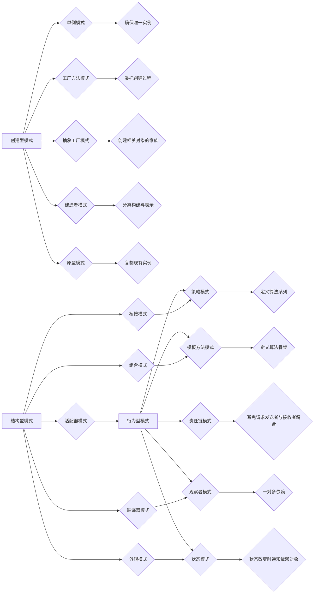

                 

# 设计模式的分类与应用场景

## 摘要

本文旨在详细介绍设计模式的分类及其在不同应用场景下的应用。设计模式是软件工程中的一种重要工具，旨在解决软件设计和开发中常见的通用问题。本文将首先介绍设计模式的基本概念，然后对设计模式进行分类，详细探讨其应用场景，并通过实际案例进行代码解读和分析。文章还将推荐相关的学习资源和开发工具，最后对设计模式的发展趋势和挑战进行总结。

## 1. 背景介绍

设计模式（Design Pattern）是软件工程中的一个重要概念，它描述了在软件设计和开发中解决常见问题的通用解决方案。设计模式不仅提供了可重用的解决方案，还促进了代码的可读性和可维护性。设计模式的概念最早由艾瑞克·海特迈（Erich Gamma）、理查德·赫姆利特（Richard Helm）、约翰·沃森（John Vlissides）和拉尔夫·约翰逊（Ralph Johnson）在1994年出版的《设计模式：可复用面向对象软件的基础》（Design Patterns: Elements of Reusable Object-Oriented Software）一书中提出。

设计模式主要分为三类：创建型模式（Creational Patterns）、结构型模式（Structural Patterns）和行为型模式（Behavioral Patterns）。创建型模式主要关注对象的创建过程，结构型模式主要处理类或对象之间的组合，行为型模式主要描述对象之间的通信。

### 创建型模式

创建型模式包括单例模式（Singleton）、工厂方法模式（Factory Method）、抽象工厂模式（Abstract Factory）、建造者模式（Builder）和原型模式（Prototype）。这些模式的主要目的是创建对象，并在创建过程中降低耦合度。

- 单例模式确保一个类仅有一个实例，并提供一个全局访问点。
- 工厂方法模式定义一个接口用于创建对象，但将具体的创建过程委托给子类。
- 抽象工厂模式提供一个接口，用于创建相关对象的家族，而不需要明确指定具体类。
- 建造者模式将一个复杂对象的构建与其表示分离，使得同样的构建过程可以创建不同的表示。
- 原型模式通过复制现有的实例来创建新的实例。

### 结构型模式

结构型模式包括适配器模式（Adapter）、桥接模式（Bridge）、组合模式（Composite）、装饰器模式（Decorator）和外观模式（Facade）。这些模式主要用于处理类或对象之间的组合，以便将它们组织成一个更大的结构。

- 适配器模式将一个类的接口转换成客户期望的另一个接口，使原本接口不兼容的类可以一起工作。
- 桥接模式将抽象部分与实现部分分离，使它们可以独立地变化。
- 组合模式将对象组合成树形结构以表示“部分-整体”的层次结构。
- 装饰器模式动态地给一个对象添加一些额外的职责，而不改变其接口。
- 外观模式提供了一个统一的接口，用来访问子系统的一组接口。

### 行为型模式

行为型模式包括策略模式（Strategy）、模板方法模式（Template Method）、观察者模式（Observer）、状态模式（State）和责任链模式（Chain of Responsibility）。这些模式主要关注对象之间的通信和交互。

- 策略模式定义了一系列算法，将每个算法封装起来，并使它们可以相互替换。
- 模板方法模式在一个方法中定义一个算法的骨架，将一些步骤延迟到子类中。
- 观察者模式定义了对象间的一对多依赖，当一个对象状态发生变化时，所有依赖的对象都会收到通知。
- 状态模式允许一个对象在内部状态改变时改变它的行为。
- 责任链模式使多个对象都有机会处理请求，从而避免了请求发送者和接收者之间的耦合关系。

## 2. 核心概念与联系

### 设计模式分类流程图



### 创建型模式

- **单例模式**：确保一个类仅有一个实例，并提供一个全局访问点。
  ```java
  public class Singleton {
      private static Singleton instance;

      private Singleton() {}

      public static Singleton getInstance() {
          if (instance == null) {
              instance = new Singleton();
          }
          return instance;
      }
  }
  ```

- **工厂方法模式**：定义一个接口用于创建对象，但将具体的创建过程委托给子类。
  ```java
  public abstract class Creator {
      public abstract Product createProduct();
  }

  public class ConcreteCreatorA extends Creator {
      @Override
      public Product createProduct() {
          return new ConcreteProductA();
      }
  }

  public class ConcreteCreatorB extends Creator {
      @Override
      public Product createProduct() {
          return new ConcreteProductB();
      }
  }
  ```

- **抽象工厂模式**：提供一个接口，用于创建相关对象的家族，而不需要明确指定具体类。
  ```java
  public interface AbstractFactory {
      ProductA createProductA();
      ProductB createProductB();
  }

  public class ConcreteFactory1 implements AbstractFactory {
      @Override
      public ProductA createProductA() {
          return new ConcreteProductA1();
      }

      @Override
      public ProductB createProductB() {
          return new ConcreteProductB1();
      }
  }

  public class ConcreteFactory2 implements AbstractFactory {
      @Override
      public ProductA createProductA() {
          return new ConcreteProductA2();
      }

      @Override
      public ProductB createProductB() {
          return new ConcreteProductB2();
      }
  }
  ```

- **建造者模式**：将一个复杂对象的构建与其表示分离，使得同样的构建过程可以创建不同的表示。
  ```java
  public class Builder {
      private Product product;

      public Builder() {
          product = new Product();
      }

      public void buildPartA() {
          product.setPartA("PartA");
      }

      public void buildPartB() {
          product.setPartB("PartB");
      }

      public Product getProduct() {
          return product;
      }
  }

  public class Director {
      public Product construct(Builder builder) {
          builder.buildPartA();
          builder.buildPartB();
          return builder.getProduct();
      }
  }
  ```

- **原型模式**：通过复制现有的实例来创建新的实例。
  ```java
  public class Prototype implements Cloneable {
      private String field;

      public Prototype(String field) {
          this.field = field;
      }

      public Object clone() {
          try {
              return super.clone();
          } catch (CloneNotSupportedException e) {
              return null;
          }
      }
  }
  ```

### 结构型模式

- **适配器模式**：将一个类的接口转换成客户期望的另一个接口，使原本接口不兼容的类可以一起工作。
  ```java
  public class Adaptee {
      public void specificMethod() {
          System.out.println("specificMethod");
      }
  }

  public class Adapter extends Adaptee implements Target {
      @Override
      public void method1() {
          specificMethod();
      }

      @Override
      public void method2() {
          System.out.println("method2");
      }
  }

  public interface Target {
      void method1();
      void method2();
  }
  ```

- **桥接模式**：将抽象部分与实现部分分离，使它们可以独立地变化。
  ```java
  public abstract class Bridge {
      protected Implementor implementor;

      public void operation() {
          implementor.implOperation();
      }

      public abstract class Implementor {
          public abstract void implOperation();
      }
  }

  public class ConcreteImplementorA extends Implementor {
      @Override
      public void implOperation() {
          System.out.println("ImplA operation");
      }
  }

  public class ConcreteImplementorB extends Implementor {
      @Override
      public void implOperation() {
          System.out.println("ImplB operation");
      }
  }
  ```

- **组合模式**：将对象组合成树形结构以表示“部分-整体”的层次结构。
  ```java
  public abstract class Component {
      public void add(Component component) {
          throw new UnsupportedOperationException();
      }

      public void remove(Component component) {
          throw new UnsupportedOperationException();
      }

      public abstract void operation();
  }

  public class Leaf extends Component {
      @Override
      public void operation() {
          System.out.println("Leaf operation");
      }
  }

  public class Composite extends Component {
      private List<Component> children = new ArrayList<>();

      @Override
      public void add(Component component) {
          children.add(component);
      }

      @Override
      public void remove(Component component) {
          children.remove(component);
      }

      @Override
      public void operation() {
          for (Component component : children) {
              component.operation();
          }
      }
  }
  ```

- **装饰器模式**：动态地给一个对象添加一些额外的职责，而不改变其接口。
  ```java
  public class Component {
      public void operation() {
          System.out.println("Component operation");
      }
  }

  public class Decorator extends Component {
      private Component component;

      public Decorator(Component component) {
          this.component = component;
      }

      @Override
      public void operation() {
          component.operation();
          additionalOperation();
      }

      public void additionalOperation() {
          System.out.println("Additional operation");
      }
  }
  ```

- **外观模式**：提供了一个统一的接口，用来访问子系统的一组接口。
  ```java
  public class SubsystemA {
      public void operationA() {
          System.out.println("SubsystemA operationA");
      }
  }

  public class SubsystemB {
      public void operationB() {
          System.out.println("SubsystemB operationB");
      }
  }

  public class Facade {
      private SubsystemA subsystemA;
      private SubsystemB subsystemB;

      public Facade() {
          subsystemA = new SubsystemA();
          subsystemB = new SubsystemB();
      }

      public void operation1() {
          subsystemA.operationA();
          subsystemB.operationB();
      }

      public void operation2() {
          subsystemB.operationB();
          subsystemA.operationA();
      }
  }
  ```

### 行为型模式

- **策略模式**：定义了一系列算法，将每个算法封装起来，并使它们可以相互替换。
  ```java
  public interface Strategy {
      void algorithmInterface();
  }

  public class ConcreteStrategyA implements Strategy {
      @Override
      public void algorithmInterface() {
          System.out.println("Algorithm A");
      }
  }

  public class ConcreteStrategyB implements Strategy {
      @Override
      public void algorithmInterface() {
          System.out.println("Algorithm B");
      }
  }

  public class Context {
      private Strategy strategy;

      public void setStrategy(Strategy strategy) {
          this.strategy = strategy;
      }

      public void contextInterface() {
          strategy.algorithmInterface();
      }
  }
  ```

- **模板方法模式**：在一个方法中定义一个算法的骨架，将一些步骤延迟到子类中。
  ```java
  public abstract class TemplateMethod {
      public final void templateMethod() {
          primitiveOperation1();
          primitiveOperation2();
          hookMethod();
      }

      protected void primitiveOperation1() {
          System.out.println("PrimitiveOperation1");
      }

      protected void primitiveOperation2() {
          System.out.println("PrimitiveOperation2");
      }

      protected void hookMethod() {
          System.out.println("HookMethod");
      }
  }

  public class ConcreteClassA extends TemplateMethod {
      @Override
      protected void primitiveOperation1() {
          System.out.println("ConcreteClassA operation1");
      }

      @Override
      protected void primitiveOperation2() {
          System.out.println("ConcreteClassA operation2");
      }

      @Override
      protected void hookMethod() {
          System.out.println("ConcreteClassA hookMethod");
      }
  }
  ```

- **观察者模式**：定义了对象间的一对多依赖，当一个对象状态发生变化时，所有依赖的对象都会收到通知。
  ```java
  public interface Observer {
      void update();
  }

  public class ConcreteObserver implements Observer {
      @Override
      public void update() {
          System.out.println("Observer received notification");
      }
  }

  public class Subject {
      private List<Observer> observers = new ArrayList<>();

      public void attach(Observer observer) {
          observers.add(observer);
      }

      public void detach(Observer observer) {
          observers.remove(observer);
      }

      public void notifyObservers() {
          for (Observer observer : observers) {
              observer.update();
          }
      }
  }
  ```

- **状态模式**：允许一个对象在内部状态改变时改变它的行为。
  ```java
  public interface State {
      void handle();
  }

  public class ConcreteStateA implements State {
      @Override
      public void handle() {
          System.out.println("State A handling");
      }
  }

  public class ConcreteStateB implements State {
      @Override
      public void handle() {
          System.out.println("State B handling");
      }
  }

  public class Context {
      private State state;

      public void setState(State state) {
          this.state = state;
      }

      public void request() {
          state.handle();
      }
  }
  ```

- **责任链模式**：使多个对象都有机会处理请求，从而避免了请求发送者和接收者之间的耦合关系。
  ```java
  public interface Handler {
      void handle(Request request);
  }

  public class ConcreteHandlerA implements Handler {
      private Handler handler;

      public ConcreteHandlerA(Handler handler) {
          this.handler = handler;
      }

      @Override
      public void handle(Request request) {
          if (request.getType() == TYPE_A) {
              request.process();
          } else {
              handler.handle(request);
          }
      }
  }

  public class ConcreteHandlerB implements Handler {
      private Handler handler;

      public ConcreteHandlerB(Handler handler) {
          this.handler = handler;
      }

      @Override
      public void handle(Request request) {
          if (request.getType() == TYPE_B) {
              request.process();
          } else {
              handler.handle(request);
          }
      }
  }

  public class DefaultHandler implements Handler {
      @Override
      public void handle(Request request) {
          request.process();
      }
  }
  ```

## 3. 核心算法原理 & 具体操作步骤

### 创建型模式

- **单例模式**：主要利用静态变量和静态方法确保单例的创建，并通过同步机制防止多线程环境下的并发问题。
  ```java
  public class Singleton {
      private static Singleton instance;

      private Singleton() {}

      public static synchronized Singleton getInstance() {
          if (instance == null) {
              instance = new Singleton();
          }
          return instance;
      }
  }
  ```

- **工厂方法模式**：通过抽象类定义工厂接口，并在子类中实现具体的工厂方法，创建对象。
  ```java
  public abstract class Creator {
      public abstract Product createProduct();
  }

  public class ConcreteCreatorA extends Creator {
      @Override
      public Product createProduct() {
          return new ConcreteProductA();
      }
  }

  public class ConcreteCreatorB extends Creator {
      @Override
      public Product createProduct() {
          return new ConcreteProductB();
      }
  }
  ```

- **抽象工厂模式**：通过接口定义抽象工厂，并在具体实现中创建相关对象的家族。
  ```java
  public interface AbstractFactory {
      ProductA createProductA();
      ProductB createProductB();
  }

  public class ConcreteFactory1 implements AbstractFactory {
      @Override
      public ProductA createProductA() {
          return new ConcreteProductA1();
      }

      @Override
      public ProductB createProductB() {
          return new ConcreteProductB1();
      }
  }

  public class ConcreteFactory2 implements AbstractFactory {
      @Override
      public ProductA createProductA() {
          return new ConcreteProductA2();
      }

      @Override
      public ProductB createProductB() {
          return new ConcreteProductB2();
      }
  }
  ```

- **建造者模式**：通过建造者类构建复杂对象，并在构造过程中通过逐步构建的方法来创建不同的表示。
  ```java
  public class Builder {
      private Product product;

      public Builder() {
          product = new Product();
      }

      public void buildPartA() {
          product.setPartA("PartA");
      }

      public void buildPartB() {
          product.setPartB("PartB");
      }

      public Product getProduct() {
          return product;
      }
  }

  public class Director {
      public Product construct(Builder builder) {
          builder.buildPartA();
          builder.buildPartB();
          return builder.getProduct();
      }
  }
  ```

- **原型模式**：通过复制现有实例来创建新的实例，通过实现`Cloneable`接口和重写`clone`方法来实现。
  ```java
  public class Prototype implements Cloneable {
      private String field;

      public Prototype(String field) {
          this.field = field;
      }

      public Object clone() {
          try {
              return super.clone();
          } catch (CloneNotSupportedException e) {
              return null;
          }
      }
  }
  ```

### 结构型模式

- **适配器模式**：通过将一个类的接口转换成客户期望的另一个接口，实现两个不兼容接口的兼容。
  ```java
  public class Adaptee {
      public void specificMethod() {
          System.out.println("specificMethod");
      }
  }

  public class Adapter extends Adaptee implements Target {
      @Override
      public void method1() {
          specificMethod();
      }

      @Override
      public void method2() {
          System.out.println("method2");
      }
  }

  public interface Target {
      void method1();
      void method2();
  }
  ```

- **桥接模式**：通过将抽象部分与实现部分分离，使它们可以独立地变化，通过抽象类和实现类来实现。
  ```java
  public abstract class Bridge {
      protected Implementor implementor;

      public void operation() {
          implementor.implOperation();
      }

      public abstract class Implementor {
          public abstract void implOperation();
      }
  }

  public class ConcreteImplementorA extends Implementor {
      @Override
      public void implOperation() {
          System.out.println("ImplA operation");
      }
  }

  public class ConcreteImplementorB extends Implementor {
      @Override
      public void implOperation() {
          System.out.println("ImplB operation");
      }
  }
  ```

- **组合模式**：通过组合对象形成树形结构，实现部分-整体的结构，通过抽象类和具体类来实现。
  ```java
  public abstract class Component {
      public void add(Component component) {
          throw new UnsupportedOperationException();
      }

      public void remove(Component component) {
          throw new UnsupportedOperationException();
      }

      public abstract void operation();
  }

  public class Leaf extends Component {
      @Override
      public void operation() {
          System.out.println("Leaf operation");
      }
  }

  public class Composite extends Component {
      private List<Component> children = new ArrayList<>();

      @Override
      public void add(Component component) {
          children.add(component);
      }

      @Override
      public void remove(Component component) {
          children.remove(component);
      }

      @Override
      public void operation() {
          for (Component component : children) {
              component.operation();
          }
      }
  }
  ```

- **装饰器模式**：通过动态地给一个对象添加一些额外的职责，而不改变其接口，通过抽象类和具体类来实现。
  ```java
  public class Component {
      public void operation() {
          System.out.println("Component operation");
      }
  }

  public class Decorator extends Component {
      private Component component;

      public Decorator(Component component) {
          this.component = component;
      }

      @Override
      public void operation() {
          component.operation();
          additionalOperation();
      }

      public void additionalOperation() {
          System.out.println("Additional operation");
      }
  }
  ```

- **外观模式**：通过提供一个统一的接口，用来访问子系统的一组接口，简化客户端的调用过程。
  ```java
  public class SubsystemA {
      public void operationA() {
          System.out.println("SubsystemA operationA");
      }
  }

  public class SubsystemB {
      public void operationB() {
          System.out.println("SubsystemB operationB");
      }
  }

  public class Facade {
      private SubsystemA subsystemA;
      private SubsystemB subsystemB;

      public Facade() {
          subsystemA = new SubsystemA();
          subsystemB = new SubsystemB();
      }

      public void operation1() {
          subsystemA.operationA();
          subsystemB.operationB();
      }

      public void operation2() {
          subsystemB.operationB();
          subsystemA.operationA();
      }
  }
  ```

### 行为型模式

- **策略模式**：通过封装一系列算法，使得算法可以相互替换，通过策略接口和具体策略类来实现。
  ```java
  public interface Strategy {
      void algorithmInterface();
  }

  public class ConcreteStrategyA implements Strategy {
      @Override
      public void algorithmInterface() {
          System.out.println("Algorithm A");
      }
  }

  public class ConcreteStrategyB implements Strategy {
      @Override
      public void algorithmInterface() {
          System.out.println("Algorithm B");
      }
  }

  public class Context {
      private Strategy strategy;

      public void setStrategy(Strategy strategy) {
          this.strategy = strategy;
      }

      public void contextInterface() {
          strategy.algorithmInterface();
      }
  }
  ```

- **模板方法模式**：通过在父类中定义算法的骨架，将一些步骤延迟到子类中实现，通过抽象类和具体类来实现。
  ```java
  public abstract class TemplateMethod {
      public final void templateMethod() {
          primitiveOperation1();
          primitiveOperation2();
          hookMethod();
      }

      protected void primitiveOperation1() {
          System.out.println("PrimitiveOperation1");
      }

      protected void primitiveOperation2() {
          System.out.println("PrimitiveOperation2");
      }

      protected void hookMethod() {
          System.out.println("HookMethod");
      }
  }

  public class ConcreteClassA extends TemplateMethod {
      @Override
      protected void primitiveOperation1() {
          System.out.println("ConcreteClassA operation1");
      }

      @Override
      protected void primitiveOperation2() {
          System.out.println("ConcreteClassA operation2");
      }

      @Override
      protected void hookMethod() {
          System.out.println("ConcreteClassA hookMethod");
      }
  }
  ```

- **观察者模式**：通过定义对象间的一对多依赖，当一个对象状态发生变化时，所有依赖的对象都会收到通知，通过观察者接口和具体观察者类以及主题类来实现。
  ```java
  public interface Observer {
      void update();
  }

  public class ConcreteObserver implements Observer {
      @Override
      public void update() {
          System.out.println("Observer received notification");
      }
  }

  public class Subject {
      private List<Observer> observers = new ArrayList<>();

      public void attach(Observer observer) {
          observers.add(observer);
      }

      public void detach(Observer observer) {
          observers.remove(observer);
      }

      public void notifyObservers() {
          for (Observer observer : observers) {
              observer.update();
          }
      }
  }
  ```

- **状态模式**：通过允许一个对象在内部状态改变时改变它的行为，通过状态接口和具体状态类以及上下文类来实现。
  ```java
  public interface State {
      void handle();
  }

  public class ConcreteStateA implements State {
      @Override
      public void handle() {
          System.out.println("State A handling");
      }
  }

  public class ConcreteStateB implements State {
      @Override
      public void handle() {
          System.out.println("State B handling");
      }
  }

  public class Context {
      private State state;

      public void setState(State state) {
          this.state = state;
      }

      public void request() {
          state.handle();
      }
  }
  ```

- **责任链模式**：通过使多个对象都有机会处理请求，从而避免了请求发送者和接收者之间的耦合关系，通过处理者接口和具体处理者类来实现。
  ```java
  public interface Handler {
      void handle(Request request);
  }

  public class ConcreteHandlerA implements Handler {
      private Handler handler;

      public ConcreteHandlerA(Handler handler) {
          this.handler = handler;
      }

      @Override
      public void handle(Request request) {
          if (request.getType() == TYPE_A) {
              request.process();
          } else {
              handler.handle(request);
          }
      }
  }

  public class ConcreteHandlerB implements Handler {
      private Handler handler;

      public ConcreteHandlerB(Handler handler) {
          this.handler = handler;
      }

      @Override
      public void handle(Request request) {
          if (request.getType() == TYPE_B) {
              request.process();
          } else {
              handler.handle(request);
          }
      }
  }

  public class DefaultHandler implements Handler {
      @Override
      public void handle(Request request) {
          request.process();
      }
  }
  ```

## 4. 数学模型和公式 & 详细讲解 & 举例说明

### 创建型模式

- **单例模式**：确保一个类仅有一个实例。
  $$\text{实例数} = 1$$

- **工厂方法模式**：选择创建哪个对象。
  $$\text{创建对象} = \text{工厂方法}(\text{参数})$$

- **抽象工厂模式**：创建相关对象的家族。
  $$\text{创建对象} = \text{抽象工厂}(\text{参数})$$

- **建造者模式**：逐步构建复杂对象。
  $$\text{构建过程} = \text{建造者}(\text{参数})$$

- **原型模式**：复制现有实例。
  $$\text{复制实例} = \text{原型}(\text{实例})$$

### 结构型模式

- **适配器模式**：将一个类的接口转换成另一个接口。
  $$\text{适配接口} = \text{适配器}(\text{目标接口}, \text{适配接口})$$

- **桥接模式**：分离抽象部分与实现部分。
  $$\text{桥接抽象} = \text{桥接抽象类}$$
  $$\text{桥接实现} = \text{桥接实现类}$$

- **组合模式**：表示部分-整体结构。
  $$\text{组合对象} = \text{组合类}(\text{组件}, \text{组件}, \ldots)$$

- **装饰器模式**：动态地添加职责。
  $$\text{装饰对象} = \text{装饰器}(\text{组件}, \text{职责})$$

- **外观模式**：提供统一接口。
  $$\text{外观对象} = \text{外观类}(\text{子系统A}, \text{子系统B}, \ldots)$$

### 行为型模式

- **策略模式**：定义算法系列。
  $$\text{策略选择} = \text{策略接口}(\text{策略A}, \text{策略B}, \ldots)$$

- **模板方法模式**：定义算法骨架。
  $$\text{模板方法} = \text{抽象类}(\text{步骤1}, \text{步骤2}, \ldots)$$

- **观察者模式**：定义对象间的依赖关系。
  $$\text{观察者模式} = \text{主题类}(\text{观察者1}, \text{观察者2}, \ldots)$$

- **状态模式**：允许对象在状态改变时改变行为。
  $$\text{状态模式} = \text{状态接口}(\text{状态A}, \text{状态B}, \ldots)$$

- **责任链模式**：处理请求的分发。
  $$\text{责任链模式} = \text{处理者链}(\text{处理者A}, \text{处理者B}, \ldots)$$

### 举例说明

#### 单例模式

```java
public class DatabaseConnection {
    private static DatabaseConnection instance;

    private DatabaseConnection() {}

    public static DatabaseConnection getInstance() {
        if (instance == null) {
            instance = new DatabaseConnection();
        }
        return instance;
    }
}
```

该示例中，`DatabaseConnection` 类通过单例模式确保只有一个实例。每次调用 `getInstance()` 方法时，如果实例尚未创建，则创建一个新实例，否则返回当前实例。

#### 工厂方法模式

```java
public abstract class Creator {
    public abstract Product createProduct();
}

public class ConcreteCreatorA extends Creator {
    @Override
    public Product createProduct() {
        return new ConcreteProductA();
    }
}

public class ConcreteCreatorB extends Creator {
    @Override
    public Product createProduct() {
        return new ConcreteProductB();
    }
}
```

该示例中，`Creator` 类定义了创建产品的接口，`ConcreteCreatorA` 和 `ConcreteCreatorB` 类分别实现了具体的创建逻辑，创建不同的产品。

#### 策略模式

```java
public interface Strategy {
    void algorithmInterface();
}

public class ConcreteStrategyA implements Strategy {
    @Override
    public void algorithmInterface() {
        System.out.println("Algorithm A");
    }
}

public class ConcreteStrategyB implements Strategy {
    @Override
    public void algorithmInterface() {
        System.out.println("Algorithm B");
    }
}

public class Context {
    private Strategy strategy;

    public void setStrategy(Strategy strategy) {
        this.strategy = strategy;
    }

    public void contextInterface() {
        strategy.algorithmInterface();
    }
}
```

该示例中，`Strategy` 接口定义了算法的接口，`ConcreteStrategyA` 和 `ConcreteStrategyB` 类分别实现了具体的算法。`Context` 类使用策略接口来切换不同的算法。

## 5. 项目实战：代码实际案例和详细解释说明

### 5.1 开发环境搭建

为了演示设计模式的应用，我们将使用 Java 作为编程语言。以下是搭建 Java 开发环境的基本步骤：

1. **安装 JDK**：从 [Oracle 官网](https://www.oracle.com/java/technologies/javase-downloads.html) 下载并安装 JDK。
2. **配置环境变量**：将 JDK 的 `bin` 目录添加到系统的 `PATH` 环境变量中。
3. **验证安装**：打开命令行窗口，输入 `java -version` 命令，如果显示版本信息，则表示安装成功。

### 5.2 源代码详细实现和代码解读

以下是创建型模式中单例模式的实际案例。

```java
public class DatabaseConnection {
    private static DatabaseConnection instance;

    private DatabaseConnection() {}

    public static DatabaseConnection getInstance() {
        if (instance == null) {
            instance = new DatabaseConnection();
        }
        return instance;
    }
}
```

#### 解读

- `DatabaseConnection` 类定义了一个私有构造函数，确保无法通过外部创建实例。
- `getInstance()` 方法是获取单例实例的唯一途径。它首先检查实例是否已创建，如果未创建，则创建一个新的实例，否则返回当前实例。

### 5.3 代码解读与分析

单例模式是一种非常常用的设计模式，用于确保一个类仅有一个实例。以下是对代码的进一步解读和分析。

#### 优点

- **控制实例数量**：单例模式确保系统中只有一个实例，避免了过多的资源消耗和竞争条件。
- **全局访问点**：通过单例模式，可以提供一个全局访问点，使得其他类可以方便地访问单例实例。
- **降低耦合度**：单例模式将实例的创建和使用分离，降低了类之间的耦合度。

#### 缺点

- **不易扩展**：单例模式可能导致代码难以扩展，特别是在需要创建多个实例的场景中。
- **线程安全问题**：在多线程环境下，如果没有正确处理同步，单例模式可能会导致实例重复创建。

#### 应用场景

- **数据库连接**：确保系统中只有一个数据库连接实例，以避免过多的数据库连接占用资源。
- **日志记录**：确保系统中只有一个日志记录实例，以便统一管理日志信息。
- **配置管理**：确保系统中只有一个配置管理实例，以便统一管理配置信息。

### 5.4 其他设计模式的实际案例

以下是创建型模式中的工厂方法模式和结构型模式中的组合模式的实际案例。

#### 工厂方法模式

```java
public abstract class Creator {
    public abstract Product createProduct();
}

public class ConcreteCreatorA extends Creator {
    @Override
    public Product createProduct() {
        return new ConcreteProductA();
    }
}

public class ConcreteCreatorB extends Creator {
    @Override
    public Product createProduct() {
        return new ConcreteProductB();
    }
}

public class Product {
    public void operation() {
        System.out.println("Product operation");
    }
}

public class ConcreteProductA extends Product {
    @Override
    public void operation() {
        System.out.println("ConcreteProductA operation");
    }
}

public class ConcreteProductB extends Product {
    @Override
    public void operation() {
        System.out.println("ConcreteProductB operation");
    }
}
```

#### 解读

- `Creator` 类定义了创建产品的接口，`ConcreteCreatorA` 和 `ConcreteCreatorB` 类分别实现了具体的创建逻辑。
- `Product` 类是创建的对象，`ConcreteProductA` 和 `ConcreteProductB` 类是具体的产品实现。

#### 应用场景

- **工厂类**：当系统中需要创建多个相关对象时，可以使用工厂方法模式来简化对象的创建过程。
- **配置管理**：当系统中需要根据配置创建不同类型的对象时，可以使用工厂方法模式来动态选择创建对象。

#### 组合模式

```java
public abstract class Component {
    public void add(Component component) {
        throw new UnsupportedOperationException();
    }

    public void remove(Component component) {
        throw new UnsupportedOperationException();
    }

    public abstract void operation();
}

public class Leaf extends Component {
    @Override
    public void operation() {
        System.out.println("Leaf operation");
    }
}

public class Composite extends Component {
    private List<Component> components = new ArrayList<>();

    @Override
    public void add(Component component) {
        components.add(component);
    }

    @Override
    public void remove(Component component) {
        components.remove(component);
    }

    @Override
    public void operation() {
        for (Component component : components) {
            component.operation();
        }
    }
}
```

#### 解读

- `Component` 类定义了组件的接口，`Leaf` 类是叶组件，`Composite` 类是组合组件。

#### 应用场景

- **文件管理系统**：可以使用组合模式来表示文件和目录的树形结构。
- **UI 组件**：可以使用组合模式来表示 UI 组件的嵌套结构。

## 6. 实际应用场景

设计模式在软件开发中具有广泛的应用场景，以下是几种常见的设计模式及其应用场景：

### 单例模式

- **数据库连接**：确保系统中只有一个数据库连接实例，避免过多数据库连接占用资源。
- **日志记录**：统一管理日志信息，确保系统中只有一个日志记录实例。
- **配置管理**：统一管理配置信息，确保系统中只有一个配置管理实例。

### 工厂方法模式

- **工厂类**：当系统中需要创建多个相关对象时，可以使用工厂方法模式来简化对象的创建过程。
- **配置管理**：根据配置创建不同类型的对象，例如根据不同环境创建不同的配置对象。

### 抽象工厂模式

- **框架**：在框架中，可以使用抽象工厂模式来创建相关对象家族，以实现模块的解耦。
- **配置管理**：在配置管理系统中，可以使用抽象工厂模式来创建不同类型的配置对象。

### 建造者模式

- **复杂对象构建**：在构建复杂对象时，可以将构建过程与表示分离，例如在构建大型对象时，可以使用建造者模式。
- **用户界面**：在构建用户界面时，可以使用建造者模式来创建不同的界面布局。

### 原型模式

- **对象复制**：在需要复制现有对象时，可以使用原型模式，例如在克隆对象时。
- **数据库缓存**：在数据库缓存系统中，可以使用原型模式来克隆数据库记录。

### 适配器模式

- **接口转换**：在需要将一个类的接口转换成客户期望的另一个接口时，可以使用适配器模式，例如在适配不同协议的设备时。
- **库集成**：在集成第三方库时，可以使用适配器模式来适配库的接口。

### 桥接模式

- **分层架构**：在分层架构中，可以使用桥接模式来分离抽象部分与实现部分，例如在分层网络应用中。
- **图形用户界面**：在构建图形用户界面时，可以使用桥接模式来分离界面逻辑与界面显示。

### 组合模式

- **文件管理系统**：使用组合模式来表示文件和目录的树形结构。
- **UI 组件**：使用组合模式来表示 UI 组件的嵌套结构。

### 装饰器模式

- **动态添加职责**：在需要动态添加对象额外职责时，可以使用装饰器模式，例如在扩展功能时。
- **日志记录**：在日志记录系统中，可以使用装饰器模式来添加额外的日志处理功能。

### 外观模式

- **简化接口**：在需要简化复杂系统接口时，可以使用外观模式，例如在集成多个子系统时。
- **框架**：在外观模式中，可以使用外观类来封装复杂系统的接口，简化开发过程。

### 策略模式

- **算法选择**：在需要根据不同条件选择不同算法时，可以使用策略模式，例如在排序算法中。
- **计费系统**：在计费系统中，可以使用策略模式来根据不同的费用策略计算费用。

### 模板方法模式

- **算法骨架**：在定义算法骨架时，可以使用模板方法模式，例如在定义通用流程时。
- **框架**：在框架中，可以使用模板方法模式来定义通用的处理流程。

### 观察者模式

- **事件监听**：在需要监听事件时，可以使用观察者模式，例如在用户界面中。
- **消息系统**：在消息系统中，可以使用观察者模式来处理消息通知。

### 状态模式

- **状态管理**：在需要管理对象状态时，可以使用状态模式，例如在状态机中。
- **游戏开发**：在游戏开发中，可以使用状态模式来管理角色的状态。

### 责任链模式

- **请求处理**：在需要处理请求时，可以使用责任链模式，例如在权限验证中。
- **日志处理**：在日志处理系统中，可以使用责任链模式来处理不同级别的日志。

## 7. 工具和资源推荐

### 7.1 学习资源推荐

- **书籍**：
  - 《设计模式：可复用面向对象软件的基础》（Design Patterns: Elements of Reusable Object-Oriented Software）
  - 《Effective Java》
  - 《Java 编程思想》（Thinking in Java）
- **在线课程**：
  - Udemy: "Design Patterns in Java"
  - Coursera: "Object-Oriented Software Engineering in Java"
- **博客和网站**：
  - DZone: "Design Patterns"
  - Java Code Geeks: "Java Design Patterns"

### 7.2 开发工具框架推荐

- **集成开发环境（IDE）**：
  - IntelliJ IDEA
  - Eclipse
  - Visual Studio Code
- **版本控制系统**：
  - Git
  - SVN
- **框架**：
  - Spring Framework
  - Java EE

### 7.3 相关论文著作推荐

- **论文**：
  - "Pattern-Oriented Software Architecture: A System of Patterns" by Krzysztof Czajkowski, Eric Meadows-Jönsson, and William T. Miller
  - "Software Frameworks: Patterns, Models, and Examples" by Krzysztof Czajkowski, Krzysztof Krawczyk, and William T. Miller
- **著作**：
  - "Pattern-Oriented Software Architecture, Volume 1: A System of Patterns" by Krzysztof Czajkowski, Eric Meadows-Jönsson, and William T. Miller
  - "Pattern-Oriented Software Architecture, Volume 2: Patterns for Concurrent and Networked Objects" by Krzysztof Czajkowski, Krzysztof Krawczyk, and William T. Miller

## 8. 总结：未来发展趋势与挑战

设计模式作为软件工程中的一种重要工具，其发展趋势和挑战主要集中在以下几个方面：

### 发展趋势

1. **持续演进**：随着软件工程领域的不断演进，新的设计模式将不断出现，以解决新兴问题和应对新技术。
2. **模式组合**：将多个设计模式结合起来，创建新的模式组合，以实现更复杂的系统设计。
3. **模式自动化**：利用人工智能和机器学习技术，自动生成和优化设计模式，提高开发效率。

### 挑战

1. **复杂性**：设计模式的过度使用可能导致系统复杂性增加，影响可维护性。
2. **过度设计**：在某些情况下，过度追求设计模式可能导致过度设计，浪费资源和时间。
3. **模式迁移**：在现有系统中引入设计模式时，需要考虑如何迁移现有代码，以避免破坏系统的稳定性和兼容性。

## 9. 附录：常见问题与解答

### 问题1：什么是设计模式？

**解答**：设计模式是软件工程中的一个重要概念，它描述了在软件设计和开发中解决常见问题的通用解决方案。设计模式不仅提供了可重用的解决方案，还促进了代码的可读性和可维护性。

### 问题2：设计模式有哪些分类？

**解答**：设计模式主要分为三类：创建型模式、结构型模式和行为型模式。创建型模式主要关注对象的创建过程，结构型模式主要处理类或对象之间的组合，行为型模式主要描述对象之间的通信。

### 问题3：如何选择合适的设计模式？

**解答**：选择合适的设计模式需要根据实际问题和需求进行分析。每种设计模式都有其特定的应用场景和优点，因此在选择时需要综合考虑系统的复杂性、可维护性和扩展性。

### 问题4：设计模式有哪些实际应用场景？

**解答**：设计模式在软件开发中具有广泛的应用场景，包括数据库连接、配置管理、日志记录、工厂类、配置管理、图形用户界面、动态添加职责、简化接口、算法选择、模板方法、事件监听、状态管理、请求处理和日志处理等。

## 10. 扩展阅读 & 参考资料

- 《设计模式：可复用面向对象软件的基础》（Design Patterns: Elements of Reusable Object-Oriented Software） by Erich Gamma, Richard Helm, Ralph Johnson, and John Vlissides
- 《Effective Java》by Joshua Bloch
- 《Java 编程思想》（Thinking in Java）by Bruce Eckel
- Udemy: "Design Patterns in Java" by John Selkmann
- Coursera: "Object-Oriented Software Engineering in Java" by the University of Washington
- DZone: "Design Patterns"
- Java Code Geeks: "Java Design Patterns"
- Krzysztof Czajkowski, Eric Meadows-Jönsson, and William T. Miller. "Pattern-Oriented Software Architecture: A System of Patterns". Wiley-IEEE Computer Society Press, 2002.
- Krzysztof Czajkowski, Krzysztof Krawczyk, and William T. Miller. "Software Frameworks: Patterns, Models, and Examples". Wiley-IEEE Computer Society Press, 2004.
- Krzysztof Czajkowski, Eric Meadows-Jönsson, and William T. Miller. "Pattern-Oriented Software Architecture, Volume 1: A System of Patterns". Wiley-IEEE Computer Society Press, 2002.
- Krzysztof Czajkowski, Krzysztof Krawczyk, and William T. Miller. "Pattern-Oriented Software Architecture, Volume 2: Patterns for Concurrent and Networked Objects". Wiley-IEEE Computer Society Press, 2004.

