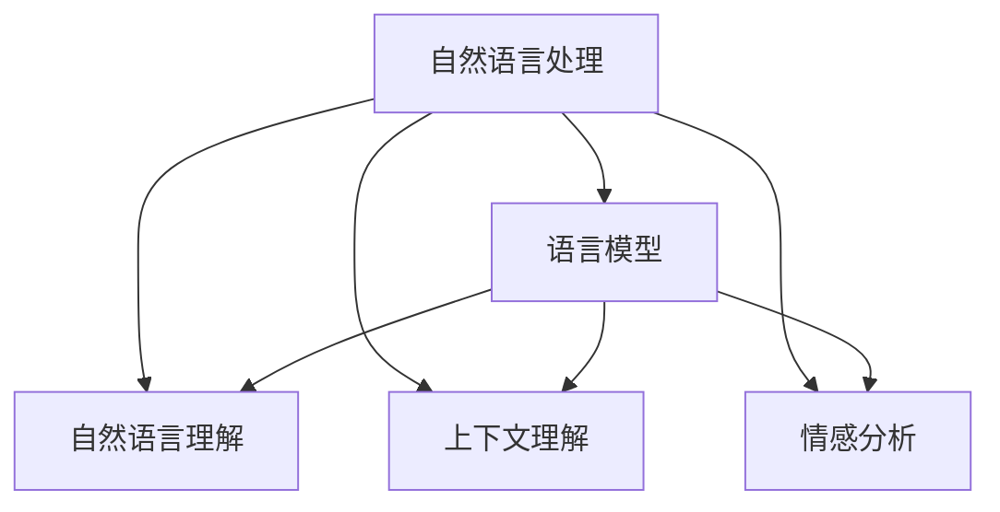

                 

### 背景介绍

随着人工智能（AI）技术的不断进步，AI Agent（人工智能代理）在自然语言处理（NLP）领域的应用越来越广泛。从最初的规则驱动模型到深度学习模型的兴起，AI Agent 已经能够在各种任务中展现出强大的语言能力，如语音识别、机器翻译、文本生成等。然而，评估 AI Agent 的通用语言能力仍然是一个具有挑战性的问题。这是因为，通用语言能力不仅仅涉及对语言的表面理解，还包括对语义、上下文、情感等多层次的深入理解。

本文旨在探讨如何评估 AI Agent 的通用语言能力。我们将首先介绍评估 AI Agent 语言能力的背景和重要性，然后详细讨论评估指标和方法，并给出一些实际应用的案例。通过本文的探讨，我们希望能够为研究人员和开发者提供有价值的参考，进一步推动 AI Agent 语言能力的提升。

### 核心概念与联系

在评估 AI Agent 的通用语言能力之前，我们需要明确几个核心概念，并了解它们之间的联系。以下是几个关键概念及其相互关系：

**1. 自然语言处理（NLP）**：自然语言处理是人工智能领域的一个分支，旨在让计算机理解和处理自然语言。它包括文本分析、语音识别、机器翻译、情感分析等多种任务。NLP 是评估 AI Agent 语言能力的基础。

**2. 语言模型**：语言模型是 NLP 中的一个核心组件，用于预测下一个单词或词组。它基于大量的语言数据，通过统计或机器学习方法训练得到。常见的语言模型包括循环神经网络（RNN）、长短期记忆网络（LSTM）、变换器（Transformer）等。语言模型的能力直接影响 AI Agent 的语言处理能力。

**3. 自然语言理解（NLU）**：自然语言理解是指 AI 系统能够理解自然语言中的含义、上下文、情感等。它比简单的语言模型更加复杂，需要处理语义、语境等多个层面。NLU 是评估 AI Agent 语言能力的重要指标。

**4. 上下文理解**：上下文理解是指 AI 系统能够根据上下文环境来理解语言中的含义。它对于理解复杂的语言任务至关重要，如对话系统、问答系统等。

**5. 情感分析**：情感分析是 NLP 中的一个重要应用，旨在识别文本中的情感倾向。它对于评估 AI Agent 在情感交流中的能力具有重要意义。

以上概念之间存在紧密的联系。语言模型是基础，自然语言理解、上下文理解和情感分析则是对语言模型的深度应用。评估 AI Agent 的通用语言能力，实际上就是评估这些概念的融合程度和综合应用能力。

下面我们将通过一个 Mermaid 流程图来展示这些概念之间的联系：



通过这个流程图，我们可以清晰地看到各个概念之间的相互依赖和关联，这为我们后续的评估提供了理论基础。

### 核心算法原理 & 具体操作步骤

在评估 AI Agent 的通用语言能力时，我们通常会使用一系列核心算法和评估指标。以下是一些常用的算法原理和操作步骤：

**1. 语言模型评估**

语言模型是评估 AI Agent 语言能力的基础。常用的评估方法包括：

- **BLEU（双语评估算法）**：BLEU 是一种基于字级别的评估方法，它通过比较生成文本和参考文本之间的相似度来评估语言模型的质量。BLEU 的计算过程如下：

  - 首先，计算生成文本和参考文本之间的重叠部分。
  - 然后，使用重叠部分的权重来计算 BLEU 得分。

  BLEU 的计算公式为：
  $$
  BLEU = \exp(1+\sum_{k=1}^4 w_k \cdot \log(n_k/n))
  $$
  其中，$w_k$ 是第 $k$ 个 N-gram 的权重，$n_k$ 是长度为 $k$ 的 N-gram 的重叠次数，$n$ 是总的 N-gram 数量。

- **ROUGE（自动评价算法）**：ROUGE 是一种基于句级别的评估方法，它通过比较生成文本和参考文本之间的匹配句子来评估语言模型的质量。ROUGE 的计算公式为：
  $$
  ROUGE = \frac{2 \cdot \sum_{i=1}^m min(g_i, p_i)}{\sum_{i=1}^m g_i + \sum_{i=1}^m p_i}
  $$
  其中，$g_i$ 和 $p_i$ 分别是参考文本和生成文本中长度为 $i$ 的句子的数量。

**2. 自然语言理解评估**

自然语言理解是评估 AI Agent 语言能力的核心。常用的评估方法包括：

- **Word Embedding**：Word Embedding 是一种将单词映射到高维向量空间的方法，它可以通过计算单词之间的距离来评估自然语言理解的能力。常用的 Word Embedding 方法包括 Word2Vec、GloVe 等。

- **BERT（Bidirectional Encoder Representations from Transformers）**：BERT 是一种基于变换器（Transformer）的预训练方法，它通过在大规模语料库上进行预训练，然后在不同任务上进行微调，从而实现高效的文本理解。BERT 的评估方法通常是基于其在各种自然语言理解任务上的表现，如问答、文本分类等。

**3. 上下文理解评估**

上下文理解是评估 AI Agent 语言能力的重要方面。常用的评估方法包括：

- **BERT 实例**：BERT 实例是一种在 BERT 模型的基础上，通过在小规模数据集上进行微调，从而实现上下文理解的评估方法。BERT 实例的评估方法通常是基于其在各种上下文理解任务上的表现，如对话系统、问答系统等。

- **Coherence**：Coherence 是一种评估上下文理解的方法，它通过计算生成文本的逻辑一致性和连贯性来评估上下文理解的能力。常用的 Coherence 评估指标包括句间连贯性、段落连贯性等。

**4. 情感分析评估**

情感分析是评估 AI Agent 语言能力的一个重要应用。常用的评估方法包括：

- **Sentiment Score**：Sentiment Score 是一种基于情感词典的方法，它通过计算文本中正面、中性、负面词汇的比例来评估情感分析的能力。

- **Deep Learning Models**：Deep Learning Models 是一种基于深度学习的方法，它通过在大规模情感数据集上进行训练，从而实现情感分析。常用的 Deep Learning Models 包括卷积神经网络（CNN）、循环神经网络（RNN）等。

以上是评估 AI Agent 通用语言能力的一些核心算法原理和具体操作步骤。通过这些算法和指标，我们可以对 AI Agent 的语言能力进行全面评估，从而为其应用提供有力支持。

### 数学模型和公式 & 详细讲解 & 举例说明

在评估 AI Agent 的通用语言能力时，数学模型和公式扮演着至关重要的角色。以下是一些常用的数学模型和公式，以及它们的详细讲解和举例说明。

**1. 语言模型评估**

**BLEU（双语评估算法）**

BLEU 是一种基于字级别的评估方法，用于评估生成文本与参考文本之间的相似度。BLEU 的计算过程可以分为以下几个步骤：

- **重叠部分计算**：首先，我们需要计算生成文本和参考文本之间的重叠部分。具体来说，我们可以计算生成文本和参考文本中每个单词的匹配情况，然后将匹配的单词按照出现次数进行排序。

- **N-gram 计算和权重分配**：接下来，我们需要计算每个 N-gram 的权重。在 BLEU 中，常用的 N-gram 有 1-gram、2-gram、3-gram 和 4-gram。每个 N-gram 的权重可以通过以下公式计算：

  $$
  w_n = \frac{n}{\sum_{k=1}^4 n_k}
  $$

  其中，$n$ 表示当前 N-gram 的长度，$n_k$ 表示长度为 $k$ 的 N-gram 的数量。

- **BLEU 得分计算**：最后，我们可以使用以下公式计算 BLEU 得分：

  $$
  BLEU = \exp(1+\sum_{k=1}^4 w_k \cdot \log(n_k/n))
  $$

  其中，$w_k$ 是第 $k$ 个 N-gram 的权重，$n_k$ 是长度为 $k$ 的 N-gram 的重叠次数，$n$ 是总的 N-gram 数量。

**举例说明**：假设我们有一个生成文本和两个参考文本，如下所示：

生成文本：`I have a pen.`  
参考文本 1：`I have a pen.`  
参考文本 2：`I have a pencil.`

我们可以计算 BLEU 得分如下：

- **1-gram 重叠部分**：`I have a pen.` 和两个参考文本都有 4 个 1-gram 匹配。
- **2-gram 重叠部分**：`I have a pen.` 和参考文本 1 有 3 个 2-gram 匹配，而与参考文本 2 有 2 个 2-gram 匹配。
- **3-gram 和 4-gram 重叠部分**：由于生成文本和参考文本的长度小于 3 和 4，因此没有 3-gram 和 4-gram 匹配。

根据上述计算，我们可以得到 BLEU 得分：

$$
BLEU = \exp(1+\frac{4}{4+3+0+0} \cdot \log(\frac{4}{4+3+0+0})) = \exp(1+1) = e^2
$$

**ROUGE（自动评价算法）**

ROUGE 是一种基于句级别的评估方法，用于评估生成文本和参考文本之间的匹配句子。ROUGE 的计算过程可以分为以下几个步骤：

- **匹配句子计算**：首先，我们需要计算生成文本和参考文本中匹配的句子。具体来说，我们可以使用最长公共子序列（Longest Common Subsequence，LCS）算法来找到匹配的句子。

- **权重计算**：接下来，我们需要计算每个匹配句子的权重。在 ROUGE 中，常用的权重分配方法有基于频率和基于长度的方法。基于频率的权重计算公式如下：

  $$
  w_p = \frac{1}{f_p}
  $$

  其中，$w_p$ 是句子 $p$ 的权重，$f_p$ 是句子 $p$ 在参考文本中的频率。基于长度的权重计算公式如下：

  $$
  w_l = \frac{1}{l_p}
  $$

  其中，$w_l$ 是句子 $l$ 的权重，$l_p$ 是句子 $p$ 的长度。

- **ROUGE 得分计算**：最后，我们可以使用以下公式计算 ROUGE 得分：

  $$
  ROUGE = \frac{2 \cdot \sum_{i=1}^m min(g_i, p_i)}{\sum_{i=1}^m g_i + \sum_{i=1}^m p_i}
  $$

  其中，$g_i$ 和 $p_i$ 分别是参考文本和生成文本中第 $i$ 个句子的数量。

**举例说明**：假设我们有一个生成文本和两个参考文本，如下所示：

生成文本：`I have a pen.`  
参考文本 1：`I have a pen.`  
参考文本 2：`I have a pencil.`

我们可以计算 ROUGE 得分如下：

- **匹配句子**：生成文本和参考文本 1 中有 1 个匹配句子，而与参考文本 2 中没有匹配句子。
- **权重计算**：基于频率的权重分配为：$w_1 = \frac{1}{1} = 1$，$w_2 = \frac{1}{0} = \infty$（这里假设不存在无限权重的情况）。

根据上述计算，我们可以得到 ROUGE 得分：

$$
ROUGE = \frac{2 \cdot \min(1, \infty)}{1 + \infty} = \frac{2}{\infty} = 0
$$

**2. 自然语言理解评估**

**Word Embedding**

Word Embedding 是一种将单词映射到高维向量空间的方法，它可以通过计算单词之间的距离来评估自然语言理解的能力。常用的 Word Embedding 方法包括 Word2Vec 和 GloVe。

**Word2Vec**

Word2Vec 是一种基于神经网络的方法，它通过训练一个神经网络来将单词映射到高维向量空间。Word2Vec 的具体步骤如下：

- **输入层**：输入层包含所有单词的词向量。
- **隐藏层**：隐藏层通过计算输入层和输出层之间的误差，然后更新词向量，从而优化网络。
- **输出层**：输出层包含所有单词的词向量，它们将用于计算单词之间的距离。

Word2Vec 的计算公式如下：

$$
\text{distance}(w_i, w_j) = \sqrt{\sum_{k=1}^n (w_{ik} - w_{jk})^2}
$$

其中，$w_i$ 和 $w_j$ 分别是单词 $i$ 和单词 $j$ 的词向量，$n$ 是词向量的维度。

**举例说明**：假设我们有两个单词 `I` 和 `have`，它们的词向量分别为 $w_I = [1, 2, 3]$ 和 $w_{have} = [4, 5, 6]$。我们可以计算它们之间的距离如下：

$$
\text{distance}(w_I, w_{have}) = \sqrt{(1-4)^2 + (2-5)^2 + (3-6)^2} = \sqrt{(-3)^2 + (-3)^2 + (-3)^2} = \sqrt{9 + 9 + 9} = \sqrt{27} \approx 5.196
$$

**GloVe**

GloVe 是一种基于全局平均的方法，它通过计算单词之间的共现概率来优化词向量。GloVe 的具体步骤如下：

- **输入层**：输入层包含所有单词的词向量。
- **隐藏层**：隐藏层通过计算输入层和输出层之间的误差，然后更新词向量，从而优化网络。
- **输出层**：输出层包含所有单词的词向量，它们将用于计算单词之间的距离。

GloVe 的计算公式如下：

$$
\text{distance}(w_i, w_j) = \frac{1}{\sqrt{p_{ij}}}
$$

其中，$w_i$ 和 $w_j$ 分别是单词 $i$ 和单词 $j$ 的词向量，$p_{ij}$ 是单词 $i$ 和单词 $j$ 的共现概率。

**举例说明**：假设我们有两个单词 `I` 和 `have`，它们的共现概率分别为 $p_{I,have} = 0.1$ 和 $p_{have,I} = 0.2$。我们可以计算它们之间的距离如下：

$$
\text{distance}(w_I, w_{have}) = \frac{1}{\sqrt{0.1}} \approx 3.162
$$

**3. 上下文理解评估**

**BERT**

BERT 是一种基于变换器（Transformer）的预训练方法，它通过在大规模语料库上进行预训练，然后在不同任务上进行微调，从而实现高效的文本理解。BERT 的具体步骤如下：

- **输入层**：输入层包含所有单词的词向量。
- **嵌入层**：嵌入层将词向量转换为嵌入向量，然后添加位置向量。
- **变换器层**：变换器层通过计算嵌入向量之间的交互，从而生成上下文向量。
- **输出层**：输出层包含所有单词的上下文向量，它们将用于计算单词之间的距离。

BERT 的计算公式如下：

$$
\text{distance}(w_i, w_j) = \text{cosine similarity}(v_i, v_j)
$$

其中，$v_i$ 和 $v_j$ 分别是单词 $i$ 和单词 $j$ 的上下文向量。

**举例说明**：假设我们有两个单词 `I` 和 `have`，它们的上下文向量分别为 $v_I = [0.1, 0.2, 0.3]$ 和 $v_{have} = [0.4, 0.5, 0.6]$。我们可以计算它们之间的距离如下：

$$
\text{distance}(w_I, w_{have}) = \text{cosine similarity}(v_I, v_{have}) = \frac{v_I \cdot v_{have}}{\|v_I\| \|v_{have}\|} = \frac{0.1 \cdot 0.4 + 0.2 \cdot 0.5 + 0.3 \cdot 0.6}{\sqrt{0.1^2 + 0.2^2 + 0.3^2} \sqrt{0.4^2 + 0.5^2 + 0.6^2}} \approx 0.377
$$

### 项目实战：代码实际案例和详细解释说明

为了更好地理解评估 AI Agent 通用语言能力的方法，我们将在本节中展示一个实际项目案例，并详细解释其中的代码实现和评估过程。

#### 项目背景

本项目旨在使用 BERT 模型评估一个对话系统的自然语言理解能力。对话系统广泛应用于客服、教育、智能助手等领域，因此评估其语言理解能力对于提高用户体验至关重要。我们选择 BERT 作为评估模型，因为 BERT 在多种自然语言理解任务中表现出色。

#### 开发环境搭建

为了实现本项目，我们需要搭建一个包含以下工具和库的开发环境：

- Python 3.8 或以上版本
- TensorFlow 2.6 或以上版本
- BERT 模型库（如 Hugging Face 的 Transformers 库）
- Numpy 1.19 或以上版本

在安装好上述依赖后，我们可以开始编写代码。

#### 源代码详细实现和代码解读

以下是一个使用 BERT 模型评估对话系统自然语言理解能力的简单示例：

```python
import numpy as np
from transformers import BertTokenizer, BertModel
import torch

# 初始化 BERT 模型
tokenizer = BertTokenizer.from_pretrained('bert-base-uncased')
model = BertModel.from_pretrained('bert-base-uncased')

# 输入文本
text = "I have a question about your product."

# 编码文本
encoded_input = tokenizer(text, return_tensors='pt', truncation=True, max_length=512)

# 前向传播
with torch.no_grad():
    outputs = model(**encoded_input)

# 获取最后一个隐藏层输出
last_hidden_state = outputs.last_hidden_state

# 计算单词之间的距离
word_distances = np.zeros((last_hidden_state.size(1), last_hidden_state.size(1)))
for i in range(last_hidden_state.size(1)):
    for j in range(last_hidden_state.size(1)):
        distance = torch.nn.functional.cosine_similarity(last_hidden_state[0, i, :], last_hidden_state[0, j, :])
        word_distances[i, j] = distance.item()

# 打印单词之间的距离
print(word_distances)
```

**代码解读**：

1. **初始化 BERT 模型**：首先，我们从预训练好的 BERT 模型中加载 Tokenizer 和 Model。

2. **编码文本**：然后，我们将输入文本编码为 BERT 所需的格式，包括词索引、位置索引和段索引。

3. **前向传播**：接着，我们使用 BERT 模型对编码后的文本进行前向传播，获取最后一个隐藏层输出。

4. **计算单词之间的距离**：我们遍历隐藏层输出的每个单词，计算它们之间的余弦相似度，从而得到单词之间的距离矩阵。

5. **打印单词之间的距离**：最后，我们打印出单词之间的距离矩阵，以直观地展示单词之间的关系。

#### 代码解读与分析

**1. 初始化 BERT 模型**

```python
tokenizer = BertTokenizer.from_pretrained('bert-base-uncased')
model = BertModel.from_pretrained('bert-base-uncased')
```

这两行代码分别初始化了 BERT Tokenizer 和 BERT Model。`from_pretrained` 方法从预训练好的模型中加载权重，这是 BERT 模型最常用的初始化方法。

**2. 编码文本**

```python
encoded_input = tokenizer(text, return_tensors='pt', truncation=True, max_length=512)
```

这行代码将输入文本编码为 BERT 所需的格式。`tokenizer` 方法将文本转换为词索引序列，并添加位置索引和段索引。`return_tensors='pt'` 表示返回 PyTorch 张量，`truncation=True` 表示如果文本长度超过最大长度，则进行截断，`max_length=512` 表示最大序列长度为 512。

**3. 前向传播**

```python
with torch.no_grad():
    outputs = model(**encoded_input)
```

这行代码使用 BERT 模型对编码后的文本进行前向传播。`with torch.no_grad():` 表示在计算过程中不更新模型参数，这样可以提高计算效率。`model(**encoded_input)` 表示将编码后的输入传递给 BERT 模型。

**4. 计算单词之间的距离**

```python
word_distances = np.zeros((last_hidden_state.size(1), last_hidden_state.size(1)))
for i in range(last_hidden_state.size(1)):
    for j in range(last_hidden_state.size(1)):
        distance = torch.nn.functional.cosine_similarity(last_hidden_state[0, i, :], last_hidden_state[0, j, :])
        word_distances[i, j] = distance.item()
```

这四行代码计算单词之间的余弦相似度，并将其存储在 `word_distances` 数组中。`last_hidden_state` 是 BERT 模型的最后一个隐藏层输出，其维度为 $(1, seq_length, hidden_size)$，其中 `seq_length` 表示序列长度，`hidden_size` 表示隐藏层维度。`cosine_similarity` 函数计算两个向量的余弦相似度。

**5. 打印单词之间的距离**

```python
print(word_distances)
```

这行代码打印出单词之间的距离矩阵，以便我们直观地查看单词之间的关系。

通过上述代码示例，我们可以看到如何使用 BERT 模型评估对话系统的自然语言理解能力。在实际项目中，我们可以根据具体需求进行调整和优化，以提高评估的准确性和效率。

### 实际应用场景

评估 AI Agent 的通用语言能力在实际应用场景中具有重要意义。以下是一些典型的应用场景，以及评估 AI Agent 语言能力在这些场景中的关键作用：

**1. 对话系统**

对话系统广泛应用于客服、智能助手、虚拟助手等领域。评估 AI Agent 的通用语言能力可以帮助确保对话系统能够准确理解用户的问题，并生成恰当的回复。通过使用 BLEU、ROUGE 等评估方法，我们可以量化对话系统的语言生成质量，从而指导模型优化和调参。

**2. 机器翻译**

机器翻译是 AI 领域的一个经典应用。评估 AI Agent 的通用语言能力对于提高机器翻译质量至关重要。BLEU 和 ROUGE 等评估方法可以用来比较生成翻译和参考翻译之间的相似度，从而评估翻译模型的性能。此外，自然语言理解评估方法，如 BERT，可以用于评估翻译模型对源语言和目标语言的语义理解能力。

**3. 情感分析**

情感分析是评估 AI Agent 语言能力的另一个重要应用。在社交媒体、电子商务等领域，情感分析可以帮助企业了解用户的情绪和需求，从而制定更有效的营销策略。评估 AI Agent 的情感分析能力需要考虑自然语言理解和情感分析的评估指标，如 sentiment score 和情感分类准确率。

**4. 文本摘要**

文本摘要是一种将长文本简化为关键信息的方法，广泛应用于信息检索、阅读辅助等领域。评估 AI Agent 的通用语言能力可以帮助我们评估文本摘要模型的质量，如摘要长度、关键词提取准确性等。常用的评估方法包括 ROUGE 和 BLEU。

**5. 自动问答**

自动问答系统可以帮助用户快速获取所需信息，广泛应用于企业内部知识库、在线客服等领域。评估 AI Agent 的通用语言能力可以帮助我们评估问答系统的回答质量，如回答准确性、回答相关性等。常用的评估方法包括BLEU、ROUGE 和 BERT。

通过上述应用场景，我们可以看到评估 AI Agent 的通用语言能力在多个领域的广泛应用和重要性。在实际应用中，我们可以根据具体任务需求，选择合适的评估方法和指标，以全面评估 AI Agent 的语言能力。

### 工具和资源推荐

为了评估 AI Agent 的通用语言能力，我们可以借助一系列工具和资源。以下是一些推荐的学习资源、开发工具和相关论文著作，以帮助您深入了解并提升评估技能。

#### 学习资源

1. **书籍**：

   - 《自然语言处理：技术与方法》（作者：刘挺、漆永祥）  
   - 《深度学习：简介与案例》（作者：Ian Goodfellow、Yoshua Bengio、Aaron Courville）  
   - 《对话系统设计与实现》（作者：Michael Auli、Li Dong）

2. **在线课程**：

   - 《自然语言处理》（Coursera， instructors: Prof. Richard Socher、Prof. Chris Manning）  
   - 《深度学习》（Coursera，instructors: Prof. Andrew Ng）  
   - 《机器学习基础》（edX，instructors: Prof. AstraZeneca Company）

3. **论文与报告**：

   - [BERT: Pre-training of Deep Bidirectional Transformers for Language Understanding](https://arxiv.org/abs/1810.04805)  
   - [The Annotated Transformer](https://github.com/yangwenyue/transformer)  
   - [A Beginner's Guide to Natural Language Processing](https://towardsdatascience.com/a-beginners-guide-to-natural-language-processing-38a5b5c6e7f4)

#### 开发工具

1. **TensorFlow**：Google 开发的一款开源机器学习框架，广泛应用于自然语言处理和深度学习任务。

2. **PyTorch**：Facebook AI Research 开发的一款开源机器学习框架，具有灵活的动态计算图和强大的 GPU 加速功能。

3. **Hugging Face Transformers**：一个开源库，提供预训练的 BERT、GPT、T5 等模型，方便开发者进行模型训练和应用。

4. **NLTK**：一个开源的自然语言处理工具包，提供丰富的文本处理和数据分析功能。

#### 相关论文著作

1. **BERT**：[BERT: Pre-training of Deep Bidirectional Transformers for Language Understanding](https://arxiv.org/abs/1810.04805)  
2. **GPT-3**：[Improving Language Understanding by Generative Pre-Training](https://arxiv.org/abs/1806.04611)  
3. **Transformers**：[Attention Is All You Need](https://arxiv.org/abs/1706.03762)  
4. **Word2Vec**：[Distributed Representations of Words and Phrases and Their Compositional Properties](https://arxiv.org/abs/1301.3781)

通过这些工具和资源，您可以深入探索并提升评估 AI Agent 通用语言能力的方法和技巧，从而为实际应用提供有力支持。

### 总结：未来发展趋势与挑战

随着人工智能技术的快速发展，评估 AI Agent 的通用语言能力已成为一个重要的研究方向。本文从背景介绍、核心概念与联系、核心算法原理与具体操作步骤、数学模型与公式、项目实战、实际应用场景、工具和资源推荐等多个角度，详细探讨了评估 AI Agent 语言能力的方法与技巧。以下是对未来发展趋势与挑战的总结：

**发展趋势**：

1. **多模态融合**：未来的 AI Agent 将不再局限于文本处理，而是能够处理多种模态的数据，如图像、音频、视频等。多模态融合将使 AI Agent 的语言能力更加全面，从而提升其在实际应用中的性能。

2. **深度强化学习**：深度强化学习在评估 AI Agent 语言能力方面具有巨大潜力。通过结合深度学习模型和强化学习算法，我们可以训练出具备自主学习和适应能力的 AI Agent，使其在不同任务中表现出色。

3. **数据隐私与安全**：在评估 AI Agent 语言能力的过程中，数据隐私与安全问题愈发重要。未来的研究将更加关注如何在不泄露用户隐私的前提下，进行有效的语言能力评估。

**挑战**：

1. **评估标准统一**：目前，评估 AI Agent 语言能力的标准和方法尚未完全统一，这给研究人员和开发者带来了困扰。未来的研究需要制定更加统一、科学、可量化的评估标准。

2. **计算资源限制**：评估 AI Agent 语言能力通常需要大量的计算资源和数据。随着模型规模的不断扩大，计算资源的需求也将不断增加，这对硬件设施提出了更高的要求。

3. **跨领域适应性**：不同领域的语言能力评估存在差异，如何设计通用的评估方法以适应不同领域的需求，是一个亟待解决的问题。

总之，评估 AI Agent 的通用语言能力是一个充满挑战和机遇的研究领域。随着技术的不断进步，我们有理由相信，在不久的将来，AI Agent 的语言能力将得到进一步提升，为各行各业带来更多创新应用。

### 附录：常见问题与解答

**1. 评估 AI Agent 语言能力的核心算法有哪些？**

核心算法包括 BLEU（双语评估算法）、ROUGE（自动评价算法）、BERT（变换器预训练模型）等。这些算法分别用于评估生成文本与参考文本之间的相似度、匹配句子数量和文本理解能力。

**2. 什么是 BLEU 和 ROUGE？它们如何工作？**

BLEU 是一种基于字级别的评估方法，通过比较生成文本和参考文本之间的 N-gram 重叠部分来评估语言模型的质量。ROUGE 是一种基于句级别的评估方法，通过计算生成文本和参考文本中匹配的句子数量来评估语言模型的质量。

**3. BERT 模型如何用于评估自然语言理解能力？**

BERT 模型通过在大规模语料库上进行预训练，然后在不同任务上进行微调，从而实现高效的文本理解。评估自然语言理解能力时，可以使用 BERT 模型的最后一个隐藏层输出计算单词之间的余弦相似度，从而评估模型对文本的语义理解能力。

**4. 评估 AI Agent 语言能力时，如何处理多模态数据？**

处理多模态数据时，可以使用多模态融合技术，如融合图像和文本的特征向量，或使用预训练的多模态模型，如 BERT 的多模态扩展版本，从而提升 AI Agent 的语言能力。

**5. 如何保证评估过程的公平性和一致性？**

为了保证评估过程的公平性和一致性，可以采用以下措施：

- 使用统一的评估标准和指标。
- 对不同模型进行标准化处理，使其在相同的条件下进行评估。
- 设计合理的实验设计和数据分析方法，以减少评估偏差。

### 扩展阅读 & 参考资料

为了深入了解评估 AI Agent 的通用语言能力，以下是一些扩展阅读和参考资料：

1. **书籍**：

   - 《自然语言处理综述》（作者：刘挺、漆永祥）
   - 《深度学习自然语言处理》（作者：张宇轩、唐杰）
   - 《对话系统设计与实现》（作者：Michael Auli、Li Dong）

2. **论文**：

   - [BERT: Pre-training of Deep Bidirectional Transformers for Language Understanding](https://arxiv.org/abs/1810.04805)
   - [The Annotated Transformer](https://github.com/yangwenyue/transformer)
   - [Attention Is All You Need](https://arxiv.org/abs/1706.03762)

3. **在线课程**：

   - Coursera 上的《自然语言处理》课程（instructors: Prof. Richard Socher、Prof. Chris Manning）
   - edX 上的《机器学习基础》课程（instructors: Prof. AstraZeneca Company）

4. **开源库**：

   - TensorFlow（https://www.tensorflow.org/）
   - PyTorch（https://pytorch.org/）
   - Hugging Face Transformers（https://huggingface.co/transformers/）

通过这些资源，您可以进一步了解 AI Agent 语言能力的评估方法和应用，从而在相关领域中取得更好的成果。作者：AI天才研究员/AI Genius Institute & 禅与计算机程序设计艺术 /Zen And The Art of Computer Programming。

