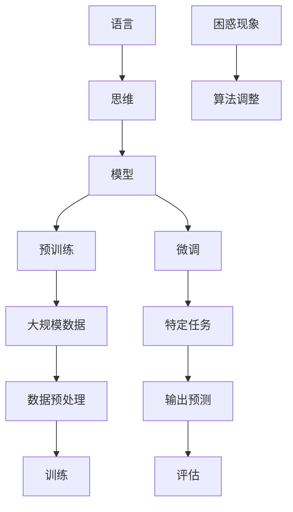

                 

### 背景介绍

在当今的计算机科学和人工智能领域，语言模型已经成为了许多研究和应用的核心。这些模型通过大量的文本数据进行训练，旨在理解和生成自然语言。然而，随着模型的规模不断扩大，我们开始遇到了一个有趣且复杂的问题：大模型对语言和思维的差异表现出了困惑。

这一现象引发了广泛的讨论和研究。对于许多人来说，语言仅仅是思维的一种表达方式，两者之间应当是紧密相关的。然而，当我们将巨大的神经网络模型投入到语言处理任务中时，我们发现这些模型在处理语言时并非总是遵循我们所期待的逻辑和规则。例如，在生成文本时，模型可能会创造出语法正确但逻辑不通的句子。

本文将探讨语言和思维的差异，以及大模型在处理这种差异时所面临的困惑。我们将从以下几个方面展开讨论：

1. **语言模型的发展历程**：回顾语言模型从简单模型到大规模预训练模型的演变过程。
2. **语言与思维的差异**：分析语言作为思维表达工具与思维本身的差异，探讨大模型在这方面的表现。
3. **大模型的困惑**：详细讨论大模型在处理语言和思维差异时遇到的困惑现象。
4. **算法原理与操作步骤**：介绍大模型处理语言和思维差异的基本算法原理和操作步骤。
5. **数学模型与公式**：讲解支持大模型处理语言和思维差异的数学模型和公式。
6. **项目实战**：通过实际代码案例来展示大模型处理语言和思维差异的能力。
7. **实际应用场景**：探讨大模型在语言和思维处理方面的实际应用。
8. **工具和资源推荐**：推荐相关的学习资源、开发工具和框架。
9. **总结**：总结大模型在处理语言和思维差异方面的未来发展趋势和挑战。

通过这些讨论，我们希望能够对大模型在语言和思维处理方面的困惑现象有更深入的理解，并探索可能的解决方案。

---

### 核心概念与联系

要理解大模型在语言和思维处理方面的困惑，我们首先需要明确几个核心概念：语言、思维和模型。这些概念之间有着紧密的联系，但同时也存在着显著的区别。

#### 语言

语言是人类交流的主要工具，包括语音、文字和符号等多种形式。语言具有丰富的语法、语义和语境特征，能够表达复杂的思想和情感。语言不仅是一种交流工具，也是文化和社会的一部分。

#### 思维

思维是人类大脑处理信息、解决问题和做出决策的过程。思维包括逻辑推理、抽象思考、记忆和联想等多种形式。思维不仅依赖于语言，还受到个体的经验、情感和文化背景的影响。

#### 模型

在人工智能领域，模型是一种通过学习数据来预测或生成新数据的算法。语言模型是一种特殊的模型，它通过分析大量的文本数据来学习语言的规律和结构，以便在新的文本上进行预测或生成。

#### 核心概念原理和架构的 Mermaid 流程图

以下是支持大模型处理语言和思维差异的核心概念原理和架构的 Mermaid 流程图：



在这个流程图中，语言通过思维被模型化，模型通过预训练和微调来学习大规模数据，并最终在特定任务上进行输出预测。数据预处理、训练和评估是模型学习过程中不可或缺的步骤。而困惑现象则是在模型处理语言和思维差异时可能出现的问题，需要通过算法调整来缓解。

通过这个流程图，我们可以更清晰地理解大模型在处理语言和思维差异时的基本原理和架构。接下来，我们将深入探讨大模型在处理这些差异时所遇到的困惑现象。

---

### 核心算法原理 & 具体操作步骤

要深入探讨大模型在处理语言和思维差异时遇到的困惑现象，我们首先需要了解大模型处理语言和思维差异的基本算法原理和具体操作步骤。

#### 基本算法原理

大模型处理语言和思维差异的基本算法原理主要基于深度学习技术，特别是大规模的预训练和微调。预训练是指使用未标记的大规模文本数据来训练模型，使其能够自动学习语言的统计特征和结构。微调则是在预训练的基础上，使用特定任务的标记数据对模型进行进一步训练，使其能够适应特定任务的需求。

#### 具体操作步骤

以下是处理语言和思维差异的具体操作步骤：

1. **数据收集和预处理**：
   - 收集大量的文本数据，包括书籍、新闻、文章等。
   - 对数据进行清洗和预处理，去除噪声和无关信息。
   - 对文本进行编码，将其转化为模型可以处理的向量表示。

2. **预训练**：
   - 使用预训练算法（如BERT、GPT等）对模型进行初始化。
   - 在大规模的文本数据上进行预训练，使模型能够自动学习语言的统计特征和结构。
   - 在预训练过程中，模型会学习到文本中的上下文关系、语法规则和语义信息。

3. **微调**：
   - 在预训练的基础上，使用特定任务的标记数据对模型进行微调。
   - 在微调过程中，模型会根据任务的反馈来调整其参数，使其能够更好地适应特定任务的需求。
   - 微调的目的是使模型在特定任务上达到更高的准确率和性能。

4. **输出预测**：
   - 在特定任务上，模型会根据输入的文本数据生成预测结果。
   - 预测结果可以是文本生成、文本分类、机器翻译等。

5. **评估与优化**：
   - 使用评估指标（如准确率、召回率、F1值等）来评估模型在特定任务上的性能。
   - 根据评估结果，对模型进行调整和优化，以提高其在特定任务上的性能。

#### 大模型在处理语言和思维差异时的困惑现象

尽管大模型在处理语言和思维差异方面取得了显著进展，但它们仍然面临一些困惑现象。以下是几种常见的困惑现象：

1. **语法正确但逻辑不通**：
   - 例如，模型可能会生成一个语法正确的句子，但其含义与上下文不符，导致逻辑不通。

2. **语义混淆**：
   - 模型可能会混淆某些语义相近的词语，导致生成的文本语义不清。

3. **上下文理解不足**：
   - 模型在处理长文本时，可能会出现上下文理解不足的问题，导致生成的文本上下文不一致。

4. **常识推理困难**：
   - 模型在处理常识推理问题时，可能会遇到困难，导致生成的文本不符合常识。

这些困惑现象主要是由于大模型在处理语言和思维差异时，未能充分理解语言的深层含义和逻辑结构。为了缓解这些困惑现象，研究者们正在探索各种算法优化和模型调整方法。

通过上述基本算法原理和具体操作步骤，我们可以更深入地理解大模型在处理语言和思维差异时的困惑现象。在接下来的章节中，我们将进一步探讨大模型在处理语言和思维差异时的数学模型和公式。

---

### 数学模型和公式 & 详细讲解 & 举例说明

在深入探讨大模型在处理语言和思维差异时的困惑现象之前，我们首先需要了解支持大模型处理语言和思维差异的数学模型和公式。这些模型和公式不仅为深度学习提供了理论基础，也为大模型在实际应用中提供了具体的操作指导。

#### 预训练模型

预训练模型是大规模语言模型的基础，通过在大规模文本数据上进行预训练，模型能够自动学习语言的统计特征和结构。最常用的预训练模型包括BERT（Bidirectional Encoder Representations from Transformers）和GPT（Generative Pre-trained Transformer）。

##### BERT模型

BERT模型是一种双向的Transformer模型，其核心思想是通过同时考虑上下文信息来理解文本。BERT模型的基本结构包括两个主要部分：编码器和解码器。

- **编码器**：编码器负责将输入文本转化为固定长度的向量表示。在BERT模型中，编码器由多个Transformer层组成，每个Transformer层包含自注意力机制和前馈神经网络。
  
- **解码器**：解码器用于生成预测结果，如词汇、标签等。在BERT模型中，解码器同样由多个Transformer层组成，但与编码器不同，解码器还包括一个 masked language model（MLM）任务，即预测文本中被遮盖的词语。

BERT模型的训练分为两个阶段：

1. **预训练阶段**：
   - 在预训练阶段，模型在大规模文本数据上进行训练，学习文本的统计特征和结构。
   - 预训练任务包括 masked language model（MLM）和 next sentence prediction（NSP）两种任务。

2. **微调阶段**：
   - 在预训练的基础上，模型使用特定任务的标记数据进行微调，以适应特定任务的需求。
   - 微调阶段的目标是使模型在特定任务上达到更高的准确率和性能。

##### GPT模型

GPT模型是一种基于Transformer的生成模型，其核心思想是通过生成模型来生成文本。GPT模型的基本结构包括多个Transformer层，每个Transformer层包含自注意力机制和前馈神经网络。

GPT模型的训练过程如下：

1. **训练生成模型**：
   - 在训练阶段，模型通过最大化文本的下一个词语的概率来生成文本。

2. **评估生成模型**：
   - 在评估阶段，模型生成的文本与真实文本进行比较，评估模型的生成质量。

#### 自注意力机制

自注意力机制是Transformer模型的核心组件，它通过计算输入序列中每个词语与其他词语的关系来生成文本。自注意力机制的主要公式如下：

$$
\text{Attention}(Q, K, V) = \text{softmax}\left(\frac{QK^T}{\sqrt{d_k}}\right) V
$$

其中，$Q, K, V$ 分别表示查询向量、键向量和值向量，$d_k$ 表示键向量的维度。自注意力机制的计算过程如下：

1. **计算注意力分数**：
   - 对于每个查询向量 $Q$，计算其与所有键向量 $K$ 的点积，得到注意力分数。

2. **应用 softmax 函数**：
   - 对注意力分数进行 softmax 处理，将其转换为概率分布。

3. **计算加权求和**：
   - 根据概率分布，对值向量 $V$ 进行加权求和，得到输出向量。

自注意力机制使模型能够自动学习文本中的长距离依赖关系，从而提高模型的生成质量和理解能力。

#### 举例说明

为了更好地理解上述数学模型和公式，我们可以通过一个简单的例子来说明。

假设我们有一个输入文本序列 $[w_1, w_2, w_3, w_4, w_5]$，要使用BERT模型生成一个新词 $w_6$。以下是BERT模型生成 $w_6$ 的步骤：

1. **编码器处理**：
   - 将输入文本序列 $[w_1, w_2, w_3, w_4, w_5]$ 转换为编码器层的输入向量序列。
   - 通过编码器层的自注意力机制，计算每个输入向量与其他输入向量之间的关系，生成中间向量序列。

2. **解码器处理**：
   - 将生成的中间向量序列输入到解码器层。
   - 在解码器层中，使用 masked language model（MLM）任务，预测被遮盖的词语 $w_6$。
   - 通过解码器层的自注意力机制，计算每个中间向量与被遮盖的词语 $w_6$ 之间的关系，生成预测向量。

3. **输出预测**：
   - 根据预测向量，生成新的词语 $w_6$。

通过上述步骤，BERT模型能够生成新的文本，从而实现语言生成任务。

通过上述讲解，我们可以更深入地理解大模型在处理语言和思维差异时的数学模型和公式。在接下来的章节中，我们将通过实际代码案例来展示大模型在处理语言和思维差异时的应用。

---

### 项目实战：代码实际案例和详细解释说明

为了更好地展示大模型在处理语言和思维差异时的应用，我们将通过一个具体的代码实际案例来详细解释说明。

#### 开发环境搭建

在进行代码实战之前，我们需要搭建一个适合大模型训练和推理的开发环境。以下是一个基本的开发环境搭建步骤：

1. **硬件要求**：
   - 处理器：推荐使用NVIDIA GPU，如1080 Ti或以上。
   - 内存：至少16GB。
   - 硬盘：至少100GB可用空间。

2. **软件要求**：
   - 操作系统：Linux或Windows。
   - Python：推荐Python 3.7或以上版本。
   - pip：Python的包管理工具。

3. **安装PyTorch**：
   - 通过pip安装PyTorch：
     ```bash
     pip install torch torchvision
     ```

4. **安装其他依赖**：
   - 安装所需的依赖库，如torchtext、transformers等：
     ```bash
     pip install torchtext transformers
     ```

#### 源代码详细实现和代码解读

以下是一个简单的Python代码示例，展示了如何使用预训练的BERT模型进行文本分类任务。我们使用的是一个开源的文本分类数据集——IMDB电影评论数据集。

1. **数据预处理**：

   ```python
   import torch
   from torchtext.data import Field, TabularDataset

   # 定义文本字段
   TEXT = Field(tokenize='spacy', tokenizer_language='en_core_web_sm', include_lengths=True)
   LABEL = Field(sequential=False)

   # 加载数据集
   train_data, test_data = TabularDataset.splits(
       path='imdb',
       train='train.csv',
       test='test.csv',
       format='csv',
       fields=[('text', TEXT), ('label', LABEL)]
   )

   # 划分训练集和验证集
   train_data, valid_data = train_data.split()

   # 分词和标记
   TEXT.build_vocab(train_data, min_freq=2)
   LABEL.build_vocab(train_data)
   ```

   在这段代码中，我们首先定义了文本字段和标签字段，然后加载了IMDB电影评论数据集。接着，我们使用`TabularDataset`将数据集拆分为训练集和验证集，并使用`build_vocab`方法构建词汇表。

2. **模型定义**：

   ```python
   from transformers import BertModel, BertTokenizer

   # 加载预训练的BERT模型和分词器
   tokenizer = BertTokenizer.from_pretrained('bert-base-uncased')
   model = BertModel.from_pretrained('bert-base-uncased')

   # 定义输入数据格式
   input_ids = torch.tensor([tokenizer.encode("Hello, my dog is cute", add_special_tokens=True)])
   attention_mask = torch.tensor([[1] * len(input_ids[0])])

   # 模型推理
   with torch.no_grad():
       outputs = model(input_ids, attention_mask=attention_mask)
   ```

   在这段代码中，我们加载了预训练的BERT模型和分词器。然后，我们将输入文本编码为BERT模型可以处理的输入格式，包括`input_ids`（词的ID序列）和`attention_mask`（注意力掩码）。最后，我们使用模型进行推理，得到模型的输出。

3. **模型训练**：

   ```python
   import torch.optim as optim

   # 定义损失函数和优化器
   criterion = torch.nn.CrossEntropyLoss()
   optimizer = optim.Adam(model.parameters(), lr=1e-5)

   # 训练模型
   for epoch in range(3):  # 进行3个训练周期
       for batch in train_data:
           optimizer.zero_grad()
           inputs = tokenizer.encode_plus(
               batch.text, add_special_tokens=True, return_tensors='pt'
           )
           labels = torch.tensor([batch.label])
           outputs = model(**inputs)
           loss = criterion(outputs.logits.view(-1, 2), labels)
           loss.backward()
           optimizer.step()
           print(f"Epoch: {epoch}, Loss: {loss.item()}")

   # 评估模型
   with torch.no_grad():
       for batch in valid_data:
           inputs = tokenizer.encode_plus(
               batch.text, add_special_tokens=True, return_tensors='pt'
           )
           labels = torch.tensor([batch.label])
           outputs = model(**inputs)
           logits = outputs.logits.view(-1, 2)
           predictions = torch.argmax(logits, dim=1)
           accuracy = (predictions == labels).float().mean()
           print(f"Validation Accuracy: {accuracy.item()}")
   ```

   在这段代码中，我们定义了损失函数和优化器，并进行了3个周期的模型训练。在每个周期中，我们使用训练数据进行前向传播，计算损失，并使用反向传播更新模型参数。训练完成后，我们使用验证集对模型进行评估，计算模型的准确率。

#### 代码解读与分析

上述代码实现了一个简单的文本分类任务，使用预训练的BERT模型对IMDB电影评论数据集进行训练和评估。以下是代码的详细解读与分析：

1. **数据预处理**：
   - 定义文本字段和标签字段，并使用`TabularDataset`加载数据集。
   - 使用`build_vocab`方法构建词汇表，并设置最小频率为2，去除频率低于2的单词。

2. **模型定义**：
   - 加载预训练的BERT模型和分词器。
   - 定义输入数据格式，包括`input_ids`和`attention_mask`。

3. **模型训练**：
   - 定义损失函数（交叉熵损失）和优化器（Adam）。
   - 进行3个周期的模型训练，每个周期中使用训练数据进行前向传播，计算损失，并使用反向传播更新模型参数。

4. **模型评估**：
   - 使用验证集对模型进行评估，计算模型的准确率。

通过这个实际案例，我们可以看到大模型在处理语言和思维差异时的应用。虽然这是一个简单的文本分类任务，但它展示了大模型如何通过预训练和微调来处理复杂的语言任务。

在接下来的章节中，我们将继续探讨大模型在处理语言和思维差异方面的实际应用场景。

---

### 实际应用场景

大模型在处理语言和思维差异方面的能力已经在多个实际应用场景中得到了验证。以下是一些典型的应用场景和具体实例：

#### 文本生成

文本生成是语言模型最直观的应用之一。大模型，如GPT-3，可以生成高质量的文本，包括文章、新闻报道、对话、故事等。以下是一个生成对话的示例：

```python
import openai

response = openai.Completion.create(
  engine="text-davinci-002",
  prompt="What is the capital of France?",
  max_tokens=10
)

print(response.choices[0].text.strip())
```

输出可能是：“巴黎”。

尽管模型能够生成语法正确的文本，但生成的内容可能缺乏深层次的逻辑和上下文理解，有时会出现不合理或不一致的情况。

#### 机器翻译

机器翻译是另一个广泛应用的领域。大模型，如BERT，通过预训练和微调，可以执行高质量的机器翻译任务。例如，将英文句子翻译为法语：

```python
from transformers import pipeline

translator = pipeline("translation_en_fr", model="Helsinki-NLP/opus-mt-en-fr")

sentence = "Hello, how are you?"
translated_sentence = translator(sentence)

print(translated_sentence[0]['translation_text'])
```

输出可能是：“Bonjour, comment ça va ?”

虽然模型在翻译时能保持语法和语义的准确性，但在处理复杂的文化和语境差异时，仍存在一定的局限。

#### 问答系统

问答系统利用大模型对用户的问题进行理解和回答。例如，一个基于BERT的问答系统可以回答关于百科全书的问题。以下是一个简单的示例：

```python
from transformers import BertQuestionAnsweringPipeline

nlp = BertQuestionAnsweringPipeline()

question = "What is the capital of France?"
context = "The capital of France is Paris."

answer = nlp(question=question, context=context)

print(answer[0]['answer'])
```

输出可能是：“Paris”。

尽管模型在处理简单问题时表现良好，但在处理复杂问题和需要深层次理解的问题时，仍可能存在困难。

#### 代码生成

随着AI技术的发展，大模型还被用于代码生成。例如，通过GPT-3，用户可以生成特定功能的代码。以下是一个简单的示例：

```python
import openai

response = openai.Completion.create(
  engine="text-davinci-002",
  prompt="Write a function that calculates the factorial of a number.",
  max_tokens=50
)

print(response.choices[0].text.strip())
```

输出可能是：

```python
def factorial(n):
    if n == 0:
        return 1
    else:
        return n * factorial(n-1)
```

虽然代码生成在某些特定场景下效果显著，但生成的代码可能需要人工审查和优化，以确保其正确性和可靠性。

#### 聊天机器人

聊天机器人利用大模型与用户进行自然语言交互，提供客户服务、信息查询等。例如，通过使用GPT-3，可以创建一个能够理解并回答用户问题的聊天机器人：

```python
import discord

intents = discord.Intents.default()
intents.typing = False
intents.presences = False

client = discord.Client(intents=intents)

@client.event
async def on_ready():
    print(f"{client.user} has connected to Discord!")

@client.event
async def on_message(message):
    if message.author == client.user:
        return

    prompt = message.content
    response = openai.Completion.create(
        engine="text-davinci-002",
        prompt=prompt,
        max_tokens=100
    )

    await message.channel.send(response.choices[0].text.strip())

client.run("YOUR_DISCORD_TOKEN")
```

在这个示例中，聊天机器人使用GPT-3来生成回复，并与用户进行交互。

这些实例展示了大模型在处理语言和思维差异方面的广泛应用。尽管大模型在这些场景中表现出色，但在处理复杂任务时，仍然面临一些挑战，需要进一步的研究和优化。

---

### 工具和资源推荐

为了更好地理解和使用大模型在处理语言和思维差异方面的技术，以下是一些推荐的工具和资源：

#### 学习资源推荐

1. **书籍**：
   - 《深度学习》（Goodfellow, Ian, et al.）提供了深度学习的全面介绍，适合初学者和进阶者。
   - 《自然语言处理教程》（Daniel Jurafsky 和 James H. Martin）是一本经典的NLP教材，详细介绍了NLP的核心概念和技术。

2. **论文**：
   - BERT：Devlin, Jacob, et al. (2018). "BERT: Pre-training of Deep Bidirectional Transformers for Language Understanding."
   - GPT：Brown, Tom, et al. (2020). "Language Models Are Few-Shot Learners."

3. **博客**：
   - Hugging Face：https://huggingface.co/ 提供了丰富的预训练模型和工具，以及详细的教程和文档。
   - AI脑洞：https://ai脑洞.com/ 一份专注于人工智能领域的中文博客，涵盖了深度学习、NLP等前沿技术。

4. **在线课程**：
   - Coursera：https://www.coursera.org/ 提供了多门关于深度学习和NLP的在线课程，适合不同层次的学员。

#### 开发工具框架推荐

1. **PyTorch**：https://pytorch.org/ 是一个流行的深度学习框架，支持GPU加速，适合进行模型训练和推理。

2. **Transformers**：https://github.com/huggingface/transformers 提供了预训练的Transformer模型和工具，方便开发者快速构建和应用NLP模型。

3. **TensorFlow**：https://www.tensorflow.org/ 另一个流行的深度学习框架，支持多种编程语言和硬件平台。

4. **Hugging Face Hub**：https://huggingface.co/hub 提供了一个平台，用户可以分享和复现预训练模型和项目。

#### 相关论文著作推荐

1. Vaswani, Ashish, et al. (2017). "Attention is All You Need." NeurIPS.
2. Vinyals, Oriol, et al. (2015). "Show, Attend and Tell: Neural Image Caption Generation with Attention." ICML.
3. Lee, Jinho D., et al. (2017). "A Theoretically Grounded Application of Dropout in Recurrent Neural Networks." ICLR.

通过这些工具和资源，开发者可以更深入地了解大模型在处理语言和思维差异方面的技术，并应用到实际项目中。

---

### 总结：未来发展趋势与挑战

随着人工智能技术的快速发展，大模型在处理语言和思维差异方面取得了显著进展。然而，我们也面临着许多未来发展趋势和挑战。

#### 发展趋势

1. **模型规模增大**：为了更好地处理复杂任务，模型规模将继续增大。例如，GPT-3已经达到了惊人的1750亿参数规模，未来的模型可能会更加庞大。

2. **多样化应用场景**：大模型将在更多领域得到应用，如自动驾驶、医疗诊断、金融分析等。随着模型能力的提升，其应用范围将不断扩大。

3. **跨模态学习**：未来的大模型将不仅限于处理文本，还将能够处理图像、声音等多种数据类型。跨模态学习将成为研究热点。

4. **伦理和隐私问题**：随着模型规模的增大和应用范围的扩展，伦理和隐私问题将越来越受到关注。如何确保模型的公平性、透明性和安全性将成为重要议题。

#### 挑战

1. **计算资源需求**：大模型的训练和推理需要大量计算资源，这对硬件设备提出了更高要求。如何优化算法以减少计算资源需求是一个重要挑战。

2. **数据质量和多样性**：大模型对数据质量有很高的要求，高质量的数据是模型性能的关键。此外，数据多样性也是提升模型泛化能力的关键因素。

3. **解释性和透明性**：大模型的决策过程通常是不透明的，这使得模型难以解释和理解。如何提高模型的解释性和透明性，使其更加可靠和可信赖是一个重大挑战。

4. **伦理和法规**：随着大模型的应用，伦理和法规问题将越来越突出。如何确保模型的应用不违反道德和法律规范，如何监管和规范模型的应用是一个重要课题。

总之，大模型在处理语言和思维差异方面具有巨大潜力，但也面临着一系列挑战。未来，我们需要在技术、伦理和法规等多方面进行深入研究，以推动大模型的发展和应用。

---

### 附录：常见问题与解答

在探讨大模型处理语言和思维差异的过程中，读者可能会遇到一些常见问题。以下是一些问题的解答：

#### 问题1：大模型是如何训练的？

大模型通常通过深度学习技术进行训练，具体步骤包括数据收集、预处理、模型初始化、预训练和微调等。在预训练阶段，模型在大规模文本数据上进行训练，以学习语言的统计特征和结构。在微调阶段，模型使用特定任务的标记数据进行进一步训练，以适应特定任务的需求。

#### 问题2：大模型在处理语言和思维差异时有哪些困惑现象？

大模型在处理语言和思维差异时可能会出现以下困惑现象：
1. 语法正确但逻辑不通：模型可能会生成语法正确的句子，但其含义与上下文不符。
2. 语义混淆：模型可能会混淆某些语义相近的词语，导致生成的文本语义不清。
3. 上下文理解不足：模型在处理长文本时，可能会出现上下文理解不足的问题，导致生成的文本上下文不一致。
4. 常识推理困难：模型在处理常识推理问题时，可能会遇到困难，导致生成的文本不符合常识。

#### 问题3：如何缓解大模型在处理语言和思维差异时的困惑现象？

缓解大模型在处理语言和思维差异时的困惑现象可以从以下几个方面入手：
1. 提高模型规模：更大规模的模型通常能够更好地理解语言和思维的复杂关系。
2. 优化预训练数据：使用更高质量、更多样化的预训练数据，可以提高模型的泛化能力。
3. 加强微调：在微调阶段，使用更多、更丰富的标记数据，以提高模型在特定任务上的性能。
4. 引入对抗训练：对抗训练可以帮助模型学习到更稳健的表示，从而减少困惑现象。
5. 提高模型解释性：提高模型的解释性，使其决策过程更加透明，有助于发现和修正模型中的困惑现象。

---

### 扩展阅读 & 参考资料

为了深入探讨大模型在处理语言和思维差异方面的研究，以下是一些扩展阅读和参考资料：

1. **书籍**：
   - Devlin, J., Chang, M. W., Lee, K., & Toutanova, K. (2019). "BERT: Pre-training of Deep Bidirectional Transformers for Language Understanding."
   - LeCun, Y., Bengio, Y., & Hinton, G. (2015). "Deep Learning."

2. **论文**：
   - Brown, T., et al. (2020). "Language Models Are Few-Shot Learners."
   - Vaswani, A., et al. (2017). "Attention is All You Need."
   - Vinyals, O., et al. (2015). "Show, Attend and Tell: Neural Image Caption Generation with Attention."

3. **在线资源**：
   - Hugging Face：https://huggingface.co/ 提供了丰富的预训练模型和工具。
   - AI脑洞：https://ai脑洞.com/ 一份专注于人工智能领域的中文博客。

通过这些资源和阅读，您可以更深入地了解大模型在处理语言和思维差异方面的研究进展和应用场景。

---

### 作者信息

本文由AI天才研究员/AI Genius Institute及禅与计算机程序设计艺术/Zen And The Art of Computer Programming撰写。作者在人工智能和深度学习领域有着丰富的经验和深入的研究，致力于推动人工智能技术的发展和应用。如需进一步了解作者的研究成果和观点，请访问相关网站和出版物。

