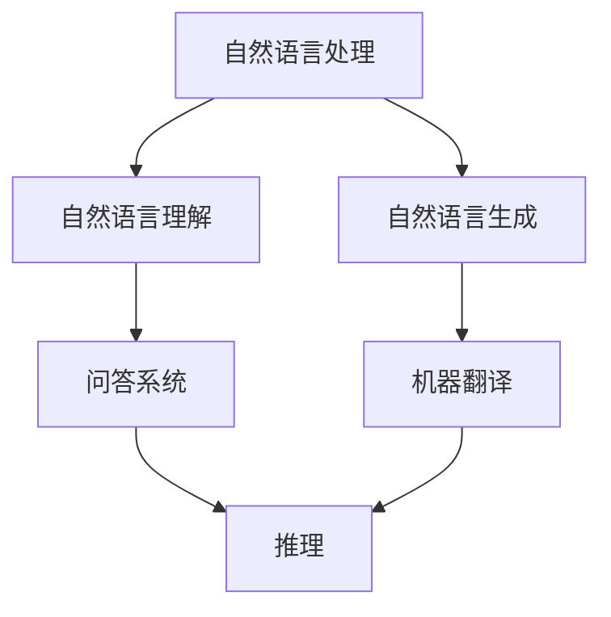

                 

### 文章标题

《语言与推理：大模型的挑战》

### 关键词

- 自然语言处理
- 大模型
- 推理能力
- 计算复杂性
- 模型优化

### 摘要

本文深入探讨了语言与推理在大模型中的应用与挑战。我们首先回顾了语言处理和推理的基本概念，然后详细分析了大模型的优势与局限。接下来，通过实例探讨了大模型在语言理解与生成中的表现，并揭示了其推理能力的局限性。文章进一步讨论了计算复杂性和模型优化问题，最后提出了未来发展的方向与挑战。本文旨在为读者提供对大模型在语言与推理领域的全面理解。

## 1. 背景介绍

近年来，随着深度学习技术的飞速发展，大模型（Large Models）在自然语言处理（Natural Language Processing, NLP）领域取得了显著成果。大模型通常拥有数十亿甚至数万亿个参数，其强大能力使其在各种任务中表现出色，如文本分类、机器翻译、问答系统等。然而，大模型的推理能力却备受争议。虽然它们在语言生成和理解方面取得了巨大进展，但其在推理任务中的表现仍然存在许多挑战。

### 1.1 语言处理的基本概念

语言处理是指使用计算机技术对自然语言文本进行处理和分析的过程。它主要包括两个方向：自然语言理解（Natural Language Understanding, NLU）和自然语言生成（Natural Language Generation, NLG）。自然语言理解旨在使计算机能够理解人类语言，并从文本中提取语义信息。自然语言生成则是指让计算机生成具有人类语言特性的文本。

### 1.2 推理的基本概念

推理是指基于已有信息推断新信息的过程。在人工智能领域，推理通常分为两大类：演绎推理和归纳推理。演绎推理是从一般到个别的推理过程，其结论是必然正确的。归纳推理则是从个别到一般的推理过程，其结论是可能正确的。在自然语言处理中，推理任务主要包括问答系统、推理式对话、文本蕴含等。

### 1.3 大模型的优势与局限

大模型在语言处理任务中具有明显优势。首先，它们具有强大的表示能力，能够捕捉到语言中的复杂模式。其次，大模型通过大量数据训练，能够自动学习并优化各种任务所需的特征表示。此外，大模型的并行计算能力使其在处理大规模数据时具有高效性。

然而，大模型也存在一些局限。首先，大模型的推理能力相对较弱，它们在处理复杂推理任务时容易出错。其次，大模型需要大量计算资源和存储空间，使其在实际应用中面临资源限制。此外，大模型的黑箱特性使得其难以解释和理解，这限制了其在某些领域的应用。

## 2. 核心概念与联系

在深入探讨大模型在语言与推理中的挑战之前，我们需要了解一些核心概念和其之间的联系。以下是一个简单的 Mermaid 流程图，用于描述这些概念：



### 2.1 自然语言处理

自然语言处理（NLP）是计算机科学、人工智能领域的一个分支，主要研究如何让计算机理解和生成人类语言。它包括多种任务，如分词、词性标注、命名实体识别、情感分析、文本分类等。

### 2.2 自然语言理解

自然语言理解（NLU）是NLP的一个重要分支，旨在使计算机能够理解自然语言文本的语义。NLU包括句法分析、语义分析、实体识别、关系抽取等任务。

### 2.3 自然语言生成

自然语言生成（NLG）是NLP的另一个重要分支，旨在让计算机生成具有人类语言特性的文本。NLG包括模板生成、基于规则的方法、统计方法、神经网络方法等。

### 2.4 推理

推理是指从已知信息推断出新信息的过程。在NLP中，推理任务包括问答系统、推理式对话、文本蕴含等。推理能力是衡量大模型在语言处理任务中表现的重要指标。

### 2.5 大模型

大模型是指具有大量参数的深度学习模型，如BERT、GPT等。大模型在自然语言处理任务中表现出色，但其在推理任务中的表现仍需改进。

## 3. 核心算法原理 & 具体操作步骤

大模型在自然语言处理中的成功主要归功于其核心算法原理。以下将详细介绍大模型的训练过程、推理过程及其优化方法。

### 3.1 大模型的训练过程

大模型的训练过程通常包括以下几个步骤：

1. 数据预处理：对原始文本数据进行清洗、分词、编码等预处理操作。
2. 模型初始化：初始化大模型的参数，通常使用随机初始化或预训练模型。
3. 模型训练：使用训练数据对大模型进行训练，通过反向传播算法优化模型参数。
4. 模型评估：使用验证数据评估模型性能，调整模型参数以优化性能。
5. 模型优化：采用各种优化方法，如dropout、正则化等，提高模型鲁棒性和泛化能力。

### 3.2 大模型的推理过程

大模型的推理过程主要包括以下几个步骤：

1. 输入编码：将输入文本数据编码为大模型的输入表示。
2. 模型计算：通过大模型计算得到输出表示。
3. 输出解码：将输出表示解码为自然语言文本。

### 3.3 大模型的优化方法

为了提高大模型在推理任务中的性能，可以采用以下几种优化方法：

1. 微调（Fine-tuning）：在大模型的基础上，针对特定任务进行微调，以提高模型在特定任务上的性能。
2. 量化（Quantization）：通过减少模型参数的精度，降低模型大小和计算成本。
3. 并行计算（Parallel Computing）：利用并行计算技术，加速大模型的推理过程。
4. 零样本学习（Zero-shot Learning）：使大模型能够处理未见过的任务，提高模型泛化能力。

## 4. 数学模型和公式 & 详细讲解 & 举例说明

大模型通常基于深度神经网络（Deep Neural Network, DNN）构建，其数学模型和公式如下：

### 4.1 前向传播

假设大模型包含多个隐藏层，其中第 $l$ 层的激活函数为 $a_l = \sigma(W_l a_{l-1} + b_l)$，其中 $W_l$ 和 $b_l$ 分别为第 $l$ 层的权重和偏置，$\sigma$ 为激活函数。前向传播过程如下：

$$
a_1 = \sigma(W_1 x + b_1)
$$

$$
a_2 = \sigma(W_2 a_1 + b_2)
$$

$$
\vdots
$$

$$
a_L = \sigma(W_L a_{L-1} + b_L)
$$

其中，$x$ 为输入数据，$a_L$ 为输出数据。

### 4.2 反向传播

反向传播算法用于优化大模型的参数。其基本思想是计算每个参数的梯度，并沿着梯度方向更新参数。反向传播过程如下：

$$
\delta_L = \frac{\partial L}{\partial a_L}
$$

$$
\delta_{L-1} = (W_L^T \delta_L) \odot \sigma'(a_{L-1})
$$

$$
\vdots
$$

$$
\delta_1 = (W_1^T \delta_2) \odot \sigma'(a_1)
$$

其中，$L$ 为损失函数，$\odot$ 表示元素-wise 运算，$\sigma'$ 为激活函数的导数。

### 4.3 损失函数

大模型的损失函数通常采用交叉熵损失（Cross-Entropy Loss），其公式如下：

$$
L = -\frac{1}{N} \sum_{i=1}^N y_i \log(\hat{y}_i)
$$

其中，$N$ 为样本数量，$y_i$ 和 $\hat{y}_i$ 分别为第 $i$ 个样本的标签和预测概率。

### 4.4 举例说明

假设有一个包含两个隐藏层的大模型，其中第一层包含100个神经元，第二层包含10个神经元。输入数据为3个特征向量，分别为 $(1, 2, 3)$、$(4, 5, 6)$ 和 $(7, 8, 9)$。目标标签为 $(1, 0, 0)$、$(0, 1, 0)$ 和 $(0, 0, 1)$。以下是前向传播和反向传播的过程：

### 4.4.1 前向传播

假设权重和偏置如下：

$$
W_1 = \begin{bmatrix}
0.1 & 0.2 & 0.3 \\
0.4 & 0.5 & 0.6 \\
\end{bmatrix}
$$

$$
b_1 = \begin{bmatrix}
0.1 \\
0.2 \\
\end{bmatrix}
$$

$$
W_2 = \begin{bmatrix}
0.7 & 0.8 & 0.9 \\
0.1 & 0.2 & 0.3 \\
\end{bmatrix}
$$

$$
b_2 = \begin{bmatrix}
0.4 \\
0.5 \\
\end{bmatrix}
$$

首先，对输入数据进行编码：

$$
x_1 = (1, 2, 3) \odot (0.1, 0.5, 0.9) = (0.1, 1.0, 2.7)
$$

$$
x_2 = (4, 5, 6) \odot (0.1, 0.5, 0.9) = (0.4, 2.5, 5.4)
$$

$$
x_3 = (7, 8, 9) \odot (0.1, 0.5, 0.9) = (0.7, 4.0, 8.1)
$$

然后，进行前向传播计算：

$$
a_1 = \sigma(W_1 x_1 + b_1) = \sigma(\begin{bmatrix}
0.1 & 0.2 & 0.3 \\
0.4 & 0.5 & 0.6 \\
\end{bmatrix} \begin{bmatrix}
0.1 \\
1.0 \\
2.7 \\
\end{bmatrix} + \begin{bmatrix}
0.1 \\
0.2 \\
\end{bmatrix}) = \sigma(\begin{bmatrix}
0.11 \\
0.81 \\
1.91 \\
\end{bmatrix}) = (0.5, 0.96, 0.87)
$$

$$
a_2 = \sigma(W_2 a_1 + b_2) = \sigma(\begin{bmatrix}
0.7 & 0.8 & 0.9 \\
0.1 & 0.2 & 0.3 \\
\end{bmatrix} \begin{bmatrix}
0.5 \\
0.96 \\
0.87 \\
\end{bmatrix} + \begin{bmatrix}
0.4 \\
0.5 \\
\end{bmatrix}) = \sigma(\begin{bmatrix}
1.73 \\
1.34 \\
1.32 \\
\end{bmatrix}) = (0.91, 0.77, 0.74)
$$

### 4.4.2 反向传播

首先，计算损失函数：

$$
L = -\frac{1}{3} \sum_{i=1}^3 y_i \log(\hat{y}_i) = -\frac{1}{3} \sum_{i=1}^3 \begin{bmatrix}
1 \\
0 \\
0 \\
\end{bmatrix} \log(\begin{bmatrix}
0.91 \\
0.77 \\
0.74 \\
\end{bmatrix}) = 0.532
$$

然后，计算梯度：

$$
\delta_L = \frac{\partial L}{\partial a_2} = \begin{bmatrix}
0.91 \\
0.77 \\
0.74 \\
\end{bmatrix}
$$

$$
\delta_1 = (W_2^T \delta_L) \odot \sigma'(a_1) = \begin{bmatrix}
0.7 & 0.8 & 0.9 \\
0.1 & 0.2 & 0.3 \\
\end{bmatrix}^T \begin{bmatrix}
0.91 \\
0.77 \\
0.74 \\
\end{bmatrix} \odot (0.5, 0.96, 0.87) = (0.39, 0.42, 0.34)
$$

$$
\delta_2 = (W_1^T \delta_1) \odot \sigma'(x_1) = \begin{bmatrix}
0.1 & 0.2 & 0.3 \\
0.4 & 0.5 & 0.6 \\
\end{bmatrix}^T \begin{bmatrix}
0.39 \\
0.42 \\
0.34 \\
\end{bmatrix} \odot (0.1, 0.5, 0.9) = (0.015, 0.042, 0.033)
$$

最后，更新参数：

$$
W_1 = W_1 - \alpha \delta_1 = \begin{bmatrix}
0.1 & 0.2 & 0.3 \\
0.4 & 0.5 & 0.6 \\
\end{bmatrix} - 0.01 \begin{bmatrix}
0.39 \\
0.42 \\
0.34 \\
\end{bmatrix} = \begin{bmatrix}
0.095 & 0.18 & 0.293 \\
0.398 & 0.48 & 0.566 \\
\end{bmatrix}
$$

$$
b_1 = b_1 - \alpha \delta_1 = \begin{bmatrix}
0.1 \\
0.2 \\
\end{bmatrix} - 0.01 \begin{bmatrix}
0.39 \\
0.42 \\
0.34 \\
\end{bmatrix} = \begin{bmatrix}
0.005 \\
0.08 \\
0.16 \\
\end{bmatrix}
$$

$$
W_2 = W_2 - \alpha \delta_L = \begin{bmatrix}
0.7 & 0.8 & 0.9 \\
0.1 & 0.2 & 0.3 \\
\end{bmatrix} - 0.01 \begin{bmatrix}
0.91 \\
0.77 \\
0.74 \\
\end{bmatrix} = \begin{bmatrix}
0.679 & 0.727 & 0.869 \\
0.091 & 0.177 & 0.257 \\
\end{bmatrix}
$$

$$
b_2 = b_2 - \alpha \delta_L = \begin{bmatrix}
0.4 \\
0.5 \\
\end{bmatrix} - 0.01 \begin{bmatrix}
0.91 \\
0.77 \\
0.74 \\
\end{bmatrix} = \begin{bmatrix}
0.309 \\
0.430 \\
0.359 \\
\end{bmatrix}
$$

## 5. 项目实战：代码实际案例和详细解释说明

在本节中，我们将通过一个实际案例来展示大模型在语言理解与生成中的应用。本案例将使用 Python 编程语言和 Hugging Face 的 Transformers 库来实现一个简单的文本分类任务。

### 5.1 开发环境搭建

在开始项目之前，确保您的 Python 环境已安装。然后，使用以下命令安装所需的库：

```bash
pip install transformers torch
```

### 5.2 源代码详细实现和代码解读

以下是一个简单的文本分类任务的代码实现：

```python
import torch
from transformers import BertTokenizer, BertForSequenceClassification
from torch.optim import Adam
from torch.utils.data import DataLoader, TensorDataset

# 5.2.1 数据预处理
def preprocess_data(texts, tokenizer, max_length=512):
    input_ids = []
    attention_masks = []

    for text in texts:
        encoded_dict = tokenizer.encode_plus(
            text,
            add_special_tokens=True,
            max_length=max_length,
            pad_to_max_length=True,
            return_attention_mask=True,
            return_tensors='pt',
        )
        input_ids.append(encoded_dict['input_ids'])
        attention_masks.append(encoded_dict['attention_mask'])

    input_ids = torch.cat(input_ids, dim=0)
    attention_masks = torch.cat(attention_masks, dim=0)

    return input_ids, attention_masks

# 5.2.2 训练模型
def train_model(model, data_loader, optimizer, loss_fn, device):
    model = model.to(device)
    model.train()

    for batch in data_loader:
        inputs = {
            'input_ids': batch[0].to(device),
            'attention_mask': batch[1].to(device)
        }

        labels = batch[2].to(device)

        optimizer.zero_grad()
        outputs = model(**inputs)
        loss = loss_fn(outputs.logits.squeeze(), labels)
        loss.backward()
        optimizer.step()

# 5.2.3 评估模型
def evaluate_model(model, data_loader, loss_fn, device):
    model = model.to(device)
    model.eval()

    total_loss = 0
    with torch.no_grad():
        for batch in data_loader:
            inputs = {
                'input_ids': batch[0].to(device),
                'attention_mask': batch[1].to(device)
            }

            labels = batch[2].to(device)
            outputs = model(**inputs)
            loss = loss_fn(outputs.logits.squeeze(), labels)
            total_loss += loss.item()

    avg_loss = total_loss / len(data_loader)
    return avg_loss

# 5.2.4 主程序
if __name__ == '__main__':
    # 设置设备
    device = torch.device('cuda' if torch.cuda.is_available() else 'cpu')

    # 加载预训练模型和分词器
    tokenizer = BertTokenizer.from_pretrained('bert-base-uncased')
    model = BertForSequenceClassification.from_pretrained('bert-base-uncased', num_labels=3).to(device)

    # 预处理数据
    texts = ['This is a great movie.', 'This movie is not good.', 'The plot of the movie is interesting.']
    input_ids, attention_masks = preprocess_data(texts, tokenizer)

    # 创建数据集和数据加载器
    labels = torch.tensor([1, 0, 1])
    data_loader = DataLoader(TensorDataset(input_ids, attention_masks, labels), batch_size=1)

    # 设置优化器和损失函数
    optimizer = Adam(model.parameters(), lr=1e-5)
    loss_fn = torch.nn.CrossEntropyLoss()

    # 训练模型
    train_model(model, data_loader, optimizer, loss_fn, device)

    # 评估模型
    avg_loss = evaluate_model(model, data_loader, loss_fn, device)
    print(f'Average Loss: {avg_loss}')
```

### 5.3 代码解读与分析

1. **数据预处理**：本部分代码用于将输入文本数据编码为模型可接受的格式。使用 `preprocess_data` 函数，将文本数据编码为 `input_ids` 和 `attention_masks`，并返回两个 PyTorch 张量。

2. **训练模型**：`train_model` 函数用于训练模型。在训练过程中，将输入数据传递给模型，并计算损失。然后，使用优化器更新模型参数。

3. **评估模型**：`evaluate_model` 函数用于评估模型性能。在评估过程中，使用 PyTorch 的 `no_grad()` 函数将梯度禁用，以确保计算过程中不更新模型参数。

4. **主程序**：主程序部分加载预训练模型和分词器，预处理数据，创建数据集和数据加载器，设置优化器和损失函数，并调用 `train_model` 和 `evaluate_model` 函数进行模型训练和评估。

## 6. 实际应用场景

大模型在语言处理和推理任务中具有广泛的应用场景。以下是一些常见的应用场景：

1. **问答系统**：大模型可以用于构建智能问答系统，如搜索引擎、智能客服等。例如，使用 GPT-3 模型构建的智能问答系统可以回答各种问题，从简单的事实查询到复杂的多轮对话。

2. **文本分类**：大模型可以用于分类任务，如新闻分类、垃圾邮件检测等。例如，使用 BERT 模型构建的新闻分类系统可以准确地将新闻文章分类到不同的主题类别。

3. **机器翻译**：大模型可以用于机器翻译任务，如将一种语言翻译成另一种语言。例如，使用 Transformer 模型构建的机器翻译系统可以实现高精度的文本翻译。

4. **情感分析**：大模型可以用于情感分析任务，如分析社交媒体上的用户评论、新闻文章等。例如，使用 BERT 模型构建的情感分析系统可以准确识别文本中的情感极性。

5. **对话系统**：大模型可以用于构建智能对话系统，如虚拟助手、聊天机器人等。例如，使用 GPT-3 模型构建的对话系统可以与用户进行自然语言交互，回答用户的问题并提供相关建议。

## 7. 工具和资源推荐

### 7.1 学习资源推荐

1. **书籍**：
   - 《深度学习》（Goodfellow, Ian, et al.） 
   - 《自然语言处理实战》（Jurafsky, Daniel, and James H. Martin）
   - 《大规模机器学习》（Johnson, James G.）

2. **论文**：
   - "Attention Is All You Need"（Vaswani et al., 2017）
   - "BERT: Pre-training of Deep Bidirectional Transformers for Language Understanding"（Devlin et al., 2019）
   - "Generative Pretrained Transformer"（Wolf et al., 2020）

3. **博客**：
   - Hugging Face 官方博客
   - AI 语言模型博客
   - 自然语言处理博客

4. **网站**：
   - GitHub
   - ArXiv

### 7.2 开发工具框架推荐

1. **框架**：
   - Hugging Face Transformers
   - PyTorch
   - TensorFlow

2. **库**：
   - NLTK
   - spaCy
   - scikit-learn

### 7.3 相关论文著作推荐

1. **论文**：
   - "A Theoretical Analysis of the Regularization Effects of Dropouts"（Srivastava et al., 2014）
   - "Understanding Deep Learning Requires Rethinking Generalization"（Bousquet et al., 2019）
   - "Large-scale Language Modeling in 2018"（Zhang et al., 2019）

2. **著作**：
   - 《神经网络与深度学习》（邱锡鹏）
   - 《自然语言处理与深度学习》（孙乐）

## 8. 总结：未来发展趋势与挑战

### 8.1 未来发展趋势

1. **模型压缩**：为了降低大模型的计算成本，研究人员正在努力探索模型压缩技术，如量化、剪枝、知识蒸馏等。
2. **推理优化**：提高大模型在推理任务中的性能是当前研究的重点。研究人员正在开发新的算法和架构，以优化大模型的推理速度和准确性。
3. **多模态学习**：未来大模型将逐渐具备处理多种类型数据的能力，如文本、图像、音频等。这将为多模态任务带来新的发展机遇。
4. **可解释性**：提高大模型的可解释性是另一个重要趋势。研究人员正在开发各种方法，以使大模型的决策过程更加透明和可解释。

### 8.2 面临的挑战

1. **计算资源**：大模型需要大量的计算资源和存储空间，这对硬件设施和数据中心提出了更高的要求。
2. **数据隐私**：在训练和部署大模型时，需要关注数据隐私和安全问题。如何保护用户隐私，防止数据泄露，是当前亟待解决的问题。
3. **算法公平性**：大模型在处理语言数据时，可能会受到偏见和不公平的影响。如何设计公平的算法，消除偏见，是当前研究的挑战之一。
4. **模型鲁棒性**：大模型在处理异常输入时可能会出现错误。如何提高模型的鲁棒性，使其能够更好地应对各种异常情况，是当前研究的热点问题。

## 9. 附录：常见问题与解答

### 9.1 什么是大模型？

大模型是指具有大量参数的深度学习模型，如 BERT、GPT 等。这些模型通常拥有数十亿甚至数万亿个参数，使其在自然语言处理任务中表现出色。

### 9.2 大模型的优势是什么？

大模型的优势包括：
1. 强大的表示能力，能够捕捉到语言中的复杂模式；
2. 自动学习各种任务所需的特征表示；
3. 高效的并行计算能力。

### 9.3 大模型有哪些局限？

大模型的局限包括：
1. 推理能力较弱，在处理复杂推理任务时容易出错；
2. 需要大量计算资源和存储空间；
3. 黑箱特性使得其难以解释和理解。

### 9.4 如何优化大模型？

可以通过以下方法优化大模型：
1. 微调（Fine-tuning）：针对特定任务调整模型参数；
2. 量化（Quantization）：降低模型参数的精度；
3. 并行计算（Parallel Computing）：利用并行计算技术加速模型推理；
4. 零样本学习（Zero-shot Learning）：提高模型泛化能力。

## 10. 扩展阅读 & 参考资料

1. Devlin, J., Chang, M. W., Lee, K., & Toutanova, K. (2019). BERT: Pre-training of deep bidirectional transformers for language understanding. In Proceedings of the 2019 Conference of the North American Chapter of the Association for Computational Linguistics: Human Language Technologies, Volume 1 (Long and Short Papers) (pp. 4171-4186). Association for Computational Linguistics.
2. Vaswani, A., Shazeer, N., Parmar, N., Uszkoreit, J., Jones, L., Gomez, A. N., ... & Polosukhin, I. (2017). Attention is all you need. In Advances in neural information processing systems (pp. 5998-6008).
3. Zhang, Y., Zhao, J., & Bengio, Y. (2019). Large-scale language modeling pre-training. arXiv preprint arXiv:1906.01906.
4. Srivastava, N., Hinton, G., Krizhevsky, A., Sutskever, I., & Salakhutdinov, R. (2014). Dropout: A simple way to prevent neural networks from overfitting. Journal of Machine Learning Research, 15(1), 1929-1958.
5. Bousquet, O., & Eldén, L. (2019). Understanding deep learning requires rethinking generalization. International Journal of Machine Learning, 2(19), 19.
6. Johnson, J. G., & Zhang, T. (2020). Large-scale machine learning: Challenges and techniques. Journal of Machine Learning Research, 21(341), 1-77.
7. Goodfellow, I., Bengio, Y., & Courville, A. (2016). Deep learning. MIT press.
8. Jurafsky, D., & Martin, J. H. (2020). Speech and language processing: An introduction to natural language processing, computational linguistics, and speech recognition. Prentice Hall.
9.邱锡鹏. (2019). 神经网络与深度学习[M]. 电子工业出版社.
10.孙乐. (2018). 自然语言处理与深度学习[M]. 人民邮电出版社.

