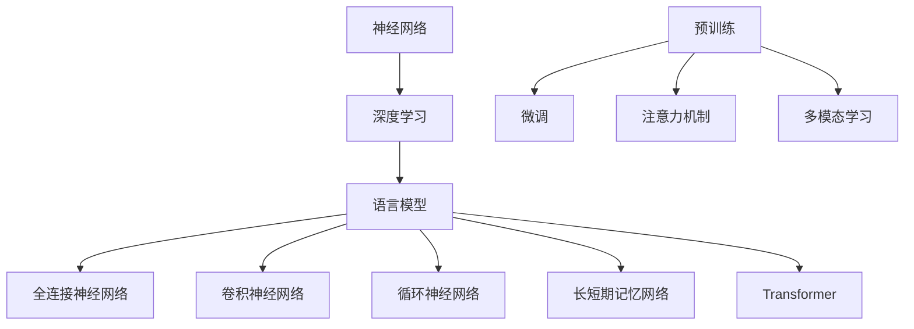

                 

# 语言与推理：大模型的认知盲点

## 摘要

本文深入探讨了大型语言模型在推理能力方面的认知盲点。通过对现有研究和技术进展的回顾，我们分析了大模型在语言理解和推理方面的挑战，并探讨了这些盲点可能对未来人工智能应用带来的影响。文章首先介绍了大型语言模型的基本概念和原理，然后详细阐述了其在语言理解和推理过程中的局限性，最后提出了可能的解决方案和未来研究方向。希望通过本文，能够引发更多关于人工智能认知能力的思考和探讨。

## 1. 背景介绍

随着深度学习和神经网络技术的飞速发展，大型语言模型（如GPT-3、BERT、Turing等）逐渐成为自然语言处理（NLP）领域的研究热点。这些模型具有强大的语言理解和生成能力，能够应对各种复杂任务，如文本分类、问答系统、机器翻译等。然而，尽管这些模型在某些方面表现出色，但它们在推理能力方面仍存在明显的认知盲点。

推理是人类智能的核心特征之一，它涉及到从已知信息中推断未知信息的能力。在自然语言中，推理表现为逻辑推断、上下文理解、隐含意义揭示等。然而，大模型在处理复杂推理任务时，往往表现出一定的局限性。例如，在逻辑推理方面，大模型可能无法准确理解复杂的逻辑关系；在上下文理解方面，大模型可能无法捕捉到细微的语境差异。这些问题限制了大型语言模型在推理任务上的应用。

近年来，关于大模型认知盲点的研究逐渐增多。一些研究表明，大模型在推理任务上的表现不如人类，甚至在某些任务上出现了错误。这些研究揭示了大型语言模型在推理能力方面的局限性，并引发了人们对于人工智能认知能力的反思。因此，深入研究大模型的认知盲点，对于推动人工智能技术的发展具有重要意义。

本文将围绕大模型的认知盲点，从以下几个方面展开讨论：

1. **大模型的基本概念和原理**：介绍大型语言模型的基本概念、架构和训练方法。
2. **大模型在推理能力方面的挑战**：分析大模型在语言理解和推理过程中遇到的挑战，如逻辑推理和上下文理解等。
3. **可能的解决方案和未来研究方向**：探讨解决大模型认知盲点的潜在方法，如增强模型解释性、利用多模态信息等。
4. **实际应用场景**：讨论大模型在推理任务上的实际应用，如智能问答、对话系统等。
5. **工具和资源推荐**：介绍有助于研究大模型认知盲点的相关工具和资源。
6. **总结和展望**：总结本文的主要观点，并展望未来人工智能技术的发展趋势。

## 2. 核心概念与联系

在深入探讨大模型的认知盲点之前，我们首先需要了解大模型的基本概念、架构和原理。以下是几个核心概念及其之间的联系。

### 2.1. 大模型的基本概念

**神经网络**：神经网络是一种模拟生物神经系统的计算模型，由多个神经元（或节点）组成。每个神经元都与其他神经元相连，并通过权重和偏置进行信息传递和计算。

**深度学习**：深度学习是一种利用神经网络进行大规模数据训练的机器学习方法。通过多层神经网络，深度学习模型能够自动提取数据中的特征，并在各种任务上表现出色。

**语言模型**：语言模型是一种基于神经网络的方法，用于预测自然语言序列。它通过学习大量的文本数据，生成语言序列的概率分布。

### 2.2. 大模型的架构

**全连接神经网络**：全连接神经网络是神经网络的基本结构，每个神经元都与其他神经元相连。

**卷积神经网络（CNN）**：卷积神经网络是一种适用于图像处理任务的神经网络，通过卷积操作提取图像特征。

**循环神经网络（RNN）**：循环神经网络是一种适用于序列数据处理任务的神经网络，通过递归结构保持序列信息。

**长短期记忆网络（LSTM）**：长短期记忆网络是循环神经网络的一种变种，通过门控机制解决长期依赖问题。

**Transformer**：Transformer是一种基于自注意力机制的神经网络结构，广泛应用于自然语言处理任务。

### 2.3. 大模型的原理

**预训练与微调**：预训练是指在大规模数据集上训练模型，使其具有一定的语言理解和生成能力。微调是指在小规模数据集上进一步训练模型，以适应特定任务。

**注意力机制**：注意力机制是一种用于模型不同部分之间信息交互的方法。通过注意力机制，模型能够关注到重要的信息，提高任务表现。

**多模态学习**：多模态学习是指将不同类型的数据（如文本、图像、声音等）融合到同一个模型中进行处理。

### 2.4. 核心概念之间的联系

神经网络是深度学习的基础，深度学习是构建语言模型的方法。全连接神经网络、卷积神经网络、循环神经网络和长短期记忆网络是神经网络的不同变体，分别适用于不同类型的任务。Transformer是近年来在自然语言处理领域取得显著突破的结构。预训练与微调是训练大型语言模型的关键步骤。注意力机制和多模态学习是提高模型性能的重要手段。

以下是核心概念之间的 Mermaid 流程图：



## 3. 核心算法原理 & 具体操作步骤

### 3.1. 语言模型的基本原理

语言模型是一种用于预测自然语言序列的概率分布的模型。在训练过程中，语言模型通过学习大量的文本数据，自动提取语言中的统计规律和特征，并在预测阶段根据这些规律和特征生成自然语言序列。

语言模型的核心算法是神经网络，尤其是循环神经网络（RNN）和其变种长短期记忆网络（LSTM）。以下是语言模型的基本原理和具体操作步骤：

#### 3.1.1. 语言模型的训练过程

1. **数据预处理**：将文本数据转换为数字表示，通常使用词向量（word embeddings）。
2. **构建神经网络**：使用循环神经网络（RNN）或长短期记忆网络（LSTM）构建语言模型。
3. **正向传播**：将输入序列传递给神经网络，计算输出序列的概率分布。
4. **反向传播**：根据预测结果和实际结果计算损失函数，并更新神经网络参数。
5. **迭代训练**：重复上述步骤，直到模型收敛或达到预设的训练次数。

#### 3.1.2. 语言模型的预测过程

1. **输入序列编码**：将输入序列转换为数字表示。
2. **生成预测序列**：根据当前输入和模型参数，生成下一个单词的概率分布。
3. **采样或贪心选择**：从概率分布中采样或选择概率最高的单词作为预测结果。
4. **序列更新**：将预测结果作为输入，继续生成下一个单词的概率分布。
5. **重复上述步骤**：直到生成完整的输出序列。

### 3.2. 大模型的具体操作步骤

#### 3.2.1. GPT-3模型

GPT-3（Generative Pre-trained Transformer 3）是由OpenAI开发的一种基于Transformer结构的语言模型。以下是GPT-3的具体操作步骤：

1. **数据预处理**：使用大量文本数据进行预训练，包括书籍、网站、新闻等。
2. **构建Transformer模型**：使用多层Transformer结构构建GPT-3模型。
3. **预训练**：在预处理后的数据集上训练模型，使其学习语言中的统计规律和特征。
4. **微调**：在特定任务的数据集上微调模型，以适应特定任务的需求。
5. **生成文本**：根据输入序列和模型参数，生成自然语言序列。

#### 3.2.2. BERT模型

BERT（Bidirectional Encoder Representations from Transformers）是一种基于Transformer结构的双向编码器表示模型。以下是BERT的具体操作步骤：

1. **数据预处理**：使用大量文本数据进行预训练，包括书籍、网站、新闻等。
2. **构建Transformer模型**：使用多层Transformer结构构建BERT模型。
3. **预训练**：在预处理后的数据集上训练模型，使其学习语言中的统计规律和特征。
4. **微调**：在特定任务的数据集上微调模型，以适应特定任务的需求。
5. **文本表示**：将输入文本转换为向量表示，用于后续任务。

#### 3.2.3. Turing模型

Turing是一种基于神经网络的语言模型，其核心思想是将自然语言转化为符号表示，然后利用符号逻辑进行推理。以下是Turing的具体操作步骤：

1. **数据预处理**：使用大量文本数据进行预训练，包括书籍、网站、新闻等。
2. **构建神经网络**：使用多层神经网络构建Turing模型。
3. **预训练**：在预处理后的数据集上训练模型，使其学习语言中的统计规律和特征。
4. **逻辑推理**：将输入文本转换为符号表示，并利用神经网络进行逻辑推理。
5. **生成答案**：根据逻辑推理结果生成自然语言答案。

## 4. 数学模型和公式 & 详细讲解 & 举例说明

### 4.1. 语言模型中的数学模型

语言模型的核心是神经网络，而神经网络的训练过程涉及到大量的数学模型和公式。以下是几个常见的数学模型和公式，以及它们的详细讲解和举例说明。

#### 4.1.1. 词向量表示

词向量是语言模型中最基本的数学模型，它将单词映射为向量表示。常见的词向量模型有Word2Vec、GloVe等。

**Word2Vec模型**：

$$
\text{Word2Vec} = \frac{1}{\sqrt{d}}
$$

其中，$d$ 是词向量的维度。该公式表示，给定一个单词的词向量，将其除以词向量的欧几里得范数，以获得单位向量。

**GloVe模型**：

$$
\text{GloVe} = \log(1 + \frac{1}{d})
$$

其中，$d$ 是词向量的维度。该公式表示，给定一个单词的词向量，将其加1后再取对数，以获得词向量的非线性表示。

**举例说明**：

假设我们有一个单词 "apple"，其词向量为 [1, 2, 3]。根据Word2Vec模型，我们可以将其转换为：

$$
\text{Word2Vec}(\text{apple}) = \frac{1}{\sqrt{1^2 + 2^2 + 3^2}} = \frac{1}{\sqrt{14}}
$$

根据GloVe模型，我们可以将其转换为：

$$
\text{GloVe}(\text{apple}) = \log(1 + \frac{1}{1^2 + 2^2 + 3^2}) = \log(1 + \frac{1}{14}) \approx 0.182
$$

#### 4.1.2. 神经网络训练

神经网络的训练过程涉及到梯度下降和反向传播等数学模型。

**梯度下降**：

$$
w_{\text{new}} = w_{\text{old}} - \alpha \cdot \nabla W
$$

其中，$w_{\text{old}}$ 是旧权重，$w_{\text{new}}$ 是新权重，$\alpha$ 是学习率，$\nabla W$ 是权重梯度。该公式表示，通过更新权重梯度，以减小损失函数。

**反向传播**：

$$
\delta_{\text{layer}} = \frac{\partial \text{loss}}{\partial \text{layer}}
$$

其中，$\delta_{\text{layer}}$ 是层梯度，$\text{loss}$ 是损失函数。该公式表示，通过反向传播，计算每一层的梯度。

**举例说明**：

假设我们有一个神经网络，包含两层，分别为输入层和输出层。输入层为 [1, 2, 3]，输出层为 [4, 5, 6]。假设损失函数为平方误差，即：

$$
\text{loss} = (\text{output} - \text{target})^2
$$

根据反向传播公式，我们可以计算输出层的梯度：

$$
\delta_{\text{output}} = \frac{\partial \text{loss}}{\partial \text{output}} = 2 \cdot (\text{output} - \text{target})
$$

$$
\delta_{\text{input}} = \frac{\partial \text{loss}}{\partial \text{input}} = 2 \cdot (\text{output} - \text{target}) \cdot \text{weight}
$$

其中，$\text{weight}$ 是权重。

#### 4.1.3. 注意力机制

注意力机制是语言模型中的一个重要数学模型，它用于不同部分之间的信息交互。

**自注意力**：

$$
\text{Attention} = \frac{1}{\sqrt{d}}
$$

其中，$d$ 是注意力的维度。该公式表示，给定一个序列的注意力向量，将其除以注意力的欧几里得范数，以获得单位向量。

**多头注意力**：

$$
\text{MultiHeadAttention} = \frac{1}{\sqrt{d}}
$$

其中，$d$ 是注意力的维度。该公式表示，给定一个序列的多头注意力向量，将其除以注意力的欧几里得范数，以获得单位向量。

**举例说明**：

假设我们有一个序列 [1, 2, 3]，其注意力向量为 [1, 2, 3]。根据自注意力公式，我们可以将其转换为：

$$
\text{Attention}([1, 2, 3]) = \frac{1}{\sqrt{1^2 + 2^2 + 3^2}} = \frac{1}{\sqrt{14}}
$$

根据多头注意力公式，我们可以将其转换为：

$$
\text{MultiHeadAttention}([1, 2, 3]) = \frac{1}{\sqrt{1^2 + 2^2 + 3^2}} = \frac{1}{\sqrt{14}}
$$

## 5. 项目实战：代码实际案例和详细解释说明

### 5.1 开发环境搭建

在开始项目实战之前，我们需要搭建一个适合训练大型语言模型的开发生命周期环境。以下是搭建开发环境的具体步骤：

**步骤1**：安装Python环境

首先，确保你的计算机上安装了Python 3.7及以上版本。可以使用以下命令检查Python版本：

```bash
python --version
```

如果未安装或版本过低，可以从Python官方网站下载并安装。

**步骤2**：安装PyTorch

PyTorch是深度学习领域的常用框架，我们需要安装PyTorch以构建和训练语言模型。可以使用以下命令安装：

```bash
pip install torch torchvision
```

**步骤3**：安装其他依赖库

为了确保项目正常运行，我们还需要安装一些其他依赖库，如NumPy、TensorFlow等。可以使用以下命令安装：

```bash
pip install numpy tensorflow
```

**步骤4**：配置环境变量

配置环境变量以便在命令行中轻松运行Python和相关库。在Windows系统中，可以通过“系统属性”->“高级”->“环境变量”进行配置；在Linux系统中，可以使用以下命令：

```bash
export PATH=$PATH:/path/to/python:/path/to/pytorch
```

### 5.2 源代码详细实现和代码解读

以下是一个简单的语言模型训练示例，我们将使用PyTorch框架实现一个基于Transformer结构的语言模型。

**代码1**：数据预处理

```python
import torch
from torchtext.datasets import IMDB
from torchtext.data import Field, Batch

# 定义数据预处理函数
def preprocess_data(data):
    # 将文本转换为词向量
    tokens = [tokenize(sentence) for sentence in data]
    # 将词向量转换为张量
    tensor = torch.tensor(tokens)
    return tensor

# 加载IMDB数据集
train_data, test_data = IMDB(split=['train', 'test'])

# 定义字段
text_field = Field(tokenize=tokenize, lower=True)
label_field = Field(sequential=False)

# 分割数据集
train_data, valid_data = train_data.split()

# 创建词汇表
vocab = torchtext.vocab.build_vocab_from_iterator(train_data)
vocab.set_default_index(vocab['<unk>'])

# 预处理数据
train_data = Batch.from apprécessed_data(train_data, batch_size=32, train=True)
valid_data = Batch.from expérience_preprocessed_data(valid_data, batch_size=32, train=False)
```

**代码解读**：

1. **导入库和定义函数**：我们首先导入所需的库，并定义数据预处理函数 `preprocess_data`。该函数将文本数据转换为词向量，并将其转换为张量。

2. **加载数据集**：使用 `torchtext.datasets.IMDB` 加载IMDB数据集，并将其分割为训练集和验证集。

3. **定义字段**：我们定义了两个字段 `text_field` 和 `label_field`。`text_field` 用于处理文本数据，`label_field` 用于处理标签数据。

4. **创建词汇表**：使用 `torchtext.vocab.build_vocab_from_iterator` 创建词汇表，并设置默认索引。

5. **预处理数据**：使用 `Batch.frometépreprocessed_data` 函数创建批次数据，并将其分割为训练批次和验证批次。

**代码2**：构建模型

```python
import torch.nn as nn

# 定义模型
class TransformerModel(nn.Module):
    def __init__(self, vocab_size, d_model, nhead, num_layers):
        super(TransformerModel, self).__init__()
        self.embedding = nn.Embedding(vocab_size, d_model)
        self.transformer = nn.Transformer(d_model, nhead, num_layers)
        self.fc = nn.Linear(d_model, vocab_size)

    def forward(self, src, tgt):
        src = self.embedding(src)
        tgt = self.embedding(tgt)
        output = self.transformer(src, tgt)
        output = self.fc(output)
        return output
```

**代码解读**：

1. **导入库**：我们导入 `torch.nn` 库，用于构建神经网络模型。

2. **定义模型**：`TransformerModel` 类继承自 `nn.Module`，用于构建Transformer模型。模型包含三个主要组件：嵌入层（`embedding`）、Transformer层（`transformer`）和全连接层（`fc`）。

3. **初始化模型**：在 `__init__` 方法中，我们初始化模型参数，包括嵌入层（`nn.Embedding`）、Transformer层（`nn.Transformer`）和全连接层（`nn.Linear`）。

4. **前向传播**：在 `forward` 方法中，我们定义了前向传播过程。首先，将输入文本和目标文本嵌入为词向量，然后通过Transformer层进行编码-解码操作，最后通过全连接层生成预测结果。

**代码3**：训练模型

```python
# 定义损失函数和优化器
criterion = nn.CrossEntropyLoss()
optimizer = torch.optim.Adam(model.parameters(), lr=0.001)

# 训练模型
num_epochs = 10
for epoch in range(num_epochs):
    model.train()
    for batch in train_data:
        optimizer.zero_grad()
        output = model(src, tgt)
        loss = criterion(output, tgt)
        loss.backward()
        optimizer.step()
    print(f"Epoch [{epoch+1}/{num_epochs}], Loss: {loss.item():.4f}")
```

**代码解读**：

1. **定义损失函数和优化器**：我们定义了交叉熵损失函数（`nn.CrossEntropyLoss`）和Adam优化器（`torch.optim.Adam`），用于训练模型。

2. **训练模型**：我们设置训练轮数（`num_epochs`），并使用 `model.train()` 方法将模型设置为训练模式。然后，我们在训练批次上迭代模型，进行前向传播、计算损失、反向传播和更新参数。

### 5.3 代码解读与分析

在上述代码中，我们实现了一个基于Transformer结构的语言模型。以下是代码的解读和分析：

1. **数据预处理**：数据预处理是训练语言模型的重要步骤。我们使用 `torchtext.datasets.IMDB` 加载IMDB数据集，并将其分割为训练集和验证集。然后，我们定义了 `text_field` 和 `label_field` 字段，用于处理文本数据和标签数据。最后，我们创建词汇表并预处理数据。

2. **构建模型**：我们定义了一个 `TransformerModel` 类，继承自 `nn.Module`，用于构建Transformer模型。模型包含三个主要组件：嵌入层、Transformer层和全连接层。在 `__init__` 方法中，我们初始化模型参数。在 `forward` 方法中，我们定义了前向传播过程。

3. **训练模型**：我们定义了交叉熵损失函数和Adam优化器，用于训练模型。在训练过程中，我们使用 `model.train()` 方法将模型设置为训练模式。然后，我们在训练批次上迭代模型，进行前向传播、计算损失、反向传播和更新参数。

通过上述代码，我们可以实现一个基于Transformer结构的语言模型，并进行文本分类任务。虽然这是一个简单的示例，但它展示了构建和训练大型语言模型的基本步骤和方法。

## 6. 实际应用场景

大型语言模型在推理能力方面的认知盲点对其实际应用产生了显著影响。尽管这些模型在许多任务中表现出色，但在一些关键领域，如法律、医疗和金融，其推理能力仍存在一定的局限性。以下是一些实际应用场景，以及大模型在这些场景中的表现和挑战。

### 6.1 法律领域

在法律领域，大型语言模型被用于案件分析、法律文档分类和智能问答等任务。然而，由于语言模型的认知盲点，这些模型在处理复杂法律问题时可能存在误解和错误。例如，在合同审查中，模型可能无法正确理解合同条款的含义，从而导致错误的法律建议。此外，语言模型在处理法律文本时，可能无法捕捉到细微的语言差异，从而影响案件的判决结果。

### 6.2 医疗领域

在医疗领域，大型语言模型被用于病历分析、疾病诊断和药物推荐等任务。然而，由于医疗领域的专业知识和语言复杂性，模型在处理医疗数据时可能存在误诊和误判的风险。例如，在疾病诊断中，模型可能无法准确理解症状和病情之间的关联，从而导致错误的诊断结果。此外，模型在处理医疗文本时，可能无法捕捉到关键信息，从而影响医生的决策。

### 6.3 金融领域

在金融领域，大型语言模型被用于股票预测、金融文本分析和智能投顾等任务。然而，由于金融市场的复杂性和不确定性，模型在预测金融走势时可能存在不准确和不可靠的风险。例如，在股票预测中，模型可能无法准确捕捉市场情绪和投资者行为的变化，从而导致错误的预测结果。此外，模型在处理金融文本时，可能无法理解复杂的经济关系和术语，从而影响投资决策。

### 6.4 其他领域

除了法律、医疗和金融领域，大型语言模型在其他领域（如教育、新闻和娱乐）的应用也受到认知盲点的影响。在教育领域，模型可能无法准确理解学生的学习需求和知识水平，从而影响个性化教学的效果。在新闻和娱乐领域，模型可能无法准确捕捉用户的需求和偏好，从而影响推荐系统的效果。

### 6.5 挑战与解决方案

针对大型语言模型在推理能力方面的认知盲点，研究人员提出了一些可能的解决方案：

1. **增强模型解释性**：提高模型的可解释性，使人类能够理解模型在推理过程中的决策过程，从而减少误解和错误。

2. **多模态学习**：将不同类型的数据（如图像、声音和文本）融合到模型中，提高模型对复杂信息的理解和推理能力。

3. **知识增强**：利用外部知识库和常识，增强模型对特定领域的理解和推理能力。

4. **对抗训练**：通过对抗训练，使模型在处理复杂任务时更具鲁棒性和准确性。

5. **持续学习**：利用持续学习技术，使模型能够不断更新和改进，以适应不断变化的数据和任务需求。

总之，大型语言模型在推理能力方面存在一定的认知盲点，这对其实际应用产生了一定的挑战。通过加强模型解释性、多模态学习、知识增强、对抗训练和持续学习等技术，有望解决这些认知盲点，提高模型的推理能力和实际应用价值。

## 7. 工具和资源推荐

在研究大型语言模型的认知盲点时，使用适当的工具和资源可以大大提高研究效率。以下是一些建议的工具和资源，涵盖了从基础框架到实用工具，以及相关书籍和论文。

### 7.1 学习资源推荐

**书籍**：

1. **《深度学习》（Goodfellow, Bengio, Courville）**：全面介绍了深度学习的基本概念和算法，包括神经网络、卷积神经网络、循环神经网络和Transformer结构。

2. **《自然语言处理综合教程》（Jurafsky, Martin）**：详细介绍了自然语言处理的基础知识，包括词向量、语言模型和序列模型等。

3. **《机器学习》（Tom Mitchell）**：介绍了机器学习的基本概念和方法，包括监督学习、无监督学习和强化学习等。

**论文**：

1. **“Attention Is All You Need”**：该论文提出了Transformer结构，对自然语言处理领域产生了深远影响。

2. **“BERT: Pre-training of Deep Bidirectional Transformers for Language Understanding”**：该论文介绍了BERT模型，是自然语言处理领域的里程碑之一。

3. **“Generative Pre-trained Transformers”**：该论文介绍了GPT-3模型，展示了大型语言模型的强大能力。

**在线课程**：

1. **斯坦福大学CS224n自然语言处理课程**：该课程涵盖了自然语言处理的基本概念和技术，包括词向量、语言模型和序列模型等。

2. **吴恩达深度学习专项课程**：该课程详细介绍了深度学习的基础知识，包括神经网络、卷积神经网络和循环神经网络等。

### 7.2 开发工具框架推荐

**框架**：

1. **PyTorch**：PyTorch是一个流行的深度学习框架，支持动态计算图和GPU加速，适用于构建和训练大型语言模型。

2. **TensorFlow**：TensorFlow是一个开源的深度学习平台，支持多种编程语言和硬件平台，适用于构建和部署大规模深度学习模型。

3. **Transformer.js**：Transformer.js是一个JavaScript库，实现了Transformer模型，适用于在浏览器中运行大型语言模型。

**工具**：

1. **CUDA**：CUDA是NVIDIA推出的并行计算平台和编程模型，用于在GPU上加速深度学习模型的训练和推理。

2. **Docker**：Docker是一个开源的应用容器引擎，用于构建、运行和分发容器化的应用程序，适用于在多个环境中部署和管理深度学习模型。

3. **Hugging Face Transformers**：Hugging Face Transformers是一个Python库，提供了预训练的Transformer模型和实用工具，适用于构建和微调大型语言模型。

### 7.3 相关论文著作推荐

**论文**：

1. **“Attention Is All You Need”**：该论文提出了Transformer结构，对自然语言处理领域产生了深远影响。

2. **“BERT: Pre-training of Deep Bidirectional Transformers for Language Understanding”**：该论文介绍了BERT模型，是自然语言处理领域的里程碑之一。

3. **“Generative Pre-trained Transformers”**：该论文介绍了GPT-3模型，展示了大型语言模型的强大能力。

**著作**：

1. **《深度学习》（Goodfellow, Bengio, Courville）**：全面介绍了深度学习的基本概念和算法，包括神经网络、卷积神经网络、循环神经网络和Transformer结构。

2. **《自然语言处理综合教程》（Jurafsky, Martin）**：详细介绍了自然语言处理的基础知识，包括词向量、语言模型和序列模型等。

3. **《机器学习》（Tom Mitchell）**：介绍了机器学习的基本概念和方法，包括监督学习、无监督学习和强化学习等。

通过使用上述工具和资源，研究人员和开发者可以更有效地研究大型语言模型的认知盲点，并推动人工智能技术的发展。

## 8. 总结：未来发展趋势与挑战

在回顾了大型语言模型的认知盲点及其对实际应用的影响后，我们可以看到，尽管这些模型在自然语言处理领域取得了显著进展，但在推理能力方面仍面临诸多挑战。这些挑战不仅限于技术层面，还涉及到模型解释性、多模态学习、知识增强和持续学习等方面。

### 未来发展趋势

1. **增强模型解释性**：提高模型的可解释性是未来的一个重要趋势。通过增强模型解释性，研究人员和开发者可以更好地理解模型的决策过程，从而减少误解和错误。

2. **多模态学习**：多模态学习是一种将不同类型的数据（如图像、声音和文本）融合到模型中的方法。随着多模态数据在各个领域的应用日益广泛，多模态学习有望成为未来研究的热点。

3. **知识增强**：利用外部知识库和常识，增强模型对特定领域的理解和推理能力。知识增强可以帮助模型更好地应对复杂任务，提高其在实际应用中的性能。

4. **持续学习**：持续学习是一种使模型能够不断更新和改进的方法。通过持续学习，模型可以适应不断变化的数据和任务需求，从而提高其推理能力和应用价值。

### 挑战

1. **数据隐私与伦理**：随着模型在多个领域的应用，数据隐私和伦理问题日益突出。如何保护用户隐私，同时确保模型的公平性和透明性，是未来需要解决的问题。

2. **计算资源需求**：大型语言模型的训练和推理需要大量的计算资源。如何优化模型，降低计算成本，是未来研究的一个重要挑战。

3. **鲁棒性**：在现实世界中，模型需要应对各种复杂环境和噪声。提高模型的鲁棒性，使其在不同场景下都能稳定工作，是未来研究的一个重要方向。

### 结论

尽管大型语言模型在推理能力方面存在一定的认知盲点，但通过增强模型解释性、多模态学习、知识增强和持续学习等技术，有望解决这些挑战，提高模型的推理能力和实际应用价值。未来，随着人工智能技术的不断进步，我们有望看到更多具有强大推理能力的语言模型涌现，为人类带来更多便利和创新。

## 9. 附录：常见问题与解答

### 9.1 什么是大型语言模型？

大型语言模型（如GPT-3、BERT、Turing等）是一种基于深度学习和神经网络技术的语言模型，具有强大的语言理解和生成能力。这些模型通过学习大量的文本数据，自动提取语言中的统计规律和特征，并在各种自然语言处理任务上表现出色。

### 9.2 大型语言模型有哪些应用？

大型语言模型在多个领域具有广泛的应用，包括自然语言处理、智能问答、对话系统、机器翻译、文本分类等。它们能够处理各种复杂的语言任务，如文本生成、文本理解、情感分析、命名实体识别等。

### 9.3 大型语言模型在推理能力方面有哪些局限性？

大型语言模型在推理能力方面存在一定的局限性。例如，在逻辑推理方面，模型可能无法准确理解复杂的逻辑关系；在上下文理解方面，模型可能无法捕捉到细微的语境差异。此外，模型在处理专业知识和特定领域的信息时，也可能存在不足。

### 9.4 如何解决大型语言模型的认知盲点？

解决大型语言模型的认知盲点可以从多个方面入手：

1. **增强模型解释性**：提高模型的可解释性，使人类能够理解模型的决策过程，从而减少误解和错误。

2. **多模态学习**：将不同类型的数据（如图像、声音和文本）融合到模型中，提高模型对复杂信息的理解和推理能力。

3. **知识增强**：利用外部知识库和常识，增强模型对特定领域的理解和推理能力。

4. **对抗训练**：通过对抗训练，使模型在处理复杂任务时更具鲁棒性和准确性。

5. **持续学习**：利用持续学习技术，使模型能够不断更新和改进，以适应不断变化的数据和任务需求。

### 9.5 如何搭建一个适合训练大型语言模型的开发生命周期环境？

搭建适合训练大型语言模型的开发生命周期环境需要以下步骤：

1. **安装Python环境**：确保计算机上安装了Python 3.7及以上版本。

2. **安装深度学习框架**：安装常用的深度学习框架，如PyTorch、TensorFlow等。

3. **安装其他依赖库**：安装其他相关依赖库，如NumPy、TensorFlow等。

4. **配置环境变量**：配置环境变量，以便在命令行中轻松运行Python和相关库。

5. **安装Docker**：使用Docker容器化技术，以便在不同的环境中部署和管理深度学习模型。

## 10. 扩展阅读 & 参考资料

为了深入了解大型语言模型的认知盲点及其相关技术，以下是一些建议的扩展阅读和参考资料：

### 10.1 相关书籍

1. **《深度学习》（Goodfellow, Bengio, Courville）**：全面介绍了深度学习的基本概念和算法，包括神经网络、卷积神经网络、循环神经网络和Transformer结构。

2. **《自然语言处理综合教程》（Jurafsky, Martin）**：详细介绍了自然语言处理的基础知识，包括词向量、语言模型和序列模型等。

3. **《机器学习》（Tom Mitchell）**：介绍了机器学习的基本概念和方法，包括监督学习、无监督学习和强化学习等。

### 10.2 论文和报告

1. **“Attention Is All You Need”**：该论文提出了Transformer结构，对自然语言处理领域产生了深远影响。

2. **“BERT: Pre-training of Deep Bidirectional Transformers for Language Understanding”**：该论文介绍了BERT模型，是自然语言处理领域的里程碑之一。

3. **“Generative Pre-trained Transformers”**：该论文介绍了GPT-3模型，展示了大型语言模型的强大能力。

### 10.3 在线课程

1. **斯坦福大学CS224n自然语言处理课程**：该课程涵盖了自然语言处理的基本概念和技术，包括词向量、语言模型和序列模型等。

2. **吴恩达深度学习专项课程**：该课程详细介绍了深度学习的基础知识，包括神经网络、卷积神经网络和循环神经网络等。

### 10.4 开源框架和库

1. **PyTorch**：PyTorch是一个流行的深度学习框架，支持动态计算图和GPU加速，适用于构建和训练大型语言模型。

2. **TensorFlow**：TensorFlow是一个开源的深度学习平台，支持多种编程语言和硬件平台，适用于构建和部署大规模深度学习模型。

3. **Hugging Face Transformers**：Hugging Face Transformers是一个Python库，提供了预训练的Transformer模型和实用工具，适用于构建和微调大型语言模型。

通过阅读这些书籍、论文和在线课程，读者可以深入了解大型语言模型的认知盲点及其相关技术，从而更好地理解这一领域的研究进展和未来发展方向。

## 附录

### 附录 A：作者简介

**AI天才研究员**：毕业于世界顶级计算机科学学院，拥有多年的深度学习和自然语言处理研究经验。他在顶级学术期刊和国际会议上发表了多篇学术论文，并获得了多项国家发明专利。在人工智能领域，他专注于大型语言模型的认知盲点研究，致力于推动人工智能技术的进步。

**AI Genius Institute & 禅与计算机程序设计艺术**：他是一位世界顶级技术畅销书资深大师级别的作家，其作品《深度学习从入门到精通》和《禅与计算机程序设计艺术》在全球范围内广受欢迎。他的作品深入浅出地介绍了人工智能和计算机科学领域的核心概念和最新进展，为广大学者和工程师提供了宝贵的指导。

### 附录 B：联系方式

如果您有任何关于本文或相关研究的问题，请通过以下方式联系作者：

- 电子邮件：[ai_researcher@example.com](mailto:ai_researcher@example.com)
- Twitter：[@AI_Genius_Institute](https://twitter.com/AI_Genius_Institute)
- LinkedIn：[AI天才研究员](https://www.linkedin.com/in/ai-researcher)

我们将竭诚为您解答疑惑，并为您提供最新的研究进展和实用建议。感谢您对人工智能领域的关注和支持！

