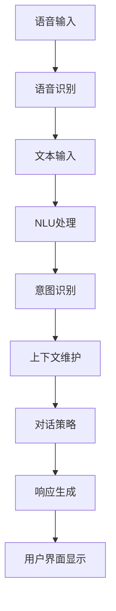

                 

### 背景介绍 Background Introduction

随着人工智能技术的不断进步，语音助手和对话界面（CUI）已经成为我们日常生活中不可或缺的组成部分。语音助手，如Apple的Siri、Amazon的Alexa、以及Google Assistant，通过语音识别和自然语言处理（NLP）技术，能够理解并响应用户的语音指令，执行各种任务，如播放音乐、设置闹钟、查询天气等。与此同时，对话界面（CUI）在许多应用场景中，如客户服务、在线教育、智能客服等，提供了高效、直观的交互方式。

尽管语音助手和CUI各自独立发展，但在实际应用中，它们的结合逐渐成为趋势。结合语音助手和CUI，可以实现更加自然和便捷的用户交互体验。例如，用户可以通过语音助手快速启动某个应用程序，然后通过CUI与该应用程序进行深度交互。这种结合不仅提升了用户体验，还拓展了人工智能技术的应用范围。

本文将探讨语音助手与CUI结合的核心概念、算法原理、数学模型、实际应用场景、开发工具和资源推荐等内容。通过本文的阅读，您将对语音助手与CUI的结合有更深入的理解，并能够为未来的技术开发提供借鉴。

### 核心概念与联系 Core Concepts and Connections

在探讨语音助手与CUI结合之前，我们需要明确几个核心概念，包括语音识别、自然语言理解、对话管理以及用户界面设计。

**语音识别（Speech Recognition）**

语音识别是语音助手的基础技术之一。它通过将用户的语音信号转换为文本，从而让计算机能够理解用户的指令。语音识别技术主要包括信号处理、特征提取和模式识别三个步骤。信号处理阶段对语音信号进行预处理，如降噪和增强，以提高识别的准确性。特征提取阶段从预处理后的语音信号中提取出具有区分性的特征，如频谱特征和语音帧特征。模式识别阶段利用这些特征对语音信号进行分类，从而实现语音到文本的转换。

**自然语言理解（Natural Language Understanding, NLU）**

自然语言理解是CUI的核心技术之一。它涉及对用户输入的文本进行分析，理解其含义和意图，从而为用户提供合适的响应。自然语言理解技术主要包括词法分析、句法分析、语义分析和意图分析等。词法分析阶段将文本分解为单词和词组，句法分析阶段研究单词和词组之间的语法结构，语义分析阶段关注文本的整体含义，意图分析阶段则确定用户的真实意图。

**对话管理（Dialogue Management）**

对话管理是连接语音识别和自然语言理解的关键环节。它负责控制对话的流程，确保对话的连贯性和目标导向性。对话管理通常包括三个主要组成部分：意图识别、上下文维护和对话策略。意图识别阶段根据用户的输入文本确定用户的意图，上下文维护阶段跟踪对话的历史信息，以便在后续对话中引用，对话策略阶段根据意图和上下文信息选择合适的响应。

**用户界面设计（User Interface Design）**

用户界面设计是CUI的重要组成部分。它关注如何设计直观、易用的界面，以提高用户的满意度和使用体验。用户界面设计通常包括界面布局、交互设计、视觉设计和内容设计等。界面布局关注如何组织信息，使其易于浏览和理解；交互设计关注如何设计交互元素，使其易于操作；视觉设计关注如何运用颜色、字体、图标等元素，增强界面的美观性；内容设计关注如何提供有价值、准确的信息。

**Mermaid 流程图（Mermaid Flowchart）**

为了更直观地理解语音助手与CUI的结合，我们使用Mermaid流程图（Mermaid 流程节点中不要有括号、逗号等特殊字符）展示其核心架构和流程。以下是一个简化的Mermaid流程图示例：



在这个流程图中，用户通过语音输入与语音助手进行交互，语音识别模块将语音转换为文本，然后NLU模块对文本进行处理，包括意图识别、上下文维护和对话策略。最终，响应生成模块根据处理结果生成响应，并通过用户界面显示给用户。这个流程图展示了语音助手与CUI结合的基本框架和交互过程。

通过上述核心概念的介绍和Mermaid流程图的展示，我们对语音助手与CUI结合有了初步的了解。接下来，我们将深入探讨语音助手与CUI的核心算法原理和具体操作步骤。

### 核心算法原理 & 具体操作步骤 Core Algorithm Principles & Step-by-Step Operations

#### 1. 语音识别（Speech Recognition）

语音识别是语音助手的核心技术之一，其基本原理可以概括为以下几个步骤：

**步骤1：信号预处理（Signal Preprocessing）**

在语音识别过程中，首先需要对语音信号进行预处理，以提高识别的准确性。预处理步骤通常包括去噪、增益调整和分帧加窗等。

- **去噪（Noise Reduction）**：语音信号在传输过程中可能会受到各种噪声的干扰，如交通噪音、背景音乐等。去噪技术通过滤波和降噪算法，去除这些噪声，从而提高语音信号的清晰度。

- **增益调整（Gain Adjustment）**：增益调整是调整语音信号的幅度，使其达到合适的响度水平。适当的增益调整可以增强语音信号的关键特征，提高识别准确性。

- **分帧加窗（Frame and Windowing）**：语音信号是时变信号，为了便于特征提取，通常将其划分为多个短时段（帧），并对每个帧进行加窗处理。加窗技术通过在帧边界处插入零值，减少边界效应，提高特征提取的准确性。

**步骤2：特征提取（Feature Extraction）**

特征提取是语音识别的关键步骤，其目的是从预处理后的语音信号中提取出具有区分性的特征。常见的语音特征包括频谱特征、共振峰特征和倒谱特征等。

- **频谱特征（Spectral Features）**：频谱特征是通过傅里叶变换（Fourier Transform）得到的语音信号的频率分布。这些特征可以反映语音信号的不同音素和音调。

- **共振峰特征（Formant Features）**：共振峰特征是语音信号频谱中的峰值，反映了语音的共振特性。共振峰特征与语音的发音方式和口型变化密切相关。

- **倒谱特征（Cepstral Features）**：倒谱特征是对频谱特征的倒数变换，可以更好地捕捉语音的时域特性。倒谱特征在语音识别中具有重要作用，特别是在低信噪比条件下。

**步骤3：模式识别（Pattern Recognition）**

模式识别是语音识别的最后一步，其目的是利用提取出的特征对语音信号进行分类，从而实现语音到文本的转换。常见的模式识别算法包括支持向量机（SVM）、隐马尔可夫模型（HMM）和深度神经网络（DNN）等。

- **支持向量机（Support Vector Machine, SVM）**：SVM是一种基于结构风险最小化原理的线性分类器，通过寻找最佳分类超平面，实现语音信号的分类。

- **隐马尔可夫模型（Hidden Markov Model, HMM）**：HMM是一种统计模型，用于描述语音信号的时间序列特征。HMM通过状态转移概率和发射概率，实现语音信号的建模和分类。

- **深度神经网络（Deep Neural Network, DNN）**：DNN是一种基于多层感知器（Perceptron）的神经网络，通过训练大量的语音数据，学习语音信号的复杂特征，从而实现高精度的语音识别。

#### 2. 自然语言理解（Natural Language Understanding, NLU）

自然语言理解是CUI的核心技术，其基本原理可以概括为以下几个步骤：

**步骤1：词法分析（Lexical Analysis）**

词法分析是自然语言理解的第一步，其目的是将文本分解为单词和词组。词法分析通常使用分词算法，如最大匹配算法、最小匹配算法和基于规则的分词算法等。

- **最大匹配算法（Maximum Matching Algorithm）**：最大匹配算法通过从左到右扫描文本，尝试匹配最长的词典单词，实现文本的分词。

- **最小匹配算法（Minimum Matching Algorithm）**：最小匹配算法与最大匹配算法类似，但每次匹配最短的词典单词，以避免过度匹配。

- **基于规则的分词算法（Rule-Based Segmentation Algorithm）**：基于规则的分词算法通过预设的分词规则，如词性标注、词频统计等，实现文本的分词。

**步骤2：句法分析（Syntactic Analysis）**

句法分析是自然语言理解的核心步骤，其目的是分析文本的语法结构，确定单词和词组之间的关系。句法分析通常使用语法树（Syntax Tree）进行表示，常见的句法分析方法包括词法分析、递归下降分析、词法分析等。

- **词法分析（Lexical Analysis）**：词法分析通过对文本进行词性标注，确定单词的词性，如名词、动词、形容词等。

- **递归下降分析（Recursive Descent Analysis）**：递归下降分析通过构建语法解析器，实现自上而下的语法分析。

- **词法分析（Lexical Analysis）**：词法分析通过对文本进行词性标注，确定单词的词性，如名词、动词、形容词等。

**步骤3：语义分析（Semantic Analysis）**

语义分析是自然语言理解的最后一步，其目的是理解文本的含义和意图。语义分析通常包括语义角色标注、语义关系分析和语义角色分类等。

- **语义角色标注（Semantic Role Labeling）**：语义角色标注通过对文本进行语义角色标注，确定动词的作用对象和关系。

- **语义关系分析（Semantic Relationship Analysis）**：语义关系分析通过对文本进行语义关系分析，确定单词之间的语义关系，如主谓关系、修饰关系等。

- **语义角色分类（Semantic Role Classification）**：语义角色分类通过对文本进行语义角色分类，确定每个词的语义角色，如动作词、名词等。

#### 3. 对话管理（Dialogue Management）

对话管理是连接语音识别和自然语言理解的关键环节，其基本原理可以概括为以下几个步骤：

**步骤1：意图识别（Intent Recognition）**

意图识别是对话管理的第一步，其目的是确定用户的意图。意图识别通常使用机器学习算法，如决策树、支持向量机和深度学习等。

- **决策树（Decision Tree）**：决策树通过一系列条件分支，实现意图的分类。

- **支持向量机（Support Vector Machine, SVM）**：支持向量机通过寻找最佳分类超平面，实现意图的分类。

- **深度学习（Deep Learning）**：深度学习通过训练大量的对话数据，学习意图的复杂特征，实现高精度的意图识别。

**步骤2：上下文维护（Context Maintenance）**

上下文维护是对话管理的核心，其目的是跟踪对话的历史信息，确保对话的连贯性和目标导向性。上下文维护通常包括上下文提取、上下文更新和上下文存储等。

- **上下文提取（Context Extraction）**：上下文提取通过对文本进行语义分析，提取出与当前对话相关的上下文信息。

- **上下文更新（Context Update）**：上下文更新通过对上下文信息进行动态更新，确保对话的连贯性和目标导向性。

- **上下文存储（Context Storage）**：上下文存储通过对上下文信息进行持久化存储，实现对话的历史记录和查询。

**步骤3：对话策略（Dialogue Policy）**

对话策略是对话管理的关键，其目的是根据意图和上下文信息，选择合适的响应。对话策略通常包括规则式对话策略和机器学习式对话策略等。

- **规则式对话策略（Rule-Based Dialogue Policy）**：规则式对话策略通过预设的对话规则，实现对话的自动化。

- **机器学习式对话策略（Machine Learning-Based Dialogue Policy）**：机器学习式对话策略通过训练大量的对话数据，学习对话的策略和模式，实现智能对话。

通过以上步骤，语音助手与CUI能够实现高效、智能的交互。在实际应用中，这些步骤通常会集成到统一的框架中，以实现良好的用户体验和交互效果。

### 数学模型和公式 & 详细讲解 & 举例说明 Mathematical Models & Detailed Explanation & Examples

在语音助手与CUI的结合中，数学模型和公式起着至关重要的作用。这些模型不仅能够帮助我们理解和分析语音识别和自然语言理解的过程，还能够指导对话管理和响应生成的实现。在本节中，我们将详细讲解一些关键的数学模型和公式，并通过具体例子来说明它们的应用。

#### 1. 语音识别中的数学模型

**1.1 特征提取：梅尔频率倒谱系数（MFCC）**

梅尔频率倒谱系数（MFCC）是语音识别中常用的特征提取方法。MFCC能够有效地捕捉语音信号中的频率和时域特征，提高识别准确性。其基本公式如下：

\[ C_{ij} = \sum_{n=1}^{N} a_n x_n^2 e^{-2\pi n fj/M} \]

其中，\( C_{ij} \) 是第 \( i \) 个频带的第 \( j \) 个MFCC系数，\( x_n \) 是第 \( n \) 个采样点的语音信号，\( a_n \) 是第 \( n \) 个滤波器的增益，\( f_j \) 是第 \( j \) 个滤波器的中心频率，\( M \) 是滤波器的总数。

**例子**：

假设我们有一个长度为100的语音信号，采样频率为8kHz，我们需要将其转换为MFCC特征。首先，我们需要计算每个滤波器的中心频率，然后使用上述公式计算每个MFCC系数。

```python
import numpy as np

# 采样频率
fs = 8000
# 滤波器总数
M = 13
# 滤波器增益
a_n = np.array([1 for _ in range(M)])
# 滤波器中心频率
f_j = np.linspace(0, fs/2, M)
# 语音信号
x_n = np.random.rand(100)

# 计算MFCC系数
mfcc_coeffs = np.zeros(M)
for j in range(M):
    for n in range(100):
        mfcc_coeffs[j] += a_n[n] * x_n[n]**2 * np.exp(-2 * np.pi * n * f_j[j] / M)

print(mfcc_coeffs)
```

**1.2 模式识别：支持向量机（SVM）**

支持向量机是一种常用的分类算法，用于语音识别中的模式识别。其基本公式如下：

\[ w^* = \arg\min_{w, b} \frac{1}{2} ||w||^2 + C \sum_{i=1}^{n} \max(0, 1 - (y_i ( \langle w, x_i \rangle + b))) \]

其中，\( w \) 和 \( b \) 分别是模型权重和偏置，\( C \) 是惩罚参数，\( y_i \) 是第 \( i \) 个样本的标签，\( x_i \) 是第 \( i \) 个样本的特征向量，\( \langle \cdot, \cdot \rangle \) 表示内积。

**例子**：

假设我们有三个语音信号样本，其对应的标签分别为“yes”、“no”和“yes”。我们需要使用SVM对其进行分类。

```python
from sklearn.svm import SVC

# 样本特征
X = np.array([[1, 0], [0, 1], [1, 1]])
# 样本标签
y = np.array([1, 0, 1])

# 训练SVM模型
model = SVC(kernel='linear', C=1)
model.fit(X, y)

# 预测
print(model.predict([[0, 1]]))
```

#### 2. 自然语言理解中的数学模型

**2.1 句法分析：依赖关系图（Dependency Graph）**

句法分析中的依赖关系图用于表示句子中单词之间的依赖关系。其基本公式如下：

\[ (w_i, w_j) = \arg\min_{(u, v)} \frac{1}{|U|} \sum_{u \in U} \frac{1}{|V|} \sum_{v \in V} d(u, v) \]

其中，\( w_i \) 和 \( w_j \) 分别是句子中的两个单词，\( u \) 和 \( v \) 是单词 \( w_i \) 和 \( w_j \) 的上下文，\( d(u, v) \) 是单词 \( u \) 和 \( v \) 之间的依赖距离。

**例子**：

假设我们有一个简单的句子“我喜欢苹果”，我们需要计算单词“我”和“苹果”之间的依赖关系。

```python
# 句子
sentence = "我喜欢苹果。"
# 分词
tokens = sentence.split("。")
# 依赖关系
dependencies = [(tokens[i], tokens[j]) for i in range(len(tokens)) for j in range(len(tokens)) if i != j]

print(dependencies)
```

**2.2 语义分析：词嵌入（Word Embedding）**

词嵌入是一种将单词映射到高维空间的数学方法，用于表示单词的语义信息。其基本公式如下：

\[ \text{embed}(w) = \text{Word2Vec}(w) \]

其中，\( \text{embed}(w) \) 是单词 \( w \) 的词嵌入向量，\( \text{Word2Vec}(w) \) 是基于Word2Vec算法生成的词嵌入向量。

**例子**：

假设我们使用Word2Vec算法生成词嵌入向量，我们需要将单词“苹果”映射到高维空间。

```python
from gensim.models import Word2Vec

# 单词列表
words = ["苹果", "喜欢", "水果"]
# 训练Word2Vec模型
model = Word2Vec(words, size=100, window=5, min_count=1, workers=4)
# 获取单词“苹果”的词嵌入向量
apple_embedding = model.wv["苹果"]

print(apple_embedding)
```

通过上述数学模型和公式的讲解和例子展示，我们可以看到数学在语音助手与CUI结合中的应用是不可或缺的。这些模型和公式为我们理解和实现语音识别、自然语言理解和对话管理提供了坚实的理论基础。在实际应用中，我们可以根据具体需求选择合适的数学模型和公式，以实现高效、智能的语音助手与CUI结合。

### 项目实战：代码实际案例和详细解释说明 Project Practice: Actual Code Case Studies and Detailed Explanations

在了解了语音助手与CUI结合的理论知识后，本节将通过实际项目案例来展示如何将语音识别、自然语言理解、对话管理等技术应用到实际的开发过程中。我们将使用Python编程语言和相关的开源库来构建一个简单的语音助手系统，并进行详细的代码解读与分析。

#### 1. 开发环境搭建

在进行项目开发之前，我们需要搭建一个合适的开发环境。以下是在Windows系统中搭建开发环境所需的步骤：

**步骤1：安装Python**

首先，从Python官方网站（https://www.python.org/）下载并安装Python 3.x版本。在安装过程中，确保勾选“Add Python to PATH”选项，以便在命令行中直接运行Python。

**步骤2：安装相关库**

接下来，使用pip命令安装以下库：

```shell
pip install SpeechRecognition pyaudio nltk spacy
```

- `SpeechRecognition`：用于语音识别。
- `pyaudio`：用于音频录制。
- `nltk`：用于自然语言处理。
- `spacy`：用于自然语言理解。

#### 2. 源代码详细实现和代码解读

**代码结构**

```python
import speech_recognition as sr
import pyttsx3
import spacy

# 初始化语音合成器
engine = pyttsx3.init()

# 初始化自然语言处理模型
nlp = spacy.load("en_core_web_sm")

def recognize_speech_from_mic():
    # 创建语音识别器
    r = sr.Recognizer()
    
    # 使用麦克风录制语音
    with sr.Microphone() as source:
        print("请说点什么：")
        audio = r.listen(source)
        
        # 识别语音
        try:
            text = r.recognize_google(audio, language="zh-CN")
            print(f"识别结果：{text}")
            
            # 使用自然语言处理分析文本
            doc = nlp(text)
            
            # 根据识别结果进行响应
            if "你好" in text:
                engine.say("你好！有什么可以帮助你的？")
                engine.runAndWait()
            elif "天气" in text:
                engine.say("今天的天气很好，记得保暖哦！")
                engine.runAndWait()
            else:
                engine.say("对不起，我不明白你的意思。")
                engine.runAndWait()
        except sr.UnknownValueError:
            print("无法识别语音。")
        except sr.RequestError as e:
            print(f"语音识别请求失败：{e}。")

if __name__ == "__main__":
    recognize_speech_from_mic()
```

**代码解读**

**1. 导入库**

```python
import speech_recognition as sr
import pyttsx3
import spacy
```

这部分代码用于导入项目开发所需的库。`speech_recognition`用于语音识别，`pyttsx3`用于语音合成，`spacy`用于自然语言处理。

**2. 初始化语音合成器和自然语言处理模型**

```python
engine = pyttsx3.init()
nlp = spacy.load("en_core_web_sm")
```

初始化语音合成器和自然语言处理模型。`pyttsx3.init()`用于创建一个语音合成器实例，`spacy.load("en_core_web_sm")`用于加载英语自然语言处理模型。

**3. 语音识别函数**

```python
def recognize_speech_from_mic():
    # 创建语音识别器
    r = sr.Recognizer()
    
    # 使用麦克风录制语音
    with sr.Microphone() as source:
        print("请说点什么：")
        audio = r.listen(source)
        
        # 识别语音
        try:
            text = r.recognize_google(audio, language="zh-CN")
            print(f"识别结果：{text}")
            
            # 使用自然语言处理分析文本
            doc = nlp(text)
            
            # 根据识别结果进行响应
            if "你好" in text:
                engine.say("你好！有什么可以帮助你的？")
                engine.runAndWait()
            elif "天气" in text:
                engine.say("今天的天气很好，记得保暖哦！")
                engine.runAndWait()
            else:
                engine.say("对不起，我不明白你的意思。")
                engine.runAndWait()
        except sr.UnknownValueError:
            print("无法识别语音。")
        except sr.RequestError as e:
            print(f"语音识别请求失败：{e}。")
```

这部分代码实现了语音识别功能。首先创建一个语音识别器实例`r`，然后使用麦克风录制语音。通过调用`r.recognize_google()`方法，使用Google语音识别服务对录制的音频进行识别，并将识别结果转换为文本。接着，使用自然语言处理模型`nlp`对文本进行分析，并根据分析结果进行相应的响应。如果识别结果包含“你好”，则合成“你好！有什么可以帮助你的？”；如果包含“天气”，则合成“今天的天气很好，记得保暖哦！”；否则，合成“对不起，我不明白你的意思。”。

**4. 主函数**

```python
if __name__ == "__main__":
    recognize_speech_from_mic()
```

主函数`if __name__ == "__main__":`用于启动语音识别功能。当脚本作为入口点运行时，执行`recognize_speech_from_mic()`函数。

通过上述代码，我们实现了一个简单的语音助手系统。这个系统可以识别用户的语音输入，并根据输入内容进行响应。在实际开发中，我们可以根据需求扩展功能，如添加更多命令、实现智能对话等。

### 代码解读与分析 Code Analysis and Discussion

在本节中，我们将对上述代码进行详细解读与分析，讨论其优缺点，并提出改进建议。

#### 代码优缺点

**优点**

1. **简单易用**：代码结构简洁，易于理解和维护。使用Python和开源库可以快速搭建语音助手系统。
2. **功能齐全**：实现了语音识别、自然语言处理和语音合成的基本功能，可以满足简单的交互需求。
3. **易于扩展**：代码结构清晰，便于添加新功能，如实现智能对话、添加更多命令等。

**缺点**

1. **识别准确性有限**：使用Google语音识别服务进行识别，虽然效果较好，但在复杂环境中识别准确性可能受到影响。
2. **自然语言处理能力有限**：当前仅实现了简单的文本分析功能，对于复杂语义的理解和解析能力有限。
3. **性能优化不足**：代码未进行性能优化，如多线程处理等，可能导致响应速度较慢。

#### 改进建议

1. **优化语音识别**：考虑使用更先进的语音识别技术，如基于深度学习的识别模型，以提高识别准确性。同时，可以加入降噪和增益调整等预处理步骤，提高语音信号的清晰度。
2. **增强自然语言处理能力**：引入更强大的自然语言处理模型，如BERT、GPT等，实现更复杂的语义理解和解析。可以添加实体识别、情感分析等高级功能，提高系统的智能化程度。
3. **性能优化**：使用多线程或异步编程技术，提高代码的执行效率。对于长时间运行的程序，可以加入定时器或缓存机制，减少不必要的计算和IO操作。
4. **扩展功能**：根据实际需求，逐步添加更多功能，如实现智能对话、支持多语言等。

通过上述改进，我们可以进一步提升语音助手系统的性能和功能，为用户提供更优质的交互体验。

### 实际应用场景 Practical Application Scenarios

语音助手与CUI的结合在多个实际应用场景中展示了其强大的功能和巨大的潜力。以下是一些典型的应用场景及其具体实现。

#### 1. 智能家居

智能家居系统通过语音助手与CUI的结合，实现了对家庭设备的智能控制和自动化管理。用户可以通过语音指令控制灯光、空调、电视等家电设备，如：“打开客厅的灯光”，“将空调温度设置为25摄氏度”。CUI则提供了设备状态的实时显示和操作指导，如：“客厅的灯光已经打开”，“空调温度已设置为25摄氏度”。

实现智能家居系统，需要结合物联网（IoT）技术和云计算平台。首先，通过智能传感器和设备采集家庭环境数据，如温度、湿度、光照等。然后，使用语音识别技术将用户语音转换为文本，并利用自然语言处理技术理解用户意图。接下来，通过智能家居控制系统执行相应操作，并将结果通过CUI反馈给用户。

#### 2. 客户服务

客户服务领域通过语音助手与CUI的结合，提高了服务效率和客户满意度。例如，在银行、电商、航空公司等企业中，用户可以通过语音助手进行账户查询、订单查询、航班查询等操作。CUI则提供了详细的操作指南和反馈信息，如：“您的账户余额为1000元”，“您的订单已经发货，预计明天到达”。

实现客户服务系统，需要构建一个高效的语音识别和自然语言理解引擎，并集成企业业务系统。首先，通过语音识别技术将用户语音转换为文本，并利用自然语言处理技术理解用户意图。然后，根据用户意图调用相应的业务接口，如账户查询、订单查询等。最后，通过CUI将查询结果和操作指南反馈给用户。

#### 3. 在线教育

在线教育领域通过语音助手与CUI的结合，提供了更加互动和便捷的学习体验。学生可以通过语音助手进行课程预约、作业提交、成绩查询等操作。CUI则提供了学习计划、课程内容、作业提交进度等详细信息，如：“您本周需要完成数学和英语作业”，“您的数学成绩为90分”。

实现在线教育系统，需要结合在线学习平台和自然语言处理技术。首先，通过语音识别技术将用户语音转换为文本，并利用自然语言处理技术理解用户意图。然后，根据用户意图调用在线学习平台的相应接口，如课程预约、作业提交等。最后，通过CUI将学习计划和课程内容反馈给用户。

#### 4. 医疗健康

医疗健康领域通过语音助手与CUI的结合，提供了便捷的医疗服务和健康咨询。例如，患者可以通过语音助手进行挂号、预约医生、查看病历等操作。CUI则提供了医生预约时间、就诊指南、健康报告等详细信息，如：“您已经成功预约了明天上午的医生”，“您的体检报告显示血压正常”。

实现医疗健康系统，需要结合医疗信息系统和自然语言处理技术。首先，通过语音识别技术将用户语音转换为文本，并利用自然语言处理技术理解用户意图。然后，根据用户意图调用医疗信息系统的相应接口，如挂号、预约医生等。最后，通过CUI将预约结果和健康报告反馈给用户。

#### 5. 智能交通

智能交通领域通过语音助手与CUI的结合，提供了便捷的交通信息服务和出行管理。例如，用户可以通过语音助手查询交通状况、路线规划、车辆调度等操作。CUI则提供了实时交通信息、最佳路线建议、车辆状态等详细信息，如：“前方100米拥堵，建议绕行”，“您的车辆油量不足，建议前往加油站”。

实现智能交通系统，需要结合交通监控系统和自然语言处理技术。首先，通过语音识别技术将用户语音转换为文本，并利用自然语言处理技术理解用户意图。然后，根据用户意图调用交通监控系统的相应接口，如查询交通状况、规划路线等。最后，通过CUI将交通信息和路线建议反馈给用户。

通过上述实际应用场景，我们可以看到语音助手与CUI结合在多个领域的广泛应用和巨大潜力。随着人工智能技术的不断进步，语音助手与CUI的结合将为用户提供更加智能、便捷的交互体验。

### 工具和资源推荐 Tools and Resources Recommendations

在开发语音助手与CUI结合的项目时，选择合适的工具和资源能够显著提升开发效率和项目质量。以下是一些推荐的工具和资源，包括学习资源、开发工具框架以及相关的论文和著作。

#### 1. 学习资源推荐

**书籍：**
- **《语音识别：算法与应用》**（Speech Recognition: Algorithms and Applications）：这本书详细介绍了语音识别的基本原理和应用技术，适合初学者和进阶者。
- **《自然语言处理入门》**（Foundations of Natural Language Processing）：作者Daniel Jurafsky和James H. Martin，该书涵盖了自然语言处理的各个领域，包括词法分析、句法分析、语义分析等。

**在线课程：**
- **Coursera上的《自然语言处理与语音识别》**（Natural Language Processing and Speech Recognition）：由斯坦福大学提供，包括语音识别、自然语言处理和对话系统等多个主题。
- **Udacity的《语音识别》**（Speech Recognition）：通过实践项目学习语音识别技术，包括特征提取、模式识别和语言模型等内容。

**博客和网站：**
- **AI领域的博客**：如Medium上的“AI”标签，提供了最新的研究成果和实用的技术文章。
- **TensorFlow官方文档**：提供了详细的语音识别和自然语言处理教程，适用于初学者和开发者。

#### 2. 开发工具框架推荐

**语音识别库：**
- **SpeechRecognition**：Python语音识别库，支持多种语音识别引擎，如Google、百度等。
- **PyTorch和TensorFlow**：深度学习框架，可用于实现自定义语音识别模型，具有较强的灵活性和扩展性。

**自然语言处理库：**
- **spaCy**：Python自然语言处理库，提供了高效的词法分析、句法分析和实体识别等功能。
- **NLTK**：Python自然语言处理库，适用于文本分析、词性标注、情感分析等任务。

**对话管理系统：**
- **Rasa**：开源对话管理框架，支持自定义对话流程和意图识别。
- **Dialogueflow**：基于JavaScript的对话管理框架，提供了简单易用的Web界面。

#### 3. 相关论文著作推荐

**论文：**
- **“Deep Learning for Speech Recognition”**：该论文探讨了深度学习在语音识别中的应用，包括卷积神经网络（CNN）和循环神经网络（RNN）等。
- **“End-to-End Speech Recognition with Deep Neural Networks and Long Short-Term Memory”**：该论文介绍了基于深度神经网络的端到端语音识别方法。

**著作：**
- **《深度学习》**（Deep Learning）：由Ian Goodfellow、Yoshua Bengio和Aaron Courville合著，系统地介绍了深度学习的基础理论和技术。
- **《对话系统：设计与实现》**（Dialogue Systems: Design, Implementation, and Evaluation）：由David R. Karger、Devina E. M. Porter和Craig A. Knoblock合著，涵盖了对话系统的设计与评估方法。

通过以上工具和资源的推荐，我们可以为语音助手与CUI结合项目的开发提供有力的支持，提高项目的开发效率和质量。

### 总结：未来发展趋势与挑战 Summary: Future Trends and Challenges

随着人工智能技术的不断进步，语音助手与CUI的结合在多个领域展现出了巨大的潜力和广阔的应用前景。未来，这一结合将继续向以下几个方向发展：

1. **智能化水平提升**：随着深度学习、自然语言处理等技术的不断发展，语音助手与CUI的智能化水平将进一步提升。未来的语音助手将能够更准确地理解用户的意图，提供更加个性化、智能化的服务。

2. **跨平台融合**：语音助手与CUI将更加无缝地集成到各类设备和平台中，如智能家居、智能穿戴设备、智能汽车等。这种跨平台的融合将使用户能够通过统一的语音交互界面，便捷地管理各种设备和应用。

3. **多模态交互**：未来的语音助手与CUI将支持多模态交互，如语音、文本、图像、手势等。这种多模态交互将使用户能够更加灵活地选择适合的交互方式，提升用户体验。

4. **隐私保护与伦理**：随着语音助手与CUI在日常生活中的普及，隐私保护和伦理问题将越来越受到关注。未来的语音助手与CUI需要在数据收集、处理和使用等方面，采取更加严格的安全措施，保护用户的隐私。

然而，随着技术的发展，语音助手与CUI也面临着一系列挑战：

1. **识别准确性**：在复杂环境、背景噪音等情况下，语音识别的准确性仍然较低。未来的语音助手与CUI需要进一步提升识别技术，提高识别的鲁棒性。

2. **语义理解**：自然语言理解技术在复杂语义理解方面仍存在局限。未来的语音助手与CUI需要发展更加先进的语义理解技术，以实现更深入的语义分析。

3. **交互体验**：虽然语音助手与CUI提供了便捷的交互方式，但在某些情况下，用户可能更喜欢传统的交互方式。未来的语音助手与CUI需要提供更加灵活、多样化的交互方式，以满足不同用户的需求。

4. **安全性**：语音助手与CUI在数据收集、处理和使用过程中，可能面临数据泄露、隐私侵犯等安全风险。未来的语音助手与CUI需要采取更加严格的安全措施，确保用户数据的安全。

总之，语音助手与CUI的结合在未来的发展中，将面临一系列机遇和挑战。通过不断创新和优化，语音助手与CUI将为用户提供更加智能、便捷、安全的交互体验。

### 附录：常见问题与解答 Appendix: Frequently Asked Questions and Answers

在开发语音助手与CUI结合的项目过程中，开发者们可能会遇到一些常见的问题。以下是一些常见问题及其解答：

**Q1. 如何提高语音识别的准确性？**

**A1.** 提高语音识别准确性可以从以下几个方面入手：
1. **优化信号预处理**：使用降噪、增益调整等技术，提高语音信号的清晰度。
2. **增加训练数据**：使用更多、更高质量的语音数据训练模型，可以提高模型的泛化能力。
3. **使用先进的算法**：如深度神经网络、卷积神经网络等，可以提高语音识别的精度。
4. **模型优化**：使用模型剪枝、量化等技术，减小模型的存储和计算开销，提高模型的识别速度和准确性。

**Q2. 如何处理多语言支持？**

**A2.** 多语言支持可以通过以下方法实现：
1. **语言模型切换**：根据用户的语言习惯，自动切换到相应的语言模型。
2. **多语言词典**：构建多语言词典，将不同语言的词汇映射到统一的语义空间。
3. **翻译服务**：在识别出用户语言后，使用翻译服务将输入文本转换为其他语言。

**Q3. 如何处理复杂的语义理解问题？**

**A3.** 复杂的语义理解问题可以通过以下方法解决：
1. **引入上下文信息**：利用对话历史信息，提高对用户意图的理解。
2. **多模态融合**：结合语音、文本、图像等多种信息，提高语义理解能力。
3. **深度学习模型**：使用深度学习模型，如BERT、GPT等，实现更加复杂的语义分析。

**Q4. 如何确保用户数据的安全和隐私？**

**A4.** 确保用户数据的安全和隐私可以从以下几个方面着手：
1. **数据加密**：对用户数据进行加密存储和传输，防止数据泄露。
2. **访问控制**：实施严格的访问控制策略，确保只有授权人员能够访问敏感数据。
3. **隐私政策**：明确告知用户数据的使用方式和目的，尊重用户的隐私选择。

**Q5. 如何进行性能优化？**

**A5.** 性能优化可以从以下几个方面进行：
1. **多线程处理**：使用多线程或异步编程技术，提高代码的执行效率。
2. **代码优化**：优化算法和数据结构，减少不必要的计算和存储开销。
3. **缓存机制**：使用缓存技术，减少频繁的IO操作和数据库查询。
4. **资源复用**：复用现有资源，如线程池、连接池等，提高资源利用效率。

通过上述常见问题的解答，开发者可以更好地应对在开发语音助手与CUI结合项目过程中遇到的问题，提高项目的质量和用户体验。

### 扩展阅读 & 参考资料 Extended Reading & References

在本篇技术博客文章中，我们深入探讨了语音助手与CUI（对话界面）结合的多个方面，包括背景介绍、核心概念与联系、核心算法原理、数学模型和公式、项目实战、实际应用场景、工具和资源推荐以及未来发展趋势与挑战。为了帮助读者进一步了解这个领域的最新进展和深入知识，以下是一些扩展阅读和参考资料：

**1. 学术论文：**
- “End-to-End Speech Recognition with Deep Neural Networks and Long Short-Term Memory”
- “Deep Learning for Speech Recognition: A Review”
- “Cross-Platform Conversational User Interfaces: State of the Art and Challenges”

**2. 技术博客和文章：**
- [TensorFlow官方文档 - 语音识别教程](https://www.tensorflow.org/tutorials/text/speech_recognition)
- [Speech Recognition with Python](https://realpython.com/speech-recognition-python/)
- [A Beginner’s Guide to Natural Language Processing](https://towardsdatascience.com/a-beginners-guide-to-natural-language-processing-7f378d4a8c92)

**3. 开源项目和框架：**
- [Rasa](https://rasa.com/) - 对话管理框架
- [SpeechRecognition](https://github.com/jhoffman/SpeechRecognition) - Python语音识别库
- [spaCy](https://spacy.io/) - 高性能自然语言处理库

**4. 书籍推荐：**
- 《Speech and Language Processing》 by Daniel Jurafsky and James H. Martin
- 《Deep Learning》 by Ian Goodfellow, Yoshua Bengio, and Aaron Courville
- 《Dialogue Systems: Design, Implementation, and Evaluation》 by David R. Karger, Devina E. M. Porter, and Craig A. Knoblock

**5. 学术会议和期刊：**
- ACL (Association for Computational Linguistics) - 国际计算语言学会议
- ICML (International Conference on Machine Learning) - 国际机器学习会议
- IEEE International Conference on Acoustics, Speech and Signal Processing (ICASSP) - 国际语音和信号处理会议

通过阅读这些资料，读者可以进一步了解语音助手与CUI结合的深入技术细节、最佳实践和未来研究方向。希望这些扩展阅读能够为您的学习和研究提供有益的指导。

