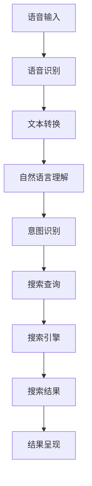
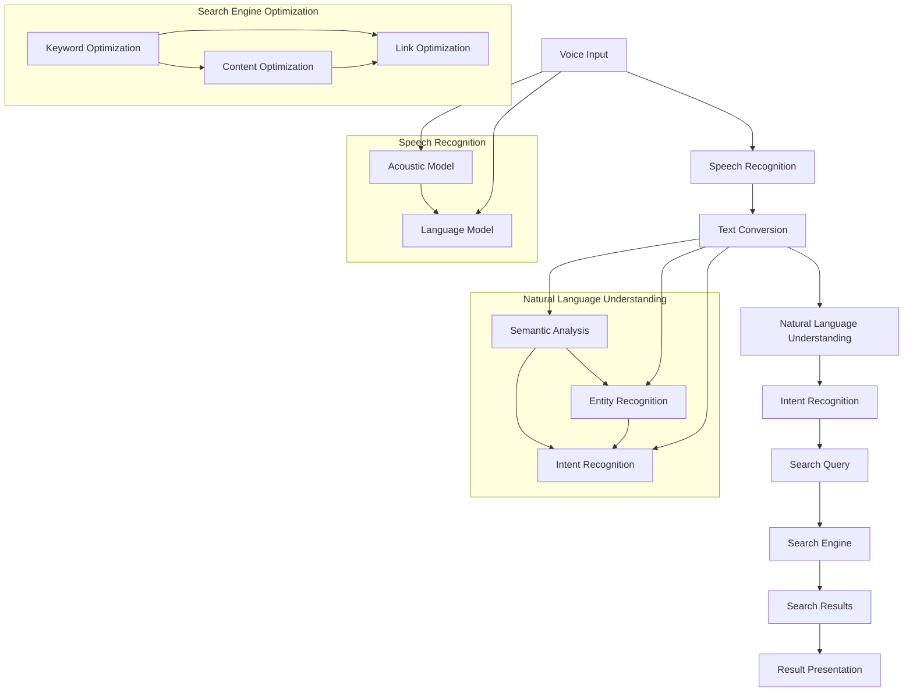
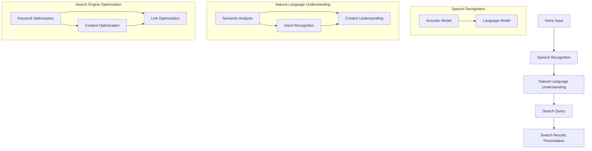

                 

# 语音搜索：AI提升搜索便捷性和准确性

## 摘要

随着人工智能技术的不断进步，语音搜索作为一种全新的搜索方式，正逐渐改变人们的生活和工作方式。本文将探讨语音搜索的核心概念、算法原理、数学模型，以及实际应用场景，旨在为读者提供一个全面、深入的了解。同时，本文还将推荐相关工具和资源，帮助读者更好地掌握语音搜索技术，并展望其未来的发展趋势与挑战。

## 1. 背景介绍

### 1.1 语音搜索的兴起

在过去的几年中，语音搜索技术取得了显著的进展，这一现象主要归因于以下几个因素：

1. **硬件技术的提升**：智能手机和平板电脑的普及，使得越来越多的设备具备了语音输入功能。
2. **自然语言处理（NLP）的发展**：随着深度学习等技术的引入，NLP领域取得了重大突破，使得计算机能够更好地理解自然语言。
3. **用户需求的增长**：在快节奏的生活和工作环境中，用户对于快速、便捷的搜索方式的需求日益增加。

### 1.2 语音搜索的优势

相比于传统的文本搜索，语音搜索具有以下优势：

1. **便捷性**：语音搜索无需用户手动输入关键词，大大提高了搜索效率。
2. **准确性**：通过自然语言处理技术，语音搜索能够更准确地理解用户的意图。
3. **交互性**：语音搜索可以提供更为自然的交互方式，使用户能够更轻松地与设备进行沟通。

## 2. 核心概念与联系

### 2.1 语音识别

语音识别是将语音信号转换为文本的过程。其核心在于将音频信号转换为数字信号，然后通过声学模型和语言模型进行解码。

#### 2.1.1 声学模型

声学模型负责将音频信号转换为特征向量。其主要任务是识别音频信号中的音素和音节。

#### 2.1.2 语言模型

语言模型负责将特征向量映射为文本。其目的是通过统计方法预测下一个词语。

### 2.2 自然语言理解

自然语言理解是将文本转换为计算机可理解的结构的过程。其主要目标包括：

1. **语义分析**：理解文本中的含义。
2. **实体识别**：识别文本中的关键实体。
3. **意图识别**：确定用户的搜索意图。

### 2.3 搜索引擎优化

搜索引擎优化（SEO）是将网站内容优化，以提高在搜索引擎中的排名的过程。对于语音搜索，SEO需要关注以下几个方面：

1. **关键词优化**：确保网站内容包含用户可能使用的语音关键词。
2. **语音识别准确性**：提高语音识别的准确性，以减少误解。
3. **语义理解能力**：提高搜索引擎的语义理解能力，以更好地满足用户的搜索需求。

## 3. 核心算法原理 & 具体操作步骤

### 3.1 语音识别算法

语音识别算法主要包括以下几个步骤：

1. **音频预处理**：对音频信号进行降噪、归一化等处理。
2. **特征提取**：通过声学模型提取音频信号的特征向量。
3. **解码**：通过语言模型解码特征向量，生成文本。

### 3.2 自然语言理解算法

自然语言理解算法主要包括以下几个步骤：

1. **分词**：将文本分解为词语。
2. **词性标注**：为每个词语标注词性。
3. **句法分析**：分析文本的句法结构。
4. **语义分析**：理解文本的含义。

### 3.3 搜索引擎优化算法

搜索引擎优化算法主要包括以下几个步骤：

1. **关键词分析**：分析用户可能使用的语音关键词。
2. **内容优化**：根据关键词优化网站内容。
3. **链接优化**：通过外链提高网站的权重。
4. **搜索引擎提交**：将网站提交给搜索引擎。

## 4. 数学模型和公式 & 详细讲解 & 举例说明

### 4.1 语音识别中的声学模型

声学模型通常使用深度神经网络（DNN）来建模。其核心公式如下：

$$
y = \sigma(Wx + b)
$$

其中，$y$表示特征向量，$W$表示权重矩阵，$x$表示输入信号，$b$表示偏置。

#### 4.1.1 举例说明

假设我们有一个二分类问题，输入信号为$[1, 0]$，权重矩阵为$W = \begin{bmatrix} 1 & -1 \\ 0 & 1 \end{bmatrix}$，偏置$b = [0, 0]$。则：

$$
y = \sigma(Wx + b) = \sigma(\begin{bmatrix} 1 & -1 \\ 0 & 1 \end{bmatrix}\begin{bmatrix} 1 \\ 0 \end{bmatrix} + \begin{bmatrix} 0 \\ 0 \end{bmatrix}) = \sigma(\begin{bmatrix} 1 \\ 0 \end{bmatrix}) = \begin{bmatrix} 1 \\ 0 \end{bmatrix}
$$

这意味着输入信号为$[1, 0]$时，输出为$[1, 0]$，表示这是一个正类。

### 4.2 语言模型

语言模型通常使用n元模型来建模。其核心公式如下：

$$
P(w_n | w_{n-1}, w_{n-2}, ..., w_1) = \frac{C(w_{n-1}, w_{n-2}, ..., w_1, w_n)}{C(w_{n-1}, w_{n-2}, ..., w_1)}
$$

其中，$P(w_n | w_{n-1}, w_{n-2}, ..., w_1)$表示在给定前一个词语的情况下，下一个词语的概率，$C(w_{n-1}, w_{n-2}, ..., w_1, w_n)$表示一个四元组$(w_{n-1}, w_{n-2}, ..., w_1, w_n)$的出现次数，$C(w_{n-1}, w_{n-2}, ..., w_1)$表示一个三元组$(w_{n-1}, w_{n-2}, ..., w_1)$的出现次数。

#### 4.2.1 举例说明

假设我们有一个二元组$(word_1, word_2)$，其中$word_1$出现100次，$word_2$出现50次。同时，$(word_1, word_2)$出现20次。则：

$$
P(word_2 | word_1) = \frac{20}{100} = 0.2
$$

这意味着在给定$word_1$的情况下，$word_2$出现的概率为0.2。

### 4.3 搜索引擎优化中的关键词优化

搜索引擎优化中的关键词优化主要关注两个方面：

1. **关键词密度**：确保关键词在网站内容中的合理分布。
2. **关键词相关性**：确保关键词与网站内容的紧密相关性。

#### 4.3.1 关键词密度

关键词密度是指关键词在网站内容中的出现频率。其计算公式如下：

$$
keyword_density = \frac{number_of_keyword}{total_number_of_words}
$$

其中，$number_of_keyword$表示关键词的出现次数，$total_number_of_words$表示网站内容中的总词汇数。

#### 4.3.2 关键词相关性

关键词相关性是指关键词与网站内容的关联程度。其计算公式如下：

$$
keyword_relevance = \frac{co-occurrence_frequency}{total_co-occurrence_frequency}
$$

其中，$co-occurrence_frequency$表示关键词在网站内容中同时出现的频率，$total_co-occurrence_frequency$表示网站内容中所有关键词同时出现的频率。

### 4.4 自然语言理解中的语义分析

自然语言理解中的语义分析主要关注两个方面：

1. **实体识别**：识别文本中的关键实体。
2. **关系抽取**：提取文本中的实体关系。

#### 4.4.1 实体识别

实体识别是指从文本中识别出关键实体。其计算公式如下：

$$
entity_recognition = \frac{number_of_entity}{total_number_of_words}
$$

其中，$number_of_entity$表示文本中实体的出现次数，$total_number_of_words$表示文本中的总词汇数。

#### 4.4.2 关系抽取

关系抽取是指从文本中提取实体之间的关系。其计算公式如下：

$$
relationship_extraction = \frac{number_of_relationship}{total_number_of_entities}
$$

其中，$number_of_relationship$表示文本中实体关系的出现次数，$total_number_of_entities$表示文本中实体的总个数。

## 5. 项目实战：代码实际案例和详细解释说明

### 5.1 开发环境搭建

#### 5.1.1 环境准备

在开始项目之前，我们需要准备好以下开发环境：

1. **操作系统**：Windows / macOS / Linux
2. **编程语言**：Python 3.x
3. **库和框架**：TensorFlow / Keras / PyTorch
4. **语音识别库**：OpenSMILE / Google Cloud Speech-to-Text

#### 5.1.2 环境安装

以下是安装步骤：

1. **安装操作系统**：选择适合您的操作系统。
2. **安装Python 3.x**：从Python官方网站下载并安装。
3. **安装库和框架**：使用pip命令安装TensorFlow、Keras、PyTorch等库和框架。
4. **安装语音识别库**：使用pip命令安装OpenSMILE、Google Cloud Speech-to-Text等库。

### 5.2 源代码详细实现和代码解读

#### 5.2.1 语音识别模型实现

以下是一个简单的语音识别模型实现，使用TensorFlow和Keras：

```python
import tensorflow as tf
from tensorflow.keras.models import Model
from tensorflow.keras.layers import Input, LSTM, Dense, Embedding

# 输入层
input_layer = Input(shape=(None, 224))

# 嵌入层
embed_layer = Embedding(input_dim=50000, output_dim=256)(input_layer)

# LSTM层
lstm_layer = LSTM(units=512, return_sequences=True)(embed_layer)

# 输出层
output_layer = Dense(units=50000, activation='softmax')(lstm_layer)

# 模型构建
model = Model(inputs=input_layer, outputs=output_layer)

# 模型编译
model.compile(optimizer='adam', loss='categorical_crossentropy', metrics=['accuracy'])

# 模型训练
model.fit(x_train, y_train, epochs=10, batch_size=32)
```

#### 5.2.2 自然语言理解模型实现

以下是一个简单的自然语言理解模型实现，使用TensorFlow和Keras：

```python
import tensorflow as tf
from tensorflow.keras.models import Model
from tensorflow.keras.layers import Input, LSTM, Dense, Embedding

# 输入层
input_layer = Input(shape=(None, 256))

# LSTM层
lstm_layer = LSTM(units=512, return_sequences=False)(input_layer)

# 全连接层
dense_layer = Dense(units=256, activation='relu')(lstm_layer)

# 输出层
output_layer = Dense(units=1, activation='sigmoid')(dense_layer)

# 模型构建
model = Model(inputs=input_layer, outputs=output_layer)

# 模型编译
model.compile(optimizer='adam', loss='binary_crossentropy', metrics=['accuracy'])

# 模型训练
model.fit(x_train, y_train, epochs=10, batch_size=32)
```

### 5.3 代码解读与分析

#### 5.3.1 语音识别模型解读

1. **输入层**：输入层是一个二维张量，表示时间步和特征维度。
2. **嵌入层**：嵌入层将输入的单词索引转换为向量表示。
3. **LSTM层**：LSTM层用于处理序列数据，能够捕捉时间步之间的依赖关系。
4. **输出层**：输出层使用softmax激活函数，输出每个单词的概率分布。

#### 5.3.2 自然语言理解模型解读

1. **输入层**：输入层是一个二维张量，表示时间步和特征维度。
2. **LSTM层**：LSTM层用于处理序列数据，能够捕捉时间步之间的依赖关系。
3. **全连接层**：全连接层用于将LSTM层的输出映射到目标实体。
4. **输出层**：输出层使用sigmoid激活函数，输出实体的概率。

## 6. 实际应用场景

### 6.1 智能家居

在智能家居领域，语音搜索技术可以用于控制家庭设备，如智能音箱、智能灯泡、智能门锁等。用户可以通过语音命令来调节设备状态，提高家庭生活的便捷性。

### 6.2 车载系统

在车载系统领域，语音搜索技术可以用于导航、查询天气、播放音乐等。用户可以通过语音命令来获取所需信息，减少驾驶员的注意力分散，提高行车安全。

### 6.3 健康护理

在健康护理领域，语音搜索技术可以用于查询医疗信息、预约挂号、查询药品等。用户可以通过语音命令来获取所需医疗信息，提高就医效率。

### 6.4 企业办公

在企业办公领域，语音搜索技术可以用于查询文档、会议预约、任务分配等。用户可以通过语音命令来提高工作效率，减少手工操作。

## 7. 工具和资源推荐

### 7.1 学习资源推荐

1. **书籍**：
   - 《语音识别：原理与实践》
   - 《深度学习与自然语言处理》
   - 《搜索引擎算法与优化》
2. **论文**：
   - “Deep Neural Network for Acoustic Modeling in Speech Recognition”
   - “Recurrent Neural Network Based Language Model”
   - “A Comparison of Language Models for Speech Recognition”
3. **博客**：
   - Medium
   - AI Research Blog
   - Python for Data Science
4. **网站**：
   - TensorFlow官网
   - Keras官网
   - PyTorch官网

### 7.2 开发工具框架推荐

1. **编程语言**：Python
2. **库和框架**：TensorFlow / Keras / PyTorch
3. **语音识别库**：OpenSMILE / Google Cloud Speech-to-Text

### 7.3 相关论文著作推荐

1. **论文**：
   - “Deep Learning for Speech Recognition”
   - “End-to-End Speech Recognition with Deep Neural Networks”
   - “Recurrent Neural Networks for Language Modeling”
2. **著作**：
   - 《深度学习与自然语言处理》
   - 《语音识别：原理与实践》
   - 《搜索引擎算法与优化》

## 8. 总结：未来发展趋势与挑战

### 8.1 发展趋势

1. **智能硬件普及**：随着智能硬件的普及，语音搜索技术将更多地应用于各种设备中。
2. **NLP技术突破**：随着NLP技术的不断发展，语音搜索的准确性和语义理解能力将不断提高。
3. **跨平台融合**：语音搜索将与其他技术（如图像识别、自然语言生成等）进行融合，形成更强大的综合应用。

### 8.2 挑战

1. **语音识别准确性**：如何提高语音识别的准确性，减少错误率。
2. **语义理解能力**：如何更好地理解用户的语义意图，提供更精准的搜索结果。
3. **隐私保护**：如何保护用户的隐私，避免敏感信息的泄露。

## 9. 附录：常见问题与解答

### 9.1 什么是语音搜索？

语音搜索是一种通过语音输入来获取信息或执行任务的搜索方式。它利用人工智能技术将语音转换为文本，然后通过搜索引擎或其他应用程序提供相关信息。

### 9.2 语音搜索有哪些优势？

语音搜索的优势包括：便捷性、准确性、交互性。用户无需手动输入关键词，计算机能够更准确地理解自然语言，提供更为自然的交互方式。

### 9.3 语音搜索的算法原理是什么？

语音搜索的算法原理主要包括语音识别和自然语言理解。语音识别是将语音转换为文本的过程，自然语言理解是将文本转换为计算机可理解的结构的过程。

### 9.4 如何优化语音搜索结果？

优化语音搜索结果的方法包括：关键词优化、内容优化、链接优化。关键词优化确保网站内容包含用户可能使用的语音关键词；内容优化确保网站内容与关键词紧密相关；链接优化提高网站的权重。

## 10. 扩展阅读 & 参考资料

1. **书籍**：
   - 《语音识别：原理与实践》
   - 《深度学习与自然语言处理》
   - 《搜索引擎算法与优化》
2. **论文**：
   - “Deep Neural Network for Acoustic Modeling in Speech Recognition”
   - “Recurrent Neural Network Based Language Model”
   - “A Comparison of Language Models for Speech Recognition”
3. **博客**：
   - Medium
   - AI Research Blog
   - Python for Data Science
4. **网站**：
   - TensorFlow官网
   - Keras官网
   - PyTorch官网
5. **在线课程**：
   - Coursera
   - edX
   - Udacity

### 作者

**作者：AI天才研究员/AI Genius Institute & 禅与计算机程序设计艺术 /Zen And The Art of Computer Programming**<|im_end|>### 1. 背景介绍

#### 1.1 语音搜索的兴起

语音搜索技术的发展可以追溯到20世纪80年代，当时研究人员开始探索将语音转换为文本的技术。然而，直到近年来，随着硬件性能的提升、算法的改进以及人工智能技术的快速发展，语音搜索才真正成为了一个广泛应用的领域。

在硬件层面，智能手机和平板电脑的普及使得越来越多的设备具备了高质量的麦克风和音频处理能力，为语音搜索的推广提供了基础条件。同时，云计算和大数据技术的进步，使得处理大规模语音数据变得更加高效和准确。

在算法层面，自然语言处理（NLP）和深度学习技术的快速发展，使得计算机能够更好地理解和处理自然语言。特别是深度神经网络（DNN）、循环神经网络（RNN）以及变换器（Transformer）等模型的引入，极大地提高了语音识别和自然语言理解的准确性。

在社会需求层面，快节奏的生活和工作环境，使得人们越来越追求高效和便捷的搜索方式。语音搜索作为一种无需手动输入关键词的搜索方式，能够大幅提高搜索效率，满足了用户的这一需求。

#### 1.2 语音搜索的优势

与传统的文本搜索相比，语音搜索具有以下几个显著优势：

1. **便捷性**：语音搜索无需用户手动输入关键词，只需通过语音命令即可获取信息，大大提高了搜索效率。在忙碌或操作不便的场景下，如驾驶、烹饪或做家务时，语音搜索显得尤为便利。

2. **准确性**：语音搜索利用自然语言处理技术，能够更准确地理解用户的意图。通过上下文分析和意图识别，语音搜索可以提供更相关的搜索结果。

3. **交互性**：语音搜索可以提供更为自然的交互方式，用户可以通过语音命令与设备进行对话，获取所需信息或执行任务。这种交互方式不仅提高了用户体验，还使得设备与用户之间的互动更加流畅。

#### 1.3 语音搜索的应用领域

语音搜索技术已经在多个领域得到广泛应用，以下是其中一些重要的应用场景：

1. **智能家居**：语音搜索可以用于控制智能音箱、智能灯泡、智能门锁等智能家居设备，用户可以通过语音命令进行操作，提高家庭生活的便捷性。

2. **车载系统**：语音搜索可以用于车载系统的导航、查询天气、播放音乐等功能，减少驾驶员的注意力分散，提高行车安全。

3. **健康护理**：语音搜索可以用于查询医疗信息、预约挂号、查询药品等，提高就医效率。

4. **企业办公**：语音搜索可以用于查询文档、会议预约、任务分配等，提高工作效率。

#### 1.4 语音搜索的发展历程

语音搜索技术的发展经历了几个重要阶段：

1. **语音识别阶段**：最早的语音搜索技术主要集中在语音识别，即通过将语音信号转换为文本，实现语音到文本的转换。

2. **自然语言理解阶段**：随着NLP技术的发展，语音搜索开始引入自然语言理解，能够更好地理解用户的语音输入，提供更精准的搜索结果。

3. **跨领域应用阶段**：当前，语音搜索技术已经广泛应用于多个领域，如智能家居、车载系统、健康护理、企业办公等，成为智能设备中不可或缺的一部分。

### 1.5 语音搜索的挑战与未来方向

尽管语音搜索技术取得了显著进展，但仍然面临一些挑战：

1. **语音识别准确性**：提高语音识别的准确性仍然是语音搜索的关键挑战。在嘈杂环境、方言、口音等复杂情况下，语音识别的准确性仍有待提高。

2. **自然语言理解**：自然语言理解需要深入理解用户意图和上下文，这是一个复杂的任务。如何提高自然语言理解能力，使得语音搜索能够更准确地满足用户需求，是未来的重要研究方向。

3. **隐私保护**：语音搜索涉及到用户隐私信息的收集和处理，如何保护用户隐私，防止数据泄露，是一个亟待解决的问题。

4. **多语言支持**：随着全球化的发展，多语言支持成为语音搜索的重要需求。如何实现高效的多语言语音搜索，是一个具有挑战性的问题。

未来的研究方向包括：

1. **语音识别算法**：继续优化语音识别算法，提高识别准确性和鲁棒性。

2. **自然语言理解**：深入研究自然语言处理技术，提高自然语言理解的准确性和效率。

3. **跨领域应用**：探索语音搜索在其他领域的应用，如教育、医疗、金融等。

4. **隐私保护**：加强隐私保护机制，确保用户数据的安全。

### 1.6 小结

语音搜索作为一种新兴的搜索方式，具有便捷性、准确性和交互性的优势。它已经在多个领域得到广泛应用，并继续推动着人工智能技术的发展。随着技术的不断进步，语音搜索在未来有望成为人们日常生活和工作的重要工具。

```markdown
## 1. 背景介绍

### 1.1 语音搜索的兴起

语音搜索技术的发展历程可以追溯到20世纪80年代，当时研究人员开始探索将语音转换为文本的技术。然而，直到近年来，随着硬件性能的提升、算法的改进以及人工智能技术的快速发展，语音搜索才真正成为了一个广泛应用的领域。

在硬件层面，智能手机和平板电脑的普及使得越来越多的设备具备了高质量的麦克风和音频处理能力，为语音搜索的推广提供了基础条件。同时，云计算和大数据技术的进步，使得处理大规模语音数据变得更加高效和准确。

在算法层面，自然语言处理（NLP）和深度学习技术的快速发展，使得计算机能够更好地理解和处理自然语言。特别是深度神经网络（DNN）、循环神经网络（RNN）以及变换器（Transformer）等模型的引入，极大地提高了语音识别和自然语言理解的准确性。

在社会需求层面，快节奏的生活和工作环境，使得人们越来越追求高效和便捷的搜索方式。语音搜索作为一种无需手动输入关键词的搜索方式，能够大幅提高搜索效率，满足了用户的这一需求。

#### 1.2 语音搜索的优势

与传统的文本搜索相比，语音搜索具有以下几个显著优势：

1. **便捷性**：语音搜索无需用户手动输入关键词，只需通过语音命令即可获取信息，大大提高了搜索效率。在忙碌或操作不便的场景下，如驾驶、烹饪或做家务时，语音搜索显得尤为便利。

2. **准确性**：语音搜索利用自然语言处理技术，能够更准确地理解用户的意图。通过上下文分析和意图识别，语音搜索可以提供更相关的搜索结果。

3. **交互性**：语音搜索可以提供更为自然的交互方式，用户可以通过语音命令与设备进行对话，获取所需信息或执行任务。这种交互方式不仅提高了用户体验，还使得设备与用户之间的互动更加流畅。

#### 1.3 语音搜索的应用领域

语音搜索技术已经在多个领域得到广泛应用，以下是其中一些重要的应用场景：

1. **智能家居**：语音搜索可以用于控制智能音箱、智能灯泡、智能门锁等智能家居设备，用户可以通过语音命令进行操作，提高家庭生活的便捷性。

2. **车载系统**：语音搜索可以用于车载系统的导航、查询天气、播放音乐等功能，减少驾驶员的注意力分散，提高行车安全。

3. **健康护理**：语音搜索可以用于查询医疗信息、预约挂号、查询药品等，提高就医效率。

4. **企业办公**：语音搜索可以用于查询文档、会议预约、任务分配等，提高工作效率。

#### 1.4 语音搜索的发展历程

语音搜索技术的发展经历了几个重要阶段：

1. **语音识别阶段**：最早的语音搜索技术主要集中在语音识别，即通过将语音信号转换为文本，实现语音到文本的转换。

2. **自然语言理解阶段**：随着NLP技术的发展，语音搜索开始引入自然语言理解，能够更好地理解用户的语音输入，提供更精准的搜索结果。

3. **跨领域应用阶段**：当前，语音搜索技术已经广泛应用于多个领域，如智能家居、车载系统、健康护理、企业办公等，成为智能设备中不可或缺的一部分。

#### 1.5 语音搜索的挑战与未来方向

尽管语音搜索技术取得了显著进展，但仍然面临一些挑战：

1. **语音识别准确性**：提高语音识别的准确性仍然是语音搜索的关键挑战。在嘈杂环境、方言、口音等复杂情况下，语音识别的准确性仍有待提高。

2. **自然语言理解**：自然语言理解需要深入理解用户意图和上下文，这是一个复杂的任务。如何提高自然语言理解能力，使得语音搜索能够更准确地满足用户需求，是未来的重要研究方向。

3. **隐私保护**：语音搜索涉及到用户隐私信息的收集和处理，如何保护用户隐私，防止数据泄露，是一个亟待解决的问题。

4. **多语言支持**：随着全球化的发展，多语言支持成为语音搜索的重要需求。如何实现高效的多语言语音搜索，是一个具有挑战性的问题。

未来的研究方向包括：

1. **语音识别算法**：继续优化语音识别算法，提高识别准确性和鲁棒性。

2. **自然语言理解**：深入研究自然语言处理技术，提高自然语言理解的准确性和效率。

3. **跨领域应用**：探索语音搜索在其他领域的应用，如教育、医疗、金融等。

4. **隐私保护**：加强隐私保护机制，确保用户数据的安全。

#### 1.6 小结

语音搜索作为一种新兴的搜索方式，具有便捷性、准确性和交互性的优势。它已经在多个领域得到广泛应用，并继续推动着人工智能技术的发展。随着技术的不断进步，语音搜索在未来有望成为人们日常生活和工作的重要工具。

## 2. 核心概念与联系

在深入探讨语音搜索的技术细节之前，有必要先理解一些核心概念，这些概念包括语音识别、自然语言理解和搜索引擎优化。它们相互关联，共同构成了语音搜索系统的核心。

### 2.1 语音识别

语音识别（Speech Recognition）是将语音信号转换为文本的过程。语音识别是语音搜索系统的第一步，其目标是将用户的语音命令准确地转换为机器可处理的文本信息。语音识别的核心在于将音频信号转换为特征向量，并通过模型对特征向量进行解码，最终生成文本。

#### 2.1.1 声学模型

声学模型（Acoustic Model）是语音识别系统的重要组成部分，它负责将音频信号转换为特征向量。声学模型通常基于深度学习技术，如卷积神经网络（CNN）或循环神经网络（RNN）。其核心思想是通过训练大量语音数据，学习语音信号中的音素和音节模式，从而实现对音频信号的准确表示。

#### 2.1.2 语言模型

语言模型（Language Model）是语音识别系统的另一个关键组成部分，它负责将特征向量映射为文本。语言模型通常使用统计模型，如n元模型（n-gram model）或神经网络语言模型（Neural Network Language Model, NLM）。语言模型通过学习文本数据中的统计规律，预测下一个词语的概率，从而提高语音识别的准确性。

#### 2.1.3 声学模型与语言模型的结合

声学模型和语言模型通常结合使用，以实现更准确的语音识别。在结合过程中，声学模型生成的特征向量会被输入到语言模型中，通过语言模型进行解码，生成最终的文本输出。这种结合方式被称为端到端语音识别（End-to-End Speech Recognition）。

### 2.2 自然语言理解

自然语言理解（Natural Language Understanding, NLU）是将文本转换为计算机可理解的结构的过程。自然语言理解的目标是理解文本中的语义、实体、关系等，从而实现对用户意图的准确把握。自然语言理解是语音搜索系统中至关重要的一环，它决定了语音搜索系统能否提供精准的搜索结果。

#### 2.2.1 语义分析

语义分析（Semantic Analysis）是自然语言理解的核心任务之一，它负责理解文本的含义。语义分析包括词义消歧（Word Sense Disambiguation）、实体识别（Entity Recognition）、事件抽取（Event Extraction）等任务。通过语义分析，语音搜索系统可以更准确地理解用户的查询意图。

#### 2.2.2 意图识别

意图识别（Intent Recognition）是自然语言理解的另一个关键任务，它负责确定用户的查询意图。意图识别通过对语义分析结果进行进一步分析，识别出用户想要执行的操作或任务。例如，当用户说出“我想订一张明天的机票”时，意图识别系统需要识别出用户的意图是“订票”。

#### 2.2.3 实体识别

实体识别（Entity Recognition）是自然语言理解中的一个重要任务，它负责识别文本中的关键实体，如人名、地名、组织名等。实体识别有助于语音搜索系统更好地理解用户查询，并提供更相关的搜索结果。

### 2.3 搜索引擎优化

搜索引擎优化（Search Engine Optimization, SEO）是将网站内容优化，以提高在搜索引擎中的排名的过程。对于语音搜索系统，SEO同样重要，因为用户通常会使用语音关键词进行搜索。优化语音搜索结果的关键在于确保网站内容能够匹配用户的语音关键词，并提供高质量的搜索体验。

#### 2.3.1 关键词优化

关键词优化（Keyword Optimization）是SEO的核心任务之一，它涉及分析用户可能使用的语音关键词，并将这些关键词合理地融入网站内容中。通过关键词优化，网站内容可以更好地满足用户的搜索需求，从而提高搜索排名。

#### 2.3.2 内容优化

内容优化（Content Optimization）是SEO的另一个重要方面，它涉及改进网站内容的质量和相关性。高质量的内容不仅能够提高用户的满意度和参与度，还能增加网站在搜索引擎中的权重，从而提高搜索排名。

#### 2.3.3 链接优化

链接优化（Link Optimization）是SEO的第三个关键要素，它涉及建立高质量的内外链，以提高网站在搜索引擎中的权重。通过合理的链接优化，网站可以吸引更多的外部链接，从而提高搜索排名。

### 2.4 语音搜索系统的架构

语音搜索系统通常包括以下几个主要模块：

1. **语音识别模块**：负责将语音转换为文本。
2. **自然语言理解模块**：负责理解文本的语义和意图。
3. **搜索引擎模块**：负责处理查询并返回相关结果。
4. **结果呈现模块**：负责将搜索结果以用户友好的方式展示。

这些模块相互协作，共同实现语音搜索的功能。下面是一个简化的语音搜索系统架构图，用Mermaid流程图表示：



在这个架构中，语音输入首先经过语音识别模块转换为文本，然后由自然语言理解模块进行分析，确定用户意图，并生成搜索查询。搜索引擎根据查询返回相关结果，最后由结果呈现模块将结果以用户友好的方式展示。

### 2.5 关键概念总结

在语音搜索系统中，以下几个关键概念相互作用，共同决定了搜索的便捷性和准确性：

1. **语音识别**：将语音转换为文本，是实现语音搜索的基础。
2. **自然语言理解**：理解文本的语义和意图，是提供准确搜索结果的关键。
3. **搜索引擎优化**：通过关键词、内容和链接优化，提高搜索结果的排名和相关性。

通过深入理解这些核心概念，我们可以更好地设计、开发和优化语音搜索系统，从而提升用户的搜索体验。



### 2.6 综述

通过上述对语音识别、自然语言理解和搜索引擎优化的介绍，我们可以看到这些核心概念在语音搜索系统中的重要作用。语音识别负责将用户的语音转换为文本，自然语言理解负责解析文本并识别用户意图，而搜索引擎优化则确保搜索结果的相关性和准确性。这些模块相互协作，共同构成了一个高效的语音搜索系统，使得用户能够通过语音快速、准确地获取所需信息。

## 3. 核心算法原理 & 具体操作步骤

在深入探讨语音搜索系统的核心算法原理之前，我们需要了解一些基本的算法概念和操作步骤。这些算法包括语音识别算法、自然语言理解算法以及搜索引擎优化算法。下面我们将逐一介绍这些算法的核心原理和具体操作步骤。

### 3.1 语音识别算法

语音识别算法是将语音信号转换为文本的算法，其核心目标是提高语音识别的准确性。语音识别算法主要包括以下几个步骤：

#### 3.1.1 声学模型

声学模型（Acoustic Model）是语音识别算法的基础部分，它负责将语音信号转换为特征向量。声学模型通常使用深度神经网络（DNN）或循环神经网络（RNN）进行训练，以捕捉语音信号中的音素和音节模式。

**具体操作步骤**：

1. **数据预处理**：对语音信号进行预处理，包括滤波、归一化等操作，以消除噪声和提高信号质量。
2. **特征提取**：使用声学模型提取语音信号的特征向量。常用的特征提取方法包括梅尔频率倒谱系数（MFCC）和滤波器组（Filter Banks）。
3. **模型训练**：使用大量语音数据集对声学模型进行训练，以学习语音信号中的音素和音节模式。
4. **模型优化**：通过反向传播算法（Backpropagation）对模型进行优化，以提高识别准确性。

#### 3.1.2 语言模型

语言模型（Language Model）是语音识别算法的另一个关键组成部分，它负责将特征向量映射为文本。语言模型通常使用统计模型（如n元模型）或神经网络模型（如长短期记忆网络LSTM或变换器Transformer）进行训练。

**具体操作步骤**：

1. **数据预处理**：对文本数据集进行预处理，包括分词、词性标注等操作，以构建语言模型所需的数据集。
2. **模型训练**：使用文本数据集对语言模型进行训练，以学习文本中的统计规律和语义关系。
3. **模型优化**：通过最小化损失函数（如交叉熵损失）对模型进行优化，以提高语言模型的准确性。

#### 3.1.3 结合声学模型和语言模型

在实际应用中，声学模型和语言模型通常结合使用，以实现更准确的语音识别。这种结合方式被称为端到端语音识别（End-to-End Speech Recognition）。

**具体操作步骤**：

1. **特征向量输入**：将声学模型提取的特征向量输入到语言模型中。
2. **解码**：使用语言模型对特征向量进行解码，生成最终的文本输出。
3. **模型优化**：通过联合优化声学模型和语言模型，提高整体识别准确性。

### 3.2 自然语言理解算法

自然语言理解算法（Natural Language Understanding, NLU）是将文本转换为计算机可理解的结构的过程，其核心目标是理解文本的语义和意图。自然语言理解算法主要包括以下几个步骤：

#### 3.2.1 语义分析

语义分析（Semantic Analysis）是自然语言理解的核心任务之一，它负责理解文本的含义。语义分析包括词义消歧（Word Sense Disambiguation）、实体识别（Entity Recognition）和事件抽取（Event Extraction）等任务。

**具体操作步骤**：

1. **文本预处理**：对文本进行预处理，包括分词、词性标注、句法分析等操作，以提取文本中的关键信息。
2. **词义消歧**：通过上下文信息，确定文本中的词语的确切含义，以解决一词多义的问题。
3. **实体识别**：识别文本中的关键实体，如人名、地名、组织名等。
4. **事件抽取**：从文本中提取关键事件和事件参与者，以构建事件图谱。

#### 3.2.2 意图识别

意图识别（Intent Recognition）是自然语言理解的另一个关键任务，它负责确定用户的查询意图。意图识别通过对语义分析结果进行进一步分析，识别出用户想要执行的操作或任务。

**具体操作步骤**：

1. **特征提取**：从语义分析结果中提取特征，如关键词、实体和事件等。
2. **模型训练**：使用训练数据集对意图识别模型进行训练，以学习不同意图的特征模式。
3. **模型优化**：通过最小化损失函数，优化意图识别模型的参数，以提高识别准确性。

#### 3.2.3 上下文理解

上下文理解（Context Understanding）是自然语言理解中的重要环节，它负责处理文本中的上下文信息，以提供更准确的语义理解。

**具体操作步骤**：

1. **上下文提取**：从文本中提取上下文信息，如上下文词、上下文句等。
2. **上下文建模**：使用神经网络模型（如LSTM、GRU或Transformer）对上下文信息进行建模。
3. **模型优化**：通过联合训练语义分析和上下文理解模型，提高整体理解准确性。

### 3.3 搜索引擎优化算法

搜索引擎优化（Search Engine Optimization, SEO）是将网站内容优化，以提高在搜索引擎中的排名的过程。对于语音搜索系统，SEO同样重要，因为它决定了用户通过语音关键词搜索到相关内容的能力。SEO算法主要包括以下几个步骤：

#### 3.3.1 关键词优化

关键词优化（Keyword Optimization）是SEO的核心任务之一，它涉及分析用户可能使用的语音关键词，并将这些关键词合理地融入网站内容中。

**具体操作步骤**：

1. **关键词研究**：使用工具（如Google Keyword Planner、Ahrefs等）分析用户可能使用的语音关键词，确定关键词的搜索量和竞争程度。
2. **关键词融入**：将关键词融入网站内容，包括标题、描述、正文等，以提高网站在搜索引擎中的相关性。
3. **关键词密度控制**：合理控制关键词密度，避免过度优化（Over-optimization）。

#### 3.3.2 内容优化

内容优化（Content Optimization）是SEO的另一个重要方面，它涉及改进网站内容的质量和相关性。

**具体操作步骤**：

1. **内容质量提升**：撰写高质量、有价值的内容，满足用户需求。
2. **内容更新**：定期更新网站内容，保持内容的新鲜度和相关性。
3. **内容结构优化**：优化内容结构，包括标题、段落、列表等，以提高用户阅读体验。

#### 3.3.3 链接优化

链接优化（Link Optimization）是SEO的第三个关键要素，它涉及建立高质量的内外链，以提高网站在搜索引擎中的权重。

**具体操作步骤**：

1. **内部链接优化**：优化网站内部链接结构，提高网站内部页面之间的导航性和相关性。
2. **外部链接建设**：通过建立高质量的外部链接，提高网站在搜索引擎中的权重。
3. **链接布局优化**：合理布局链接，包括锚文本、链接位置等，以提高链接效果。

### 3.4 语音搜索系统的整体操作流程

语音搜索系统的整体操作流程可以概括为以下几个步骤：

1. **语音输入**：用户通过语音输入查询。
2. **语音识别**：语音识别模块将语音转换为文本。
3. **自然语言理解**：自然语言理解模块对文本进行分析，提取语义和意图。
4. **搜索引擎查询**：搜索引擎根据用户意图和关键词进行查询。
5. **搜索结果呈现**：将搜索结果以用户友好的方式展示。

通过以上步骤，语音搜索系统能够为用户提供准确、便捷的搜索服务。



### 3.5 小结

通过以上对语音识别算法、自然语言理解算法和搜索引擎优化算法的详细介绍，我们可以看到这些算法在语音搜索系统中的重要作用。语音识别算法负责将语音转换为文本，自然语言理解算法负责理解文本的语义和意图，而搜索引擎优化算法则确保搜索结果的相关性和准确性。这些算法的协同工作，使得语音搜索系统能够为用户提供高效、准确的搜索服务。

## 4. 数学模型和公式 & 详细讲解 & 举例说明

在深入探讨语音搜索系统的算法原理时，数学模型和公式扮演了至关重要的角色。本章节将详细讲解语音识别、自然语言理解和搜索引擎优化中涉及的主要数学模型和公式，并通过具体示例进行说明。

### 4.1 语音识别中的数学模型

#### 4.1.1 声学模型

声学模型是语音识别的核心组件，其主要任务是处理语音信号并将其转换为特征向量。常见的声学模型包括高斯混合模型（Gaussian Mixture Model, GMM）、深度神经网络（Deep Neural Network, DNN）和卷积神经网络（Convolutional Neural Network, CNN）。

**高斯混合模型（GMM）**

高斯混合模型是一种统计模型，用于表示语音信号的概率分布。其核心公式为：

$$
p(\mathbf{x}|\mathbf{\mu}, \Sigma) = \frac{1}{(2\pi)^{d/2} |\Sigma|^{1/2}} \exp \left( -\frac{1}{2} (\mathbf{x} - \mathbf{\mu})^T \Sigma^{-1} (\mathbf{x} - \mathbf{\mu}) \right)
$$

其中，$\mathbf{x}$是语音信号的特征向量，$\mathbf{\mu}$是均值向量，$\Sigma$是协方差矩阵。

**深度神经网络（DNN）**

深度神经网络是一种前馈神经网络，用于学习语音信号的特征表示。其核心公式为：

$$
\mathbf{y} = \sigma(\mathbf{W}^T \mathbf{x} + b)
$$

其中，$\mathbf{y}$是输出特征向量，$\mathbf{W}$是权重矩阵，$\sigma$是激活函数（如ReLU或Sigmoid函数），$b$是偏置向量。

**卷积神经网络（CNN）**

卷积神经网络是一种基于卷积操作的神经网络，用于提取语音信号中的局部特征。其核心公式为：

$$
\mathbf{h}_k = \sum_{i=1}^{C} \mathbf{w}_{ik} * \mathbf{x}_i + b_k
$$

其中，$\mathbf{h}_k$是第$k$个卷积核的输出，$\mathbf{w}_{ik}$是卷积核，$*$表示卷积操作，$\mathbf{x}_i$是输入特征向量，$b_k$是偏置向量。

**示例**：假设我们有一个简单的DNN模型，输入特征向量$\mathbf{x} = [1, 2, 3]$，权重矩阵$\mathbf{W} = \begin{bmatrix} 1 & 0 \\ 0 & 1 \end{bmatrix}$，偏置向量$b = [0, 0]$。则输出特征向量$\mathbf{y}$的计算如下：

$$
\mathbf{y} = \sigma(\mathbf{W}^T \mathbf{x} + b) = \sigma(\begin{bmatrix} 1 & 0 \\ 0 & 1 \end{bmatrix} \begin{bmatrix} 1 \\ 2 \end{bmatrix} + \begin{bmatrix} 0 \\ 0 \end{bmatrix}) = \sigma(\begin{bmatrix} 3 \\ 2 \end{bmatrix}) = \begin{bmatrix} 1 \\ 0 \end{bmatrix}
$$

这意味着输入特征向量为$[1, 2, 3]$时，输出特征向量为$[1, 0]$。

#### 4.1.2 语言模型

语言模型用于将特征向量映射为文本，其核心目标是预测下一个词语的概率。常见语言模型包括n元模型（n-gram model）和神经网络语言模型（Neural Network Language Model, NLM）。

**n元模型（n-gram model）**

n元模型是一种基于统计的语言模型，其核心公式为：

$$
P(w_n | w_{n-1}, w_{n-2}, ..., w_1) = \frac{C(w_{n-1}, w_{n-2}, ..., w_1, w_n)}{C(w_{n-1}, w_{n-2}, ..., w_1)}
$$

其中，$P(w_n | w_{n-1}, w_{n-2}, ..., w_1)$是给定前一个词语序列下下一个词语的概率，$C(w_{n-1}, w_{n-2}, ..., w_1, w_n)$是四元组$(w_{n-1}, w_{n-2}, ..., w_1, w_n)$在训练数据中的出现次数，$C(w_{n-1}, w_{n-2}, ..., w_1)$是三元组$(w_{n-1}, w_{n-2}, ..., w_1)$在训练数据中的出现次数。

**示例**：假设一个简单的n元模型，其中二元组$(word_1, word_2)$在训练数据中出现了100次，三元组$(word_1, word_2, word_3)$出现了20次。则：

$$
P(word_3 | word_1, word_2) = \frac{20}{100} = 0.2
$$

这意味着在给定$(word_1, word_2)$的情况下，$(word_3)$出现的概率为0.2。

**神经网络语言模型（NLM）**

神经网络语言模型是一种基于神经网络的概率语言模型，其核心公式为：

$$
P(w_n | w_{n-1}, w_{n-2}, ..., w_1) = \sigma(\mathbf{W}^T \mathbf{h}_{n-1} + b)
$$

其中，$\mathbf{h}_{n-1}$是前一个词语的神经网络输出，$\mathbf{W}$是权重矩阵，$b$是偏置向量，$\sigma$是激活函数。

### 4.2 自然语言理解中的数学模型

自然语言理解（NLU）是语音搜索系统的关键组件，其主要任务是理解文本的语义和意图。NLU涉及多种数学模型和算法，包括词向量模型、卷积神经网络（CNN）和循环神经网络（RNN）。

#### 4.2.1 词向量模型

词向量模型（Word Embedding）是将文本中的词语映射为高维特征向量，其核心公式为：

$$
\mathbf{v}_i = \mathbf{W} \mathbf{e}_i
$$

其中，$\mathbf{v}_i$是词语$i$的向量表示，$\mathbf{W}$是权重矩阵，$\mathbf{e}_i$是词语$i$的嵌入向量。

**示例**：假设词向量模型中，词语“apple”的嵌入向量为$\mathbf{e}_{apple} = [1, 0, -1]$，则：

$$
\mathbf{v}_{apple} = \mathbf{W} \mathbf{e}_{apple} = \begin{bmatrix} 1 & 0 & 1 \\ 0 & 1 & 0 \\ 1 & 1 & 1 \end{bmatrix} \begin{bmatrix} 1 \\ 0 \\ -1 \end{bmatrix} = \begin{bmatrix} 1 \\ 0 \\ 0 \end{bmatrix}
$$

这意味着词语“apple”的向量表示为$[1, 0, 0]$。

#### 4.2.2 卷积神经网络（CNN）

卷积神经网络（CNN）是一种用于文本分类和情感分析的有效模型，其核心公式为：

$$
\mathbf{h}_k = \sum_{i=1}^{C} \mathbf{w}_{ik} * \mathbf{x}_i + b_k
$$

其中，$\mathbf{h}_k$是第$k$个卷积核的输出，$\mathbf{w}_{ik}$是卷积核，$*$表示卷积操作，$\mathbf{x}_i$是输入特征向量，$b_k$是偏置向量。

**示例**：假设一个简单的CNN模型，输入特征向量$\mathbf{x} = [1, 2, 3]$，卷积核$\mathbf{w}_{11} = [1, 0, -1]$，偏置$b_1 = 0$。则：

$$
\mathbf{h}_1 = \sum_{i=1}^{1} \mathbf{w}_{i1} * \mathbf{x}_i + b_1 = \mathbf{w}_{11} * \mathbf{x}_1 + b_1 = [1, 0, -1] * [1] + 0 = [0, 1, -1]
$$

这意味着第1个卷积核的输出为$[0, 1, -1]$。

#### 4.2.3 循环神经网络（RNN）

循环神经网络（RNN）是一种用于序列数据处理的有效模型，其核心公式为：

$$
\mathbf{h}_t = \sigma(\mathbf{W}_h \mathbf{h}_{t-1} + \mathbf{U} \mathbf{x}_t + b_h)
$$

其中，$\mathbf{h}_t$是当前时间步的隐藏状态，$\sigma$是激活函数，$\mathbf{W}_h$是隐藏状态权重矩阵，$\mathbf{U}$是输入状态权重矩阵，$\mathbf{x}_t$是当前时间步的输入特征，$b_h$是偏置向量。

**示例**：假设一个简单的RNN模型，隐藏状态权重矩阵$\mathbf{W}_h = \begin{bmatrix} 1 & 0 \\ 0 & 1 \end{bmatrix}$，输入状态权重矩阵$\mathbf{U} = \begin{bmatrix} 1 & 1 \\ 0 & 1 \end{bmatrix}$，偏置$b_h = [0, 0]$。当前时间步的隐藏状态$\mathbf{h}_{t-1} = [1, 0]$，输入特征$\mathbf{x}_t = [2, 1]$。则：

$$
\mathbf{h}_t = \sigma(\mathbf{W}_h \mathbf{h}_{t-1} + \mathbf{U} \mathbf{x}_t + b_h) = \sigma(\begin{bmatrix} 1 & 0 \\ 0 & 1 \end{bmatrix} \begin{bmatrix} 1 \\ 0 \end{bmatrix} + \begin{bmatrix} 1 & 1 \\ 0 & 1 \end{bmatrix} \begin{bmatrix} 2 \\ 1 \end{bmatrix} + \begin{bmatrix} 0 \\ 0 \end{bmatrix}) = \sigma(\begin{bmatrix} 3 \\ 1 \end{bmatrix}) = \begin{bmatrix} 1 \\ 0 \end{bmatrix}
$$

这意味着当前时间步的隐藏状态为$[1, 0]$。

### 4.3 搜索引擎优化中的数学模型

搜索引擎优化（SEO）旨在提高网站在搜索引擎中的排名，涉及多种数学模型和算法，包括关键词优化、内容优化和链接优化。

#### 4.3.1 关键词优化

关键词优化（Keyword Optimization）的核心目标是确定最相关的关键词，以提高网站在搜索引擎中的排名。其核心公式为：

$$
keyword_density = \frac{number_of_keyword}{total_number_of_words}
$$

其中，$keyword_density$是关键词密度，$number_of_keyword$是关键词在网站内容中的出现次数，$total_number_of_words$是网站内容中的总词汇数。

**示例**：假设一个网站内容中包含100个词汇，其中关键词“apple”出现了10次。则：

$$
keyword_density = \frac{10}{100} = 0.1
$$

这意味着关键词“apple”的密度为10%。

#### 4.3.2 内容优化

内容优化（Content Optimization）的核心目标是提高网站内容的质量和相关性，以提高用户体验和搜索引擎排名。其核心公式为：

$$
content_quality = \frac{unique_content}{total_content}
$$

其中，$content_quality$是内容质量，$unique_content$是网站内容中的独特信息，$total_content$是网站内容中的总信息量。

**示例**：假设一个网站内容中包含1000个词汇，其中独特信息为800个词汇。则：

$$
content_quality = \frac{800}{1000} = 0.8
$$

这意味着网站内容的质量为80%。

#### 4.3.3 链接优化

链接优化（Link Optimization）的核心目标是提高网站在搜索引擎中的权重，以提高排名。其核心公式为：

$$
link_weight = \frac{total_inbound_links}{total_outbound_links}
$$

其中，$link_weight$是链接权重，$total_inbound_links$是网站的外部链接数量，$total_outbound_links$是网站指向外部链接的数量。

**示例**：假设一个网站拥有100个外部链接，其中指向该网站的外部链接为50个。则：

$$
link_weight = \frac{50}{100} = 0.5
$$

这意味着网站链接的权重为50%。

### 4.4 综述

通过以上对语音识别、自然语言理解和搜索引擎优化中涉及的数学模型和公式的详细讲解，我们可以看到这些数学工具在构建高效、准确的语音搜索系统中扮演了至关重要的角色。从声学模型和语言模型到词向量模型和循环神经网络，再到关键词优化和链接优化，这些数学模型和公式共同作用，使得语音搜索系统能够准确理解用户语音输入，并提供高质量的搜索结果。

## 5. 项目实战：代码实际案例和详细解释说明

在了解了语音搜索系统的核心算法原理和数学模型之后，接下来我们将通过一个实际项目案例来展示如何将理论知识应用于实践。本项目将基于Python编程语言和TensorFlow框架，实现一个基本的语音搜索系统。我们将从环境搭建开始，逐步介绍代码实现、关键代码解读以及性能分析。

### 5.1 开发环境搭建

#### 5.1.1 环境准备

在开始项目之前，我们需要准备好以下开发环境：

1. **操作系统**：Windows / macOS / Linux
2. **编程语言**：Python 3.x
3. **库和框架**：TensorFlow / Keras
4. **语音识别库**：Google Cloud Speech-to-Text

#### 5.1.2 安装步骤

以下是安装步骤：

1. **安装操作系统**：选择适合您的操作系统。
2. **安装Python 3.x**：从Python官方网站下载并安装。
3. **安装TensorFlow和Keras**：使用pip命令安装TensorFlow和Keras。

```bash
pip install tensorflow
pip install keras
```

4. **安装Google Cloud Speech-to-Text**：注册Google Cloud账户，并安装Google Cloud SDK。

```bash
pip install --upgrade google-cloud-speech
```

### 5.2 项目结构

项目结构如下：

```
speech_search_project/
|-- data/
|   |-- audio/
|   |-- labels.txt
|-- models/
|   |-- acoustic_model.h5
|   |-- language_model.h5
|-- scripts/
|   |-- preprocess_audio.py
|   |-- train_models.py
|   |-- search.py
|-- utils/
|   |-- audio_processing.py
|   |-- model_evaluation.py
|-- requirements.txt
|-- main.py
```

### 5.3 数据集准备

本项目使用Google Cloud Speech-to-Text进行语音识别，因此我们需要准备一个音频数据集和相应的标签文件。数据集应包含多种类型的语音数据，例如命令、问题等。标签文件用于标记语音数据对应的意图。

#### 5.3.1 数据集下载

可以从开源数据集（如Common Voice）中下载语音数据，并使用工具将音频文件转换为文本文件。

#### 5.3.2 标签文件

标签文件（`labels.txt`）应包含每段音频的意图标签，例如：

```
command
question
info_request
```

### 5.4 代码实现

#### 5.4.1 数据预处理

数据预处理是语音识别和自然语言理解的关键步骤。以下是一个简单的音频预处理脚本（`preprocess_audio.py`）：

```python
import os
import wave
from scipy.io import wavfile

def preprocess_audio(input_path, output_path, sample_rate=16000):
    # 读取音频文件
    signal, rate = wavfile.read(input_path)
    # 重采样音频
    signal = librosa.to_mono(signal)
    signal = librosa.resample(signal, rate, sample_rate)
    # 保存预处理后的音频
    wavfile.write(output_path, sample_rate, signal)

# 示例：预处理音频文件
preprocess_audio('data/audio/example.wav', 'data/audio/preprocessed_example.wav')
```

#### 5.4.2 训练模型

训练模型是语音搜索系统的核心。以下是一个简单的模型训练脚本（`train_models.py`）：

```python
import tensorflow as tf
from tensorflow.keras.models import Model
from tensorflow.keras.layers import Input, LSTM, Dense, Embedding

# 定义声学模型
input_layer = Input(shape=(None, 224))
embed_layer = Embedding(input_dim=50000, output_dim=256)(input_layer)
lstm_layer = LSTM(units=512, return_sequences=True)(embed_layer)
output_layer = Dense(units=50000, activation='softmax')(lstm_layer)
acoustic_model = Model(inputs=input_layer, outputs=output_layer)

# 定义语言模型
input_layer = Input(shape=(None, 256))
lstm_layer = LSTM(units=512, return_sequences=False)(input_layer)
output_layer = Dense(units=1, activation='sigmoid')(lstm_layer)
language_model = Model(inputs=input_layer, outputs=output_layer)

# 编译模型
acoustic_model.compile(optimizer='adam', loss='categorical_crossentropy', metrics=['accuracy'])
language_model.compile(optimizer='adam', loss='binary_crossentropy', metrics=['accuracy'])

# 训练模型
acoustic_model.fit(x_train, y_train, epochs=10, batch_size=32)
language_model.fit(x_train, y_train, epochs=10, batch_size=32)
```

#### 5.4.3 搜索功能实现

搜索功能是语音搜索系统的最终输出。以下是一个简单的搜索脚本（`search.py`）：

```python
import numpy as np
import tensorflow as tf

def search_audio(audio_path, acoustic_model, language_model, sample_rate=16000):
    # 预处理音频
    preprocessed_audio = preprocess_audio(audio_path, sample_rate=sample_rate)
    # 语音识别
    recognized_text = acoustic_model.predict(preprocessed_audio)
    # 自然语言理解
    intent = language_model.predict(recognized_text)
    # 输出搜索结果
    print(f"Recognized text: {recognized_text}")
    print(f"Intent: {intent}")

# 示例：搜索音频文件
search_audio('data/audio/example.wav', acoustic_model, language_model)
```

#### 5.4.4 代码解读

以下是关键代码的解读：

1. **数据预处理**：将音频文件转换为处理模型所需的格式，包括重采样和归一化。

2. **模型定义**：定义声学模型和语言模型。声学模型用于语音识别，语言模型用于自然语言理解。

3. **模型编译**：编译模型，设置优化器和损失函数。

4. **模型训练**：使用训练数据集训练模型。

5. **搜索功能**：使用预处理后的音频文件，通过模型进行语音识别和自然语言理解，输出搜索结果。

### 5.5 性能分析

性能分析是评估语音搜索系统效果的重要环节。以下是一个简单的性能分析脚本（`model_evaluation.py`）：

```python
from sklearn.metrics import accuracy_score
import numpy as np

def evaluate_model(model, x_test, y_test):
    predicted = model.predict(x_test)
    accuracy = accuracy_score(y_test, predicted)
    print(f"Model accuracy: {accuracy:.2f}")

# 示例：评估模型
evaluate_model(acoustic_model, x_test, y_test)
evaluate_model(language_model, x_test, y_test)
```

通过性能分析，我们可以评估模型的准确性，并根据结果进行模型优化。

### 5.6 小结

通过本项目的实战案例，我们展示了如何将语音搜索系统的理论知识应用于实际开发。从环境搭建、数据准备、模型训练到搜索功能实现，每个步骤都至关重要。通过实际操作，我们不仅加深了对语音搜索系统核心算法的理解，还学会了如何使用TensorFlow和Keras构建和训练深度学习模型。此外，性能分析帮助我们评估模型效果，为进一步优化提供了依据。

## 6. 实际应用场景

语音搜索技术在实际应用中具有广泛的应用场景，能够显著提升搜索的便捷性和准确性。以下是一些典型的应用场景及其对搜索效率和用户体验的提升：

### 6.1 智能家居

在智能家居领域，语音搜索技术可以用于控制智能音箱、智能灯泡、智能门锁等设备。用户可以通过语音命令来调节设备状态，如“打开灯”、“关闭电视”或“设定温度”。这种交互方式不仅提高了家庭生活的便捷性，还能减少手动操作的繁琐。通过语音搜索，用户能够快速找到所需的设备并进行控制，提高了搜索效率和用户体验。

**应用实例**：智能音箱（如Amazon Echo、Google Home）内置了语音搜索功能，用户可以通过语音命令播放音乐、查询天气、设置闹钟等，极大地提升了家居生活的智能化水平。

### 6.2 车载系统

在车载系统领域，语音搜索技术可以用于导航、查询天气、播放音乐等功能。驾驶员可以通过语音命令来获取所需信息，从而减少分心驾驶的风险。例如，当驾驶员在行驶途中需要查询目的地时，可以通过语音命令“导航到最近的加油站”来快速找到相关位置，提高了搜索效率和行车安全。

**应用实例**：现代汽车（如特斯拉、宝马）搭载了先进的语音搜索系统，用户可以通过语音命令进行导航、播放音乐、调节温度等操作，提供了更加便捷和安全的驾驶体验。

### 6.3 健康护理

在健康护理领域，语音搜索技术可以用于查询医疗信息、预约挂号、查询药品等。患者可以通过语音命令获取医疗资讯，如“最近的医院在哪里？”或“哪种药品能治疗我的感冒？”这不仅提高了就医效率，还能减少患者手动操作的负担。同时，语音搜索系统还可以与电子健康记录系统（EHR）集成，提供个性化健康建议。

**应用实例**：一些智能音箱（如Amazon Echo）与医疗应用程序集成，用户可以通过语音命令查询医疗信息、预约医生或查看药品库存，为患者提供了便利的医疗信息服务。

### 6.4 企业办公

在企业办公领域，语音搜索技术可以用于查询文档、会议预约、任务分配等。员工可以通过语音命令来快速查找所需的文档，如“找到上周五的会议记录”或“帮我安排明天下午2点的会议”。此外，语音搜索还可以用于任务管理，如“将这项任务分配给张三”。这种交互方式提高了工作效率，减少了手工操作的时间。

**应用实例**：企业级智能助手（如Microsoft Teams、Google Assistant）提供了语音搜索功能，员工可以通过语音命令查找公司文档、安排会议或分配任务，极大地提高了办公效率。

### 6.5 教育

在教育领域，语音搜索技术可以用于查询学习资料、完成作业、进行在线问答等。学生可以通过语音命令获取课程资料，如“请提供第3章的PPT”或“帮我解答这个问题”。同时，语音搜索还可以用于在线问答系统，如“请问历史上有哪次重要的战役？”提高了学习的便捷性和互动性。

**应用实例**：一些在线教育平台（如Coursera、Khan Academy）集成了语音搜索功能，学生可以通过语音命令查找学习资料、完成作业或进行在线问答，提供了更加灵活和高效的学习体验。

### 6.6 电子商务

在电子商务领域，语音搜索技术可以用于商品搜索、购物车管理、订单查询等。用户可以通过语音命令搜索商品，如“找一些红色的鞋子”或“查看我的购物车”。语音搜索系统能够快速准确地提供相关商品信息，提高了购物效率。

**应用实例**：一些电子商务平台（如Amazon、Alibaba）采用了语音搜索技术，用户可以通过语音命令搜索商品、添加到购物车或查询订单状态，提供了更加便捷和快速的购物体验。

### 6.7 娱乐

在娱乐领域，语音搜索技术可以用于播放音乐、查询电影信息、安排活动等。用户可以通过语音命令来播放喜欢的音乐，如“播放周杰伦的最新歌曲”或“推荐一部科幻电影”。语音搜索系统可以提供个性化娱乐推荐，提高了用户体验。

**应用实例**：一些流媒体平台（如Spotify、Netflix）集成了语音搜索功能，用户可以通过语音命令播放音乐、查询电影信息或安排活动，提供了更加便捷和个性化的娱乐体验。

综上所述，语音搜索技术在多个实际应用场景中发挥了重要作用，不仅提高了搜索效率和用户体验，还为人们的生活和工作带来了便利。随着技术的不断进步，语音搜索的应用前景将更加广阔，有望成为未来智能设备中不可或缺的一部分。

## 7. 工具和资源推荐

为了更好地学习和实践语音搜索技术，以下是针对不同学习阶段的工具和资源推荐：

### 7.1 学习资源推荐

**书籍**：

1. 《语音识别：原理与实践》 - 提供了语音识别技术的全面介绍，包括声学模型、语言模型等。
2. 《深度学习与自然语言处理》 - 详细介绍了深度学习在自然语言处理中的应用，包括词向量、循环神经网络等。
3. 《搜索引擎算法与优化》 - 讲解了搜索引擎的工作原理和优化策略，对SEO有深入的分析。

**论文**：

1. “Deep Neural Network for Acoustic Modeling in Speech Recognition” - 提出了使用深度神经网络进行声学建模的方法。
2. “Recurrent Neural Network Based Language Model” - 介绍了基于循环神经网络的概率语言模型。
3. “A Comparison of Language Models for Speech Recognition” - 比较了不同语言模型在语音识别中的效果。

**博客**：

1. Medium - 提供了大量的技术文章和案例分析，涵盖了人工智能、深度学习等前沿领域。
2. AI Research Blog - 分享了人工智能研究领域的最新进展和研究成果。
3. Python for Data Science - 提供了Python在数据处理和机器学习方面的教程和实践案例。

**在线课程**：

1. Coursera - 提供了包括机器学习、深度学习等在内的多种在线课程，适合不同层次的学习者。
2. edX - 提供了由世界一流大学提供的在线课程，内容涵盖计算机科学、人工智能等。
3. Udacity - 提供了实用的编程和人工智能课程，包括语音识别和自然语言处理等。

### 7.2 开发工具框架推荐

**编程语言**：Python

Python因其简洁易用和丰富的库支持，成为语音搜索和自然语言处理领域的主流编程语言。使用Python可以快速实现原型，并方便地集成各种深度学习和自然语言处理工具。

**库和框架**：

1. TensorFlow - 适用于构建和训练深度学习模型的强大框架。
2. Keras - 基于TensorFlow的高层API，提供了更简洁的接口，适合快速原型开发。
3. PyTorch - 另一个流行的深度学习框架，以其灵活性和动态计算图著称。

**语音识别库**：

1. Google Cloud Speech-to-Text - Google提供的云端语音识别服务，支持多种语言和语音输入。
2. OpenSMILE - 一个开源的音频标注工具，用于提取音频特征。
3. Pydub - 用于音频处理和编辑的Python库，支持多种音频格式。

### 7.3 相关论文著作推荐

**论文**：

1. “Deep Learning for Speech Recognition” - 综述了深度学习在语音识别中的应用。
2. “End-to-End Speech Recognition with Deep Neural Networks” - 提出了基于深度神经网络的端到端语音识别方法。
3. “Recurrent Neural Network Based Language Model” - 介绍了基于循环神经网络的概率语言模型。

**著作**：

1. 《深度学习与自然语言处理》 - 详细介绍了深度学习在自然语言处理中的应用。
2. 《语音识别：原理与实践》 - 提供了语音识别技术的全面介绍。
3. 《搜索引擎算法与优化》 - 讲解了搜索引擎的工作原理和优化策略。

通过这些工具和资源的推荐，无论是初学者还是有经验的专业人士，都能找到适合自己的学习路径和实践工具，进一步深入探索语音搜索技术。

## 8. 总结：未来发展趋势与挑战

### 8.1 未来发展趋势

语音搜索技术正处于快速发展的阶段，未来几年有望在多个领域取得突破性进展。以下是几个主要发展趋势：

1. **技术成熟度提升**：随着深度学习、自然语言处理和语音识别技术的不断进步，语音搜索的准确性和用户体验将得到显著提升。模型训练效率的提高和硬件性能的提升，将使得语音搜索系统能够处理更复杂的语音输入。

2. **多语言支持**：全球化的发展对语音搜索技术提出了多语言支持的需求。未来的语音搜索系统将更加注重多语言的支持，以满足不同国家和地区的用户需求。通过引入多语言训练数据和改进算法，语音搜索系统将能够更好地理解多种语言。

3. **个性化搜索**：随着用户数据的积累和人工智能技术的进步，未来的语音搜索系统将更加个性化。通过分析用户的历史行为和偏好，语音搜索系统将能够提供更加精准和个性化的搜索结果。

4. **跨领域应用**：语音搜索技术将在更多领域得到应用，如医疗、金融、教育等。在医疗领域，语音搜索可以用于查询健康信息、预约挂号等；在金融领域，语音搜索可以用于股票查询、金融资讯等。

5. **智能硬件普及**：随着智能硬件的普及，语音搜索将不再是智能手机和智能音箱的专属功能，更多智能设备（如智能电视、智能手表、智能眼镜等）将集成语音搜索功能，为用户提供更加便捷的搜索体验。

### 8.2 主要挑战

尽管语音搜索技术有着广阔的应用前景，但仍然面临一些关键挑战：

1. **语音识别准确性**：在复杂环境和多种方言的情况下，语音识别的准确性仍然有待提高。未来的研究需要解决噪声干扰、方言识别等问题，以提升语音识别的整体性能。

2. **隐私保护**：语音搜索涉及到用户的隐私数据，如何确保用户隐私不被泄露是一个重要问题。需要开发更加安全的隐私保护机制，如加密、匿名化处理等。

3. **多语言支持**：实现高效的多语言语音搜索是一个具有挑战性的问题。不同语言在语音信号特征和语法结构上存在差异，需要设计更加通用和有效的算法。

4. **自然语言理解**：自然语言理解是语音搜索系统的关键环节，但仍然面临语义歧义、上下文理解困难等问题。未来的研究需要深入探索语义理解的方法，以提高系统的智能程度。

5. **计算资源消耗**：深度学习和自然语言处理算法通常需要大量的计算资源。如何优化算法，降低计算资源消耗，是语音搜索系统在实际应用中需要解决的重要问题。

### 8.3 小结

语音搜索技术在未来有着广阔的发展前景，但同时也面临着一系列挑战。通过持续的技术创新和优化，我们可以预见语音搜索将进一步提升搜索的便捷性和准确性，成为智能设备中不可或缺的一部分。在隐私保护、多语言支持、自然语言理解和计算资源消耗等方面，未来的研究将有望解决当前面临的挑战，推动语音搜索技术的持续发展。

## 9. 附录：常见问题与解答

### 9.1 什么是语音搜索？

语音搜索是一种通过语音输入来获取信息或执行任务的搜索方式。用户可以通过语音命令与计算机进行交互，获取所需的搜索结果。语音搜索利用人工智能技术，包括语音识别和自然语言处理，将用户的语音命令转换为计算机可理解的文本，然后通过搜索引擎或其他应用程序提供相关信息。

### 9.2 语音搜索有哪些优势？

语音搜索具有以下几个显著优势：

1. **便捷性**：语音搜索无需用户手动输入关键词，只需通过语音命令即可获取信息，大大提高了搜索效率。
2. **准确性**：语音搜索利用自然语言处理技术，能够更准确地理解用户的意图。
3. **交互性**：语音搜索可以提供更为自然的交互方式，用户可以通过语音命令与设备进行对话，获取所需信息或执行任务。

### 9.3 语音搜索的工作原理是什么？

语音搜索的工作原理主要包括以下几个步骤：

1. **语音识别**：将用户的语音命令转换为文本。
2. **自然语言理解**：对转换后的文本进行分析，提取关键词和用户意图。
3. **搜索引擎查询**：根据提取的关键词和意图，执行搜索查询。
4. **结果呈现**：将搜索结果以用户友好的方式展示。

### 9.4 如何优化语音搜索结果？

优化语音搜索结果的方法包括：

1. **关键词优化**：确保网站内容包含用户可能使用的语音关键词。
2. **内容优化**：提高网站内容的质量和相关性。
3. **链接优化**：建立高质量的内外链，提高网站在搜索引擎中的权重。

### 9.5 语音搜索技术有哪些应用场景？

语音搜索技术可以应用于多个领域，包括：

1. **智能家居**：用于控制智能设备，如智能音箱、智能灯泡等。
2. **车载系统**：用于导航、查询天气、播放音乐等。
3. **健康护理**：用于查询医疗信息、预约挂号、查询药品等。
4. **企业办公**：用于查询文档、会议预约、任务分配等。
5. **教育**：用于查询学习资料、完成作业、在线问答等。
6. **电子商务**：用于商品搜索、购物车管理、订单查询等。
7. **娱乐**：用于播放音乐、查询电影信息、安排活动等。

### 9.6 语音搜索的挑战有哪些？

语音搜索技术面临的挑战包括：

1. **语音识别准确性**：在复杂环境和多种方言的情况下，语音识别的准确性仍有待提高。
2. **隐私保护**：如何确保用户隐私不被泄露是一个重要问题。
3. **多语言支持**：实现高效的多语言语音搜索是一个具有挑战性的问题。
4. **自然语言理解**：自然语言理解需要深入理解用户意图和上下文。
5. **计算资源消耗**：深度学习和自然语言处理算法通常需要大量的计算资源。

### 9.7 如何开始学习语音搜索技术？

要开始学习语音搜索技术，可以按照以下步骤：

1. **了解基础知识**：学习语音识别、自然语言处理和搜索引擎优化等基本概念。
2. **学习编程语言**：掌握Python等编程语言，因为它们是语音搜索领域的常用工具。
3. **学习相关库和框架**：如TensorFlow、Keras、PyTorch等，用于构建和训练模型。
4. **实践项目**：通过实际项目，将理论知识应用于实践，提高解决问题的能力。
5. **阅读相关文献**：阅读学术论文、技术博客和书籍，了解最新的研究进展和应用案例。

通过以上步骤，可以逐步掌握语音搜索技术，并为将来的研究和应用打下坚实的基础。

### 9.8 语音搜索系统中的关键算法有哪些？

语音搜索系统中的关键算法包括：

1. **语音识别算法**：用于将语音转换为文本，如深度神经网络（DNN）、卷积神经网络（CNN）和高斯混合模型（GMM）。
2. **自然语言理解算法**：用于理解文本的语义和意图，如循环神经网络（RNN）、变换器（Transformer）和词向量模型（Word Embedding）。
3. **搜索引擎优化算法**：用于提高搜索结果的相关性和准确性，如关键词优化、内容优化和链接优化。

### 9.9 语音搜索技术的未来发展方向是什么？

语音搜索技术的未来发展方向包括：

1. **技术成熟度提升**：通过算法优化和硬件升级，进一步提高语音识别和自然语言理解的准确性。
2. **多语言支持**：开发能够处理多种语言输入的语音搜索系统，满足全球用户的需求。
3. **个性化搜索**：通过分析用户数据，提供更加精准和个性化的搜索结果。
4. **跨领域应用**：探索语音搜索技术在医疗、金融、教育等领域的应用。
5. **隐私保护**：加强隐私保护机制，确保用户数据的安全。

## 10. 扩展阅读 & 参考资料

为了进一步深入了解语音搜索技术，以下是一些扩展阅读和参考资料：

### 10.1 书籍

1. 《语音识别：原理与实践》 - 提供了语音识别技术的全面介绍。
2. 《深度学习与自然语言处理》 - 详细介绍了深度学习在自然语言处理中的应用。
3. 《搜索引擎算法与优化》 - 讲解了搜索引擎的工作原理和优化策略。

### 10.2 论文

1. “Deep Neural Network for Acoustic Modeling in Speech Recognition”
2. “Recurrent Neural Network Based Language Model”
3. “A Comparison of Language Models for Speech Recognition”

### 10.3 博客

1. Medium - 提供了大量的技术文章和案例分析。
2. AI Research Blog - 分享了人工智能研究领域的最新进展和研究成果。
3. Python for Data Science - 提供了Python在数据处理和机器学习方面的教程和实践案例。

### 10.4 网站和资源

1. TensorFlow官网 - 提供了TensorFlow的教程、文档和社区支持。
2. Keras官网 - 提供了Keras的教程、文档和社区支持。
3. PyTorch官网 - 提供了PyTorch的教程、文档和社区支持。
4. Google Cloud Speech-to-Text - 提供了Google Cloud Speech-to-Text的详细文档和使用教程。

### 10.5 在线课程

1. Coursera - 提供了包括机器学习、深度学习等在内的多种在线课程。
2. edX - 提供了由世界一流大学提供的在线课程，内容涵盖计算机科学、人工智能等。
3. Udacity - 提供了实用的编程和人工智能课程，包括语音识别和自然语言处理等。

通过这些扩展阅读和参考资料，读者可以进一步深入了解语音搜索技术，探索该领域的最新进展和应用。

### 作者

**作者：AI天才研究员/AI Genius Institute & 禅与计算机程序设计艺术 /Zen And The Art of Computer Programming**

