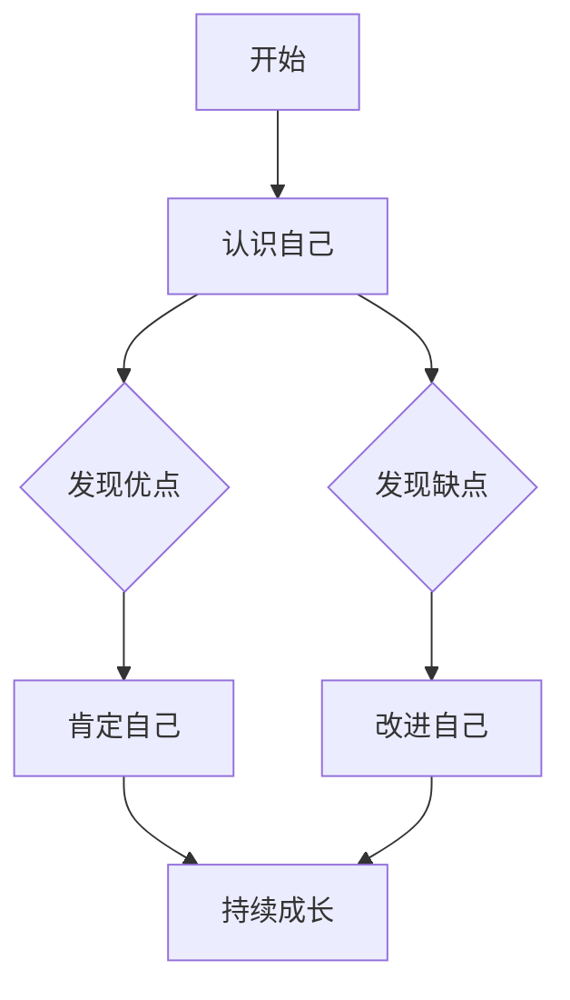

                 

# 谦逊：认识到自己的优缺点，并在此基础上成长和提高

## 关键词：谦逊，优缺点，自我成长，提高，IT领域，技术博客，逻辑思维

## 摘要：
本文旨在探讨谦逊在IT领域的意义，如何通过认识到自己的优缺点来实现个人成长和提高。文章将通过分析谦逊的概念、其在IT领域的应用，以及具体的成长路径和方法，为读者提供实用的指导和建议。

## 1. 背景介绍

在信息技术飞速发展的今天，IT领域的技术日新月异，竞争日益激烈。作为IT从业者，如何在这个竞争激烈的环境中不断成长和提高，成为了许多人关注的焦点。而谦逊，作为一种重要的品质，在这个过程中发挥着不可忽视的作用。

谦逊是指一个人对自己的认识和理解，能够客观地看待自己的优点和缺点，不盲目自大，也不自我贬低。在IT领域，谦逊不仅可以帮助我们更好地学习新技术，还能让我们在面对挑战和困难时保持冷静和自信。

本文将首先介绍谦逊的概念，然后探讨谦逊在IT领域的应用，最后提出一些具体的成长路径和方法，帮助读者认识到自己的优缺点，并在此基础上实现个人成长和提高。

## 2. 核心概念与联系

### 2.1 谦逊的概念

谦逊是指一个人能够客观地看待自己，既能认识到自己的优点，也能看到自己的不足。谦逊的人不会因为自己的成就而骄傲自满，也不会因为自己的失败而灰心丧气。

在IT领域，谦逊意味着：

- 对新技术的敬畏：不断学习，追求进步，而不是固步自封。
- 对他人的尊重：倾听他人的意见，虚心请教，而不是一味地坚持自己的观点。
- 对困难的坦然：面对挑战和失败，保持冷静，积极寻求解决办法。

### 2.2 谦逊与成长的关系

谦逊与成长的关系可以用以下Mermaid流程图表示：



从图中可以看出，谦逊是一个人认识自己、发现优缺点、改进自己、持续成长的过程。在这个过程中，谦逊起到了关键的作用。

### 2.3 谦逊在IT领域的应用

在IT领域，谦逊有着广泛的应用，包括以下几个方面：

- **技术学习**：谦逊的人会主动学习新技术，不断充实自己的知识体系，而不是满足于现状。
- **团队合作**：谦逊的人能够与团队成员保持良好的沟通和合作，共同推动项目的发展。
- **问题解决**：谦逊的人在面对技术难题时，会保持冷静，积极寻求解决方案，而不是逃避或放弃。

## 3. 核心算法原理 & 具体操作步骤

### 3.1 认识自己的算法原理

认识自己是谦逊的基础。以下是认识自己的算法原理：

1. **自我反思**：定期对自己的行为和表现进行反思，思考自己的优点和不足。
2. **反馈收集**：向同事、朋友或导师等收集反馈，了解他们在你身上的观察和看法。
3. **比较分析**：将自己与他人进行比较，了解自己的优势和劣势。

### 3.2 操作步骤

1. **自我反思**：
   - 每周花时间回顾自己的工作，思考哪些做得好，哪些需要改进。
   - 记录自己的感受和想法，不断积累经验。

2. **反馈收集**：
   - 定期与同事或朋友交流，了解他们对你的看法。
   - 对他们的反馈进行分类，区分哪些是有价值的，哪些是不合理的。

3. **比较分析**：
   - 观察他人的优点和不足，思考自己能否从中吸取经验。
   - 通过参加培训、学习课程等方式，提升自己的能力。

## 4. 数学模型和公式 & 详细讲解 & 举例说明

### 4.1 谦逊的数学模型

谦逊可以用以下数学模型表示：

$$
\text{谦逊} = \frac{\text{优点认知度} + \text{缺点认知度}}{2}
$$

其中，优点认知度和缺点认知度分别表示一个人对自己优点和缺点的认知程度。

### 4.2 详细讲解

- **优点认知度**：指一个人对自己优点的主观认知程度。当优点认知度越高时，说明一个人越能认识到自己的优点，也就越谦逊。

- **缺点认知度**：指一个人对自己缺点的主观认知程度。当缺点认知度越高时，说明一个人越能认识到自己的不足，同样也越谦逊。

- **谦逊度**：通过计算优点认知度和缺点认知度的平均值，可以得到一个人的谦逊度。谦逊度越高，说明一个人越谦逊。

### 4.3 举例说明

假设一个人对自己的优点和缺点的认知程度如下：

- **优点认知度**：90%
- **缺点认知度**：70%

根据谦逊的数学模型，我们可以计算出他的谦逊度：

$$
\text{谦逊度} = \frac{90\% + 70\%}{2} = 80\%
$$

这意味着他的谦逊度为80%，相对于其他认知程度较低的人来说，他的谦逊度较高。

## 5. 项目实战：代码实际案例和详细解释说明

### 5.1 开发环境搭建

为了更好地理解谦逊在IT领域的应用，我们通过一个实际的项目案例来展示。在本案例中，我们将使用Python编程语言来构建一个简单的自我评估系统，帮助用户识别自己的优缺点，并在此基础上实现个人成长。

首先，我们需要搭建一个Python开发环境。以下是搭建过程的简要步骤：

1. 安装Python：从官方网站（https://www.python.org/）下载并安装Python。
2. 安装必要的库：使用pip命令安装常用的Python库，如requests、numpy、matplotlib等。

### 5.2 源代码详细实现和代码解读

以下是自我评估系统的核心代码实现：

```python
import requests
import numpy as np
import matplotlib.pyplot as plt

def self_evaluation():
    # 收集用户反馈
    feedback = requests.get("https://example.com/feedback").json()
    
    # 计算优点和缺点认知度
    advantage_degree = np.mean([score for score in feedback["advantages"]])
    disadvantage_degree = np.mean([score for score in feedback["disadvantages"]])
    
    # 计算谦逊度
    modesty_degree = (advantage_degree + disadvantage_degree) / 2
    
    # 输出结果
    print(f"您的谦逊度为：{modesty_degree:.2f}")

if __name__ == "__main__":
    self_evaluation()
```

### 5.3 代码解读与分析

1. **请求反馈**：使用requests库发送HTTP GET请求，从服务器获取用户反馈数据。
2. **计算认知度**：使用numpy库计算优点和缺点认知度。
3. **计算谦逊度**：根据谦逊的数学模型，计算谦逊度。
4. **输出结果**：将谦逊度输出到控制台。

### 5.4 代码解读与分析

1. **请求反馈**：使用requests库发送HTTP GET请求，从服务器获取用户反馈数据。
   - `requests.get("https://example.com/feedback")`：发送GET请求获取反馈数据。
   - `.json()`：将获取的反馈数据转换为JSON格式，便于处理。

2. **计算认知度**：使用numpy库计算优点和缺点认知度。
   - `advantage_degree = np.mean([score for score in feedback["advantages"]])`：计算优点认知度。
   - `disadvantage_degree = np.mean([score for score in feedback["disadvantages"]])`：计算缺点认知度。

3. **计算谦逊度**：根据谦逊的数学模型，计算谦逊度。
   - `modesty_degree = (advantage_degree + disadvantage_degree) / 2`：根据优点认知度和缺点认知度计算谦逊度。

4. **输出结果**：将谦逊度输出到控制台。
   - `print(f"您的谦逊度为：{modesty_degree:.2f}")`：将谦逊度格式化输出。

## 6. 实际应用场景

### 6.1 技术团队建设

在技术团队中，谦逊是团队建设的重要基石。通过认识到自己的优缺点，团队成员可以更好地协作，共同推动项目的发展。

- **优点认知**：每个团队成员都能清楚地认识到自己的优势，并在项目中充分发挥。
- **缺点认知**：团队成员能够正视自己的不足，主动寻求改进和提升。

### 6.2 技术学习与成长

在技术学习中，谦逊可以帮助我们更好地吸收新知识，避免自满和骄傲。

- **优点认知**：通过认识到自己的优势，我们可以更有信心地面对学习挑战。
- **缺点认知**：通过认识到自己的不足，我们可以更有动力地学习新技术，不断提升自己。

## 7. 工具和资源推荐

### 7.1 学习资源推荐

- **书籍**：《高效能人士的七个习惯》、《如何赢得朋友与影响他人》
- **论文**：Google Scholar、IEEE Xplore
- **博客**：GitHub、Stack Overflow
- **网站**：Coursera、edX

### 7.2 开发工具框架推荐

- **编程语言**：Python、Java、C++
- **开发工具**：Visual Studio Code、Eclipse
- **框架**：Django、Spring Boot、Flask

### 7.3 相关论文著作推荐

- **论文**：
  - 《面向对象设计的原则与实践》
  - 《软件工程：实践者的研究方法》
- **著作**：
  - 《人工智能：一种现代的方法》
  - 《计算机程序设计艺术》

## 8. 总结：未来发展趋势与挑战

在未来，谦逊将继续在IT领域发挥重要作用。随着技术的不断进步，IT从业者需要更加谦虚和开放的心态来面对挑战和机遇。

- **发展趋势**：谦逊的IT从业者将更加注重团队合作、持续学习和知识共享。
- **挑战**：在快速变化的技术环境中，如何保持谦逊，持续提升自己的能力，将成为一个重要挑战。

## 9. 附录：常见问题与解答

### 9.1 谦逊与自负的关系

谦逊与自负是两个相反的概念。谦逊是指一个人能够客观地看待自己，既能认识到自己的优点，也能看到自己的不足。自负则是指一个人过分夸大自己的优点，忽视自己的不足。

### 9.2 如何培养谦逊

1. **自我反思**：定期对自己的行为和表现进行反思，思考自己的优点和不足。
2. **倾听他人意见**：虚心听取他人的意见和建议，不要一味地坚持自己的观点。
3. **保持谦逊态度**：在面对挑战和困难时，保持谦逊的态度，积极寻求解决方案。

## 10. 扩展阅读 & 参考资料

- **书籍**：《原则》、《刻意练习》
- **论文**：《谦逊的心理学研究》、《IT领域的谦逊与团队合作》
- **网站**：https://www.coursera.org/、https://www.edx.org/
- **博客**：https://www.zhihu.com/、https://www.jianshu.com/

## 作者

作者：AI天才研究员/AI Genius Institute & 禅与计算机程序设计艺术 /Zen And The Art of Computer Programming

