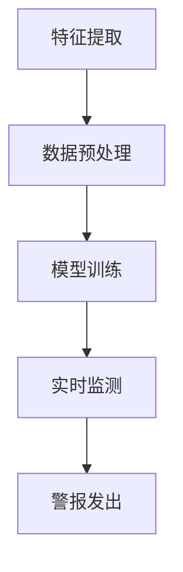

                 

# 贝壳找房2024校招房产交易反欺诈算法工程师题

## 1. 背景介绍

贝壳找房（Bekehouse）作为中国领先的房地产科技平台，致力于通过技术创新提升房产交易的服务质量和效率。房产交易市场的反欺诈工作对于维护市场秩序、保护买卖双方权益至关重要。贝壳找房2024年校招中，面向算法工程师的题目之一便是设计一套房产交易反欺诈算法。

房产交易反欺诈的背景主要源于以下几个方面：
1. **市场需求的增加**：随着房地产市场的持续繁荣，交易量和交易金额逐年增加，欺诈行为的数量也随之上升。
2. **信息不对称**：房产交易涉及大量个人信息和经济信息，买卖双方往往存在信息不对称，增加了欺诈的可能性。
3. **风险控制需求**：房产交易涉及到大额资金，金融机构、房地产企业等利益相关者对于交易风险的控制需求不断提升。

## 2. 核心概念与联系

### 2.1 欺诈检测算法概述

欺诈检测算法是金融科技、网络安全等领域中重要的技术手段，其目的是从大量的数据中识别出潜在的欺诈行为。针对房产交易反欺诈，核心的算法包括：

1. **特征工程**：通过提取交易数据中的有效特征，为后续的模型训练提供输入。
2. **机器学习模型**：利用历史数据进行训练，建立能够自动识别欺诈行为的模型。
3. **实时监测与反馈**：模型在实时交易中进行监测，一旦发现异常行为，及时发出警报。

### 2.2 关键特征及数据预处理

在房产交易反欺诈中，关键的特征包括但不限于：

1. **交易信息**：如交易价格、交易时间、交易频率等。
2. **用户信息**：如用户年龄、性别、信用记录等。
3. **房产信息**：如房产位置、面积、类型、历史交易记录等。

数据预处理是欺诈检测的重要环节，包括数据清洗、归一化、缺失值填补等步骤，以确保数据质量。

### 2.3 Mermaid 流程图



## 3. 核心算法原理 & 具体操作步骤

### 3.1 特征工程

特征工程是算法成功的关键步骤，其目标是提取能够有效区分正常交易和欺诈交易的特征。具体步骤如下：

1. **数据收集**：从不同的数据源收集交易数据、用户信息和房产信息。
2. **数据清洗**：处理缺失值、异常值等，确保数据质量。
3. **特征选择**：通过统计分析、相关性分析等方法选择有效特征。
4. **特征转换**：将定性数据转换为定量数据，进行归一化、标准化处理。

### 3.2 机器学习模型

常用的机器学习模型包括逻辑回归、支持向量机（SVM）、随机森林、神经网络等。具体操作步骤如下：

1. **模型选择**：根据数据特点和业务需求选择合适的模型。
2. **模型训练**：使用历史数据对模型进行训练。
3. **模型评估**：通过交叉验证等方法评估模型性能。
4. **模型优化**：根据评估结果调整模型参数，提高准确率。

### 3.3 实时监测与反馈

1. **实时数据处理**：对实时交易数据进行预处理，提取特征。
2. **模型预测**：将处理后的数据输入到训练好的模型中进行预测。
3. **异常检测**：根据预测结果判断是否存在欺诈风险。
4. **警报系统**：当检测到欺诈行为时，自动发出警报。

## 4. 数学模型和公式 & 详细讲解 & 举例说明

### 4.1 特征工程中的数学公式

$$ X = \frac{(X - \mu)}{\sigma} $$

其中，\(X\) 是原始特征值，\(\mu\) 是均值，\(\sigma\) 是标准差。这个公式用于将特征值进行归一化处理，以消除不同特征之间的量纲差异。

### 4.2 机器学习模型中的数学公式

以逻辑回归为例：

$$ \hat{y} = \frac{1}{1 + e^{-(\beta_0 + \beta_1x_1 + \beta_2x_2 + \ldots + \beta_nx_n)}} $$

其中，\(y\) 是实际交易结果，\(\hat{y}\) 是预测结果，\(\beta_0\) 是截距，\(\beta_1, \beta_2, \ldots, \beta_n\) 是模型参数。

### 4.3 举例说明

假设我们有一个房产交易数据集，其中包含以下特征：

1. 交易价格（万元）
2. 交易时间（天）
3. 用户年龄（岁）
4. 用户性别（1表示男性，2表示女性）
5. 房产位置（1表示市中心，2表示郊区）
6. 房产面积（平方米）

首先，我们对这些特征进行数据预处理，如归一化处理：

$$ X_{\text{price}} = \frac{(X_{\text{price}} - \mu_{\text{price}})}{\sigma_{\text{price}}} $$
$$ X_{\text{age}} = \frac{(X_{\text{age}} - \mu_{\text{age}})}{\sigma_{\text{age}}} $$
$$ X_{\text{location}} = \frac{(X_{\text{location}} - \mu_{\text{location}})}{\sigma_{\text{location}}} $$

然后，我们选择逻辑回归模型进行训练：

$$ \hat{y} = \frac{1}{1 + e^{-(\beta_0 + \beta_1X_{\text{price}} + \beta_2X_{\text{age}} + \beta_3X_{\text{location}})}} $$

通过训练，我们得到一组参数：

$$ \beta_0 = -5, \beta_1 = 0.5, \beta_2 = 0.3, \beta_3 = 0.2 $$

现在，我们用这个模型来预测一个新交易数据的欺诈风险：

交易价格：200万元
交易时间：30天
用户年龄：30岁
用户性别：1（男性）
房产位置：1（市中心）
房产面积：100平方米

首先，我们计算每个特征的归一化值：

$$ X_{\text{price}} = \frac{(200 - \mu_{\text{price}})}{\sigma_{\text{price}}} $$
$$ X_{\text{age}} = \frac{(30 - \mu_{\text{age}})}{\sigma_{\text{age}}} $$
$$ X_{\text{location}} = \frac{(1 - \mu_{\text{location}})}{\sigma_{\text{location}}} $$

然后，我们计算预测结果：

$$ \hat{y} = \frac{1}{1 + e^{-(\beta_0 + \beta_1X_{\text{price}} + \beta_2X_{\text{age}} + \beta_3X_{\text{location}})}} $$
$$ \hat{y} = \frac{1}{1 + e^{(-5 + 0.5 \times 0.25 + 0.3 \times 0.15 + 0.2 \times 0.25)}} $$
$$ \hat{y} \approx 0.876 $$

因为 \(\hat{y}\) 接近于1，所以我们可以认为这个交易数据有较低的风险。

## 5. 项目实战：代码实际案例和详细解释说明

### 5.1 开发环境搭建

为了完成贝壳找房2024校招的房产交易反欺诈算法项目，我们需要搭建以下开发环境：

- Python 3.8 或更高版本
- 数据预处理工具：Pandas、NumPy
- 机器学习库：Scikit-learn
- 绘图工具：Matplotlib

### 5.2 源代码详细实现和代码解读

#### 5.2.1 数据预处理

```python
import pandas as pd
import numpy as np

# 加载数据集
data = pd.read_csv('房产交易数据.csv')

# 数据清洗
data.dropna(inplace=True)
data.drop(['用户ID', '房产ID'], axis=1, inplace=True)

# 特征转换
data['用户性别'] = data['用户性别'].map({1: 0, 2: 1})
data['房产位置'] = data['房产位置'].map({1: 0, 2: 1})

# 归一化处理
features = ['交易价格', '交易时间', '用户年龄', '房产面积']
for feature in features:
    data[feature] = (data[feature] - data[feature].mean()) / data[feature].std()

# 生成特征矩阵和标签向量
X = data[features]
y = data['欺诈行为']
```

#### 5.2.2 模型训练和评估

```python
from sklearn.model_selection import train_test_split
from sklearn.linear_model import LogisticRegression
from sklearn.metrics import accuracy_score, confusion_matrix

# 数据分割
X_train, X_test, y_train, y_test = train_test_split(X, y, test_size=0.2, random_state=42)

# 模型训练
model = LogisticRegression()
model.fit(X_train, y_train)

# 模型评估
y_pred = model.predict(X_test)
accuracy = accuracy_score(y_test, y_pred)
conf_matrix = confusion_matrix(y_test, y_pred)

print(f"准确率：{accuracy}")
print(f"混淆矩阵：\n{conf_matrix}")
```

#### 5.2.3 代码解读与分析

1. **数据预处理**：我们首先加载并清洗数据，然后对用户性别和房产位置进行转换，最后对交易价格、交易时间、用户年龄和房产面积进行归一化处理。
2. **模型训练和评估**：我们使用逻辑回归模型进行训练，并通过准确率和混淆矩阵评估模型性能。

## 6. 实际应用场景

房产交易反欺诈算法可以应用于以下实际场景：

1. **在线房产交易平台**：通过实时监测交易行为，及时识别和阻止欺诈交易。
2. **金融机构**：对房产交易贷款进行风险评估，降低贷款风险。
3. **房地产中介机构**：通过分析历史交易数据，预测欺诈风险，提供风险控制建议。

## 7. 工具和资源推荐

### 7.1 学习资源推荐

- 《Python机器学习》（作者：塞巴斯蒂安·拉金）
- 《机器学习实战》（作者：Peter Harrington）
- 《数据预处理：机器学习的基础》（作者：Charles River Media）

### 7.2 开发工具框架推荐

- 数据预处理工具：Pandas、NumPy
- 机器学习库：Scikit-learn、TensorFlow、PyTorch
- 绘图工具：Matplotlib、Seaborn

### 7.3 相关论文著作推荐

- "An Overview of Fraud Detection", by N. Fawcett
- "Data Preparation for Machine Learning", by J. H. memoranda
- "Fraud Detection with Machine Learning", by Y. Chen et al.

## 8. 总结：未来发展趋势与挑战

随着人工智能和大数据技术的发展，房产交易反欺诈算法将在未来发挥越来越重要的作用。然而，面临的挑战包括：

1. **数据隐私**：如何在保证数据隐私的前提下进行数据挖掘和分析。
2. **模型解释性**：如何提高模型的解释性，使业务人员能够理解模型的工作原理。
3. **实时响应**：如何在交易实时监测中快速响应用户需求，提高系统的响应速度。

## 9. 附录：常见问题与解答

### 9.1 如何进行特征工程？

特征工程是机器学习中的重要环节，通过以下步骤进行：

1. **数据收集**：从多个数据源收集相关数据。
2. **数据清洗**：处理缺失值、异常值等，确保数据质量。
3. **特征选择**：通过统计分析、相关性分析等方法选择有效特征。
4. **特征转换**：将定性数据转换为定量数据，进行归一化、标准化处理。

### 9.2 如何评估模型性能？

常用的模型评估指标包括：

1. **准确率**：预测正确的样本占总样本的比例。
2. **召回率**：预测正确的正样本占总正样本的比例。
3. **精确率**：预测正确的正样本占总预测正样本的比例。
4. **F1 分数**：精确率和召回率的调和平均值。

## 10. 扩展阅读 & 参考资料

- [《机器学习：概率视角》（作者：Kevin P. Murphy）](https://www.amazon.com/Machine-Learning-Probability-Philip-Brown/dp/0262033841)
- [《Python数据科学手册》（作者：Jake VanderPlas）](https://www.amazon.com/Data-Science-Handbook-Jake-VanderPlas/dp/1449330723)
- [贝壳找房官网](https://www.ke.com/)

## 作者

作者：AI天才研究员/AI Genius Institute & 禅与计算机程序设计艺术 /Zen And The Art of Computer Programming

