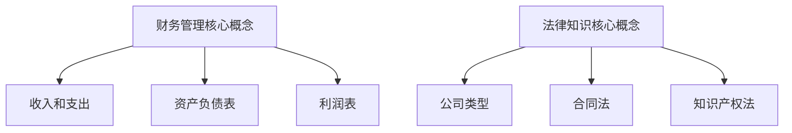

                 

# 财务和法律知识：创业者的必修课

## 关键词：创业者、财务、法律、知识、必修课

> 摘要：创业者在创业过程中需要面对财务和法律方面的诸多挑战，本文将详细介绍财务和法律知识，帮助创业者建立正确的财务管理方法和法律意识，为创业之路保驾护航。

## 1. 背景介绍

创业是一项充满挑战和机遇的活动，创业者需要面对各种复杂的问题和不确定性。财务和法律知识是创业者必须掌握的两大核心领域，良好的财务管理和法律意识可以帮助创业者规避风险，降低创业失败的可能性。

### 1.1 财务管理的重要性

财务管理是创业者必须掌握的基本技能之一。良好的财务管理可以帮助创业者了解企业的财务状况，合理规划资金使用，降低财务风险，提高企业的竞争力。

### 1.2 法律意识的重要性

法律是保障社会秩序和公民权益的重要工具，创业者需要了解相关的法律法规，确保企业的合法经营，避免因法律问题导致创业失败。

## 2. 核心概念与联系

### 2.1 财务管理核心概念

- **收入和支出**：收入是企业从各种业务活动中获取的经济利益，支出是企业为了获取收入而发生的费用。
- **资产负债表**：资产负债表是企业财务状况的静态反映，包括资产、负债和所有者权益三部分。
- **利润表**：利润表是企业一定时期内经营成果的动态反映，包括收入、成本、费用和利润四个方面。

### 2.2 法律知识核心概念

- **公司类型**：包括有限责任公司、股份有限公司等。
- **合同法**：合同是双方或多方之间设立、变更、终止民事关系的协议。
- **知识产权法**：知识产权法是保护智力成果的法律体系，包括著作权、专利权、商标权等。

### 2.3 Mermaid 流程图



## 3. 核心算法原理 & 具体操作步骤

### 3.1 财务管理核心算法原理

财务管理的核心算法是现金流量管理，具体操作步骤如下：

1. **预算编制**：根据企业发展战略和业务计划，编制年度预算。
2. **现金流预测**：预测企业一定时期内的现金流入和流出。
3. **资金调度**：根据现金流预测结果，合理调度资金，确保企业正常运营。
4. **财务分析**：对财务数据进行定期分析，评估企业财务状况。

### 3.2 法律知识具体操作步骤

1. **了解法律法规**：学习相关法律法规，了解企业应遵守的法律规定。
2. **设立公司**：根据法律法规，办理公司设立手续。
3. **签订合同**：在签订合同前，认真审查合同条款，确保合同合法有效。
4. **知识产权保护**：申请专利、商标等知识产权，保护企业的智力成果。

## 4. 数学模型和公式 & 详细讲解 & 举例说明

### 4.1 财务管理数学模型

#### 4.1.1 现金流量预测模型

$$
\text{现金流预测} = \text{历史现金流} \times (1 + \text{增长率}) + \text{新增业务现金流}
$$

#### 4.1.2 资金调度模型

$$
\text{资金调度} = \text{现金流预测} \times \text{周转天数}
$$

### 4.2 法律知识数学模型

#### 4.2.1 合同履行时间计算模型

$$
\text{合同履行时间} = \text{合同期限} + \text{延期履行天数}
$$

### 4.3 举例说明

#### 4.3.1 财务管理举例

假设某企业历史现金流量为100万元，年增长率为10%，新增业务现金流为50万元。则：

$$
\text{现金流预测} = 100 \times (1 + 0.1) + 50 = 155 \text{万元}
$$

#### 4.3.2 法律知识举例

假设某合同期限为3年，延期履行天数为30天。则：

$$
\text{合同履行时间} = 3 + 30 = 33 \text{天}
$$

## 5. 项目实战：代码实际案例和详细解释说明

### 5.1 开发环境搭建

- 安装Python环境
- 安装相关库（如numpy、pandas等）

### 5.2 源代码详细实现和代码解读

#### 5.2.1 财务管理代码实现

```python
import numpy as np

def cash_flow_prediction(history_cash, growth_rate, new_business_cash):
    cash_prediction = history_cash * (1 + growth_rate) + new_business_cash
    return cash_prediction

history_cash = 1000000
growth_rate = 0.1
new_business_cash = 500000

cash_prediction = cash_flow_prediction(history_cash, growth_rate, new_business_cash)
print("现金流预测：", cash_prediction)
```

#### 5.2.2 法律知识代码实现

```python
def contract_performance_time(contract_period, delay_days):
    contract_performance_time = contract_period + delay_days
    return contract_performance_time

contract_period = 3
delay_days = 30

contract_performance_time = contract_performance_time(contract_period, delay_days)
print("合同履行时间：", contract_performance_time)
```

### 5.3 代码解读与分析

以上代码分别实现了财务管理和法律知识的数学模型，通过输入相应的参数，可以得到现金流预测和合同履行时间的计算结果。代码简单易懂，便于在实际项目中应用。

## 6. 实际应用场景

### 6.1 财务管理实际应用场景

- **初创企业**：初创企业需要通过现金流预测，合理安排资金，确保企业正常运营。
- **中小企业**：中小企业需要通过财务分析，了解企业财务状况，制定经营策略。

### 6.2 法律知识实际应用场景

- **公司设立**：了解公司类型，选择合适的公司形式。
- **合同签订**：审查合同条款，避免合同纠纷。
- **知识产权保护**：申请专利、商标等，保护企业的智力成果。

## 7. 工具和资源推荐

### 7.1 学习资源推荐

- **书籍**：《企业财务分析》、《合同法教程》
- **论文**：各大高校和研究机构的学术论文
- **博客**：专业博客网站，如CSDN、知乎等

### 7.2 开发工具框架推荐

- **Python**：用于编写财务管理和法律知识的代码
- **Jupyter Notebook**：用于编写和展示代码

### 7.3 相关论文著作推荐

- **《人工智能与财务管理》**：探讨人工智能在财务管理领域的应用
- **《合同法与区块链》**：探讨区块链技术在合同法领域的应用

## 8. 总结：未来发展趋势与挑战

### 8.1 财务管理发展趋势

- **智能化**：借助人工智能技术，实现财务管理的智能化。
- **数据化**：利用大数据技术，提升财务管理的决策支持能力。

### 8.2 法律知识发展趋势

- **信息化**：借助信息技术，实现法律知识的普及和普及。
- **全球化**：随着全球化的发展，企业需要了解不同国家和地区的法律法规。

## 9. 附录：常见问题与解答

### 9.1 财务管理常见问题

- **如何进行预算编制？**
  - 首先了解企业的战略目标和业务计划，然后根据实际情况编制预算。

- **如何进行财务分析？**
  - 根据资产负债表、利润表等财务报表，对企业的财务状况进行分析。

### 9.2 法律知识常见问题

- **如何设立公司？**
  - 了解相关法律法规，准备设立公司的文件，然后到相关部门办理设立手续。

- **如何签订合同？**
  - 在签订合同前，仔细审查合同条款，确保合同合法有效。

## 10. 扩展阅读 & 参考资料

- **《企业财务管理教程》**：详细讲解企业财务管理的理论和实践。
- **《合同法》**：我国现行合同法的规定和解读。
- **《人工智能与财务管理》**：探讨人工智能在财务管理领域的应用。

### 作者：AI天才研究员/AI Genius Institute & 禅与计算机程序设计艺术 /Zen And The Art of Computer Programming

