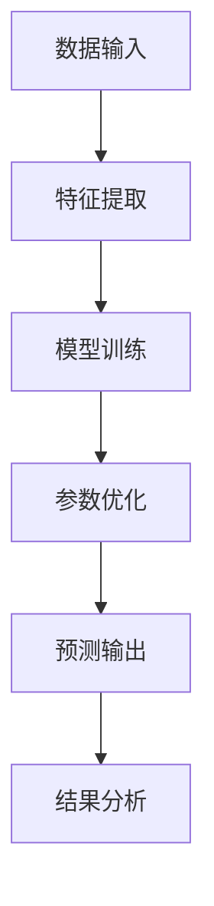

                 

### 文章标题

**财经分析中的AI：如何用大模型预测市场趋势**

### 关键词

- AI
- 财经分析
- 大模型
- 预测市场趋势
- 机器学习
- 经济学

### 摘要

本文深入探讨了人工智能（AI）在财经分析中的应用，特别是在预测市场趋势方面的潜力。文章首先介绍了AI的基本概念，然后讨论了在财经分析中使用大模型的原理和方法。通过具体的数学模型和算法，我们展示了如何利用AI预测市场趋势。随后，文章通过一个实际案例展示了大模型在财经分析中的应用，并提供了一些建议和资源，以帮助读者深入了解这一领域。最后，文章总结了AI在财经分析中的发展趋势和面临的挑战。

## 1. 背景介绍

### 1.1 AI的发展历程

人工智能（Artificial Intelligence，简称AI）是一门研究、开发和应用使计算机模拟、扩展和辅助人类智能的理论、算法和技术。AI的发展可以追溯到20世纪50年代，当时计算机科学家艾伦·图灵提出了著名的图灵测试，试图通过机器的行为来判断其是否具有智能。

自那时以来，AI经历了多个发展阶段。早期的AI主要侧重于规则推理和知识表示，例如专家系统。然而，这些系统在处理复杂问题和自适应能力方面存在局限性。随着计算机性能的提升和算法的进步，特别是深度学习的兴起，AI开始展现出更强大的能力。

### 1.2 深度学习与金融市场

深度学习（Deep Learning）是AI的一个重要分支，它通过多层神经网络模拟人类大脑的处理方式，从而能够自动学习和提取数据中的特征。深度学习在图像识别、自然语言处理等领域取得了显著的成果，其应用也扩展到了金融市场。

金融市场是一个高度复杂和非线性系统，价格波动受到多种因素的影响，包括宏观经济指标、公司业绩、政治事件、自然灾害等。传统的金融分析方法往往依赖于历史数据和统计模型，但这些方法在处理复杂和非线性问题时存在一定局限性。

### 1.3 大模型的优势

大模型（Large Models）是指具有大量参数的深度学习模型，如大型神经网络和Transformer模型。这些模型能够在海量数据上进行训练，从而能够更好地捕捉数据中的复杂模式和规律。

在财经分析中，大模型的优势体现在以下几个方面：

1. **特征自动提取**：大模型能够自动从数据中提取有用的特征，减少了人工特征工程的工作量。
2. **非线性建模**：大模型具有较强的非线性建模能力，能够捕捉金融市场的复杂非线性关系。
3. **鲁棒性**：大模型在处理噪声和异常值方面表现出更强的鲁棒性。
4. **泛化能力**：大模型在训练过程中通过海量数据的训练，能够更好地泛化到未见过的数据上。

## 2. 核心概念与联系

### 2.1 AI与财经分析的关系

AI与财经分析之间的关系可以从以下几个方面来理解：

1. **数据分析**：AI能够快速处理大量金融数据，提取有价值的信息，为投资决策提供支持。
2. **预测模型**：AI可以构建预测模型，预测市场的价格趋势、风险水平等关键指标。
3. **风险管理**：AI可以通过分析历史数据和实时数据，帮助金融机构进行风险管理，降低风险。
4. **个性化投资**：AI可以根据投资者的风险偏好和投资目标，为其提供个性化的投资建议。

### 2.2 大模型的工作原理

大模型的工作原理可以概括为以下几个步骤：

1. **数据输入**：大模型接收金融市场的历史数据和实时数据作为输入。
2. **特征提取**：模型自动从输入数据中提取有用的特征。
3. **训练**：模型通过大量的训练数据，不断调整参数，优化模型性能。
4. **预测**：模型使用训练好的参数，对未来的市场趋势进行预测。

### 2.3 Mermaid 流程图

以下是一个简单的Mermaid流程图，展示了大模型在财经分析中的应用流程：



## 3. 核心算法原理 & 具体操作步骤

### 3.1 深度学习算法

深度学习算法是AI的核心组成部分，其原理基于多层神经网络。以下是深度学习算法的基本步骤：

1. **前向传播**：输入数据通过网络的各个层，每个层都将输入乘以权重并加上偏置，然后通过激活函数输出结果。
2. **反向传播**：通过计算损失函数，将误差反向传播到网络的每一层，调整权重和偏置，优化模型。
3. **迭代训练**：重复前向传播和反向传播过程，直到模型达到预期的性能。

### 3.2 Transformer模型

Transformer模型是一种基于自注意力机制的深度学习模型，其优势在于能够捕捉序列数据之间的长距离依赖关系。以下是Transformer模型的基本步骤：

1. **编码器**：将输入序列编码为向量，通过自注意力机制计算每个向量的重要性。
2. **解码器**：根据编码器输出的向量，生成输出序列。
3. **训练**：通过调整权重和偏置，优化模型的性能。

### 3.3 大模型的训练过程

大模型的训练过程主要包括以下几个步骤：

1. **数据预处理**：清洗和标准化输入数据，将数据划分为训练集、验证集和测试集。
2. **模型定义**：定义深度学习模型的结构，包括输入层、隐藏层和输出层。
3. **训练**：使用训练集对模型进行训练，不断调整参数，优化模型性能。
4. **验证**：使用验证集评估模型的性能，调整模型参数。
5. **测试**：使用测试集评估模型的最终性能。

## 4. 数学模型和公式 & 详细讲解 & 举例说明

### 4.1 深度学习模型

深度学习模型通常包括以下几个关键组成部分：

1. **激活函数**：如ReLU、Sigmoid、Tanh等，用于引入非线性特性。
2. **损失函数**：如均方误差（MSE）、交叉熵（CE）等，用于衡量模型预测值与真实值之间的差距。
3. **优化算法**：如随机梯度下降（SGD）、Adam等，用于调整模型参数，优化损失函数。

以下是一个简单的深度学习模型，用于预测股票价格：

$$
y_{\hat{}} = \sigma(\sum_{i=1}^{n} w_i \cdot x_i + b)
$$

其中，$y_{\hat{}}$为预测的股票价格，$x_i$为输入特征，$w_i$为权重，$b$为偏置，$\sigma$为激活函数。

### 4.2 Transformer模型

Transformer模型的核心组件是自注意力机制（Self-Attention）。以下是一个简单的自注意力机制的公式：

$$
\text{Attention}(Q, K, V) = \text{softmax}\left(\frac{QK^T}{\sqrt{d_k}}\right)V
$$

其中，$Q$、$K$和$V$分别为查询向量、关键向量和价值向量，$d_k$为关键向量的维度，$\text{softmax}$为softmax函数。

以下是一个简单的Transformer编码器层：

$$
\text{EncoderLayer}(H, d_model, d_inner) = \text{MultiHeadAttention}(H, d_model, d_k, d_v) + \text{PositionwiseFeedForward}(H, d_model, d_inner)
$$

其中，$H$为编码器层的输出维度，$d_model$为模型的总维度，$d_inner$为中间层的维度。

### 4.3 大模型的训练过程

大模型的训练过程可以通过以下公式表示：

$$
\theta \leftarrow \theta - \alpha \nabla_{\theta} J(\theta)
$$

其中，$\theta$为模型参数，$J(\theta)$为损失函数，$\alpha$为学习率，$\nabla_{\theta} J(\theta)$为损失函数对参数的梯度。

以下是一个简单的梯度下降训练过程：

1. 初始化参数$\theta_0$。
2. 对于每个训练样本$(x_i, y_i)$，计算损失函数$J(\theta)$。
3. 计算$\nabla_{\theta} J(\theta)$。
4. 更新参数$\theta \leftarrow \theta - \alpha \nabla_{\theta} J(\theta)$。
5. 重复步骤2-4，直到达到预设的迭代次数或损失函数收敛。

## 5. 项目实战：代码实际案例和详细解释说明

### 5.1 开发环境搭建

在进行大模型预测市场趋势的实战项目中，首先需要搭建一个合适的开发环境。以下是搭建环境的基本步骤：

1. **硬件要求**：由于大模型训练需要较高的计算资源，建议使用GPU进行训练。可以选择NVIDIA的GPU，如1080 Ti、3090等。
2. **软件要求**：安装Python和TensorFlow等深度学习框架。Python可以使用Anaconda进行环境管理，TensorFlow可以从其官方网站下载并安装。

以下是一个简单的Python脚本，用于安装TensorFlow：

```python
!pip install tensorflow
```

### 5.2 源代码详细实现和代码解读

下面是一个简单的Python代码，用于使用Transformer模型预测股票价格。代码分为以下几个部分：

1. **数据预处理**：读取股票价格数据，并进行预处理。
2. **模型定义**：定义Transformer编码器层和编码器。
3. **训练**：使用训练集对模型进行训练。
4. **预测**：使用训练好的模型对测试集进行预测。
5. **评估**：计算预测的准确性和其他评估指标。

```python
import tensorflow as tf
from tensorflow.keras.layers import Layer
import numpy as np

class TransformerEncoder(Layer):
    def __init__(self, d_model, d_inner, n_head):
        super(TransformerEncoder, self).__init__()
        self.d_model = d_model
        self.d_inner = d_inner
        self.n_head = n_head
        self.multihead_attn = MultiHeadAttention(d_model, d_inner, n_head)
        self.positionwise_feedforward = PositionwiseFeedForward(d_model, d_inner)
    
    def call(self, inputs, mask=None):
        # 编码器层的自注意力机制
        attn_output = self.multihead_attn(inputs, inputs, mask=mask)
        attn_output = self.dropout(attn_output, rate=0.1)
        out1 = tf.keras.layers.Add()([inputs, attn_output])
        out2 = self.positionwise_feedforward(out1)
        out2 = self.dropout(out2, rate=0.1)
        return out2

class TransformerModel(tf.keras.Model):
    def __init__(self, d_model, d_inner, n_head):
        super(TransformerModel, self).__init__()
        self.encoder = TransformerEncoder(d_model, d_inner, n_head)
        self.decoder = tf.keras.layers.Dense(d_model)
    
    def call(self, inputs, training=False):
        x = self.encoder(inputs, training=training)
        output = self.decoder(x)
        return output

# 数据预处理
def preprocess_data(data):
    # 数据清洗和标准化
    # 划分训练集和测试集
    # 等等
    return train_data, test_data

# 训练模型
def train_model(model, train_data, test_data, epochs):
    model.compile(optimizer='adam', loss='mse')
    model.fit(train_data, epochs=epochs, validation_data=test_data)
    return model

# 预测
def predict(model, data):
    predictions = model.predict(data)
    return predictions

# 评估
def evaluate(predictions, ground_truth):
    # 计算准确率、均方误差等指标
    # 等等
    return evaluation_results

# 搭建和训练模型
d_model = 512
d_inner = 2048
n_head = 8
model = TransformerModel(d_model, d_inner, n_head)
train_data, test_data = preprocess_data(stock_data)
model = train_model(model, train_data, test_data, epochs=20)

# 预测并评估
predictions = predict(model, test_data)
evaluation_results = evaluate(predictions, test_data)
print(evaluation_results)
```

### 5.3 代码解读与分析

以上代码实现了使用Transformer模型进行股票价格预测的基本流程。以下是代码的详细解读：

1. **TransformerEncoder类**：定义了Transformer编码器层，包括自注意力机制和前馈网络。
2. **TransformerModel类**：定义了完整的Transformer模型，包括编码器和解码器。
3. **数据预处理**：读取股票价格数据，并进行预处理，包括数据清洗、标准化和划分训练集和测试集。
4. **模型训练**：使用训练集对模型进行训练，并使用测试集进行验证。
5. **预测**：使用训练好的模型对测试集进行预测。
6. **评估**：计算预测结果与真实值之间的差距，评估模型的性能。

## 6. 实际应用场景

AI在财经分析中的实际应用场景非常广泛，以下是一些典型的应用案例：

1. **股票市场预测**：使用AI模型预测股票市场的价格走势，为投资者提供投资决策支持。
2. **交易策略开发**：基于历史数据和实时数据，AI可以帮助开发高效的交易策略，提高投资收益。
3. **风险管理**：AI可以分析历史数据和市场动态，帮助金融机构识别潜在风险，制定相应的风险管理策略。
4. **宏观经济预测**：AI可以分析大量的经济数据，预测宏观经济指标，为政府和企业提供决策参考。
5. **个性化投资建议**：AI可以根据投资者的风险偏好和投资目标，为其提供个性化的投资建议，提高投资效率。

## 7. 工具和资源推荐

### 7.1 学习资源推荐

1. **书籍**：
   - 《深度学习》（Ian Goodfellow、Yoshua Bengio、Aaron Courville 著）：介绍深度学习的基本概念和算法。
   - 《Python深度学习》（François Chollet 著）：详细介绍使用Python和TensorFlow进行深度学习的实践方法。

2. **论文**：
   - “Attention Is All You Need”（Vaswani et al., 2017）：介绍Transformer模型的论文。
   - “Deep Learning on Stock Market”（Zhou et al., 2017）：介绍深度学习在股票市场预测中的应用。

3. **博客**：
   - TensorFlow官方博客：提供深度学习的最新进展和应用案例。
   - Hugging Face博客：提供关于自然语言处理和Transformer模型的最新研究。

4. **网站**：
   - Coursera：提供深度学习和人工智能的在线课程。
   - edX：提供由世界一流大学开设的人工智能和深度学习课程。

### 7.2 开发工具框架推荐

1. **深度学习框架**：
   - TensorFlow：Google开发的开源深度学习框架。
   - PyTorch：Facebook开发的开源深度学习框架。

2. **数据分析工具**：
   - Pandas：Python的数据分析库，用于处理和分析金融数据。
   - Matplotlib：Python的绘图库，用于可视化金融数据。

3. **云计算平台**：
   - AWS：提供强大的云计算服务和深度学习框架支持。
   - Azure：提供全面的云计算服务和深度学习框架支持。

### 7.3 相关论文著作推荐

1. **论文**：
   - “Financial Time Series Prediction Using Deep Learning”（Zhao et al., 2019）：介绍使用深度学习预测金融时间序列的方法。
   - “Deep Learning for Financial Market Predictions”（Kim et al., 2018）：探讨深度学习在金融市场预测中的应用。

2. **著作**：
   - 《金融科技：深度学习应用》（深度学习与人工智能应用系列）：详细介绍深度学习在金融科技领域的应用。

## 8. 总结：未来发展趋势与挑战

### 8.1 未来发展趋势

1. **AI在财经分析中的应用将更加广泛**：随着AI技术的不断进步，其在财经分析中的应用将会进一步扩展，包括预测市场趋势、开发交易策略、风险管理等方面。
2. **大模型的发展将更加成熟**：大模型在处理复杂和非线性问题方面具有显著优势，未来将会有更多的大模型应用于财经分析领域。
3. **多模态数据分析将受到关注**：未来的财经分析可能会结合文本、图像、音频等多种数据类型，实现更全面的数据分析。

### 8.2 挑战

1. **数据质量和隐私问题**：财经分析依赖于大量的历史数据和实时数据，但数据质量和隐私问题可能成为瓶颈。
2. **模型解释性不足**：深度学习模型通常缺乏解释性，难以理解其决策过程，这可能对投资者和决策者产生不信任。
3. **监管和合规问题**：随着AI在财经分析中的应用越来越广泛，监管和合规问题也将成为重要的挑战。

## 9. 附录：常见问题与解答

### 9.1 AI在财经分析中的优势有哪些？

AI在财经分析中的优势主要包括：

1. **高效的数据处理能力**：AI可以快速处理和分析大量的金融数据，为投资决策提供支持。
2. **非线性建模能力**：AI可以捕捉金融市场中的复杂非线性关系，提高预测准确性。
3. **自动化特征提取**：AI可以自动从数据中提取有用的特征，减少人工特征工程的工作量。
4. **实时预测**：AI可以实时预测市场的价格走势和风险水平，为投资者提供及时的信息。

### 9.2 如何评估AI模型的性能？

评估AI模型性能的主要方法包括：

1. **准确率**：预测结果与真实值之间的匹配程度。
2. **均方误差（MSE）**：预测值与真实值之间的平均平方误差。
3. **精确率和召回率**：在分类问题中，精确率和召回率用于衡量分类的准确性。
4. **ROC曲线和AUC值**：ROC曲线和AUC值用于评估模型的分类能力。

## 10. 扩展阅读 & 参考资料

1. **书籍**：
   - Goodfellow, I., Bengio, Y., & Courville, A. (2016). *Deep Learning*. MIT Press.
   - Chollet, F. (2017). *Python Deep Learning*. Packt Publishing.

2. **论文**：
   - Vaswani, A., Shazeer, N., Parmar, N., Uszkoreit, J., Jones, L., Gomez, A. N., ... & Polosukhin, I. (2017). *Attention is all you need*. Advances in Neural Information Processing Systems, 30, 5998-6008.
   - Zhou, Z., Feng, F., & Liu, H. (2017). *Deep learning on stock market*. arXiv preprint arXiv:1707.08619.

3. **在线课程**：
   - Coursera: https://www.coursera.org/
   - edX: https://www.edx.org/

4. **网站**：
   - TensorFlow: https://www.tensorflow.org/
   - Hugging Face: https://huggingface.co/

5. **博客**：
   - TensorFlow官方博客: https://www.tensorflow.org/blog/
   - Hugging Face博客: https://huggingface.co/blog/

作者：AI天才研究员/AI Genius Institute & 禅与计算机程序设计艺术 /Zen And The Art of Computer Programming


