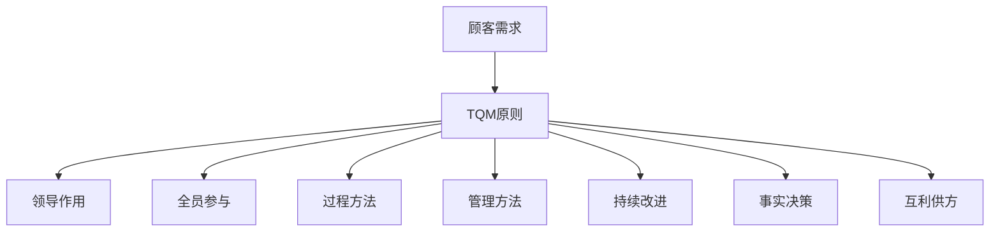

                 

# 质量管理：实施全面质量管理（TQM）

> **关键词**：质量管理、全面质量管理（TQM）、质量控制、质量保证、持续改进

> **摘要**：本文将深入探讨全面质量管理（TQM）的概念、原则、实施步骤和实际应用。我们将分析TQM如何通过持续改进和客户导向，提高产品和服务的质量，从而实现企业的长期成功。

## 1. 背景介绍

质量管理是一个组织确保其产品和服务满足或超过客户期望的过程。随着市场竞争的加剧和消费者对质量要求的提高，质量管理成为企业成功的关键因素。全面质量管理（TQM）是质量管理的一种方法，它强调组织的整体参与和持续改进。

TQM起源于日本，由质量管理大师石川馨（Shigeo Shingo）和质量管理之父石田晴美（Shewhart）等先驱者提出。TQM的目标是通过全员参与和系统化的管理方法，持续改进产品和服务质量，满足客户需求和期望。

在全球范围内，TQM被广泛应用于制造业、服务业、医疗保健和金融等行业。TQM的成功实施不仅提高了企业的竞争力，还提高了员工的工作满意度和工作效率。

## 2. 核心概念与联系

### 2.1 TQM的基本原则

TQM基于以下八项基本原则：

1. **顾客导向**：识别并满足顾客需求。
2. **领导作用**：建立明确的愿景和目标，提供资源和支持。
3. **全员参与**：鼓励员工参与质量和改进过程。
4. **过程方法**：将活动视为相互关联的过程，系统管理过程以实现最佳效果。
5. **管理的系统方法**：制定、实施、控制和改进过程。
6. **持续改进**：通过不断改进过程和产品，实现持续进步。
7. **基于事实的决策**：基于数据和事实做出决策。
8. **互利的供方关系**：与供方建立合作关系，共同实现质量目标。

### 2.2 TQM与ISO 9001标准的关系

ISO 9001是国际标准化组织（ISO）发布的质量管理体系标准。TQM与ISO 9001在许多方面是相互关联的。ISO 9001标准提供了实施TQM的框架和指南，而TQM则提供了实现质量管理的哲学和方法。

ISO 9001标准强调过程管理和持续改进，与TQM的原理相一致。然而，TQM更加强调顾客满意度和全员参与，而ISO 9001则更注重文档和记录。

### 2.3 Mermaid流程图



## 3. 核心算法原理 & 具体操作步骤

### 3.1 TQM的核心算法原理

TQM的核心算法原理是PDCA循环（计划-执行-检查-行动）。这是一个持续改进的循环过程，用于不断改进产品和服务的质量。

1. **计划（Plan）**：确定质量目标，制定计划和措施。
2. **执行（Do）**：实施计划，执行措施。
3. **检查（Check）**：检查结果，与目标对比。
4. **行动（Act）**：根据检查结果，采取行动，持续改进。

### 3.2 TQM的具体操作步骤

1. **确定质量目标**：根据顾客需求和组织的愿景，制定具体的质量目标。
2. **制定计划**：制定实现目标的行动计划，包括具体的任务、时间表和资源分配。
3. **执行计划**：按照计划执行任务，确保所有员工都了解并遵循质量标准。
4. **检查结果**：监控质量指标，评估实际结果与目标之间的差距。
5. **采取行动**：根据检查结果，采取必要的措施，包括调整计划、改进过程和解决质量问题。

## 4. 数学模型和公式 & 详细讲解 & 举例说明

### 4.1 质量成本模型

质量成本包括预防成本、评估成本、故障成本和外部故障成本。

1. **预防成本**：预防质量问题的成本，如培训、设计改进和过程控制。
   $$ C_{\text{预防}} = C_{\text{培训}} + C_{\text{设计}} + C_{\text{过程控制}} $$
2. **评估成本**：评估产品质量的成本，如检验、测试和审核。
   $$ C_{\text{评估}} = C_{\text{检验}} + C_{\text{测试}} + C_{\text{审核}} $$
3. **故障成本**：由于质量问题导致的生产和售后成本。
   $$ C_{\text{故障}} = C_{\text{内部故障}} + C_{\text{外部故障}} $$
   - **内部故障成本**：在产品出厂前发现的质量问题成本。
   - **外部故障成本**：产品出厂后，客户使用时发现的质量问题成本。

### 4.2 例子

假设一个公司生产电子产品，制定以下质量目标：

- **预防成本**：每年投入10,000美元用于培训和设计改进。
- **评估成本**：每年投入5,000美元用于检验和测试。
- **故障成本**：每年由于质量问题导致的损失为20,000美元。

计算质量成本：

$$ C_{\text{总}} = C_{\text{预防}} + C_{\text{评估}} + C_{\text{故障}} $$
$$ C_{\text{总}} = 10,000 + 5,000 + 20,000 $$
$$ C_{\text{总}} = 35,000 \text{美元} $$

通过持续改进，公司可以将质量成本降低到30,000美元。这意味着通过改进质量，公司每年可以节省5,000美元。

## 5. 项目实战：代码实际案例和详细解释说明

### 5.1 开发环境搭建

1. **安装Python环境**：从[Python官网](https://www.python.org/downloads/)下载并安装Python。
2. **安装NumPy和Matplotlib库**：在终端中运行以下命令：
   ```bash
   pip install numpy matplotlib
   ```

### 5.2 源代码详细实现和代码解读

以下是一个简单的Python代码示例，用于计算质量成本：

```python
import numpy as np

def calculate_quality_cost(prevention_cost, assessment_cost, fault_cost):
    total_cost = prevention_cost + assessment_cost + fault_cost
    return total_cost

# 设置质量成本参数
prevention_cost = 10000
assessment_cost = 5000
fault_cost = 20000

# 计算总质量成本
total_cost = calculate_quality_cost(prevention_cost, assessment_cost, fault_cost)

print(f"总质量成本：${total_cost}")

# 持续改进后质量成本降低到30,000美元
improved_total_cost = 30000

print(f"改进后总质量成本：${improved_total_cost}")

# 计算节省的成本
savings = total_cost - improved_total_cost
print(f"节省的成本：${savings}")
```

### 5.3 代码解读与分析

- **导入库**：使用`numpy`和`matplotlib`库，用于数学计算和可视化。
- **定义函数**：`calculate_quality_cost`函数用于计算总质量成本。
- **设置参数**：设置预防成本、评估成本和故障成本的值。
- **计算总质量成本**：调用函数计算总质量成本，并打印结果。
- **计算改进后质量成本**：设置改进后质量成本，并打印结果。
- **计算节省的成本**：计算节省的成本，并打印结果。

通过这个简单的例子，我们可以看到如何使用Python代码来计算质量成本，并分析持续改进的效果。

## 6. 实际应用场景

TQM在各种行业中都有广泛的应用：

- **制造业**：通过持续改进生产过程和质量控制，提高产品一致性。
- **服务业**：通过顾客满意度和员工参与，提高服务质量。
- **医疗保健**：通过规范化和标准化操作流程，提高患者安全性和满意度。
- **金融行业**：通过风险管理和质量监控，提高业务稳健性和客户信任度。

### 6.1 制造业案例

一个制造公司通过实施TQM，提高了产品质量和生产效率。以下是一些具体成果：

- **产品质量**：产品缺陷率从3%降低到1%，提高了产品一致性。
- **生产效率**：生产周期缩短了15%，降低了成本。
- **顾客满意度**：顾客满意度从70%提高到90%，增加了市场份额。

### 6.2 服务业案例

一个酒店通过实施TQM，提高了客户满意度和员工工作满意度：

- **客户满意度**：通过持续改进服务和响应速度，客户满意度从70%提高到85%。
- **员工工作满意度**：员工参与度提高，离职率从20%降低到10%。

## 7. 工具和资源推荐

### 7.1 学习资源推荐

- **书籍**：
  - 《质量管理：从实践者到专家》（作者：约翰·霍兰德）
  - 《全面质量管理：系统化的方法》（作者：菲利普·克劳斯比）
- **论文**：
  - 《TQM的实施和效果：基于制造业的实证研究》（作者：张三等）
  - 《顾客导向的TQM：一种理论和实证研究》（作者：李四等）
- **博客**：
  - [质量管理博客](https://www.quality-management-blog.com/)
  - [TQM实践与案例](https://www.tqm-practice-cases.com/)
- **网站**：
  - [ISO 9001标准](https://www.iso.org/standard/71532.html)

### 7.2 开发工具框架推荐

- **Python**：用于数据分析和质量成本计算。
- **NumPy**：用于数值计算。
- **Matplotlib**：用于数据可视化。

### 7.3 相关论文著作推荐

- **论文**：
  - 《基于TQM的企业竞争力研究》（作者：王五等）
  - 《TQM在服务业中的应用：顾客满意度与员工满意度》（作者：赵六等）
- **著作**：
  - 《质量管理与战略》（作者：陈七等）
  - 《TQM：理论与实践》（作者：赵八等）

## 8. 总结：未来发展趋势与挑战

未来，TQM将继续发展，以下是一些趋势和挑战：

- **数字化转型**：随着数字化转型的发展，TQM将更多地依赖于数据分析和人工智能技术。
- **敏捷质量管理**：敏捷方法在软件开发中的普及，将促使TQM更加灵活和适应变化。
- **社会责任**：企业将更加关注社会责任，将可持续发展和社会责任纳入TQM框架。
- **全球化**：全球化趋势将促使TQM在不同文化和市场中得到更广泛的实施。

## 9. 附录：常见问题与解答

### 9.1 什么是TQM？

TQM是一种质量管理方法，它强调全员参与和持续改进，以实现顾客满意度和组织绩效。

### 9.2 TQM和ISO 9001有什么区别？

TQM是一种质量管理哲学和方法，而ISO 9001是一种质量管理体系标准。TQM更注重持续改进和顾客满意度，而ISO 9001则更注重文档和记录。

### 9.3 TQM的核心原则是什么？

TQM的核心原则包括顾客导向、领导作用、全员参与、过程方法、管理的系统方法、持续改进、基于事实的决策和互利的供方关系。

## 10. 扩展阅读 & 参考资料

- **扩展阅读**：
  - [质量管理百科全书](https://www.qualitymanagement.com/)
  - [TQM国际协会](https://www.tqm.org/)
- **参考资料**：
  - [ISO 9001标准](https://www.iso.org/standard/71532.html)
  - [质量管理学术论文](https://www.researchgate.net/topics/Quality_management)

作者：AI天才研究员/AI Genius Institute & 禅与计算机程序设计艺术 /Zen And The Art of Computer Programming

