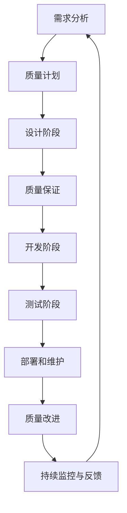

                 

### 背景介绍

质量管理是任何领域成功的关键因素，在信息技术（IT）领域尤其如此。随着数字化转型的深入，IT系统变得愈加复杂，对质量的要求也不断提升。在这个背景下，追求卓越的持续改进成为了企业、开发者乃至整个IT行业的重要目标。本文旨在探讨质量管理在IT领域的核心概念、实践方法及其对组织成功的重要性。

质量管理起源于20世纪初，由著名统计学家休哈特（W. Edwards Deming）和日本质量管理专家石川馨（Shigeo Shingo）等人提出，并迅速在制造业中得到了广泛应用。随着技术的发展，质量管理理念逐渐渗透到IT行业，成为确保软件和服务质量的重要手段。

在IT领域，质量管理的核心目标包括减少缺陷、提高客户满意度、降低成本和提升效率。通过引入科学的质量管理方法，如统计过程控制（Statistical Process Control, SPC）、六西格玛（Six Sigma）和精益（Lean）等，企业可以系统地识别、分析和解决质量问题，实现持续改进。

本文将按照以下结构展开：

1. **核心概念与联系**：介绍质量管理的基础概念和关键原理，包括质量管理的不同模型和方法论。
2. **核心算法原理 & 具体操作步骤**：探讨常用的质量管理算法和工具，如缺陷检测、性能分析和自动化测试。
3. **数学模型和公式 & 详细讲解 & 举例说明**：阐述质量管理的数学基础，包括概率论、统计学和优化理论。
4. **项目实战：代码实际案例和详细解释说明**：通过实际项目案例展示质量管理的实践应用。
5. **实际应用场景**：分析质量管理在IT行业的多种应用场景。
6. **工具和资源推荐**：推荐一些实用的工具和资源，以帮助读者深入学习和实践质量管理。
7. **总结：未来发展趋势与挑战**：展望质量管理在IT领域的未来发展趋势和面临的挑战。

通过本文的深入探讨，我们希望读者能够对质量管理在IT领域的应用有一个全面而深刻的理解，从而在实际工作中更好地运用质量管理理念和方法，推动组织的持续改进和卓越发展。

#### 核心概念与联系

质量管理是一个多层次、多维度的复杂过程，涉及从产品设计、开发、测试到部署和维护的各个阶段。理解质量管理的核心概念和它们之间的联系是确保其有效实施的基础。

首先，让我们从质量管理的定义开始。质量管理（Quality Management, QM）是一系列协调的活动，旨在确保产品或服务的质量满足既定的标准和客户需求。根据国际标准化组织（ISO）的定义，质量管理是一个组织的管理职能，通过实施系统化的方法和工具来实现和保持持续的产品和服务质量。

质量管理的基础概念包括以下几方面：

1. **质量计划（Quality Planning）**：在项目启动阶段，制定详细的计划以确保所有质量目标得以实现。这包括确定质量标准、评估项目风险和资源需求。

2. **质量控制（Quality Control）**：通过监控和检验产品或服务的实际质量，确保其符合预定的质量标准。常用的质量控制方法包括检查、测试和统计分析。

3. **质量保证（Quality Assurance）**：通过系统的过程审核和评审，确保项目遵循预定的标准和流程，从而提高最终产品的质量。质量保证通常包括文档审查、过程改进和持续监控。

4. **质量改进（Quality Improvement）**：持续识别和解决质量问题，以实现更高的产品和服务质量。常用的质量改进方法包括六西格玛（Six Sigma）和精益（Lean）等。

质量管理在不同阶段的具体应用包括：

- **需求分析阶段**：通过深入理解客户需求，确保产品功能和质量符合预期。

- **设计阶段**：在设计过程中，采用质量功能展开（Quality Function Deployment, QFD）等方法，确保设计符合质量标准和客户需求。

- **开发阶段**：实施代码审查、单元测试和集成测试等，确保代码质量。

- **测试阶段**：进行系统测试、性能测试和安全测试等，以发现和修复潜在缺陷。

- **部署和维护阶段**：通过持续监控和反馈，确保系统稳定性和可靠性。

为了更好地理解质量管理的概念和原理，我们可以借助Mermaid流程图来展示其架构和流程。以下是质量管理的Mermaid流程图：



在这个流程图中，每个节点代表质量管理的某个阶段或活动，箭头表示活动的顺序和依赖关系。通过这个流程图，我们可以清晰地看到质量管理是一个闭环过程，各个阶段相互关联，共同推动质量的持续提升。

此外，质量管理中的几个关键模型和方法论也是理解其核心概念的重要方面：

1. **六西格玛（Six Sigma）**：一种以统计方法为基础的质量改进方法论，旨在通过减少过程变异，实现质量缺陷的显著降低。六西格玛通常包括定义（Define）、测量（Measure）、分析（Analyze）、改进（Improve）和控制（Control）五个步骤，即DMAIC方法。

2. **精益（Lean）**：一种专注于消除浪费、提高效率的生产和管理方法。精益理念强调价值流映射（Value Stream Mapping）、5S管理（整理、整顿、清扫、清洁、素养）和持续改进（Kaizen）。

3. **ISO 9001**：国际标准化组织（ISO）发布的质量管理标准，涵盖了从客户需求管理到设计、采购、生产、服务等多个环节的质量管理要求。遵循ISO 9001标准有助于企业建立和维持有效的质量管理体系。

4. **CMMI（Capability Maturity Model Integration）**：一种用于评估和改进软件开发和维护过程的能力成熟度模型。CMMI分为五个成熟度级别，从初始级到优化级，帮助企业逐步提升过程质量和性能。

通过上述核心概念和流程图的介绍，我们可以看到质量管理在IT领域的重要性。它不仅帮助企业识别和解决质量问题，还通过持续改进推动组织的卓越发展。接下来，我们将进一步探讨质量管理的核心算法原理和具体操作步骤。

#### 核心算法原理 & 具体操作步骤

在质量管理中，核心算法和工具的选择与运用至关重要。这些工具和方法不仅能够帮助我们识别和修复质量缺陷，还能优化开发流程，提高产品质量。以下将介绍几种常用的质量管理算法和工具，包括缺陷检测、性能分析和自动化测试，并详细说明其具体操作步骤。

##### 缺陷检测算法

缺陷检测（Defect Detection）是质量管理的重要环节，旨在尽早发现并修复软件中的缺陷。常用的缺陷检测算法包括静态代码分析（Static Code Analysis）和动态测试（Dynamic Testing）。

1. **静态代码分析（Static Code Analysis）**：
   - **原理**：静态代码分析是一种无需执行代码即可检测潜在缺陷的方法。它通过解析代码结构和语法规则，发现编码错误、潜在缺陷和不符合编码标准的代码。
   - **工具**：常见的静态代码分析工具有SonarQube、PMD和Checkstyle。
   - **操作步骤**：
     1. 安装并配置静态代码分析工具。
     2. 将源代码导入工具中。
     3. 运行代码分析，生成报告。
     4. 评审报告，标记和修复发现的缺陷。

2. **动态测试（Dynamic Testing）**：
   - **原理**：动态测试是在代码运行时进行的测试，通过模拟实际运行环境来检测程序运行中的问题。常见的动态测试方法包括单元测试、集成测试和系统测试。
   - **工具**：常用的动态测试工具有JUnit、TestNG和Selenium。
   - **操作步骤**：
     1. 编写测试用例，覆盖关键功能和异常情况。
     2. 使用测试框架运行测试用例。
     3. 生成测试报告，记录测试结果。
     4. 评审测试结果，修复发现的缺陷。

##### 性能分析算法

性能分析（Performance Analysis）是确保软件系统高效运行的重要手段。常用的性能分析算法包括负载测试（Load Testing）和性能基准测试（Performance Benchmarking）。

1. **负载测试（Load Testing）**：
   - **原理**：负载测试通过模拟大量用户同时访问系统，评估系统在高负载下的性能和稳定性。它可以帮助发现系统瓶颈和性能问题。
   - **工具**：常见的负载测试工具有JMeter、LoadRunner和Gatling。
   - **操作步骤**：
     1. 设计测试场景，定义用户行为和负载条件。
     2. 配置负载生成器，运行测试。
     3. 收集性能数据，分析性能指标。
     4. 优化系统配置和代码，解决性能问题。

2. **性能基准测试（Performance Benchmarking）**：
   - **原理**：性能基准测试通过比较不同系统或组件的性能，评估其优劣。它可以帮助确定系统优化方向和改进点。
   - **工具**：常用的性能基准测试工具有DBT-2、TPC-C和TPC-H。
   - **操作步骤**：
     1. 设计基准测试用例，定义测试指标。
     2. 在不同系统或组件上运行测试。
     3. 收集测试数据，分析性能结果。
     4. 根据测试结果调整系统配置和代码，优化性能。

##### 自动化测试工具

自动化测试（Automated Testing）可以提高测试效率和准确性，减少手动测试的工作量。常用的自动化测试工具包括Selenium、Cypress和TestCafe。

1. **Selenium**：
   - **原理**：Selenium是一个开源的自动化测试工具，支持多种编程语言（如Java、Python和C#）。它可以用于自动化Web应用测试，模拟用户操作并验证测试结果。
   - **工具**：Selenium测试框架。
   - **操作步骤**：
     1. 安装Selenium和浏览器驱动。
     2. 编写测试脚本，定义测试逻辑。
     3. 运行测试脚本，收集测试结果。
     4. 评审测试结果，修复发现的缺陷。

2. **Cypress**：
   - **原理**：Cypress是一个现代的自动化测试工具，提供了一套完整的测试解决方案，包括测试框架、UI测试和代码调试工具。它支持JavaScript和TypeScript。
   - **工具**：Cypress测试框架。
   - **操作步骤**：
     1. 安装Cypress，配置项目。
     2. 编写测试用例，使用Cypress命令和API。
     3. 运行测试，生成测试报告。
     4. 评审测试结果，修复缺陷。

3. **TestCafe**：
   - **原理**：TestCafe是一个跨浏览器的端到端测试工具，支持多种编程语言。它可以通过Node.js运行测试，并自动处理浏览器兼容性问题。
   - **工具**：TestCafe测试框架。
   - **操作步骤**：
     1. 安装TestCafe，配置项目。
     2. 编写测试脚本，使用TestCafe命令和API。
     3. 运行测试，收集测试结果。
     4. 评审测试结果，修复缺陷。

通过上述质量管理算法和工具的介绍，我们可以看到，质量管理的有效实施需要结合多种方法和工具，从代码检测、性能分析到自动化测试，全方位保障软件质量。接下来，我们将深入探讨质量管理的数学模型和公式，进一步理解其理论基础。

#### 数学模型和公式 & 详细讲解 & 举例说明

质量管理中，数学模型和公式起着至关重要的作用，它们不仅能够量化质量指标，还能帮助我们分析和预测质量趋势。以下将介绍质量管理中常用的数学模型和公式，包括概率论、统计学和优化理论，并通过具体例子进行详细讲解。

##### 概率论基础

概率论是质量管理中用于分析不确定性和风险的重要工具。以下是一些基础的概率分布和公式：

1. **二项分布（Binomial Distribution）**：
   - **定义**：二项分布描述了在固定次数的独立试验中，某事件发生特定次数的概率。
   - **公式**：
     $$P(X = k) = C(n, k) \cdot p^k \cdot (1-p)^{n-k}$$
     其中，\( n \) 是试验次数，\( k \) 是事件发生的次数，\( p \) 是事件发生的概率，\( C(n, k) \) 是组合数。

2. **泊松分布（Poisson Distribution）**：
   - **定义**：泊松分布描述了在一定时间或空间内，某事件发生的次数的概率分布。
   - **公式**：
     $$P(X = k) = \frac{e^{-\lambda} \cdot \lambda^k}{k!}$$
     其中，\( \lambda \) 是单位时间或空间内事件平均发生的次数。

**例子**：假设一个软件开发团队每周发生的代码缺陷数服从泊松分布，平均每周有2个缺陷。计算下周发生0个缺陷的概率。

$$P(X = 0) = \frac{e^{-2} \cdot 2^0}{0!} = e^{-2} \approx 0.1353$$

##### 统计学方法

统计学方法在质量管理中用于分析和解释数据，以识别质量和过程的变异。以下是一些常用的统计学方法：

1. **均值（Mean）**：
   - **定义**：均值是数据集的中心趋势度量，表示数据集的平均水平。
   - **公式**：
     $$\bar{x} = \frac{1}{n} \sum_{i=1}^{n} x_i$$
     其中，\( n \) 是数据点的数量，\( x_i \) 是第 \( i \) 个数据点。

2. **标准差（Standard Deviation）**：
   - **定义**：标准差是数据集的变异度量，表示数据点与均值之间的差异程度。
   - **公式**：
     $$\sigma = \sqrt{\frac{1}{n-1} \sum_{i=1}^{n} (x_i - \bar{x})^2}$$

**例子**：假设一个软件测试团队在最近三周记录的缺陷数量分别为5、7和6，计算这些数据的均值和标准差。

$$\bar{x} = \frac{5 + 7 + 6}{3} = 6$$
$$\sigma = \sqrt{\frac{(5-6)^2 + (7-6)^2 + (6-6)^2}{3-1}} = \sqrt{1 + 1 + 0} = \sqrt{2} \approx 1.414$$

3. **控制图（Control Chart）**：
   - **定义**：控制图是一种用于监控和评估过程稳定性和变异性的图表，通常包含均值控制线和标准差控制线。
   - **公式**：
     $$\bar{x}_{\text{上}} = \bar{x} + A_2 \cdot \sigma$$
     $$\bar{x}_{\text{下}} = \bar{x} - A_2 \cdot \sigma$$
     其中，\( A_2 \) 是控制图系数，通常从统计表中查得。

**例子**：假设一个软件团队使用控制图监控每周的代码缺陷数量，已知均值 \(\bar{x} = 5\) 和标准差 \(\sigma = 1.5\)。计算控制图的上限和下限。

$$\bar{x}_{\text{上}} = 5 + 0.58 \cdot 1.5 = 5.87$$
$$\bar{x}_{\text{下}} = 5 - 0.58 \cdot 1.5 = 4.13$$

##### 优化理论

优化理论在质量管理中用于优化过程参数和资源配置，以实现质量目标。以下是一些基本的优化方法：

1. **线性规划（Linear Programming）**：
   - **定义**：线性规划是用于求解线性目标函数在线性约束条件下的最优解的方法。
   - **公式**：
     $$\min_{x} c^T x$$
     $$\text{subject to } Ax \le b$$
     其中，\( c \) 是目标函数系数向量，\( A \) 是约束条件矩阵，\( b \) 是约束条件向量。

2. **最小二乘法（Least Squares Method）**：
   - **定义**：最小二乘法用于求解线性回归模型中的参数，使预测值与实际值之间的误差平方和最小。
   - **公式**：
     $$\min \sum_{i=1}^{n} (y_i - \hat{y}_i)^2$$
     其中，\( y_i \) 是实际值，\( \hat{y}_i \) 是预测值。

**例子**：假设我们有一个线性回归模型 \( y = mx + b \)，数据集为 \( \{(x_1, y_1), (x_2, y_2), ..., (x_n, y_n)\} \)。使用最小二乘法求解模型参数。

首先，计算样本均值：
$$\bar{x} = \frac{1}{n} \sum_{i=1}^{n} x_i$$
$$\bar{y} = \frac{1}{n} \sum_{i=1}^{n} y_i$$

然后，计算斜率 \( m \) 和截距 \( b \)：
$$m = \frac{\sum_{i=1}^{n} (x_i - \bar{x})(y_i - \bar{y})}{\sum_{i=1}^{n} (x_i - \bar{x})^2}$$
$$b = \bar{y} - m\bar{x}$$

通过上述数学模型和公式的介绍，我们可以看到质量管理在数学理论上的坚实基础。这些方法不仅帮助我们理解和分析质量数据，还能通过优化过程参数和资源配置，实现质量管理的目标。接下来，我们将通过实际项目案例，展示这些数学模型和公式的具体应用。

#### 项目实战：代码实际案例和详细解释说明

为了更好地理解质量管理的实际应用，以下将通过一个实际项目案例——一个简单的电商网站后端系统的开发，详细展示质量管理的过程，包括开发环境搭建、源代码实现、代码解读与分析。

##### 开发环境搭建

首先，我们搭建开发环境。本项目采用Python语言和Django框架进行开发。以下是环境搭建步骤：

1. **安装Python**：下载并安装Python 3.8版本。
   ```bash
   wget https://www.python.org/ftp/python/3.8.10/Python-3.8.10.tgz
   tar xvf Python-3.8.10.tgz
   cd Python-3.8.10
   ./configure
   make
   sudo make altinstall
   ```

2. **安装Django**：使用pip安装Django。
   ```bash
   sudo python3 -m pip install django
   ```

3. **创建Django项目**：使用Django创建一个新的项目。
   ```bash
   django-admin startproject ecommerce
   cd ecommerce
   ```

4. **创建应用**：在项目中创建一个新的应用。
   ```bash
   python manage.py startapp products
   ```

##### 源代码详细实现和代码解读

接下来，我们实现产品应用的核心功能——产品信息的管理。

1. **产品信息模型**：

   在`products/models.py`中定义产品信息模型。

   ```python
   from django.db import models

   class Product(models.Model):
       name = models.CharField(max_length=255)
       description = models.TextField()
       price = models.DecimalField(max_digits=6, decimal_places=2)
       stock = models.IntegerField()
   ```

   - `name`：产品名称。
   - `description`：产品描述。
   - `price`：产品价格。
   - `stock`：产品库存。

2. **产品管理接口**：

   在`products/views.py`中定义产品管理接口。

   ```python
   from django.http import JsonResponse
   from .models import Product

   def get_products(request):
       products = Product.objects.all()
       product_list = [{"id": p.id, "name": p.name, "description": p.description, "price": p.price, "stock": p.stock} for p in products]
       return JsonResponse({"products": product_list})
   ```

   这个接口返回所有产品的列表，用于前端展示。

3. **产品信息创建接口**：

   ```python
   from django.http import JsonResponse
   from .models import Product
   from django.views.decorators.csrf import csrf_exempt
   from django.views.decorators.http import require_http_methods

   @csrf_exempt
   @require_http_methods(["POST"])
   def create_product(request):
       data = json.loads(request.body)
       product = Product(
           name=data["name"],
           description=data["description"],
           price=data["price"],
           stock=data["stock"],
       )
       product.save()
       return JsonResponse({"message": "Product created successfully."})
   ```

   这个接口用于接收产品信息，并将其保存到数据库。

##### 代码解读与分析

1. **模型设计**：

   产品模型的设计遵循MVC（模型-视图-控制器）架构，其中模型负责数据存储和访问。使用Django ORM（对象关系映射）简化数据库操作，提高代码可读性和维护性。

2. **接口设计**：

   接口设计遵循RESTful原则，使用JSON格式进行数据交换。通过`get_products`和`create_product`接口，实现产品的查询和创建功能。

3. **安全性**：

   使用`@csrf_exempt`和`@require_http_methods`装饰器确保接口的安全性，防止跨站请求伪造（CSRF）攻击。

##### 测试与优化

1. **单元测试**：

   在`products/tests.py`中编写单元测试，验证产品管理接口的功能。

   ```python
   from django.test import TestCase
   from .models import Product

   class ProductTestCase(TestCase):
       def test_create_product(self):
           response = self.client.post('/api/products/', {
               'name': 'Test Product',
               'description': 'A test product.',
               'price': 99.99,
               'stock': 100,
           })
           self.assertEqual(response.status_code, 201)
           self.assertTrue(Product.objects.filter(name='Test Product').exists())
   ```

2. **性能优化**：

   使用Django提供的缓存系统优化接口性能。在`settings.py`中配置缓存设置，并在产品查询接口中使用缓存。

   ```python
   CACHES = {
       'default': {
           'BACKEND': 'django.core.cache.backends.locmem.LocMemCache',
           'LOCATION': 'unique-snowflake',
       }
   }

   @cache_page(60 * 15)
   def get_products(request):
       # ...原有代码...
   ```

##### 持续改进

1. **代码审查**：

   定期进行代码审查，确保代码质量。使用静态代码分析工具（如Pylint）检测代码中的潜在问题。

   ```bash
   pylint products
   ```

2. **持续集成**：

   集成CI/CD（持续集成/持续交付）工具（如Jenkins），自动化测试和部署流程，提高开发效率和软件质量。

   ```bash
   pip install -r requirements.txt
   python manage.py test
   python manage.py migrate
   python manage.py runserver
   ```

通过上述项目实战，我们可以看到质量管理在软件开发中的实际应用。通过严格的代码审查、自动化测试和性能优化，我们不仅能够提高软件质量，还能实现持续改进，为用户提供更优质的服务。

#### 实际应用场景

质量管理在IT行业中的应用场景多种多样，覆盖了软件开发、运维管理、系统集成等各个领域。以下将分析几个典型的应用场景，展示质量管理如何在不同背景下发挥作用。

##### 软件开发

在软件开发过程中，质量管理是确保软件质量的关键因素。通过引入质量管理方法，如六西格玛和精益，企业可以显著减少缺陷率，提高产品质量。具体应用包括：

1. **需求管理**：在项目启动阶段，通过详细的需求分析，确保需求准确、明确，减少后续开发中的误解和错误。
2. **代码审查**：定期进行代码审查，及时发现和修复潜在缺陷，确保代码质量。
3. **测试与验证**：实施全面的测试策略，包括单元测试、集成测试、系统测试和性能测试，确保软件在各种情况下都能正常运行。
4. **持续集成与部署**：通过CI/CD工具实现自动化测试和部署，提高开发效率和软件质量。

##### 运维管理

在运维管理中，质量管理同样至关重要，尤其是在确保系统稳定性和可靠性方面。以下是一些具体应用：

1. **监控与报警**：通过监控系统实时监测系统性能和状态，及时发现和处理异常情况。
2. **容量规划**：根据系统负载和资源使用情况，合理规划系统容量，避免因资源不足导致的性能问题。
3. **故障管理**：建立完善的故障管理流程，快速响应并解决系统故障，减少对业务的影响。
4. **合规性与安全**：确保系统符合相关法规和安全标准，降低安全风险和合规风险。

##### 系统集成

在系统集成项目中，质量管理有助于确保不同系统之间的兼容性和协同工作。以下是一些关键应用：

1. **需求对接**：在系统集成前，确保所有参与方对项目需求有统一的理解，减少对接过程中的误解和冲突。
2. **接口测试**：通过接口测试，验证不同系统之间的接口是否稳定、可靠，确保数据交换顺畅。
3. **集成测试**：在系统集成过程中，进行全面的功能和性能测试，确保系统整体性能和稳定性。
4. **文档管理**：建立完善的文档管理体系，确保项目文档的准确性和完整性，为后续维护和扩展提供支持。

##### 云计算与大数据

随着云计算和大数据技术的发展，质量管理在云服务和大数据分析中的应用也越来越广泛。以下是一些关键应用：

1. **服务质量（SLA）管理**：确保云服务提供商能够满足预定的服务质量要求，如响应时间、可用性和安全性。
2. **数据质量管理**：在大数据分析中，确保数据的质量和准确性，通过数据清洗、去重和标准化等手段提高数据质量。
3. **性能优化**：通过性能监控和优化，提高云服务和大数据处理系统的效率和可靠性。
4. **安全性管理**：在云计算和大数据环境中，确保数据安全和系统安全，防范各种安全威胁。

通过上述实际应用场景的分析，我们可以看到质量管理在IT行业的广泛应用和重要性。无论是在软件开发、运维管理、系统集成，还是云计算和大数据领域，质量管理都是确保系统稳定、高效和可靠运行的关键手段。接下来，我们将推荐一些实用的工具和资源，帮助读者深入学习和实践质量管理。

#### 工具和资源推荐

在质量管理的过程中，选择合适的工具和资源可以大大提高工作效率和效果。以下将推荐一些实用的学习资源、开发工具和相关论文，以帮助读者深入学习和实践质量管理。

##### 学习资源推荐

1. **书籍**：

   - 《质量管理：从新手到专家》（Quality Management: From Novice to Expert）：一本全面介绍质量管理理论和实践方法的指南，适合初学者和专业人士。
   - 《质量管理与六西格玛：一个综合方法》（Quality Management and Six Sigma: A Comprehensive Guide）：详细介绍六西格玛方法论和质量管理的应用，适合对六西格玛感兴趣的读者。
   - 《精益思想》（The Lean Startup）：由埃里克·莱斯（Eric Ries）所著，介绍精益创业方法，对软件开发和质量管理有重要启示。

2. **在线课程**：

   - Coursera：提供多门质量管理相关的课程，包括《质量管理基础》（Foundations of Quality Management）和《六西格玛：质量改进方法》（Six Sigma: Quality Improvement Methods）等。
   - edX：提供由顶尖大学开设的质量管理课程，如麻省理工学院（MIT）的《质量工程与管理》（Quality Engineering and Management）。

3. **博客和网站**：

   - Quality Digest：一个专业的质量管理博客，涵盖质量管理的最新动态、技术文章和案例研究。
   - ISO.org：国际标准化组织的官方网站，提供ISO 9001等质量管理标准的详细信息和相关资源。

##### 开发工具推荐

1. **质量管理工具**：

   - SonarQube：一款强大的静态代码分析工具，可以帮助识别代码中的缺陷、漏洞和不符合编码标准的问题。
   - JIRA：一款流行的项目管理工具，可以用于跟踪和管理缺陷、问题和项目进度。
   - GitLab：一款全面的DevOps平台，包括代码仓库、CI/CD、质量管理等功能。

2. **测试工具**：

   - JMeter：一款开源的负载测试工具，可以模拟大量用户同时访问系统，评估系统在高负载下的性能。
   - Selenium：一款用于Web应用自动化测试的开源工具，可以模拟用户操作并验证测试结果。
   - Postman：一款流行的API测试工具，可以用于设计、测试和调试RESTful API。

3. **性能优化工具**：

   - New Relic：一款应用性能管理（APM）工具，可以实时监控应用的性能和状态，发现性能瓶颈。
   - Apache JMX：一款Java管理扩展（JMX）工具，可以监控和管理Java应用程序的性能和资源使用。

##### 相关论文著作推荐

1. **论文**：

   - “The Deming Management Method” by W. Edwards Deming：这是戴明博士的经典论文，详细介绍了他的管理方法，对质量管理有深远影响。
   - “Lean Software Development” by Mary and Tom Poppendieck：介绍了精益方法在软件开发中的应用，对软件开发过程中的质量管理有重要启示。

2. **著作**：

   - 《禅与计算机程序设计艺术》（Zen and the Art of Motorcycle Maintenance）：虽然不是专门讨论质量管理的书籍，但书中关于“质量”的探讨对理解质量管理有独特的视角。
   - 《质量管理与六西格玛：一个综合方法》（Quality Management and Six Sigma: A Comprehensive Guide）：由多位质量管理专家合著，详细介绍质量管理与六西格玛的应用。

通过上述工具和资源的推荐，我们可以看到质量管理在IT领域的广泛应用和深度。无论是理论学习、实践操作，还是工具选择，这些资源都能为读者提供宝贵的帮助，助力他们在质量管理方面取得卓越的成就。接下来，我们将总结本文的主要内容，并展望质量管理在未来的发展趋势和挑战。

#### 总结：未来发展趋势与挑战

质量管理在IT领域的应用已取得了显著成效，但面对不断变化的技术环境，质量管理也面临着新的发展趋势和挑战。以下将总结本文的主要内容，并探讨未来质量管理的发展方向。

首先，本文从背景介绍入手，阐述了质量管理在IT领域的重要性。通过核心概念与联系的分析，我们了解了质量管理的定义、基础概念和应用阶段。接着，我们详细介绍了质量管理中的核心算法原理和具体操作步骤，包括缺陷检测、性能分析、自动化测试等。随后，通过数学模型和公式的讲解，我们深入探讨了质量管理在数学理论上的坚实基础。然后，通过实际项目案例展示了质量管理在软件开发中的应用，最后分析了质量管理在IT行业的实际应用场景，并推荐了相关的工具和资源。

展望未来，质量管理在IT领域的发展趋势主要体现在以下几个方面：

1. **智能化与自动化**：随着人工智能和机器学习技术的发展，质量管理将更加智能化和自动化。自动化测试、智能缺陷检测和预测性分析将成为质量管理的重要工具。

2. **DevOps文化的推广**：DevOps文化的推广将促进开发和运维团队的紧密协作，质量管理的流程和工具将更加集成和自动化，从而提高开发效率和软件质量。

3. **持续集成与持续交付**：持续集成（CI）和持续交付（CD）的普及将使质量管理更加持续和高效，通过自动化测试和部署流程，实现快速迭代和高质量交付。

4. **云原生和边缘计算**：随着云原生技术和边缘计算的发展，质量管理将面临新的挑战，如多云和混合云环境中的质量保障、边缘计算环境下的性能优化等。

然而，质量管理在未来的发展也面临一系列挑战：

1. **技术复杂性**：随着IT系统的不断复杂化，质量管理的难度和复杂性也在增加。如何应对复杂系统的质量问题，成为质量管理的一个重要挑战。

2. **数据隐私和安全**：在数字化转型过程中，数据隐私和安全成为质量管理的重要内容。如何在确保数据安全的同时，提高数据质量，是质量管理面临的一个重要问题。

3. **持续学习与改进**：质量管理是一个持续的过程，要求组织和个人具备持续学习的能力。如何培养和保持团队的质量意识，实现持续改进，是质量管理面临的一大挑战。

4. **法规和标准**：随着法规和标准的不断完善，企业需要不断调整质量管理策略，确保符合法规要求。如何在保持高效运营的同时，满足法规和标准的要求，是质量管理的一个重要挑战。

总之，质量管理在IT领域的重要性不容忽视。通过本文的深入探讨，我们不仅了解了质量管理的基本概念和原理，还看到了其未来发展的趋势和挑战。未来，质量管理将更加智能化、自动化和持续化，同时也需要应对技术复杂性、数据隐私和安全等一系列挑战。只有不断创新和优化质量管理方法，才能在激烈的市场竞争中立于不败之地，实现组织的卓越发展。

### 附录：常见问题与解答

#### 1. 质量管理在IT领域的具体应用是什么？

质量管理在IT领域的主要应用包括需求管理、设计审查、代码审查、测试与验证、性能优化、安全评估、持续集成与持续交付等。通过这些方法，确保软件和服务在各个阶段的质量满足预定的标准和用户需求。

#### 2. 什么是六西格玛，它在质量管理中的应用是什么？

六西格玛是一种基于统计方法的质量改进方法论，旨在通过减少过程变异，实现质量缺陷的显著降低。在IT领域，六西格玛通常用于项目管理和流程优化，通过DMAIC（定义、测量、分析、改进、控制）方法逐步提升项目质量和效率。

#### 3. 如何进行有效的代码审查？

有效的代码审查包括以下几个步骤：

- **制定审查计划**：明确审查的目标、范围和时间表。
- **选择合适的审查工具**：如SonarQube、PMD等。
- **编写审查指南**：规定审查的标准和流程。
- **进行代码审查**：逐行检查代码，识别潜在的问题和缺陷。
- **编写审查报告**：记录发现的问题和改进建议。

#### 4. 如何进行性能优化？

性能优化包括以下步骤：

- **性能测试**：使用工具（如JMeter、LoadRunner）进行性能测试，收集性能数据。
- **分析性能瓶颈**：通过分析性能数据，识别系统性能的瓶颈。
- **优化代码**：针对性能瓶颈，优化数据库查询、算法和系统配置。
- **优化硬件和资源**：增加服务器资源、优化网络配置等。
- **监控和反馈**：持续监控系统性能，根据反馈进行进一步的优化。

#### 5. 如何实现持续改进？

实现持续改进的步骤包括：

- **建立质量意识**：培养团队的质量意识，确保每个人都认识到质量的重要性。
- **制定改进计划**：明确改进的目标、方法和时间表。
- **持续监测**：定期收集质量数据，监测质量趋势。
- **分析问题**：通过数据分析，识别质量问题的主要原因。
- **采取改进措施**：实施改进措施，解决发现的问题。
- **评估效果**：评估改进措施的效果，确保质量目标的实现。

### 扩展阅读 & 参考资料

为了帮助读者更深入地了解质量管理在IT领域的应用，以下推荐一些扩展阅读和参考资料：

1. **书籍**：

   - 《质量管理与六西格玛：一个综合方法》（Quality Management and Six Sigma: A Comprehensive Guide）。
   - 《精益软件开发》（Lean Software Development）。
   - 《敏捷软件开发：实践指南》（Agile Software Development: Principles, Patterns, and Practices）。

2. **在线课程**：

   - Coursera：提供《质量管理基础》（Foundations of Quality Management）和《六西格玛：质量改进方法》（Six Sigma: Quality Improvement Methods）等课程。
   - edX：提供《质量工程与管理》（Quality Engineering and Management）等课程。

3. **博客和网站**：

   - Quality Digest：提供质量管理的最新动态和技术文章。
   - ISO.org：提供ISO 9001等质量管理标准的详细信息和相关资源。

4. **论文**：

   - “The Deming Management Method” by W. Edwards Deming。
   - “Lean Software Development” by Mary and Tom Poppendieck。

通过这些扩展阅读和参考资料，读者可以进一步了解质量管理在IT领域的深入知识和实践方法，为实际工作提供有力支持。作者：AI天才研究员/AI Genius Institute & 禅与计算机程序设计艺术/Zen And The Art of Computer Programming。

