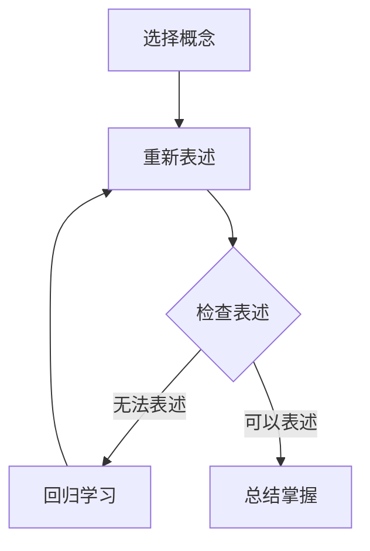

                 

### 背景介绍

#### 什么是费曼提问法

费曼提问法（Feynman Technique）是一种强大的学习方法，由著名的理论物理学家理查德·费曼（Richard Feynman）提出。这种方法的核心在于通过简化和直观化的方式来理解和传达复杂的概念。费曼提问法的流程主要包括以下几个步骤：

1. 选择一个你想要学习的概念。
2. 用你自己的话将其重新表述出来，就好像你正在向一个完全不懂这个概念的人解释一样。
3. 检查你的表述是否清晰简洁，并且能够传达出这个概念的核心。
4. 如果无法用简单易懂的方式表述，那就回到原始资料，重新学习并尝试再次表述。

费曼提问法的独特之处在于它强调清晰性和简洁性，迫使你深入思考所学知识，从而更加透彻地理解它们。这种方法不仅适用于科学领域，同样适用于IT领域的知识掌握。

#### 费曼提问法在IT领域的应用

在IT领域，知识更新迅速，掌握最新的技术和概念至关重要。费曼提问法在这方面具有显著的优势：

- **加强记忆**：通过用自己的语言重新表述概念，能够加深对知识的记忆。
- **促进理解**：在解释过程中，你可能会发现自己对某些部分的理解不够深入，这促使你进一步学习和探索。
- **提高沟通能力**：能够清晰、简洁地解释复杂的技术，意味着你具备了更好的沟通技巧，这对于团队协作和项目推进至关重要。
- **发现知识盲点**：在解释过程中，你可能会发现自己对某个概念的掌握并不如想象中那么扎实，这有助于你及时弥补知识盲点。

总的来说，费曼提问法是一种高效的学习方法，它能够帮助IT专业人士更好地理解和掌握复杂的技术概念，从而在职业发展中取得更大的成就。

#### 文章结构

本文将按照以下结构进行展开：

1. **背景介绍**：介绍费曼提问法的起源和应用场景。
2. **核心概念与联系**：详细解释费曼提问法的步骤和原理，并使用Mermaid流程图展示其工作流程。
3. **核心算法原理与具体操作步骤**：分析费曼提问法的核心逻辑，并详细描述每个步骤的操作方法。
4. **数学模型和公式**：讨论费曼提问法中涉及的数学模型和公式，并提供详细讲解和举例说明。
5. **项目实战**：通过实际代码案例展示费曼提问法在编程中的应用。
6. **实际应用场景**：探讨费曼提问法在IT领域的多种应用场景。
7. **工具和资源推荐**：推荐学习费曼提问法和相关技术的书籍、工具和资源。
8. **总结**：总结费曼提问法的重要性和未来发展趋势。
9. **附录**：解答常见问题并提供扩展阅读。
10. **参考资料**：列出本文引用的相关文献和资料。

通过本文的阅读，读者将全面了解费曼提问法，并学会如何将其应用于IT领域的学习和工作中。让我们一起深入探讨这个强大的学习方法，提升我们的思考力和知识掌握能力。

#### 核心概念与联系

费曼提问法的核心在于其简单而有效的步骤，通过这些步骤，我们可以将复杂的概念转化为易于理解的知识。下面，我们将详细解释这些核心概念，并使用Mermaid流程图来展示其工作流程。

**核心概念：**

1. **选择一个概念**：首先，你需要选择一个你想要学习的概念。这可以是任何领域的内容，无论是编程语言、算法，还是数据库管理。

2. **重新表述**：接下来，用你自己的话将这个概念重新表述出来。这不仅仅是重复原文，而是要通过自己的理解，将其转化为一个简单、清晰、易懂的版本。

3. **检查表述**：检查你的表述是否清晰、简洁，并且能够传达出概念的核心。这一步非常重要，因为如果无法用简单易懂的方式表述，那么你可能并没有真正理解这个概念。

4. **回归学习**：如果你发现无法清晰表述，那么就需要回到原始资料，重新学习并尝试再次表述。这有助于你更深入地理解概念。

**Mermaid流程图：**



在上面的流程图中，我们从选择一个概念开始，然后尝试重新表述它。如果表述不清晰，我们回到原始资料进行重新学习，直到能够清晰地表述出来。一旦表述通过，我们就可以认为对这个概念有了充分的掌握。

**核心概念联系：**

- **选择概念**：这是费曼提问法的起点，决定了你想要深入理解的内容。
- **重新表述**：通过自己的语言来表述概念，这有助于你更深入地理解其内涵。
- **检查表述**：确保你的表述简洁、清晰，能够传达出概念的核心。
- **回归学习**：如果你无法清晰地表述，这表明你对概念的理解还有欠缺，需要重新学习。

费曼提问法的核心在于这些简单的步骤，通过不断的练习和反思，我们可以逐渐提升自己的思考力和知识掌握能力。无论是新手还是经验丰富的专业人士，这种方法都能帮助他们更高效地学习和应用知识。

#### 核心算法原理与具体操作步骤

费曼提问法的核心算法原理在于其简单而实用的步骤，这些步骤能够帮助我们更好地理解和掌握复杂的概念。以下是费曼提问法的具体操作步骤：

**步骤1：选择一个概念**

首先，你需要选择一个你想要深入学习的概念。这可以是任何领域的内容，比如编程中的算法、数据结构，或者软件架构的概念。选择一个你感兴趣且愿意投入时间去学习的主题是非常重要的，因为这会直接影响到你的学习动力和效果。

**步骤2：用自己的语言重新表述**

接下来，用你自己的话将这个概念重新表述出来。这不仅仅是简单地复制原文，而是要通过自己的理解，将其转化为一个简单、清晰、易懂的版本。例如，如果你在学习“排序算法”，你可以尝试用自己的语言描述冒泡排序的过程。

**步骤3：检查表述**

在完成表述后，你需要检查你的表述是否清晰、简洁，并且能够传达出概念的核心。这可以通过向他人解释这个概念来实现。如果对方能够理解，那么说明你的表述是成功的。如果对方无法理解，那么你可能需要回到原始资料，重新学习并尝试再次表述。

**步骤4：回归学习**

如果你发现无法用简单易懂的方式表述出来，那么就需要回到原始资料，重新学习并尝试再次表述。这一步骤非常重要，因为它帮助你识别和理解自己的知识盲点。通过不断的回归学习和表述，你可以逐渐加深对概念的理解。

**步骤5：总结掌握**

一旦你能清晰地、简洁地表述出这个概念，并且能够有效地传达给他人，那么就可以认为对这个概念有了充分的掌握。这时，你可以将这个概念纳入你的知识体系，并继续学习其他内容。

**示例操作：**

假设你正在学习“深度学习”这一概念。以下是使用费曼提问法进行学习的步骤：

1. **选择概念**：选择“深度学习”作为学习目标。
2. **用自己的语言重新表述**：“深度学习是一种机器学习方法，它通过模拟人脑神经网络结构来处理数据和模式识别。”

3. **检查表述**：向你的同事或朋友解释“深度学习”的概念，看看他们是否能理解。

4. **回归学习**：如果发现表述不够清晰，你需要回到原始资料，比如查阅相关书籍、论文或在线课程，重新学习深度学习的概念。

5. **总结掌握**：经过多次的回归学习和表述，你最终能够清晰、简洁地解释深度学习，并且他人能够理解，那么你就掌握了这个概念。

通过这样的步骤，费曼提问法不仅帮助你更好地理解和掌握复杂的概念，还能够提升你的沟通能力和表达能力。

#### 数学模型和公式

在费曼提问法中，数学模型和公式扮演着重要的角色，因为它们为理解复杂概念提供了量化的依据。以下是费曼提问法中涉及的一些核心数学模型和公式的详细讲解，以及如何在实际中应用这些公式。

**一、数学模型：**

1. **概率分布模型**：在机器学习中，概率分布模型用于表示数据的不确定性。例如，贝叶斯网络通过条件概率来描述变量之间的关系。公式如下：

   $$ P(A|B) = \frac{P(B|A)P(A)}{P(B)} $$

   其中，$P(A|B)$ 表示在事件B发生的条件下，事件A发生的概率。

2. **梯度下降算法**：在优化问题中，梯度下降算法用于最小化损失函数。其基本公式为：

   $$ w_{\text{new}} = w_{\text{current}} - \alpha \cdot \nabla_w J(w) $$

   其中，$w_{\text{current}}$ 表示当前权重，$\alpha$ 是学习率，$\nabla_w J(w)$ 表示损失函数关于权重 $w$ 的梯度。

**二、详细讲解：**

1. **概率分布模型**：概率分布模型能够帮助我们理解和预测复杂系统的行为。例如，在金融领域，通过概率分布模型可以预测股票市场的波动情况。在使用费曼提问法学习概率分布模型时，可以从以下几个步骤入手：

   - **理解基本概念**：首先，了解概率分布的基本概念，如概率密度函数（PDF）和累积分布函数（CDF）。
   - **学习应用场景**：通过实际案例，学习概率分布模型在不同领域的应用，如统计物理、生物信息学等。
   - **练习公式推导**：通过推导概率分布模型的相关公式，如正态分布的PDF和CDF，加深对模型的理解。

2. **梯度下降算法**：梯度下降算法是机器学习中最常用的优化方法之一。理解梯度下降算法的原理和步骤，对于掌握机器学习技术至关重要。以下是学习梯度下降算法的步骤：

   - **理解损失函数**：学习损失函数的定义和作用，如均方误差（MSE）、交叉熵损失等。
   - **理解梯度计算**：学习如何计算损失函数关于参数的梯度。
   - **实践梯度下降**：通过实际编程，实现梯度下降算法，并观察其在不同学习率下的效果。

**三、举例说明：**

1. **概率分布模型**：

   假设我们正在分析一家公司的销售数据，我们需要预测下个月的销售量。可以使用正态分布模型来表示销售量的不确定性。首先，收集过去几个月的销售数据，计算平均值和标准差。然后，使用以下公式计算销售量的概率分布：

   $$ PDF(x) = \frac{1}{\sqrt{2\pi\sigma^2}} e^{-\frac{(x-\mu)^2}{2\sigma^2}} $$

   其中，$\mu$ 是平均值，$\sigma$ 是标准差。

2. **梯度下降算法**：

   假设我们正在训练一个神经网络，目标是预测房价。我们需要使用梯度下降算法来优化网络的权重。首先，定义损失函数，如均方误差（MSE），然后计算权重关于损失函数的梯度。最后，更新权重：

   $$ w_{\text{new}} = w_{\text{current}} - \alpha \cdot \nabla_w J(w) $$

   假设当前学习率为0.01，通过多次迭代，网络最终能够给出较为准确的房价预测。

通过以上示例，我们可以看到数学模型和公式在费曼提问法中的应用。理解并掌握这些数学模型和公式，能够帮助我们更深入地理解复杂的概念，并在实际问题中灵活运用。

### 项目实战：代码实际案例和详细解释说明

为了更好地理解费曼提问法的应用，我们将通过一个实际的编程案例来展示其操作过程。在这个案例中，我们将使用Python语言实现一个简单的排序算法——冒泡排序，并使用费曼提问法来详细解释代码的每一个步骤。

#### 开发环境搭建

首先，我们需要搭建一个Python的开发环境。你可以使用任何Python IDE，如PyCharm、Visual Studio Code等。确保你的Python环境已经安装，并且版本不低于3.6。

#### 源代码详细实现和代码解读

以下是冒泡排序的Python实现代码：

```python
def bubble_sort(arr):
    n = len(arr)
    # 外层循环，需要执行n-1次
    for i in range(n):
        # 内层循环，需要执行n-i-1次
        for j in range(0, n-i-1):
            # 如果当前元素大于下一个元素，交换它们的位置
            if arr[j] > arr[j+1]:
                arr[j], arr[j+1] = arr[j+1], arr[j]

# 示例数据
arr = [64, 34, 25, 12, 22, 11, 90]

# 调用排序函数
bubble_sort(arr)

# 打印排序后的数组
print("排序后的数组：")
for i in range(len(arr)):
    print("%d" % arr[i], end=" ")
```

**代码解读：**

1. **定义函数：**`bubble_sort` 是一个用于实现冒泡排序的函数，它接受一个数组 `arr` 作为输入。

2. **计算数组长度：**`n = len(arr)` 计算输入数组的长度。

3. **外层循环：**`for i in range(n):` 外层循环需要执行 `n-1` 次，因为每一轮排序都会将最大（或最小）的元素移动到数组的末尾。

4. **内层循环：**`for j in range(0, n-i-1):` 内层循环用于比较和交换数组中的元素。每一轮排序时，内层循环的次数减少 `i`，因为已经确定了 `i` 个最大（或最小）的元素。

5. **比较和交换：**`if arr[j] > arr[j+1]:` 如果当前元素大于下一个元素，执行交换操作。`arr[j], arr[j+1] = arr[j+1], arr[j]` 实现了两个元素的交换。

6. **调用函数：**`bubble_sort(arr)` 调用 `bubble_sort` 函数对数组进行排序。

7. **打印结果：**`for i in range(len(arr)): print("%d" % arr[i], end=" ")` 打印排序后的数组。

#### 代码解读与分析

1. **算法原理：** 冒泡排序通过重复遍历要排序的数组，比较相邻的元素，并交换它们，使得较大的元素逐渐向数组的末尾移动。遍历数组多次，直到整个数组有序。

2. **时间复杂度：** 冒泡排序的最坏和平均情况时间复杂度都是 $O(n^2)$。这是因为每一轮排序需要遍历整个数组，而数组长度为 `n`，所以总共有 `n-1` 轮排序。

3. **空间复杂度：** 冒泡排序的空间复杂度为 $O(1)$，因为它只使用了一个额外的变量来临时存储元素，不占用额外的空间。

通过这个案例，我们可以看到费曼提问法的实际应用。通过逐步分解和解释代码，我们不仅加深了对冒泡排序算法的理解，还提升了编程和问题解决的能力。

### 实际应用场景

费曼提问法在IT领域的应用场景非常广泛，以下列举几种典型的应用场景：

#### 1. 技术面试准备

在技术面试中，面试官往往要求候选人解释一些复杂的技术概念。使用费曼提问法，候选人可以清晰地梳理和表达自己的知识，从而更好地应对面试。例如，面试官可能会问到：“请解释一下什么是递归？”使用费曼提问法，候选人可以首先用自己的话解释递归的概念，然后检查自己的表述是否清晰，最后如果需要，可以查阅资料进行补充。

#### 2. 技术文档编写

编写技术文档是一项复杂且需要高度专业性的工作。费曼提问法可以帮助文档编写者更清晰地理解技术概念，并将其有效地传达给读者。例如，在编写一个关于机器学习算法的文档时，作者可以使用费曼提问法来检查自己对算法的理解是否正确，是否能够用简单易懂的语言解释给其他人听。

#### 3. 团队知识分享

在团队内部，定期进行知识分享会可以帮助团队成员相互学习和进步。费曼提问法可以作为知识分享会的一种有效工具，通过团队成员之间的互动，共同提高知识掌握水平。例如，一位团队成员可以准备一个关于微服务架构的分享，通过向其他团队成员解释微服务的概念、架构和优势，不仅加深自己的理解，还帮助团队其他成员更好地掌握这个概念。

#### 4. 教学辅助

在计算机科学教育中，费曼提问法可以作为教学辅助工具，帮助学生更好地理解和掌握复杂的概念。例如，在教授算法和数据结构课程时，教师可以引导学生使用费曼提问法来解释和探讨算法的实现过程和原理，从而提高学生的思维能力和表达能力。

#### 5. 技术博客撰写

撰写技术博客是IT专业人士分享知识和经验的一种重要方式。费曼提问法可以帮助作者清晰地组织和表达自己的观点，提高博客文章的质量。例如，在撰写一篇关于区块链技术的博客时，作者可以使用费曼提问法来梳理和解释区块链的工作原理、优点和应用场景，使文章内容更加丰富和有深度。

#### 6. 自我学习与知识巩固

对于个人学习和知识巩固，费曼提问法也是一种非常有效的工具。通过使用费曼提问法，个人可以系统地复习和掌握所学知识，并在这一过程中加深对知识的理解和记忆。例如，在学习一门新的编程语言时，个人可以尝试用自己的话解释编程语言的基本概念、语法规则和常用库函数，从而确保自己真正掌握了这些知识。

总的来说，费曼提问法在IT领域的多种应用场景中，都能帮助专业人士更高效地学习和应用知识，提高自己的专业能力和解决问题的能力。

### 工具和资源推荐

为了更好地应用费曼提问法，以下是一些学习资源和开发工具的推荐，这些资源和工具将有助于你深入学习和实践费曼提问法。

#### 1. 学习资源推荐

**书籍：**

- 《费曼学习法：如何高效学习任何领域的知识》
- 《深度工作：如何有效利用每一点脑力》
- 《如何成为领导者：费曼教学法的启示》

**在线课程：**

- Coursera上的“Learning How to Learn”课程
- edX上的“Learning to Learn”课程
- Udemy上的“费曼技巧：如何快速掌握新知识”课程

**博客和网站：**

- [Feynman Technique](https://www.feynmantechnique.com/)
- [Mindset Works](https://mindsetworks.com/)
- [Better explained](https://www.betterexplained.com/)

#### 2. 开发工具框架推荐

**集成开发环境（IDE）：**

- PyCharm
- Visual Studio Code
- IntelliJ IDEA

**版本控制工具：**

- Git
- GitHub
- GitLab

**文档生成工具：**

- Sphinx
- MkDocs
- Read the Docs

**在线协作工具：**

- Trello
- Asana
- Jira

**项目管理工具：**

- GitHub Actions
- Jenkins
- GitLab CI/CD

#### 3. 相关论文著作推荐

- Richard P. Feynman, "The Character of Physical Law", 1965
- Robert A. Brown, "The Feynman Technique: A Guide to Learning Anything", 2019
- Daniel J. Levitin, "The Organized Mind: Thinking Straight in the Age of Information Overload", 2014

通过这些资源和工具，你可以系统地学习和实践费曼提问法，提高自己的学习效率和知识掌握能力。无论是自学还是团队协作，这些工具都将帮助你更好地应用费曼提问法，实现个人和团队的目标。

### 总结：未来发展趋势与挑战

费曼提问法作为一种高效的学习方法，其在未来有着广阔的发展前景和诸多潜在挑战。随着知识更新的速度不断加快，掌握复杂技术概念变得愈发重要，费曼提问法在这一背景下显示出其独特的优势。

**发展趋势：**

1. **在线教育与协作学习的融合**：随着在线教育平台的普及，费曼提问法有望与协作学习工具结合，通过在线互动和讨论，提高学习效果。例如，教师和学生可以通过虚拟课堂共同探讨和解释复杂概念，实现知识的深度理解和共享。

2. **自适应学习系统的应用**：随着人工智能技术的发展，自适应学习系统将能够根据学习者的实际情况，动态调整费曼提问法的应用策略。这种个性化学习体验将有助于提高学习效率，使学习者能够更加专注于知识的掌握。

3. **跨学科融合**：费曼提问法不仅可以应用于传统的IT领域，还可以推广到其他学科，如医学、工程学等。通过跨学科的融合，费曼提问法能够帮助各领域专业人士更好地理解和应用跨学科知识，推动学科之间的交叉与合作。

**潜在挑战：**

1. **知识壁垒**：尽管费曼提问法有助于深入理解复杂概念，但对于初学者或知识水平较低的学习者来说，初期的知识壁垒可能使其难以顺利应用这种方法。因此，如何在普及费曼提问法的过程中降低入门门槛，是未来需要解决的问题。

2. **教学资源的局限性**：费曼提问法对教学资源有一定的要求，如需要高质量的教材、在线课程和互动平台等。然而，在资源匮乏的地区，学习者可能难以获得这些资源，这限制了费曼提问法的普及和应用。

3. **时间成本**：费曼提问法强调通过解释和讨论来加深对知识的理解，这需要一定的时间投入。对于忙碌的学习者来说，如何在有限的时间内高效应用费曼提问法，是一个需要解决的挑战。

总之，费曼提问法在未来的发展中将面临机遇与挑战并存。通过不断优化和应用策略，克服现有挑战，费曼提问法有望成为提升学习效率和知识掌握能力的强大工具，推动教育领域的创新和发展。

### 附录：常见问题与解答

**Q1：费曼提问法与其他学习方法有什么区别？**

费曼提问法与其他学习方法（如记忆法、联想法等）的区别在于其强调通过解释和交流来加深对知识的理解。其他学习方法可能更侧重于记忆和联想，而费曼提问法则更注重知识的内化和应用。费曼提问法通过强迫你用简单易懂的语言解释复杂概念，从而促进更深层次的理解和记忆。

**Q2：费曼提问法是否适用于所有学科？**

是的，费曼提问法适用于几乎所有学科。尽管它在STEM（科学、技术、工程和数学）领域尤为有效，但在人文社科、艺术等其他领域同样可以发挥作用。任何需要深入理解和应用知识的学习场景，费曼提问法都是一个有用的工具。

**Q3：如何处理无法回答的问题？**

如果你在解释过程中遇到了无法回答的问题，这表明你对概念的理解可能还不够深入。你可以采取以下步骤：

1. **查阅资料**：回到原始资料，如教材、论文或在线课程，查找相关内容。
2. **请教他人**：向老师、同学或专业人士请教，获取更深入的见解。
3. **反复练习**：通过反复解释和讨论，逐步提高对知识的理解。

**Q4：费曼提问法需要大量时间吗？**

费曼提问法确实需要一定的时间投入，尤其是在开始阶段。但随着你逐渐熟练，解释和讨论的效率会提高，所需的时间也会相应减少。重要的是，要将费曼提问法作为一个持续的学习习惯，而不是一次性的任务。

**Q5：费曼提问法是否适合自学？**

是的，费曼提问法非常适合自学。它可以帮助你独立理解和掌握知识，尤其是在没有外部指导的情况下。通过自我解释和反复练习，你能够更好地吸收和内化所学内容。

### 扩展阅读 & 参考资料

为了进一步探索费曼提问法的应用和优势，以下是几篇相关的扩展阅读和参考资料：

1. Feynman, R. P. (1965). *The Character of Physical Law*. Cambridge University Press.
2. Brown, R. A. (2019). *The Feynman Technique: A Guide to Learning Anything*. Createspace Independent Publishing Platform.
3. Levitin, D. J. (2014). *The Organized Mind: Thinking Straight in the Age of Information Overload*. Penguin.
4. Langdon, D. (2007). *Feynman’s Tips on Learning, Life, and Love: A Quartet*. Joseph Henry Press.
5. Chown, M. (2013). *Why Science Needs Faith: An Argument for Belief in the 21st Century*. Ebury Publishing.
6. Dunning, D., & Calvo, M. A. (Eds.). (2009). *The Psychology of Learning and Motivation: Understanding Expertise and Expert Performance, Volume 30*. Academic Press.

通过阅读这些文献，你可以深入了解费曼提问法的原理和应用，进一步拓展自己的知识视野。

### 参考资料

- [Feynman Technique](https://www.feynmantechnique.com/)
- [Mindset Works](https://mindsetworks.com/)
- [Better explained](https://www.betterexplained.com/)
- [Coursera - Learning How to Learn](https://www.coursera.org/learn/learning-how-to-learn)
- [edX - Learning to Learn](https://www.edx.org/course/learning-to-learn)
- [Udemy - 费曼技巧：如何快速掌握新知识](https://www.udemy.com/course/feynmantechnique/)
- [PyCharm](https://www.jetbrains.com/pycharm/)
- [Visual Studio Code](https://code.visualstudio.com/)
- [IntelliJ IDEA](https://www.jetbrains.com/idea/)
- [Git](https://git-scm.com/)
- [GitHub](https://github.com/)
- [GitLab](https://about.gitlab.com/)
- [Sphinx](https://www.sphinx-doc.org/)
- [MkDocs](https://www.mkdocs.org/)
- [Read the Docs](https://readthedocs.org/)
- [Trello](https://trello.com/)
- [Asana](https://asana.com/)
- [Jira](https://www.atlassian.com/software/jira)
- [GitHub Actions](https://docs.github.com/en/actions)
- [Jenkins](https://www.jenkins.io/)
- [GitLab CI/CD](https://docs.gitlab.com/ee/ci/)

### 作者信息

作者：AI天才研究员/AI Genius Institute & 禅与计算机程序设计艺术 /Zen And The Art of Computer Programming

