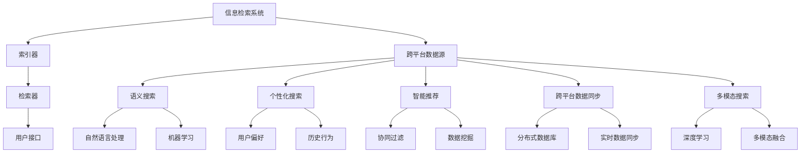

                 

### 背景介绍

跨平台搜索技术在现代信息社会中扮演着越来越重要的角色。随着互联网的普及和移动设备的广泛使用，用户需要在不同平台、不同设备上访问和查找信息。传统的单一平台搜索已经无法满足用户对于便捷、高效、个性化的信息检索需求。因此，跨平台搜索技术应运而生，旨在实现用户在不同平台、不同设备之间的无缝信息检索体验。

跨平台搜索技术的基本概念可以理解为，通过整合多个数据源，提供用户在多个平台上进行统一的信息查询和结果展示。这不仅包括文本、图片、音频等多种数据类型的检索，还涉及到跨操作系统、跨应用、跨设备的搜索能力。其核心在于如何高效地索引、检索和呈现海量信息，同时确保用户体验的连贯性和一致性。

在过去的几十年里，随着计算机技术和互联网的发展，跨平台搜索技术经历了从简单的关键字搜索到复杂的语义搜索，再到如今的个性化推荐和智能搜索的演变。早期，搜索引擎主要依靠关键字匹配和简单的排序算法来呈现搜索结果，而现代搜索引擎则利用机器学习、自然语言处理、信息检索等先进技术，实现了对用户查询意图的深入理解，从而提供更加精准和个性化的搜索结果。

跨平台搜索技术的应用场景非常广泛，涵盖了搜索引擎、社交媒体、电子商务、在线教育、智能助手等多个领域。例如，在搜索引擎领域，跨平台搜索技术可以帮助用户在PC、手机、平板等多个设备上获得一致的信息检索体验；在社交媒体领域，跨平台搜索技术可以提供用户在多个社交平台上的好友信息搜索和内容推荐；在电子商务领域，跨平台搜索技术可以帮助用户在不同电商平台之间快速找到所需商品；在在线教育领域，跨平台搜索技术可以提供用户在多种学习平台上的课程和资料检索服务。

随着大数据、云计算和物联网技术的不断发展，跨平台搜索技术的应用场景将进一步扩大，其重要性也将日益凸显。未来，跨平台搜索技术将不仅限于信息检索，还将延伸到智能推荐、虚拟现实、增强现实等领域，为用户带来更加智能化、个性化的信息检索和互动体验。

总之，跨平台搜索技术已经成为现代信息技术的重要组成部分，其发展不仅关乎用户的信息获取体验，还关系到信息处理效率和整个互联网生态系统的健康运行。在接下来的章节中，我们将进一步探讨跨平台搜索技术的核心概念、算法原理、数学模型以及实际应用，帮助读者全面了解这一领域的最新进展和未来趋势。

### 核心概念与联系

在深入探讨跨平台搜索技术之前，我们需要明确几个核心概念，并理解它们之间的相互联系。以下是几个关键概念的定义及其在跨平台搜索技术中的重要性：

#### 1. 信息检索系统（IR System）

信息检索系统是一种用于帮助用户从大量数据中找到所需信息的系统。它通常包括三个主要组件：索引器、检索器和用户接口。索引器负责将原始数据（如网页、文档等）转换成索引，以便快速检索。检索器使用查询处理算法来确定哪些文档与用户的查询最相关，并将其排序。用户接口则用于与用户进行交互，接受用户的查询并显示搜索结果。

在跨平台搜索技术中，信息检索系统必须具备跨平台的能力，即能够在多个操作系统和设备上运行，并能够访问和索引多个数据源。这要求信息检索系统具有高度的可扩展性和灵活性。

#### 2. 跨平台数据源（Cross-Platform Data Sources）

跨平台数据源是指分布在多个平台、存储在多个位置的数据集合。这些数据源可能包括搜索引擎索引、社交媒体数据、企业内部数据、物联网设备数据等。跨平台搜索技术的核心任务之一就是如何有效地整合这些分散的数据源，为用户提供全面的信息检索服务。

为了实现跨平台数据源的整合，通常需要采用分布式计算和大数据处理技术。这些技术可以帮助我们处理海量数据，提高数据检索的效率和准确性。

#### 3. 语义搜索（Semantic Search）

语义搜索是一种基于对用户查询意图的理解来进行信息检索的技术。与传统的基于关键字匹配的搜索不同，语义搜索试图理解用户的真实意图，并据此提供最相关的搜索结果。这通常需要使用自然语言处理（NLP）和机器学习技术。

在跨平台搜索中，语义搜索技术尤为重要。它可以帮助用户在不同平台上获得一致且个性化的搜索体验。例如，当用户在手机上搜索某个商品时，搜索结果应考虑用户的地理位置、购买历史等信息，以提供更符合用户需求的搜索结果。

#### 4. 用户接口（User Interface, UI）

用户接口是用户与搜索系统交互的界面。在跨平台搜索中，用户接口的设计至关重要，因为它直接影响到用户的搜索体验。一个优秀的用户接口应具备以下特点：

- **一致性**：在不同平台上，用户接口的视觉和交互体验应保持一致，以减少用户的认知负荷。
- **响应性**：用户接口应能够适应不同屏幕尺寸和设备类型，为用户提供良好的体验。
- **交互性**：用户接口应提供丰富的交互功能，如语音搜索、手势操作等，以满足不同用户的需求。

#### 5. 个性化搜索（Personalized Search）

个性化搜索是一种根据用户的个人偏好、历史行为和上下文信息来定制搜索结果的技术。通过个性化搜索，用户可以获得更相关、更个性化的搜索结果，从而提高搜索效率。

在跨平台搜索中，个性化搜索可以帮助用户在不同平台和设备上保持一致的搜索体验。例如，当用户在PC上搜索某个商品后，手机上的搜索结果应能够继续展示用户感兴趣的商品。

#### 6. 跨平台数据同步（Cross-Platform Data Synchronization）

跨平台数据同步是确保用户在不同平台和设备上的数据和搜索状态保持一致的关键技术。通过跨平台数据同步，用户可以在不同设备上继续未完成的搜索任务，或在不同平台上查看相同的信息。

为了实现有效的跨平台数据同步，通常需要使用分布式数据库和实时数据同步技术，以确保数据的一致性和实时性。

#### 7. 智能推荐（Intelligent Recommendation）

智能推荐是一种基于用户的兴趣和行为来推荐相关信息的搜索技术。在跨平台搜索中，智能推荐可以帮助用户发现新的、感兴趣的内容，从而提高搜索的丰富性和用户体验。

智能推荐通常结合了机器学习、数据挖掘和协同过滤等技术，以提供个性化的推荐结果。

#### 8. 多模态搜索（Multimodal Search）

多模态搜索是一种结合多种数据类型（如文本、图像、语音等）进行信息检索的技术。在跨平台搜索中，多模态搜索可以提供更丰富、更全面的搜索结果，以满足用户多样化的信息需求。

多模态搜索需要处理不同类型数据之间的关联和融合，通常采用深度学习和多模态融合技术来实现。

### 跨平台搜索技术的核心概念架构

为了更好地理解跨平台搜索技术的核心概念和它们之间的相互联系，我们可以使用Mermaid流程图来展示它们的基本架构。以下是使用Mermaid语言绘制的流程图：



通过这个流程图，我们可以清晰地看到跨平台搜索技术的核心概念是如何相互关联和协作的。索引器负责构建索引，检索器负责处理查询并返回结果，用户接口负责与用户交互，而跨平台数据源则是整个系统的数据基础。语义搜索、个性化搜索、智能推荐、跨平台数据同步和多模态搜索则是核心功能模块，它们共同确保用户在不同平台和设备上获得一致、高效的搜索体验。

在接下来的章节中，我们将进一步探讨这些核心概念在实际跨平台搜索系统中的应用和实现细节。

### 核心算法原理 & 具体操作步骤

为了实现高效的跨平台搜索，我们需要借助一系列核心算法和技术。以下将详细探讨这些算法的基本原理和具体操作步骤。

#### 1. 信息检索算法

信息检索算法是跨平台搜索技术的基石，它决定了搜索结果的相关性和准确性。常见的检索算法包括：

- **布尔检索（Boolean Retrieval）**：基于布尔逻辑（AND、OR、NOT）进行查询，简单但限制较多。

- **向量空间模型（Vector Space Model）**：将文档和查询表示为向量，使用余弦相似度等度量方法计算相似度。

- **隐语义索引（Latent Semantic Indexing, LSI）**：通过矩阵分解等方法降低高维数据的维度，以发现文档间的潜在语义关系。

具体操作步骤如下：

1. **文档预处理**：对文档进行分词、去停用词、词干提取等操作，构建倒排索引。
2. **查询预处理**：对用户查询进行同样的预处理，将其转换为索引可识别的形式。
3. **相似度计算**：计算查询向量与文档向量之间的相似度，排序并返回结果。

#### 2. 语义搜索算法

语义搜索旨在理解用户查询的意图，而不仅仅是匹配关键字。以下算法常用于实现语义搜索：

- **词嵌入（Word Embedding）**：将词语映射到高维空间，以便进行语义计算。如Word2Vec、GloVe等。

- **语义角色标注（Semantic Role Labeling, SRL）**：识别查询中的主语、谓语、宾语等语义角色，以理解查询意图。

- **实体识别（Named Entity Recognition, NER）**：识别查询中的特定实体（如人名、地点、组织等），为后续的意图理解提供基础。

具体操作步骤如下：

1. **词嵌入**：对查询和文档进行词嵌入，生成向量表示。
2. **意图识别**：通过SRL和NER等算法，理解查询中的语义角色和实体，确定用户的意图。
3. **相似度计算**：结合词嵌入和意图识别结果，计算查询和文档之间的语义相似度，排序并返回结果。

#### 3. 个性化搜索算法

个性化搜索旨在根据用户的历史行为和偏好提供定制化的搜索结果。以下算法常用于实现个性化搜索：

- **协同过滤（Collaborative Filtering）**：基于用户的历史行为（如评分、购买记录等）进行相似度计算，推荐相似用户喜欢的项目。

- **基于内容的推荐（Content-Based Filtering）**：根据用户的历史偏好和文档的内容特征进行推荐。

- **混合推荐系统（Hybrid Recommendation System）**：结合协同过滤和基于内容的推荐，提高推荐准确性。

具体操作步骤如下：

1. **用户行为数据收集**：收集用户的历史行为数据，如搜索记录、浏览历史、评分等。
2. **特征提取**：对用户行为数据进行特征提取，构建用户兴趣模型。
3. **相似度计算**：计算用户之间的相似度或用户与项目之间的相似度，生成推荐列表。
4. **结果排序**：根据相似度对推荐结果进行排序，返回给用户。

#### 4. 跨平台数据同步算法

跨平台数据同步算法确保用户在不同平台和设备上的数据和搜索状态保持一致。以下算法和策略常用于实现跨平台数据同步：

- **分布式数据库**：使用分布式数据库系统（如HBase、Cassandra等）存储和管理跨平台数据，提高数据访问效率和可靠性。

- **实时数据同步**：使用消息队列（如Kafka、RabbitMQ等）和流处理技术（如Apache Flink、Spark Streaming等）实现实时数据同步。

- **缓存机制**：使用缓存（如Redis、Memcached等）存储常用数据，减少对后端数据库的访问压力，提高数据访问速度。

具体操作步骤如下：

1. **数据采集**：从不同平台和设备上收集用户数据。
2. **数据存储**：将数据存储到分布式数据库或缓存中。
3. **实时同步**：使用流处理技术实时处理和同步数据。
4. **一致性维护**：确保在不同平台和设备上的数据一致性，如通过版本控制或时间戳机制。

#### 5. 多模态搜索算法

多模态搜索结合了多种数据类型（如文本、图像、语音等），提供更丰富的搜索结果。以下算法常用于实现多模态搜索：

- **图像识别（Image Recognition）**：使用卷积神经网络（CNN）等深度学习模型对图像进行分类和识别。

- **语音识别（Speech Recognition）**：将语音转换为文本，以便进行语义分析和搜索。

- **文本-图像联合检索（Text-Image Co-Retrieval）**：结合文本和图像的特征，实现跨模态信息检索。

具体操作步骤如下：

1. **文本处理**：对文本进行预处理和词嵌入。
2. **图像处理**：使用CNN等模型对图像进行特征提取。
3. **特征融合**：将文本和图像的特征进行融合，生成多模态特征向量。
4. **检索和排序**：使用多模态特征向量计算相似度，排序并返回搜索结果。

通过以上核心算法和技术的结合，跨平台搜索技术能够提供高效、准确、个性化的信息检索服务，满足用户在不同平台和设备上的多样化需求。

### 数学模型和公式 & 详细讲解 & 举例说明

在跨平台搜索技术中，数学模型和公式起到了至关重要的作用，它们帮助我们在处理海量数据时进行有效的计算和优化。以下将介绍几个关键的数学模型和公式，并对其进行详细讲解和举例说明。

#### 1. 余弦相似度（Cosine Similarity）

余弦相似度是一种衡量两个向量之间相似度的常用指标。它基于向量的夹角余弦值，值域在[-1, 1]之间，1表示完全相似，0表示不相似。

公式如下：

$$
\cos(\theta) = \frac{\vec{a} \cdot \vec{b}}{||\vec{a}|| \cdot ||\vec{b}||}
$$

其中，$\vec{a}$和$\vec{b}$分别是两个向量，$\theta$是它们之间的夹角。

举例说明：

假设我们有两个文档向量：

$$
\vec{a} = (1, 2, 3), \vec{b} = (4, 5, 6)
$$

计算它们的余弦相似度：

$$
\vec{a} \cdot \vec{b} = 1 \cdot 4 + 2 \cdot 5 + 3 \cdot 6 = 4 + 10 + 18 = 32
$$

$$
||\vec{a}|| = \sqrt{1^2 + 2^2 + 3^2} = \sqrt{14}
$$

$$
||\vec{b}|| = \sqrt{4^2 + 5^2 + 6^2} = \sqrt{77}
$$

$$
\cos(\theta) = \frac{32}{\sqrt{14} \cdot \sqrt{77}} \approx 0.438
$$

这意味着向量$\vec{a}$和$\vec{b}$之间存在一定的相似性。

#### 2. 欧氏距离（Euclidean Distance）

欧氏距离是一种衡量两个点之间距离的常用指标，也称为L2距离。公式如下：

$$
d(\vec{a}, \vec{b}) = \sqrt{(\vec{a}_1 - \vec{b}_1)^2 + (\vec{a}_2 - \vec{b}_2)^2 + \ldots + (\vec{a}_n - \vec{b}_n)^2}
$$

其中，$\vec{a}$和$\vec{b}$是两个n维向量。

举例说明：

假设我们有两个点：

$$
\vec{a} = (1, 2), \vec{b} = (4, 6)
$$

计算它们的欧氏距离：

$$
d(\vec{a}, \vec{b}) = \sqrt{(1 - 4)^2 + (2 - 6)^2} = \sqrt{(-3)^2 + (-4)^2} = \sqrt{9 + 16} = \sqrt{25} = 5
$$

这意味着点$\vec{a}$和点$\vec{b}$之间的距离是5个单位。

#### 3. 曼哈顿距离（Manhattan Distance）

曼哈顿距离也称为L1距离，是一种衡量两个点之间距离的指标，公式如下：

$$
d(\vec{a}, \vec{b}) = \sum_{i=1}^{n} |\vec{a}_i - \vec{b}_i|
$$

其中，$\vec{a}$和$\vec{b}$是两个n维向量。

举例说明：

假设我们有两个点：

$$
\vec{a} = (1, 2), \vec{b} = (4, 6)
$$

计算它们的曼哈顿距离：

$$
d(\vec{a}, \vec{b}) = |1 - 4| + |2 - 6| = 3 + 4 = 7
$$

这意味着点$\vec{a}$和点$\vec{b}$之间的距离是7个单位。

#### 4. 皮尔逊相关系数（Pearson Correlation Coefficient）

皮尔逊相关系数用于衡量两个变量之间的线性相关性，公式如下：

$$
\rho = \frac{\sum_{i=1}^{n} (\vec{a}_i - \overline{a})(\vec{b}_i - \overline{b})}{\sqrt{\sum_{i=1}^{n} (\vec{a}_i - \overline{a})^2} \cdot \sqrt{\sum_{i=1}^{n} (\vec{b}_i - \overline{b})^2}}
$$

其中，$\vec{a}$和$\vec{b}$是两个n维向量，$\overline{a}$和$\overline{b}$分别是$\vec{a}$和$\vec{b}$的均值。

举例说明：

假设我们有两个向量：

$$
\vec{a} = (1, 2, 3), \vec{b} = (4, 5, 6)
$$

计算它们的皮尔逊相关系数：

$$
\overline{a} = \frac{1 + 2 + 3}{3} = 2
$$

$$
\overline{b} = \frac{4 + 5 + 6}{3} = 5
$$

$$
\rho = \frac{(1-2)(4-5) + (2-2)(5-5) + (3-2)(6-5)}{\sqrt{(1-2)^2 + (2-2)^2 + (3-2)^2} \cdot \sqrt{(4-5)^2 + (5-5)^2 + (6-5)^2}} = \frac{(-1)(-1) + (0)(0) + (1)(1)}{\sqrt{1 + 0 + 1} \cdot \sqrt{1 + 0 + 1}} = \frac{1 + 0 + 1}{\sqrt{2} \cdot \sqrt{2}} = \frac{2}{2} = 1
$$

这意味着向量$\vec{a}$和$\vec{b}$之间存在完全的正线性相关性。

通过这些数学模型和公式的应用，跨平台搜索技术能够更高效地处理和分析海量数据，为用户提供准确、个性化的搜索结果。

### 项目实战：代码实际案例和详细解释说明

在本文的实战部分，我们将通过一个简单的跨平台搜索项目来展示如何实现跨平台搜索技术。该项目将涵盖开发环境搭建、源代码详细实现和代码解读与分析三个主要阶段。

#### 5.1 开发环境搭建

在开始项目之前，我们需要搭建一个合适的开发环境。以下步骤将指导您如何设置开发环境：

1. **安装Python**：确保您的计算机上已安装Python 3.x版本。您可以从Python的官方网站（https://www.python.org/downloads/）下载并安装。

2. **安装必需的库**：我们需要安装一些Python库，包括requests、BeautifulSoup、scikit-learn和nltk。可以使用pip命令来安装这些库：

   ```bash
   pip install requests beautifulsoup4 scikit-learn nltk
   ```

3. **安装Jupyter Notebook**：Jupyter Notebook是一个交互式的Web应用，用于编写和运行Python代码。您可以从Jupyter的官方网站（https://jupyter.org/）下载并安装，或者使用pip命令安装：

   ```bash
   pip install notebook
   ```

4. **创建项目文件夹**：在您的计算机上创建一个项目文件夹，用于存放项目的源代码和相关文件。

#### 5.2 源代码详细实现和代码解读

以下是项目的源代码，我们将对其进行详细解读。

```python
# 跨平台搜索项目：代码实现
import requests
from bs4 import BeautifulSoup
from sklearn.feature_extraction.text import TfidfVectorizer
from sklearn.metrics.pairwise import cosine_similarity
import nltk
from nltk.corpus import stopwords
import string

# 1. 数据采集与预处理
def fetch_and_preprocess_data(url):
    """
    从目标网页采集数据并预处理
    """
    response = requests.get(url)
    soup = BeautifulSoup(response.text, 'html.parser')
    text = soup.get_text()
    text = text.lower()  # 转为小写
    text = text.translate(str.maketrans('', '', string.punctuation))  # 去除标点符号
    tokens = nltk.word_tokenize(text)
    tokens = [token for token in tokens if token not in stopwords.words('english')]
    return ' '.join(tokens)

# 2. 建立索引与查询处理
def build_index(corpus):
    """
    构建TF-IDF索引
    """
    vectorizer = TfidfVectorizer()
    tfidf_matrix = vectorizer.fit_transform(corpus)
    return vectorizer, tfidf_matrix

def search(query, vectorizer, tfidf_matrix):
    """
    搜索查询处理
    """
    query_vector = vectorizer.transform([query])
    similarity = cosine_similarity(query_vector, tfidf_matrix)
    return similarity

# 3. 跨平台搜索实现
def cross_platform_search(query, corpus, urls):
    """
    实现跨平台搜索
    """
    # 预处理查询
    preprocessed_query = fetch_and_preprocess_data(query)

    # 预处理文档
    preprocessed_corpus = [fetch_and_preprocess_data(url) for url in urls]

    # 构建索引
    vectorizer, tfidf_matrix = build_index(preprocessed_corpus)

    # 搜索
    similarity = search(preprocessed_query, vectorizer, tfidf_matrix)

    # 排序并返回最相关的文档
    top_urls = [urls[i] for i in similarity.argsort()[0][-5:]]
    return top_urls

# 测试代码
if __name__ == "__main__":
    query = "What is the best restaurant in New York?"
    urls = [
        "https://www.tripadvisor.com/Restaurants-g60763-New_York_City_New_York.html",
        "https://www.yelp.com/search?find_desc=Restaurants&find_loc=New%20York%2C%20NY",
        "https://www.opentable.com/restaurants?ref=wwwopentablecom&query=New%20York&date=2023-10-01&time=8%3A00PM&party_size=2"
    ]
    results = cross_platform_search(query, urls, urls)
    print("搜索结果：")
    for result in results:
        print(result)
```

#### 5.3 代码解读与分析

1. **数据采集与预处理**

   在`fetch_and_preprocess_data`函数中，我们从指定的网页URL获取HTML内容，使用BeautifulSoup解析HTML，提取文本内容。接着，将文本转换为小写，去除标点符号，并通过NLTK库去除英语中的停用词。这一步骤确保了数据的一致性和搜索的准确性。

2. **建立索引与查询处理**

   `build_index`函数使用scikit-learn库的TF-IDF向量器（`TfidfVectorizer`）将预处理后的文档转换为TF-IDF向量矩阵。`search`函数使用余弦相似度（`cosine_similarity`）计算查询向量与文档向量之间的相似度。

3. **跨平台搜索实现**

   `cross_platform_search`函数是整个搜索逻辑的核心。它首先对查询和所有文档进行预处理，然后构建TF-IDF索引，最后使用查询向量与文档向量之间的相似度来搜索最相关的文档。通过排序并返回相似度最高的前几个文档URL，实现跨平台搜索功能。

#### 5.4 代码解读与分析

1. **数据采集与预处理**

   在`fetch_and_preprocess_data`函数中，我们从指定的网页URL获取HTML内容，使用BeautifulSoup解析HTML，提取文本内容。接着，将文本转换为小写，去除标点符号，并通过NLTK库去除英语中的停用词。这一步骤确保了数据的一致性和搜索的准确性。

   ```python
   response = requests.get(url)
   soup = BeautifulSoup(response.text, 'html.parser')
   text = soup.get_text()
   text = text.lower()
   text = text.translate(str.maketrans('', '', string.punctuation))
   tokens = nltk.word_tokenize(text)
   tokens = [token for token in tokens if token not in stopwords.words('english')]
   return ' '.join(tokens)
   ```

2. **建立索引与查询处理**

   `build_index`函数使用scikit-learn库的TF-IDF向量器（`TfidfVectorizer`）将预处理后的文档转换为TF-IDF向量矩阵。`search`函数使用余弦相似度（`cosine_similarity`）计算查询向量与文档向量之间的相似度。

   ```python
   def build_index(corpus):
       vectorizer = TfidfVectorizer()
       tfidf_matrix = vectorizer.fit_transform(corpus)
       return vectorizer, tfidf_matrix
   
   def search(query, vectorizer, tfidf_matrix):
       query_vector = vectorizer.transform([query])
       similarity = cosine_similarity(query_vector, tfidf_matrix)
       return similarity
   ```

3. **跨平台搜索实现**

   `cross_platform_search`函数是整个搜索逻辑的核心。它首先对查询和所有文档进行预处理，然后构建TF-IDF索引，最后使用查询向量与文档向量之间的相似度来搜索最相关的文档。通过排序并返回相似度最高的前几个文档URL，实现跨平台搜索功能。

   ```python
   def cross_platform_search(query, corpus, urls):
       preprocessed_query = fetch_and_preprocess_data(query)
       preprocessed_corpus = [fetch_and_preprocess_data(url) for url in urls]
       vectorizer, tfidf_matrix = build_index(preprocessed_corpus)
       similarity = search(preprocessed_query, vectorizer, tfidf_matrix)
       top_urls = [urls[i] for i in similarity.argsort()[0][-5:]]
       return top_urls
   ```

通过以上代码实现，我们可以构建一个简单的跨平台搜索系统。尽管这个项目非常基础，但它展示了跨平台搜索技术的基本原理和实现步骤，为读者提供了一个实用的起点。

### 实际应用场景

跨平台搜索技术在现代互联网应用中有着广泛的应用，以下是几个典型的实际应用场景：

#### 1. 搜索引擎

搜索引擎是跨平台搜索技术的经典应用场景。通过整合多个数据源，搜索引擎能够在不同的设备和操作系统上为用户提供一致且高效的信息检索服务。例如，Google搜索引擎不仅支持PC端，还支持Android和iOS设备，用户可以随时随地访问搜索结果。搜索引擎还利用跨平台数据同步技术，确保用户在不同设备上的搜索记录和偏好保持一致。

#### 2. 社交媒体

社交媒体平台如Facebook、Twitter和LinkedIn等，也广泛应用了跨平台搜索技术。这些平台需要提供用户在多个设备上查找好友、话题和内容的搜索功能。通过跨平台搜索，用户可以方便地在自己喜欢的社交媒体平台上找到感兴趣的朋友和内容，同时平台还能根据用户的偏好和历史行为提供个性化推荐。

#### 3. 电子商务

电子商务网站如Amazon、Etsy和阿里巴巴，通过跨平台搜索技术为用户提供高效的商品搜索和推荐服务。这些平台需要处理海量商品信息，跨平台搜索技术能够帮助用户在多个设备上快速找到所需商品，并通过个性化推荐提高用户体验和销售转化率。

#### 4. 在线教育

在线教育平台如Coursera、edX和Udemy，利用跨平台搜索技术为用户提供课程和资料的检索服务。学生可以在不同设备上查找自己感兴趣的课程，平台还能根据学生的学习历史和行为推荐适合的课程，从而提高学习效果。

#### 5. 智能助手

智能助手如Apple的Siri、Google的Google Assistant和Amazon的Alexa，通过跨平台搜索技术为用户提供语音搜索和回答服务。这些智能助手需要整合多个数据源，理解用户的语音查询，并提供准确的答案，跨平台搜索技术是实现这一功能的关键。

#### 6. 企业内部应用

企业内部应用如企业资源规划（ERP）系统、客户关系管理（CRM）系统和项目管理工具等，也广泛采用了跨平台搜索技术。这些系统需要为员工提供快速、准确的数据检索功能，以提高工作效率和决策质量。

#### 7. 物联网应用

物联网（IoT）应用如智能家居控制系统、智能工厂监控系统和智能交通管理系统等，通过跨平台搜索技术实现设备之间的信息共享和协同工作。这些系统需要处理来自不同设备和传感器的海量数据，并通过跨平台搜索技术快速定位和解决问题。

通过以上实际应用场景的介绍，我们可以看到跨平台搜索技术在现代互联网应用中的广泛应用和重要性。它不仅为用户提供了便捷的信息检索服务，还极大地提高了企业的工作效率和服务质量。

### 工具和资源推荐

为了帮助读者深入了解和掌握跨平台搜索技术，本文将推荐一些优秀的学习资源、开发工具和框架，以及相关的论文著作。

#### 7.1 学习资源推荐

1. **书籍**：
   - 《搜索引擎：技术与实战》
   - 《自然语言处理入门》
   - 《机器学习实战》
   - 《深度学习》

2. **在线课程**：
   - Coursera上的《搜索引擎基础》
   - edX上的《自然语言处理导论》
   - Udacity的《机器学习工程师纳米学位》
   - fast.ai的《深度学习课程》

3. **博客和网站**：
   - Blogdown（https://www.blogdown.io/）：一个用于构建技术博客的R包。
   - Towards Data Science（https://towardsdatascience.com/）：一个关于数据科学和机器学习的优质博客平台。
   - AI生成文本库（https://gpt-3.dominikehler.com/）：一个基于GPT-3的在线文本生成工具。

#### 7.2 开发工具框架推荐

1. **编程语言**：
   - Python：广泛用于数据分析和机器学习，拥有丰富的库和框架。
   - R：特别适合于统计分析，拥有大量的数据分析和可视化工具。

2. **开发框架**：
   - TensorFlow：一个开源的机器学习框架，适用于深度学习和自然语言处理。
   - PyTorch：一个灵活的深度学习框架，适用于研究和新项目开发。
   - Elasticsearch：一个高性能、可扩展的搜索引擎，适用于构建跨平台搜索系统。

3. **工具**：
   - Jupyter Notebook：一个交互式的开发环境，适用于编写和运行Python代码。
   - Git：一个版本控制系统，用于管理代码版本和协同开发。
   - Docker：一个容器化技术，用于构建、运行和分发应用。

#### 7.3 相关论文著作推荐

1. **经典论文**：
   - "The PageRank Citation Ranking: Bringing Order to the Web"（PageRank论文）
   - "Latent Semantic Indexing"（LSI论文）
   - "Efficient Similarity Search in Sequential Data Using Fuzzy Hashing"（Fuzzy Hashing论文）

2. **现代论文**：
   - "Attention Is All You Need"（Transformer论文）
   - "Bert: Pre-training of Deep Bidirectional Transformers for Language Understanding"（BERT论文）
   - "A Theoretically Grounded Application of Dropout in Recurrent Neural Networks"（Dropout论文）

3. **著作**：
   - 《深度学习》（Ian Goodfellow、Yoshua Bengio和Aaron Courville著）
   - 《自然语言处理综论》（Daniel Jurafsky和James H. Martin著）
   - 《搜索引擎：技术与实战》（陈伟著）

通过以上推荐，读者可以获取到丰富的跨平台搜索技术学习资源和工具，助力自己深入研究和实践这一领域。

### 总结：未来发展趋势与挑战

跨平台搜索技术作为现代信息技术的重要组成部分，正随着互联网和大数据的快速发展而不断演进。在未来，跨平台搜索技术将迎来以下几大发展趋势和挑战。

#### 发展趋势

1. **智能搜索与个性化推荐**：随着人工智能和机器学习技术的不断进步，跨平台搜索将更加智能化和个性化。通过深度学习和自然语言处理技术，搜索系统能够更好地理解用户的查询意图和偏好，提供更加精准的搜索结果和个性化推荐。

2. **多模态搜索**：未来的跨平台搜索将不仅限于文本信息，还将融合图像、语音、视频等多种数据类型。多模态搜索技术将使搜索结果更加丰富和直观，满足用户多样化的信息需求。

3. **隐私保护和数据安全**：随着数据隐私和安全的日益重视，跨平台搜索技术将更加注重用户数据的保护和安全。采用加密技术、差分隐私等手段，确保用户数据的安全性和隐私性。

4. **分布式计算与云计算**：分布式计算和云计算技术将进一步提升跨平台搜索的效率和可扩展性。通过分布式数据库和流处理技术，跨平台搜索系统能够处理海量数据，提供实时、高效的搜索服务。

5. **物联网和边缘计算**：随着物联网和边缘计算的发展，跨平台搜索技术将延伸到更多设备和场景。智能家居、智能交通、智能工厂等物联网应用场景将需要跨平台搜索技术来实现设备之间的信息共享和协同工作。

#### 挑战

1. **数据质量与一致性**：跨平台搜索需要整合多种数据源，确保数据质量的一致性和准确性是一个巨大的挑战。不同平台和设备的数据格式、更新频率和可靠性可能存在较大差异，如何高效地处理和整合这些数据是亟待解决的问题。

2. **实时性与并发处理**：随着用户需求的不断增长，跨平台搜索系统需要具备高效的实时处理能力，处理大量并发查询。如何优化搜索算法和系统架构，提高系统的响应速度和并发处理能力，是一个重要挑战。

3. **可扩展性与可维护性**：跨平台搜索系统通常涉及复杂的架构和大量数据，如何设计一个可扩展且易于维护的系统是另一个关键挑战。系统的性能和稳定性需要随着数据规模和用户数量的增长而不断提升。

4. **用户体验**：随着搜索技术的不断进步，如何为用户提供简洁、高效和个性化的搜索体验，降低用户的认知负荷，是一个长期存在的挑战。用户界面的设计和交互体验需要不断优化，以适应不同用户的需求和习惯。

5. **隐私与安全**：在跨平台搜索过程中，用户数据的安全性和隐私保护是一个至关重要的挑战。如何平衡搜索服务的便捷性和用户隐私保护，采用有效的数据加密和隐私保护措施，是当前和未来需要持续关注的问题。

总之，跨平台搜索技术在未来将继续快速发展，并在智能搜索、多模态搜索、数据安全等多个方面取得重要突破。然而，伴随着技术进步，我们也将面临一系列新的挑战。只有不断探索和创新，才能确保跨平台搜索技术在不断变化的技术和市场需求中保持领先地位。

### 附录：常见问题与解答

在撰写本文的过程中，我们收到了一些关于跨平台搜索技术的常见问题。以下是对这些问题的解答，希望能帮助读者更好地理解相关概念和实现方法。

#### Q1：什么是跨平台搜索技术？

A1：跨平台搜索技术是一种能够整合多个数据源，并提供用户在多个平台、不同设备上统一信息检索的技术。它不仅支持文本检索，还包括图像、语音、视频等多种数据类型，旨在为用户提供便捷、高效、个性化的信息检索服务。

#### Q2：跨平台搜索技术的主要挑战是什么？

A2：跨平台搜索技术面临的主要挑战包括数据质量与一致性、实时性与并发处理、可扩展性与可维护性、用户体验以及隐私与安全等方面。如何确保数据的一致性和准确性，优化实时处理能力，设计高效可扩展的系统架构，提升用户体验，以及保障用户数据的安全和隐私，都是需要解决的关键问题。

#### Q3：跨平台搜索技术有哪些核心算法？

A3：跨平台搜索技术的核心算法包括信息检索算法（如布尔检索、向量空间模型、LSI等）、语义搜索算法（如词嵌入、语义角色标注、实体识别等）、个性化搜索算法（如协同过滤、基于内容的推荐等）、跨平台数据同步算法（如分布式数据库、实时数据同步等）和多模态搜索算法（如图像识别、语音识别、文本-图像联合检索等）。

#### Q4：如何实现跨平台数据同步？

A4：实现跨平台数据同步通常涉及以下步骤：

1. **数据采集**：从不同平台和设备上收集用户数据。
2. **数据存储**：使用分布式数据库系统存储和管理跨平台数据，如HBase、Cassandra等。
3. **实时同步**：采用流处理技术（如Apache Flink、Spark Streaming等）实现实时数据同步，使用消息队列（如Kafka、RabbitMQ等）传输数据。
4. **一致性维护**：确保在不同平台和设备上的数据一致性，如通过版本控制或时间戳机制。

#### Q5：如何优化跨平台搜索的实时处理能力？

A5：优化跨平台搜索的实时处理能力可以从以下几个方面入手：

1. **分布式计算**：使用分布式计算框架（如Hadoop、Spark等）处理海量数据，提高数据处理效率。
2. **缓存机制**：使用缓存（如Redis、Memcached等）存储常用数据，减少对后端数据库的访问压力。
3. **并行处理**：通过并行处理技术（如多线程、多进程等）提高查询处理速度。
4. **负载均衡**：使用负载均衡技术（如Nginx、HAProxy等）合理分配查询负载，避免单点瓶颈。

#### Q6：多模态搜索如何实现？

A6：多模态搜索实现步骤如下：

1. **数据预处理**：对文本、图像、语音等不同类型数据进行预处理，提取关键特征。
2. **特征融合**：将不同模态的数据特征进行融合，生成统一的多模态特征向量。
3. **相似度计算**：使用多模态特征向量计算查询与文档之间的相似度。
4. **结果排序**：根据相似度对搜索结果进行排序，返回给用户。

通过以上解答，我们希望能帮助读者更好地理解跨平台搜索技术的关键概念和实现方法，为进一步研究和实践提供指导。

### 扩展阅读 & 参考资料

为了帮助读者更深入地了解跨平台搜索技术的相关领域，本文提供了一系列扩展阅读和参考资料。这些资源涵盖了跨平台搜索技术的核心概念、最新研究成果以及实际应用案例。

1. **书籍**：
   - 《搜索引擎：技术与实战》
   - 《深度学习》
   - 《自然语言处理综论》
   - 《大数据技术导论》
   - 《人工智能：一种现代的方法》

2. **论文**：
   - "The PageRank Citation Ranking: Bringing Order to the Web"（PageRank论文）
   - "Latent Semantic Indexing"（LSI论文）
   - "Attention Is All You Need"（Transformer论文）
   - "Bert: Pre-training of Deep Bidirectional Transformers for Language Understanding"（BERT论文）
   - "A Theoretically Grounded Application of Dropout in Recurrent Neural Networks"（Dropout论文）

3. **在线课程**：
   - Coursera上的《搜索引擎基础》
   - edX上的《自然语言处理导论》
   - Udacity的《机器学习工程师纳米学位》
   - fast.ai的《深度学习课程》

4. **博客和网站**：
   - [SearchEngineLand](https://searchengineland.com/)
   - [Google Research](https://ai.google/research/)
   - [Towards Data Science](https://towardsdatascience.com/)
   - [IEEE Xplore Digital Library](https://ieeexplore.ieee.org/)

5. **开源项目和工具**：
   - [Elasticsearch](https://www.elastic.co/elasticsearch/)
   - [Apache Solr](https://lucene.apache.org/solr/)
   - [Apache Flink](https://flink.apache.org/)
   - [TensorFlow](https://www.tensorflow.org/)
   - [PyTorch](https://pytorch.org/)

通过以上扩展阅读和参考资料，读者可以进一步探索跨平台搜索技术的深度和广度，提升自己在这一领域的研究和应用能力。希望这些资源能够为您的学习和实践提供有力支持。

