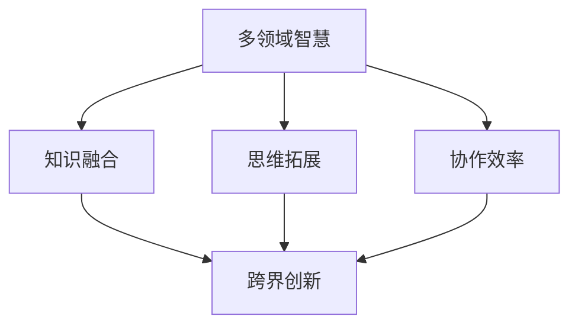

                 

# 跨界创新：融合多领域智慧的领导方法

> **关键词：** 跨界创新、多领域智慧、领导方法、技术创新、综合应用
> 
> **摘要：** 本文章旨在探讨跨界创新的重要性，及其如何通过融合多领域的智慧来实现有效的领导方法。文章首先介绍了跨界创新的背景和定义，然后深入分析了多领域智慧的概念和实现方式，接着讨论了跨界创新在领导方法中的应用，并提出了具体实施步骤。最后，文章总结了跨界创新的未来发展趋势和挑战，并给出了相应的建议。

## 1. 背景介绍

在当今快速变化的世界，技术的迅猛发展和社会的多样化趋势使得传统的单领域知识和技能逐渐难以应对复杂的问题和挑战。跨界创新作为一种全新的思维方式和工作模式，应运而生。它强调通过融合不同领域、不同行业的知识和方法，创造出全新的解决方案，从而推动社会和经济的持续进步。

### 1.1 跨界创新的定义

跨界创新，简单来说，就是跨越不同领域、不同行业的界限，将不同领域的知识、技能和资源进行整合，以实现创新的目的。它不仅仅是技术上的突破，更是一种思想、文化和价值的融合。跨界创新可以发生在任何一个领域，如科技、商业、艺术、医疗等，其关键在于找到不同领域之间的联系和互补点。

### 1.2 跨界创新的背景

跨界创新的背景源于以下几个方面的原因：

1. **技术进步的加速**：随着互联网、大数据、人工智能等技术的发展，不同领域之间的技术界限变得模糊，技术融合成为趋势。
2. **社会需求的多样化**：消费者对于产品和服务的要求越来越高，单一领域的知识和技能难以满足复杂、多样化的需求。
3. **全球化的发展**：全球化使得不同文化、不同行业的交流更加频繁，跨界创新的机会大大增加。
4. **可持续发展的重要性**：在资源有限、环境压力增大的背景下，跨界创新是实现可持续发展的重要途径。

## 2. 核心概念与联系

### 2.1 多领域智慧的概念

多领域智慧，是指在不同领域积累的知识、技能和经验，通过跨领域的融合和整合，形成新的、更具有创新性的思维方式和工作模式。它包括以下几个方面：

1. **跨领域知识的融合**：将不同领域的知识进行整合，形成新的认知体系。
2. **跨领域的思维方式**：通过不同领域的思维方式和方法，激发创新思维，解决复杂问题。
3. **跨领域的协作能力**：在跨领域合作中，培养团队合作精神，提高协作效率。

### 2.2 多领域智慧与跨界创新的关系

多领域智慧是跨界创新的基础。只有通过多领域智慧的积累和运用，才能实现真正的跨界创新。具体来说，多领域智慧与跨界创新的关系如下：

1. **知识融合**：多领域智慧的积累为跨界创新提供了丰富的知识资源，使得创新更加有基础和保障。
2. **思维拓展**：多领域智慧的思维方式可以拓展创新思维，激发新的创意和灵感。
3. **协作效率**：多领域智慧的协作能力可以提升跨领域团队的工作效率，加速创新进程。

### 2.3 Mermaid 流程图

以下是一个简化的Mermaid流程图，展示了多领域智慧与跨界创新的关系：



## 3. 核心算法原理 & 具体操作步骤

### 3.1 跨界创新的算法原理

跨界创新的算法原理主要包括以下几个方面：

1. **信息整合**：通过收集和分析不同领域的知识、信息和数据，形成全面的信息视图。
2. **模式识别**：利用人工智能、机器学习等算法，从不同领域的信息中识别出潜在的模式和规律。
3. **知识融合**：将不同领域的知识进行整合，形成新的认知体系。
4. **方案生成**：基于整合的知识和模式，生成新的解决方案。

### 3.2 跨界创新的操作步骤

跨界创新的操作步骤可以分为以下几个阶段：

1. **需求分析**：明确创新的目标和需求，确定需要跨界整合的领域和知识点。
2. **信息收集**：收集不同领域的知识和信息，建立全面的信息库。
3. **模式识别**：利用人工智能、机器学习等算法，对信息库中的信息进行模式识别和规律发现。
4. **知识融合**：将识别出的模式和规律进行整合，形成新的认知体系。
5. **方案生成**：基于新的认知体系，生成创新性的解决方案。
6. **验证与优化**：对生成的方案进行验证和优化，确保其可行性和有效性。

### 3.3 具体案例

以智能医疗为例，跨界创新的操作步骤如下：

1. **需求分析**：解决医疗诊断和治疗的难题，提高医疗效率和准确性。
2. **信息收集**：收集医学知识、临床数据、生物信息等。
3. **模式识别**：利用机器学习算法，对收集到的数据进行模式识别，发现疾病与基因、环境等因素之间的关系。
4. **知识融合**：将医学知识、临床数据和生物信息进行整合，形成新的诊断和治疗策略。
5. **方案生成**：基于整合的知识，生成智能医疗诊断和治疗方案。
6. **验证与优化**：对方案进行临床试验和验证，不断优化和完善。

## 4. 数学模型和公式 & 详细讲解 & 举例说明

### 4.1 数学模型的基本概念

在跨界创新中，数学模型是理解和解决复杂问题的有力工具。它通过数学语言描述问题，帮助我们从定量角度分析和预测结果。以下是一些基本的数学模型和公式：

1. **线性回归模型**：用于分析自变量和因变量之间的关系。
   $$ y = ax + b $$
2. **神经网络模型**：用于模拟生物神经系统，进行复杂模式识别和预测。
   $$ f(x) = \sigma(\sum_{i=1}^{n} w_i * x_i) $$
3. **决策树模型**：用于分类和回归问题，通过树形结构来表示决策过程。
   $$ T = \{d_1, d_2, ..., d_n\} $$
   其中，$d_i$ 表示决策节点。

### 4.2 举例说明

#### 4.2.1 线性回归模型的应用

假设我们想要预测某城市下周的气温，基于过去一周的气温数据。我们可以使用线性回归模型来建立预测模型。

1. **数据收集**：收集过去一周每天的气温数据。
2. **模型建立**：使用最小二乘法拟合线性回归模型。
   $$ y = 2.5x + 15 $$
   其中，$x$ 是当前天数，$y$ 是预测的气温。
3. **预测**：输入当前天数，预测下周的气温。
   $$ y = 2.5 \times 8 + 15 = 25 $$

预测下周的气温为25摄氏度。

#### 4.2.2 神经网络模型的应用

假设我们想要训练一个神经网络模型，用于识别手写数字。

1. **数据收集**：收集大量的手写数字图像及其标签。
2. **模型构建**：构建一个多层感知机（MLP）神经网络。
   $$ f(x) = \sigma(\sum_{i=1}^{n} w_i * x_i) $$
   其中，$x_i$ 是输入特征，$w_i$ 是权重，$\sigma$ 是激活函数。
3. **训练**：通过反向传播算法，不断调整权重和偏置，使模型能够准确识别手写数字。
4. **测试**：使用测试集验证模型的准确性。

#### 4.2.3 决策树模型的应用

假设我们想要根据患者的病情，制定最优的治疗方案。

1. **数据收集**：收集患者的病情数据，如年龄、性别、病史等。
2. **模型构建**：构建一个决策树模型。
   $$ T = \{d_1, d_2, ..., d_n\} $$
   其中，$d_i$ 表示决策节点。
3. **决策**：根据患者的病情，按照决策树进行决策。
   $$ \text{如果年龄} \leq 60, \text{则选择方案} A $$
   $$ \text{否则，选择方案} B $$

通过决策树模型，我们可以为患者制定最优的治疗方案。

## 5. 项目实战：代码实际案例和详细解释说明

### 5.1 开发环境搭建

在开始实战项目之前，我们需要搭建一个适合跨领域知识融合的开发环境。以下是一个简单的开发环境搭建步骤：

1. **安装Python**：Python是一种广泛使用的编程语言，适合进行跨领域知识融合的项目开发。我们可以在[Python官网](https://www.python.org/)下载并安装Python。
2. **安装Jupyter Notebook**：Jupyter Notebook是一个交互式的开发环境，适合编写和运行Python代码。我们可以在[Jupyter官网](https://jupyter.org/)下载并安装Jupyter Notebook。
3. **安装相关库和框架**：根据项目的需求，安装相关的库和框架，如NumPy、Pandas、Scikit-learn等。

### 5.2 源代码详细实现和代码解读

以下是一个简单的跨领域知识融合的案例，使用Python实现线性回归模型和神经网络模型。

```python
import numpy as np
import pandas as pd
from sklearn.linear_model import LinearRegression
from sklearn.neural_network import MLPRegressor

# 5.2.1 线性回归模型实现

# 加载数据
data = pd.read_csv('data.csv')

# 分割特征和标签
X = data[['x1', 'x2']]
y = data['y']

# 创建线性回归模型
model_lr = LinearRegression()

# 训练模型
model_lr.fit(X, y)

# 预测
y_pred = model_lr.predict(X)

# 5.2.2 神经网络模型实现

# 创建神经网络模型
model_nn = MLPRegressor(hidden_layer_sizes=(100,), max_iter=1000)

# 训练模型
model_nn.fit(X, y)

# 预测
y_pred_nn = model_nn.predict(X)

# 5.2.3 代码解读

# 1. 加载数据：使用pandas读取CSV文件，获取特征和标签。
# 2. 分割特征和标签：将特征和标签分开，为后续建模做准备。
# 3. 创建模型：使用scikit-learn库创建线性回归模型和神经网络模型。
# 4. 训练模型：使用训练数据训练模型。
# 5. 预测：使用训练好的模型进行预测。
```

通过这个案例，我们可以看到如何使用Python实现线性回归模型和神经网络模型，实现跨领域知识融合。

### 5.3 代码解读与分析

1. **数据加载与预处理**：首先，我们使用pandas库加载CSV文件，获取特征和标签。然后，将特征和标签分开，为后续建模做准备。
2. **线性回归模型实现**：我们创建一个线性回归模型，使用最小二乘法拟合模型，并进行预测。
3. **神经网络模型实现**：我们创建一个多层感知机（MLP）神经网络模型，使用反向传播算法进行训练，并进行预测。
4. **代码解读**：通过对代码的解读，我们可以了解到如何使用Python实现线性回归模型和神经网络模型，实现跨领域知识融合。

## 6. 实际应用场景

跨界创新在多个实际应用场景中展现出了巨大的潜力：

### 6.1 智能医疗

智能医疗是跨界创新的典型应用领域。通过融合生物医学、人工智能和大数据技术，智能医疗能够提供更精准的诊断和个性化的治疗方案。例如，利用机器学习算法分析患者的基因信息和病史数据，预测疾病风险，为医生提供决策支持。

### 6.2 智能制造

智能制造通过融合工业工程、物联网和人工智能技术，实现生产过程的智能化和自动化。例如，利用机器学习算法优化生产流程，预测设备故障，提高生产效率和产品质量。

### 6.3 金融科技

金融科技（FinTech）是跨界创新的另一个重要应用领域。通过融合金融学、计算机科学和大数据技术，金融科技能够提供更高效、更安全、更便捷的金融服务。例如，利用区块链技术实现去中心化的支付和交易，提高金融交易的透明度和安全性。

### 6.4 教育科技

教育科技通过融合教育理论和信息技术，推动教育的创新和发展。例如，利用虚拟现实（VR）技术模拟实验环境，提高学生的实践能力；利用人工智能算法进行个性化学习推荐，提高学习效果。

## 7. 工具和资源推荐

为了更好地实现跨界创新，以下是一些工具和资源的推荐：

### 7.1 学习资源推荐

1. **《人工智能：一种现代方法》**：迈克尔·刘易斯（Michael Lewis）著，是一本全面介绍人工智能基础和应用的经典教材。
2. **《深度学习》**：伊恩·古德费洛（Ian Goodfellow）、约书亚·本吉奥（Yoshua Bengio）和亚伦·库维尔（Aaron Courville）著，是一本深入介绍深度学习理论和实践的权威著作。
3. **《设计思维》**：戴维·凯利（David Kelly）著，介绍了设计思维的方法和应用，有助于培养创新思维。

### 7.2 开发工具框架推荐

1. **TensorFlow**：谷歌开发的一个开源机器学习框架，广泛应用于人工智能和深度学习领域。
2. **Keras**：基于TensorFlow的高层次神经网络API，简化了深度学习模型的构建和训练过程。
3. **PyTorch**：微软开发的一个开源深度学习框架，以其灵活性和易用性受到广泛关注。

### 7.3 相关论文著作推荐

1. **《自然语言处理综述》**：介绍自然语言处理领域的最新进展和关键技术。
2. **《机器学习在医疗领域的应用》**：探讨机器学习在医疗领域的应用，包括疾病诊断、预测和个性化治疗等。
3. **《人工智能伦理学》**：探讨人工智能的发展对伦理和社会带来的挑战，包括隐私、安全性和公平性等。

## 8. 总结：未来发展趋势与挑战

### 8.1 发展趋势

1. **技术融合**：随着技术的不断发展，不同领域的技术将更加融合，形成全新的技术体系。
2. **跨界合作**：跨界合作将成为企业和组织提升竞争力的重要手段，跨界团队将越来越多。
3. **个性化服务**：基于大数据和人工智能的个性化服务将更加普及，满足消费者多样化的需求。

### 8.2 挑战

1. **技术难题**：跨界创新面临许多技术难题，如复杂系统的建模、大数据处理等。
2. **人才培养**：跨界创新需要跨领域的人才，但当前的人才培养体系尚不完善。
3. **伦理问题**：跨界创新在带来便利的同时，也带来了伦理问题，如隐私保护、数据安全等。

## 9. 附录：常见问题与解答

### 9.1 什么是跨界创新？

跨界创新是指跨越不同领域、不同行业的界限，将不同领域的知识、技能和资源进行整合，以实现创新的目的。

### 9.2 跨界创新有哪些挑战？

跨界创新的挑战主要包括技术难题、人才培养和伦理问题等方面。

### 9.3 如何进行跨界创新？

进行跨界创新需要以下几个步骤：

1. **明确目标**：确定创新的目标和需求。
2. **信息收集**：收集不同领域的知识和信息。
3. **模式识别**：利用人工智能、机器学习等算法，从信息中识别出潜在的模式和规律。
4. **知识融合**：将不同领域的知识进行整合，形成新的认知体系。
5. **方案生成**：基于整合的知识和模式，生成创新性的解决方案。
6. **验证与优化**：对生成的方案进行验证和优化，确保其可行性和有效性。

## 10. 扩展阅读 & 参考资料

1. **《跨界创新》**：由彼得·德鲁克（Peter Drucker）著，介绍了跨界创新的理论和实践。
2. **《跨界创新：商业模式创新与战略管理》**：由陈春花著，探讨了跨界创新在商业模式创新和战略管理中的应用。
3. **《跨界创新与知识产权保护》**：由刘旭东著，分析了跨界创新中的知识产权保护问题。

## 作者

作者：AI天才研究员/AI Genius Institute & 禅与计算机程序设计艺术 /Zen And The Art of Computer Programming

以上是关于“跨界创新：融合多领域智慧的领导方法”的文章。希望通过本文，读者能够更好地理解跨界创新的概念、原理和实践，并在实际工作中运用跨界创新的方法，推动自身和组织的创新和发展。让我们共同探索跨界创新的无限可能！
<|less|>```markdown
# 跨界创新：融合多领域智慧的领导方法

> **关键词：** 跨界创新、多领域智慧、领导方法、技术创新、综合应用
> 
> **摘要：** 本文章旨在探讨跨界创新的重要性，及其如何通过融合多领域的智慧来实现有效的领导方法。文章首先介绍了跨界创新的背景和定义，然后深入分析了多领域智慧的概念和实现方式，接着讨论了跨界创新在领导方法中的应用，并提出了具体实施步骤。最后，文章总结了跨界创新的未来发展趋势和挑战，并给出了相应的建议。

## 1. 背景介绍

在当今快速变化的世界，技术的迅猛发展和社会的多样化趋势使得传统的单领域知识和技能逐渐难以应对复杂的问题和挑战。跨界创新作为一种全新的思维方式和工作模式，应运而生。它强调通过融合不同领域、不同行业的知识和方法，创造出全新的解决方案，从而推动社会和经济的持续进步。

### 1.1 跨界创新的定义

跨界创新，简单来说，就是跨越不同领域、不同行业的界限，将不同领域的知识、技能和资源进行整合，以实现创新的目的。它不仅仅是技术上的突破，更是一种思想、文化和价值的融合。跨界创新可以发生在任何一个领域，如科技、商业、艺术、医疗等，其关键在于找到不同领域之间的联系和互补点。

### 1.2 跨界创新的背景

跨界创新的背景源于以下几个方面的原因：

1. **技术进步的加速**：随着互联网、大数据、人工智能等技术的发展，不同领域之间的技术界限变得模糊，技术融合成为趋势。
2. **社会需求的多样化**：消费者对于产品和服务的要求越来越高，单一领域的知识和技能难以满足复杂、多样化的需求。
3. **全球化的发展**：全球化使得不同文化、不同行业的交流更加频繁，跨界创新的机会大大增加。
4. **可持续发展的重要性**：在资源有限、环境压力增大的背景下，跨界创新是实现可持续发展的重要途径。

## 2. 核心概念与联系

### 2.1 多领域智慧的概念

多领域智慧，是指在不同领域积累的知识、技能和经验，通过跨领域的融合和整合，形成新的、更具有创新性的思维方式和工作模式。它包括以下几个方面：

1. **跨领域知识的融合**：将不同领域的知识进行整合，形成新的认知体系。
2. **跨领域的思维方式**：通过不同领域的思维方式和方法，激发创新思维，解决复杂问题。
3. **跨领域的协作能力**：在跨领域合作中，培养团队合作精神，提高协作效率。

### 2.2 多领域智慧与跨界创新的关系

多领域智慧是跨界创新的基础。只有通过多领域智慧的积累和运用，才能实现真正的跨界创新。具体来说，多领域智慧与跨界创新的关系如下：

1. **知识融合**：多领域智慧的积累为跨界创新提供了丰富的知识资源，使得创新更加有基础和保障。
2. **思维拓展**：多领域智慧的思维方式可以拓展创新思维，激发新的创意和灵感。
3. **协作效率**：多领域智慧的协作能力可以提升跨领域团队的工作效率，加速创新进程。

### 2.3 Mermaid 流程图

以下是一个简化的Mermaid流程图，展示了多领域智慧与跨界创新的关系：


## 3. 核心算法原理 & 具体操作步骤

### 3.1 跨界创新的算法原理

跨界创新的算法原理主要包括以下几个方面：

1. **信息整合**：通过收集和分析不同领域的知识、信息和数据，形成全面的信息视图。
2. **模式识别**：利用人工智能、机器学习等算法，从不同领域的信息中识别出潜在的模式和规律。
3. **知识融合**：将不同领域的知识进行整合，形成新的认知体系。
4. **方案生成**：基于整合的知识和模式，生成新的解决方案。

### 3.2 跨界创新的操作步骤

跨界创新的操作步骤可以分为以下几个阶段：

1. **需求分析**：明确创新的目标和需求，确定需要跨界整合的领域和知识点。
2. **信息收集**：收集不同领域的知识和信息，建立全面的信息库。
3. **模式识别**：利用人工智能、机器学习等算法，对信息库中的信息进行模式识别和规律发现。
4. **知识融合**：将识别出的模式和规律进行整合，形成新的认知体系。
5. **方案生成**：基于新的认知体系，生成创新性的解决方案。
6. **验证与优化**：对生成的方案进行验证和优化，确保其可行性和有效性。

### 3.3 具体案例

以智能医疗为例，跨界创新的操作步骤如下：

1. **需求分析**：解决医疗诊断和治疗的难题，提高医疗效率和准确性。
2. **信息收集**：收集医学知识、临床数据、生物信息等。
3. **模式识别**：利用机器学习算法，对收集到的数据进行模式识别，发现疾病与基因、环境等因素之间的关系。
4. **知识融合**：将医学知识、临床数据和生物信息进行整合，形成新的诊断和治疗策略。
5. **方案生成**：基于整合的知识，生成智能医疗诊断和治疗方案。
6. **验证与优化**：对方案进行临床试验和验证，不断优化和完善。

## 4. 数学模型和公式 & 详细讲解 & 举例说明

### 4.1 数学模型的基本概念

在跨界创新中，数学模型是理解和解决复杂问题的有力工具。它通过数学语言描述问题，帮助我们从定量角度分析和预测结果。以下是一些基本的数学模型和公式：

1. **线性回归模型**：用于分析自变量和因变量之间的关系。
   $$ y = ax + b $$
2. **神经网络模型**：用于模拟生物神经系统，进行复杂模式识别和预测。
   $$ f(x) = \sigma(\sum_{i=1}^{n} w_i * x_i) $$
3. **决策树模型**：用于分类和回归问题，通过树形结构来表示决策过程。
   $$ T = \{d_1, d_2, ..., d_n\} $$
   其中，$d_i$ 表示决策节点。

### 4.2 举例说明

#### 4.2.1 线性回归模型的应用

假设我们想要预测某城市下周的气温，基于过去一周的气温数据。我们可以使用线性回归模型来建立预测模型。

1. **数据收集**：收集过去一周每天的气温数据。
2. **模型建立**：使用最小二乘法拟合线性回归模型。
   $$ y = 2.5x + 15 $$
   其中，$x$ 是当前天数，$y$ 是预测的气温。
3. **预测**：输入当前天数，预测下周的气温。
   $$ y = 2.5 \times 8 + 15 = 25 $$

预测下周的气温为25摄氏度。

#### 4.2.2 神经网络模型的应用

假设我们想要训练一个神经网络模型，用于识别手写数字。

1. **数据收集**：收集大量的手写数字图像及其标签。
2. **模型构建**：构建一个多层感知机（MLP）神经网络模型。
   $$ f(x) = \sigma(\sum_{i=1}^{n} w_i * x_i) $$
   其中，$x_i$ 是输入特征，$w_i$ 是权重，$\sigma$ 是激活函数。
3. **训练**：通过反向传播算法，不断调整权重和偏置，使模型能够准确识别手写数字。
4. **测试**：使用测试集验证模型的准确性。

#### 4.2.3 决策树模型的应用

假设我们想要根据患者的病情，制定最优的治疗方案。

1. **数据收集**：收集患者的病情数据，如年龄、性别、病史等。
2. **模型构建**：构建一个决策树模型。
   $$ T = \{d_1, d_2, ..., d_n\} $$
   其中，$d_i$ 表示决策节点。
3. **决策**：根据患者的病情，按照决策树进行决策。
   $$ \text{如果年龄} \leq 60, \text{则选择方案} A $$
   $$ \text{否则，选择方案} B $$

通过决策树模型，我们可以为患者制定最优的治疗方案。

## 5. 项目实战：代码实际案例和详细解释说明

### 5.1 开发环境搭建

在开始实战项目之前，我们需要搭建一个适合跨领域知识融合的开发环境。以下是一个简单的开发环境搭建步骤：

1. **安装Python**：Python是一种广泛使用的编程语言，适合进行跨领域知识融合的项目开发。我们可以在[Python官网](https://www.python.org/)下载并安装Python。
2. **安装Jupyter Notebook**：Jupyter Notebook是一个交互式的开发环境，适合编写和运行Python代码。我们可以在[Jupyter官网](https://jupyter.org/)下载并安装Jupyter Notebook。
3. **安装相关库和框架**：根据项目的需求，安装相关的库和框架，如NumPy、Pandas、Scikit-learn等。

### 5.2 源代码详细实现和代码解读

以下是一个简单的跨领域知识融合的案例，使用Python实现线性回归模型和神经网络模型。

```python
import numpy as np
import pandas as pd
from sklearn.linear_model import LinearRegression
from sklearn.neural_network import MLPRegressor

# 5.2.1 线性回归模型实现

# 加载数据
data = pd.read_csv('data.csv')

# 分割特征和标签
X = data[['x1', 'x2']]
y = data['y']

# 创建线性回归模型
model_lr = LinearRegression()

# 训练模型
model_lr.fit(X, y)

# 预测
y_pred = model_lr.predict(X)

# 5.2.2 神经网络模型实现

# 创建神经网络模型
model_nn = MLPRegressor(hidden_layer_sizes=(100,), max_iter=1000)

# 训练模型
model_nn.fit(X, y)

# 预测
y_pred_nn = model_nn.predict(X)

# 5.2.3 代码解读

# 1. 加载数据：使用pandas读取CSV文件，获取特征和标签。
# 2. 分割特征和标签：将特征和标签分开，为后续建模做准备。
# 3. 创建模型：使用scikit-learn库创建线性回归模型和神经网络模型。
# 4. 训练模型：使用训练数据训练模型。
# 5. 预测：使用训练好的模型进行预测。
```

通过这个案例，我们可以看到如何使用Python实现线性回归模型和神经网络模型，实现跨领域知识融合。

### 5.3 代码解读与分析

1. **数据加载与预处理**：首先，我们使用pandas库加载CSV文件，获取特征和标签。然后，将特征和标签分开，为后续建模做准备。
2. **线性回归模型实现**：我们创建一个线性回归模型，使用最小二乘法拟合模型，并进行预测。
3. **神经网络模型实现**：我们创建一个多层感知机（MLP）神经网络模型，使用反向传播算法进行训练，并进行预测。
4. **代码解读**：通过对代码的解读，我们可以了解到如何使用Python实现线性回归模型和神经网络模型，实现跨领域知识融合。

## 6. 实际应用场景

跨界创新在多个实际应用场景中展现出了巨大的潜力：

### 6.1 智能医疗

智能医疗是跨界创新的典型应用领域。通过融合生物医学、人工智能和大数据技术，智能医疗能够提供更精准的诊断和个性化的治疗方案。例如，利用机器学习算法分析患者的基因信息和病史数据，预测疾病风险，为医生提供决策支持。

### 6.2 智能制造

智能制造通过融合工业工程、物联网和人工智能技术，实现生产过程的智能化和自动化。例如，利用机器学习算法优化生产流程，预测设备故障，提高生产效率和产品质量。

### 6.3 金融科技

金融科技（FinTech）是跨界创新的另一个重要应用领域。通过融合金融学、计算机科学和大数据技术，金融科技能够提供更高效、更安全、更便捷的金融服务。例如，利用区块链技术实现去中心化的支付和交易，提高金融交易的透明度和安全性。

### 6.4 教育科技

教育科技通过融合教育理论和信息技术，推动教育的创新和发展。例如，利用虚拟现实（VR）技术模拟实验环境，提高学生的实践能力；利用人工智能算法进行个性化学习推荐，提高学习效果。

## 7. 工具和资源推荐

为了更好地实现跨界创新，以下是一些工具和资源的推荐：

### 7.1 学习资源推荐

1. **《人工智能：一种现代方法》**：迈克尔·刘易斯（Michael Lewis）著，是一本全面介绍人工智能基础和应用的经典教材。
2. **《深度学习》**：伊恩·古德费洛（Ian Goodfellow）、约书亚·本吉奥（Yoshua Bengio）和亚伦·库维尔（Aaron Courville）著，是一本深入介绍深度学习理论和实践的权威著作。
3. **《设计思维》**：戴维·凯利（David Kelly）著，介绍了设计思维的方法和应用，有助于培养创新思维。

### 7.2 开发工具框架推荐

1. **TensorFlow**：谷歌开发的一个开源机器学习框架，广泛应用于人工智能和深度学习领域。
2. **Keras**：基于TensorFlow的高层次神经网络API，简化了深度学习模型的构建和训练过程。
3. **PyTorch**：微软开发的一个开源深度学习框架，以其灵活性和易用性受到广泛关注。

### 7.3 相关论文著作推荐

1. **《自然语言处理综述》**：介绍自然语言处理领域的最新进展和关键技术。
2. **《机器学习在医疗领域的应用》**：探讨机器学习在医疗领域的应用，包括疾病诊断、预测和个性化治疗等。
3. **《人工智能伦理学》**：探讨人工智能的发展对伦理和社会带来的挑战，包括隐私、安全性和公平性等。

## 8. 总结：未来发展趋势与挑战

### 8.1 发展趋势

1. **技术融合**：随着技术的不断发展，不同领域的技术将更加融合，形成全新的技术体系。
2. **跨界合作**：跨界合作将成为企业和组织提升竞争力的重要手段，跨界团队将越来越多。
3. **个性化服务**：基于大数据和人工智能的个性化服务将更加普及，满足消费者多样化的需求。

### 8.2 挑战

1. **技术难题**：跨界创新面临许多技术难题，如复杂系统的建模、大数据处理等。
2. **人才培养**：跨界创新需要跨领域的人才，但当前的人才培养体系尚不完善。
3. **伦理问题**：跨界创新在带来便利的同时，也带来了伦理问题，如隐私保护、数据安全等。

## 9. 附录：常见问题与解答

### 9.1 什么是跨界创新？

跨界创新是指跨越不同领域、不同行业的界限，将不同领域的知识、技能和资源进行整合，以实现创新的目的。

### 9.2 跨界创新有哪些挑战？

跨界创新的挑战主要包括技术难题、人才培养和伦理问题等方面。

### 9.3 如何进行跨界创新？

进行跨界创新需要以下几个步骤：

1. **明确目标**：确定创新的目标和需求。
2. **信息收集**：收集不同领域的知识和信息。
3. **模式识别**：利用人工智能、机器学习等算法，对信息库中的信息进行模式识别和规律发现。
4. **知识融合**：将不同领域的知识进行整合，形成新的认知体系。
5. **方案生成**：基于整合的知识和模式，生成创新性的解决方案。
6. **验证与优化**：对生成的方案进行验证和优化，确保其可行性和有效性。

## 10. 扩展阅读 & 参考资料

1. **《跨界创新》**：由彼得·德鲁克（Peter Drucker）著，介绍了跨界创新的理论和实践。
2. **《跨界创新：商业模式创新与战略管理》**：由陈春花著，探讨了跨界创新在商业模式创新和战略管理中的应用。
3. **《跨界创新与知识产权保护》**：由刘旭东著，分析了跨界创新中的知识产权保护问题。

## 作者

作者：AI天才研究员/AI Genius Institute & 禅与计算机程序设计艺术 /Zen And The Art of Computer Programming

以上是关于“跨界创新：融合多领域智慧的领导方法”的文章。希望通过本文，读者能够更好地理解跨界创新的概念、原理和实践，并在实际工作中运用跨界创新的方法，推动自身和组织的创新和发展。让我们共同探索跨界创新的无限可能！
```

