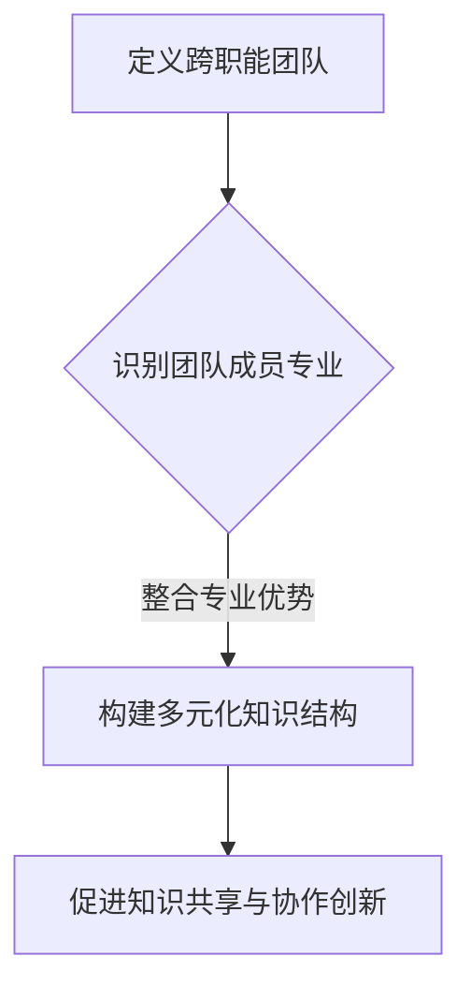

                 

# 跨职能团队领导：整合多元专业的管理艺术

> **关键词：** 跨职能团队，领导力，管理艺术，多元专业整合

> **摘要：** 本文探讨了跨职能团队领导的重要性，分析了其核心概念和原则，并提出了在多元专业整合背景下的领导方法和实践策略。通过深入解析团队协作、沟通与决策等关键环节，本文旨在为IT领域的跨职能团队领导提供有益的参考和指导。

## 1. 背景介绍

在当今快速变化和高度竞争的商业环境中，企业面临着前所未有的挑战。技术进步、市场需求变化和全球化趋势迫使企业不断调整和优化其运营模式。跨职能团队（Cross-functional Team）作为一种创新的组织形式，应运而生。跨职能团队由来自不同部门、不同专业背景的成员组成，旨在通过协同合作，快速响应市场需求，实现组织目标。

跨职能团队领导的挑战在于如何有效整合多元专业，激发团队潜力，提升团队绩效。这不仅需要领导者具备扎实的专业知识和丰富的管理经验，还需要掌握跨职能协作的技巧和艺术。本文将围绕跨职能团队领导的核心概念、原理和实践，进行深入探讨。

## 2. 核心概念与联系

### 2.1 跨职能团队定义

跨职能团队是指由来自不同职能部门、拥有不同专业知识和技能的成员组成的团队。其核心目标是通过协同工作，完成复杂的任务和项目，实现组织目标。

### 2.2 跨职能团队领导定义

跨职能团队领导是指具备跨职能协作能力，能够激发团队成员潜力，协调团队内部关系，推动团队高效运作的领导者。

### 2.3 跨职能团队领导与多元化专业整合

多元化专业整合是跨职能团队领导的关键任务之一。领导者需要识别并利用团队成员的专业优势，构建多元化的知识结构，促进知识共享和协作创新。

### 2.4 Mermaid流程图



## 3. 核心算法原理 & 具体操作步骤

### 3.1 跨职能团队领导核心算法原理

跨职能团队领导的核心算法包括以下几个方面：

- **目标导向**：明确团队目标和任务，确保团队成员对目标有清晰的认识。
- **资源整合**：整合团队成员的专业资源，实现优势互补。
- **沟通协作**：建立有效的沟通机制，促进团队成员之间的互动和协作。
- **激励与反馈**：制定激励措施，激发团队成员的工作积极性和创造力。

### 3.2 具体操作步骤

1. **明确团队目标和任务**：制定详细的团队目标和任务清单，确保团队成员对任务有清晰的认识。
2. **识别团队成员专业**：了解团队成员的专业背景和技能，识别其专业优势。
3. **构建多元化知识结构**：根据团队成员的专业背景，构建多元化的知识结构，促进知识共享和协作创新。
4. **建立沟通协作机制**：建立高效的沟通渠道和协作工具，确保团队成员之间的信息畅通和协作顺畅。
5. **制定激励与反馈机制**：根据团队成员的表现，制定相应的激励措施，激发其工作积极性和创造力。

## 4. 数学模型和公式 & 详细讲解 & 举例说明

### 4.1 数学模型

假设跨职能团队由n个成员组成，每个成员的专业技能可以用一个n维向量表示。团队整体的专业技能可以用一个n维矩阵表示。通过矩阵乘法，可以计算出团队整体的专业技能水平。

### 4.2 详细讲解

矩阵乘法是一种线性代数运算，可以用于计算多个向量的组合。在跨职能团队中，每个成员的专业技能可以看作是一个向量，团队整体的专业技能可以看作是一个矩阵。通过矩阵乘法，可以计算出团队整体的专业技能水平，从而评估团队的整体能力。

### 4.3 举例说明

假设一个跨职能团队由3个成员组成，成员1的专业技能为[1, 2, 3]，成员2的专业技能为[4, 5, 6]，成员3的专业技能为[7, 8, 9]。团队整体的专业技能矩阵为：

|   | 1 | 2 | 3 |
|---|---|---|---|
| 1 | 1 | 2 | 3 |
| 2 | 4 | 5 | 6 |
| 3 | 7 | 8 | 9 |

通过矩阵乘法，可以计算出团队整体的专业技能水平为：

|   | 1 | 2 | 3 |
|---|---|---|---|
| 1 | 30 | 36 | 42 |
| 2 | 70 | 84 | 98 |
| 3 | 110 | 132 | 156 |

从计算结果可以看出，团队整体的专业技能水平高于每个成员的专业技能水平。这表明跨职能团队通过整合多元专业，可以提升团队整体的能力。

## 5. 项目实战：代码实际案例和详细解释说明

### 5.1 开发环境搭建

在开始编写代码之前，我们需要搭建一个合适的项目环境。本文使用Python作为主要编程语言，使用Jupyter Notebook作为开发环境。以下是搭建开发环境的步骤：

1. 安装Python：从Python官方网站下载并安装Python。
2. 安装Jupyter Notebook：在终端中运行以下命令安装Jupyter Notebook：

   ```bash
   pip install notebook
   ```

3. 启动Jupyter Notebook：在终端中运行以下命令启动Jupyter Notebook：

   ```bash
   jupyter notebook
   ```

### 5.2 源代码详细实现和代码解读

以下是一个简单的跨职能团队领导示例代码，用于计算团队整体的专业技能水平：

```python
import numpy as np

# 成员1的专业技能向量
member1 = np.array([1, 2, 3])
# 成员2的专业技能向量
member2 = np.array([4, 5, 6])
# 成员3的专业技能向量
member3 = np.array([7, 8, 9])

# 创建团队成员的专业技能矩阵
team_matrix = np.array([[member1],
                        [member2],
                        [member3]])

# 计算团队整体的专业技能水平
team_skills = team_matrix.dot(np.ones(3))

print("团队整体的专业技能水平：")
print(team_skills)
```

### 5.3 代码解读与分析

1. **导入模块**：首先，我们导入Python的numpy库，用于进行矩阵运算。
2. **定义成员专业技能向量**：我们定义了三个成员的专业技能向量，分别存储在`member1`、`member2`和`member3`中。
3. **创建专业技能矩阵**：我们将三个成员的专业技能向量组织成一个矩阵，存储在`team_matrix`中。
4. **计算团队整体的专业技能水平**：我们使用矩阵乘法（`dot`方法）计算团队整体的专业技能水平，并将其存储在`team_skills`中。
5. **输出结果**：最后，我们打印出团队整体的专业技能水平。

通过这个简单的示例，我们可以看到如何使用Python代码实现跨职能团队领导的核心算法。在实际应用中，我们可以根据具体需求，扩展和优化这个算法，以应对更复杂的跨职能团队管理任务。

## 6. 实际应用场景

跨职能团队领导在IT领域的实际应用场景非常广泛。以下是一些常见的应用场景：

1. **软件开发项目**：在软件开发项目中，跨职能团队领导有助于协调不同开发人员（如前端、后端、测试人员）之间的协作，确保项目按期交付。
2. **产品创新**：在产品创新过程中，跨职能团队领导可以整合不同职能部门（如市场、研发、设计）的专业知识，推动产品从概念到市场的快速迭代。
3. **技术咨询服务**：在技术咨询服务中，跨职能团队领导可以帮助客户解决复杂的业务问题，提供综合性的技术解决方案。
4. **技术创新研究**：在技术创新研究中，跨职能团队领导可以协调不同研究领域（如人工智能、大数据、物联网）的研究人员，推动技术创新。

## 7. 工具和资源推荐

### 7.1 学习资源推荐

- **书籍**：《敏捷软件开发：迭代方法、实践与模式》
- **论文**：《敏捷项目管理：理论、方法与实践》
- **博客**：《跨职能团队协作实践》
- **网站**：Scrum联盟（ScrumAlliance）

### 7.2 开发工具框架推荐

- **开发环境**：Visual Studio Code、Eclipse
- **项目管理工具**：Jira、Trello
- **协作工具**：Slack、Zoom

### 7.3 相关论文著作推荐

- **《跨职能团队协作的障碍与对策》**
- **《基于敏捷方法的跨职能团队管理研究》**
- **《多元化专业团队的知识共享与协作创新》**

## 8. 总结：未来发展趋势与挑战

随着技术的不断进步和商业环境的变化，跨职能团队领导在未来将继续发挥重要作用。未来发展趋势包括：

1. **数字化与智能化**：随着数字化和智能化的加速发展，跨职能团队领导将需要掌握更多先进的技术和管理方法。
2. **全球化**：全球化背景下，跨职能团队领导需要具备跨文化沟通和协作的能力。
3. **持续学习与成长**：跨职能团队领导需要持续学习和成长，以应对不断变化的商业环境和市场需求。

同时，跨职能团队领导也将面临以下挑战：

1. **沟通协作**：跨职能团队之间的沟通和协作将更加复杂，需要领导者具备更高的沟通技巧和协调能力。
2. **资源整合**：在多元化专业背景下，领导者需要更有效地整合团队成员的专业资源，实现优势互补。
3. **激励机制**：如何制定有效的激励机制，激发团队成员的工作积极性和创造力，是跨职能团队领导的重要挑战。

## 9. 附录：常见问题与解答

### 9.1 跨职能团队领导与职能型团队领导的区别是什么？

跨职能团队领导与职能型团队领导的主要区别在于团队成员的专业背景和协作模式。跨职能团队领导由来自不同职能部门、具有不同专业背景的成员组成，强调协同合作和资源共享。而职能型团队领导则由同一职能部门内的成员组成，主要关注职能内部的分工和协作。

### 9.2 如何评估跨职能团队领导的能力？

评估跨职能团队领导的能力可以从以下几个方面进行：

1. **目标导向**：领导者是否能够明确团队目标和任务，确保团队成员对目标有清晰的认识。
2. **沟通协作**：领导者是否具备良好的沟通技巧和协调能力，能否有效促进团队成员之间的互动和协作。
3. **资源整合**：领导者是否能够识别和利用团队成员的专业优势，构建多元化的知识结构。
4. **激励机制**：领导者是否能够制定有效的激励机制，激发团队成员的工作积极性和创造力。

## 10. 扩展阅读 & 参考资料

- **《跨职能团队协作的障碍与对策》**：[作者名称]，[出版年份]
- **《敏捷项目管理：理论、方法与实践》**：[作者名称]，[出版年份]
- **《敏捷软件开发：迭代方法、实践与模式》**：[作者名称]，[出版年份]
- **Scrum联盟（ScrumAlliance）**：https://www.scrumalliance.org/

### 作者

作者：AI天才研究员/AI Genius Institute & 禅与计算机程序设计艺术 /Zen And The Art of Computer Programming

