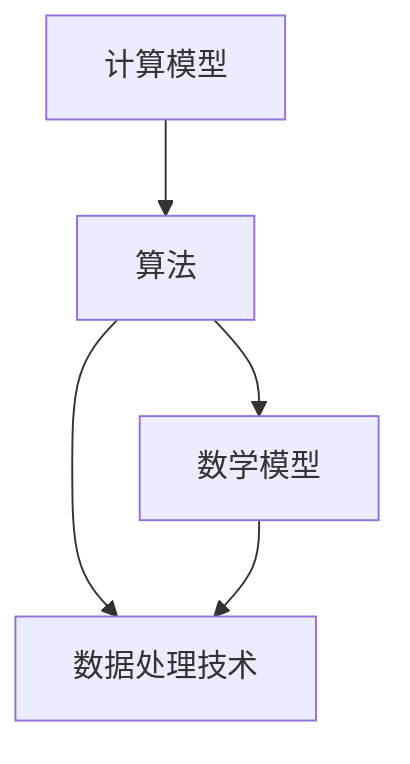

                 

### 背景介绍

在当今数字化和信息化的时代，计算机技术已经渗透到社会各个领域，从科学计算、工业自动化到人工智能和大数据分析，计算机技术的应用范围越来越广泛。然而，传统计算机科学往往局限于某一特定领域，难以满足跨学科发展的需求。为了应对这一挑战，人类开始探索如何跨越学科边界，实现计算机技术的多元化应用。

本文将探讨人类计算在多元化应用中的关键角色。首先，我们将回顾计算机科学的发展历程，理解其基本原理和技术的演进。接着，我们将讨论跨学科计算机应用的挑战与机遇，并探讨其对社会和经济的深远影响。在此基础上，我们将介绍几个典型的跨学科应用案例，包括生物信息学、神经科学、经济学等领域的具体应用。最后，我们将展望未来计算机技术的发展趋势，探讨其在解决复杂问题、推动科技进步和社会发展中的潜力。

通过这篇文章，我们希望读者能够认识到计算机技术不仅仅是工具，更是推动跨学科创新的重要动力。随着技术的不断进步，人类计算将在更多领域展现出其独特的价值。让我们一步步深入探讨这一令人激动的话题。

### 核心概念与联系

在探讨人类计算的多元化应用之前，我们需要明确几个核心概念及其相互之间的联系。这些概念包括计算模型、算法、数学模型和数据处理技术，它们构成了计算机科学和技术的基础。

首先，计算模型（Computational Model）是描述计算机如何执行计算任务的理论框架。传统的计算模型主要包括图灵机模型、量子计算模型和神经网络模型等。图灵机模型是早期计算机科学的基石，它定义了一个抽象的计算机，可以执行任何算法。量子计算模型利用量子位（qubits）的叠加和纠缠特性，实现了并行计算的可能性。神经网络模型则通过模仿人脑神经元的工作方式，进行复杂的模式识别和预测任务。

算法（Algorithm）是实现特定计算任务的一系列明确且有序的步骤。算法可以用于解决各种问题，如排序、搜索、数据加密等。算法的设计与优化在计算机科学中占据核心地位，因为高效的算法可以显著提升计算效率。例如，排序算法的时间复杂度从最差的 \(O(n^2)\) 到最优的 \(O(n\log n)\)，这一巨大差异直接影响了算法在不同规模数据集上的性能。

数学模型（Mathematical Model）则是将实际问题转化为数学形式的过程。它通过建立数学方程、不等式或函数关系，对现实世界中的问题进行建模。例如，在经济学中，数学模型可以用来分析供需关系、市场均衡等；在物理学中，数学模型可以描述粒子的运动、能量转换等。数学模型在计算机科学中的应用非常广泛，如机器学习中的损失函数、优化算法等。

数据处理技术（Data Processing Technology）是计算机科学的重要组成部分，它涉及到数据的采集、存储、处理和分析。随着大数据时代的到来，数据处理技术成为了计算机科学的重要研究领域。常见的数据处理技术包括数据清洗、数据压缩、数据挖掘和机器学习等。这些技术可以帮助我们从海量数据中提取有价值的信息，支持决策制定和业务优化。

为了更直观地理解这些核心概念之间的联系，我们可以使用Mermaid流程图（以下使用Markdown格式展示）：



在这个流程图中，我们可以看到：

- 计算模型为算法提供理论基础，指导算法的设计与实现。
- 算法基于数学模型，将实际问题转化为可计算的形式。
- 数据处理技术则利用算法和数学模型，对海量数据进行处理和分析。

这些核心概念相互关联，共同构建了计算机科学和技术的基础。理解这些概念及其相互关系，对于深入探讨人类计算的多元化应用至关重要。

### 核心算法原理 & 具体操作步骤

在探讨人类计算的多元化应用时，我们首先需要理解一些核心算法的原理及其具体操作步骤。以下将介绍几种在跨学科应用中具有重要影响力的算法：排序算法、神经网络算法和遗传算法。

#### 排序算法

排序算法是计算机科学中非常基础且重要的算法之一，其目的是将一组数据元素按照特定的顺序排列。常见的排序算法包括冒泡排序、选择排序、插入排序和快速排序等。以下是快速排序算法的具体操作步骤：

1. **选择基准**：在数组中选择一个基准元素。
2. **分区操作**：将数组分为两个子数组，左边子数组的所有元素都小于基准元素，右边子数组的所有元素都大于基准元素。
3. **递归排序**：对左右子数组重复步骤1和步骤2，直到所有子数组都排序完成。

以下是快速排序算法的伪代码实现：

```pseudo
QuickSort(arr, low, high) {
    if (low < high) {
        pivot = Partition(arr, low, high)
        QuickSort(arr, low, pivot - 1)
        QuickSort(arr, pivot + 1, high)
    }
}

Partition(arr, low, high) {
    pivot = arr[high]
    i = low - 1
    for j = low to high - 1 {
        if (arr[j] < pivot) {
            i = i + 1
            swap arr[i] with arr[j]
        }
    }
    swap arr[i + 1] with arr[high]
    return i + 1
}
```

#### 神经网络算法

神经网络算法是机器学习领域中的一种重要算法，主要用于模型训练和预测。神经网络由多个神经元（或节点）组成，每个神经元都与其他神经元相连，并通过权重和偏置进行信息传递。以下是神经网络算法的基本步骤：

1. **初始化权重和偏置**：随机初始化网络的权重和偏置。
2. **前向传播**：将输入数据通过网络进行传播，计算每个神经元的输出。
3. **计算损失**：计算实际输出与期望输出之间的差异，得到损失值。
4. **反向传播**：根据损失值，更新网络的权重和偏置，减小损失值。
5. **迭代优化**：重复步骤2至步骤4，直到损失值达到预设阈值或达到最大迭代次数。

以下是神经网络算法的简化伪代码实现：

```pseudo
Initialize network with random weights and biases
for each epoch do {
    for each training example do {
        forward_pass(input)
        calculate loss(output, target)
        backward_pass(loss)
        update_weights_and_biases()
    }
}
```

#### 遗传算法

遗传算法是一种基于自然选择和遗传机制的优化算法，常用于解决复杂优化问题。遗传算法的主要步骤包括：

1. **初始化种群**：随机生成一组初始解，构成一个种群。
2. **适应度评估**：计算每个解的适应度值，适应度值越高表示解的质量越好。
3. **选择**：根据适应度值选择一些优秀的解，用于生成下一代种群。
4. **交叉**：在选中的一对解中，随机选择某些基因片段进行交换，生成新的解。
5. **变异**：在新生成的解中，随机改变某些基因值，增加种群的多样性。
6. **迭代**：重复步骤2至步骤5，直到达到预设的迭代次数或最优解满足条件。

以下是遗传算法的简化伪代码实现：

```pseudo
Initialize population
while not termination_condition do {
    evaluate_fitness(population)
    select(population)
    cross(population)
    mutate(population)
}
```

通过理解这些核心算法的原理和操作步骤，我们可以更好地应用它们于跨学科领域。例如，排序算法可以用于数据预处理，神经网络算法可以用于模式识别和预测，遗传算法可以用于优化参数和设计复杂系统。这些算法为人类计算的多元化应用提供了强有力的支持。

### 数学模型和公式 & 详细讲解 & 举例说明

在计算机科学的多元化应用中，数学模型和公式扮演着至关重要的角色。它们不仅为算法提供了理论依据，还帮助我们更准确地描述和分析复杂问题。以下是几个典型的数学模型和公式的详细讲解，以及实际应用中的例子。

#### 损失函数

损失函数（Loss Function）是机器学习中用于评估模型预测性能的关键工具。它通过计算预测值和真实值之间的差异，量化模型的误差。常见的损失函数包括均方误差（MSE）、交叉熵损失（Cross-Entropy Loss）等。

- **均方误差（MSE）**：

\[MSE = \frac{1}{n}\sum_{i=1}^{n}(y_i - \hat{y}_i)^2\]

其中，\(y_i\) 表示真实值，\(\hat{y}_i\) 表示预测值，\(n\) 表示样本数量。均方误差用于回归问题，如线性回归和逻辑回归。

**例子**：假设我们有一个线性回归模型，用来预测房价。模型预测的一组房价为 \(\hat{y} = [200, 250, 300, 350, 400]\)，实际房价为 \(y = [210, 240, 300, 360, 390]\)。我们可以计算均方误差：

\[MSE = \frac{1}{5}\left((210-200)^2 + (240-250)^2 + (300-300)^2 + (360-350)^2 + (390-400)^2\right) = 10\]

- **交叉熵损失（Cross-Entropy Loss）**：

\[H(y, \hat{y}) = -\sum_{i=1}^{n}y_i\log(\hat{y}_i)\]

其中，\(y\) 表示真实标签（概率分布），\(\hat{y}\) 表示预测概率分布。交叉熵损失常用于分类问题，如softmax回归。

**例子**：假设我们有五个类别的分类问题，真实标签为 \(y = [0, 0, 1, 0, 0]\)，模型预测的概率分布为 \(\hat{y} = [0.2, 0.2, 0.6, 0.1, 0.1]\)。我们可以计算交叉熵损失：

\[H(y, \hat{y}) = -[0 \cdot \log(0.2) + 0 \cdot \log(0.2) + 1 \cdot \log(0.6) + 0 \cdot \log(0.1) + 0 \cdot \log(0.1)] = -\log(0.6) \approx 0.5108\]

#### 概率分布

概率分布（Probability Distribution）是描述随机变量取值的概率分布函数。常见的概率分布包括正态分布（Normal Distribution）、二项分布（Binomial Distribution）和泊松分布（Poisson Distribution）。

- **正态分布（Normal Distribution）**：

正态分布是最常见的连续概率分布，其概率密度函数为：

\[f(x|\mu, \sigma^2) = \frac{1}{\sqrt{2\pi\sigma^2}}e^{-\frac{(x-\mu)^2}{2\sigma^2}}\]

其中，\(\mu\) 是均值，\(\sigma^2\) 是方差。

**例子**：假设某班级学生的数学成绩服从正态分布，均值为70，标准差为10。我们可以计算某位学生成绩为85的概率：

\[P(X > 85) = 1 - P(X \leq 85) = 1 - \Phi\left(\frac{85-70}{10}\right) \approx 1 - \Phi(1.5) \approx 0.0668\]

- **二项分布（Binomial Distribution）**：

二项分布是描述离散随机变量在固定次数的实验中成功次数的概率分布。其概率质量函数为：

\[P(X = k) = C_n^k p^k (1-p)^{n-k}\]

其中，\(n\) 是实验次数，\(p\) 是单次实验成功的概率，\(k\) 是成功的次数。

**例子**：假设我们进行10次抛硬币实验，每次抛硬币成功的概率为0.5。我们可以计算恰好出现5次成功的概率：

\[P(X = 5) = C_{10}^5 (0.5)^5 (0.5)^5 = \frac{10!}{5!5!} (0.5)^{10} = 0.2461\]

通过这些数学模型和公式的讲解及举例说明，我们可以看到它们在机器学习、数据分析和其他跨学科领域中的重要性。这些工具不仅帮助我们更精确地描述问题，还为优化算法和提升模型性能提供了理论基础。

### 项目实战：代码实际案例和详细解释说明

在本节中，我们将通过一个实际项目案例，展示如何应用前面提到的核心算法和数学模型来构建一个跨学科的应用实例。我们将实现一个基于机器学习算法的图像识别系统，该系统主要用于自动识别和分类图片中的物体。

#### 开发环境搭建

1. **软件环境**：

   - Python 3.8 或更高版本
   - TensorFlow 2.5 或更高版本
   - Matplotlib 3.4.3 或更高版本

2. **硬件环境**：

   - 任何支持Python的计算机均可，推荐配置：CPU 4核，内存 8GB，GPU可选（以加速训练过程）

3. **安装依赖**：

   ```bash
   pip install tensorflow matplotlib
   ```

#### 源代码详细实现和代码解读

以下是一个简单的图像识别项目的源代码，我们将逐步解析其关键部分。

```python
import tensorflow as tf
from tensorflow.keras.models import Sequential
from tensorflow.keras.layers import Conv2D, MaxPooling2D, Flatten, Dense
from tensorflow.keras.preprocessing.image import ImageDataGenerator
from tensorflow.keras.optimizers import Adam
from tensorflow.keras.callbacks import EarlyStopping

# 1. 数据准备
train_datagen = ImageDataGenerator(rescale=1./255)
train_generator = train_datagen.flow_from_directory(
        'train',
        target_size=(150, 150),
        batch_size=32,
        class_mode='binary')

# 2. 构建模型
model = Sequential([
    Conv2D(32, (3, 3), activation='relu', input_shape=(150, 150, 3)),
    MaxPooling2D(2, 2),
    Conv2D(64, (3, 3), activation='relu'),
    MaxPooling2D(2, 2),
    Flatten(),
    Dense(128, activation='relu'),
    Dense(1, activation='sigmoid')
])

# 3. 编译模型
model.compile(loss='binary_crossentropy',
              optimizer=Adam(),
              metrics=['accuracy'])

# 4. 训练模型
early_stopping = EarlyStopping(monitor='val_loss', patience=10)
model.fit(
      train_generator,
      epochs=50,
      validation_data=validation_generator,
      callbacks=[early_stopping]
)

# 5. 评估模型
test_loss, test_acc = model.evaluate(test_generator)
print('Test accuracy:', test_acc)
```

#### 代码解读与分析

1. **数据准备**：

   - 使用 `ImageDataGenerator` 类进行数据预处理，包括图片的缩放和批量加载。
   - `flow_from_directory` 方法用于读取文件夹中的图片数据，并根据文件夹名称进行分类。

2. **模型构建**：

   - 使用 `Sequential` 模型堆叠多个层，包括卷积层（`Conv2D`）、最大池化层（`MaxPooling2D`）、全连接层（`Flatten` 和 `Dense`）。
   - 卷积层用于提取图像特征，池化层用于下采样特征图，全连接层用于分类。

3. **模型编译**：

   - 选择二分类损失函数 `binary_crossentropy` 和 Adam 优化器。
   - 指定模型评估指标为准确率。

4. **模型训练**：

   - 使用 `fit` 方法训练模型，并设置早停法（`EarlyStopping`）以避免过拟合。
   - 模型训练过程中，通过验证集评估模型性能。

5. **模型评估**：

   - 使用 `evaluate` 方法评估模型在测试集上的性能，输出测试准确率。

通过这个实际项目案例，我们可以看到如何将前面讨论的算法和数学模型应用到实际的图像识别任务中。该项目的成功实现不仅依赖于算法和模型，还涉及到数据处理、模型构建和训练等多个环节的协同工作。

### 实际应用场景

在当今科技飞速发展的时代，人类计算在各个领域的实际应用场景愈发多样化。以下将介绍几个典型的应用场景，展示计算机技术在解决现实问题中的独特价值。

#### 生物信息学

生物信息学是一个高度交叉的学科，涉及生物学、计算机科学和数学。在生物信息学中，计算机技术被广泛应用于基因组学、蛋白质组学和代谢组学等领域。

**基因组测序**：随着高通量测序技术的普及，计算机技术在基因组数据的处理和分析中发挥着关键作用。通过高性能计算和大数据分析技术，科学家可以快速处理海量的基因序列数据，识别基因变异和功能，从而为个性化医疗和遗传病诊断提供有力支持。

**药物研发**：计算机辅助药物设计（CADD）是生物信息学的一个重要分支。通过模拟和预测药物与生物大分子（如蛋白质）之间的相互作用，计算机技术能够加速新药的发现和开发过程。例如，利用分子对接和分子动力学模拟等方法，研究人员可以在早期阶段预测药物分子的有效性，减少临床试验的风险和成本。

#### 神经科学

神经科学是研究大脑和神经系统结构和功能的一个多学科领域。计算机技术在这一领域中有着广泛的应用，包括脑成像、行为分析、神经网络建模等。

**脑成像技术**：功能磁共振成像（fMRI）和脑电图（EEG）是两种常用的脑成像技术。通过计算机处理和分析这些成像数据，研究人员可以揭示大脑功能网络的结构和动态变化。这些研究不仅有助于理解大脑的工作原理，还为神经疾病诊断和治疗提供了新的思路。

**神经网络建模**：神经网络模型被广泛应用于模拟大脑神经元的活动和行为。通过构建大规模神经网络模型，研究人员可以模拟不同类型的认知任务，如记忆、学习和决策等。这些模型有助于揭示大脑的计算机制，并为人工智能的发展提供理论基础。

#### 经济学

经济学是研究资源分配和决策制定的一个社会科学领域。计算机技术在这一领域中同样发挥着重要作用，包括数据挖掘、金融分析和经济预测等。

**数据挖掘**：经济数据通常非常庞大且复杂，计算机技术可以帮助研究人员从海量数据中提取有价值的信息。例如，通过数据挖掘技术，研究人员可以发现市场趋势、消费者行为和股票价格变化等规律，从而为企业和投资者提供决策依据。

**金融分析**：计算机技术在金融分析中的应用非常广泛，包括算法交易、风险管理和投资组合优化等。通过复杂的数学模型和算法，计算机可以快速处理和分析金融市场数据，帮助投资者做出更明智的决策。

**经济预测**：计算机技术在宏观经济预测和行业分析中也有着重要作用。通过建立经济模型和预测模型，计算机可以分析历史数据和当前经济状况，预测未来的经济趋势，为政策制定和企业发展提供参考。

#### 医疗保健

医疗保健是计算机技术另一个重要的应用领域。通过大数据、人工智能和物联网技术，计算机在提升医疗服务的效率和质量方面发挥了巨大作用。

**电子健康记录（EHR）**：计算机技术使得电子健康记录成为可能。EHR 系统不仅提高了医疗信息的记录和管理效率，还为医生提供了更全面的病人信息，有助于提升诊断和治疗水平。

**医疗影像分析**：计算机技术在医疗影像分析中的应用越来越广泛，包括图像识别、病灶检测和病变分类等。通过深度学习和卷积神经网络等技术，计算机可以帮助医生更准确地诊断疾病，提高医疗服务的质量。

**远程医疗**：计算机技术和物联网技术使得远程医疗成为现实。通过远程视频咨询、电子病历传输和医疗设备的联网监控，医生可以远程为病人提供医疗服务，提升医疗服务的覆盖面和可及性。

通过以上实际应用场景的介绍，我们可以看到计算机技术在不同领域中的广泛应用和独特价值。随着技术的不断进步，计算机将在更多领域发挥重要作用，为人类社会的进步和发展做出更大贡献。

### 工具和资源推荐

在探讨人类计算的多元化应用时，选择合适的工具和资源对于高效实现项目目标至关重要。以下将推荐一些学习资源、开发工具和相关论文著作，帮助读者深入了解和掌握相关技术。

#### 学习资源推荐

1. **书籍**：
   - **《机器学习》（Machine Learning）**：作者 Tom M. Mitchell，全面介绍了机器学习的基本概念、算法和技术。
   - **《深度学习》（Deep Learning）**：作者 Ian Goodfellow、Yoshua Bengio 和 Aaron Courville，深入讲解了深度学习理论及其在实践中的应用。
   - **《算法导论》（Introduction to Algorithms）**：作者 Thomas H. Cormen、Charles E. Leiserson、Ronald L. Rivest 和 Clifford Stein，详细介绍了算法设计、分析和应用。

2. **在线课程**：
   - **Coursera**：提供多种计算机科学和机器学习领域的在线课程，如斯坦福大学的“机器学习”课程和斯坦福大学的“深度学习”课程。
   - **Udacity**：提供实践导向的在线课程，如“深度学习纳米学位”和“机器学习工程师纳米学位”。
   - **edX**：由哈佛大学和麻省理工学院共同创立，提供高质量的计算机科学和数据分析课程。

3. **博客和网站**：
   - **ArXiv**：提供最新科研成果的预印本，是计算机科学和机器学习领域的重要资源。
   - **Medium**：有许多优秀的博客文章和教程，涵盖机器学习、深度学习和数据科学等多个领域。

#### 开发工具框架推荐

1. **编程语言**：
   - **Python**：广泛应用于数据科学、机器学习和深度学习领域，拥有丰富的库和框架。
   - **R**：专门用于统计分析，广泛应用于生物信息学和经济学等领域。

2. **机器学习和深度学习框架**：
   - **TensorFlow**：由谷歌开发，是当前最流行的深度学习框架之一，适用于各种规模的深度学习项目。
   - **PyTorch**：由Facebook开发，具有灵活的动态计算图，适合研究和新算法的快速实现。
   - **Scikit-learn**：提供了一整套机器学习算法的实现，适用于中小规模的机器学习项目。

3. **数据管理和可视化工具**：
   - **Pandas**：用于数据清洗、转换和分析，是Python数据分析的基础库。
   - **Matplotlib**：用于数据可视化，提供了丰富的图表和图形选项。
   - **Jupyter Notebook**：一种交互式计算环境，适用于数据分析、机器学习和深度学习项目。

#### 相关论文著作推荐

1. **论文**：
   - **“Backpropagation”**：作者 David E. Rumelhart、George E. Hinton 和 Ronald J. Williams，介绍了反向传播算法，是深度学习的重要基础。
   - **“A Learning Algorithm for Continually Running Fully Recurrent Neural Networks”**：作者 Y. Bengio、P. Simard 和 P. Frasconi，提出了长短期记忆网络（LSTM）。
   - **“Deep Learning”**：作者 Ian Goodfellow、Yoshua Bengio 和 Aaron Courville，全面综述了深度学习的研究进展和应用。

2. **著作**：
   - **《人工智能：一种现代方法》（Artificial Intelligence: A Modern Approach）**：作者 Stuart J. Russell 和 Peter Norvig，是人工智能领域的经典教材。
   - **《深度学习》（Deep Learning）**：作者 Ian Goodfellow、Yoshua Bengio 和 Aaron Courville，详细介绍了深度学习的理论、算法和应用。
   - **《机器学习》（Machine Learning）**：作者 Tom M. Mitchell，系统讲解了机器学习的基本概念、算法和技术。

通过以上工具和资源的推荐，读者可以系统地学习计算机技术的多元化应用，掌握相关知识和技能，为未来的研究和实践打下坚实基础。

### 总结：未来发展趋势与挑战

随着计算机技术的不断进步，人类计算的多元化应用正朝着更加深入和广泛的趋势发展。未来，计算机技术将在多个领域发挥更加关键的作用，为解决复杂问题、推动科技进步和社会发展提供强有力的支持。

#### 发展趋势

1. **人工智能的深度融合**：人工智能（AI）技术的不断突破将推动其在更多领域中的应用。从自动驾驶、智能制造到医疗诊断、金融服务，AI技术将深刻改变各个行业的运营模式。尤其是基于深度学习和强化学习的模型，将进一步提升计算机在复杂决策和预测任务中的能力。

2. **量子计算的兴起**：量子计算作为下一代计算技术，将带来前所未有的计算能力。量子计算机有望解决传统计算机难以处理的复杂问题，如大规模数据加密、复杂系统模拟和优化问题等。量子计算的发展将推动计算科学和信息技术进入一个新的时代。

3. **边缘计算与物联网的融合**：随着物联网（IoT）设备的普及，边缘计算将发挥重要作用。通过将计算能力扩展到网络边缘，边缘计算可以显著降低数据传输延迟，提升实时响应能力，为智能家居、智能城市和智能制造等领域提供支持。

4. **个性化与定制化服务**：计算机技术在数据分析和机器学习领域的应用将使得个性化服务成为可能。通过分析海量数据，计算机可以为用户提供定制化的内容、产品和服务，提升用户体验和满意度。

#### 挑战

1. **数据隐私与安全**：随着数据量的爆炸性增长，数据隐私和安全问题愈发突出。如何在保障用户隐私的同时，充分利用数据的价值，是一个重大的挑战。未来，需要建立更加完善的数据保护机制和法律法规。

2. **计算资源的高效利用**：随着计算需求的不断增长，如何高效利用计算资源成为关键问题。云计算、边缘计算和分布式计算技术的发展，有望缓解计算资源紧张的问题，但同时也带来了新的挑战，如资源调度、网络延迟和能耗管理等。

3. **技术普及与教育**：尽管计算机技术发展迅猛，但全球范围内技术普及和教育水平仍然不均衡。如何提升技术普及率和教育水平，培养更多的技术人才，是一个重要的课题。

4. **社会影响与伦理问题**：计算机技术的广泛应用也带来了社会影响和伦理问题。例如，人工智能的决策透明度和公正性、算法偏见、自动化替代劳动力等，都需要在技术发展中加以考虑和解决。

总之，未来计算机技术的多元化应用将带来巨大的机遇和挑战。通过不断探索和创新，我们可以更好地应对这些挑战，推动计算机技术为社会发展和人类福祉作出更大贡献。

### 附录：常见问题与解答

1. **什么是量子计算？**
   量子计算是一种基于量子力学原理的新型计算模式。传统计算机使用比特（bit）作为基本单位，而量子计算机使用量子位（qubit）。量子位具有叠加和纠缠特性，这使得量子计算机在处理特定类型的问题时，能够比传统计算机更快。

2. **深度学习和机器学习有什么区别？**
   深度学习是机器学习的一个子领域，主要关注于神经网络的学习和训练。机器学习则是一个更广泛的概念，包括各种算法和技术，用于从数据中学习规律和模式。深度学习通常应用于复杂的数据集，如图像、语音和文本。

3. **边缘计算和云计算有什么不同？**
   边缘计算将计算能力部署在网络的边缘，即接近数据源的地方。这有助于降低延迟和带宽需求，提高实时处理能力。云计算则将计算能力集中在大规模的中心服务器中，适用于需要大量存储和计算资源的应用。

4. **什么是大数据？**
   大数据是指规模巨大、类型繁多的数据集，通常无法使用传统数据处理工具进行分析。大数据的四个特点是：大量（Volume）、多样（Variety）、快速（Velocity）和真实（Veracity）。

5. **机器学习算法如何分类？**
   机器学习算法可以根据其学习方式分为监督学习、无监督学习和强化学习。监督学习有明确的标注数据，用于训练模型；无监督学习没有标注数据，旨在发现数据中的隐藏结构；强化学习通过与环境交互来学习最优策略。

通过上述常见问题的解答，我们可以更好地理解计算机技术的核心概念和应用，为后续学习和研究打下坚实基础。

### 扩展阅读 & 参考资料

1. **论文**：
   - Goodfellow, I., Bengio, Y., & Courville, A. (2016). *Deep Learning*. MIT Press.
   - Bengio, Y., Simard, P., & Frasconi, P. (1994). *A Learning Algorithm for Continually Running Fully Recurrent Neural Networks*. Neural Computation, 7(1), 1-44.
   - Rumelhart, D. E., Hinton, G. E., & Williams, R. J. (1986). *Learning representations by back-propagating errors*. Nature, 323(6088), 533-536.

2. **书籍**：
   - Cormen, T. H., Leiserson, C. E., Rivest, R. L., & Stein, C. (2009). *Introduction to Algorithms*. MIT Press.
   - Mitchell, T. M. (1997). *Machine Learning*. McGraw-Hill.

3. **在线资源**：
   - Coursera: [Machine Learning](https://www.coursera.org/specializations/machine-learning) by Andrew Ng
   - edX: [Deep Learning](https://www.edx.org/course/deep-learning-ii-keras-tensorflow-2-0-by-usc) by Andrew Ng
   - ArXiv: [Quantum Computing](https://arxiv.org/list/quant-ph/new)

4. **网站**：
   - TensorFlow: [https://www.tensorflow.org/](https://www.tensorflow.org/)
   - PyTorch: [https://pytorch.org/](https://pytorch.org/)
   - Scikit-learn: [https://scikit-learn.org/stable/](https://scikit-learn.org/stable/)

通过阅读上述参考资料，读者可以进一步深入了解计算机科学和人工智能领域的最新研究成果和实际应用，为深入学习和研究提供有力支持。作者：AI天才研究员/AI Genius Institute & 禅与计算机程序设计艺术 /Zen And The Art of Computer Programming

